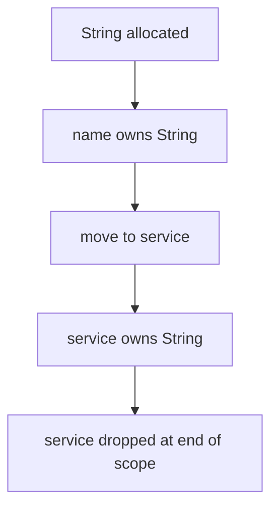
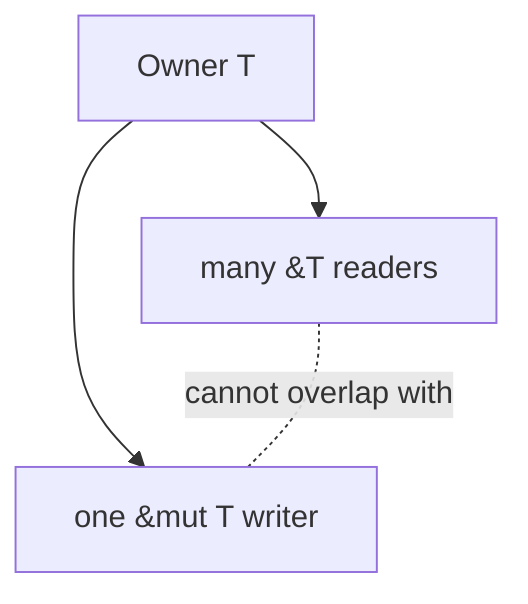
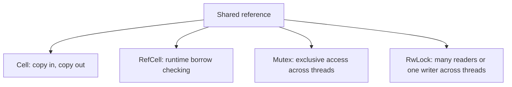

Purpose: Build a rigorous model of Rust ownership, borrowing, lifetimes, interior mutability, and smart pointers so memory safety choices are deliberate in production code.

# Ownership, Borrowing, and Lifetimes

Related notes: [01 Rust Language Fundamentals](/compendium/rust/rust-language-fundamentals), [03 Types Traits and Generics](/compendium/rust/types-traits-and-generics), [07 Concurrency Parallelism and Synchronization](/compendium/rust/concurrency-parallelism-and-synchronization), [Data Structures/Data Structures](/compendium/data-structures/data-structures), [07 Concurrency Parallelism and Synchronization#Lock-free programming concepts](/compendium/rust/concurrency-parallelism-and-synchronization#lock-free-programming-concepts), <span className="compendium-external-reference" title="Vault-only reference">Software testing</span>

Rust's core safety promise is that ordinary safe code cannot use freed memory, double free memory, or create data races. The language achieves this with ownership, borrowing, lifetimes, and a small set of opt-in abstractions for shared ownership and interior mutability.

This note explains the rules as engineering tools, not compiler trivia.

## Ownership Model

Every value has one owner. When the owner goes out of scope, the value is dropped. Ownership can move to another binding, function, collection, or closure.

```rust
fn main() {
    let name = String::from("api");
    let service = name;

    println!("{service}");
    // println!("{name}"); // compile error: name was moved
}
```



Ownership answers:

- Who is responsible for cleanup?
- Can this value be used after passing it somewhere?
- Can references into this value outlive it?
- Can mutation occur while aliases exist?

## Moves

A move transfers ownership. Types that own heap memory, file descriptors, sockets, locks, or other resources usually move by default.

```rust
fn consume(value: String) {
    println!("{value}");
}

fn main() {
    let value = String::from("payload");
    consume(value);
    // value is no longer available here
}
```

Moving into and out of collections is ordinary ownership transfer.

```rust
fn take_first(mut values: Vec<String>) -> Option<String> {
    if values.is_empty() {
        None
    } else {
        Some(values.remove(0))
    }
}
```

For efficient removal without preserving order, prefer `swap_remove`.

```rust
fn remove_fast(values: &mut Vec<String>, index: usize) -> Option<String> {
    if index < values.len() {
        Some(values.swap_remove(index))
    } else {
        None
    }
}
```

## Copy vs Clone

`Copy` means assignment duplicates bits and the old binding remains usable. `Clone` means explicit duplication through `clone()`.

```rust
#[derive(Copy, Clone, Debug, PartialEq, Eq)]
struct Port(u16);

fn main() {
    let a = Port(8080);
    let b = a;

    println!("{a:?} {b:?}");
}
```

```rust
fn main() {
    let a = String::from("large payload");
    let b = a.clone();

    println!("{a} {b}");
}
```

Tradeoffs:

| Trait | Meaning | Cost model | Good for | Avoid for |
|---|---|---|---|---|
| `Copy` | Implicit bitwise duplication | Must be cheap and resource-neutral | Small IDs, numeric wrappers, flags | Owning heap buffers, handles, locks |
| `Clone` | Explicit duplication | Type-defined and possibly expensive | Owned data that sometimes needs duplication | Hiding ownership design problems |
| Neither | Move-only | Ownership must be explicit | Sockets, files, guards, unique resources | Values that are clearly small and immutable |

Production guidance:

- Derive `Copy` only when duplicate values behave like simple values, not resource owners.
- Treat `.clone()` as a design signal. It may be correct, but it should be visible and intentional.
- Clone at boundaries when retaining one copy and sending another is the real requirement.

## Drop and Destructors

`Drop` runs when a value goes out of scope. It is used for resource cleanup.

```rust
struct TempFile {
    path: std::path::PathBuf,
}

impl Drop for TempFile {
    fn drop(&mut self) {
        let _ = std::fs::remove_file(&self.path);
    }
}
```

Drop order is deterministic:

- Local variables are dropped in reverse declaration order.
- Struct fields are dropped in declaration order after the struct's `drop` method runs.
- Collection elements are dropped when the collection drops, though exact element drop order should not be a business invariant.

Important constraints:

- `drop` cannot return errors. Log carefully or expose explicit close methods for fallible cleanup.
- Panicking in `drop` during another panic can abort the process.
- `std::mem::drop(value)` explicitly drops a value early.
- `std::mem::forget(value)` intentionally prevents drop and should be rare.

## References and Borrowing

A reference borrows a value without taking ownership.

```rust
fn len(value: &String) -> usize {
    value.len()
}

fn main() {
    let value = String::from("payload");
    let n = len(&value);

    println!("{value} has length {n}");
}
```

Prefer `&str` over `&String` in APIs:

```rust
fn len_text(value: &str) -> usize {
    value.len()
}
```

Borrowing rules:

- Any number of shared references `&T`.
- Or exactly one mutable reference `&mut T`.
- Shared and mutable references cannot overlap in ways that would allow unsynchronized mutation through aliases.
- References cannot outlive the value they point to.



Mutable borrow example:

```rust
fn normalize(values: &mut Vec<String>) {
    for value in values {
        value.make_ascii_lowercase();
    }
}
```

Common mistake:

```rust
fn invalid(values: &mut Vec<String>) {
    let first = values.first();
    values.push(String::from("new"));
    println!("{first:?}");
}
```

The immutable borrow from `first` may point into the vector. Pushing could reallocate the vector and invalidate that reference. Structure code so the borrow ends before mutation.

```rust
fn valid(values: &mut Vec<String>) {
    let first = values.first().cloned();
    values.push(String::from("new"));
    println!("{first:?}");
}
```

## Lifetimes

Lifetimes describe how long references are valid. They are usually inferred. Explicit lifetime parameters are needed when a function returns a reference related to an input reference and the relationship is ambiguous.

```rust
fn longest<'a>(left: &'a str, right: &'a str) -> &'a str {
    if left.len() >= right.len() {
        left
    } else {
        right
    }
}
```

The lifetime `'a` does not extend either input. It describes that the returned reference is valid only as long as both possible inputs are valid.

Bad mental model:

- A lifetime annotation does not make a value live longer.
- A lifetime is not a runtime timer.
- A lifetime is not ownership.

Good mental model:

- A lifetime is a static relationship between borrows.
- It lets the compiler reject references that could outlive their source.
- It documents which input a returned reference may come from.

## Lifetime Elision

Rust applies elision rules so common signatures do not need explicit lifetime syntax.

```rust
fn first_word(input: &str) -> &str {
    input.split_whitespace().next().unwrap_or("")
}
```

This is treated like:

```rust
fn first_word_explicit<'a>(input: &'a str) -> &'a str {
    input.split_whitespace().next().unwrap_or("")
}
```

Elision rules in practical form:

| Situation | Rule |
|---|---|
| Each input reference | Gets its own inferred lifetime |
| Exactly one input lifetime | Assigned to all elided output lifetimes |
| Method with `&self` or `&mut self` | Output elided lifetime is tied to `self` |

When there are multiple input references and the output could come from more than one, annotate.

```rust
fn choose<'a>(primary: &'a str, fallback: &'a str, use_fallback: bool) -> &'a str {
    if use_fallback {
        fallback
    } else {
        primary
    }
}
```

## Static Lifetime

`'static` means a reference is valid for the entire program, or a type contains no non-static references when used as a bound.

```rust
const DEFAULT_REGION: &str = "us-east-1";

fn default_region() -> &'static str {
    DEFAULT_REGION
}
```

Important distinction:

| Form | Meaning |
|---|---|
| `&'static str` | A string slice that lives for the whole program |
| `T: 'static` | `T` does not contain non-static borrowed references |

`T: 'static` does not mean the value itself will never be dropped. It means the type can be owned without borrowing stack data.

```rust
use std::thread;

fn spawn_owned_message(message: String) -> thread::JoinHandle<()> {
    thread::spawn(move || {
        println!("{message}");
    })
}
```

Thread closures usually require `'static` because the thread may outlive the caller's stack frame. Moving owned data into the closure satisfies that bound.

## Slices, Strings, and Borrowed Views

Slices are references into contiguous data.

```rust
fn middle(values: &[i32]) -> &[i32] {
    if values.len() <= 2 {
        &[]
    } else {
        &values[1..values.len() - 1]
    }
}
```

String slices are borrowed views into UTF-8 text.

```rust
fn domain(email: &str) -> Option<&str> {
    let (_, domain) = email.split_once('@')?;
    Some(domain)
}
```

`String` owns text. `&str` borrows text. `str` is dynamically sized and is usually used behind a pointer such as `&str`, `Box&lt;str&gt;`, or `Arc&lt;str&gt;`.

API table:

| Need | Use |
|---|---|
| Read caller text | `&str` |
| Store owned text | `String` |
| Share immutable text across owners | `Arc&lt;str&gt;` or `Arc&lt;String&gt;` |
| Return borrowed substring | `&str` with input lifetime |
| Avoid allocation unless mutation is needed | `Cow&lt;'a, str&gt;` |

## Interior Mutability

Interior mutability allows mutation through a shared reference by moving borrow checking from compile time to runtime or synchronization primitives.



Use it when the ownership graph is correct but ordinary `&mut` access is impractical.

### Cell

`Cell&lt;T&gt;` supports getting and setting `Copy` values without references to the inside.

```rust
use std::cell::Cell;

struct Counter {
    value: Cell<u64>,
}

impl Counter {
    fn increment(&self) {
        self.value.set(self.value.get() + 1);
    }

    fn get(&self) -> u64 {
        self.value.get()
    }
}
```

Use for small `Copy` state in single-threaded code.

### RefCell

`RefCell&lt;T&gt;` enforces borrowing rules at runtime. Violations panic.

```rust
use std::cell::RefCell;

struct Recorder {
    events: RefCell<Vec<String>>,
}

impl Recorder {
    fn record(&self, event: impl Into<String>) {
        self.events.borrow_mut().push(event.into());
    }

    fn snapshot(&self) -> Vec<String> {
        self.events.borrow().clone()
    }
}
```

Use for single-threaded graphs, test doubles, caches, or logically internal mutation. Do not use it to avoid designing clear ownership in core data flow.

### Mutex

`Mutex&lt;T&gt;` provides exclusive mutable access across threads.

```rust
use std::sync::{Arc, Mutex};
use std::thread;

fn parallel_count() -> usize {
    let count = Arc::new(Mutex::new(0usize));
    let mut handles = Vec::new();

    for _ in 0..4 {
        let count = Arc::clone(&count);
        handles.push(thread::spawn(move || {
            let mut guard = count.lock().expect("counter mutex poisoned");
            *guard += 1;
        }));
    }

    for handle in handles {
        handle.join().expect("worker panicked");
    }

    *count.lock().expect("counter mutex poisoned")
}
```

The lock guard releases the lock when dropped. Keep guard scopes short.

### RwLock

`RwLock&lt;T&gt;` allows many readers or one writer.

```rust
use std::collections::HashMap;
use std::sync::RwLock;

struct Registry {
    services: RwLock<HashMap<String, String>>,
}

impl Registry {
    fn get(&self, name: &str) -> Option<String> {
        self.services.read().ok()?.get(name).cloned()
    }

    fn insert(&self, name: String, endpoint: String) {
        self.services
            .write()
            .expect("registry lock poisoned")
            .insert(name, endpoint);
    }
}
```

Use `RwLock` when reads dominate and read sections are substantial enough to justify the complexity. A plain `Mutex` is often faster and simpler under contention.

Interior mutability tradeoffs:

| Type | Thread-safe | Failure mode | Best use |
|---|---:|---|---|
| `Cell&lt;T&gt;` | No | No borrow references into value | Small `Copy` fields |
| `RefCell&lt;T&gt;` | No | Panic on invalid borrow | Single-threaded internal mutation |
| `Mutex&lt;T&gt;` | Yes when `T: Send` | Lock poisoning, blocking | Shared mutable state across threads |
| `RwLock&lt;T&gt;` | Yes when `T: Send + Sync` | Lock poisoning, blocking | Read-heavy shared state |

## Smart Pointers

Smart pointers are types that behave like pointers but add ownership, sharing, allocation, borrowing, or cleanup semantics.

| Type | Ownership | Thread-safe | Primary use |
|---|---|---:|---|
| `Box&lt;T&gt;` | Unique owner on heap | Depends on `T` | Recursive types, trait objects, large moves |
| `Rc&lt;T&gt;` | Shared owner, non-atomic count | No | Single-threaded shared ownership |
| `Arc&lt;T&gt;` | Shared owner, atomic count | Yes when `T: Send + Sync` | Cross-thread shared ownership |
| `Cow&lt;'a, T&gt;` | Borrowed or owned | Depends on contained type | Clone on write and allocation avoidance |
| `RefCell&lt;T&gt;` | Unique owner with runtime borrow checks | No | Interior mutability |
| `Mutex&lt;T&gt;` | Unique owner with synchronized access | Yes when `T: Send` | Shared mutation across threads |

### Box

`Box&lt;T&gt;` stores `T` on the heap with unique ownership.

```rust
enum List {
    Cons(i32, Box<List>),
    Nil,
}
```

Without `Box`, the recursive enum would have infinite size. `Box` gives the enum a known pointer-sized field.

Trait object example:

```rust
trait Render {
    fn render(&self) -> String;
}

struct Text(String);

impl Render for Text {
    fn render(&self) -> String {
        self.0.clone()
    }
}

fn make_renderer(text: String) -> Box<dyn Render> {
    Box::new(Text(text))
}
```

Use `Box&lt;dyn Trait&gt;` when runtime polymorphism is more appropriate than generics. See [03 Types Traits and Generics](/compendium/rust/types-traits-and-generics).

### Rc

`Rc&lt;T&gt;` enables multiple owners in single-threaded code.

```rust
use std::rc::Rc;

#[derive(Debug)]
struct Node {
    name: String,
}

fn share_node() {
    let node = Rc::new(Node {
        name: String::from("root"),
    });

    let left = Rc::clone(&node);
    let right = Rc::clone(&node);

    println!("{} {} {}", node.name, left.name, right.name);
}
```

`Rc::clone` increments the reference count. It does not deep-clone the inner value.

Avoid reference cycles with `Weak&lt;T&gt;` for back edges.

```rust
use std::cell::RefCell;
use std::rc::{Rc, Weak};

struct TreeNode {
    parent: RefCell<Weak<TreeNode>>,
    children: RefCell<Vec<Rc<TreeNode>>>,
}
```

### Arc

`Arc&lt;T&gt;` is atomically reference-counted and can be shared across threads.

```rust
use std::sync::Arc;
use std::thread;

fn fan_out(config: Arc<String>) {
    let mut handles = Vec::new();

    for _ in 0..4 {
        let config = Arc::clone(&config);
        handles.push(thread::spawn(move || {
            println!("config={config}");
        }));
    }

    for handle in handles {
        handle.join().expect("worker panicked");
    }
}
```

`Arc&lt;T&gt;` gives shared ownership, not automatic mutation. Combine with `Mutex&lt;T&gt;`, `RwLock&lt;T&gt;`, atomics, or channels when mutation or coordination is required. See [07 Concurrency Parallelism and Synchronization](/compendium/rust/concurrency-parallelism-and-synchronization).

### Cow

`Cow&lt;'a, B&gt;` is clone-on-write: it can hold a borrowed value or an owned value.

```rust
use std::borrow::Cow;

fn normalize_label(input: &str) -> Cow<'_, str> {
    let trimmed = input.trim();

    if trimmed == input && input.chars().all(|ch| !ch.is_uppercase()) {
        Cow::Borrowed(input)
    } else {
        Cow::Owned(trimmed.to_ascii_lowercase())
    }
}
```

Use `Cow` when the common path can borrow and only uncommon paths require allocation.

## Deref and Deref Coercion

`Deref` lets smart pointers expose borrowed access to an inner value. `DerefMut` adds mutable access.

```rust
use std::ops::Deref;

struct UserName(String);

impl Deref for UserName {
    type Target = str;

    fn deref(&self) -> &Self::Target {
        &self.0
    }
}

fn greet(name: &str) {
    println!("hello {name}");
}

fn main() {
    let name = UserName(String::from("victor"));
    greet(&name);
}
```

Deref coercion lets `&UserName` become `&str` because `UserName: Deref&lt;Target = str&gt;`.

Use `Deref` carefully:

- Good for smart pointers and transparent newtypes.
- Risky for domain types where method lookup becomes surprising.
- Not a replacement for explicit accessors when conversion has semantics.

Built-in examples:

| From | To | Why it works |
|---|---|---|
| `&String` | `&str` | `String` derefs to `str` |
| `&Vec&lt;T&gt;` | `&[T]` | `Vec&lt;T&gt;` derefs to slice |
| `&Box&lt;T&gt;` | `&T` | `Box&lt;T&gt;` derefs to inner value |
| `&Arc&lt;T&gt;` | `&T` | `Arc&lt;T&gt;` derefs to inner value |

## Ownership in Containers

Containers own their elements unless they store references or smart pointers.

```rust
use std::collections::HashMap;

fn index_by_name(users: Vec<User>) -> HashMap<String, User> {
    users
        .into_iter()
        .map(|user| (user.name.clone(), user))
        .collect()
}

struct User {
    name: String,
}
```

Borrowed index:

```rust
use std::collections::HashMap;

fn borrowed_index<'a>(users: &'a [User]) -> HashMap<&'a str, &'a User> {
    users.iter().map(|user| (user.name.as_str(), user)).collect()
}

struct User {
    name: String,
}
```

The borrowed index cannot outlive `users`. This is often exactly right for temporary lookup tables inside a request or batch job.

Container ownership table:

| Shape | Example | Lifetime behavior |
|---|---|---|
| Owned values | `Vec&lt;String&gt;` | Collection owns elements |
| Borrowed values | `Vec&lt;&'a str&gt;` | Collection cannot outlive sources |
| Shared values | `Vec&lt;Arc&lt;User&gt;&gt;` | Values live while any owner remains |
| Interior mutable shared values | `Vec&lt;Arc&lt;Mutex&lt;User&gt;&gt;&gt;` | Shared ownership plus synchronized mutation |

## Borrowing and Iterators

Iterator choice controls ownership.

```rust
fn read_only(values: &[String]) -> usize {
    values.iter().filter(|value| !value.is_empty()).count()
}

fn mutate(values: &mut [String]) {
    values.iter_mut().for_each(|value| value.make_ascii_lowercase());
}

fn consume(values: Vec<String>) -> Vec<usize> {
    values.into_iter().map(|value| value.len()).collect()
}
```

Use the least ownership needed:

- `iter()` when reading.
- `iter_mut()` when modifying in place.
- `into_iter()` when consuming or transforming ownership.

## Designing APIs Around Ownership

```rust
use std::path::{Path, PathBuf};

struct Config {
    path: PathBuf,
}

impl Config {
    fn load(path: impl AsRef<Path>) -> std::io::Result<Self> {
        let path = path.as_ref();
        let _contents = std::fs::read_to_string(path)?;

        Ok(Self {
            path: path.to_path_buf(),
        })
    }

    fn path(&self) -> &Path {
        &self.path
    }
}
```

Guidelines:

- Accept borrowed data when reading.
- Store owned data when the struct must outlive the call.
- Use `Into&lt;T&gt;` when callers should be able to pass several owned forms.
- Use `AsRef&lt;T&gt;` when callers should be able to pass several borrowed forms.
- Return borrowed references when the result is a view into `self` or an input.
- Return owned values when the result is newly computed or independent.

## Non-Lexical Lifetimes and Last Use

Borrow scopes are based on use, not merely on the enclosing braces. A borrow can end after its last use even when the reference variable remains lexically in scope. This non-lexical lifetime behavior makes mutation after a completed read borrow possible without adding an artificial block.

```rust
let mut names = vec![String::from("Ada")];
let first = &names[0];
println!("{first}");       // Last use of `first`.
names.push(String::from("Grace")); // Mutable access is now legal.
```

This is not a promise that every borrow ends as early as intuition suggests. Borrows stored in aggregates, returned from calls, captured by closures, or coupled through one lifetime parameter may remain live longer. Read the compiler error as a data-flow explanation and inspect the last use and lifetime relationships.

## Reborrowing Mutable References

A mutable reference is move-only, but it can be reborrowed for a shorter lifetime. Reborrowing is fundamental when a function should temporarily use exclusive access without consuming the caller's reference.

```rust
fn increment(value: &mut u64) {
    *value += 1;
}

let mut value = 0;
let exclusive = &mut value;
increment(&mut *exclusive); // Short reborrow.
increment(&mut *exclusive); // The original reference is usable again.
```

During the reborrow, the original `&mut T` is suspended. Neither reference may be used in a way that overlaps exclusive access. This temporal view is more accurate than thinking of `&mut` as merely a pointer with write permission.

### Two-phase borrows

Some compiler-inserted mutable borrows have a reservation phase followed by an activation phase. This permits patterns such as `values.push(values.len())`: the receiver is reserved mutably, `len()` reads the vector, and the mutable borrow activates for `push`. Two-phase borrowing applies only to specific implicit borrows and reborrows. Writing an explicit `&mut values` generally creates an immediately active borrow, so do not depend on two-phase behavior as a broad evaluation-order escape hatch.

## Drop Checking and Destructor Constraints

Drop checking ensures references that a destructor might observe remain valid when `drop` runs. A generic type with a `Drop` implementation can therefore impose stricter lifetime requirements than a structurally similar type without `Drop`.

Key consequences:

- Fields are dropped in declaration order; local variables are dropped in reverse declaration order.
- `Drop::drop` receives `&mut self`; moving fields out directly is not allowed.
- Use `Option&lt;T&gt;::take`, `mem::replace`, or carefully justified `ManuallyDrop&lt;T&gt;` when teardown needs ownership of a field.
- Never rely on destructor execution for critical correctness across process abort, power loss, or reference cycles.
- The unstable and unsafe `#[may_dangle]` escape hatch is for advanced library implementations that prove a destructor does not access selected borrowed data.

## Self-referential Data and Pinning

A normal Rust value may move, so storing a pointer into another field of the same value is unsafe: moving the outer value can invalidate the pointer. Prefer indices, arena handles, owned offsets, or a design that constructs references on demand.

`Pin&lt;P&gt;` is needed only when a value's safety invariant depends on its address. It restricts access through the pinned pointer; it does not pin unrelated aliases and does not make self-referential initialization automatically safe. Types that must not move usually contain `PhantomPinned`, are initialized only after allocation, and expose a narrowly reviewed pinned API. Most application code should consume pinning through futures and established libraries instead of implementing self-referential types.

## Common Mistakes

| Mistake | Symptom | Better approach |
|---|---|---|
| Adding lifetimes to try to fix ownership | More complex errors | Decide who owns the value |
| Returning reference to local data | Compile error | Return owned data |
| Cloning to satisfy borrow checker blindly | Hidden cost and unclear model | Shorten borrows or transfer ownership deliberately |
| Using `Rc&lt;RefCell&lt;T&gt;&gt;` everywhere | Runtime panics and tangled graph | Keep ownership tree simple or use message passing |
| Holding a lock while calling user code | Deadlocks or latency spikes | Extract data, release guard, then call out |
| Using `Arc&lt;T&gt;` for mutation | Cannot mutate through `Arc` alone | Use `Arc&lt;Mutex&lt;T&gt;&gt;`, `Arc&lt;RwLock&lt;T&gt;&gt;`, atomics, or channels |
| Deriving `Copy` on semantic resources | Duplicate handles or misleading APIs | Keep move-only or implement explicit `Clone` |
| Returning `&String` | Overly specific API | Return `&str` |
| Storing references in long-lived structs unnecessarily | Lifetime parameters spread everywhere | Store owned values or smart pointers |

## Production Guidance

- Make ownership boundaries explicit at API edges.
- Prefer simple ownership trees: parent owns children, callers borrow for observation.
- Use `Arc` for shared ownership across threads, not as a default escape hatch.
- Use `Mutex` before `RwLock` unless read-heavy behavior is measured or obvious.
- Keep lock guards, borrow guards, and mutable borrows in the smallest practical scope.
- Prefer `Cow` for allocation avoidance only when profiling or domain flow shows a meaningful borrowed fast path.
- Use `Box` for recursive data, trait objects, or reducing move size of large values.
- Avoid `Rc&lt;RefCell&lt;T&gt;&gt;` in business logic unless the single-threaded graph ownership is inherently shared and cyclic references are handled with `Weak`.
- Use explicit newtypes for owned IDs and validated data; expose borrowed views with `as_str`, `as_slice`, or domain accessors.
- Treat lifetime-heavy public APIs as a usability cost. Sometimes returning owned data is the better engineering tradeoff.

## Review Checklist

- Is every `.clone()` justified by an ownership requirement?
- Could read-only parameters be `&str`, `&[T]`, or `&Path` instead of owned values?
- Are returned references clearly tied to input or `self` lifetimes?
- Are long-lived structs storing owned values instead of unnecessary references?
- Are lock or borrow guard scopes short and visible?
- Is `Rc` limited to single-threaded ownership and `Arc` used for cross-thread ownership?
- Are cycles using `Weak` where appropriate?
- Does `Drop` avoid fallible business logic and panics?
- Are `Copy` derives limited to cheap, simple value types?
- Are smart pointers documenting real ownership semantics rather than hiding design uncertainty?

## Primary Sources

- [The Rust Book: understanding ownership](https://doc.rust-lang.org/book/ch04-00-understanding-ownership.html)
- [The Rust Reference: behavior considered undefined](https://doc.rust-lang.org/reference/behavior-considered-undefined.html)
- [The Rustonomicon: subtyping and variance](https://doc.rust-lang.org/nomicon/subtyping.html)
- [The Rustonomicon: drop checking](https://doc.rust-lang.org/nomicon/dropck.html)
- [`std::pin` module documentation](https://doc.rust-lang.org/std/pin/)
- [Rust compiler development guide: borrow checking](https://rustc-dev-guide.rust-lang.org/borrow_check.html)
