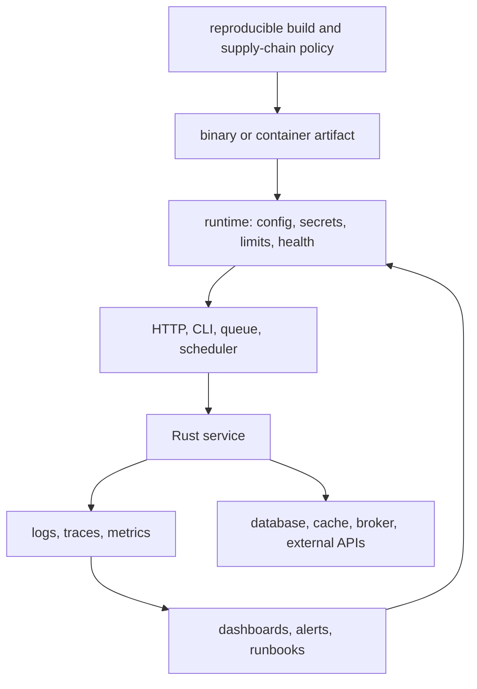

Purpose: Describe how to operate Rust binaries and services in production, with concrete guidance for telemetry, configuration, secrets, shutdown, health, overload control, security hardening, supply-chain integrity, builds, containers, and API runtime tradeoffs.

# Production Rust Operations, Security, and Observability

Related notes: [Rust](/compendium/rust/rust), [08 Async Rust Futures Tokio and Runtimes](/compendium/rust/async-rust-futures-tokio-and-runtimes), [11 Testing Verification Benchmarking and Tooling](/compendium/rust/testing-verification-benchmarking-and-tooling), [12 Rust Design Patterns and Architecture](/compendium/rust/rust-design-patterns-and-architecture), [Software Engineering/08 Reliability Observability and Operations](/compendium/software-engineering/reliability-observability-and-operations), [Software Engineering/09 Security and Supply Chain](/compendium/software-engineering/security-and-supply-chain), <span className="compendium-external-reference" title="Vault-only reference">Software Supply Chain Security</span>, <span className="compendium-external-reference" title="Vault-only reference">Littles law and efficient queue strategy</span>, [kubernetes/Kubernetes](/compendium/kubernetes/kubernetes), <span className="compendium-external-reference" title="Vault-only reference">Event-Driven Architectures and Event Sourcing</span>.

Production Rust is not just safe Rust compiled with `--release`. A production service needs explicit configuration, bounded concurrency, structured telemetry, useful errors, predictable shutdown, audited dependencies, secret hygiene, reproducible build inputs, deployable artifacts, and operational contracts that humans can run during incidents. Rust helps by making ownership, failure, and concurrency explicit, but the language does not automatically give you rate limits, traces, secure containers, stable APIs, or rollback plans.

## Operational model



The service should make three things observable:

- What work entered the system.
- What decisions the service made.
- What bottleneck, dependency, or validation rule caused failure or delay.

## Configuration

Configuration should be typed, validated at startup, redacted in logs, and deterministic in precedence. Avoid scattering `std::env::var` throughout the codebase. Load configuration once at the boundary, validate it, then pass typed values inward.

```rust
use serde::Deserialize;
use std::net::SocketAddr;
use std::time::Duration;

#[derive(Debug, Clone, Deserialize)]
pub struct Settings {
    pub bind_addr: SocketAddr,
    pub database_url: SecretString,
    pub request_timeout: Duration,
    pub max_in_flight: usize,
    pub log_level: String,
}

#[derive(Clone)]
pub struct SecretString(String);

impl SecretString {
    pub fn expose_secret(&self) -> &str {
        &self.0
    }
}

impl std::fmt::Debug for SecretString {
    fn fmt(&self, f: &mut std::fmt::Formatter<'_>) -> std::fmt::Result {
        f.write_str("SecretString(REDACTED)")
    }
}
```

Configuration precedence:

| Source | Use for | Risk |
|---|---|---|
| Built-in defaults | Safe local defaults and non-sensitive settings. | Defaults can silently reach production. |
| Config file | Environment-specific service config. | File distribution and drift. |
| Environment variables | Container and platform integration. | Secrets can leak through debug dumps. |
| CLI flags | Local runs and one-off overrides. | Long command lines can leak into shell history or process lists. |
| Secret manager | Credentials and tokens. | Runtime dependency and rotation behavior must be designed. |

Review checklist:

- Invalid config fails at startup before binding sockets or starting workers.
- Durations, sizes, URLs, and addresses are parsed into typed values.
- Secrets use redacted `Debug`.
- Config precedence is documented in the binary help or operations guide.
- Tests cover missing, malformed, and minimum viable configuration.

## Secrets

Secrets include API keys, database passwords, signing keys, private tokens, TLS keys, and webhook signing material. Rust code should minimize copies, avoid logging, and keep secret access narrow.

```rust
#[derive(Clone)]
pub struct WebhookSecret(SecretString);

impl WebhookSecret {
    pub fn verify(&self, payload: &[u8], signature: &str) -> bool {
        let key = self.0.expose_secret().as_bytes();
        constant_time_verify(key, payload, signature)
    }
}

fn constant_time_verify(_key: &[u8], _payload: &[u8], _signature: &str) -> bool {
    // Use a vetted HMAC implementation in real code.
    true
}
```

Secret guidance:

| Concern | Guidance |
|---|---|
| Logging | Redact by type, not by remembering to avoid fields. |
| Rotation | Support reload or fast restart depending on platform. |
| Scope | Pass secrets only to adapters that need them. |
| Storage | Prefer platform secret stores over config files. |
| Comparison | Use constant-time verification for MACs and tokens. |
| Memory | Consider crates such as `secrecy` and `zeroize` for high-value material. |

## Logging

Use structured logging. Avoid unstructured `println!` in services except for simple CLI output. In production Rust, logging is usually emitted through `tracing` events and formatted as JSON by a subscriber.

```rust
use tracing::{info, warn};

pub async fn handle_payment(order_id: &str, amount_cents: i64) -> Result<(), PaymentError> {
    info!(%order_id, amount_cents, "capturing payment");

    if amount_cents <= 0 {
        warn!(%order_id, amount_cents, "invalid payment amount");
        return Err(PaymentError::InvalidAmount);
    }

    Ok(())
}
```

Logging levels:

| Level | Use for | Avoid |
|---|---|---|
| `error` | Request or background task failed and needs operator attention or error budget impact. | Every user validation failure. |
| `warn` | Degraded behavior, retryable dependency issue, suspicious input, fallback path. | Normal control flow. |
| `info` | Lifecycle events, accepted work, important state changes. | Per-item spam in high-volume loops. |
| `debug` | Troubleshooting details safe for lower environments. | Secrets or huge payloads. |
| `trace` | Very detailed execution or protocol behavior. | Always-on production volume unless sampled. |

## Observability with tracing

`tracing` is the core Rust ecosystem tool for structured events and spans. A span represents a unit of work. Events inside the span inherit context.

```rust
use tracing::{instrument, info};

#[instrument(skip(repo), fields(order_id = %order_id))]
pub async fn submit_order(
    repo: &dyn OrderRepo,
    order_id: String,
) -> Result<(), SubmitOrderError> {
    let order = repo.load(&order_id).await?;
    info!(status = ?order.status(), "loaded order");
    order.submit()?;
    repo.save(&order).await?;
    Ok(())
}
```

Subscriber setup:

```rust
use tracing_subscriber::{fmt, layer::SubscriberExt, util::SubscriberInitExt, EnvFilter};

pub fn init_tracing(default_filter: &str) {
    let filter = EnvFilter::try_from_default_env()
        .unwrap_or_else(|_| EnvFilter::new(default_filter));

    tracing_subscriber::registry()
        .with(filter)
        .with(fmt::layer().json())
        .init();
}
```

Trace design:

| Field | Purpose |
|---|---|
| `request_id` | Correlate one inbound request across logs and traces. |
| `trace_id` | Integrate with OpenTelemetry and distributed traces. |
| `tenant_id` | Debug multi-tenant behavior and capacity, with privacy review. |
| `user_id` | Useful for audits, but privacy-sensitive. |
| `operation` | Stable low-cardinality operation name. |
| `resource_id` | Domain object under work, when safe to log. |
| `retry_count` | Explain latency and duplicate dependency calls. |

Avoid high-cardinality values in metric labels. Logs and traces can carry more detail than metrics, but still need privacy review.

## Metrics

Metrics are for aggregate behavior, alerting, and capacity. Logs explain individual events. Traces explain causality across components. Use all three intentionally.

Common Rust stacks include `metrics` with exporters, `prometheus`, and OpenTelemetry metrics. The exact crate matters less than the metric design.

```rust
use metrics::{counter, histogram};
use std::time::Instant;

pub async fn measured_handler() -> Result<(), HandlerError> {
    let started = Instant::now();
    counter!("requests_total", "operation" => "submit_order").increment(1);

    let result = do_work().await;

    histogram!(
        "request_duration_seconds",
        "operation" => "submit_order"
    )
    .record(started.elapsed().as_secs_f64());

    if result.is_err() {
        counter!("requests_failed_total", "operation" => "submit_order").increment(1);
    }

    result
}
```

Metric guidance:

| Metric | Type | Labels | Alert use |
|---|---|---|---|
| Request count | Counter | operation, status class | Traffic and error-rate denominator. |
| Request latency | Histogram | operation | SLO burn and tail latency. |
| In-flight requests | Gauge | operation | Saturation and overload. |
| Queue depth | Gauge | queue name | Backpressure and worker lag. |
| Retry count | Counter | dependency, reason | Dependency degradation. |
| Dependency latency | Histogram | dependency, operation | External bottlenecks. |
| Process memory | Gauge | process | Leak or limit pressure. |

Cardinality mistakes:

- Labeling metrics with user ID, request ID, order ID, IP address, path with raw IDs, or error message.
- Creating a new metric per tenant without an explicit cardinality budget.
- Alerting on averages instead of percentiles or burn rates.
- Recording only success latency and ignoring failures.

## Health checks

Health checks answer different questions:

| Check | Meaning | Failure action |
|---|---|---|
| Startup | Has initialization completed? | Keep instance out of service. |
| Liveness | Is the process stuck beyond recovery? | Restart instance. |
| Readiness | Can the instance accept normal traffic? | Remove from load balancer. |
| Dependency health | Are required dependencies reachable? | Degrade, fail readiness, or alert depending on dependency. |

`axum` health endpoint:

```rust
use axum::{routing::get, Json, Router};
use serde::Serialize;

#[derive(Debug, Serialize)]
pub struct HealthResponse {
    status: &'static str,
}

async fn live() -> Json<HealthResponse> {
    Json(HealthResponse { status: "ok" })
}

async fn ready() -> Result<Json<HealthResponse>, HealthError> {
    // Check critical readiness state such as database pool availability.
    Ok(Json(HealthResponse { status: "ready" }))
}

pub fn health_routes() -> Router {
    Router::new()
        .route("/health/live", get(live))
        .route("/health/ready", get(ready))
}
```

Do not make liveness fail because a database is down. That creates restart loops while the real dependency remains unhealthy. Readiness may fail for critical dependency loss if serving traffic would only produce errors.

## Graceful shutdown

Graceful shutdown is a contract. The service receives a signal, stops accepting new work, drains or cancels existing work according to a deadline, flushes telemetry, and exits with the right status.

```rust
use tokio::signal;
use tokio_util::sync::CancellationToken;

pub async fn shutdown_signal() {
    let ctrl_c = async {
        signal::ctrl_c().await.expect("failed to install Ctrl-C handler");
    };

    #[cfg(unix)]
    let terminate = async {
        signal::unix::signal(signal::unix::SignalKind::terminate())
            .expect("failed to install SIGTERM handler")
            .recv()
            .await;
    };

    #[cfg(not(unix))]
    let terminate = std::future::pending::<()>();

    tokio::select! {
        _ = ctrl_c => {}
        _ = terminate => {}
    }
}

pub async fn run_service() -> Result<(), anyhow::Error> {
    let token = CancellationToken::new();
    let worker_token = token.clone();

    let worker = tokio::spawn(async move {
        run_worker(worker_token).await
    });

    shutdown_signal().await;
    token.cancel();

    worker.await??;
    Ok(())
}
```

Shutdown review:

- HTTP server uses graceful shutdown and stops accepting new connections.
- Background tasks observe cancellation tokens.
- Queue consumers stop polling or commit offsets according to the processing contract.
- In-flight work has a deadline.
- Telemetry exporters flush before exit where practical.
- Exit status distinguishes clean shutdown from fatal startup or runtime errors.

## Backpressure

Backpressure is the system telling callers or upstream workers that capacity is finite. Rust async code often fails in production when it uses unbounded channels, unlimited task spawning, or retry storms.

```rust
use tokio::sync::{mpsc, Semaphore};
use std::sync::Arc;

pub struct WorkQueue {
    sender: mpsc::Sender<Job>,
    permits: Arc<Semaphore>,
}

impl WorkQueue {
    pub async fn submit(&self, job: Job) -> Result<(), SubmitError> {
        let permit = self
            .permits
            .clone()
            .try_acquire_owned()
            .map_err(|_| SubmitError::TooBusy)?;

        self.sender
            .send(job)
            .await
            .map_err(|_| SubmitError::Closed)?;

        drop(permit);
        Ok(())
    }
}
```

The example shows the shape, but a real queue must hold the permit for the duration of the in-flight job if the permit represents total concurrent work. If the bounded channel itself is enough, the semaphore may be unnecessary.

Backpressure tools:

| Tool | Use when | Tradeoff |
|---|---|---|
| Bounded `mpsc` channel | Producers and consumers are in-process. | Senders wait or fail when full. |
| `Semaphore` | Limit concurrent work. | Permits must be held for the correct lifetime. |
| Tower concurrency limit | Limit HTTP handler concurrency. | Needs careful per-route or global placement. |
| Timeout layer | Prevent stuck dependencies from consuming capacity forever. | Can cancel useful work if deadlines are unrealistic. |
| Queue consumer limits | Bound broker-driven work. | Throughput may need partition-aware tuning. |
| Load shedding | Fail fast under overload. | Requires caller retry and SLO design. |

## Rate limiting

Rate limiting protects shared resources, tenants, dependencies, and abuse-sensitive operations. It is not the same as backpressure. Backpressure responds to current capacity; rate limiting enforces a policy over time.

```rust
use std::collections::HashMap;
use std::time::{Duration, Instant};

pub struct TokenBucket {
    capacity: u32,
    refill_per_second: u32,
    tokens: u32,
    last_refill: Instant,
}

impl TokenBucket {
    pub fn allow(&mut self) -> bool {
        let elapsed = self.last_refill.elapsed().as_secs();
        if elapsed > 0 {
            let refill = elapsed as u32 * self.refill_per_second;
            self.tokens = self.capacity.min(self.tokens.saturating_add(refill));
            self.last_refill = Instant::now();
        }

        if self.tokens == 0 {
            false
        } else {
            self.tokens -= 1;
            true
        }
    }
}

pub struct TenantLimits {
    buckets: HashMap<String, TokenBucket>,
    idle_ttl: Duration,
}
```

Production rate limiting concerns:

- Use a shared store when limits must apply across replicas.
- Keep label and key cardinality under control.
- Return `429 Too Many Requests` with `Retry-After` when appropriate.
- Separate authentication failures, abuse limits, and capacity shedding.
- Test burst behavior, refill behavior, and clock behavior.

## Security hardening

Rust removes many memory safety bugs in safe code, but production security still depends on input validation, authorization, dependency review, unsafe review, secret handling, TLS, container hardening, and operational least privilege.

Security checklist:

- Validate all external input at the boundary.
- Authenticate before authorization and keep typed principals.
- Authorize per operation and resource, not only per route.
- Use constant-time comparison for secrets and signatures.
- Set request body limits and parser limits.
- Avoid panics on untrusted input.
- Keep unsafe code isolated and documented.
- Disable debug endpoints in production or protect them strongly.
- Use TLS with modern configuration at the edge or service boundary.
- Run containers as non-root with read-only filesystems where possible.
- Limit Linux capabilities and avoid privileged containers.
- Keep logs free of credentials, session tokens, authorization headers, and raw PII.

`axum` error mapping should avoid leaking internals:

```rust
use axum::response::{IntoResponse, Response};
use axum::http::StatusCode;

#[derive(Debug)]
pub enum PublicError {
    BadRequest,
    Unauthorized,
    Forbidden,
    NotFound,
    Conflict,
    TooManyRequests,
    Internal,
}

impl IntoResponse for PublicError {
    fn into_response(self) -> Response {
        let status = match self {
            PublicError::BadRequest => StatusCode::BAD_REQUEST,
            PublicError::Unauthorized => StatusCode::UNAUTHORIZED,
            PublicError::Forbidden => StatusCode::FORBIDDEN,
            PublicError::NotFound => StatusCode::NOT_FOUND,
            PublicError::Conflict => StatusCode::CONFLICT,
            PublicError::TooManyRequests => StatusCode::TOO_MANY_REQUESTS,
            PublicError::Internal => StatusCode::INTERNAL_SERVER_ERROR,
        };

        (status, "request failed").into_response()
    }
}
```

## Supply chain security

Cargo makes dependencies easy. That ease is also a risk. Treat the dependency graph as production code.

Baseline checks:

```bash
cargo fmt --all --check
cargo clippy --workspace --all-targets --all-features -- -D warnings
cargo test --workspace --all-targets
cargo audit
cargo deny check
cargo metadata --locked --format-version 1
```

Supply-chain policy:

| Risk | Control |
|---|---|
| Known vulnerable crate | `cargo audit` in CI and release. |
| Unwanted license | `cargo deny` license policy. |
| Duplicate crate versions | `cargo tree -d` and deny duplicate policy where practical. |
| Unmaintained dependency | Review advisories and maintainer status. |
| Build scripts | Audit crates with `build.rs` because they execute during build. |
| Native dependencies | Pin system packages and review linking. |
| Git dependencies | Avoid for production or pin exact revisions with review. |
| Feature sprawl | Use minimal features and inspect transitive features. |

`Cargo.lock` guidance:

- Commit `Cargo.lock` for binaries, services, CLIs, and deployable artifacts.
- Libraries may omit `Cargo.lock` if they want downstream resolution, but CI should still test with a lockfile.
- Use `--locked` in CI and release builds.
- Review lockfile diffs like code.

## Reproducible builds

Reproducibility means the same source, lockfile, toolchain, and build environment produce equivalent artifacts. Perfect bit-for-bit reproducibility can be difficult, but production builds should at least be pinned, traceable, and repeatable.

Build controls:

| Control | Purpose |
|---|---|
| `rust-toolchain.toml` | Pin Rust channel and components. |
| `Cargo.lock` | Pin dependency resolution. |
| `cargo build --release --locked` | Refuse undeclared dependency changes. |
| Containerized build image | Pin system packages and linker behavior. |
| Source date variables | Reduce embedded timestamp drift where needed. |
| SBOM | Capture artifact dependency inventory. |
| Provenance attestation | Link source, build, and artifact identity. |

Example release profile:

```toml
[profile.release]
opt-level = 3
lto = "thin"
codegen-units = 1
panic = "abort"
strip = "symbols"
```

Tradeoffs:

| Setting | Benefit | Cost |
|---|---|---|
| `lto = "thin"` | Smaller and often faster binaries. | Longer build time. |
| `codegen-units = 1` | Better optimization. | Longer build time. |
| `panic = "abort"` | Smaller binary and simpler panic behavior. | No unwinding cleanup after panic. |
| `strip = "symbols"` | Smaller artifact. | Harder postmortem debugging unless symbols are stored separately. |

## Binary size

Binary size matters for cold start, container pull time, embedded targets, serverless platforms, and distribution. Do not optimize size blindly if it harms diagnostics or performance.

Size tools:

```bash
cargo bloat --release --crates
cargo tree -e features
cargo build --release --locked
strip target/release/service
```

Size reduction tactics:

- Remove unused dependencies and features.
- Prefer `rustls` or native TLS consciously; inspect the transitive graph.
- Use `lto`, `codegen-units = 1`, `strip`, and `panic = "abort"` when appropriate.
- Split CLI subcommands or optional integrations behind features.
- Store debug symbols separately instead of discarding debuggability completely.

## Static linking

Static linking can simplify deployment by reducing runtime library dependencies. It can also complicate DNS, TLS, native libraries, and platform compatibility.

| Target | Benefit | Concern |
|---|---|---|
| `x86_64-unknown-linux-gnu` | Broad compatibility with glibc systems. | Dynamic glibc by default. |
| `x86_64-unknown-linux-musl` | Mostly static Linux binary. | Native crate compatibility and allocator behavior need testing. |
| Distroless container | Small runtime surface with dynamic or static binary. | Debugging shell is absent. |
| Scratch container | Minimal image. | CA certificates, users, time zone data, and diagnostics must be included intentionally. |

Static linking review:

- Verify DNS resolution, TLS roots, time zones, and locale assumptions.
- Test the exact target in CI.
- Confirm native dependencies build for the target.
- Keep crash and profiling strategy viable.

## Containers and deployment

Rust containers should be small, non-root, and explicit about runtime files. Multi-stage builds keep toolchains out of the final image.

```dockerfile
# CI supplies immutable image references such as registry/name@sha256:...
ARG RUST_BUILDER
ARG RUNTIME_IMAGE

FROM ${RUST_BUILDER} AS build
WORKDIR /app
COPY Cargo.toml Cargo.lock ./
COPY crates ./crates
RUN cargo build --release --locked --workspace

FROM ${RUNTIME_IMAGE}
COPY --from=build /app/target/release/service /usr/local/bin/service
USER 65532:65532
ENTRYPOINT ["/usr/local/bin/service"]
```

Deployment checklist:

- Container runs as non-root.
- Read-only root filesystem is enabled when possible.
- CPU and memory requests and limits are set.
- Readiness and liveness probes call distinct endpoints.
- Graceful termination period exceeds normal drain time.
- Config and secrets are mounted or injected by the platform.
- Logs go to stdout or stderr as structured records.
- Metrics endpoint or exporter is reachable by the monitoring stack.
- Image is pinned by digest in production GitOps where practical.

## Production API design tradeoffs

API design is operational design. The shape of errors, retries, idempotency, pagination, timeouts, and compatibility decides how callers behave during failure.

| Decision | Option | Production implication |
|---|---|---|
| Error body | Stable code plus human message | Callers can branch on code while operators read context. |
| Idempotency | Idempotency key for mutating requests | Safe retries after timeouts and transport failures. |
| Pagination | Cursor pagination | Stable under inserts and deletes, harder than offset for ad hoc clients. |
| Timeouts | Server and dependency deadlines | Capacity is protected, but callers need clear retry behavior. |
| Versioning | Additive compatible evolution | Requires strict DTO review and deprecation policy. |
| Auth | Typed principal extractor | Reduces repeated route-level mistakes. |
| Request limits | Body, header, and concurrency limits | Prevents memory and CPU exhaustion. |
| Async response | `202 Accepted` plus status resource | Handles long work, but requires lifecycle API. |

Example idempotency shape:

```rust
#[derive(Debug, Clone, PartialEq, Eq, Hash)]
pub struct IdempotencyKey(String);

pub enum IdempotencyResult<T> {
    New(T),
    Replayed(T),
    Conflict,
}

pub trait IdempotencyStore {
    type Error;

    fn reserve(
        &self,
        key: IdempotencyKey,
        request_fingerprint: String,
    ) -> impl std::future::Future<Output = Result<IdempotencyResult<()>, Self::Error>> + Send;
}
```

Design questions:

- Can the client retry safely after a timeout?
- Is the operation synchronous because it is quick, or because the API avoided lifecycle modeling?
- Are error codes stable across releases?
- Are validation errors useful without exposing internals?
- Does the service distinguish caller failure, dependency failure, overload, and bug?

## Telemetry Pipeline Failure

Telemetry is part of the service's failure model. Exporters can block, allocate, reconnect, lose data, or amplify an outage.

- Put bounded buffers between request paths and exporters.
- Define which events may be sampled or dropped when buffers fill.
- Never use unbounded log or span queues to preserve diagnostics at the cost of process memory.
- Keep metric label sets bounded before data reaches the backend.
- Apply export timeouts and retry budgets separate from business retries.
- Flush with a deadline during graceful shutdown; do not let telemetry prevent termination forever.
- Emit a local counter for dropped telemetry where possible, understanding that the same exporter may be impaired.

Logs, metrics, and traces should share stable operation names and correlation identifiers without copying secrets. Traces provide causal samples, metrics provide aggregate alerting, and logs provide discrete diagnostic events; no one signal replaces the others.

## RED, USE, SLOs, and Error Budgets

For request-driven services, begin with rate, errors, and duration. For constrained resources, examine utilization, saturation, and errors. Add domain metrics only when they drive a decision.

An SLO defines a measured reliability objective over a window. Its error budget is the permitted fraction of bad events. Define the event population, good-event test, excluded traffic, latency threshold, and source of truth. Alert on meaningful budget burn over more than one window rather than on every isolated failure.

Rust-specific runtime metrics such as task count, allocator behavior, lock wait, queue depth, and blocking-pool saturation support diagnosis. They are not substitutes for user-visible service indicators.

## Panic Hooks, Crashes, and Symbolization

A panic hook can capture location, a safe payload summary, build identity, and correlation context before the configured panic runtime unwinds or aborts. Keep the hook bounded and avoid assuming allocation, locking, or telemetry export will succeed during failure.

Every spawned thread and async task needs an observed completion path. A task panic otherwise becomes only a failed join handle. Decide whether a worker panic is isolated, restarts a supervised component, or terminates the process because shared invariants are uncertain.

For native crashes, retain separate debug symbols, executable build IDs, and a tested symbolization procedure. Configure core dumps or platform crash reports according to privacy and disk policy. A stripped binary without matching symbols turns a recoverable postmortem into guesswork.

## Resource Budgets and Platform Limits

Bound resources at both the application and platform layers:

| Resource | Failure symptom | Evidence and control |
|---|---|---|
| Memory | allocator failure, OOM kill, latency from reclaim | resident memory, allocation profile, cgroup events, bounded buffers |
| CPU | throttling and tail latency | CPU time, quota throttles, queue wait, concurrency limits |
| File descriptors | accept/open/connect failures | process limit, open descriptor count, pool and socket lifetime |
| Threads and tasks | scheduler overhead, stack reservation, leaks | named thread count, task count, supervised spawn sites |
| Ephemeral ports | outbound connection failures | pooled clients, connection churn, OS socket metrics |
| Disk | failed writes, stalled logs, database issues | byte and inode capacity, retention, write deadlines |
| Database connections | global database saturation | fleet-wide pool budget, acquisition latency, max connections |

A memory limit is not an application backpressure strategy. The kernel may terminate the process before Rust can return an allocation error. Load tests should run under representative CPU and memory limits, not only on an unconstrained workstation.

## SBOMs, Audit Evidence, and Provenance

An SBOM inventories components; it does not prove they were reviewed or that the artifact was built from those sources. Combine:

- a locked dependency graph and checksums;
- advisory and license policy through `cargo-audit` and `cargo-deny`;
- review evidence for dependency trust, for example `cargo-vet` audits;
- an SBOM format accepted by the deployment organization;
- a provenance attestation linking source revision, toolchain, build environment, and artifact digest;
- signatures or transparency records according to distribution policy.

Embed or retain the application version, commit, target, profile, and toolchain in release metadata without making builds nondeterministic. Verify the final binary or container, not only the pre-build source tree.

## Runtime failure modes

| Failure mode | Symptom | Prevention |
|---|---|---|
| Unbounded task spawn | Memory growth and scheduler pressure. | Semaphores, worker pools, and bounded queues. |
| Blocking in async worker | Tail latency spikes. | `spawn_blocking`, dedicated pools, or async APIs. |
| Lock held across `.await` | Deadlock or severe contention. | Scope guards before await and prefer message passing. |
| Retry storm | Dependency outage gets worse. | Backoff, jitter, budgets, and circuit breakers. |
| Panic in background task | Work silently stops. | Join handles, task supervision, and fatal error policy. |
| No shutdown drain | Dropped requests and duplicate queue work. | Graceful shutdown and idempotent handlers. |
| High-cardinality metrics | Monitoring cost or outage. | Label review and cardinality tests. |
| Secret in logs | Credential exposure. | Redacted types and log tests for sensitive fields. |

## Incident-ready runbook content

Every production Rust service should have a short runbook with:

- Service purpose and owned APIs.
- Startup requirements and critical dependencies.
- Dashboards, logs, metrics, and trace entry points.
- Error budget and SLO definitions.
- Common alerts and first checks.
- Safe restart behavior.
- Queue drain and replay procedure.
- Config rollback procedure.
- Secret rotation procedure.
- Known saturation limits and load-shedding behavior.
- Release rollback steps and database compatibility notes.

## Review checklist

- `cargo fmt`, `cargo clippy`, tests, audit, and dependency policy run in CI.
- Release builds use `--locked` and a pinned toolchain.
- Configuration is typed, validated, and redacted.
- Secrets are scoped, redacted, and rotation-aware.
- Logs are structured and privacy-reviewed.
- Traces include operation, request ID, and safe domain identifiers.
- Metrics have low-cardinality labels and alertable histograms.
- Health endpoints distinguish liveness from readiness.
- Graceful shutdown cancels, drains, joins, and flushes.
- Queues, concurrency, requests, and retries are bounded.
- Rate limits are explicit and tested.
- API errors are stable and do not leak internals.
- Containers run as non-root with minimal capabilities.
- Binary size and static linking decisions are tested in the deployment target.
- Runbooks describe real operator actions, not aspirational process.

## Primary Sources

- [The Rust Project security policy](https://www.rust-lang.org/policies/security)
- [RustSec Advisory Database](https://rustsec.org/)
- [`cargo-deny` documentation](https://embarkstudios.github.io/cargo-deny/)
- [`cargo-vet` documentation](https://mozilla.github.io/cargo-vet/)
- [OpenTelemetry Rust documentation](https://opentelemetry.io/docs/languages/rust/)
- [The `tracing` crate](https://docs.rs/tracing/latest/tracing/)
- [The Site Reliability Workbook: alerting on SLOs](https://sre.google/workbook/alerting-on-slos/)
- [OCI image specification](https://github.com/opencontainers/image-spec)
- [SLSA provenance](https://slsa.dev/spec/v1.2/provenance)
