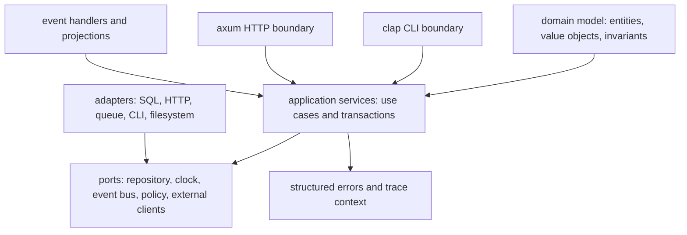
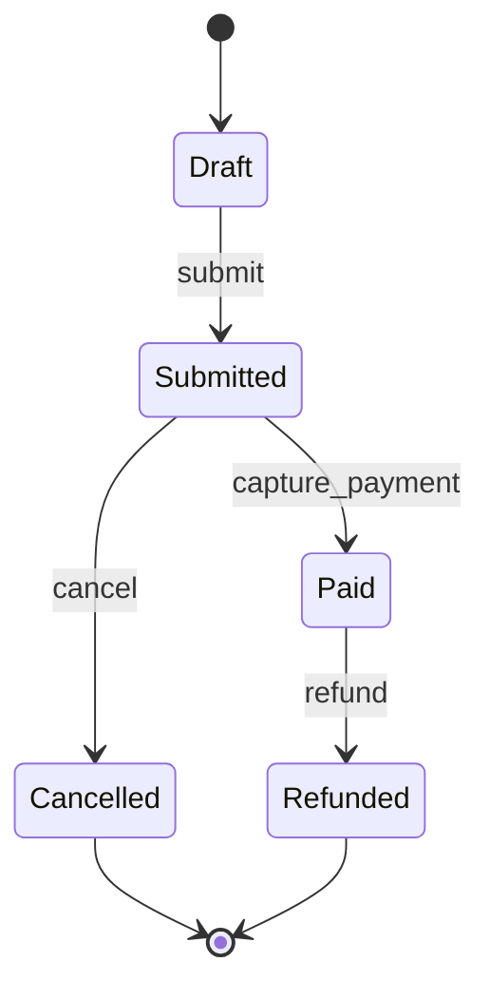
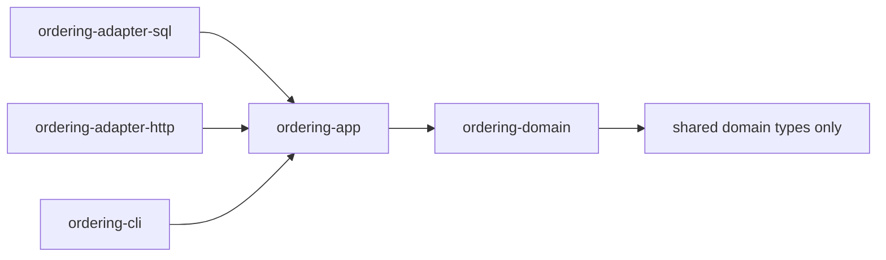

Purpose: Explain how serious Rust systems use types, ownership, traits, modules, and explicit boundaries to encode architecture, not just implementation details.

# Rust Design Patterns and Architecture

Related notes: [Rust](/compendium/rust/rust), [00 Rust Mastery Roadmap](/compendium/rust/rust-mastery-roadmap), [03 Types Traits and Generics](/compendium/rust/types-traits-and-generics), [04 Error Handling and API Design](/compendium/rust/error-handling-and-api-design), [05 Modules Crates Cargo and Workspaces](/compendium/rust/modules-crates-cargo-and-workspaces), [07 Concurrency Parallelism and Synchronization](/compendium/rust/concurrency-parallelism-and-synchronization), [08 Async Rust Futures Tokio and Runtimes](/compendium/rust/async-rust-futures-tokio-and-runtimes), [11 Testing Verification Benchmarking and Tooling](/compendium/rust/testing-verification-benchmarking-and-tooling), [Design Patterns/Design patterns](/compendium/design-patterns/design-patterns), [Software Engineering/07 APIs Contracts and Integration](/compendium/software-engineering/apis-contracts-and-integration), <span className="compendium-external-reference" title="Vault-only reference">Event-Driven Architectures and Event Sourcing</span>.

Rust architecture is best understood as constraint design. The language gives you ownership, enums, pattern matching, traits, modules, visibility, generics, lifetimes, and explicit error handling. Architecture work is deciding which invariants belong in types, which effects belong behind ports, which state transitions must be unrepresentable, which dependencies are allowed to point inward, and which runtime concerns must stay outside the domain.

The common mistake is to import object-oriented patterns mechanically. Rust can express factories, repositories, builders, adapters, strategies, visitors, and state machines, but the idiomatic shape often differs. Enums are stronger than many class hierarchies. Traits are capability contracts, not base classes. Newtypes protect domain boundaries. Builders are useful when construction has optional fields or staged validation. Typestate is useful when the compiler should enforce workflow order. Repository interfaces are useful at domain or application boundaries, but poor repository traits can erase useful database behavior and create leaky abstractions.

## Architecture map



The dependency rule is simple: outer layers know inner layers, inner layers do not know outer layers. Domain code should not depend on `axum`, `sqlx`, `tokio`, `clap`, environment variables, wall-clock time, or message broker clients. Domain code can define ports that outer adapters implement.

## Pattern selection

| Problem | Rust tool | Why it works | Main risk |
|---|---|---|---|
| Prevent mixing IDs, emails, tokens, and raw strings | Newtype pattern | Type identity is enforced at compile time with no runtime cost after optimization. | Too many wrappers without constructors, parsing, display, and serialization support. |
| Construct a complex object with defaults and validation | Builder pattern | Separates incremental input collection from final invariant enforcement. | Builder permits invalid intermediate states and never validates on `build`. |
| Enforce workflow order | Typestate pattern | State is represented in the type parameter, so invalid calls do not compile. | API becomes generic-heavy and hard to use for dynamic workflows. |
| Model closed states or commands | Enums plus pattern matching | Exhaustiveness catches missing cases during refactors. | Huge enums can become dependency magnets. |
| Isolate persistence behind use cases | Repository pattern | Application logic can depend on a narrow port instead of a concrete database. | Over-abstracting queries into CRUD loses important storage semantics. |
| Isolate external systems | Hexagonal architecture | Ports express the needed capability; adapters own infrastructure detail. | Thin pass-through layers add ceremony without protecting invariants. |
| Model asynchronous integrations | Event-driven Rust | Channels, streams, queues, and handlers separate production from consumption. | Unbounded queues hide overload and reorder assumptions. |
| Expose user workflows | `clap` CLI or `axum` web adapter | Boundary crates parse, validate, authorize, and call application services. | Boundary code leaks framework types into the domain. |

## Domain modeling

Domain modeling in Rust means refusing to let meaningless primitives flow through the system. A `String` can be an email address, bearer token, order ID, tenant slug, SQL fragment, or file path. A domain type says which one it is.

```rust
use std::fmt;
use std::str::FromStr;

#[derive(Debug, Clone, PartialEq, Eq, Hash)]
pub struct OrderId(String);

#[derive(Debug, Clone, PartialEq, Eq)]
pub struct Email(String);

#[derive(Debug, Clone, PartialEq, Eq)]
pub enum ParseEmailError {
    Empty,
    MissingAt,
    TooLong,
}

impl FromStr for Email {
    type Err = ParseEmailError;

    fn from_str(input: &str) -> Result<Self, Self::Err> {
        let trimmed = input.trim();

        if trimmed.is_empty() {
            return Err(ParseEmailError::Empty);
        }

        if trimmed.len() > 254 {
            return Err(ParseEmailError::TooLong);
        }

        if !trimmed.contains('@') {
            return Err(ParseEmailError::MissingAt);
        }

        Ok(Self(trimmed.to_ascii_lowercase()))
    }
}

impl fmt::Display for Email {
    fn fmt(&self, f: &mut fmt::Formatter<'_>) -> fmt::Result {
        f.write_str(&self.0)
    }
}
```

The constructor is the boundary. After an `Email` exists, the rest of the system can rely on its invariant. Do not expose public fields unless invalid construction is acceptable.

### Entity and value object split

| Shape | Identity | Equality | Rust representation | Example |
|---|---|---|---|---|
| Value object | Defined by contents | Two values with same fields are equivalent. | Newtype, struct, enum. | `Email`, `Money`, `Percent`, `NonEmptyName`. |
| Entity | Stable identity across changes | Two objects with same ID represent same conceptual object. | Struct with ID newtype and private fields. | `Order`, `Account`, `Deployment`. |
| Aggregate | Consistency boundary | Changes must preserve invariants together. | Struct with methods that return events or errors. | `Order` with line items and payment state. |
| Domain service | Stateless domain operation | Behavior spans multiple entities. | Function or trait-free service struct. | Pricing policy, eligibility check. |

```rust
#[derive(Debug, Clone, PartialEq, Eq, Hash)]
pub struct Sku(String);

#[derive(Debug, Clone, Copy, PartialEq, Eq, PartialOrd, Ord)]
pub struct Cents(i64);

#[derive(Debug, Clone, PartialEq, Eq)]
pub struct LineItem {
    sku: Sku,
    quantity: u32,
    unit_price: Cents,
}

#[derive(Debug, Clone, PartialEq, Eq)]
pub enum OrderStatus {
    Draft,
    Submitted,
    Paid,
    Cancelled,
}

#[derive(Debug)]
pub struct Order {
    id: OrderId,
    status: OrderStatus,
    items: Vec<LineItem>,
}

#[derive(Debug, Clone, PartialEq, Eq)]
pub enum OrderError {
    EmptyOrder,
    AlreadySubmitted,
    CannotModifyPaidOrder,
}

impl Order {
    pub fn submit(&mut self) -> Result<OrderSubmitted, OrderError> {
        match self.status {
            OrderStatus::Draft if self.items.is_empty() => Err(OrderError::EmptyOrder),
            OrderStatus::Draft => {
                self.status = OrderStatus::Submitted;
                Ok(OrderSubmitted {
                    order_id: self.id.clone(),
                })
            }
            OrderStatus::Submitted => Err(OrderError::AlreadySubmitted),
            OrderStatus::Paid | OrderStatus::Cancelled => Err(OrderError::CannotModifyPaidOrder),
        }
    }
}

#[derive(Debug, Clone, PartialEq, Eq)]
pub struct OrderSubmitted {
    pub order_id: OrderId,
}
```

The aggregate method both changes state and emits a domain event. That event can be persisted, published, or ignored by an application service depending on architecture.

## Newtype pattern

The newtype pattern wraps a value in a one-field tuple struct or named-field struct. It gives a primitive a domain meaning and lets you implement traits locally.

```rust
#[derive(Debug, Clone, PartialEq, Eq, Hash)]
pub struct TenantId(String);

#[derive(Debug, Clone, PartialEq, Eq, Hash)]
pub struct UserId(String);

pub fn authorize_user(tenant_id: TenantId, user_id: UserId) {
    // TenantId and UserId cannot be accidentally swapped.
    println!("authorize {user_id:?} in {tenant_id:?}");
}
```

Newtype checklist:

- Make fields private unless invalid construction is acceptable.
- Provide `new`, `parse`, or `FromStr` when validation can fail.
- Implement `Display` for safe human-readable output.
- Avoid implementing `Deref&lt;Target = str&gt;` for domain identifiers unless you want string-like behavior everywhere.
- Derive `Clone`, `Eq`, `Ord`, `Hash`, `Serialize`, and `Deserialize` only when the semantics are correct.
- Use `#[serde(transparent)]` when wire representation should remain the wrapped value.
- Use `NonZeroU64`, `NonEmptyString`, or local validation to encode impossible values.

| Newtype benefit | Example | Tradeoff |
|---|---|---|
| Prevent parameter swaps | `TenantId` vs `UserId` | More boilerplate for parsing and display. |
| Centralize validation | `Email::from_str` | Construction can be more verbose. |
| Attach behavior | `Money::checked_add` | Wrapper must expose needed operations deliberately. |
| Protect secrets | `SecretToken` with custom `Debug` | Must prevent accidental `Display` or serialization leaks. |

```rust
pub struct SecretToken(String);

impl SecretToken {
    pub fn new(value: String) -> Result<Self, &'static str> {
        if value.len() < 32 {
            return Err("token too short");
        }

        Ok(Self(value))
    }

    pub fn expose_for_authorization_header(&self) -> &str {
        &self.0
    }
}

impl std::fmt::Debug for SecretToken {
    fn fmt(&self, f: &mut std::fmt::Formatter<'_>) -> std::fmt::Result {
        f.write_str("SecretToken(REDACTED)")
    }
}
```

## Builder pattern

Builders are useful when a type has many fields, optional settings, defaultable values, or construction that requires validation after multiple inputs are known. In Rust, the simplest builder owns its intermediate data and returns `Result&lt;T, E&gt;` from `build`.

```rust
use std::time::Duration;

#[derive(Debug, Clone)]
pub struct HttpClientConfig {
    base_url: String,
    timeout: Duration,
    max_retries: u8,
    user_agent: String,
}

#[derive(Debug, Clone, PartialEq, Eq)]
pub enum ConfigError {
    MissingBaseUrl,
    InvalidBaseUrl,
    EmptyUserAgent,
}

#[derive(Debug, Default)]
pub struct HttpClientConfigBuilder {
    base_url: Option<String>,
    timeout: Option<Duration>,
    max_retries: Option<u8>,
    user_agent: Option<String>,
}

impl HttpClientConfigBuilder {
    pub fn new() -> Self {
        Self::default()
    }

    pub fn base_url(mut self, value: impl Into<String>) -> Self {
        self.base_url = Some(value.into());
        self
    }

    pub fn timeout(mut self, value: Duration) -> Self {
        self.timeout = Some(value);
        self
    }

    pub fn max_retries(mut self, value: u8) -> Self {
        self.max_retries = Some(value);
        self
    }

    pub fn user_agent(mut self, value: impl Into<String>) -> Self {
        self.user_agent = Some(value.into());
        self
    }

    pub fn build(self) -> Result<HttpClientConfig, ConfigError> {
        let base_url = self.base_url.ok_or(ConfigError::MissingBaseUrl)?;
        if !base_url.starts_with("https://") {
            return Err(ConfigError::InvalidBaseUrl);
        }

        let user_agent = self.user_agent.unwrap_or_else(|| "service/unknown".to_string());
        if user_agent.trim().is_empty() {
            return Err(ConfigError::EmptyUserAgent);
        }

        Ok(HttpClientConfig {
            base_url,
            timeout: self.timeout.unwrap_or(Duration::from_secs(5)),
            max_retries: self.max_retries.unwrap_or(2),
            user_agent,
        })
    }
}
```

Builder tradeoffs:

| Builder style | Use when | Cost |
|---|---|---|
| Plain struct literal | Few fields, no validation, internal code. | Callers know all fields and defaults are repeated. |
| Runtime-validating builder | Many optional fields or final cross-field validation. | Invalid intermediate states exist until `build`. |
| Typestate builder | Required fields or order must be compile-time enforced. | More generic types and longer error messages. |
| Macro-generated builder | Many simple builders across a codebase. | Macro behavior must be understood and audited. |

Common builder mistakes:

- Putting validation in setters but forgetting cross-field validation in `build`.
- Returning `Self` setters when borrowed mutation would be better for loops or conditional setup.
- Hiding expensive IO or environment reads inside `build`.
- Making every type use a builder when a constructor or struct literal is clearer.
- Letting `build` panic on missing required fields.

## Typestate pattern

Typestate encodes runtime state in the type system. Methods exist only for states where they are valid. This is powerful for protocols, staged setup, transaction lifecycles, parser phases, and security-sensitive workflows.

```rust
use std::marker::PhantomData;

pub struct Unauthenticated;
pub struct Authenticated;

pub struct ApiSession<State> {
    endpoint: String,
    token: Option<String>,
    _state: PhantomData<State>,
}

impl ApiSession<Unauthenticated> {
    pub fn new(endpoint: impl Into<String>) -> Self {
        Self {
            endpoint: endpoint.into(),
            token: None,
            _state: PhantomData,
        }
    }

    pub fn authenticate(self, token: String) -> Result<ApiSession<Authenticated>, &'static str> {
        if token.len() < 32 {
            return Err("token too short");
        }

        Ok(ApiSession {
            endpoint: self.endpoint,
            token: Some(token),
            _state: PhantomData,
        })
    }
}

impl ApiSession<Authenticated> {
    pub fn get_account(&self, account_id: &str) -> String {
        let token = self.token.as_deref().expect("authenticated session has token");
        format!("GET {}/accounts/{account_id} with {token}", self.endpoint)
    }
}
```

The unauthenticated session has no `get_account` method. A caller cannot accidentally use it before authentication.

### Typestate state machines



```rust
pub struct DraftOrder {
    id: OrderId,
    items: Vec<LineItem>,
}

pub struct SubmittedOrder {
    id: OrderId,
    items: Vec<LineItem>,
}

pub struct PaidOrder {
    id: OrderId,
}

impl DraftOrder {
    pub fn submit(self) -> Result<SubmittedOrder, OrderError> {
        if self.items.is_empty() {
            return Err(OrderError::EmptyOrder);
        }

        Ok(SubmittedOrder {
            id: self.id,
            items: self.items,
        })
    }
}

impl SubmittedOrder {
    pub fn mark_paid(self) -> PaidOrder {
        PaidOrder { id: self.id }
    }
}
```

Typestate is not always appropriate. If state must be loaded dynamically from a database, serialized across processes, queried generically, or shown in a UI, an enum may be simpler. A good rule: use typestate when invalid transitions must be impossible inside a single process API; use enums when state is data.

## Repository pattern in Rust

A repository is a port for loading and saving aggregates or read models. In Rust, repositories are usually traits at the application boundary, implemented by infrastructure adapters. The trait should express use-case needs, not generic CRUD mythology.

```rust
use std::future::Future;

pub trait OrderRepository {
    type Error;

    fn find_by_id(
        &self,
        id: &OrderId,
    ) -> impl Future<Output = Result<Option<Order>, Self::Error>> + Send;

    fn save_with_outbox(
        &self,
        order: &Order,
        expected_version: u64,
        event: DomainEvent,
    ) -> impl Future<Output = Result<(), Self::Error>> + Send;
}
```

This shape uses return-position `impl Future` in traits, which is useful for static dispatch in application-owned generic code. If you need trait objects, use `async_trait` or return boxed futures.

```rust
use async_trait::async_trait;

#[async_trait]
pub trait DynOrderRepository: Send + Sync {
    async fn find_by_id(&self, id: &OrderId) -> Result<Option<Order>, RepositoryError>;
    async fn save_with_outbox(
        &self,
        order: &Order,
        expected_version: u64,
        event: DomainEvent,
    ) -> Result<(), RepositoryError>;
}
```

Repository tradeoffs:

| Choice | Strength | Weakness | Use when |
|---|---|---|---|
| Concrete database type in application service | Simple, no abstraction ceremony. | Harder to test and migrate; domain can learn SQL details. | Small app, database is the product boundary. |
| Trait repository port | Testable and isolates storage adapter. | Can hide important transaction or query behavior. | Domain and use cases should be storage-independent. |
| Generic `R: OrderRepository` | Static dispatch and no heap allocation. | More generics in service signatures. | Library or performance-sensitive application core. |
| `Arc&lt;dyn DynOrderRepository&gt;` | Runtime composition and simpler app structs. | Dynamic dispatch and dyn-compatibility constraints. | Web services with dependency injection. |
| Event store port | Preserves event history and optimistic concurrency. | More complex reads and projections. | Auditable workflows and event-driven systems. |

Common repository mistakes:

- Creating a `Repository&lt;T&gt;` with `create`, `read`, `update`, `delete` for every aggregate without use-case language.
- Returning database rows instead of domain types.
- Swallowing optimistic concurrency conflicts.
- Hiding transactions so multi-write use cases are not atomic.
- Letting repository traits depend on `axum`, HTTP request types, or CLI structs.
- Making domain entities know how to query themselves.

## Hexagonal architecture in Rust

Hexagonal architecture, also called ports and adapters, fits Rust because traits and modules are strong boundary tools. A practical workspace layout:

```text
crates/
  ordering-domain/
    src/lib.rs
  ordering-app/
    src/lib.rs
  ordering-adapter-sql/
    src/lib.rs
  ordering-adapter-http/
    src/lib.rs
  ordering-cli/
    src/main.rs
```

Dependency direction:



In many Rust services, a lighter module layout is enough:

```text
src/
  domain/
    mod.rs
    order.rs
  app/
    mod.rs
    submit_order.rs
  ports/
    mod.rs
    order_repository.rs
  adapters/
    http.rs
    postgres.rs
    events.rs
  main.rs
```

Choose crates when independent versioning, compile boundaries, reuse, or ownership boundaries matter. Choose modules when the overhead of a workspace would slow iteration.

### Application service

```rust
pub struct SubmitOrder<R> {
    orders: R,
}

impl<R> SubmitOrder<R>
where
    R: OrderRepository,
{
    pub fn new(orders: R) -> Self {
        Self { orders }
    }

    pub async fn execute(
        &self,
        id: OrderId,
        expected_version: u64,
    ) -> Result<(), SubmitOrderError<R::Error>> {
        let mut order = self
            .orders
            .find_by_id(&id)
            .await
            .map_err(SubmitOrderError::Load)?
            .ok_or(SubmitOrderError::NotFound)?;

        let event = DomainEvent::OrderSubmitted(
            order.submit().map_err(SubmitOrderError::Domain)?,
        );

        self.orders
            .save_with_outbox(&order, expected_version, event)
            .await
            .map_err(SubmitOrderError::Save)?;

        Ok(())
    }
}
```

Application services coordinate effects. Domain objects decide validity. Adapters perform IO. Here the repository contract must persist the aggregate update and outbox event in one database transaction while checking `expected_version`. A separate relay publishes committed outbox rows and records delivery attempts. This avoids the dual-write failure where state commits but event publication fails.

## State machines

Rust gives three main state-machine styles:

| Style | Example | Best for | Tradeoff |
|---|---|---|---|
| Enum state field | `Order { status: OrderStatus }` | Persisted or externally visible state. | Invalid method calls must return errors at runtime. |
| Typestate structs | `DraftOrder -&gt; SubmittedOrder` | Compile-time workflow enforcement. | Harder to store heterogeneous states together. |
| Generated or table-driven machine | Transition matrix or macro. | Large protocols with many events. | More indirection and harder debugging. |

Enum-based machine:

```rust
#[derive(Debug, Clone, PartialEq, Eq)]
pub enum DeploymentState {
    Queued,
    Running { attempt: u32 },
    Succeeded,
    Failed { reason: String },
    Cancelled,
}

impl DeploymentState {
    pub fn on_worker_started(self) -> Result<Self, &'static str> {
        match self {
            DeploymentState::Queued => Ok(DeploymentState::Running { attempt: 1 }),
            DeploymentState::Running { .. } => Err("deployment already running"),
            DeploymentState::Succeeded | DeploymentState::Failed { .. } | DeploymentState::Cancelled => {
                Err("terminal deployment cannot start")
            }
        }
    }
}
```

Review state machines for:

- Exhaustive matches.
- Terminal states.
- Idempotent commands.
- Persisted version and migration behavior.
- Which transitions produce events.
- Which transitions require authorization.
- Whether retries create a new attempt or mutate existing state.

## Event-driven Rust

Event-driven Rust appears in three forms:

- Domain events emitted by aggregates.
- In-process events over channels.
- Durable events over logs, queues, streams, or event stores.

```rust
#[derive(Debug, Clone)]
pub enum DomainEvent {
    OrderSubmitted(OrderSubmitted),
    PaymentCaptured { order_id: OrderId },
}

pub trait EventPublisher {
    type Error;

    fn publish(
        &self,
        event: DomainEvent,
    ) -> impl std::future::Future<Output = Result<(), Self::Error>> + Send;
}
```

In-process event loops must be bounded and cancelable:

```rust
use tokio::sync::mpsc;

pub async fn run_projection_worker(
    mut receiver: mpsc::Receiver<DomainEvent>,
) -> Result<(), ProjectionError> {
    while let Some(event) = receiver.recv().await {
        match event {
            DomainEvent::OrderSubmitted(event) => {
                project_order_submitted(event).await?;
            }
            DomainEvent::PaymentCaptured { order_id } => {
                project_payment(order_id).await?;
            }
        }
    }

    Ok(())
}
```

Event-driven tradeoffs:

| Concern | Guidance |
|---|---|
| Delivery | Decide at-most-once, at-least-once, or effectively-once through idempotency. |
| Ordering | Know whether ordering is global, per aggregate, per partition, or absent. |
| Schema | Version event payloads and keep consumers tolerant of unknown fields. |
| Backpressure | Use bounded channels and broker consumer limits. |
| Idempotency | Store processed event IDs or design operations to be naturally idempotent. |
| Observability | Trace event ID, aggregate ID, causation ID, and retry count. |
| Transactions | Use outbox pattern when database state and event publication must stay consistent. |

## CLI design with clap

CLI crates are adapters. They parse arguments, config, stdin, stdout, stderr, and exit codes, then call application services. Keep `clap` types out of the domain.

```rust
use clap::{Parser, Subcommand};
use std::path::PathBuf;

#[derive(Debug, Parser)]
#[command(name = "orders")]
#[command(about = "Operate on orders")]
pub struct Cli {
    #[arg(long, global = true, env = "ORDERS_CONFIG")]
    pub config: Option<PathBuf>,

    #[command(subcommand)]
    pub command: Command,
}

#[derive(Debug, Subcommand)]
pub enum Command {
    Submit {
        #[arg(long)]
        order_id: String,
    },
    Replay {
        #[arg(long)]
        from_sequence: u64,
    },
}

pub async fn run_cli(cli: Cli) -> Result<i32, CliError> {
    match cli.command {
        Command::Submit { order_id } => {
            let order_id = order_id.parse().map_err(CliError::InvalidOrderId)?;
            submit_order_from_config(cli.config, order_id).await?;
            Ok(0)
        }
        Command::Replay { from_sequence } => {
            replay_projection(cli.config, from_sequence).await?;
            Ok(0)
        }
    }
}
```

CLI production guidance:

- Use explicit subcommands for destructive operations.
- Make config precedence documented: defaults, file, environment, flags.
- Return stable exit codes for automation.
- Print human messages to stderr for errors and machine output to stdout.
- Support `--format json` when output feeds scripts.
- Avoid logging secrets from flags or environment variables.
- Add shell completions and man pages for operator-facing tools.

## Web services with axum

An `axum` handler should translate HTTP into application calls. It should not contain domain rules or SQL.

```rust
use axum::extract::{Path, State};
use axum::http::StatusCode;
use axum::Json;
use serde::{Deserialize, Serialize};
use std::sync::Arc;

#[derive(Clone)]
pub struct AppState {
    submit_order: Arc<dyn SubmitOrderPort>,
}

#[derive(Debug, Deserialize)]
pub struct SubmitOrderRequest {
    expected_version: u64,
}

#[derive(Debug, Serialize)]
pub struct SubmitOrderResponse {
    status: &'static str,
}

pub async fn submit_order_handler(
    State(state): State<AppState>,
    Path(order_id): Path<String>,
    Json(body): Json<SubmitOrderRequest>,
) -> Result<(StatusCode, Json<SubmitOrderResponse>), ApiError> {
    let order_id = order_id.parse().map_err(ApiError::InvalidOrderId)?;

    state
        .submit_order
        .submit(order_id, body.expected_version)
        .await
        .map_err(ApiError::from)?;

    Ok((
        StatusCode::ACCEPTED,
        Json(SubmitOrderResponse { status: "accepted" }),
    ))
}
```

API boundary responsibilities:

| Responsibility | Rust shape |
|---|---|
| Parse path, query, headers, and body | `axum` extractors and request DTOs. |
| Validate syntactic input | `FromStr`, `serde`, `validator`, or explicit constructors. |
| Authenticate and authorize | Middleware or extractor producing a typed principal. |
| Call use case | Application service trait or concrete app service. |
| Map errors | `IntoResponse` for an API error enum. |
| Add trace context | `tower_http::trace` and `tracing` spans. |
| Apply limits | Request body limit, timeout layer, rate-limit layer, concurrency limit. |

```rust
use axum::response::{IntoResponse, Response};

#[derive(Debug)]
pub enum ApiError {
    InvalidOrderId(ParseOrderIdError),
    Unauthorized,
    NotFound,
    Conflict,
    Internal,
}

impl IntoResponse for ApiError {
    fn into_response(self) -> Response {
        let status = match self {
            ApiError::InvalidOrderId(_) => StatusCode::BAD_REQUEST,
            ApiError::Unauthorized => StatusCode::UNAUTHORIZED,
            ApiError::NotFound => StatusCode::NOT_FOUND,
            ApiError::Conflict => StatusCode::CONFLICT,
            ApiError::Internal => StatusCode::INTERNAL_SERVER_ERROR,
        };

        (status, "request failed").into_response()
    }
}
```

Do not expose internal error messages by default. Keep a stable error code in the response body and put detailed causality in traces and logs.

## Transaction Boundaries and Idempotency

A transaction should protect one consistency boundary. Keep its ownership in the application port or adapter contract that knows which writes must commit atomically. Do not let SQL transaction types leak into the domain merely to share a connection.

When an operation can retry, identify effects that are safe to repeat. A database transaction closure may execute more than once after serialization failure. Network calls, emails, and message publication inside that closure are not automatically rolled back. Use persisted intent, an outbox, and idempotency keys to separate atomic state change from repeatable delivery.

For message consumption, an inbox or deduplication record can make “already applied” a durable state. Exactly-once delivery is usually an end-to-end application property built from idempotent effects and atomic records, not a broker toggle.

## Trait Placement and Capability Design

Place an abstraction near the code that consumes the capability. A use case that only needs `load_order` and `save_with_outbox` should not depend on a provider-owned generic CRUD trait.

- Consumer-owned traits keep the required surface small.
- Provider types can implement several consumer traits through adapters.
- Concrete types are preferable within a module when no substitution boundary exists.
- Generic parameters suit hot or closed-world static composition.
- Trait objects suit plugin sets, heterogeneous collections, and runtime selection.
- Testability alone does not require a trait. Pure domain logic plus a deterministic fake adapter can be enough.

Document consistency, blocking, cancellation, retry, and ordering semantics in addition to method types.

## Anti-corruption Layers and Data Mapping

Transport DTOs, database rows, third-party schemas, and domain types evolve under different constraints. Map them at adapter boundaries.

```text
HTTP JSON -> validated request DTO -> application command -> domain types
SQL row   -> persistence mapper    -> aggregate
domain event -> versioned integration event -> broker payload
```

The mapping is useful friction. It prevents serde defaults, nullable database columns, framework extractors, and vendor vocabulary from weakening domain invariants. Validate untrusted values before constructing a domain newtype and return field-local errors at the outer boundary.

## State Evolution and Migrations

Persisted state and messages outlive the deploying binary. Treat schema evolution as a state-machine rollout:

1. Expand readers to tolerate the old and new representation.
2. Deploy writers that emit the new representation.
3. Backfill or migrate with resumable, observable batches.
4. Verify population and compatibility.
5. Remove the old path only after rollback and lag windows close.

Enum renames, changed defaults, integer narrowing, and new required fields can all be breaking even when Rust compiles. Version external events explicitly. Keep migrations monotonic where possible and make every long-running migration restartable.

## Read Models, CQRS, and Event Sourcing

Separate command and read models only when their consistency and scaling needs genuinely differ. A read model is derived and can be rebuilt or repaired; expose its staleness contract to callers.

Event sourcing makes an append-only event log authoritative. It requires more than emitting domain events:

- stable event identity, ordering, and schema evolution;
- optimistic concurrency on stream versions;
- deterministic aggregate rehydration;
- snapshots as disposable accelerators, not alternate truth;
- replay-safe projectors and side-effect suppression;
- privacy and retention policy for immutable history.

For many systems, transactional state plus an outbox provides the needed integration reliability with lower operational complexity.

## Time, Identity, and Nondeterminism

Domain decisions become easier to test when time, randomness, and ID generation enter as explicit values or narrow capabilities. Avoid a global service-locator abstraction. Pass `now`, a generated ID, or a small clock capability only where the use case needs it.

Record both wall-clock time for human correlation and monotonic durations for elapsed-time logic. Never compare monotonic timestamps across processes. Make retry jitter injectable or seedable in deterministic tests.

## Production API design tradeoffs

Rust APIs must balance ownership clarity, compatibility, performance, and usability.

| Decision | Prefer | Tradeoff |
|---|---|---|
| Input parameters | `&str`, `&[T]`, domain newtypes, or owned `T` when storing. | Borrowed inputs are flexible but can make returned references complex. |
| Return values | Owned domain types or iterators with clear lifetime. | Returning references can reduce allocation but expose representation constraints. |
| Errors | Specific error enums in libraries, `anyhow` in binaries. | Large enums can leak implementation details if not curated. |
| Traits | Small capability traits near the caller. | Too many traits create abstraction noise. |
| Async traits | Static `impl Future` when possible, `async_trait` for trait objects. | `async_trait` boxes futures and hides some lifetime detail. |
| Versioning | Additive changes, non-exhaustive public enums where useful. | `#[non_exhaustive]` makes downstream matching more verbose. |
| Serialization | Stable DTOs separate from domain models. | Requires mapping code but protects domain evolution. |

Review question: who pays the cost of this API? A library API should be explicit and stable for callers. An internal module API can be narrower and less abstract. A web API must preserve compatibility and avoid leaking sensitive internals. A CLI API must be ergonomic for humans and scripts.

## Common mistakes

- Copying Go, Java, or TypeScript architecture without adapting to enums, ownership, and traits.
- Creating trait objects for every dependency before concrete behavior exists.
- Using `Arc&lt;Mutex&lt;T&gt;&gt;` as an architecture primitive instead of defining ownership and message flow.
- Treating repositories as generic CRUD instead of use-case-specific persistence ports.
- Putting `axum` extractors, `clap` structs, or SQL rows into domain types.
- Modeling state with booleans such as `is_paid` and `is_cancelled` instead of enums or typestate.
- Hiding validation in comments instead of constructors.
- Emitting events without idempotency, ordering, schema, and retry rules.
- Returning stringly typed errors at API boundaries.
- Letting tests depend on live infrastructure when an adapter fake would prove the use case.

## Review checklist

- Domain types encode identifiers, secrets, quantities, and constrained values as newtypes or enums.
- Public constructors validate invariants and return structured errors.
- Invalid state transitions are impossible or explicitly rejected.
- Module or crate dependencies point inward.
- Application services coordinate effects but do not contain framework or database details.
- Repository traits are named around use cases and preserve concurrency behavior.
- Event handlers are idempotent and bounded.
- CLI code has stable exit behavior, output channels, and config precedence.
- `axum` handlers translate HTTP concerns and keep business logic in application services.
- API errors are stable for callers and detailed enough for operators through telemetry.
- Tests cover domain rules without requiring infrastructure, and adapter tests cover real integration behavior.

## Primary Sources

- [The Rust API Guidelines](https://rust-lang.github.io/api-guidelines/)
- [The Rust Reference: traits](https://doc.rust-lang.org/reference/items/traits.html)
- [Axum documentation](https://docs.rs/axum/latest/axum/)
- [Tower `Service` documentation](https://docs.rs/tower/latest/tower/trait.Service.html)
- [SQLx documentation](https://docs.rs/sqlx/latest/sqlx/)
- [Serde data model](https://serde.rs/data-model.html)
- [Clap documentation](https://docs.rs/clap/latest/clap/)
