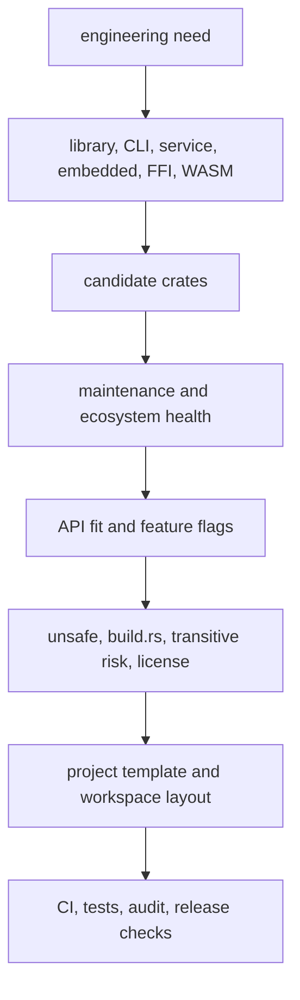

Purpose: provide a practical map for choosing Rust crates and project templates across libraries, CLIs, services, async services, `no_std` crates, FFI crates, and workspaces.

# Rust Ecosystem Crates and Project Templates

Related notes: [Rust](/compendium/rust/rust), [00 Rust Mastery Roadmap](/compendium/rust/rust-mastery-roadmap), [04 Error Handling and API Design](/compendium/rust/error-handling-and-api-design), [05 Modules Crates Cargo and Workspaces](/compendium/rust/modules-crates-cargo-and-workspaces), [08 Async Rust Futures Tokio and Runtimes](/compendium/rust/async-rust-futures-tokio-and-runtimes), [11 Testing Verification Benchmarking and Tooling](/compendium/rust/testing-verification-benchmarking-and-tooling), [13 Systems Programming Networking and IO](/compendium/rust/systems-programming-networking-and-io), [14 FFI Embedded WebAssembly and Interop](/compendium/rust/ffi-embedded-webassembly-and-interop), <span className="compendium-external-reference" title="Vault-only reference">Software Supply Chain Security</span>.

## Ecosystem selection model

The Rust ecosystem rewards deliberate dependency choices. A crate can save months, but it can also add unsafe code, transitive dependencies, build scripts, MSRV pressure, feature unification surprises, binary size, compile time, and supply-chain risk.



Selection principle: choose the smallest maintained crate that expresses the domain well and leaves your public API stable. Do not add a framework to avoid understanding the boundary it owns.

## Crate selection criteria

| Criterion | Good signal | Warning signal |
|---|---|---|
| Maintenance | Recent releases, active issue triage, compatible Rust versions. | Abandoned issues, no release path, unclear ownership. |
| API stability | Semver discipline, changelog, deprecation path. | Frequent breaking changes without migration notes. |
| Dependency tree | Small, understandable, feature-gated. | Large tree for a minor helper. |
| Unsafe usage | Isolated and documented. | Unexplained unsafe in hot or exposed paths. |
| Build behavior | No build script unless needed. | Downloads code or probes host unpredictably. |
| License | Compatible with product and distribution. | Missing, custom, or conflicting license. |
| MSRV | Stated minimum supported Rust version. | Requires latest compiler without reason. |
| Target support | Works on Linux, macOS, Windows, WASM, or embedded as needed. | Hidden platform assumptions. |
| Observability | Errors and hooks integrate with your stack. | Panics or stringly errors at boundaries. |

Cargo inspection commands:

```bash
cargo tree
cargo tree -e features
cargo tree -i serde
cargo deny check
cargo audit
cargo geiger
cargo machete
```

Use `cargo geiger` as a pointer to unsafe review, not as a verdict. Use `cargo machete` to find unused dependencies, then confirm manually because feature-only usage can confuse tools.

## Common crate map

| Domain | Common crates | Notes |
|---|---|---|
| Errors | `thiserror`, `anyhow`, `eyre` | `thiserror` for library errors, `anyhow` or `eyre` for binaries. |
| CLI | `clap`, `anstyle`, `indicatif`, `dialoguer` | Keep parsing separate from execution. |
| Config | `figment`, `config`, `toml`, `serde_json`; a reviewed maintained YAML adapter only when YAML is required | Validate after parsing; `serde_yaml` itself is deprecated and archived. |
| Logging and tracing | `tracing`, `tracing-subscriber`, `tracing-opentelemetry` | Prefer spans over ad hoc logs. |
| Async runtime | `tokio`, `smol`; `async-std` only for legacy compatibility | Runtime-bound I/O types and ecosystem compatibility matter. |
| HTTP server | `axum`, `actix-web`, `hyper`, `tower` | Axum plus Tower is a common default. |
| HTTP client | `reqwest`, `hyper`, `ureq` | Reuse client instances. |
| Serialization | `serde`, `serde_json`, `toml`, `postcard`, `ciborium`, `minicbor`, `prost`, `rkyv` | Pick schema evolution policy early; use bincode 2 only for legacy compatibility. |
| Database | `sqlx`, `diesel`, SeaORM, `rusqlite` | Match abstraction to query complexity and runtime. |
| Testing | `proptest`, `quickcheck`, `insta`, `assert_cmd`, `wiremock` | Add integration tests around boundaries. |
| Benchmarking | `criterion`, `iai-callgrind` | Benchmark public operations and hot paths. |
| Embedded | `embedded-hal`, `heapless`, `defmt`, `embassy`, `rtic` | Feature-gate host and target behavior. |
| FFI | `bindgen`, `cbindgen`, `cc`, `libloading` | Wrap raw APIs in safe layers. |
| WASM | `wasm-bindgen`, `wasm-pack`, `web-sys`, `js-sys` | Budget for boundary overhead and bundle size. |

## Library template

A Rust library should expose a small stable surface, precise errors, and minimal required features.

```text
my-lib/
  Cargo.toml
  README.md
  src/
    lib.rs
    error.rs
    model.rs
    parser.rs
  tests/
    public_api.rs
```

`Cargo.toml`:

```toml
[package]
name = "my-lib"
version = "0.1.0"
edition = "2024"
rust-version = "1.85"
license = "MIT OR Apache-2.0"

[features]
default = ["std"]
std = ["serde?/std", "thiserror/std"]
serde = ["dep:serde"]

[dependencies]
serde = { version = "1", optional = true, default-features = false, features = ["derive"] }
thiserror = { version = "2", default-features = false }
```

`src/lib.rs`:

```rust
#![cfg_attr(not(feature = "std"), no_std)]
#![deny(missing_docs)]

mod error;
mod model;
mod parser;

pub use error::ParseError;
pub use model::Document;
pub use parser::parse_document;
```

Library guidance:

- Public types are harder to change than private modules.
- Avoid leaking dependency types unless the dependency is part of your intended API.
- Use feature flags for optional serde, std, tracing, or integration support.
- Add doc tests for the main happy path and one error path.
- Keep `unsafe` private unless the caller must uphold a contract.

## CLI template

CLIs need argument parsing, config layering, clear errors, exit codes, and testable command logic.

```text
my-cli/
  Cargo.toml
  src/
    main.rs
    cli.rs
    config.rs
    command.rs
  tests/
    cli.rs
```

```rust
use clap::{Parser, Subcommand};
use std::path::PathBuf;

#[derive(Debug, Parser)]
#[command(name = "indexer")]
struct Cli {
    #[command(subcommand)]
    command: Command,
}

#[derive(Debug, Subcommand)]
enum Command {
    Scan {
        #[arg(long)]
        root: PathBuf,
    },
}

fn main() -> anyhow::Result<()> {
    let cli = Cli::parse();
    match cli.command {
        Command::Scan { root } => indexer::scan(root)?,
    }
    Ok(())
}
```

CLI production guidance:

| Concern | Guidance |
|---|---|
| Errors | Human message on stderr, machine-readable option when needed. |
| Exit codes | Stable documented meanings for automation. |
| Config | Precedence order: flags, env, config file, defaults. |
| Output | Separate user output from logs. |
| Tests | Use `assert_cmd` for binary behavior. |
| Shell | Generate completions and man pages for serious tools. |

## Service template

Services need runtime ownership, config, state, routes, storage, observability, graceful shutdown, and deployment checks.

```text
my-service/
  Cargo.toml
  src/
    main.rs
    config.rs
    error.rs
    http/
      mod.rs
      routes.rs
      state.rs
    storage/
      mod.rs
      postgres.rs
    telemetry.rs
  migrations/
  tests/
    health.rs
    api_contract.rs
```

```rust
use axum::{routing::get, Router};
use tokio::net::TcpListener;

#[tokio::main]
async fn main() -> anyhow::Result<()> {
    telemetry::init()?;
    let config = Config::from_env()?.validate()?;
    let state = AppState::connect(&config).await?;

    let app = Router::new()
        .route("/healthz", get(|| async { axum::http::StatusCode::NO_CONTENT }))
        .with_state(state);

    let listener = TcpListener::bind(&config.bind_addr).await?;
    axum::serve(listener, app)
        .with_graceful_shutdown(shutdown_signal())
        .await?;

    Ok(())
}

async fn shutdown_signal() {
    let _ = tokio::signal::ctrl_c().await;
}
```

Service checklist:

- `Config::validate` rejects dangerous or incoherent settings.
- State is clone-cheap and contains pools, clients, and handles.
- Readiness checks dependencies needed to serve traffic.
- Liveness checks process health without cascading dependency outages.
- Shutdown stops ingress, cancels background tasks, drains important work, and closes pools.
- Tracing spans include request ID, route, status, latency, and dependency calls.
- Database migrations have deploy order and rollback posture.

## Async service template

Async services need extra discipline around tasks, cancellation, queues, and blocking work.

```rust
use tokio::sync::{mpsc, oneshot};
use tokio::task::JoinSet;

struct Work {
    payload: String,
    reply: oneshot::Sender<anyhow::Result<()>>,
}

async fn supervise_workers(
    mut rx: mpsc::Receiver<Work>,
    shutdown: tokio_util::sync::CancellationToken,
    max_concurrency: usize,
) {
    assert!(max_concurrency > 0);
    let mut tasks = JoinSet::new();

    loop {
        while tasks.len() >= max_concurrency {
            observe_worker(tasks.join_next().await);
        }

        tokio::select! {
            _ = shutdown.cancelled() => {
                rx.close();
                break;
            }
            work = rx.recv() => match work {
                Some(work) => {
                    tasks.spawn(async move {
                        let result = process(work.payload).await;
                        let _ = work.reply.send(result);
                    });
                }
                None => break,
            },
            result = tasks.join_next(), if !tasks.is_empty() => {
                observe_worker(result);
            }
        }
    }

    tasks.abort_all();
    while let Some(result) = tasks.join_next().await {
        observe_worker(Some(result));
    }
}

fn observe_worker(result: Option<Result<(), tokio::task::JoinError>>) {
    if let Some(Err(err)) = result {
        tracing::error!(error = %err, "worker task failed");
    }
}

async fn process(_payload: String) -> anyhow::Result<()> {
    Ok(())
}
```

This supervisor deliberately stops accepting work, aborts active tasks, and rejects queued requests by dropping their reply senders during shutdown. A drain policy would stop producers, retain queued work, apply a deadline, and join every accepted task instead. State that choice in the service contract.

Async design rules:

| Rule | Reason |
|---|---|
| Use bounded channels. | Backpressure must exist somewhere. |
| Own every `JoinHandle` or use a supervised task set. | Detached tasks hide failures. |
| Never hold blocking locks across `.await`. | Can deadlock or starve the runtime. |
| Put CPU work on a blocking pool or Rayon. | Async runtimes are for IO progress. |
| Add cancellation tokens for long-lived tasks. | Shutdown must be coordinated. |
| Instrument queue depth and task failures. | Saturation is otherwise invisible. |

## no_std crate template

`no_std` libraries should keep their minimal build honest in CI.

```text
my-codec/
  Cargo.toml
  src/
    lib.rs
    error.rs
    encode.rs
    decode.rs
  tests/
    roundtrip.rs
```

```toml
[features]
default = ["std"]
std = ["alloc", "serde?/std"]
alloc = ["serde?/alloc"]
serde = ["dep:serde"]

[dependencies]
serde = { version = "1", optional = true, default-features = false, features = ["derive"] }
heapless = { version = "0.9", optional = true }
```

```rust
#![cfg_attr(not(feature = "std"), no_std)]

#[cfg(feature = "alloc")]
extern crate alloc;

pub fn encode_len(len: usize, out: &mut [u8]) -> Option<&[u8]> {
    if out.len() < 2 || len > u16::MAX as usize {
        return None;
    }
    out[0] = (len >> 8) as u8;
    out[1] = len as u8;
    Some(&out[..2])
}
```

CI checks:

```bash
cargo check --no-default-features
cargo check --no-default-features --features alloc
cargo check --all-features
```

For embedded targets, add target-specific `cargo check` once the target triple is known.

## FFI crate template

FFI crates are usually split into raw bindings and safe wrappers.

```text
foo-sys/
  Cargo.toml
  build.rs
  wrapper.h
  src/lib.rs
foo/
  Cargo.toml
  src/lib.rs
```

`foo-sys` responsibilities:

- Link the native library.
- Generate or include raw bindings.
- Expose C-like symbols with minimal interpretation.
- Avoid pretending raw pointers are safe.

`foo` responsibilities:

- Own handles with `Drop`.
- Convert errors into Rust error types.
- Encode lifetimes and thread-safety.
- Expose safe methods unless caller obligations remain.

```rust
pub struct LibraryHandle {
    raw: std::ptr::NonNull<foo_sys::foo_handle>,
}

// Safety: the native library documents that an owned handle may be moved to
// another thread, all access requires `&mut self`, and destruction is valid on
// whichever thread owns the handle. It does not permit concurrent shared use,
// so this wrapper intentionally does not implement `Sync`.
unsafe impl Send for LibraryHandle {}

impl Drop for LibraryHandle {
    fn drop(&mut self) {
        unsafe {
            // Safety: the wrapper uniquely owns a live handle returned by
            // `foo_create`, and Drop calls its matching destructor once.
            foo_sys::foo_destroy(self.raw.as_ptr());
        }
    }
}
```

Only implement `Send` or `Sync` after reading the C library's thread-safety contract. If the C library has global state or thread affinity, encode that in Rust rather than documenting around it.

## Workspace layouts

Workspaces let you separate stable contracts from binaries and adapters.

```text
platform/
  Cargo.toml
  crates/
    domain/
    protocol/
    storage/
    service/
    cli/
    ffi/
  xtask/
  migrations/
  deny.toml
```

Root `Cargo.toml`:

```toml
[workspace]
members = [
    "crates/domain",
    "crates/protocol",
    "crates/storage",
    "crates/service",
    "crates/cli",
    "xtask",
]
resolver = "3"

[workspace.package]
edition = "2024"
rust-version = "1.85"
license = "MIT OR Apache-2.0"

[workspace.dependencies]
anyhow = "1"
serde = { version = "1", features = ["derive"] }
thiserror = "2"
tracing = "0.1"
```

Workspace guidance:

| Crate | Should contain | Should avoid |
|---|---|---|
| `domain` | Core types, invariants, pure behavior. | Tokio, SQL, HTTP framework types. |
| `protocol` | Wire models, serde, compatibility tests. | Business behavior. |
| `storage` | Database queries and transactions. | HTTP routing. |
| `service` | Runtime wiring, routes, tasks. | Reusable domain rules hidden in handlers. |
| `cli` | Argument parsing and command orchestration. | Library-only logic. |
| `xtask` | Repo automation in Rust. | Production runtime dependencies. |

Use workspace dependency inheritance to keep versions aligned. Use feature flags to prevent a low-level crate from pulling service dependencies into every build.

## Project template decision table

| Project type | Default crates | Template priority | Extra review |
|---|---|---|---|
| Library | `thiserror`, optional `serde` | Small public API and semver. | MSRV, feature flags, docs. |
| CLI | `clap`, `anyhow`, `tracing` or stderr | Clear UX and automation behavior. | Exit codes and config precedence. |
| Sync service | `axum` can still run on Tokio; sync work isolated. | Thread pools and blocking boundaries. | Pool exhaustion and shutdown. |
| Async service | `tokio`, `axum`, `tower`, `tracing`, `sqlx` | Runtime ownership and backpressure. | Cancellation, queue bounds, timeouts. |
| no_std crate | `core`, optional `alloc`, `heapless` | Minimal features and target checks. | Default features and panic assumptions. |
| FFI crate | `bindgen`, `cbindgen`, `cc`, `thiserror` | ABI stability and safe wrapper. | Allocator ownership and unwind policy. |
| WASM package | `wasm-bindgen`, `wasm-pack`, `web-sys` | Boundary shape and bundle size. | Host APIs and panic hooks. |

## Ecosystem Snapshot and Freshness Policy

This note was reviewed on 2026-07-10 with Rust 1.96.0. Version lines shown in templates are compatibility ranges, not an instruction to skip lockfile review.

| Area | Reviewed line used here | Maintenance note |
|---|---|---|
| Core serialization | Serde 1 | Stable ecosystem foundation; inspect adapter maintenance separately |
| Errors | `thiserror` 2, `anyhow` 1 | Keep typed errors in libraries and reports at application edges |
| Async and HTTP | Tokio 1, Axum 0.8, Hyper 1, Tower 0.5 | Align features and versions through the selected stack |
| Benchmarking | Criterion 0.8 | Requires a modern compiler; keep MSRV policy explicit |
| Property tests | Proptest 1 | Strategies and shrinking quality matter more than case count alone |
| Embedded containers | Heapless 0.9 | Check target atomics, MSRV, and capacity behavior |
| C bindings | Bindgen 0.72, cbindgen 0.29 | Pin Clang and header-generation environments |
| Metrics | Metrics 0.24 | Recorder and exporter selection is a separate operational decision |

Known status cautions:

- The original `serde_yaml` repository is archived and its crate is deprecated. Select and audit a maintained adapter only when YAML is required.
- Bincode 3.0 intentionally fails compilation to announce that the project is unmaintained. Pin existing bincode 2 consumers narrowly while migrating; do not select bincode for a new design.
- The `async-std` maintainers discontinued the runtime and recommend migration to `smol`. Treat it as legacy compatibility only.
- `cargo-watch` is in life-support or archived status. Prefer Bacon or Watchexec for new file-watching workflows.
- A popular crate is not automatically the correct boundary. Recheck releases, repository activity, advisories, MSRV, licenses, build scripts, unsafe use, and target support at adoption time.

## Dependency Decision Record

For every material runtime or build dependency, record:

```text
Need:
Candidates and version lines:
Selected crate and enabled features:
Public API exposure:
Transitive, native, build-script, and unsafe surface:
MSRV and target evidence:
License and advisory evidence:
Exit or replacement strategy:
Owner and next review date:
```

Review the record when a major version changes, a maintainer archives the project, an advisory lands, the target matrix changes, or dependency types leak into more public API.

## Workspace Policy Template

```toml
[workspace.lints.rust]
unsafe_code = "deny"

[workspace.lints.clippy]
unwrap_used = "warn"

[profile.release]
lto = "thin"
codegen-units = 1
debug = "line-tables-only"
```

Each member opts in with `[lints] workspace = true`. Change the unsafe policy at the narrow crate level when FFI or a low-level abstraction requires it, and require explicit safety review rather than weakening the entire workspace.

## Ecosystem tradeoffs

Rust has several recurring ecosystem tradeoffs:

| Tradeoff | Prefer A when | Prefer B when |
|---|---|---|
| Framework vs library | You need strong conventions and shared middleware. | You need a small stable core and custom boundaries. |
| Explicit SQL vs ORM | Query behavior and performance must be obvious. | CRUD velocity and relation helpers dominate. |
| `anyhow` vs custom errors | Binary edge or orchestration code. | Library API or caller-actionable failures. |
| Sync vs async | Work is CPU-bound, simple, or low concurrency. | Many concurrent IO operations share a runtime. |
| `std` vs `no_std` | Host platform and ergonomics matter. | Target portability or embedded constraints matter. |
| Generated code vs hand-written | Schema is large and tool-owned. | API is small and needs careful review. |
| Large crate vs small crates | Integrated behavior reduces real complexity. | You only need a narrow utility. |

## Dependency policy

Production Rust projects should encode dependency policy in the repository.

```toml
# deny.toml sketch
[advisories]
ignore = []

[licenses]
allow = ["MIT", "Apache-2.0", "BSD-3-Clause"]

[bans]
multiple-versions = "warn"
wildcards = "deny"
```

Policy should cover:

- Licenses allowed for runtime and build dependencies.
- Security advisory behavior.
- Duplicate crate versions.
- Git dependencies and path dependencies.
- Build scripts and native linking.
- Minimum supported Rust version.
- Release profile settings.
- Reproducible lockfile policy for applications.

Libraries often should not commit `Cargo.lock` unless they have a reason. Applications and services should commit it.

## Review checklist

- The crate selection has a written reason tied to the project boundary.
- Public APIs do not leak dependencies accidentally.
- Feature flags are additive and checked with `--no-default-features` and `--all-features`.
- Dependency tree, duplicate versions, licenses, advisories, and unused dependencies are inspected.
- The chosen template separates domain, IO, runtime, and adapter concerns.
- CLI output, service routes, FFI ABI, WASM exports, and `no_std` features are treated as public contracts.
- Async tasks have owners, cancellation, and bounded channels.
- Database and HTTP crates match the runtime and operational model.
- Workspace-level versions and lints reduce drift across crates.
- CI runs format, clippy, tests, doc tests, feature checks, audit or deny, and target-specific checks.

## Common mistakes

- Adding a dependency for a few lines of simple code.
- Hiding dependency types in public APIs and later being unable to upgrade.
- Letting default features pull in `std`, TLS stacks, or async runtimes unexpectedly.
- Using `anyhow` in a library where callers need structured recovery.
- Creating a workspace where every crate depends on the service crate.
- Skipping `cargo tree -e features` and missing feature unification.
- Treating `cargo audit` as complete supply-chain review.
- Making a `no_std` claim without `--no-default-features` CI.
- Shipping FFI or WASM artifacts without testing from the foreign host.
- Choosing a web framework before defining cancellation, backpressure, and state ownership.

## Primary Sources

- [The crates.io registry index](https://index.crates.io/)
- [docs.rs](https://docs.rs/)
- [The Cargo Book](https://doc.rust-lang.org/cargo/)
- [Cargo `search` documentation](https://doc.rust-lang.org/cargo/commands/cargo-search.html)
- [RustSec Advisory Database](https://rustsec.org/)
- [`cargo-deny` documentation](https://embarkstudios.github.io/cargo-deny/)
- [`cargo-vet` documentation](https://mozilla.github.io/cargo-vet/)
- [Embedded Rust crates](https://github.com/rust-embedded/awesome-embedded-rust)
