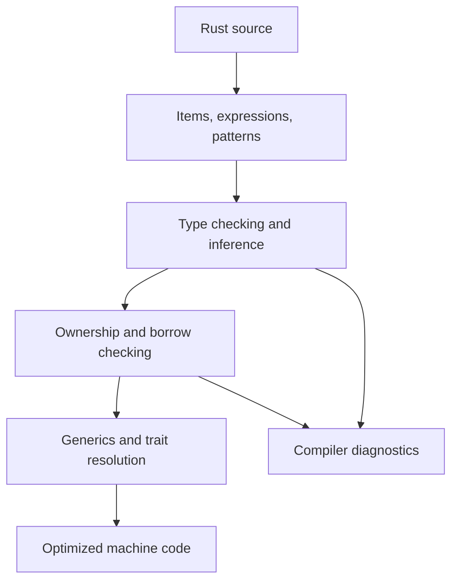

Purpose: Build a precise working model of Rust's core language surface so that syntax, types, control flow, pattern matching, containers, iterators, and error values become tools for writing correct systems code.

# Rust Language Fundamentals

Related notes: [02 Ownership Borrowing and Lifetimes](/compendium/rust/ownership-borrowing-and-lifetimes), [03 Types Traits and Generics](/compendium/rust/types-traits-and-generics), [04 Error Handling and API Design](/compendium/rust/error-handling-and-api-design), [07 Concurrency Parallelism and Synchronization](/compendium/rust/concurrency-parallelism-and-synchronization), [Data Structures/Data Structures](/compendium/data-structures/data-structures), <span className="compendium-external-reference" title="Vault-only reference">Software testing</span>

Rust is a systems language with a deliberately small runtime, strong static typing, expression-oriented syntax, exhaustive pattern matching, and explicit error values. The central design pressure is that ordinary code should reveal allocation, mutation, ownership transfer, and failure paths without requiring a garbage collector.

This note focuses on the core language surface. The deeper memory model is in [02 Ownership Borrowing and Lifetimes](/compendium/rust/ownership-borrowing-and-lifetimes).

## Mental Model



Important consequences:

- Types are checked before code runs.
- Most abstractions compile away when they are monomorphized and optimized.
- `Option&lt;T&gt;` and `Result&lt;T, E&gt;` model absence and failure as values, not side channels.
- Pattern matching is the normal way to deconstruct data.
- Mutability belongs to bindings, references, and interior mutability wrappers, not to objects in a universal sense.

## Variables, Bindings, and Mutability

`let` creates a binding. Bindings are immutable by default.

```rust
fn main() {
    let port = 8080;
    let mut retries = 3;

    retries -= 1;

    println!("port={port}, retries={retries}");
}
```

Immutable bindings prevent accidental reassignment, not all change in the world. A value behind `Mutex&lt;T&gt;`, `RefCell&lt;T&gt;`, or atomics may still change through controlled APIs. See [02 Ownership Borrowing and Lifetimes](/compendium/rust/ownership-borrowing-and-lifetimes) for interior mutability.

### Shadowing

Shadowing creates a new binding with the same name. It is useful for validation pipelines and type refinement.

```rust
fn parse_port(raw: &str) -> Result<u16, std::num::ParseIntError> {
    let raw = raw.trim();
    let port: u16 = raw.parse()?;
    Ok(port)
}
```

Shadowing differs from `mut`:

| Technique | What changes | Type can change | Common use | Risk |
|---|---|---:|---|---|
| `let mut x` | Same binding's value | No | Counters, buffers, state machines | Accidental mutation scope can grow |
| `let x = ...; let x = ...;` | New binding | Yes | Parsing, normalization, validation | Name reuse can hide too much context |
| New descriptive name | New binding | Yes | Complex transforms | More names to maintain |

Production guidance:

- Prefer immutable bindings until mutation is the clearest local model.
- Keep `mut` scopes small.
- Use shadowing for narrow type refinement, not for long functions where the same name means several unrelated things.

## Scalar Types

Rust scalar types represent single values.

| Family | Examples | Notes |
|---|---|---|
| Integers | `i8`, `u8`, `i32`, `u64`, `usize`, `isize` | Default integer literal is often inferred as `i32`; use `usize` for indexing and sizes |
| Floating point | `f32`, `f64` | Default is `f64`; floats have NaN and are not total-order friendly by default |
| Boolean | `bool` | Values are `true` and `false` |
| Character | `char` | A Unicode scalar value, not a byte and not a grapheme cluster |

Integer overflow behavior:

- Debug builds panic on arithmetic overflow for primitive integer operations.
- Release builds wrap for primitive integer operations unless using checked APIs or compiler options.
- Production code should use `checked_add`, `saturating_add`, `wrapping_add`, or `overflowing_add` when overflow semantics matter.

```rust
fn add_quota(current: u64, increment: u64, limit: u64) -> Result<u64, &'static str> {
    let next = current.checked_add(increment).ok_or("quota overflow")?;
    if next > limit {
        return Err("quota exceeded");
    }
    Ok(next)
}
```

## Compound Types

### Tuples

Tuples group heterogeneous values by position.

```rust
fn split_host_port(endpoint: &str) -> Option<(&str, &str)> {
    endpoint.rsplit_once(':')
}

fn main() {
    let parsed = split_host_port("localhost:8080");

    if let Some((host, port)) = parsed {
        println!("host={host}, port={port}");
    }
}
```

Use tuples for local, obvious groupings. Prefer structs once fields have durable names or cross function boundaries.

### Arrays and Slices

Arrays have fixed length known at compile time. Slices are borrowed views over contiguous data.

```rust
fn first_two(bytes: &[u8]) -> Option<[u8; 2]> {
    let [a, b, ..] = bytes else {
        return None;
    };
    Some([*a, *b])
}
```

Use `&[T]` in APIs when the caller should be able to pass a `Vec&lt;T&gt;`, array, or other contiguous buffer without transferring ownership.

## Expressions vs Statements

Rust is expression-oriented. Expressions produce values. Statements perform actions and usually end with semicolons.

```rust
fn classify_latency(ms: u64) -> &'static str {
    if ms < 100 {
        "fast"
    } else if ms < 500 {
        "normal"
    } else {
        "slow"
    }
}
```

The last expression in a block becomes the block value if there is no semicolon.

```rust
fn cost(units: u32) -> u32 {
    let base = {
        let minimum = 10;
        minimum + units
    };

    base * 2
}
```

Common mistake:

```rust
fn wrong() -> u32 {
    42;
    0
}
```

The `42;` statement discards the value. The function returns `0`.

## Functions

Functions use explicit parameter and return types.

```rust
fn clamp(value: i64, min: i64, max: i64) -> i64 {
    assert!(min <= max);

    if value < min {
        min
    } else if value > max {
        max
    } else {
        value
    }
}
```

Guidance:

- Keep fallible functions explicit with `Result&lt;T, E&gt;`.
- Prefer borrowed inputs like `&str` and `&[T]` when the function only reads.
- Return owned values when the result is newly constructed or must outlive the input.
- Use generic bounds only when they buy real reuse. See [03 Types Traits and Generics](/compendium/rust/types-traits-and-generics).

## Control Flow

### if

`if` conditions must be `bool`. Rust does not coerce integers to truthy or falsey values.

```rust
fn is_valid_port(port: u16) -> bool {
    port != 0
}
```

### loop

`loop` can return a value using `break value`.

```rust
fn next_power_of_two_at_least(mut n: u64) -> u64 {
    let mut power = 1;

    loop {
        if power >= n {
            break power;
        }
        power *= 2;
    }
}
```

### while

Use `while` for stateful loops with a condition.

```rust
fn drain_prefix_spaces(input: &str) -> &str {
    let mut start = 0;

    while input[start..].starts_with(' ') {
        start += 1;
        if start == input.len() {
            break;
        }
    }

    &input[start..]
}
```

### for

Use `for` for iterating over anything that implements `IntoIterator`.

```rust
fn total(values: &[i64]) -> i64 {
    let mut sum = 0;

    for value in values {
        sum += value;
    }

    sum
}
```

Prefer iterator methods when they express the transformation directly.

```rust
fn total_positive(values: &[i64]) -> i64 {
    values.iter().copied().filter(|value| *value > 0).sum()
}
```

## Pattern Matching

Patterns appear in `match`, `let`, function parameters, `if let`, `while let`, and `let else`.

```rust
enum Command {
    Put { key: String, value: String },
    Get(String),
    Delete(String),
}

fn command_name(command: &Command) -> &'static str {
    match command {
        Command::Put { .. } => "put",
        Command::Get(_) => "get",
        Command::Delete(_) => "delete",
    }
}
```

`match` is exhaustive. This is one of Rust's strongest maintainability features: adding a new enum variant forces callers to revisit behavior.

Pattern tools:

| Pattern | Example | Use |
|---|---|---|
| Wildcard | `_` | Ignore a value |
| Binding | `name` | Bind matched value |
| Tuple | `(a, b)` | Destructure tuple |
| Struct | `User { id, .. }` | Extract named fields |
| Enum | `Some(value)` | Branch by variant |
| Slice | `[first, rest @ ..]` | Match contiguous sequences |
| Guard | `x if x &gt; 0` | Add boolean condition |
| Or | `A \| B` | Share a branch |

```rust
fn describe_status(code: u16) -> &'static str {
    match code {
        200..=299 => "success",
        300..=399 => "redirect",
        400 | 401 | 403 | 404 => "client error",
        500..=599 => "server error",
        _ => "unknown",
    }
}
```

### if let

Use `if let` when one pattern matters and the rest can be ignored or handled generically.

```rust
fn print_debug_flag(flag: Option<&str>) {
    if let Some(value) = flag {
        println!("debug={value}");
    }
}
```

### let else

Use `let else` for early exits that keep the happy path unindented.

```rust
fn require_token(header: Option<&str>) -> Result<&str, &'static str> {
    let Some(header) = header else {
        return Err("missing authorization header");
    };

    let Some(token) = header.strip_prefix("Bearer ") else {
        return Err("invalid authorization scheme");
    };

    Ok(token)
}
```

### while let

Use `while let` to process values until a pattern no longer matches.

```rust
fn drain_stack(stack: &mut Vec<String>) {
    while let Some(item) = stack.pop() {
        println!("processed {item}");
    }
}
```

## Option

`Option&lt;T&gt;` means either a value exists or it does not.

```rust
fn extension(path: &str) -> Option<&str> {
    path.rsplit_once('.').map(|(_, ext)| ext)
}
```

Core operations:

| Method | Meaning | Example |
|---|---|---|
| `map` | Transform present value | `opt.map(parse)` |
| `and_then` | Chain optional computation | `opt.and_then(find)` |
| `filter` | Keep value only if predicate passes | `opt.filter(\|s\| !s.is_empty())` |
| `unwrap_or` | Supply a default value | `opt.unwrap_or("default")` |
| `ok_or` | Convert to `Result` | `opt.ok_or(Error::Missing)` |
| `as_ref` | Borrow inside the option | `opt.as_ref()` |

Production rule: reserve `unwrap` and `expect` for invariants that are impossible to violate if surrounding code is correct, tests, quick scripts, or process startup where panic is acceptable. In libraries, return `Option` or `Result`.

## Result

`Result&lt;T, E&gt;` represents success or failure.

```rust
#[derive(Debug)]
enum ConfigError {
    MissingPort,
    InvalidPort(std::num::ParseIntError),
    PortZero,
}

fn load_port(raw: Option<&str>) -> Result<u16, ConfigError> {
    let raw = raw.ok_or(ConfigError::MissingPort)?;
    let port = raw.parse::<u16>().map_err(ConfigError::InvalidPort)?;

    if port == 0 {
        return Err(ConfigError::PortZero);
    }

    Ok(port)
}
```

The `?` operator returns early on `Err` and unwraps `Ok`. It also works on `Option` in functions that return `Option`.

Error design tradeoffs:

| Error style | Pros | Cons | Use when |
|---|---|---|---|
| `Box&lt;dyn Error&gt;` | Quick composition | Weak typed handling | CLI boundary, prototypes |
| Custom enum | Exhaustive and matchable | More boilerplate | Library and service domain errors |
| String error | Easy to create | Loses structure | Small scripts, test helpers |
| `anyhow::Error` | Rich context with low friction | Application-level, not ideal for public libraries | Binary crates |
| `thiserror` enum | Typed errors with clean formatting | Dependency and derive use | Stable crate APIs |

See [04 Error Handling and API Design](/compendium/rust/error-handling-and-api-design) for application and library error boundaries.

## Structs

Structs group named fields and encode domain shape.

```rust
#[derive(Debug, Clone, PartialEq, Eq)]
struct UserId(String);

#[derive(Debug, Clone)]
struct User {
    id: UserId,
    email: String,
    enabled: bool,
}

impl User {
    fn new(id: UserId, email: String) -> Self {
        Self {
            id,
            email,
            enabled: true,
        }
    }

    fn disable(&mut self) {
        self.enabled = false;
    }
}
```

Struct choices:

| Shape | Example | Use |
|---|---|---|
| Named-field struct | `struct User { id: UserId }` | Durable domain objects |
| Tuple struct | `struct UserId(String);` | Newtypes with little field naming value |
| Unit struct | `struct Marker;` | Type-level marker or zero-sized value |

Production guidance:

- Use newtypes for identifiers, validated strings, and units to avoid mixing plain primitives.
- Keep constructors responsible for invariants.
- Derive traits intentionally. `Clone` and `Copy` change API ergonomics and costs.
- Consider privacy: private fields plus public methods protect invariants.

## Enums

Enums model one of several known alternatives.

```rust
#[derive(Debug, Clone)]
enum JobState {
    Queued,
    Running { attempt: u32 },
    Succeeded,
    Failed { reason: String },
}

fn can_retry(state: &JobState) -> bool {
    match state {
        JobState::Failed { .. } => true,
        JobState::Queued | JobState::Running { .. } | JobState::Succeeded => false,
    }
}
```

Use enums instead of nullable fields or stringly typed states. Invalid combinations become unrepresentable.

Bad shape:

```rust
struct WeakJobState {
    status: String,
    failure_reason: Option<String>,
    attempt: Option<u32>,
}
```

Better shape:

```rust
enum StrongJobState {
    Queued,
    Running { attempt: u32 },
    Succeeded,
    Failed { reason: String },
}
```

## Slices and Strings

### String vs str

Rust strings are UTF-8.

| Type | Owned | Growable | Common role |
|---|---:|---:|---|
| `String` | Yes | Yes | Store or build text |
| `str` | No, dynamically sized | No | Text slice type, usually seen as `&str` |
| `&str` | No | No | Borrowed text view |
| `&String` | No | No | Rarely needed in APIs |

Prefer `&str` for read-only string parameters.

```rust
fn normalize_name(name: &str) -> String {
    name.trim().to_ascii_lowercase()
}
```

Be careful with indexing. String byte indices must land on UTF-8 boundaries, and direct numeric indexing is not allowed.

```rust
fn first_char(input: &str) -> Option<char> {
    input.chars().next()
}

fn prefix_bytes(input: &str, len: usize) -> Option<&str> {
    input.get(..len)
}
```

`String` vs `&str` API guidance:

| Function need | Parameter type | Return type |
|---|---|---|
| Read text only | `&str` | Any |
| Store text beyond call | `impl Into&lt;String&gt;` or `String` | Owned type |
| Return borrowed substring | `&str` tied to input lifetime | `&str` |
| Return transformed text | `&str` | `String` |

## Containers

Containers are in the standard library and are usually generic over element types.

### Vec

`Vec&lt;T&gt;` is a growable contiguous array. It is the default sequence container.

```rust
fn active_names(users: &[User]) -> Vec<&str> {
    users
        .iter()
        .filter(|user| user.enabled)
        .map(|user| user.email.as_str())
        .collect()
}
```

Strengths:

- Cache-friendly iteration.
- Fast append at the end.
- O(1) indexing by `usize`.
- Works naturally with slices.

Costs:

- Inserting or removing near the front shifts elements.
- Reallocation can move the buffer.
- Holding references into a `Vec` while mutating it is restricted because mutation may invalidate references.

### HashMap

`HashMap&lt;K, V&gt;` stores key-value pairs with hash-based lookup.

```rust
use std::collections::HashMap;

fn count_words(input: &str) -> HashMap<&str, usize> {
    let mut counts = HashMap::new();

    for word in input.split_whitespace() {
        *counts.entry(word).or_insert(0) += 1;
    }

    counts
}
```

Use `entry` to avoid duplicate lookups.

```rust
use std::collections::HashMap;

fn push_group<'a>(groups: &mut HashMap<&'a str, Vec<&'a str>>, key: &'a str, value: &'a str) {
    groups.entry(key).or_default().push(value);
}
```

### BTreeMap

`BTreeMap&lt;K, V&gt;` stores sorted keys.

```rust
use std::collections::BTreeMap;

fn sorted_counts(counts: impl IntoIterator<Item = (String, usize)>) -> BTreeMap<String, usize> {
    counts.into_iter().collect()
}
```

Use when deterministic order, range queries, or ordered iteration matter.

### HashSet

`HashSet&lt;T&gt;` stores unique values with hash-based membership.

```rust
use std::collections::HashSet;

fn unique_tags(tags: impl IntoIterator<Item = String>) -> HashSet<String> {
    tags.into_iter().filter(|tag| !tag.is_empty()).collect()
}
```

### VecDeque

`VecDeque&lt;T&gt;` is a growable ring buffer with efficient push and pop at both ends.

```rust
use std::collections::VecDeque;

fn process_queue(mut queue: VecDeque<String>) {
    while let Some(job) = queue.pop_front() {
        println!("job={job}");
    }
}
```

Container tradeoffs:

| Container | Ordering | Lookup | Insert pattern | Best fit |
|---|---|---|---|---|
| `Vec&lt;T&gt;` | Insertion order | O(1) index, O(n) search | Fast push at end | Dense sequences |
| `VecDeque&lt;T&gt;` | Queue order | O(1) front and back | Fast both ends | Queues, sliding windows |
| `HashMap&lt;K, V&gt;` | Not stable | Average O(1) by key | Key-value updates | Caches, indexes |
| `BTreeMap&lt;K, V&gt;` | Sorted by key | O(log n) | Ordered key-value updates | Deterministic maps, ranges |
| `HashSet&lt;T&gt;` | Not stable | Average O(1) membership | Unique inserts | Deduplication, membership |

## Iterators

Iterators are lazy value producers. They do nothing until consumed.

```rust
fn even_squares(values: &[u32]) -> Vec<u32> {
    values
        .iter()
        .copied()
        .filter(|value| value % 2 == 0)
        .map(|value| value * value)
        .collect()
}
```

Important forms:

| Form | Consumes collection | Item type for `Vec&lt;T&gt;` | Use |
|---|---:|---|---|
| `iter()` | No | `&T` | Read borrowed values |
| `iter_mut()` | No | `&mut T` | Mutate in place |
| `into_iter()` | Yes for owned collection | `T` | Move values out |

```rust
fn uppercase_all(values: &mut [String]) {
    for value in values.iter_mut() {
        value.make_ascii_uppercase();
    }
}
```

Common iterator adapters:

| Adapter | Purpose |
|---|---|
| `map` | Transform each item |
| `filter` | Keep matching items |
| `filter_map` | Filter and transform optional results |
| `flat_map` | Expand each item into many items |
| `take` | Limit item count |
| `skip` | Ignore first items |
| `chain` | Concatenate iterators |
| `zip` | Pair two iterators |
| `enumerate` | Add index |
| `inspect` | Observe items, usually for logging |
| `collect` | Materialize into a collection |
| `fold` | Accumulate manually |
| `try_fold` | Accumulate with early failure |

```rust
fn parse_numbers(input: &str) -> Result<Vec<i64>, std::num::ParseIntError> {
    input
        .split(',')
        .map(str::trim)
        .filter(|part| !part.is_empty())
        .map(str::parse)
        .collect()
}
```

`collect` can collect `Iterator&lt;Item = Result&lt;T, E&gt;&gt;` into `Result&lt;Vec&lt;T&gt;, E&gt;`, stopping at the first error.

## Closures

Closures are anonymous functions that can capture their environment.

```rust
fn filter_by_prefix<'a>(items: &'a [String], prefix: &str) -> Vec<&'a str> {
    items
        .iter()
        .filter(|item| item.starts_with(prefix))
        .map(String::as_str)
        .collect()
}
```

Closure capture modes are inferred:

| Trait | Capture behavior | Example use |
|---|---|---|
| `Fn` | Shared borrow, callable many times | Predicates, pure callbacks |
| `FnMut` | Mutable borrow, callable many times | Stateful callbacks |
| `FnOnce` | Consumes captured values, callable once | Thread spawn, one-shot actions |

```rust
fn apply_twice<F>(mut f: F) -> i32
where
    F: FnMut(i32) -> i32,
{
    let first = f(1);
    f(first)
}
```

Use `move` to force capture by value.

```rust
use std::thread;

fn spawn_worker(name: String) -> thread::JoinHandle<()> {
    thread::spawn(move || {
        println!("worker={name}");
    })
}
```

## Practical Design Patterns

### Parse, Validate, Then Store

```rust
#[derive(Debug, Clone, PartialEq, Eq, Hash)]
struct ServiceName(String);

impl ServiceName {
    fn parse(raw: &str) -> Result<Self, &'static str> {
        let normalized = raw.trim().to_ascii_lowercase();

        if normalized.is_empty() {
            return Err("service name is empty");
        }

        if !normalized
            .chars()
            .all(|ch| ch.is_ascii_lowercase() || ch.is_ascii_digit() || ch == '-')
        {
            return Err("service name contains invalid characters");
        }

        Ok(Self(normalized))
    }

    fn as_str(&self) -> &str {
        &self.0
    }
}
```

This pattern keeps validation close to construction. Downstream code can accept `ServiceName` instead of repeatedly validating `String`.

### Exhaustive Domain State

```rust
enum Deployment {
    Pending,
    Running { version: String },
    Failed { version: String, message: String },
    RolledBack { from: String, to: String },
}

fn is_terminal(deployment: &Deployment) -> bool {
    matches!(
        deployment,
        Deployment::Failed { .. } | Deployment::RolledBack { .. }
    )
}
```

`matches!` is useful for boolean checks over patterns.

### Deterministic Output

Use `BTreeMap` when stable output matters for tests, config generation, or snapshot files.

```rust
use std::collections::BTreeMap;

fn render_env(env: &BTreeMap<String, String>) -> String {
    env.iter()
        .map(|(key, value)| format!("{key}={value}"))
        .collect::<Vec<_>>()
        .join("\n")
}
```

## Places, Values, and Evaluation Contexts

Rust expressions are evaluated in either a place-expression context or a value-expression context. This distinction explains many moves that otherwise look arbitrary.

- A place expression identifies a memory location. Local variables, statics, dereferences, indexing, and field access are common places.
- A value expression produces a value. Literals, arithmetic, calls, and most control-flow expressions are common values.
- Reading a place in a value context copies the value when its type implements `Copy`; otherwise it moves the value when moving is legal.
- Borrowing a place with `&place` or `&mut place` creates a reference without moving the referent.
- Basic assignment evaluates the right operand first and the assignee place second. Most ordinary multi-operand expressions evaluate left to right, while lazy boolean and control-flow expressions are conditional. Compound assignment has type-dependent ordering and should never carry order-sensitive side effects.

```rust
let mut pair = (String::from("left"), String::from("right"));

let first = pair.0;        // Moves one field out of a local place.
let second = &pair.1;      // Borrows the remaining initialized field.
pair.1.push('!');          // Error while `second` is still used later.

println!("{first} {second}");
```

Partial moves are available for structs and tuples that do not implement `Drop`. The compiler tracks which fields remain initialized. Moving a non-`Copy` element directly out of `values[index]` is rejected because `Index::index` yields a borrowed place. Use `remove`, `swap_remove`, `pop`, `into_iter`, or replace the element.

### Temporaries and drop scopes

A temporary normally lives until the end of its enclosing statement. Certain `let` initializers extend temporary lifetimes so a reference remains valid. Do not infer lifetime extension from visual similarity: it is a syntactic rule, not general escape analysis.

```rust
let borrowed: &str = &String::from("extended");
// The temporary String is lifetime-extended to the enclosing block.

let length = String::from("statement temporary").len();
// That String is dropped at the semicolon.
```

Edition 2024 narrows several temporary scopes. In particular, an `if let` scrutinee temporary is dropped before the `else` branch, and a block tail-expression temporary is dropped before local variables in that block. These rules reduce surprising borrow and destructor interactions.

## Divergence and the Never Type

The never type `!` describes computation that cannot produce a value. `return`, `break` with no reachable continuation, `continue`, `panic!`, and infinite loops diverge. A diverging expression can coerce to another type, which is why a `match` arm that returns early can coexist with an arm that yields a value.

```rust
fn parse_port(text: Option<&str>) -> Result<u16, std::num::ParseIntError> {
    let Some(text) = text else {
        return Ok(8080); // A let-else `else` block must diverge.
    };

    text.parse()
}
```

Use divergence to make control flow explicit, but avoid hiding ordinary recoverable failure behind `panic!` merely because `!` type-checks conveniently.

## Edition 2024 Language Baseline

An edition is selected per crate and changes parsing, lint migrations, and a small set of language rules. It does not select a compiler version and it does not prevent crates from different editions from linking together.

Important Edition 2024 review points include:

- `extern` blocks must be written `unsafe extern`, making the declaration audit boundary explicit.
- Attributes whose contracts can cause undefined behavior, including `no_mangle`, `export_name`, and `link_section`, use `#[unsafe(...)]`.
- Return-position `impl Trait` captures in-scope generic parameters by default. Use a precise `use&lt;...&gt;` bound when a public API must capture less.
- Match ergonomics reject some previously confusing combinations of `ref`, `ref mut`, and `mut` under an inherited reference binding mode.
- Cargo workspaces using Edition 2024 default to resolver version 3, which considers dependency `rust-version` declarations during selection.
- `cargo fix --edition` performs mechanical migrations, but tests and manual semantic review are still required.

## Constants, Statics, and Compile-time Evaluation

`const` defines a value expression that can be evaluated at compile time. `static` defines one storage location for the entire program. The distinction affects address identity, interior mutability, initialization, and thread safety.

```rust
use std::sync::OnceLock;
use std::sync::atomic::{AtomicU64, Ordering};

const fn kibibytes(value: usize) -> usize {
    match value.checked_mul(1024) {
        Some(bytes) => bytes,
        None => panic!("size overflow"),
    }
}

const MAX_BODY_BYTES: usize = kibibytes(64);
static REQUESTS: AtomicU64 = AtomicU64::new(0);
static INSTANCE_NAME: OnceLock<String> = OnceLock::new();

fn record_request() {
    REQUESTS.fetch_add(1, Ordering::Relaxed);
}
```

Compile-time function evaluation, or CTFE, executes eligible constant expressions in the compiler. A `const fn` is still callable at runtime; the `const` qualifier means it may also run in a constant context when its operations are permitted there. A panic, overflow, out-of-bounds access, or other invalid operation reached during required constant evaluation is a compile error.

Key rules:

- Constant evaluation cannot perform arbitrary I/O, inspect the host environment, or depend on runtime clocks.
- A const block, `const { expression }`, requests compile-time evaluation and can capture in-scope generic parameters where the language permits it.
- A shared immutable `static T` must be `Sync` because every thread can access the same location.
- Avoid `static mut`. Its global aliasing obligations are difficult to uphold, and Edition 2024 denies creation of references to mutable statics by default. Use atomics, `Mutex`, `OnceLock`, or `LazyLock` according to the invariant.
- Promotion can place certain constant expressions in static storage, but public APIs should not depend on incidental pointer identity.
- Stable const generics support many array-length and dimension use cases, while more general const expressions can still face compiler restrictions. Keep compile-time arithmetic small and covered by target-version tests.

Use a build script only when generation needs filesystem, environment, native-tool, or target-discovery access. Use constants and `const fn` for deterministic language-level invariants.

## Common Mistakes

| Mistake | Symptom | Better approach |
|---|---|---|
| Passing `String` when only reading | Callers must allocate or give up ownership | Accept `&str` |
| Passing `&Vec&lt;T&gt;` | API is unnecessarily specific | Accept `&[T]` |
| Calling `unwrap` in library code | Panics instead of typed failure | Return `Result` or `Option` |
| Using string states | Invalid combinations at runtime | Use enums |
| Overusing `mut` | Harder local reasoning | Use shadowing or smaller mutable scopes |
| Indexing strings by bytes | Compile error or boundary bugs | Use `chars`, `bytes`, or `get` |
| Choosing `HashMap` for generated files | Unstable output order | Use `BTreeMap` |
| Collecting too early | Extra allocation | Keep iterator chain lazy until needed |
| Hiding parsing in business logic | Repeated validation and weaker invariants | Use newtypes and constructors |

## Production Guidance

- Model domain states with enums instead of combinations of booleans and options.
- Use `Result` for recoverable errors and panic only for violated invariants.
- Prefer borrowed parameter types in APIs: `&str`, `&[T]`, and trait bounds such as `impl AsRef&lt;Path&gt;`.
- Use `Vec` by default for ordered sequences, then switch only when access patterns justify it.
- Use deterministic containers when output must be reproducible.
- Keep iterator chains readable. Split into named intermediate values when debugging or domain meaning improves.
- Treat `Clone` as an explicit cost. Clone at API boundaries only when ownership needs are real.
- Add tests for edge cases around parsing, empty input, duplicate keys, Unicode text, and error conversion.

## Review Checklist

- Are fallible operations represented as `Option` or `Result` instead of panics?
- Are API inputs borrowed where ownership is unnecessary?
- Are container choices justified by access pattern and ordering requirements?
- Are enum matches exhaustive and intentional?
- Are string operations UTF-8 safe?
- Are integer overflow semantics explicit where values come from untrusted input or external systems?
- Are iterator chains lazy until the final consumer?
- Are `unwrap` and `expect` limited to tests, startup invariants, or clearly impossible states?
- Are structs protecting invariants through constructors, private fields, or newtypes?
- Are shadowed variables easy to follow and local to a narrow transformation?

## Primary Sources

- [The Rust Reference: expressions](https://doc.rust-lang.org/reference/expressions.html)
- [The Rust Reference: destructors and temporary scopes](https://doc.rust-lang.org/reference/destructors.html)
- [The Rust Reference: the never type](https://doc.rust-lang.org/reference/types/never.html)
- [The Rust Reference: constant evaluation](https://doc.rust-lang.org/reference/const_eval.html)
- [The Rust Edition Guide: Rust 2024](https://doc.rust-lang.org/edition-guide/rust-2024/index.html)
- [The Rust Standard Library collections](https://doc.rust-lang.org/std/collections/)
- [The Rust Book](https://doc.rust-lang.org/book/)
