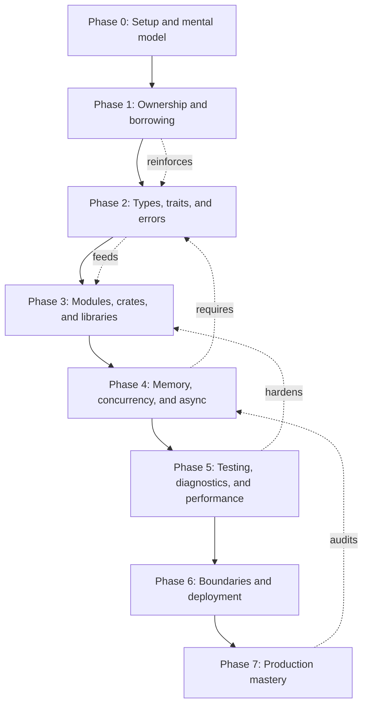
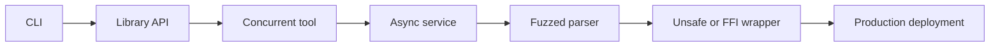

Purpose: A deep learning sequence for becoming production-capable in Rust, with prerequisites, exercises, diagnostic questions, project progression, and checklists that expose real mastery gaps.

# Rust Mastery Roadmap

This roadmap is the operating plan for the [Rust](/compendium/rust/rust) compendium. It is written for an engineer who wants to move beyond syntax familiarity into reliable Rust design, production systems, debugging, testing, performance, and operational ownership. Use it as a sequence, a diagnostic tool, and a review checklist.

Rust rewards engineers who can make state, ownership, failure, and concurrency explicit. The learning path should therefore move from local reasoning to system reasoning:

1. Model values and ownership.
2. Encode invariants with types.
3. Build small libraries with clear API boundaries.
4. Introduce concurrency and async only after the single-threaded design is understandable.
5. Add testing, observability, profiling, supply-chain policy, and release mechanics.
6. Cross architecture, systems, unsafe, FFI, embedded, WASM, and production boundaries with written contracts.

## Prerequisites

You can learn Rust as a first systems language, but serious mastery is faster if you can already reason about:

| Prerequisite              | Why it matters in Rust                                                                                                   | Vault anchor                                                                               |
| ------------------------- | ------------------------------------------------------------------------------------------------------------------------ | ------------------------------------------------------------------------------------------ |
| Basic data structures     | Rust collections expose ownership, allocation, ordering, hashing, and iterator tradeoffs directly.                       | [Data Structures/Data Structures](/compendium/data-structures/data-structures)                                                        |
| Complexity analysis       | Rust makes low-level choices visible, but Big O and cache behavior still decide scalability.                             | [Software Engineering/03 Data Structures Algorithms and Complexity](/compendium/software-engineering/data-structures-algorithms-and-complexity)                      |
| Testing discipline        | The compiler proves memory and type constraints, not product correctness.                                                | <span className="compendium-external-reference" title="Vault-only reference">Software testing</span> and [Software Engineering/10 Testing Verification and Quality Bars](/compendium/software-engineering/testing-verification-and-quality-bars) |
| API design                | Rust APIs encode ownership, errors, lifetimes, and trait contracts.                                                      | [Software Engineering/07 APIs Contracts and Integration](/compendium/software-engineering/apis-contracts-and-integration)                                 |
| Operational thinking      | Production Rust still needs logs, metrics, traces, timeouts, alerts, and runbooks.                                       | [Software Engineering/08 Reliability Observability and Operations](/compendium/software-engineering/reliability-observability-and-operations)                       |
| Security and supply chain | Rust reduces memory unsafety in safe code, but dependencies, unsafe blocks, build scripts, and FFI remain risk surfaces. | <span className="compendium-external-reference" title="Vault-only reference">Software Supply Chain Security</span>                                                         |
| Queues and backpressure   | Async Rust services fail when queues are unbounded or cancellation is ignored.                                           | <span className="compendium-external-reference" title="Vault-only reference">Littles law and efficient queue strategy</span>                                               |

If a prerequisite is weak, do not pause Rust study entirely. Instead, pair each Rust module with the matching vault note and write one Rust example that makes the general concept concrete.

## Roadmap overview



Each phase has four outputs:

- Conceptual command: you can explain the idea without cargo-cult phrases.
- Working code: you can implement the idea in a small project.
- Failure literacy: you can diagnose common compiler, runtime, or design failures.
- Production judgement: you can decide when not to use a feature.

## Phase 0: Setup and mental model

Read: [01 Rust Language Fundamentals](/compendium/rust/rust-language-fundamentals) and the orientation sections in [Rust](/compendium/rust/rust).

Goal: understand what Rust is trying to prove for you. Safe Rust prevents data races, use-after-free, double free, iterator invalidation through illegal aliasing, and many accidental lifetime bugs. It does not prevent bad business logic, unbounded memory growth, deadlocks, starvation, algorithmic mistakes, bad SQL, leaky secrets, or weak release process.

Exercises:

- Install stable Rust with `rustup`.
- Create a binary crate and a library crate.
- Run `cargo fmt`, `cargo clippy`, `cargo test`, and `cargo doc`.
- Add one dependency, inspect `Cargo.lock`, then remove it.
- Write a function that returns `Result&lt;T, E&gt;` and test both success and failure.

Diagnostic questions:

- What is the difference between a crate, package, module, target, feature, and workspace?
- When does Rust run destructors?
- What does `cargo check` prove, and what does it not prove?
- Why should production Rust projects commit `Cargo.lock` for applications but treat libraries differently?

Minimum project:

```rust
fn parse_positive(input: &str) -> Result<u64, String> {
    let value = input
        .parse::<u64>()
        .map_err(|err| format!("invalid integer: {err}"))?;

    if value == 0 {
        return Err("value must be positive".to_string());
    }

    Ok(value)
}

#[cfg(test)]
mod tests {
    use super::parse_positive;

    #[test]
    fn accepts_positive_integer() {
        assert_eq!(parse_positive("42").unwrap(), 42);
    }

    #[test]
    fn rejects_zero() {
        assert!(parse_positive("0").is_err());
    }
}
```

Mastery signal: you can explain why the function borrows `&str`, owns the error `String`, and returns `u64` by value.

## Phase 1: Ownership, borrowing, and lifetimes

Read: [02 Ownership Borrowing and Lifetimes](/compendium/rust/ownership-borrowing-and-lifetimes).

This phase is the center of Rust. Do not race through it. Ownership is how Rust attaches cleanup responsibility to values. Borrowing is how Rust allows temporary access without transferring responsibility. Lifetimes describe relationships between references; they do not extend the lifetime of data.

Core drills:

- Rewrite functions to accept `String`, `&String`, and `&str`, then explain the caller impact.
- Write functions that move a value, borrow immutably, borrow mutably, and return owned transformed data.
- Build examples that fail due to multiple mutable borrows, then fix them by shortening scope or changing data shape.
- Implement an iterator-consuming function and an iterator-borrowing function.
- Use `Cow&lt;'a, str&gt;` only after you can explain when allocation happens.

Example:

```rust
fn normalize_tag(input: &str) -> String {
    input.trim().to_ascii_lowercase()
}

fn append_suffix(name: &mut String, suffix: &str) {
    if !name.ends_with(suffix) {
        name.push_str(suffix);
    }
}

fn first_non_empty<'a>(items: &'a [&'a str]) -> Option<&'a str> {
    items.iter().copied().find(|item| !item.trim().is_empty())
}
```

Tradeoffs:

| API shape | Use when | Cost | Review concern |
|---|---|---|---|
| `T` | Callee should own, store, or consume the value. | Caller loses access unless `T: Copy` or it clones. | Is the move intentional at this boundary? |
| `&T` | Callee only needs read access. | Borrowed value must outlive the call. | Is `&str` or `&[T]` more flexible than `&String` or `&Vec&lt;T&gt;`? |
| `&mut T` | Callee must modify caller-owned state. | Exclusive access during the borrow. | Is mutation clearer than returning a new value? |
| `Cow&lt;'a, T&gt;` | Most calls can borrow, but some need owned normalization. | More complex API and type bounds. | Is allocation avoidance actually valuable here? |

Diagnostic questions:

- Why can there be many immutable borrows or one mutable borrow, but not both?
- What does a lifetime annotation describe?
- Why is `&'static str` not a generic fix for lifetime errors?
- How can a smaller lexical scope fix a borrow conflict?
- When is cloning acceptable?

Common mistakes:

- Using `String` parameters when `&str` is enough.
- Returning references to local values.
- Adding lifetime parameters to every struct before knowing the ownership model.
- Storing references in long-lived structs where owned values are simpler.
- Treating `.clone()` as harmless without measuring or explaining it.

Mastery signal: you can fix borrow-checker errors by changing ownership boundaries, not by randomly adding lifetimes or clones.

## Phase 2: Types, traits, generics, and errors

Read: [03 Types Traits and Generics](/compendium/rust/types-traits-and-generics) and [04 Error Handling and API Design](/compendium/rust/error-handling-and-api-design).

Rust is strongest when types carry meaning. Use structs for named data, enums for closed sets of states, traits for capabilities, generics for reusable behavior, and error types for explicit failure contracts.

Exercises:

- Replace primitive strings with newtypes for IDs, emails, paths, or tokens.
- Model a workflow with an enum instead of booleans.
- Write a trait with one production implementation and one test implementation.
- Implement `FromStr` for a domain type.
- Use `thiserror` in a library and `anyhow` in a binary.

Example:

```rust
use std::str::FromStr;

#[derive(Debug, Clone, PartialEq, Eq, Hash)]
struct OrderId(String);

#[derive(Debug, Clone, PartialEq, Eq)]
enum OrderState {
    Draft,
    Submitted,
    Paid,
    Cancelled { reason: String },
}

#[derive(Debug, Clone, PartialEq, Eq)]
struct ParseOrderIdError;

impl FromStr for OrderId {
    type Err = ParseOrderIdError;

    fn from_str(input: &str) -> Result<Self, Self::Err> {
        let trimmed = input.trim();
        if trimmed.starts_with("ord_") && trimmed.len() > 4 {
            Ok(Self(trimmed.to_string()))
        } else {
            Err(ParseOrderIdError)
        }
    }
}
```

Trait design tradeoffs:

| Choice | Strength | Weakness | Use when |
|---|---|---|---|
| Generic type parameter | Static dispatch, inlining, no vtable. | More monomorphized code, type signatures grow. | Hot paths, libraries, compile-time composition. |
| `dyn Trait` | Runtime polymorphism, smaller public signatures. | Indirection, dyn-compatibility constraints. | Plugin-like boundaries, heterogeneous collections, dependency injection. |
| Enum over implementations | Exhaustive matching, no dynamic dispatch. | Closed set, recompilation to add variants. | You own all variants and want explicit state. |
| Function parameter | Simple seam, easy tests. | Less expressive for multi-method capabilities. | One-off behavior injection. |

Error modeling checklist:

- Does the caller need to distinguish validation, not found, conflict, timeout, dependency failure, and internal bug?
- Does the error preserve source errors where useful?
- Are secrets excluded from display and debug output?
- Does the library avoid exiting, logging excessively, or panicking on caller-recoverable errors?
- Does the binary convert internal errors into operator-actionable messages?

Diagnostic questions:

- When should a trait have an associated type instead of a generic method parameter?
- What makes a trait dyn-compatible?
- What is the orphan rule protecting?
- Why are enums better than stringly typed state?
- Where should errors be logged: at creation, at handling, or at process boundary?

Mastery signal: your public API prevents invalid state, returns structured failure, and has trait seams only where they serve a concrete test or extension need.

## Phase 3: Modules, crates, workspaces, and library design

Read: [05 Modules Crates Cargo and Workspaces](/compendium/rust/modules-crates-cargo-and-workspaces).

Rust module structure is part of the API. Visibility, features, crate boundaries, and workspace dependency rules shape compile time, testability, and compatibility. A serious Rust engineer designs the crate graph deliberately.

Exercises:

- Create a workspace with `core`, `cli`, and `integration-tests` crates.
- Keep domain types in a library crate and IO in binary crates.
- Add a feature flag for optional JSON support.
- Generate documentation and inspect public API leakage.
- Move one module from public to private and observe compile errors.

Recommended structure for a small production tool:

```text
my-tool/
  Cargo.toml
  crates/
    my-tool-core/
      src/lib.rs
      src/model.rs
      src/parser.rs
    my-tool-cli/
      src/main.rs
      src/config.rs
  tests/
    cli_smoke.rs
```

Design tradeoffs:

| Boundary | Good reason | Cost | Smell |
|---|---|---|---|
| Module | Hide helper functions and group local concepts. | Too many tiny files can obscure flow. | Public modules that expose implementation details. |
| Crate | Separate reusable library from binaries or isolate compile-heavy dependencies. | More package management and versioning. | Crates created only to imitate another language's architecture. |
| Workspace | Coordinate multiple packages and shared lockfile. | Dependency version policy needs discipline. | Everything depends on everything. |
| Feature | Optional dependency or capability. | Feature combinations multiply test surface. | Features changing semantics unexpectedly. |

Diagnostic questions:

- Which crate owns domain invariants?
- Which crate is allowed to perform network, file, environment, or clock access?
- Which public types are stable enough for downstream users?
- Are feature flags additive?
- Can integration tests use the public API like a real consumer?

Mastery signal: you can draw the crate graph, explain why each boundary exists, and keep production IO out of core domain logic unless it truly belongs there.

## Phase 4: Memory layout, smart pointers, concurrency, and async

Read: [06 Memory Layout Performance and Zero Cost Abstractions](/compendium/rust/memory-layout-performance-and-zero-cost-abstractions), [07 Concurrency Parallelism and Synchronization](/compendium/rust/concurrency-parallelism-and-synchronization), and [08 Async Rust Futures Tokio and Runtimes](/compendium/rust/async-rust-futures-tokio-and-runtimes).

This phase turns Rust from a language into a systems tool. Learn the primitives, then choose the smallest concurrency model that solves the problem. Threads are for parallel work and blocking operations. Async tasks are for high-concurrency IO. Locks protect shared state but can hide ownership problems. Channels transfer ownership and make flow explicit. Atomics are sharp tools for narrow cases.

Example: bounded work queue with explicit shutdown.

```rust
use tokio::sync::mpsc;

#[derive(Debug)]
struct Job {
    id: u64,
    payload: String,
}

async fn worker(mut rx: mpsc::Receiver<Job>) {
    while let Some(job) = rx.recv().await {
        println!("processing job {}", job.id);
        drop(job);
    }
}

async fn submit_jobs() {
    let (tx, rx) = mpsc::channel::<Job>(128);
    let handle = tokio::spawn(worker(rx));

    for id in 0..10 {
        tx.send(Job {
            id,
            payload: format!("payload-{id}"),
        })
        .await
        .expect("worker should still be alive");
    }

    drop(tx);
    handle.await.expect("worker task should not panic");
}
```

Concurrency tradeoffs:

| Model | Strength | Risk | Production check |
|---|---|---|---|
| Ownership transfer | Clear responsibility, no shared mutation. | Can require data restructuring. | Are messages bounded and typed? |
| `Arc&lt;Mutex&lt;T&gt;&gt;` | Familiar shared state. | Deadlocks, lock contention, accidental long critical sections. | Are guards dropped before `.await` and expensive work? |
| `RwLock` | Many readers, few writers. | Writer starvation or hidden contention. | Is read dominance measured? |
| Channels | Backpressure and lifecycle can be explicit. | Unbounded queues hide overload. | What happens when receiver is slow or gone? |
| Atomics | Low overhead for counters and flags. | Memory ordering bugs. | Is `Relaxed`, `Acquire`, `Release`, or `SeqCst` justified? |
| Async tasks | Efficient high-concurrency IO. | Cancellation leaks, runtime coupling, blocking in async. | Are timeouts, cancellation, join handling, and tracing present? |

Diagnostic questions:

- What data is shared, what data is transferred, and what data is copied?
- Which queue is bounded, and what is the overload behavior?
- What happens during shutdown while work is in flight?
- Which operations can block an async executor thread?
- How are task panics and background errors reported?

Common mistakes:

- Using async for CPU-bound work without a blocking pool or parallelism plan.
- Holding `std::sync::MutexGuard` across `.await`.
- Choosing `Arc&lt;Mutex&lt;T&gt;&gt;` before considering ownership transfer.
- Creating unbounded channels in services.
- Spawning detached tasks that outlive their owner.
- Treating atomics as "faster mutexes" without a memory-ordering proof.

Mastery signal: you can justify the concurrency model using workload shape, failure handling, cancellation, queue limits, and observability.

## Phase 5: Testing, diagnostics, fuzzing, and performance

Read: [04 Error Handling and API Design](/compendium/rust/error-handling-and-api-design), [11 Testing Verification Benchmarking and Tooling](/compendium/rust/testing-verification-benchmarking-and-tooling), and [06 Memory Layout Performance and Zero Cost Abstractions](/compendium/rust/memory-layout-performance-and-zero-cost-abstractions). Pair with [Software Engineering/10 Testing Verification and Quality Bars](/compendium/software-engineering/testing-verification-and-quality-bars).

Rust's compiler removes many classes of bugs, but production correctness still depends on tests and evidence. The test ladder should include unit tests for pure logic, integration tests for public behavior, property tests for invariants, fuzz tests for parsers or boundary-heavy code, benchmarks for hot paths, and smoke tests for binaries.

Test strategy table:

| Test type | Catches | Rust tools | Watch for |
|---|---|---|---|
| Unit tests | Local logic regressions. | Built-in test harness. | Over-mocking internals. |
| Integration tests | Public API and binary behavior. | `tests/`, `assert_cmd`, `tempfile`. | Slow tests with hidden environment coupling. |
| Property tests | Invariant violations across generated input. | `proptest`, `quickcheck`. | Weak properties that only restate implementation. |
| Fuzz tests | Parser crashes, panics, unsafe edge cases. | `cargo fuzz`, libFuzzer. | Corpus not saved or minimized. |
| Benchmarks | Performance regressions. | `criterion`, `iai-callgrind`. | Noisy machines and unrealistic inputs. |
| Miri tests | Undefined behavior in unsafe-heavy code. | `cargo +nightly miri test`. | Assuming Miri proves all platform behavior. |

Example property:

```rust
fn encode_hex(bytes: &[u8]) -> String {
    bytes.iter().map(|byte| format!("{byte:02x}")).collect()
}

fn decode_hex(input: &str) -> Result<Vec<u8>, String> {
    if input.len() % 2 != 0 {
        return Err("hex input must have even length".to_string());
    }

    (0..input.len())
        .step_by(2)
        .map(|index| {
            u8::from_str_radix(&input[index..index + 2], 16)
                .map_err(|err| format!("invalid hex byte at {index}: {err}"))
        })
        .collect()
}

#[cfg(test)]
mod tests {
    use super::{decode_hex, encode_hex};

    #[test]
    fn hex_round_trips() {
        let input = b"rust";
        let encoded = encode_hex(input);
        assert_eq!(decode_hex(&encoded).unwrap(), input);
    }
}
```

Diagnostics checklist:

- Use structured errors for caller decisions and structured logs for operators.
- Add spans around request, job, stream, and dependency boundaries.
- Include correlation IDs where systems cross process boundaries.
- Use metrics for rates, latency, saturation, errors, queue depth, and retries.
- Avoid logging secrets, tokens, full payloads, or unbounded user input.
- Make panic policy explicit for binaries, libraries, and background tasks.

Performance checklist:

- Start with a profile, not a guess.
- Separate allocation count, CPU time, wall time, lock contention, IO wait, and tail latency.
- Benchmark representative input sizes and pathological cases.
- Compare `Vec`, `HashMap`, `BTreeMap`, slices, and streaming based on access pattern.
- Check clone frequency and allocation hot spots before introducing unsafe code.
- Keep optimized code readable enough to audit.

Mastery signal: every optimization or reliability claim has a test, profile, metric, or operational observation behind it.

## Phase 6: Unsafe, FFI, web services, CLIs, WASM, and deployment

Read: [09 Unsafe Rust and the Rust Memory Model](/compendium/rust/unsafe-rust-and-the-rust-memory-model), [12 Rust Design Patterns and Architecture](/compendium/rust/rust-design-patterns-and-architecture), [13 Systems Programming Networking and IO](/compendium/rust/systems-programming-networking-and-io), [14 FFI Embedded WebAssembly and Interop](/compendium/rust/ffi-embedded-webassembly-and-interop), [05 Modules Crates Cargo and Workspaces](/compendium/rust/modules-crates-cargo-and-workspaces), [08 Async Rust Futures Tokio and Runtimes](/compendium/rust/async-rust-futures-tokio-and-runtimes), [10 Macros Metaprogramming and Proc Macros](/compendium/rust/macros-metaprogramming-and-proc-macros), and [11 Testing Verification Benchmarking and Tooling](/compendium/rust/testing-verification-benchmarking-and-tooling).

This phase is about crossing boundaries. Boundaries are where Rust's guarantees interact with external systems: C ABIs, kernels, filesystems, networks, JavaScript runtimes, containers, Kubernetes, CI, package registries, and human operators.

Unsafe review table:

| Question | Required answer |
|---|---|
| Why is safe Rust insufficient here? | A specific performance, FFI, or representation requirement. |
| What invariant must be upheld? | Written as caller and callee obligations. |
| How small is the unsafe region? | Small enough to audit in isolation. |
| What safe API contains it? | Public callers cannot trigger undefined behavior in safe code. |
| What tests target it? | Unit, fuzz, Miri, sanitizer, or differential tests where applicable. |
| What platform assumptions exist? | Endianness, alignment, pointer width, ABI, target features, OS behavior. |

Architecture readiness checklist:

- Domain types express invariants instead of passing unstructured strings and booleans.
- Boundaries keep IO, clocks, randomness, process state, and external clients visible.
- Builders and typestate encode sequencing only where sequencing mistakes are costly.
- Repository and port traits have concrete consumers and are not speculative interfaces.
- State machines use enums when the transition set is closed and traits when extension matters.
- Event-driven designs define idempotency, ordering, retry, and schema-evolution rules.

Service readiness checklist:

- Configuration has explicit defaults, validation, and secret handling.
- Startup fails fast on invalid configuration.
- Shutdown drains or cancels work deliberately.
- HTTP, queue, or stream handlers use timeouts and bounded concurrency.
- Error responses avoid leaking internals but preserve correlation.
- Tracing spans cover request entry, dependency calls, retries, queue waits, and background jobs.
- Container image uses a small runtime base where practical.
- Kubernetes probes measure meaningful readiness, not only process existence.
- Release notes include compatibility, migration, and rollback guidance.

CLI readiness checklist:

- Argument parsing is typed and tested.
- Exit codes are meaningful.
- Human output and machine output are separate modes.
- Errors explain the failed operation and next action.
- Large files are streamed when possible.
- Shell completion and manpage generation are considered for widely used tools.

Mastery signal: you can ship a Rust artifact that another engineer can install, operate, debug, upgrade, and roll back.

## Phase 7: Production mastery and technical leadership

Read all Rust leaf notes again in project order, especially [15 Production Rust Operations Security and Observability](/compendium/rust/production-rust-operations-security-and-observability) and [16 Rust Ecosystem Crates and Project Templates](/compendium/rust/rust-ecosystem-crates-and-project-templates), then pair with [Software Engineering/00 Staff Principal Software Engineering](/compendium/software-engineering/staff-principal-software-engineering) and [Software Engineering/13 Technical Leadership and Execution](/compendium/software-engineering/technical-leadership-and-execution).

At this level, mastery is not writing clever Rust. It is choosing Rust where its strengths matter, setting team conventions, reviewing code for soundness and maintainability, and creating systems that survive production change.

Leadership responsibilities:

- Define when Rust is the right tool and when another language is cheaper or safer for the team.
- Establish crate layout, error handling, logging, testing, dependency, unsafe, and release conventions.
- Keep compile times, build reproducibility, and onboarding friction visible.
- Review unsafe and async code with higher rigor than ordinary business logic.
- Make production feedback loops concrete through metrics, incidents, postmortems, and regression tests.
- Teach ownership and lifetime reasoning without normalizing random clone-driven fixes.

Tradeoff table:

| Rust is strong when | Rust may be a poor fit when | Mitigation |
|---|---|---|
| Memory safety, performance, reliability, and deployment footprint matter. | The team has no Rust experience and the project is mostly CRUD with tight delivery pressure. | Use Rust for bounded components first. |
| You need predictable resource use or low-level integration. | Fast iteration depends on a large ecosystem in another language. | Build narrow Rust services or libraries behind stable interfaces. |
| Concurrency bugs are expensive. | Compile-time complexity would block frequent product changes. | Keep APIs simple and avoid excessive generics. |
| Shipping a small static binary improves operations. | Dynamic plugins, reflection-heavy frameworks, or runtime patching are required. | Reconsider architecture or isolate Rust in the stable core. |

Mastery signal: you can make Rust simpler for the team, not just more impressive for yourself.

## Exercise sequence

Complete these in order. Each project should have tests, README-level usage notes, and a short design note explaining ownership, errors, and tradeoffs.

| Step | Project | Main concepts | Extra requirement |
|---|---|---|---|
| 1 | File word counter | Ownership, borrowing, iterators, `Result`. | Stream large files instead of reading everything into memory. |
| 2 | Config validator CLI | Structs, enums, newtypes, error modeling. | Distinguish parse, validation, and IO errors. |
| 3 | Markdown link checker | Modules, HTTP boundary, concurrency. | Bound requests and report partial failures. |
| 4 | Append-only event log | Serialization, file IO, data modeling. | Add recovery tests for truncated writes. |
| 5 | In-memory cache | Lifetimes, collections, eviction policy. | Compare `HashMap` plus queue against `BTreeMap` if ordering matters. |
| 6 | Async job worker | Tokio, channels, cancellation, backpressure. | Add graceful shutdown and queue-depth metrics. |
| 7 | Web API | Axum or Actix, typed errors, tracing. | Add readiness, request IDs, and integration tests. |
| 8 | Parser with fuzzing | Slices, iterators, property tests, fuzzing. | Save a regression corpus. |
| 9 | FFI wrapper | Unsafe, ABI, safe abstraction. | Document invariants and test invalid inputs. |
| 10 | Production release | CI, audit, container, deployment, runbook. | Include rollback and dependency policy. |
| 11 | Reusable workspace template | Feature policy, crate selection, cross compilation, release profile. | Create library, CLI, async service, no_std, and FFI variants from [16 Rust Ecosystem Crates and Project Templates](/compendium/rust/rust-ecosystem-crates-and-project-templates). |

## Diagnostic question bank

Use these questions when reviewing yourself or another engineer.

Ownership and lifetimes:

- Who owns each value after this function returns?
- Is this reference tied to input data, internal storage, or a temporary?
- Can this API accept a slice or `&str` instead of a concrete collection?
- Is a clone a correctness boundary, a performance compromise, or an accidental workaround?

Types and errors:

- Which invalid states are impossible?
- Which invalid states are still possible and where are they checked?
- Can callers recover from each error variant?
- Are public errors stable enough for downstream code?

Concurrency and async:

- What is the maximum number of queued items, spawned tasks, open files, and in-flight requests?
- What applies backpressure?
- What cancels work on shutdown?
- Which locks can be contended, and how is contention observed?
- Is blocking work isolated from async executor threads?

Testing and performance:

- Which tests would fail if this invariant broke?
- Which edge case came from a real bug, incident, or compiler misunderstanding?
- What input size was used for the benchmark and why?
- Was performance measured with representative data?

Security and release:

- Which dependencies have build scripts, native code, or broad transitive trees?
- Are secrets redacted from logs and errors?
- Can the artifact be rebuilt reproducibly enough for the environment?
- Is rollback tested or only described?

## Project ladder



The ladder is cumulative. Do not move to the next rung by abandoning earlier discipline. The async service still needs clean types. The FFI wrapper still needs tests. The production deployment still needs readable code.

## Mastery checklists

Foundation checklist:

- I can explain ownership, borrowing, moves, copies, drops, and RAII.
- I can read borrow-checker diagnostics and identify the model conflict.
- I can design functions around `T`, `&T`, `&mut T`, slices, and owned returns.
- I can use lifetimes to describe relationships without trying to extend data lifetime.

API and modeling checklist:

- I use newtypes for domain identifiers and units.
- I use enums for closed state and structured errors.
- I know when a trait is useful and when a function parameter or enum is simpler.
- I can keep library errors structured and binary errors human-readable.

Concurrency checklist:

- I can explain the difference between parallelism and async concurrency.
- I avoid unbounded queues by default.
- I do not hold blocking locks across `.await`.
- I account for cancellation, task ownership, and shutdown.

Production checklist:

- I run formatting, linting, tests, and dependency checks before release.
- I have tracing, metrics, and useful error context at system boundaries.
- I benchmark before optimizing.
- I isolate unsafe code behind safe APIs and written invariants.
- I can explain deployment, configuration, rollback, and operational failure modes.

Leadership checklist:

- I can choose Rust for specific engineering reasons, not personal preference.
- I can teach a teammate why the compiler rejected a design.
- I can review Rust code for readability, soundness, compatibility, and operations.
- I can reduce unnecessary cleverness in generics, lifetimes, macros, and unsafe code.
- I can connect Rust decisions back to [Software Engineering/Software Engineering](/compendium/software-engineering/software-engineering) tradeoffs.

## Common study traps

- Reading too much before writing and breaking code.
- Treating compiler acceptance as proof of correct behavior.
- Treating unsafe as a normal escape hatch.
- Jumping to async before understanding ownership and errors.
- Overusing traits because they resemble interfaces from another language.
- Avoiding lifetimes by cloning everything.
- Benchmarking tiny artificial inputs and generalizing from them.
- Ignoring supply-chain risk because Rust has memory safety.
- Writing libraries that log, exit, panic, or hide errors instead of returning structured failures.

## Evidence Standard for Mastery

Treat every mastery claim as an evidence claim. Reading and compiler acceptance are inputs, not completion.

| Claim | Minimum evidence |
|---|---|
| “I understand the concept” | Explain it from memory, predict compiler behavior, and correct a counterexample |
| “I can use the API” | Small program with normal, edge, and failure-path tests |
| “I can design the boundary” | Written ownership, error, cancellation, compatibility, and resource contracts |
| “The unsafe abstraction is sound” | Stated invariants, caller obligations, proof review, and focused Miri or sanitizer evidence |
| “The optimization works” | Reproducible baseline, representative workload, uncertainty, profile, and regression check |
| “The service is production-ready” | Release gates, target artifact, observability, load and failure tests, rollback, and runbook |
| “The library is releasable” | Docs, feature and MSRV matrix, semver review, packaged-crate test, and changelog |

For each substantial project, retain an evidence packet:

- exact toolchain, target, features, and commands;
- relevant test, benchmark, Miri, Loom, fuzz, or load-test artifacts;
- architecture decisions and rejected alternatives;
- known limitations and unproved assumptions;
- release revision and artifact identity;
- next review date for ecosystem-sensitive decisions.

## Graduation Artifacts

The roadmap is complete only when the learner can produce and defend these artifacts:

1. A small library with a stable typed API, docs, MSRV, feature matrix, and semver check.
2. A concurrent component with bounded work, deterministic shutdown, modeled synchronization, and measured contention.
3. An async service with cancellation-safe workflows, backpressure, telemetry, failure injection, and an operator runbook.
4. A low-level boundary, such as FFI, parser, or data structure, with a written unsafe proof and dynamic-tool evidence.
5. A profiled optimization report connecting a production metric to a guarded implementation change.
6. A cross-target artifact such as WASM, embedded, or a foreign-language package tested from its actual host.
7. A technical review that finds and explains a real correctness, compatibility, security, or operability flaw.

## Weekly review routine

At the end of each week, write a short review note with:

- The Rust notes read, linked with wikilinks.
- The project or exercise completed.
- One compiler error you now understand better.
- One API design decision and its tradeoff.
- One production concern discovered.
- One test or benchmark added.
- The next weakest phase in this roadmap.

This routine keeps the roadmap honest. Mastery is not measured by pages read. It is measured by whether your Rust programs become easier to reason about, test, operate, and review.

## Primary Sources

- [The Rust Book](https://doc.rust-lang.org/book/)
- [Rust by Example](https://doc.rust-lang.org/rust-by-example/)
- [The Rust Reference](https://doc.rust-lang.org/reference/)
- [The Rustonomicon](https://doc.rust-lang.org/nomicon/)
- [The Async Book](https://rust-lang.github.io/async-book/)
- [The Embedded Rust Book](https://docs.rust-embedded.org/book/)
- [The Rust API Guidelines](https://rust-lang.github.io/api-guidelines/)
- [rustc development guide](https://rustc-dev-guide.rust-lang.org/)
