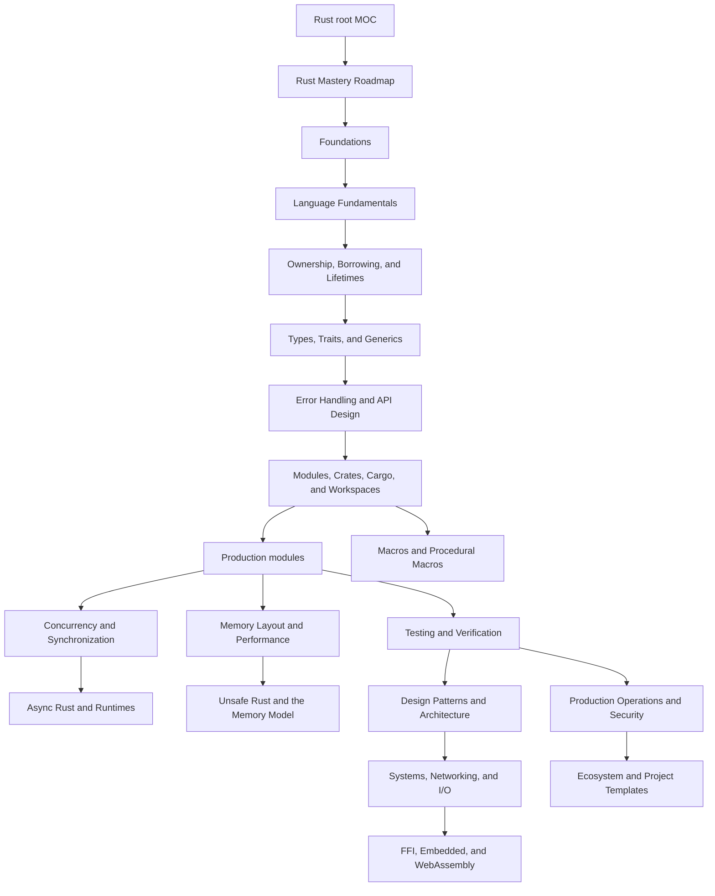

Purpose: Root navigation map for mastering Rust as a production systems language, linking the Rust compendium, adjacent vault knowledge, and the study order that turns language facts into engineering judgement.

# Rust

Rust is a systems programming language built around explicit ownership, predictable resource management, fearless concurrency, and strong static modeling. This note is the map of content, not a replacement for the leaf notes. Use it to decide what to read next, which concepts depend on each other, and how to connect Rust-specific skills to broader software engineering disciplines.

The fastest path through this compendium is not "read syntax, then build something large." It is: model ownership, practice small transformations, learn error and type design, add concurrency only when the single-threaded model is clean, then harden the result with tests, observability, profiling, release discipline, and security review.

## Rust note set

| Layer | Notes | What they are for | Exit signal |
|---|---|---|---|
| Orientation | [00 Rust Mastery Roadmap](/compendium/rust/rust-mastery-roadmap) | Study sequence, prerequisites, exercises, project ladder, and mastery checks. | You can choose the next practice project and explain why it fits your current gap. |
| Foundations | [01 Rust Language Fundamentals](/compendium/rust/rust-language-fundamentals), [02 Ownership Borrowing and Lifetimes](/compendium/rust/ownership-borrowing-and-lifetimes), [03 Types Traits and Generics](/compendium/rust/types-traits-and-generics) | Syntax, ownership, borrowing, lifetimes, algebraic data types, traits, generics, and compile-time reasoning. | You can explain a borrow-checker error by pointing to aliasing, lifetime, move, or trait-bound constraints. |
| Modeling and APIs | [04 Error Handling and API Design](/compendium/rust/error-handling-and-api-design), [05 Modules Crates Cargo and Workspaces](/compendium/rust/modules-crates-cargo-and-workspaces), [10 Macros Metaprogramming and Proc Macros](/compendium/rust/macros-metaprogramming-and-proc-macros) | Domain modeling, result flows, API boundaries, crate layout, features, workspace structure, macros, and generated code. | You can design a library API that makes invalid states hard to represent and keeps generated code auditable. |
| Memory and concurrency | [06 Memory Layout Performance and Zero Cost Abstractions](/compendium/rust/memory-layout-performance-and-zero-cost-abstractions), [07 Concurrency Parallelism and Synchronization](/compendium/rust/concurrency-parallelism-and-synchronization), [08 Async Rust Futures Tokio and Runtimes](/compendium/rust/async-rust-futures-tokio-and-runtimes), [09 Unsafe Rust and the Rust Memory Model](/compendium/rust/unsafe-rust-and-the-rust-memory-model) | Layout, allocation, zero-cost abstractions, atomics, locks, channels, tasks, runtimes, unsafe contracts, and memory-model reasoning. | You can justify ownership transfer, shared locking, message passing, async tasks, or unsafe code with explicit constraints. |
| Architecture and applications | [12 Rust Design Patterns and Architecture](/compendium/rust/rust-design-patterns-and-architecture), [13 Systems Programming Networking and IO](/compendium/rust/systems-programming-networking-and-io), [14 FFI Embedded WebAssembly and Interop](/compendium/rust/ffi-embedded-webassembly-and-interop) | Builders, typestate, newtypes, state machines, CLI design, web services, IO, serialization, databases, FFI, embedded, WASM, and boundary contracts. | You can choose a Rust application shape that matches the domain, deployment target, and integration boundary. |
| Production discipline | [11 Testing Verification Benchmarking and Tooling](/compendium/rust/testing-verification-benchmarking-and-tooling), [15 Production Rust Operations Security and Observability](/compendium/rust/production-rust-operations-security-and-observability), [16 Rust Ecosystem Crates and Project Templates](/compendium/rust/rust-ecosystem-crates-and-project-templates), <span className="compendium-external-reference" title="Vault-only reference">Software Supply Chain Security</span> | Tests, benchmarks, fuzzing, diagnostics, release checks, observability, security, dependency policy, templates, and build hygiene. | You can ship a Rust artifact with repeatable builds, useful diagnostics, regression tests, and documented operational behavior. |

## Adjacent vault anchors

Rust mastery uses more than Rust-specific facts. Keep these notes nearby:

- [Data Structures/Data Structures](/compendium/data-structures/data-structures) for collection behavior, cache locality, hash tables, trees, queues, and algorithmic invariants.
- [Design Patterns/Design patterns](/compendium/design-patterns/design-patterns) for comparing Rust traits, enums, builders, adapters, repositories, and plugin architectures against language-neutral patterns.
- [Software Engineering/Software Engineering](/compendium/software-engineering/software-engineering) for staff-level system thinking, execution, and quality bars.
- [Software Engineering/03 Data Structures Algorithms and Complexity](/compendium/software-engineering/data-structures-algorithms-and-complexity) for complexity analysis behind Rust implementation choices.
- [Software Engineering/05 Distributed Systems](/compendium/software-engineering/distributed-systems) for consensus, ordering, retries, idempotency, and failure models that affect Rust services.
- [Software Engineering/06 Caching Queues and Streaming](/compendium/software-engineering/caching-queues-and-streaming) and <span className="compendium-external-reference" title="Vault-only reference">Littles law and efficient queue strategy</span> for backpressure, capacity, async queues, and pipeline sizing.
- [Software Engineering/08 Reliability Observability and Operations](/compendium/software-engineering/reliability-observability-and-operations) for SLOs, runbooks, tracing, alerting, and operational readiness.
- [Software Engineering/09 Security and Supply Chain](/compendium/software-engineering/security-and-supply-chain) and <span className="compendium-external-reference" title="Vault-only reference">Software Supply Chain Security</span> for dependency hygiene, cargo audit, cargo deny, provenance, and release integrity.
- <span className="compendium-external-reference" title="Vault-only reference">Software testing</span> and [Software Engineering/10 Testing Verification and Quality Bars](/compendium/software-engineering/testing-verification-and-quality-bars) for test strategy, property testing, fuzzing, and regression gates.
- [kubernetes/Kubernetes](/compendium/kubernetes/kubernetes) for containerized deployment, probes, configuration, resource limits, rollout strategy, and observability integration.
- <span className="compendium-external-reference" title="Vault-only reference">Event-Driven Architectures and Event Sourcing</span> for durable event pipelines, idempotent consumers, and message schema evolution.

## How the compendium is organized

The note order is intentional. Rust has a high density of concepts that interact. Lifetimes affect iterator design. Trait bounds affect API compatibility. Error types affect observability. Runtime choice affects cancellation, shutdown, and backpressure. Unsafe code affects release engineering because the compiler no longer proves the same memory guarantees.



Read the foundation notes in sequence unless you already write Rust professionally. The production and boundary notes can be read in project-driven order, but the roadmap should still be used to prevent gaps. A Rust engineer who knows async but cannot model ownership clearly will eventually fight the compiler. A Rust engineer who knows ownership but lacks production discipline will write correct toy programs that are painful to operate.

## Study paths

| Path | Start here | Then read | Build this | Do not skip |
|---|---|---|---|---|
| New to Rust, experienced engineer | [00 Rust Mastery Roadmap](/compendium/rust/rust-mastery-roadmap) | [01 Rust Language Fundamentals](/compendium/rust/rust-language-fundamentals), [02 Ownership Borrowing and Lifetimes](/compendium/rust/ownership-borrowing-and-lifetimes), [03 Types Traits and Generics](/compendium/rust/types-traits-and-generics) | CLI parser plus file indexer. | Borrowing exercises with failing examples and fixed explanations. |
| Backend service engineer | [04 Error Handling and API Design](/compendium/rust/error-handling-and-api-design) | [08 Async Rust Futures Tokio and Runtimes](/compendium/rust/async-rust-futures-tokio-and-runtimes), [05 Modules Crates Cargo and Workspaces](/compendium/rust/modules-crates-cargo-and-workspaces), [11 Testing Verification Benchmarking and Tooling](/compendium/rust/testing-verification-benchmarking-and-tooling) | HTTP API with storage, tracing, graceful shutdown, and load tests. | Cancellation and backpressure design. |
| Systems or performance engineer | [06 Memory Layout Performance and Zero Cost Abstractions](/compendium/rust/memory-layout-performance-and-zero-cost-abstractions) | [07 Concurrency Parallelism and Synchronization](/compendium/rust/concurrency-parallelism-and-synchronization), [09 Unsafe Rust and the Rust Memory Model](/compendium/rust/unsafe-rust-and-the-rust-memory-model), [11 Testing Verification Benchmarking and Tooling](/compendium/rust/testing-verification-benchmarking-and-tooling) | Bounded queue, parser, allocator-sensitive benchmark, or FFI wrapper. | Soundness comments and benchmark discipline. |
| Platform or DevOps engineer | [05 Modules Crates Cargo and Workspaces](/compendium/rust/modules-crates-cargo-and-workspaces) | [11 Testing Verification Benchmarking and Tooling](/compendium/rust/testing-verification-benchmarking-and-tooling), <span className="compendium-external-reference" title="Vault-only reference">Software Supply Chain Security</span>, [kubernetes/Kubernetes](/compendium/kubernetes/kubernetes) | Operational CLI with config, structured logs, shell completions, release build, and container image. | Reproducible build and dependency policy. |
| Security-oriented engineer | [09 Unsafe Rust and the Rust Memory Model](/compendium/rust/unsafe-rust-and-the-rust-memory-model) | [11 Testing Verification Benchmarking and Tooling](/compendium/rust/testing-verification-benchmarking-and-tooling), [Software Engineering/09 Security and Supply Chain](/compendium/software-engineering/security-and-supply-chain), <span className="compendium-external-reference" title="Vault-only reference">Software Supply Chain Security</span> | Fuzzed parser or safe wrapper around a C API. | Undefined behavior review and panic boundary policy. |
| Application architect | [12 Rust Design Patterns and Architecture](/compendium/rust/rust-design-patterns-and-architecture) | [04 Error Handling and API Design](/compendium/rust/error-handling-and-api-design), [13 Systems Programming Networking and IO](/compendium/rust/systems-programming-networking-and-io), [15 Production Rust Operations Security and Observability](/compendium/rust/production-rust-operations-security-and-observability) | Service, CLI, or event-driven component with explicit domain boundaries. | Keeping abstractions simple enough for Rust's ownership and trait model. |
| Boundary and ecosystem engineer | [14 FFI Embedded WebAssembly and Interop](/compendium/rust/ffi-embedded-webassembly-and-interop) | [16 Rust Ecosystem Crates and Project Templates](/compendium/rust/rust-ecosystem-crates-and-project-templates), [05 Modules Crates Cargo and Workspaces](/compendium/rust/modules-crates-cargo-and-workspaces), [09 Unsafe Rust and the Rust Memory Model](/compendium/rust/unsafe-rust-and-the-rust-memory-model) | FFI wrapper, WASM module, no_std crate, or workspace template. | ABI, panic, allocation, dependency, and target-platform contracts. |

## Mental model

Rust's core promise is not "no bugs." It is that important classes of resource, aliasing, and thread-safety mistakes are forced into explicit design decisions. The compiler proves what it can from ownership, lifetimes, variance, trait bounds, auto traits, and visibility. Your job is to encode the correct constraints so the compiler can reject bad states.

```rust
#[derive(Debug, Clone, PartialEq, Eq)]
struct UserId(String);

#[derive(Debug)]
struct ActiveUser {
    id: UserId,
    email: String,
}

#[derive(Debug)]
enum RegistrationError {
    EmptyEmail,
    InvalidDomain,
}

fn register_user(id: UserId, email: String) -> Result<ActiveUser, RegistrationError> {
    if email.trim().is_empty() {
        return Err(RegistrationError::EmptyEmail);
    }

    if !email.ends_with("@example.com") {
        return Err(RegistrationError::InvalidDomain);
    }

    Ok(ActiveUser { id, email })
}
```

This small example is not about syntax. It shows Rust's preferred shape:

- Domain-specific newtypes avoid mixing unrelated strings.
- `Result` keeps failure explicit.
- `enum` errors keep cases enumerable.
- Constructors enforce invariants before values enter the rest of the program.
- Ownership makes the accepted `email` belong to the resulting `ActiveUser`.

## Reading and practice cadence

| Cadence | Activity | Evidence to keep |
|---|---|---|
| Daily | Read one section, type every example, then break it deliberately. | A short note explaining the compiler error in your own words. |
| Every 2 or 3 days | Build a tiny artifact that exercises the concept. | A passing test suite and a commit-sized diff, even if not committed. |
| Weekly | Refactor an earlier artifact with a new concept. | Before and after API shape, plus one paragraph on the tradeoff. |
| Every two weeks | Run a production-style review. | Checklist results for errors, tests, performance, security, docs, and operations. |

The best Rust practice loop is compile, test, inspect diagnostics, change the model, and repeat. Do not memorize workarounds. Write down why the model changed.

## Concept dependency map

| Concept | Depends on | Enables | Common failure mode |
|---|---|---|---|
| Ownership and moves | Values, stack, heap, scope | RAII, deterministic cleanup, transfer of responsibility. | Cloning to quiet move errors without understanding ownership. |
| Borrowing | References, mutability, aliasing | Efficient APIs without transfer. | Returning references to temporary data or mixing mutable and immutable borrows. |
| Lifetimes | Borrowing, scopes, generic parameters | Safe references inside structs, iterators, parsers. | Treating lifetime annotations as a way to extend object lifetime. |
| Traits | Static dispatch, dynamic dispatch, associated types | Generic APIs, capability boundaries, test seams. | Over-generalizing early and making type errors harder to read. |
| Enums and pattern matching | Algebraic data types | Exhaustive state machines and error flows. | Encoding state with strings or booleans instead of variants. |
| Interior mutability | Ownership, runtime borrow checking | Graphs, caches, shared test doubles, single-threaded shared state. | Using `RefCell` or `Mutex` to avoid designing ownership. |
| Async | Futures, pinning basics, executors, lifetimes | High-concurrency IO services. | Holding blocking locks across `.await` or ignoring cancellation. |
| Unsafe | Proven safe abstractions, aliasing rules, layout | FFI, low-level optimization, custom data structures. | Moving undefined behavior behind a nice API without proving invariants. |

## Production Rust principles

Production Rust is conservative Rust. Prefer simple ownership, explicit boundaries, small unsafe islands, clear errors, and automated quality gates.

| Decision | Prefer | Use cautiously | Review question |
|---|---|---|---|
| Error handling | Domain errors plus `thiserror`; `anyhow` at binary edges. | String errors, broad catch-all enums, panics in libraries. | Can an operator or caller act on this failure? |
| Concurrency | Message passing, bounded queues, short critical sections. | Global locks, unbounded channels, shared mutable graphs. | What applies backpressure and what shuts down first? |
| Async runtime | One runtime selected at the application boundary. | Mixing runtimes or spawning tasks without ownership of their lifecycle. | Who cancels, joins, drains, and reports task failures? |
| Dependencies | Small, audited, maintained crates with locked versions. | Convenience crates for small helpers, unreviewed transitive trees. | Does the dependency justify its supply-chain surface? |
| Unsafe | Isolated module, documented invariants, safe public API, Miri or fuzz tests where useful. | Unsafe sprinkled through business logic. | What must callers uphold, and who checks it? |
| Performance | Measure with profiles, benchmark stable scenarios, optimize hot paths. | Guessing, micro-optimizing cold code, excessive cloning. | Which metric changed and what regression guard exists? |

## Common mistakes

- Treating borrow-checker errors as compiler hostility instead of design feedback.
- Adding `.clone()` everywhere without identifying ownership boundaries.
- Returning `Box&lt;dyn Error&gt;` from library APIs that need structured error handling.
- Using `String` for every identifier instead of newtypes or enums.
- Holding a `MutexGuard` across `.await`.
- Spawning tasks without cancellation, join handles, or error reporting.
- Hiding IO, time, randomness, or environment access inside functions that should be deterministic.
- Building generic trait abstractions before two concrete implementations exist.
- Assuming `unsafe` is acceptable because tests pass.
- Shipping without `cargo fmt`, `cargo clippy`, tests, dependency audit, and release profile checks.

## Review checklist for Rust notes and projects

- Purpose is explicit and the intended user of the module is clear.
- Public types encode invariants instead of relying on comments.
- Ownership transfer is obvious at API boundaries.
- Borrowing avoids unnecessary allocation without exposing fragile lifetimes.
- Error types distinguish caller mistakes, domain failures, dependency failures, and operator-actionable failures.
- Tests include normal cases, edge cases, error cases, and at least one regression from a real bug or learning failure.
- Async code has bounded queues, cancellation, timeouts, and graceful shutdown.
- Unsafe code has documented invariants, minimal surface area, and tests that target its assumptions.
- Dependencies are justified and reviewed.
- Observability exists at boundaries, not only at the top-level command.
- Release artifacts are reproducible enough for the target environment.

## Root MOC maintenance rules

When adding a Rust leaf note, update this MOC and [00 Rust Mastery Roadmap](/compendium/rust/rust-mastery-roadmap) in the same change. Put conceptual depth in the leaf note. Put sequencing, prerequisites, and navigation here. If a note overlaps an existing vault area, link outward to the existing note rather than copying entire explanations. This keeps the Rust compendium focused on how Rust changes the engineering tradeoff.

## Knowledge Base Quality Contract

&gt; [!info] Evergreen does not mean timeless
&gt; `status: evergreen` means the note is maintained as reusable knowledge. The `last-reviewed`, `rust-edition`, and `rust-toolchain-verified` fields identify the evidence window; they do not promise that every ecosystem recommendation remains current forever.

Every Rust note should satisfy these constraints:

- Begin with parseable YAML properties, one H1, a purpose statement, and related-note links.
- Separate language guarantees from compiler implementation detail and crate behavior.
- Mark unsafe preconditions, cancellation behavior, resource bounds, and compatibility contracts explicitly.
- Prefer executable examples that show failure behavior as well as the happy path.
- Link claims to primary sources: the Reference, standard-library docs, official books, RFCs, compiler docs, or crate-owned documentation.
- Date ecosystem snapshots and flag deprecated or archived recommendations in place.
- Use wikilinks for durable conceptual navigation and normal Markdown links for external evidence.
- Avoid copying full explanations between notes. Link to the owning note and add only the boundary-specific consequence.
- Re-run link, heading, table, code-fence, source, and typography checks after structural edits.

### Source hierarchy

When sources disagree, investigate scope and version rather than averaging them:

1. The Rust Reference and standard-library documentation for language and library contracts.
2. Edition Guide, Cargo Book, rustc book, and official project books for tooling and migrations.
3. RFCs and tracking issues for design rationale and unstable work.
4. Crate-owned documentation and repositories for dependency-specific behavior.
5. Secondary books, posts, and talks for explanation, never as the sole authority for a safety claim.

### Review triggers

Review an affected note when the Rust edition, verified toolchain, MSRV, public crate major version, target platform, or deployment model changes. Immediately review claims after a soundness advisory, crate archival, compiler diagnostic that contradicts an example, or failed host-language integration test.

## Primary Sources

- [Rust documentation index](https://doc.rust-lang.org/)
- [The Rust Reference](https://doc.rust-lang.org/reference/)
- [The Rust Standard Library](https://doc.rust-lang.org/std/)
- [The Cargo Book](https://doc.rust-lang.org/cargo/)
- [The Rust Edition Guide](https://doc.rust-lang.org/edition-guide/)
- [The Rustonomicon](https://doc.rust-lang.org/nomicon/)
- [The Rust API Guidelines](https://rust-lang.github.io/api-guidelines/)
