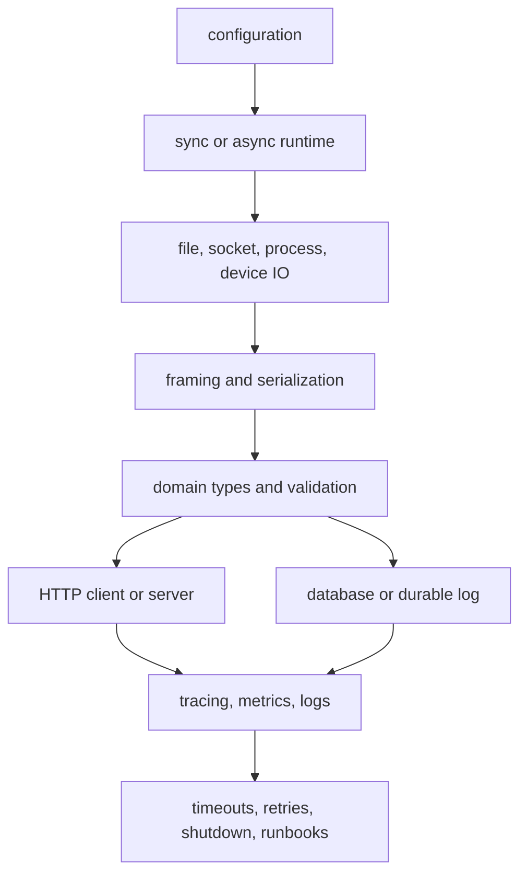

Purpose: explain Rust's production model for files, sockets, HTTP, serialization, and database access, with emphasis on ownership, backpressure, error handling, and operational review.

# Systems Programming, Networking, and I/O

Related notes: [Rust](/compendium/rust/rust), [04 Error Handling and API Design](/compendium/rust/error-handling-and-api-design), [05 Modules Crates Cargo and Workspaces](/compendium/rust/modules-crates-cargo-and-workspaces), [07 Concurrency Parallelism and Synchronization](/compendium/rust/concurrency-parallelism-and-synchronization), [08 Async Rust Futures Tokio and Runtimes](/compendium/rust/async-rust-futures-tokio-and-runtimes), [11 Testing Verification Benchmarking and Tooling](/compendium/rust/testing-verification-benchmarking-and-tooling), [Software Engineering/05 Distributed Systems](/compendium/software-engineering/distributed-systems), [Software Engineering/06 Caching Queues and Streaming](/compendium/software-engineering/caching-queues-and-streaming), [Software Engineering/08 Reliability Observability and Operations](/compendium/software-engineering/reliability-observability-and-operations).

## Systems boundary model

Systems Rust is mostly boundary work. Your program crosses the kernel boundary for files, sockets, timers, process state, entropy, memory maps, and device APIs. Rust's type system still helps, but it does not remove partial writes, short reads, interrupted syscalls, corrupt input, protocol drift, database contention, retries, latency spikes, or operator error.

The production shape is:



Every boundary should answer five questions:

| Question | Production answer |
|---|---|
| What owns the resource? | A type that closes, flushes, or joins through RAII or explicit shutdown. |
| What is bounded? | Buffer sizes, concurrent requests, task counts, retry budgets, database pools. |
| What is validated? | External bytes become typed domain values only after parsing and semantic checks. |
| What is observable? | Errors include context, request IDs are propagated, slow operations are measured. |
| What fails closed? | Corrupt input, impossible states, auth failures, partial writes, and unknown enum variants. |

## File IO

The standard library gives portable file primitives through `std::fs` and `std::io`. Synchronous file IO is often the right default for CLIs, build tools, migrations, startup config, and small utilities. Async file IO can help service workloads, but many runtimes implement filesystem operations on blocking pools because ordinary files are not readiness based in the same way as sockets.

```rust
use std::fs::File;
use std::io::{self, BufRead, BufReader, Read, Write};
use std::path::Path;

fn copy_nonempty_lines(input: &Path, output: &Path) -> io::Result<usize> {
    let reader = BufReader::new(File::open(input)?);
    let mut writer = File::create(output)?;
    let mut written = 0;

    for line in reader.lines() {
        let line = line?;
        let trimmed = line.trim();
        if !trimmed.is_empty() {
            writeln!(writer, "{trimmed}")?;
            written += 1;
        }
    }

    writer.flush()?;
    Ok(written)
}
```

Important distinctions:

| API | Use when | Risk |
|---|---|---|
| `std::fs::read_to_string` | Small trusted text files. | Loads the whole file and assumes UTF-8. |
| `File` plus `Read` and `Write` | You need streaming control. | Must handle partial reads and writes. |
| `BufReader` and `BufWriter` | Many small reads or writes. | Must flush before relying on output. |
| `read_exact` | Fixed-size binary records. | Fails on early EOF, which is usually correct. |
| `write_all` | The full buffer must be written. | Can still fail after a partial write. |
| `tempfile` | Atomic writes, tests, and safe temporary files. | Cross-filesystem rename semantics still matter. |
| `memmap2` | Large read-mostly files where OS paging helps. | Unsafe-adjacent aliasing and file mutation concerns. |

Atomic replace pattern:

```rust
use std::fs;
use std::io::{self, Write};
use std::path::Path;

fn write_config_atomically(path: &Path, contents: &[u8]) -> io::Result<()> {
    let dir = path.parent().ok_or_else(|| {
        io::Error::new(io::ErrorKind::InvalidInput, "path has no parent directory")
    })?;
    let mut tmp = tempfile::NamedTempFile::new_in(dir)?;
    tmp.write_all(contents)?;
    tmp.flush()?;
    tmp.as_file().sync_all()?;
    tmp.persist(path)
        .map_err(|err| io::Error::new(err.error.kind(), err.error))?;
    fs::File::open(dir)?.sync_all()?;
    Ok(())
}
```

Review file code for symlink expectations, permissions, path traversal, truncation, fsync requirements, encoding, maximum size, and crash consistency. Not every file needs fsync, but durable state must make the durability contract explicit.

## TCP

TCP is a reliable byte stream, not a message protocol. Your application must define framing, limits, deadlines, and connection lifecycle. Rust's `TcpStream` does not know where one request ends and the next begins.

```rust
use std::io::{self, BufRead, BufReader, Read, Write};
use std::net::{TcpListener, TcpStream};
use std::time::Duration;

fn handle_client(mut stream: TcpStream) -> io::Result<()> {
    const MAX_FRAME_BYTES: u64 = 4096;

    stream.set_read_timeout(Some(Duration::from_secs(5)))?;
    stream.set_write_timeout(Some(Duration::from_secs(5)))?;

    let peer = stream.peer_addr()?;
    let mut reader = BufReader::new(stream.try_clone()?);
    let mut line = String::new();

    // Read at most one byte beyond the limit so oversized frames are detected
    // before the String can grow without bound.
    let bytes = reader
        .by_ref()
        .take(MAX_FRAME_BYTES + 1)
        .read_line(&mut line)?;
    if bytes == 0 {
        return Ok(());
    }

    if bytes as u64 > MAX_FRAME_BYTES || !line.ends_with('\n') {
        writeln!(stream, "ERR frame too large")?;
        return Ok(());
    }

    writeln!(stream, "OK {peer} {}", line.trim())?;
    Ok(())
}

fn serve(addr: &str) -> io::Result<()> {
    let listener = TcpListener::bind(addr)?;
    for stream in listener.incoming() {
        match stream {
            Ok(stream) => {
                std::thread::spawn(move || {
                    let _ = handle_client(stream);
                });
            }
            Err(err) => eprintln!("accept failed: {err}"),
        }
    }
    Ok(())
}
```

This example is intentionally simple. A real server also needs bounded concurrency, graceful shutdown, structured logging, TLS policy, keepalive policy, protocol versioning, and protection against slow clients.

Async TCP with Tokio is the common service shape:

```rust
use tokio::io::{AsyncBufReadExt, AsyncReadExt, AsyncWriteExt, BufReader};
use tokio::net::{TcpListener, TcpStream};
use tokio::time::{timeout, Duration};

async fn handle_socket(stream: TcpStream) -> std::io::Result<()> {
    const MAX_FRAME_BYTES: u64 = 4096;

    let (read_half, mut write_half) = stream.into_split();
    let mut reader = BufReader::new(read_half);
    let mut line = String::new();

    let mut limited = reader.take(MAX_FRAME_BYTES + 1);
    let read = timeout(Duration::from_secs(5), limited.read_line(&mut line)).await??;
    if read == 0 {
        return Ok(());
    }

    if read as u64 > MAX_FRAME_BYTES || !line.ends_with('\n') {
        write_half.write_all(b"ERR frame too large\n").await?;
        return Ok(());
    }

    write_half.write_all(b"OK\n").await?;
    Ok(())
}

async fn serve_tcp(addr: &str) -> std::io::Result<()> {
    let listener = TcpListener::bind(addr).await?;
    loop {
        let (stream, _) = listener.accept().await?;
        tokio::spawn(async move {
            if let Err(err) = handle_socket(stream).await {
                tracing::warn!(error = %err, "connection failed");
            }
        });
    }
}
```

TCP mistakes:

- Treating reads as message boundaries.
- Using unbounded per-connection buffers.
- Spawning unlimited tasks or threads.
- Forgetting deadlines and idle timeouts.
- Ignoring half-close behavior and shutdown ordering.
- Logging payloads that may contain secrets.
- Assuming local tests cover packet loss, delay, resets, or slow receivers.

## UDP

UDP is datagram oriented. It preserves message boundaries, but it does not guarantee delivery, ordering, uniqueness, or congestion control. UDP is appropriate for discovery, telemetry, DNS-like request response, game state, QUIC internals, and systems where stale data is cheaper than head-of-line blocking.

```rust
use std::net::UdpSocket;
use std::time::Duration;

fn udp_echo(addr: &str) -> std::io::Result<()> {
    let socket = UdpSocket::bind(addr)?;
    socket.set_read_timeout(Some(Duration::from_secs(2)))?;

    let mut buf = [0_u8; 1500];
    loop {
        let (len, peer) = socket.recv_from(&mut buf)?;
        if len > 1200 {
            continue;
        }
        socket.send_to(&buf[..len], peer)?;
    }
}
```

UDP design checklist:

| Concern | Guidance |
|---|---|
| Size | Keep payloads below path MTU or handle fragmentation risk. |
| Loss | Add retries, sequence numbers, or accept loss explicitly. |
| Ordering | Include sequence numbers when order matters. |
| Amplification | Avoid responding with much larger packets than the request. |
| Security | Authenticate messages before spending expensive CPU. |
| Backpressure | Kernel buffers can overflow silently under burst load. |

## HTTP clients and servers

HTTP clients and servers in Rust should be designed together at the policy level: timeouts, connection pools, body limits, retries, tracing, authentication, and shutdown shape both sides of a service boundary.

## HTTP clients

HTTP clients in Rust usually use `reqwest` for application code, `hyper` for lower-level protocol work, and `ureq` for small synchronous tools. Pick based on runtime, TLS, feature size, and need for middleware.

```rust
use serde::Deserialize;
use std::time::Duration;

#[derive(Debug, Deserialize)]
struct Release {
    tag_name: String,
}

async fn latest_release(owner: &str, repo: &str) -> anyhow::Result<Release> {
    let client = reqwest::Client::builder()
        .timeout(Duration::from_secs(10))
        .user_agent("rust-notes-example")
        .build()?;

    let url = format!("https://api.github.com/repos/{owner}/{repo}/releases/latest");
    let response = client.get(url).send().await?;

    let status = response.status();
    if !status.is_success() {
        let body = response.text().await.unwrap_or_default();
        anyhow::bail!("request failed with status {status}: {body}");
    }

    Ok(response.json::<Release>().await?)
}
```

Production client policy:

- Set connect and total timeouts.
- Bound response body sizes before parsing when possible.
- Use retries only for idempotent or explicitly retry-safe requests.
- Add jittered backoff and a retry budget.
- Propagate trace headers and request IDs.
- Separate transport errors, HTTP status errors, parse errors, and domain validation errors.
- Avoid building a new client per request because connection pools live in the client.

## HTTP servers

Rust HTTP server stacks usually compose a runtime, protocol implementation, router, extractors, middleware, and application state. `axum` is common with Tokio and Tower. `actix-web` remains popular and mature. `warp` is expressive but less dominant for new services. `hyper` is the lower-level building block.

```rust
use axum::{
    extract::State,
    http::StatusCode,
    routing::{get, post},
    Json, Router,
};
use serde::{Deserialize, Serialize};
use std::sync::Arc;

#[derive(Clone)]
struct AppState {
    service_name: Arc<str>,
}

#[derive(Debug, Deserialize)]
struct CreateUser {
    email: String,
}

#[derive(Debug, Serialize)]
struct UserResponse {
    id: String,
    email: String,
}

async fn health() -> StatusCode {
    StatusCode::NO_CONTENT
}

async fn create_user(
    State(state): State<AppState>,
    Json(input): Json<CreateUser>,
) -> Result<Json<UserResponse>, StatusCode> {
    if !input.email.contains('@') {
        return Err(StatusCode::BAD_REQUEST);
    }

    let id = format!("{}-1", state.service_name);
    Ok(Json(UserResponse {
        id,
        email: input.email,
    }))
}

fn app(state: AppState) -> Router {
    Router::new()
        .route("/healthz", get(health))
        .route("/users", post(create_user))
        .with_state(state)
}
```

Server tradeoffs:

| Stack | Strength | Cost |
|---|---|---|
| `axum` | Tower ecosystem, typed extractors, clear composition. | Requires understanding layers and async state. |
| `actix-web` | Mature, fast, broad ecosystem. | Distinct actor-flavored history and API conventions. |
| `hyper` | Protocol control and minimal abstraction. | You build routing, middleware, and ergonomics yourself. |
| `poem` | Integrated OpenAPI options. | Smaller mindshare than axum or actix-web. |
| `rocket` | High-level developer ergonomics. | Heavier framework decisions. |

Server review questions:

- Are request bodies size-limited?
- Are extractors doing syntax parsing while domain constructors do semantic validation?
- Is state cheap to clone, usually `Arc` around shared handles?
- Are database pools, queues, and outbound clients bounded?
- Are graceful shutdown and readiness separated?
- Are 4xx, 5xx, and dependency failures observable without exposing secrets?
- Are tracing spans created at ingress and propagated through outbound calls?

## Serialization with serde

Serde is the default Rust serialization framework. It separates data model traits from formats. `Serialize` and `Deserialize` describe how a type maps to a format, while crates such as `serde_json`, `toml`, `postcard`, and CBOR adapters provide concrete encodings. The original [`serde_yaml`](https://github.com/dtolnay/serde-yaml) crate is deprecated and archived; for YAML, select an actively maintained Serde adapter such as `serde-saphyr` only after testing compatibility with the exact YAML subset and security limits your system accepts.

```rust
use serde::{Deserialize, Serialize};

#[derive(Debug, Clone, Serialize, Deserialize)]
#[serde(rename_all = "snake_case")]
enum JobState {
    Queued,
    Running,
    Succeeded,
    Failed,
}

#[derive(Debug, Clone, Serialize, Deserialize)]
struct JobRecord {
    id: String,
    state: JobState,
    #[serde(default)]
    attempts: u32,
}

fn decode_job(input: &str) -> serde_json::Result<JobRecord> {
    serde_json::from_str(input)
}
```

Format tradeoffs:

| Format | Best for | Watch for |
|---|---|---|
| JSON via `serde_json` | Public APIs, logs, interoperability. | Number precision, unknown fields, schema drift. |
| TOML via `toml` | Human-edited configuration. | Deep nesting gets awkward. |
| YAML via a maintained Serde adapter | Human-authored documents where YAML is required. | Ambiguous types, aliases, merge keys, parser limits, and compatibility differences between implementations. |
| bincode 2, legacy only | Existing Rust-to-Rust data that already depends on its encoding. | The project is unmaintained; bincode 3 intentionally fails compilation. Plan migration. |
| postcard | Compact `no_std` friendly binary messages. | Schema evolution must be designed deliberately. |
| CBOR through `ciborium` or `minicbor` | Standardized self-describing binary interchange. | Canonical form, numeric mapping, and implementation limits. |
| Protobuf through `prost` | Versioned cross-language contracts. | Schema and code-generation lifecycle. |
| `rkyv` | Validated archived representation for read-heavy Rust data. | Format and validation contract, alignment, and schema evolution. |

Serde attributes are API design:

| Attribute | Use |
|---|---|
| `rename_all` | Stable external naming style. |
| `default` | Backward-compatible fields during rollout. |
| `deny_unknown_fields` | Strict config or security-sensitive input. |
| `skip_serializing_if` | Omit empty optional fields from wire output. |
| `tag` and `content` | Explicit enum representation for external APIs. |
| `with` | Custom encoding modules for timestamps, IDs, or legacy shapes. |

Use strictness intentionally. Public APIs often allow unknown fields for forward compatibility. Human-edited security config often rejects unknown fields to catch misspellings.

## JSON, TOML, YAML, Legacy bincode 2, and postcard examples

&gt; [!warning] bincode maintenance status
&gt; The bincode 3.0.0 release intentionally contains a compile error announcing that the project is unmaintained. The function below documents compatibility with already deployed bincode 2 data only. Pin `bincode = { version = "=2.0.1", features = ["serde"] }` while planning a migration; do not let a broad requirement resolve to version 3.

```rust
use serde::{Deserialize, Serialize};

#[derive(Debug, Serialize, Deserialize, PartialEq)]
struct SensorSample {
    device_id: u32,
    celsius: i16,
}

fn roundtrip_json(sample: &SensorSample) -> anyhow::Result<SensorSample> {
    let bytes = serde_json::to_vec(sample)?;
    Ok(serde_json::from_slice(&bytes)?)
}

fn roundtrip_legacy_bincode_v2(sample: &SensorSample) -> anyhow::Result<SensorSample> {
    let bytes = bincode::serde::encode_to_vec(sample, bincode::config::standard())?;
    let (decoded, _): (SensorSample, usize) =
        bincode::serde::decode_from_slice(&bytes, bincode::config::standard())?;
    Ok(decoded)
}

fn roundtrip_postcard(sample: &SensorSample) -> postcard::Result<SensorSample> {
    let mut buf = [0_u8; 32];
    let encoded = postcard::to_slice(sample, &mut buf)?;
    postcard::from_bytes(encoded)
}
```

Configuration parsing should validate after deserialization:

```rust
use serde::Deserialize;

#[derive(Debug, Deserialize)]
#[serde(deny_unknown_fields)]
struct HttpConfig {
    bind_addr: String,
    max_body_bytes: usize,
}

impl HttpConfig {
    fn validate(self) -> anyhow::Result<Self> {
        if self.max_body_bytes == 0 || self.max_body_bytes > 10 * 1024 * 1024 {
            anyhow::bail!("max_body_bytes must be between 1 and 10485760");
        }
        Ok(self)
    }
}
```

## Database access

Database code is a systems boundary: it combines network IO, serialization, concurrency, locking, migrations, schema evolution, and operational failure. The main Rust choices are `sqlx`, `diesel`, and SeaORM.

| Library | Model | Strength | Cost |
|---|---|---|---|
| `sqlx` | Async SQL with compile-time query checking. | Keeps SQL visible, strong fit for services, pools included. | Requires database URL or offline metadata for checked macros. |
| `diesel` | Query builder and ORM-like typed schema. | Strong compile-time typing, mature migrations, sync model. | More generated schema and type complexity. |
| SeaORM | Async ORM built on SeaQuery. | Entity model, relations, migrations, async-first. | More abstraction over SQL and larger dependency surface. |
| `tokio-postgres` | Lower-level async PostgreSQL. | Protocol control. | You build more patterns yourself. |
| `rusqlite` | SQLite bindings. | Great embedded and local storage option. | Sync API and SQLite concurrency semantics. |

## sqlx

`sqlx` is a good default for async services that want explicit SQL.

```rust
use serde::Serialize;
use sqlx::{PgPool, types::Uuid};

#[derive(Debug, Serialize)]
struct UserRow {
    id: Uuid,
    email: String,
}

async fn find_user(pool: &PgPool, id: Uuid) -> sqlx::Result<Option<UserRow>> {
    sqlx::query_as!(
        UserRow,
        r#"
        SELECT id, email
        FROM users
        WHERE id = $1
        "#,
        id
    )
    .fetch_optional(pool)
    .await
}
```

Production `sqlx` guidance:

- Use migrations as part of deploy choreography, not a manual side quest.
- Prefer `query!` and `query_as!` for checked SQL where possible.
- Use offline prepare metadata in CI when a database is not available.
- Set pool size based on database capacity, not service replica dreams.
- Use transactions for invariants that span statements.
- Avoid holding transactions across network calls.
- Add statement timeouts and request deadlines.

## Diesel

Diesel is valuable when you want a strongly typed schema and query builder, often in synchronous applications or when a blocking pool is acceptable.

```rust
use diesel::prelude::*;

diesel::table! {
    users (id) {
        id -> Integer,
        email -> Text,
    }
}

#[derive(Debug, Queryable, Selectable)]
#[diesel(table_name = users)]
struct User {
    id: i32,
    email: String,
}

fn load_user(conn: &mut PgConnection, user_id: i32) -> QueryResult<User> {
    users::table
        .filter(users::id.eq(user_id))
        .select(User::as_select())
        .first(conn)
}
```

Diesel tradeoff: the compiler can catch many query shape mistakes, but error messages and generic types can become dense. The schema is a real part of the Rust API, so schema churn affects compile-time contracts.

## SeaORM overview

SeaORM is an async ORM for applications that prefer entity objects, relation helpers, and generated code over hand-written SQL. It fits CRUD-heavy services, admin backends, and teams that value ORM conventions. For query-heavy domains where SQL clarity is central, `sqlx` can be easier to audit.

```rust
use sea_orm::{ColumnTrait, DatabaseConnection, EntityTrait, QueryFilter};

async fn find_by_email(
    db: &DatabaseConnection,
    email: &str,
) -> Result<Option<entity::user::Model>, sea_orm::DbErr> {
    entity::user::Entity::find()
        .filter(entity::user::Column::Email.eq(email))
        .one(db)
        .await
}
```

Review SeaORM use for generated entity ownership, migration review, relation loading behavior, query count, and how domain invariants are enforced outside generated models.

## Short IO, Interruption, and EOF

`Read::read` and `Write::write` may transfer fewer bytes than requested without signaling an error. A zero-length read means EOF for ordinary streams when the provided buffer was non-empty. A zero-length write when data remains is usually reported as `WriteZero` by higher-level helpers.

- Use `read_exact` only when the protocol requires exactly that many bytes and distinguish `UnexpectedEof` from a clean message boundary.
- Use `write_all` for complete buffers, but still define what a partial external side effect means if an error occurs.
- Retry `ErrorKind::Interrupted` where the API or helper does not already do so.
- Treat `WouldBlock` as a readiness state, not a connection failure.
- Preserve buffered unread bytes between frames. One socket read is not one message.

Cancellation adds another partial-progress boundary in async code. Consult the specific operation's contract before placing it in `select!`, and design framing so an abandoned operation does not lose already-consumed bytes.

## Length-delimited Binary Framing

A binary frame normally needs a fixed-width prefix, explicit endianness, version or message type, payload limit, and integrity policy.

```rust
use std::io::{self, Read};

const MAX_FRAME: usize = 1024 * 1024;

fn read_frame(mut reader: impl Read) -> io::Result<Vec<u8>> {
    let mut header = [0_u8; 4];
    reader.read_exact(&mut header)?;
    let len = u32::from_be_bytes(header) as usize;
    if len > MAX_FRAME {
        return Err(io::Error::new(io::ErrorKind::InvalidData, "frame too large"));
    }

    let mut payload = vec![0_u8; len];
    reader.read_exact(&mut payload)?;
    Ok(payload)
}
```

Validate the length before allocation and perform checked arithmetic when a frame contains nested lengths. Define whether EOF between frames is clean and EOF within a frame is truncation. For durable or adversarial formats, include a magic value, version, checksum or authentication tag, canonical encoding rules, and compatibility tests.

## Owned OS Handles and I/O Safety

Rust's owned and borrowed handle types encode lifetime and close responsibility around operating-system resources.

On Unix-like targets:

- `OwnedFd` owns one file descriptor and closes it on drop.
- `BorrowedFd&lt;'a&gt;` proves the descriptor remains open for the borrow lifetime.
- `AsFd` returns a lifetime-bound borrow and is preferable when an API needs temporary access.
- `AsRawFd` returns only the integer descriptor. The number carries no lifetime and can be reused by the OS after close.
- `IntoRawFd` transfers close responsibility to the caller.
- `FromRawFd` is unsafe because the caller must prove valid, unique ownership of an open descriptor.

Windows provides parallel `OwnedHandle`, `BorrowedHandle`, `AsHandle`, and raw-handle traits. Keep platform-specific ownership in adapter modules.

Never construct two owned wrappers for the same raw handle, close a value obtained only through `AsRawFd` or `AsRawHandle`, or retain a borrowed wrapper after the owner can close. Set close-on-exec or non-inheritable behavior deliberately so child processes do not keep resources alive unexpectedly.

## Memory-mapped Files

Memory mapping can remove explicit copy syscalls and let the kernel page file data on demand. It also makes file state part of the memory-safety and failure model.

- Keep mapped data as bytes unless alignment, initialization, endianness, and typed validity are independently proved.
- A file truncated while mapped can fault the process on some systems.
- Concurrent external modification can produce inconsistent or torn application data even when Rust references look immutable.
- Mapping huge files can create page-fault and address-space pressure; sequential buffered I/O may be faster and easier to bound.
- A flush request and a crash-durability guarantee are not identical. Include filesystem and storage behavior in the contract.
- Never expose a safe API that permits mutable and immutable aliases to the same mapped region.

Crates such as `memmap2` mark mapping creation unsafe where the library cannot control later file mutation. Wrap mappings behind a format validator and an ownership policy.

## Processes, Pipes, and Signals

`std::process::Command` passes an argument vector directly; it does not invoke a shell unless the program explicitly launches one. Avoid `sh -c` with untrusted interpolation. Set the working directory, environment allowlist, stdio policy, and inherited handles deliberately.

Piped stdout and stderr must be drained while the child runs. Waiting first can deadlock when the child fills an OS pipe buffer. Define termination escalation, process-group behavior, exit-status mapping, and whether grandchildren must be reaped. Dropping `std::process::Child` does not guarantee the process is killed or waited upon.

Raw Unix signal handlers can execute in highly restricted contexts. Do not allocate, lock, log, or perform ordinary Rust I/O from the handler. Use an established crate such as `signal-hook`, a self-pipe, or runtime signal integration to convert the signal into normal control flow. Signal delivery can coalesce, so the durable shutdown state matters more than a counted notification.

Unix-domain sockets are useful for local IPC but still need filesystem permission, stale-socket cleanup, peer-identity, framing, and backpressure policy. Platform peer-credential APIs are OS-specific and should be wrapped behind a tested adapter.

## Readiness and Completion APIs

Linux epoll and BSD/macOS kqueue report readiness: an operation may proceed without blocking, but the program must still perform the read or write and handle `WouldBlock`. Edge-triggered designs normally drain until `WouldBlock` before waiting again. Completion systems such as io_uring describe submitted operations and completed results, with different buffer-lifetime and cancellation obligations.

Async runtimes abstract these mechanisms, but the OS rules still leak through in readiness races, file-descriptor limits, half-close behavior, and cancellation. Prefer runtime abstractions for application code; use direct APIs only when platform-specific capability or measured performance justifies the added state machine.

## Filesystem Confinement and Durability

Lexical path normalization does not prevent symlink traversal or time-of-check to time-of-use races. For untrusted relative paths, use directory-relative capability APIs, avoid following links where policy forbids them, and verify the opened object rather than only its earlier path string. Libraries such as `cap-std` or platform `openat` wrappers can make the authority boundary explicit.

For a crash-durable atomic file replacement on a local filesystem:

1. Create a uniquely named temporary in the destination directory.
2. Write the complete content and flush userspace buffers.
3. Call `sync_all` when durable file data is required.
4. Rename over the destination using platform-appropriate semantics.
5. Sync the parent directory when durable name updates are required.

Filesystem, network mount, and operating-system semantics differ. Test the actual deployment filesystem and state what survives a process crash versus a power loss.

## DNS and TLS as System Boundaries

Name resolution can return several addresses, block, fail transiently, or change between attempts. Use the runtime's async resolver path where needed, apply an overall connection deadline, and define address-family fallback. Never cache DNS indefinitely without respecting the system or protocol policy.

TLS policy includes trust roots, hostname verification, protocol versions, cipher policy, ALPN, client certificates, time validity, session resumption, and certificate rotation. Reuse client connection pools, keep insecure verification impossible in production configuration, and test the selected `rustls` or native TLS backend on every supported target.

## Production guidance

| Boundary | Default posture | Escalate when |
|---|---|---|
| Files | Stream, limit size, write atomically for durable state. | Crash consistency or multi-process locking matters. |
| TCP | Define framing, deadlines, and bounded concurrency. | Protocol state machines or TLS policy become complex. |
| UDP | Keep datagrams small and authenticate before expensive work. | Reliability or congestion control is required. |
| HTTP client | Reuse clients, set timeouts, classify failures. | Cross-service retries affect system load. |
| HTTP server | Bound body, concurrency, pool, queue, and shutdown. | Public internet, multi-tenant, or auth-sensitive traffic. |
| Serialization | Choose schema evolution policy before deployment. | Data is durable or consumed by other languages. |
| Database | Treat schema, pool, and migrations as deployment interfaces. | Transactions encode business-critical invariants. |

## Common mistakes

- Reading entire files or bodies without a maximum size.
- Confusing `read` with `read_exact` and `write` with `write_all`.
- Treating TCP as packets instead of bytes.
- Using UDP without sequence numbers, auth, or loss policy where correctness needs them.
- Creating one HTTP client per request.
- Retrying non-idempotent requests without an idempotency key.
- Deserializing external data directly into privileged internal types.
- Letting YAML's flexible syntax stand in for validation.
- Using binary serialization for durable data without versioning tests.
- Sizing database pools per service instance without considering total database connections.
- Keeping database transactions open while awaiting slow remote services.
- Returning raw database errors to public clients.

## Review checklist

- Untrusted file access uses a confinement strategy that resists traversal, symlink, and check-use races.
- File writes define durability expectations and use atomic replace when needed.
- TCP protocols have explicit framing, maximum frame size, deadlines, and shutdown behavior.
- UDP protocols state loss, ordering, duplicate, and amplification policy.
- HTTP clients reuse connection pools and have timeouts, retry budgets, and error classification.
- HTTP servers bound body size, request time, concurrency, and state access.
- Serde models separate wire shape from validated domain state where invariants matter.
- JSON, TOML, YAML, maintained binary formats, and any legacy bincode 2 use are justified by consumers and evolution needs.
- Database migrations, pool sizes, transaction boundaries, and query timeouts are reviewed.
- Tests include serialization compatibility, database integration, timeout behavior, and failure paths.

## Primary Sources

- [`std::io` module documentation](https://doc.rust-lang.org/std/io/)
- [`std::net` module documentation](https://doc.rust-lang.org/std/net/)
- [`std::process` module documentation](https://doc.rust-lang.org/std/process/)
- [Unix owned and borrowed file descriptors](https://doc.rust-lang.org/std/os/fd/)
- [Windows owned and borrowed handles](https://doc.rust-lang.org/std/os/windows/io/)
- [`memmap2` documentation](https://docs.rs/memmap2/latest/memmap2/)
- [Tokio I/O documentation](https://docs.rs/tokio/latest/tokio/io/)
- [Serde documentation](https://serde.rs/)
- [bincode 3 maintenance notice](https://docs.rs/bincode/latest/bincode/)
- [Rustls documentation](https://docs.rs/rustls/latest/rustls/)
- [Linux `epoll(7)`](https://man7.org/linux/man-pages/man7/epoll.7.html)
- [liburing and io_uring documentation](https://github.com/axboe/liburing)
- [SQLx documentation](https://docs.rs/sqlx/latest/sqlx/)
