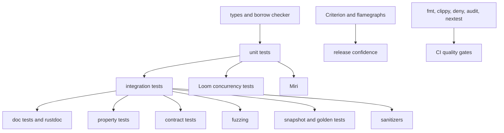

Purpose: Build a rigorous Rust quality system that combines unit tests, integration tests, doc tests, property testing, fuzzing, snapshots, golden tests, contract tests, concurrency verification, Miri, sanitizers, benchmarking, profiling, and CI quality gates.

# Testing, Verification, Benchmarking, and Tooling

Related notes: [Rust](/compendium/rust/rust), [04 Error Handling and API Design](/compendium/rust/error-handling-and-api-design), [05 Modules Crates Cargo and Workspaces](/compendium/rust/modules-crates-cargo-and-workspaces), [08 Async Rust Futures Tokio and Runtimes](/compendium/rust/async-rust-futures-tokio-and-runtimes), [10 Macros Metaprogramming and Proc Macros](/compendium/rust/macros-metaprogramming-and-proc-macros), <span className="compendium-external-reference" title="Vault-only reference">Software testing</span>, <span className="compendium-external-reference" title="Vault-only reference">Software Supply Chain Security</span>, [Software Engineering/10 Testing Verification and Quality Bars](/compendium/software-engineering/testing-verification-and-quality-bars), [Software Engineering/11 Performance Capacity and Cost](/compendium/software-engineering/performance-capacity-and-cost).

## Quality model

Rust's type system prevents large classes of memory and data-race bugs, but it does not prove product behavior. You still need executable examples, negative tests, randomized checks, protocol tests, concurrency exploration, unsafe-code verification, and performance evidence.



Good Rust verification is layered:

| Layer | Best at | Weak at |
|---|---|---|
| Type system | Ownership, lifetimes, trait contracts, impossible states. | Business behavior and external systems. |
| Unit tests | Small deterministic behavior. | Cross-crate and deployment wiring. |
| Integration tests | Public API and end-to-end boundaries. | Exhaustive input exploration. |
| Doc tests | API examples and documentation truth. | Complex setup and slow flows. |
| Property tests | Invariants across many inputs. | Explaining a single product scenario. |
| Fuzzing | Parser and boundary robustness. | Semantic assertions without an oracle. |
| Loom | Concurrency interleavings. | Full production runtime scale. |
| Miri and sanitizers | Undefined behavior and memory bugs. | Pure business rules. |
| Benchmarks | Regression signals and profiling entry points. | Functional correctness. |

## Unit tests

Unit tests usually live next to the code under `#[cfg(test)]`.

```rust
pub fn normalize_email(input: &str) -> Option<String> {
    let trimmed = input.trim();
    if trimmed.is_empty() || !trimmed.contains('@') {
        return None;
    }

    Some(trimmed.to_ascii_lowercase())
}

#[cfg(test)]
mod tests {
    use super::*;

    #[test]
    fn trims_and_lowercases_email() {
        assert_eq!(
            normalize_email("  USER@Example.COM "),
            Some("user@example.com".to_string())
        );
    }

    #[test]
    fn rejects_empty_input() {
        assert_eq!(normalize_email("   "), None);
    }
}
```

Unit test guidance:

- Test invariants, edge cases, and error cases.
- Keep tests deterministic by default.
- Use small fixtures inline unless sharing reduces real duplication.
- Prefer domain assertions over snapshotting everything.
- Name tests after behavior, not implementation.

## Integration tests

Integration tests live in `tests/*.rs` and use the crate as an external consumer.

```rust
// tests/parser_contract.rs
use product_parser::{parse, Event};

#[test]
fn parses_created_event_from_public_api() {
    let event = parse(r#"{"type":"created","id":"a-123"}"#).unwrap();

    assert_eq!(
        event,
        Event::Created {
            id: "a-123".to_string()
        }
    );
}
```

Integration tests are ideal for public API behavior, feature combinations, binary CLI behavior, serialization contracts, database adapters, HTTP clients, and migration flows.

For binary tests, use crates such as `assert_cmd` and `predicates`:

```rust
use assert_cmd::Command;
use predicates::prelude::*;

#[test]
fn cli_rejects_missing_config() {
    let mut cmd = Command::cargo_bin("agent").unwrap();
    cmd.assert()
        .failure()
        .stderr(predicate::str::contains("missing --config"));
}
```

## Doc tests

Doc tests compile examples in documentation.

```rust
/// Adds two cents amounts and returns `None` on overflow.
///
/// ```
/// use payments_core::checked_add_cents;
///
/// assert_eq!(checked_add_cents(40, 2), Some(42));
/// ```
pub fn checked_add_cents(a: i64, b: i64) -> Option<i64> {
    a.checked_add(b)
}
```

Doc test guidance:

| Practice | Reason |
|---|---|
| Include examples for public APIs. | Documentation stays executable. |
| Use `no_run` only when execution is impossible or harmful. | Compile-only examples still catch API drift. |
| Avoid hidden setup unless it improves readability. | Hidden code can obscure the real contract. |
| Run `cargo test --doc`. | Doc tests are part of release quality. |

## cargo test and cargo-nextest

`cargo test` is the baseline:

```bash
cargo test --workspace --all-targets
cargo test --workspace --doc
cargo test parser_contract -- --nocapture
```

`cargo-nextest` is a faster test runner with retries, profiles, machine-readable output, and better CI ergonomics:

```bash
cargo install cargo-nextest --locked
cargo nextest run --workspace --all-targets
cargo nextest run --profile ci
```

Example `.config/nextest.toml`:

```toml
[profile.default]
retries = 0
slow-timeout = { period = "60s", terminate-after = 2 }

[profile.ci]
retries = { backoff = "fixed", count = 1, delay = "5s" }
fail-fast = false
```

Tradeoffs:

| Runner | Benefit | Cost |
|---|---|---|
| `cargo test` | Standard, universal, includes doc tests by default in normal flows. | Slower and less configurable for large suites. |
| `cargo-nextest` | Fast execution, better CI reports, retries, profiles. | Does not run doc tests; keep a separate doc test command. |

## Property testing

Property testing checks invariants over generated inputs. Use it when example tests cannot cover the input space.

With `proptest`:

```rust
use proptest::prelude::*;

fn encode(bytes: &[u8]) -> String {
    hex::encode(bytes)
}

fn decode(input: &str) -> Result<Vec<u8>, hex::FromHexError> {
    hex::decode(input)
}

proptest! {
    #[test]
    fn hex_round_trips(bytes in proptest::collection::vec(any::<u8>(), 0..1024)) {
        let encoded = encode(&bytes);
        let decoded = decode(&encoded).unwrap();

        prop_assert_eq!(decoded, bytes);
    }
}
```

With `quickcheck`:

```rust
use quickcheck::quickcheck;

fn reverse_twice_is_identity(values: Vec<i32>) -> bool {
    let mut reversed = values.clone();
    reversed.reverse();
    reversed.reverse();
    reversed == values
}

quickcheck! {
    fn prop_reverse_twice(values: Vec<i32>) -> bool {
        reverse_twice_is_identity(values)
    }
}
```

`proptest` gives more control over strategies, shrinking, and failure persistence. `quickcheck` is smaller and simple for quick invariants.

Property test checklist:

- State the invariant in plain language before coding it.
- Generate valid and invalid inputs intentionally.
- Keep test cases fast.
- Add regression tests for minimized failures.
- Avoid reimplementing the system under test as the oracle.

## Fuzzing with cargo-fuzz

Fuzzing feeds generated inputs into code looking for panics, crashes, hangs, assertion failures, and sanitizer findings. It is especially valuable for parsers, decoders, binary formats, network protocols, compression, crypto wrappers, and unsafe boundaries.

Setup:

```bash
cargo install cargo-fuzz
cargo fuzz init
cargo fuzz run parse_packet
```

Fuzz target:

```rust
#![no_main]

use libfuzzer_sys::fuzz_target;
use product_parser::parse_packet;

fuzz_target!(|data: &[u8]| {
    let _ = parse_packet(data);
});
```

Stronger target with semantic assertions:

```rust
#![no_main]

use libfuzzer_sys::fuzz_target;
use product_codec::{decode, encode};

fuzz_target!(|data: Vec<u8>| {
    let encoded = encode(&data);
    let decoded = decode(&encoded).expect("encoded data must decode");
    assert_eq!(decoded, data);
});
```

Fuzzing guidance:

- Keep targets narrow.
- Add corpus seeds for real inputs.
- Keep crashes as regression tests.
- Run fuzzing in scheduled CI or dedicated jobs, not every pull request unless the time budget is small.
- Combine with sanitizers for native and unsafe-heavy code.

## Snapshot and golden tests

Snapshot tests compare output to stored expected data. Golden tests compare against reviewed fixture files. They are useful for CLI output, generated code, diagnostics, serialized formats, reports, and macro expansions.

With `insta`:

```rust
#[test]
fn renders_error_message() {
    let message = render_error("missing field", "email");
    insta::assert_snapshot!(message);
}
```

Golden test:

```rust
#[test]
fn generated_config_matches_golden_file() {
    let actual = generate_config();
    let expected = std::fs::read_to_string("tests/golden/config.toml").unwrap();

    assert_eq!(actual, expected);
}
```

Tradeoffs:

| Technique | Strength | Risk | Control |
|---|---|---|---|
| Snapshot testing | Fast review of large structured output. | Blindly accepting snapshots hides behavior changes. | Require review of snapshot diffs. |
| Golden tests | Stable fixtures and interoperability checks. | Fixtures can become stale. | Name fixtures by scenario and version. |
| Inline assertions | Precise behavior. | Verbose for large output. | Use for critical fields and invariants. |

Snapshot rule: never update snapshots as a reflex. Treat changed snapshots as product diffs.

## Mocking tradeoffs

Rust does not need heavy mocking by default. Traits, small adapters, and in-memory implementations often produce better tests.

```rust
pub trait Clock {
    fn now_ms(&self) -> u64;
}

pub struct FixedClock {
    value: u64,
}

impl Clock for FixedClock {
    fn now_ms(&self) -> u64 {
        self.value
    }
}

pub fn is_expired<C: Clock>(clock: &C, deadline_ms: u64) -> bool {
    clock.now_ms() >= deadline_ms
}
```

Mocking options:

| Approach | Benefit | Cost |
|---|---|---|
| Trait plus fake implementation | Simple, explicit, no macro dependency. | More handwritten test code. |
| Mocking crate | Fast expectation setup. | Can couple tests to call order and implementation. |
| Testcontainers or real service | High integration confidence. | Slower, more operational complexity. |
| In-memory adapter | Good for repositories and queues. | May not match real consistency or failure modes. |

Prefer fakes for domain behavior, real services for contract-sensitive integration, and mocks only when interaction verification is the actual requirement.

## Contract tests

Contract tests verify that two sides agree on behavior. They are essential for public APIs, plugin interfaces, event schemas, database migrations, and service clients.

Example trait contract test helper:

```rust
pub trait Queue {
    fn push(&mut self, item: String);
    fn pop(&mut self) -> Option<String>;
}

pub fn queue_contract<Q: Queue + Default>() {
    let mut queue = Q::default();
    queue.push("a".to_string());
    queue.push("b".to_string());

    assert_eq!(queue.pop(), Some("a".to_string()));
    assert_eq!(queue.pop(), Some("b".to_string()));
    assert_eq!(queue.pop(), None);
}

#[test]
fn memory_queue_satisfies_contract() {
    queue_contract::<MemoryQueue>();
}
```

Contract test checklist:

- Define the behavior once.
- Run it against every implementation.
- Include error cases, ordering, idempotency, and version compatibility.
- Keep wire-format fixtures under version control.
- Run provider and consumer checks in CI when services are independently deployed.

## Concurrency testing with Loom

Loom explores possible thread interleavings for code written against Loom's concurrency types. It is valuable for lock-free structures, atomic protocols, once cells, custom synchronization, and code that uses `Arc`, `Mutex`, atomics, or channels in subtle ways.

```rust
#[cfg(test)]
mod tests {
    use loom::sync::atomic::{AtomicUsize, Ordering};
    use loom::sync::Arc;
    use loom::thread;

    #[test]
    fn increments_from_two_threads() {
        loom::model(|| {
            let value = Arc::new(AtomicUsize::new(0));
            let a = Arc::clone(&value);
            let b = Arc::clone(&value);

            let t1 = thread::spawn(move || {
                a.fetch_add(1, Ordering::SeqCst);
            });
            let t2 = thread::spawn(move || {
                b.fetch_add(1, Ordering::SeqCst);
            });

            t1.join().unwrap();
            t2.join().unwrap();

            assert_eq!(value.load(Ordering::SeqCst), 2);
        });
    }
}
```

Loom guidance:

- Keep models tiny.
- Use conditional dependencies or test-only modules to swap `std` and `loom` types.
- Bound loops and queue sizes.
- Run Loom in a separate CI job if it is expensive.
- Treat a Loom failure as a design bug, not a flaky test.

## Miri

Miri interprets Rust MIR and detects many forms of undefined behavior, especially in unsafe code. It can catch invalid pointer use, aliasing violations, use-after-free, out-of-bounds access, and some data-race issues under isolation.

Commands:

```bash
rustup +nightly component add miri
cargo +nightly miri setup
cargo +nightly miri test
```

Miri guidance:

- Use it for crates with unsafe code, FFI boundaries, custom allocators, pointer manipulation, or concurrency primitives.
- Keep Miri tests smaller than the full suite if runtime is high.
- Document unsupported tests and gate them explicitly.
- Do not treat Miri as a complete formal proof. It is a strong dynamic checker.

## Sanitizers

Sanitizers need nightly Rust and platform support. They are valuable when Rust touches C, C++, unsafe code, allocators, or FFI.

Common sanitizers:

| Sanitizer | Finds |
|---|---|
| AddressSanitizer | Out-of-bounds, use-after-free, memory corruption. |
| LeakSanitizer | Memory leaks. |
| ThreadSanitizer | Data races in supported code. |
| MemorySanitizer | Use of uninitialized memory. |

Example:

```bash
RUSTFLAGS="-Z sanitizer=address" cargo +nightly test --target x86_64-unknown-linux-gnu
RUSTFLAGS="-Z sanitizer=thread" cargo +nightly test --target x86_64-unknown-linux-gnu
```

Sanitizer results are environment-sensitive. Pin runners and document target support.

## Benchmark tests and Criterion

Rust's built-in benchmark harness requires nightly and is usually not the best default. Criterion is the common stable choice.

Manifest:

```toml
[dev-dependencies]
criterion = { version = "0.8", features = ["html_reports"] }

[[bench]]
name = "parser"
harness = false
```

Benchmark:

```rust
use criterion::{black_box, criterion_group, criterion_main, Criterion};
use product_parser::parse_packet;

fn bench_parse_packet(c: &mut Criterion) {
    let input = include_bytes!("../tests/fixtures/packet.bin");

    c.bench_function("parse_packet", |b| {
        b.iter(|| parse_packet(black_box(input)).unwrap())
    });
}

criterion_group!(benches, bench_parse_packet);
criterion_main!(benches);
```

Run:

```bash
cargo bench
```

Benchmark guidance:

- Benchmark release builds.
- Use realistic fixtures.
- Use `black_box` to prevent optimizer removal.
- Measure allocations when allocation behavior matters.
- Keep benchmark names stable so history is readable.
- Do not block every pull request on noisy microbenchmark thresholds unless the team has stable runners.

## Profiling, cargo-bloat, and flamegraphs

Benchmark tells you that something changed. Profiling helps explain why.

Tools:

| Tool | Use |
|---|---|
| `cargo flamegraph` | CPU flamegraphs for hot-path analysis. |
| `cargo bloat` | Binary size and code size attribution. |
| `perf`, Instruments, DTrace | Platform profilers. |
| `heaptrack`, `dhat` | Allocation and heap profiling where supported. |

Commands:

```bash
cargo install flamegraph
cargo flamegraph --bin agent -- --config examples/agent.toml

cargo install cargo-bloat
cargo bloat --release --crates
cargo bloat --release --filter product_parser
```

Flamegraph reading:

- Wide frames are expensive.
- Tall stacks show call depth, not necessarily cost.
- Optimized builds can inline functions, changing names and shape.
- Measure with realistic inputs.
- Confirm improvements with a benchmark after changing code.

## File-watching local loops

[`cargo-watch`](https://github.com/watchexec/cargo-watch) is archived and its maintainer recommends alternatives. Use an actively maintained watcher such as [Bacon](https://github.com/Canop/bacon) or [Watchexec](https://github.com/watchexec/watchexec) for local feedback loops:

```bash
cargo install --locked bacon
bacon check

# Generic alternative with explicit process restart behavior.
watchexec -r -e rs,toml -- cargo check --workspace --all-targets
```

Use it locally, not as CI policy. CI should run explicit commands.

## clippy, fmt, rustup, rustfmt, and toolchains

Quality tooling belongs in both local workflow and CI:

```bash
rustup show
rustup component add clippy rustfmt
cargo fmt --all -- --check
cargo clippy --workspace --all-targets -- -D warnings
```

Clippy guidance:

- Treat warnings as failures in CI.
- Allow lints narrowly and with a reason.
- Do not fight Clippy for cleverness unless there is a measured reason.
- Consider project-level lint policy in `lib.rs` or `main.rs`.

```rust
#![deny(unsafe_op_in_unsafe_fn)]
#![warn(clippy::missing_errors_doc)]
#![warn(clippy::missing_panics_doc)]
```

rustfmt guidance:

- Run `cargo fmt --all`.
- Keep formatting config stable.
- Do not mix formatting changes with behavior changes when the diff would become unreadable.

## cargo-audit and cargo-deny

Security and policy checks should run before release and in CI:

```bash
cargo install cargo-audit cargo-deny
cargo audit
cargo deny check
```

What to review:

| Check | Question |
|---|---|
| Advisories | Are known vulnerable crates present? |
| Yanked crates | Did the graph resolve a crate withdrawn by maintainers? |
| Licenses | Are all licenses allowed? |
| Bans | Are duplicate versions or disallowed crates present? |
| Sources | Are dependencies coming from approved registries or git sources? |

See also <span className="compendium-external-reference" title="Vault-only reference">Software Supply Chain Security</span> for broader policy beyond Cargo.

## CI quality gates

A pragmatic Rust CI pipeline:

```bash
rustup show
cargo fmt --all -- --check
cargo check --workspace --all-targets
cargo clippy --workspace --all-targets -- -D warnings
cargo test --workspace --doc
cargo nextest run --workspace --all-targets
cargo deny check
cargo audit
cargo doc --workspace --no-deps
```

Add specialized jobs when relevant:

| Job | Trigger |
|---|---|
| MSRV check | Library promises a minimum supported Rust version. |
| Feature matrix | Public features are important or numerous. |
| Cross compilation | Release artifacts target multiple platforms. |
| Miri | Unsafe code, FFI, pointer-heavy code. |
| Sanitizers | Native dependencies or unsafe-heavy code. |
| Loom | Custom concurrency or atomics. |
| Fuzzing | Parsers, codecs, untrusted input. |
| Benchmarks | Performance-sensitive code paths. |

Feature matrix example:

```bash
cargo check --workspace --no-default-features
cargo check --workspace --all-features
cargo test -p product-core --features json
```

CI design rules:

- Keep pull request gates fast enough that engineers trust them.
- Move long fuzzing, exhaustive Loom, and heavy benchmarks to scheduled or labeled jobs.
- Pin toolchains when drift is costly.
- Upload nextest and coverage artifacts if the team uses them.
- Keep release gates stricter than local edit loops.

## Coverage and Mutation Testing

Coverage answers which code regions a test execution reached. It does not show that assertions are meaningful or that all input classes were explored.

```bash
cargo llvm-cov nextest --workspace --all-features --lcov --output-path lcov.info
cargo llvm-cov --doc
```

Track line, region, and branch coverage as diagnostic signals. Exclude generated code only through reviewed policy, and inspect important uncovered branches directly rather than maximizing one global percentage.

Mutation testing changes program expressions and checks whether the suite fails. Surviving mutants often reveal missing assertions, unreachable code, equivalent transformations, or overly broad timeouts.

```bash
cargo mutants --workspace --timeout 120
```

Run mutation tests on bounded, high-value crates or modules. Review survivors; do not turn every equivalent mutant into artificial test noise.

## Compile-fail and UI Tests

Public type-state APIs, derives, declarative macros, and diagnostics need tests that exercise the compiler boundary. `trybuild` compiles pass and compile-fail fixtures and snapshots diagnostic output. The Rust compiler itself uses UI tests for precise diagnostic behavior.

Keep fixtures minimal, normalize output that legitimately differs by platform, and review diagnostic snapshots when updating the toolchain. Compile-fail tests should prove why invalid use is rejected, not freeze incidental wording across every compiler release.

## Model Checking and Proof-oriented Tools

Different tools explore different bug classes:

| Tool | Evidence it provides | Important limit |
|---|---|---|
| Loom | Exhaustive exploration of modeled thread interleavings within configured bounds | Only Loom-modeled synchronization and bounded state |
| Miri | Interpreter checks for many forms of undefined behavior and aliasing violations | Not all platform behavior, FFI, or the full Rust memory model |
| Kani | Bounded model checking of assertions and safety properties over symbolic inputs | Harness bounds and unsupported operations constrain the proof |
| Sanitizers | Runtime detection of memory, thread, and undefined-behavior faults | Only executed paths and supported targets |
| Proptest | Generated examples with shrinking from a strategy | Evidence depends on strategy and case count |

A proof harness should state its assumptions, bounds, unwinding policy, and property. Passing one tool does not subsume the others.

## Semver and Public API Verification

For a library release, combine structural and behavioral gates:

- `cargo-semver-checks` compares rustdoc-derived public API against a baseline release.
- doctests verify examples and public paths.
- downstream compatibility fixtures exercise common integrations.
- serialized golden files and schema compatibility tests protect persistent and wire formats.
- MSRV and feature-matrix lanes prove supported compiler and configuration promises.

Semver analysis cannot infer undocumented trait laws, latency guarantees, panic behavior, output formatting, or whether a blanket implementation breaks a downstream coherence assumption. Review those manually.

## Flaky Tests and Determinism

Do not normalize rerunning until green. Record the seed, case, timing, task schedule when available, and captured artifacts. Control randomness through injectable generators, control time through a test clock or paused runtime, isolate ports and temporary directories, and avoid shared global state.

Quarantine is a short-lived containment mechanism with an owner and expiry date, not a stable CI architecture. A test that fails intermittently is evidence about a race, resource assumption, or missing synchronization contract.

## Layered Quality Gates

An illustrative release sequence is:

```bash
cargo fmt --all -- --check
cargo check --workspace --all-targets --all-features
cargo clippy --workspace --all-targets --all-features -- -D warnings
cargo nextest run --workspace --all-features
cargo test --workspace --doc --all-features
cargo doc --workspace --all-features --no-deps
cargo deny check
cargo audit
cargo semver-checks
```

Add target builds, MSRV, minimal-feature checks, Miri, Loom, sanitizers, fuzzing, coverage, mutation, benchmarks, integration environments, and artifact verification according to risk. Pin tool versions or record them so a gate can be reproduced.

## Common mistakes

| Mistake | Consequence | Fix |
|---|---|---|
| Only running happy-path unit tests. | Public API, docs, and integration drift. | Add integration and doc tests. |
| Treating property tests as random examples. | Weak invariants and noisy failures. | Write explicit laws and shrinkable strategies. |
| Accepting snapshots blindly. | Behavior changes become invisible. | Review snapshot diffs as product changes. |
| Mocking every dependency. | Tests mirror implementation instead of behavior. | Prefer fakes, contracts, and real services where useful. |
| Running `cargo-nextest` and forgetting doc tests. | Documentation examples break. | Add `cargo test --doc`. |
| Running benchmarks on noisy shared runners as hard gates. | False failures. | Use trend reporting or dedicated runners. |
| Ignoring Miri for unsafe code. | Undefined behavior survives tests. | Add focused Miri jobs. |
| Letting Clippy allows accumulate. | Lint policy becomes meaningless. | Require narrow allows with reasons. |

## Production guidance

- Make `cargo check` the fastest local gate.
- Make `cargo fmt`, `cargo clippy`, tests, docs, deny, and audit CI gates.
- Use `cargo-nextest` for large test suites, but keep doc tests separate.
- Add property tests for parsers, encoders, state machines, and arithmetic.
- Add fuzzing for untrusted input.
- Add contract tests at service, trait, and wire-format boundaries.
- Use Loom for custom concurrency.
- Use Miri and sanitizers for unsafe and FFI.
- Use Criterion for meaningful benchmarks and flamegraphs for investigation.
- Keep quality commands documented in the repository so local and CI behavior match.

## Review checklist

- Are unit tests close to the code and focused on behavior?
- Do integration tests cover public API and binary surfaces?
- Do doc examples compile?
- Are important invariants covered by proptest or quickcheck?
- Are untrusted parsers or decoders fuzzed with cargo-fuzz?
- Are snapshots and golden files reviewed deliberately?
- Are mocks limited to cases where interaction verification matters?
- Are contracts shared across implementations or service boundaries?
- Does concurrency-sensitive code have Loom coverage?
- Does unsafe or FFI code have Miri or sanitizer coverage?
- Do benchmarks use realistic inputs and Criterion?
- Are cargo-bloat and cargo-flamegraph available for size and CPU investigations?
- Do CI quality gates include cargo check, cargo test, clippy, fmt, rustup toolchain setup, rustfmt, rustdoc or docs.rs-relevant docs, cargo-deny, cargo-audit, cargo-nextest, and appropriate specialized jobs?

## Primary Sources

- [The Rust Book: automated tests](https://doc.rust-lang.org/book/ch11-00-testing.html)
- [Cargo Reference: tests](https://doc.rust-lang.org/cargo/guide/tests.html)
- [The Rust Unstable Book: sanitizers](https://doc.rust-lang.org/beta/unstable-book/compiler-flags/sanitizer.html)
- [Miri](https://github.com/rust-lang/miri/)
- [Loom](https://docs.rs/loom/latest/loom/)
- [`cargo-llvm-cov`](https://github.com/taiki-e/cargo-llvm-cov)
- [`cargo-mutants`](https://github.com/sourcefrog/cargo-mutants)
- [Kani Rust Verifier](https://model-checking.github.io/kani/)
- [`cargo-semver-checks`](https://github.com/obi1kenobi/cargo-semver-checks)
