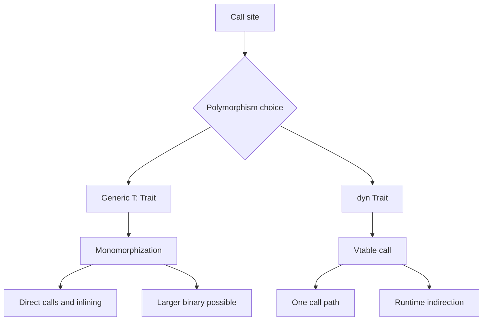

Purpose: build a production-grade mental model for Rust's type system, trait system, generics, dispatch choices, and API boundaries so designs remain explicit, evolvable, and mechanically checked by the compiler.

# Types, Traits, and Generics

Related notes: [04 Error Handling and API Design](/compendium/rust/error-handling-and-api-design), [01 Engineering Fundamentals](/compendium/software-engineering/engineering-fundamentals), [03 Data Structures Algorithms and Complexity](/compendium/software-engineering/data-structures-algorithms-and-complexity), [07 APIs Contracts and Integration](/compendium/software-engineering/apis-contracts-and-integration), <span className="compendium-external-reference" title="Vault-only reference">Software testing</span>, [Design Patterns/Adapter Pattern](/compendium/design-patterns/adapter-pattern), [Design Patterns/Decorator Pattern](/compendium/design-patterns/decorator-pattern).

## Core model

Rust types are not just storage layouts. They encode ownership, lifetimes, thread-safety constraints, protocol states, conversion contracts, and dispatch choices. A strong Rust API makes illegal states hard to construct and makes expensive or fallible operations visible in the type signature.

The core tools are:

| Tool | What it expresses | Production use |
|---|---|---|
| Structs and enums | Data shape and valid states | Domain models, state machines, typed identifiers, protocol variants. |
| Traits | Shared behavior contracts | Plugin points, adapters, test doubles, conversion APIs, extension methods. |
| Generics | Behavior over a family of types | Zero-cost reusable algorithms and typed containers. |
| Associated types | A trait-owned output or dependent type | Iterator item types, storage backends, parser outputs, service response types. |
| Lifetimes | Borrow validity relationships | Views into data, streaming parsers, lock guards, scoped resources. |
| Trait objects | Runtime polymorphism through `dyn Trait` | Heterogeneous collections, plugin registries, stable ABI-like boundaries inside one binary. |
| Newtypes | Nominal type distinction over an existing representation | IDs, validated values, capability tokens, orphan-rule escape hatches. |
| Marker traits | Compile-time facts with no methods | Thread-safety, pinning, ownership semantics, type states. |

## Type-driven design

Use types to encode the invariant nearest to the place it is enforced.

```rust
#[derive(Clone, Debug, Eq, PartialEq, Hash)]
pub struct UserId(String);

#[derive(Debug, thiserror::Error)]
pub enum UserIdError {
    #[error("user id is empty")]
    Empty,
    #[error("user id contains an invalid character")]
    InvalidCharacter,
}

impl TryFrom<String> for UserId {
    type Error = UserIdError;

    fn try_from(value: String) -> Result<Self, Self::Error> {
        if value.is_empty() {
            return Err(UserIdError::Empty);
        }

        if !value.chars().all(|c| c.is_ascii_alphanumeric() || c == '_') {
            return Err(UserIdError::InvalidCharacter);
        }

        Ok(Self(value))
    }
}

impl AsRef<str> for UserId {
    fn as_ref(&self) -> &str {
        &self.0
    }
}
```

This design keeps validation at construction, exposes cheap borrowing through `AsRef&lt;str&gt;`, and avoids accepting arbitrary `String` values in domain functions.

## Trait definitions

A trait defines behavior a type can provide. It can contain required methods, default trait methods, associated types, associated constants, and generic methods.

```rust
pub trait Repository {
    type Id;
    type Entity;
    type Error;

    fn get(&self, id: &Self::Id) -> Result<Option<Self::Entity>, Self::Error>;

    fn require(&self, id: &Self::Id) -> Result<Self::Entity, Self::Error>
    where
        Self::Error: From<NotFound>,
    {
        self.get(id)?.ok_or_else(|| NotFound.into())
    }
}

#[derive(Debug)]
pub struct NotFound;
```

The required method is the minimal contract. The default method builds reusable behavior on top of it. A good default method should preserve the trait's invariants and avoid forcing hidden allocation, I/O, or synchronization.

## Trait bounds

Trait bounds constrain generic parameters. Bounds are part of the public API contract when they appear in public items.

```rust
use std::fmt::Display;

pub fn join_display<T>(items: &[T], separator: &str) -> String
where
    T: Display,
{
    items
        .iter()
        .map(ToString::to_string)
        .collect::<Vec<_>>()
        .join(separator)
}
```

Prefer `where` clauses once bounds become semantically meaningful or long.

```rust
pub fn copy_matching<S, D, P>(source: S, mut destination: D, predicate: P) -> (D, usize)
where
    S: IntoIterator,
    D: Extend<S::Item>,
    P: Fn(&S::Item) -> bool,
{
    let mut count = 0;
    let selected = source.into_iter().filter(|item| {
        let keep = predicate(item);
        if keep {
            count += 1;
        }
        keep
    });
    destination.extend(selected);
    (destination, count)
}
```

Bounds should be as weak as the function needs and as strong as the invariant requires. Do not require `Clone` if a borrow works. Do not require `Send + Sync + 'static` unless work actually crosses thread or task boundaries.

## Associated types

Associated types are chosen by the implementation, not by each call site. They are useful when a trait has a single natural output type per implementor.

```rust
pub trait Decoder {
    type Output;
    type Error;

    fn decode(&self, bytes: &[u8]) -> Result<Self::Output, Self::Error>;
}

pub struct Utf8Decoder;

impl Decoder for Utf8Decoder {
    type Output = String;
    type Error = std::string::FromUtf8Error;

    fn decode(&self, bytes: &[u8]) -> Result<Self::Output, Self::Error> {
        String::from_utf8(bytes.to_vec())
    }
}
```

Use an associated type when the implementor owns the choice. Use a generic type parameter when the caller should choose the type.

| Shape | Who chooses the type | Example | Risk |
|---|---|---|---|
| `trait Parser&lt;T&gt;` | Caller or trait use site | One parser can parse many targets | More type parameters at use sites. |
| `trait Parser { type Output; }` | Implementor | Each parser has one output | Harder to reuse one implementor for many outputs. |

## Generic associated types

Generic associated types, or GATs, let an associated type depend on lifetimes or type parameters. They are most useful for lending iterators, views, and storage APIs where returned values borrow from `self`.

```rust
pub trait LendingIterator {
    type Item<'a>
    where
        Self: 'a;

    fn next<'a>(&'a mut self) -> Option<Self::Item<'a>>;
}

pub struct Windows<'data> {
    data: &'data [u8],
    width: usize,
    position: usize,
}

impl<'data> LendingIterator for Windows<'data> {
    type Item<'a> = &'a [u8] where Self: 'a;

    fn next<'a>(&'a mut self) -> Option<Self::Item<'a>> {
        let end = self.position.checked_add(self.width)?;
        let window = self.data.get(self.position..end)?;
        self.position += 1;
        Some(window)
    }
}
```

The important property is that each yielded item may borrow from the iterator for the duration of the call. A normal `Iterator&lt;Item = &'a T&gt;` cannot express every lending pattern because `Iterator::Item` is fixed for the whole iterator implementation.

## Default trait methods

Default methods reduce repeated code but can accidentally freeze bad semantics into a trait. Review them like production code, not convenience sugar.

```rust
pub trait RetryClassify {
    fn is_transient(&self) -> bool;

    fn should_retry(&self, attempts: u32) -> bool {
        self.is_transient() && attempts < 3
    }
}
```

Default methods are good when:

- They can be implemented from required methods without extra hidden state.
- They encode a real invariant or policy shared by most implementors.
- Overriding them does not surprise callers.

Default methods are risky when:

- They allocate or block unexpectedly.
- They silently choose a policy that should be explicit.
- They can break dyn compatibility when they add generic methods or return `Self`.

## Blanket implementations

A blanket implementation implements a trait for every type satisfying a bound.

```rust
pub trait ToJsonLine {
    fn to_json_line(&self) -> String;
}

impl<T> ToJsonLine for T
where
    T: serde::Serialize,
{
    fn to_json_line(&self) -> String {
        let mut value = serde_json::to_string(self).expect("serialization should not fail");
        value.push('\n');
        value
    }
}
```

Blanket implementations are powerful because they create broad API surface instantly. They are also coherence commitments. Once published, adding another overlapping implementation can become impossible.

| Blanket implementation benefit | Cost |
|---|---|
| Makes extension traits feel native | Can block future specific implementations. |
| Reduces boilerplate | May expose methods on more types than intended. |
| Encodes ecosystem conventions | Public crates must treat it as a compatibility promise. |

## Orphan rule and coherence

The orphan rule says an implementation is allowed only when the trait or the type is local to the crate. You cannot implement a foreign trait for a foreign type.

```rust
// Not allowed in your crate:
// impl std::fmt::Display for uuid::Uuid { ... }
```

This prevents conflicting implementations across crates. Without the orphan rule, two dependencies could both implement the same trait for the same type and downstream crates would have no coherent method resolution.

Valid options:

```rust
use std::fmt;

pub struct PublicId(uuid::Uuid);

impl fmt::Display for PublicId {
    fn fmt(&self, f: &mut fmt::Formatter<'_>) -> fmt::Result {
        write!(f, "{}", self.0)
    }
}
```

The newtype pattern creates a local type, so your crate can implement foreign traits for it.

## Newtype pattern

A newtype is a tuple struct with one field. It creates nominal distinction without runtime overhead.

```rust
#[derive(Clone, Copy, Debug, Eq, PartialEq, Hash)]
pub struct TenantId(uuid::Uuid);

#[derive(Clone, Copy, Debug, Eq, PartialEq, Hash)]
pub struct ProjectId(uuid::Uuid);

pub fn load_project(tenant_id: TenantId, project_id: ProjectId) {
    let _ = (tenant_id, project_id);
}
```

This prevents accidentally passing a project ID where a tenant ID is required. Use newtypes for:

- Domain identifiers.
- Validated strings and numbers.
- Security-sensitive capability tokens.
- Units such as bytes, milliseconds, and percentages.
- API compatibility wrappers around foreign types.

Avoid exposing the inner field unless arbitrary values are valid. Prefer constructors, `TryFrom`, and read-only accessors.

## Marker traits

Marker traits express type-level facts without requiring methods.

```rust
pub trait TrustedInput {}

pub struct SanitizedHtml(String);

impl TrustedInput for SanitizedHtml {}

pub fn render<T: TrustedInput + AsRef<str>>(value: T) -> String {
    format!("<section>{}</section>", value.as_ref())
}
```

Marker traits should be rare in application code. They are useful when a compile-time capability matters and a regular value cannot express it ergonomically. If unsafe code depends on a marker trait, the trait should usually be `unsafe trait` so implementors must acknowledge the invariant.

## Send and Sync

`Send` means a value can be moved to another thread. `Sync` means `&T` can be shared between threads, which is equivalent to `&T: Send`.

Common implications:

| Type shape | Usually `Send` | Usually `Sync` | Reason |
|---|---:|---:|---|
| `String`, `Vec&lt;T&gt;` where `T: Send` or `T: Sync` | Yes | Yes when contents allow | Owned data can move; shared references are safe when contents are safe. |
| `Rc&lt;T&gt;` | No | No | Reference count is not atomic. |
| `Arc&lt;T&gt;` | Yes when `T: Send + Sync` | Yes when `T: Send + Sync` | Atomic reference count, but inner type still matters. |
| `Mutex&lt;T&gt;` | Yes when `T: Send` | Yes when `T: Send` | Lock mediates shared access. |
| `RefCell&lt;T&gt;` | Yes when `T: Send` | No | Runtime borrow flag is not thread-safe. |

Async APIs often require `Send + 'static` because tasks may move between worker threads and outlive the stack frame that spawned them.

```rust
pub fn spawn_work<F>(work: F)
where
    F: FnOnce() + Send + 'static,
{
    std::thread::spawn(work);
}
```

Do not add `Send + Sync` blindly. It can reject useful single-threaded types and make tests harder. Add it where the API truly stores, shares, or executes values across threads.

## Sized and ?Sized

Most generic type parameters have an implicit `Sized` bound. `Sized` means the compiler knows the type's size at compile time.

```rust
pub fn by_value<T>(value: T) {
    let _ = value;
}
```

This is actually:

```rust
pub fn by_value_explicit<T: Sized>(value: T) {
    let _ = value;
}
```

Use `?Sized` to accept dynamically sized types behind a pointer.

```rust
pub fn print_debug<T>(value: &T)
where
    T: std::fmt::Debug + ?Sized,
{
    println!("{value:?}");
}

let text: &str = "hello";
print_debug(text);
```

Common dynamically sized types are `str`, `[T]`, and `dyn Trait`. You cannot pass them by value directly because their size is not known. You pass them through `&T`, `Box&lt;T&gt;`, `Arc&lt;T&gt;`, or another pointer-like owner.

## Conversion traits

The standard conversion traits communicate cost and fallibility.

| Trait | Meaning | Implement on | API guidance |
|---|---|---|---|
| `From&lt;T&gt;` | Infallible conversion from `T` | Destination type | Prefer implementing `From`; callers get `Into` automatically. |
| `Into&lt;T&gt;` | Infallible conversion into `T` | Usually derived from `From` | Use as a bound when accepting inputs. |
| `TryFrom&lt;T&gt;` | Fallible conversion from `T` | Destination type | Use for validation and parsing where failure is expected. |
| `TryInto&lt;T&gt;` | Fallible conversion into `T` | Usually derived from `TryFrom` | Use as a bound when accepting fallible flexible inputs. |
| `AsRef&lt;T&gt;` | Cheap reference conversion | Wrapper or owner | Accept borrowed views without transfer of ownership. |
| `Borrow&lt;T&gt;` | Borrow with equality and hash equivalence | Map key wrappers | Use for collections and lookup compatibility. |
| `Deref&lt;Target = T&gt;` | Smart-pointer-like implicit reference | Pointer types, not domain wrappers | Avoid for arbitrary API convenience. |

```rust
pub fn normalize_name<N>(name: N) -> String
where
    N: AsRef<str>,
{
    name.as_ref().trim().to_ascii_lowercase()
}

pub fn parse_port<P>(port: P) -> Result<u16, std::num::ParseIntError>
where
    P: AsRef<str>,
{
    port.as_ref().parse()
}
```

`AsRef` is for cheap view conversion. `Borrow` carries a stronger contract: borrowed and owned forms must compare and hash the same. That is why `HashMap&lt;String, V&gt;` can be queried by `&str`.

## Deref

`Deref` powers smart pointers and method lookup. Use it when your type behaves like transparent pointer ownership.

```rust
use std::ops::Deref;

pub struct SharedConfig(std::sync::Arc<Config>);

pub struct Config {
    pub region: String,
}

impl Deref for SharedConfig {
    type Target = Config;

    fn deref(&self) -> &Self::Target {
        &self.0
    }
}
```

Avoid using `Deref` just to avoid writing `.inner()`. For domain newtypes, implicit deref can leak representation, blur validation boundaries, and make method resolution surprising. Prefer explicit `as_str`, `as_uuid`, `as_ref`, or named accessors.

## Display vs Debug

`Debug` is for developers. `Display` is for user-facing or contract-facing formatting.

```rust
use std::fmt;

#[derive(Debug)]
pub struct OrderId(String);

impl fmt::Display for OrderId {
    fn fmt(&self, f: &mut fmt::Formatter<'_>) -> fmt::Result {
        f.write_str(&self.0)
    }
}
```

| Format | Audience | Stability expectation | Include sensitive data |
|---|---|---|---|
| `Debug` | Developers and logs | Low unless documented | Only if safe for logs. |
| `Display` | Humans, CLI output, error messages | Higher once exposed | Usually no. |

Do not parse `Debug` output. Do not expose `Debug` strings as API contracts. For structured logs, use fields, not formatted blobs.

## impl Trait

`impl Trait` in argument position is shorthand for a generic parameter.

```rust
pub fn log_line(line: impl AsRef<str>) {
    println!("{}", line.as_ref());
}
```

This is close to:

```rust
pub fn log_line_generic<T: AsRef<str>>(line: T) {
    println!("{}", line.as_ref());
}
```

`impl Trait` in return position hides a concrete return type while preserving static dispatch.

```rust
pub fn active_ids(ids: Vec<u64>) -> impl Iterator<Item = u64> {
    ids.into_iter().filter(|id| *id != 0)
}
```

Return-position `impl Trait` must return one concrete type from all branches.

```rust
pub fn maybe_empty(enabled: bool) -> Box<dyn Iterator<Item = u64>> {
    if enabled {
        Box::new(1..=3)
    } else {
        Box::new(std::iter::empty())
    }
}
```

Use `impl Trait` when callers should rely on behavior, not the concrete type. Use named generics when the same type parameter appears in multiple places and the relationship matters.

## Trait objects and dyn Trait

`dyn Trait` is a trait object. It enables dynamic dispatch through a vtable. The concrete type is erased behind a pointer such as `&dyn Trait`, `Box&lt;dyn Trait&gt;`, or `Arc&lt;dyn Trait&gt;`.

```rust
pub trait Notifier {
    fn notify(&self, message: &str) -> Result<(), NotifyError>;
}

pub struct EmailNotifier;

impl Notifier for EmailNotifier {
    fn notify(&self, message: &str) -> Result<(), NotifyError> {
        println!("email: {message}");
        Ok(())
    }
}

#[derive(Debug, thiserror::Error)]
#[error("notification failed")]
pub struct NotifyError;

pub struct AlertService {
    notifier: Box<dyn Notifier + Send + Sync>,
}

impl AlertService {
    pub fn new(notifier: Box<dyn Notifier + Send + Sync>) -> Self {
        Self { notifier }
    }

    pub fn alert(&self, message: &str) -> Result<(), NotifyError> {
        self.notifier.notify(message)
    }
}
```

Trait objects are useful for dependency injection and heterogeneous collections. They trade compile-time specialization for runtime indirection and dyn-compatibility constraints.

## Static dispatch vs dynamic dispatch



| Choice | Dispatch | Pros | Costs | Good fit |
|---|---|---|---|---|
| `T: Trait` | Static | Inlining, specialization, no vtable | More generated code, type leaks into callers | Hot paths, algorithms, containers. |
| `impl Trait` return | Static | Hides concrete type, no vtable | One concrete return type | Iterators, futures, adapters. |
| `&dyn Trait` | Dynamic borrowed | No ownership transfer, heterogeneous references | Borrowed lifetime management, vtable | Short-lived plugin calls. |
| `Box&lt;dyn Trait&gt;` | Dynamic owned | Heterogeneous ownership, stable field type | Allocation, vtable | Service dependencies, plugin registries. |
| `Arc&lt;dyn Trait + Send + Sync&gt;` | Dynamic shared | Thread-safe sharing | Atomic refcount, vtable | Long-lived shared services. |

Do not choose dynamic dispatch just because it looks object-oriented. Choose it when type erasure is the API you want.

## Dyn Compatibility, Formerly Object Safety

A trait must be dyn-compatible to use as `dyn Trait`. The simplified rule is that methods on a trait object must be dispatchable through a vtable without knowing the concrete `Self` type.

Dyn-compatibility hazards:

- A `Self: Sized` supertrait requirement.
- Any associated constant.
- Any associated type with generic parameters.
- Methods without an eligible receiver such as `&self`, `&mut self`, `Box&lt;Self&gt;`, `Rc&lt;Self&gt;`, `Arc&lt;Self&gt;`, or a supported pinned form.
- Generic methods.
- Methods that use `Self` outside the receiver position or return `Self`.
- Methods returning an opaque `impl Trait` or the anonymous future of `async fn`.

A method with `where Self: Sized` is explicitly non-dispatchable and can remain on an otherwise dyn-compatible trait, but callers cannot invoke it through the trait object.

```rust
pub trait CloneBoxed {
    fn clone_boxed(&self) -> Box<dyn CloneBoxed>;
}

pub trait Builder {
    fn finish(self) -> Output
    where
        Self: Sized;
}

pub struct Output;
```

Adding `where Self: Sized` removes a method from the trait-object vtable while keeping it available for concrete types.

## Monomorphization

Monomorphization is the compiler process that creates concrete versions of generic code for the concrete types used in the program.

```rust
pub fn max_value<T: Ord + Copy>(left: T, right: T) -> T {
    if left >= right {
        left
    } else {
        right
    }
}

let a = max_value(1_u32, 2_u32);
let b = max_value('a', 'z');
```

The compiler can generate one instance for `u32` and one for `char`. This supports static dispatch and optimization but can increase compile time and binary size. In library APIs, highly generic public functions can push compile cost into every downstream crate.

Production guidance:

- Use generics on hot paths and reusable algorithms.
- Use `dyn Trait` at architectural boundaries where heterogeneity and compile-time isolation matter more.
- Profile binary size and compile time for heavily generic crates.
- Avoid making every helper generic when a concrete type is the actual contract.

## Type inference

Rust type inference is local and constraint-based. It does not infer function signatures, but it can infer many variable and generic types from usage.

```rust
let ids = ["1", "2", "3"]
    .into_iter()
    .map(str::parse::<u64>)
    .collect::<Result<Vec<_>, _>>()?;
```

Help inference at boundaries:

- Annotate collection targets with `collect::&lt;Vec&lt;_&gt;&gt;()` or `collect::&lt;Result&lt;Vec&lt;_&gt;, _&gt;&gt;()`.
- Annotate parse targets with `parse::&lt;u64&gt;()`.
- Use named intermediate variables when chained combinators hide the expected type.
- Prefer explicit public signatures even when the compiler could infer internals.

## PhantomData

`PhantomData&lt;T&gt;` tells the compiler that a type logically owns or is related to `T` even if it stores no value of type `T`. It affects variance, drop checking, and auto traits such as `Send` and `Sync`.

```rust
use std::marker::PhantomData;

pub struct Token<State> {
    raw: String,
    _state: PhantomData<State>,
}

pub struct Unverified;
pub struct Verified;

impl Token<Unverified> {
    pub fn verify(self) -> Token<Verified> {
        Token {
            raw: self.raw,
            _state: PhantomData,
        }
    }
}

impl Token<Verified> {
    pub fn as_str(&self) -> &str {
        &self.raw
    }
}
```

This is a type-state pattern. The runtime representation is one `String`, but the compiler prevents using an unverified token where a verified token is required.

## Variance

Variance describes how subtyping relationships between lifetimes flow through type constructors. In day-to-day Rust, it matters when designing borrowed wrappers, unsafe abstractions, and types using `PhantomData`.

| Shape | Typical variance over `'a` or `T` | Meaning |
|---|---|---|
| `&'a T` | Covariant over `'a` and `T` | A longer lifetime can be used where a shorter one is expected. |
| `&'a mut T` | Covariant over `'a`, invariant over `T` | Mutable access prevents freely changing the inner type relation. |
| `Box&lt;T&gt;` | Covariant over `T` | Ownership has no aliasing mutation by reference. |
| `fn(T)` | Contravariant over `T` | Function arguments reverse the relationship. |
| `std::cell::Cell&lt;T&gt;` | Invariant over `T` | Interior mutation blocks substitution. |

Most application code does not need to calculate variance manually. Unsafe abstractions and lifetime-heavy libraries do. `PhantomData&lt;&'a T&gt;`, `PhantomData&lt;fn(T)&gt;`, and `PhantomData&lt;*const T&gt;` communicate different ownership and variance facts.

## Higher ranked trait bounds

Higher ranked trait bounds, or HRTBs, express that a bound holds for all lifetimes.

```rust
pub fn with_each_line<F>(input: &str, mut f: F)
where
    F: for<'line> FnMut(&'line str),
{
    for line in input.lines() {
        f(line);
    }
}
```

`for&lt;'line&gt;` means the closure must accept a line reference of any lifetime chosen by the function. HRTBs appear in callback APIs, parser combinators, deserialization, lending patterns, and trait objects involving borrowed data.

Another common form:

```rust
pub trait Transaction {
    fn execute(&self, sql: &str);
}

pub fn in_transaction<F>(f: F)
where
    F: for<'tx> FnOnce(&'tx dyn Transaction),
{
    struct Tx;

    impl Transaction for Tx {
        fn execute(&self, _sql: &str) {}
    }

    let tx = Tx;
    f(&tx);
}
```

The caller cannot stash the transaction reference beyond the callback because the lifetime is universally quantified by the callee.

## Const generics

Const generics parameterize types and functions over compile-time values.

```rust
pub struct RingBuffer<T, const N: usize> {
    items: [Option<T>; N],
    next: usize,
}

impl<T, const N: usize> RingBuffer<T, N> {
    pub fn new() -> Self {
        const { assert!(N > 0, "RingBuffer capacity must be nonzero"); }
        Self {
            items: std::array::from_fn(|_| None),
            next: 0,
        }
    }

    pub fn push(&mut self, value: T) {
        self.items[self.next] = Some(value);
        self.next = (self.next + 1) % N;
    }
}
```

Const generics are useful for fixed-size arrays, protocol widths, cryptographic sizes, dimensional units, and stack-allocated buffers. They can also over-specialize APIs. If the value is a runtime configuration, keep it as data, not a const generic.

## Type states

Type states use generics and marker types to represent protocol progress.

```rust
pub struct RequestBuilder<State> {
    url: Option<String>,
    body: Option<String>,
    _state: std::marker::PhantomData<State>,
}

pub struct MissingUrl;
pub struct Ready;

impl RequestBuilder<MissingUrl> {
    pub fn new() -> Self {
        Self {
            url: None,
            body: None,
            _state: std::marker::PhantomData,
        }
    }

    pub fn url(self, url: impl Into<String>) -> RequestBuilder<Ready> {
        RequestBuilder {
            url: Some(url.into()),
            body: self.body,
            _state: std::marker::PhantomData,
        }
    }
}

impl RequestBuilder<Ready> {
    pub fn body(mut self, body: impl Into<String>) -> Self {
        self.body = Some(body.into());
        self
    }

    pub fn send(self) {
        let _url = self.url.expect("Ready state always has a URL");
    }
}
```

Use type states when the protocol is important enough to justify extra types. Do not use them for every builder. A runtime validation error is often more ergonomic for large forms, CLI parsing, or configuration files.

## API design heuristics

| Decision | Prefer | Avoid |
|---|---|---|
| Accepting strings | `&str` for ordinary read-only APIs, `impl AsRef&lt;str&gt;` when several borrowed forms help, `impl Into&lt;String&gt;` when storing | Taking `String` when no ownership is needed. |
| Returning iterators | `impl Iterator&lt;Item = T&gt;` | Returning `Vec&lt;T&gt;` only because it is easy. |
| Plugin boundary | `Box&lt;dyn Trait + Send + Sync&gt;` | Generics that infect every layer. |
| Hot inner loop | `T: Trait` | Trait objects unless measured acceptable. |
| Domain IDs | Newtypes | Raw `String`, `Uuid`, or `u64` everywhere. |
| Validation | `TryFrom` and smart constructors | Public fields that permit invalid values. |
| Formatting | `Display` for stable human text, `Debug` for diagnostics | Parsing `Debug`. |
| Borrowing | `AsRef` or explicit accessors | `Deref` for arbitrary domain convenience. |

## Return-position `impl Trait` Capture

Return-position `impl Trait` names an opaque concrete type chosen by the callee. It is statically dispatched and distinct from `dyn Trait`. In Edition 2024, an opaque return type captures all in-scope lifetime and type parameters by default, even when they are not written in the bounds.

Use the precise capture syntax `use&lt;...&gt;` when the API must state a smaller capture set:

```rust
fn values<'a, T: Copy>(slice: &'a [T]) -> impl Iterator<Item = T> + use<'a, T> {
    slice.iter().copied()
}
```

Capture choices affect borrow checking and can be semver-relevant. Avoid exposing a tighter or looser lifetime relationship accidentally through an opaque type.

## Async Functions in Traits and Dynamic Dispatch

An `async fn` in a trait is conceptually a method returning an anonymous future type. It works well with static dispatch, but a trait containing such a method is not dyn-compatible because callers through `dyn Trait` need a single representable return type.

Choose the boundary deliberately:

- Use native `async fn` in traits when callers are generic over the implementation.
- Return `Pin&lt;Box&lt;dyn Future&lt;Output = T&gt; + Send + 'a&gt;&gt;` when runtime polymorphism is required and allocation is acceptable.
- Use an adapter macro such as `async-trait` when its boxing, lifetime, and `Send` policy are understood.
- Split synchronous policy from asynchronous transport when that produces a smaller, more reusable interface.

The standard `AsyncFn`, `AsyncFnMut`, and `AsyncFnOnce` traits describe async callable bounds, but they are also not dyn-compatible. They are most useful in generic APIs.

## Trait Evolution and Semver Hazards

Trait changes can break downstream code without changing an obvious function signature.

- Adding a required method breaks every external implementation.
- Adding a provided method can conflict with an inherent or extension-trait method at call sites.
- Adding a blanket implementation can overlap with downstream implementations or make method resolution ambiguous.
- Adding a supertrait or tightening bounds excludes existing implementors.
- Changing associated types, generic associated types, auto-trait behavior, or dyn compatibility changes usable API shapes.
- Removing `Send` or `Sync` from a returned opaque type can break executors and thread handoff; adding captures to `impl Trait` can extend borrows.

For open implementation sets, consider sealed traits, extension traits, non-exhaustive data types, or versioned adapter traits. Run semver tooling, but also review documented trait laws and behavior because structural checks cannot prove semantic compatibility.

## Stable Boundaries Around Unstable Trait Features

On the verified Rust 1.96.0 toolchain, several attractive trait features remain unstable:

| Unstable feature | Temptation | Stable design alternative |
|---|---|---|
| Specialization | Overlap a general implementation with a faster or more specific one | Newtypes, explicit strategy traits, or separate functions |
| Negative implementations | Write `impl !Trait for Type` to prohibit an implementation | For auto traits, include a marker field with the required auto-trait behavior; otherwise control construction and trait exposure |
| Trait aliases | Name a reusable combination of bounds directly | Define a supertrait and a blanket implementation |
| Associated type defaults | Give implementors a default associated type | Use a generic parameter default, helper trait, or explicit associated type in each implementation |
| Type-alias `impl Trait` | Name an opaque implementation type at module scope | Return-position `impl Trait`, a concrete private wrapper, or a boxed trait object |

Do not publish an API whose stability plan assumes one of these features will land with its current syntax or semantics. Nightly experiments should be feature-gated, pinned to a dated toolchain, and kept outside the stable consumer contract.

## Common mistakes

- Adding trait bounds to structs instead of methods. Put `T: Trait` on the `impl` or function that needs it unless the struct invariant requires it.
- Using `Into&lt;String&gt;` for every string parameter, which can hide allocations and make borrowing less clear.
- Implementing `Deref` for a domain type and accidentally exposing the entire inner API.
- Returning `Box&lt;dyn Error&gt;` from libraries and losing structured error contracts.
- Making a trait non-dyn-compatible and then trying to store `Box&lt;dyn Trait&gt;`.
- Choosing associated types when callers need to pick the type.
- Choosing generic parameters when each implementor has exactly one natural output type.
- Requiring `'static` because of a compiler error instead of understanding the actual lifetime.
- Adding `Clone` to escape ownership issues instead of redesigning borrowing or ownership.
- Publishing a blanket implementation without checking future coherence constraints.
- Assuming `Send` means shared access is safe. `Send` is about moving; `Sync` is about shared references.
- Treating const generics as runtime configuration.

## Production guidance

Design traits around behavior, not object taxonomies. A good trait is small, named after a capability, and has a clear law or invariant.

Prefer sealed traits for public crates when external implementations would make evolution unsafe.

```rust
mod sealed {
    pub trait Sealed {}
}

pub trait EventKind: sealed::Sealed {
    fn name(&self) -> &'static str;
}
```

Use newtypes to protect domain boundaries and to make logs, metrics, and API contracts harder to mix up.

Keep conversion contracts conventional:

- `From` must not fail.
- `TryFrom` should explain failure with a useful error.
- `AsRef` should be cheap and unsurprising.
- `Borrow` must preserve equality and hashing semantics.
- `Deref` should be reserved for pointer-like behavior.

Document trait laws. For example, if a `CacheKey` trait requires stable hashing across process restarts, state it in the trait docs and test it.

## Review checklist

- Does each public generic parameter communicate real flexibility, or would a concrete type be clearer?
- Are trait bounds placed on the narrowest function or `impl` that needs them?
- Are associated types used where the implementor owns the type choice?
- Are GATs used only where returned values must borrow from `self` or another parameter?
- Are default trait methods free of hidden I/O, allocation, locking, or surprising policy?
- Could a blanket implementation overlap with likely future implementations?
- Does the orphan rule require a newtype wrapper?
- Are newtypes protecting domain invariants instead of just renaming primitives?
- Are `Send`, `Sync`, and `'static` required by actual storage or execution behavior?
- Are dynamically sized types accepted through `?Sized` where useful?
- Are `From`, `Into`, `TryFrom`, `TryInto`, `AsRef`, `Borrow`, and `Deref` used according to their standard semantics?
- Is `Display` stable and non-sensitive, and is `Debug` safe for logs?
- Is the trait dyn-compatible, and is dynamic dispatch an intentional boundary?
- Is `impl Trait` hiding implementation without hiding necessary relationships?
- Has monomorphization cost been considered for public, heavily generic code?
- Are type inference annotations present where they improve readability?
- Does `PhantomData` accurately model ownership, lifetime, variance, and auto-trait behavior?
- Are HRTBs used where callbacks must accept borrows of any lifetime?
- Are const generics reserved for true compile-time dimensions?

## Study path

1. Start with trait definitions, trait bounds, and associated types.
2. Add conversion traits and newtypes so APIs become domain-aware.
3. Study static dispatch, monomorphization, `impl Trait`, `dyn Trait`, and dyn compatibility together.
4. Learn `Send`, `Sync`, `Sized`, `?Sized`, and marker traits before writing concurrency-heavy APIs.
5. Use `PhantomData`, variance, HRTBs, GATs, and const generics when simpler shapes cannot express the invariant.
6. Pair this note with [04 Error Handling and API Design](/compendium/rust/error-handling-and-api-design) so type design and error contracts evolve together.

## Primary Sources

- [The Rust Reference: traits and dyn compatibility](https://doc.rust-lang.org/reference/items/traits.html)
- [The Rust Reference: `impl Trait`](https://doc.rust-lang.org/reference/types/impl-trait.html)
- [The Rust Reference: type parameters and variance](https://doc.rust-lang.org/reference/types/parameters.html)
- [`std::ops::AsyncFn`](https://doc.rust-lang.org/std/ops/trait.AsyncFn.html)
- [The Rust API Guidelines](https://rust-lang.github.io/api-guidelines/)
- [Cargo SemVer compatibility guide](https://doc.rust-lang.org/cargo/reference/semver.html)
- [The Rust Unstable Book](https://doc.rust-lang.org/unstable-book/)
