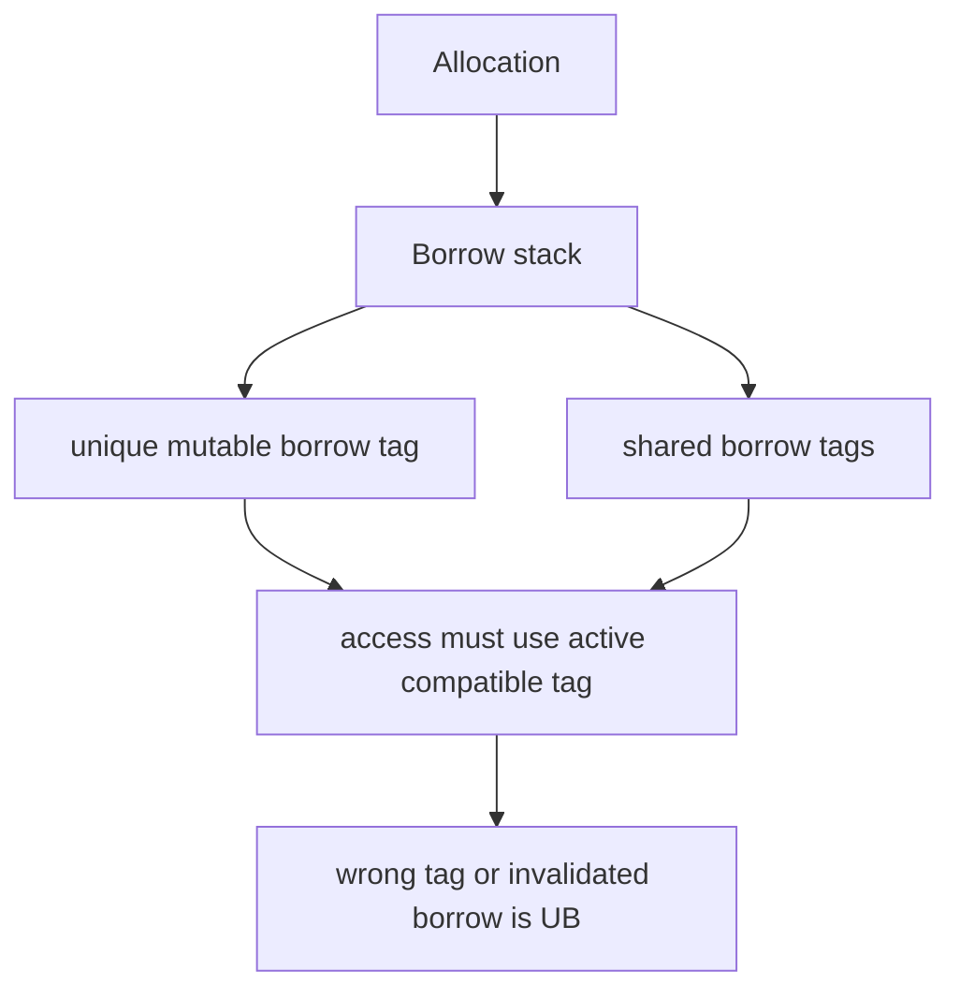
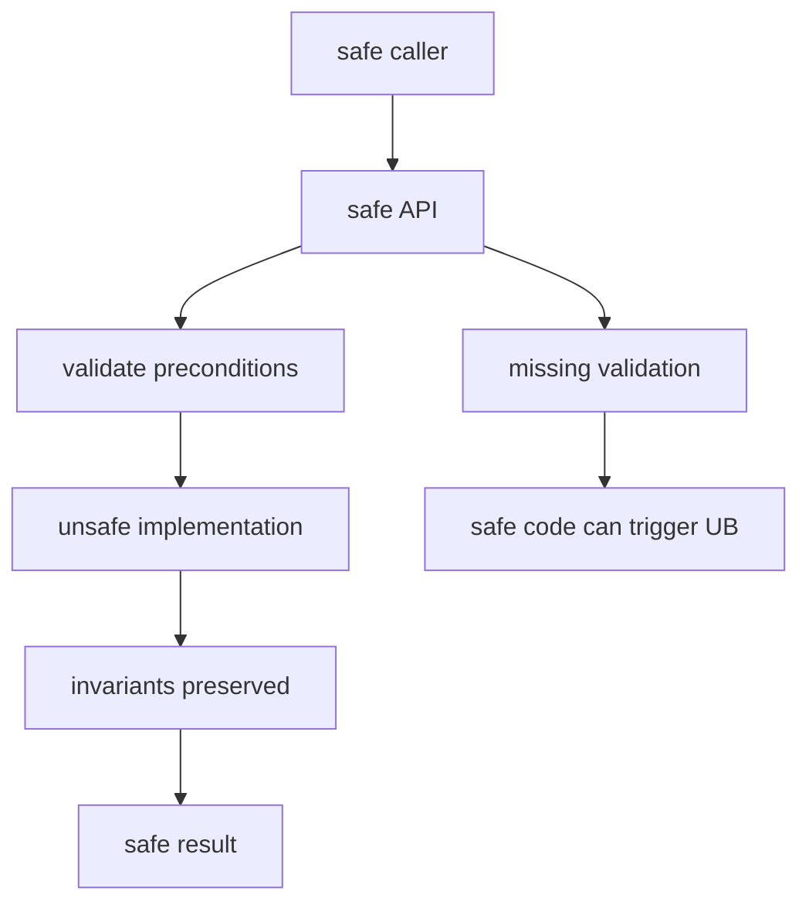

Purpose: explain what unsafe Rust permits, what it still forbids, and how to review unsafe abstractions for soundness under Rust's memory model. This note focuses on raw pointers, aliasing, initialization, pinning, FFI, unsafe traits, Miri, sanitizers, and production review practice.

# Unsafe Rust and the Rust Memory Model

Related notes: [02 Ownership Borrowing and Lifetimes](/compendium/rust/ownership-borrowing-and-lifetimes), [03 Types Traits and Generics](/compendium/rust/types-traits-and-generics), [07 Concurrency Parallelism and Synchronization](/compendium/rust/concurrency-parallelism-and-synchronization), [Rust/06 Memory Layout Performance and Zero Cost Abstractions](/compendium/rust/memory-layout-performance-and-zero-cost-abstractions), [11 Testing Verification Benchmarking and Tooling](/compendium/rust/testing-verification-benchmarking-and-tooling), [04 Error Handling and API Design](/compendium/rust/error-handling-and-api-design), <span className="compendium-external-reference" title="Vault-only reference">Software Supply Chain Security</span>, <span className="compendium-external-reference" title="Vault-only reference">Software testing</span>, [Data Structures/Data Structures](/compendium/data-structures/data-structures).

## Core Claim

Unsafe Rust is not a second language where all rules disappear. It is a narrow escape hatch that allows specific operations the compiler cannot verify. The engineer remains responsible for preserving the invariants that safe Rust normally enforces.

Unsafe code is acceptable only when the unsafe boundary is small, documented, tested, and wrapped in a safe API whose contract prevents callers from causing undefined behavior.

## What unsafe means and does not mean

Current Rust uses `unsafe` syntax for several distinct proof obligations. The traditional five "unsafe superpowers" are no longer a complete inventory. The Rust Reference includes:

1. Dereferencing a raw pointer.
2. Calling an unsafe function or method.
3. Reading or writing a mutable or unsafe external static.
4. Accessing a union field other than assigning to it.
5. Implementing an unsafe trait.
6. Declaring an `unsafe extern` block.
7. Applying an unsafe attribute such as `#[unsafe(no_mangle)]`.
8. Calling a `#[target_feature]` function when the required target feature is not enabled at the call site.

Not all of these occur inside an `unsafe {}` block. `unsafe impl`, `unsafe extern`, and `#[unsafe(...)]` mark different obligations at their declaration sites.

Unsafe does not permit:

| Misbelief | Reality |
|---|---|
| Unsafe disables the borrow checker | normal borrow checking still applies to references |
| Unsafe means C semantics | Rust still has Rust aliasing, validity, and provenance rules |
| Unsafe allows data races | data races are undefined behavior |
| Unsafe makes invalid values okay | references, bools, enums, and many types have validity rules |
| Unsafe can be hidden by tests | tests can miss undefined behavior |
| Unsafe is local only | one invalid invariant can make distant safe code unsound |

## Unsafe Blocks Versus Unsafe Functions

An unsafe block says "the operations inside require a proof here." An unsafe function says "the caller must uphold an extra contract before calling this function."

```rust
fn read_first(bytes: &[u8]) -> Option<u8> {
    bytes.first().copied()
}

unsafe fn read_at_unchecked(bytes: &[u8], index: usize) -> u8 {
    // Safety: caller must guarantee index < bytes.len().
    unsafe { *bytes.get_unchecked(index) }
}
```

Modern Rust style keeps unsafe operations inside explicit `unsafe {}` blocks even within unsafe functions. This makes local proof obligations visible.

```rust
unsafe fn copy_one(src: *const u8, dst: *mut u8) {
    // Safety: caller guarantees both pointers are valid for one byte,
    // properly aligned for u8, non-null, and non-overlapping.
    unsafe {
        *dst = *src;
    }
}
```

Review rule: every unsafe block needs a safety comment that names the invariant being relied on, not a comment that restates the operation.

Weak comment:

```rust
unsafe {
    // Safety: dereference raw pointer.
    *ptr
}
```

Useful comment:

```rust
unsafe {
    // Safety: ptr came from slice.as_ptr().add(i), i < slice.len(),
    // and the slice outlives this read.
    *ptr
}
```

## Raw Pointers

Raw pointers are `*const T` and `*mut T`. They may be null, dangling, unaligned, or aliasing. Creating a raw pointer is safe. Dereferencing one is unsafe.

```rust
fn raw_from_ref(value: &u32) -> *const u32 {
    value as *const u32
}

fn raw_from_mut(value: &mut u32) -> *mut u32 {
    value as *mut u32
}
```

Raw pointer operations:

| Operation | Safe to call? | Why it matters |
|---|---:|---|
| create raw pointer from reference | yes | no access occurs |
| compare raw pointers | yes | does not dereference |
| call `is_null` | yes | metadata-free null check |
| call `add` | no | the in-bounds, address-space, and provenance preconditions apply when `add` is called, even if the result is not dereferenced |
| dereference `*ptr` | no | requires validity proof |
| `ptr::read` | no | moves from memory without dropping source |
| `ptr::write` | no | writes without dropping old value |
| `copy_nonoverlapping` | no | requires valid non-overlapping regions |

Pointer arithmetic example:

```rust
fn sum_raw(values: &[u64]) -> u64 {
    let mut sum = 0;
    let mut ptr = values.as_ptr();
    let end = unsafe {
        // Safety: adding values.len() to the start pointer creates the
        // one-past-the-end pointer for this allocation.
        ptr.add(values.len())
    };

    while ptr != end {
        unsafe {
            // Safety: ptr starts at values.as_ptr(), advances one element
            // at a time, and the loop stops before the one-past-the-end pointer.
            sum += *ptr;
            ptr = ptr.add(1);
        }
    }

    sum
}
```

Safe iterator code should be preferred unless profiling and generated-code inspection justify the unsafe version. See [Rust/06 Memory Layout Performance and Zero Cost Abstractions](/compendium/rust/memory-layout-performance-and-zero-cost-abstractions).

## Dereferencing Raw Pointers

To dereference a raw pointer as `T`, all relevant conditions must hold:

| Condition | Meaning |
|---|---|
| Non-null | pointer cannot be null for a reference-like access |
| Properly aligned | address must satisfy `align_of::&lt;T&gt;()` unless using unaligned operations |
| Dereferenceable | memory must be valid for `size_of::&lt;T&gt;()` bytes |
| Initialized | bytes must represent a valid `T` |
| Live allocation | allocation has not been freed or gone out of scope |
| Aliasing-compatible | access must not violate Rust aliasing rules |
| Provenance-compatible | pointer must be derived in a way that authorizes the access |

Use explicit unaligned APIs when needed:

```rust
use std::ptr;

fn read_u32_le(bytes: &[u8]) -> Option<u32> {
    let array = bytes.get(0..4)?;
    let mut raw = [0_u8; 4];
    raw.copy_from_slice(array);
    Some(u32::from_le_bytes(raw))
}

unsafe fn read_u32_unaligned(ptr: *const u8) -> u32 {
    // Safety: caller guarantees ptr is valid for four bytes.
    let raw = unsafe { ptr::read_unaligned(ptr.cast::<u32>()) };
    u32::from_le(raw)
}
```

Avoid forming references to unaligned fields. `#[repr(packed)]` is especially dangerous because `&packed.field` can create an invalid reference.

## Aliasing Rules

Safe Rust's simplified model:

| Reference | Rule |
|---|---|
| `&T` | shared, read-only access, many aliases allowed |
| `&mut T` | exclusive access, no other active access to the same value |

Unsafe code must preserve the assumptions safe code relies on. Creating two `&mut T` references to the same memory is undefined behavior even if the program appears to work.

```rust
fn split_at_mut_safe<T>(slice: &mut [T], mid: usize) -> (&mut [T], &mut [T]) {
    slice.split_at_mut(mid)
}
```

The standard library implementation uses unsafe internally because the compiler cannot prove the two slices are disjoint from index arithmetic alone. The safe API checks `mid &lt;= len` and returns non-overlapping mutable slices.

Illustrative implementation:

```rust
use std::slice;

fn split_at_mut_manual<T>(slice: &mut [T], mid: usize) -> (&mut [T], &mut [T]) {
    let len = slice.len();
    let ptr = slice.as_mut_ptr();

    assert!(mid <= len);

    unsafe {
        // Safety: mid <= len, ptr points to len initialized elements,
        // and the two ranges [0, mid) and [mid, len) are disjoint.
        (
            slice::from_raw_parts_mut(ptr, mid),
            slice::from_raw_parts_mut(ptr.add(mid), len - mid),
        )
    }
}
```

## Stacked Borrows Overview

Stacked Borrows is an operational model used by Miri to catch many aliasing violations. It is not the final full language specification, but it is one of the best practical tools for understanding Rust's aliasing discipline.

Conceptually:



Important intuitions:

| Idea | Practical meaning |
|---|---|
| Borrows create permissions | a reference carries access rights, not just an address |
| Mutable borrows are unique | old raw pointers may become unusable for mutation after reborrowing |
| Raw pointers are not magic | they still interact with provenance and borrow permissions |
| Interior mutability is special | `UnsafeCell` marks memory that may be mutated through shared references |
| Miri can catch many violations | passing Miri is not a formal proof |

Example that Miri may reject:

```rust
fn aliasing_violation() {
    let mut value = 1_u32;
    let raw = &mut value as *mut u32;
    let reference = &mut value;
    *reference = 2;

    unsafe {
        // This may violate the active unique borrow created for reference.
        *raw = 3;
    }
}
```

The lesson is not "never use raw pointers". The lesson is that raw pointers must be used within a carefully controlled borrowing story.

## Undefined Behavior

Undefined behavior means the program has no Rust semantics. The compiler may assume it never happens and optimize based on that assumption.

Common UB sources:

| Category | Example |
|---|---|
| Invalid reference | null `&T`, dangling `&T`, unaligned `&T` |
| Invalid value | `bool` with byte value 2, invalid enum discriminant |
| Data race | unsynchronized conflicting access across threads |
| Aliasing violation | multiple active `&mut` to the same value |
| Out-of-bounds access | pointer read beyond allocation |
| Use after free | dereference pointer after allocation is dropped |
| Double drop | manually drop a value twice |
| Uninitialized read | assume initialized `T` from uninitialized bytes |
| FFI contract violation | C calls Rust with invalid pointer or wrong ABI |

UB is not a panic, not an error return, and not guaranteed to be detectable in tests.

## `UnsafeCell`

`UnsafeCell&lt;T&gt;` is the primitive for interior mutability. It tells the compiler that the contained `T` may be mutated through a shared reference.

```rust
use std::cell::UnsafeCell;

struct LocalOneShotCell<T> {
    value: UnsafeCell<Option<T>>,
}

impl<T> LocalOneShotCell<T> {
    fn new() -> Self {
        Self {
            value: UnsafeCell::new(None),
        }
    }

    fn set(&self, value: T) -> Result<(), T> {
        unsafe {
            // Safety: UnsafeCell makes this type !Sync, so safe code cannot share
            // &LocalOneShotCell across threads. Within one thread, set checks the
            // Option state before replacing it, and no references into the slot
            // escape this method.
            let slot = &mut *self.value.get();
            if slot.is_some() {
                return Err(value);
            }
            *slot = Some(value);
            Ok(())
        }
    }
}
```

Do not add `unsafe impl&lt;T: Sync&gt; Sync for LocalOneShotCell&lt;T&gt;`. That would make the safe `set(&self, ...)` method callable concurrently and create a data race. A real thread-safe cell needs atomics, locks, or a synchronization protocol whose proof is encoded in the implementation.

Production guidance:

| Need | Prefer |
|---|---|
| single-thread interior mutation | `Cell`, `RefCell` |
| thread-safe mutation | `Mutex`, `RwLock`, atomics |
| one-time initialization | `OnceLock`, `LazyLock` |
| custom primitive | `UnsafeCell` plus documented synchronization proof |

## `MaybeUninit`

`MaybeUninit&lt;T&gt;` represents memory that may not contain a valid `T`. It is the correct way to handle uninitialized storage.

```rust
use std::mem::MaybeUninit;

fn array_from_fn<const N: usize>(mut f: impl FnMut(usize) -> String) -> [String; N] {
    let mut data: [MaybeUninit<String>; N] = [const { MaybeUninit::uninit() }; N];
    struct Guard<'a> {
        data: &'a mut [MaybeUninit<String>],
        initialized: usize,
    }

    impl Drop for Guard<'_> {
        fn drop(&mut self) {
            for item in &mut self.data[..self.initialized] {
                unsafe {
                    // Safety: only the first initialized elements were written.
                    item.assume_init_drop();
                }
            }
        }
    }

    let mut guard = Guard {
        data: &mut data,
        initialized: 0,
    };

    for i in 0..N {
        guard.data[i].write(f(i));
        guard.initialized += 1;
    }

    std::mem::forget(guard);

    unsafe {
        // Safety: the loop initialized every element, and the guard was
        // forgotten so initialized elements will not be dropped twice.
        (&data as *const [MaybeUninit<String>; N] as *const [String; N]).read()
    }
}
```

Common mistakes:

| Mistake | Consequence |
|---|---|
| `mem::zeroed::&lt;T&gt;()` for arbitrary `T` | invalid references, invalid bools, invalid enums |
| `assume_init` before all fields are valid | undefined behavior |
| forgetting panic cleanup | leaks or double drops |
| reading uninitialized bytes as `T` | undefined behavior |

## `ManuallyDrop`

`ManuallyDrop&lt;T&gt;` suppresses automatic drop. It does not make invalid states safe by itself.

```rust
use std::mem::ManuallyDrop;

struct RawBuffer {
    ptr: *mut u8,
    len: usize,
    cap: usize,
}

fn into_raw_parts(mut bytes: Vec<u8>) -> RawBuffer {
    let bytes = ManuallyDrop::new(bytes);
    RawBuffer {
        ptr: bytes.as_ptr() as *mut u8,
        len: bytes.len(),
        cap: bytes.capacity(),
    }
}
```

Review concerns:

| Concern | Question |
|---|---|
| Double drop | Is there exactly one owner responsible for destruction? |
| Leak | Is intentional leaking documented? |
| Panic path | Can a panic skip necessary cleanup? |
| Public fields | Can safe callers move out or drop in the wrong order? |
| Invalid state | Is a `ManuallyDrop&lt;T&gt;` read after its value was dropped? |

## Pin Invariants

`Pin&lt;P&gt;` prevents moving a value after it has been pinned, but only if the pinned type does not implement `Unpin`. Pinning is about address stability, not immutability.

Pin matters for self-referential structures, async futures, intrusive lists, and FFI callbacks where an address is registered externally.

```rust
use std::marker::PhantomPinned;
use std::pin::Pin;

struct SelfRef {
    data: String,
    data_ptr: *const String,
    _pin: PhantomPinned,
}

impl SelfRef {
    fn new(data: String) -> Pin<Box<Self>> {
        let mut boxed = Box::pin(Self {
            data,
            data_ptr: std::ptr::null(),
            _pin: PhantomPinned,
        });

        let ptr = &boxed.data as *const String;
        unsafe {
            // Safety: boxed is pinned, and SelfRef is !Unpin because it contains
            // PhantomPinned. We only initialize the internal self-pointer.
            Pin::as_mut(&mut boxed).get_unchecked_mut().data_ptr = ptr;
        }

        boxed
    }
}
```

Pin checklist:

| Question | Reason |
|---|---|
| Is the type `!Unpin` when address stability matters? | otherwise safe code may move it |
| Are pinned fields projected safely? | moving a pinned field can violate invariants |
| Does `Drop` assume pinning? | drop must not move pinned fields |
| Are unsafe `get_unchecked_mut` calls justified? | they can move or overwrite pinned data |
| Is pinning actually needed? | many designs can use indexes or owned buffers instead |

Use projection crates such as `pin-project` when appropriate. Manual pin projection is easy to get wrong.

## FFI Safety

Foreign function interfaces require clear ownership, lifetime, ABI, layout, panic, and thread-safety contracts.

```rust
#[repr(C)]
pub struct Buffer {
    ptr: *mut u8,
    len: usize,
    cap: usize,
}

/// Releases a buffer previously returned by this library.
///
/// # Safety
///
/// `buffer` must contain the unchanged pointer, length, and capacity returned
/// by this library. The allocation must still be live, and this function must
/// be called at most once for that allocation.
#[unsafe(no_mangle)]
pub unsafe extern "C" fn buffer_free(buffer: Buffer) {
    if buffer.ptr.is_null() {
        return;
    }

    unsafe {
        // Safety: guaranteed by the caller contract documented above.
        drop(Vec::from_raw_parts(buffer.ptr, buffer.len, buffer.cap));
    }
}
```

FFI boundary rules:

| Area | Rule |
|---|---|
| ABI | use `extern "C"` for C ABI |
| names | use `#[unsafe(no_mangle)]` or exported symbol controls intentionally |
| layout | use `#[repr(C)]` for structs crossing C boundaries |
| ownership | pair allocation and free functions in one library |
| strings | define encoding and termination, avoid exposing Rust `String` |
| slices | pass pointer plus length, never Rust slice references |
| panics | do not unwind across C unless using an ABI that allows it and a documented strategy |
| callbacks | define thread, lifetime, and reentrancy rules |
| errors | return explicit status codes or nullable handles |

### `repr(C)`

`#[repr(C)]` gives C-compatible layout rules for structs and enums within Rust's documented limits. It is necessary but not sufficient for FFI safety.

```rust
#[repr(C)]
pub struct Point {
    pub x: f64,
    pub y: f64,
}
```

Use `repr(C)` when another language reads the fields or when ABI compatibility is part of the contract.

### `repr(transparent)`

`#[repr(transparent)]` makes a wrapper have the same ABI as its single non-zero-sized field, subject to Rust's representation rules.

```rust
#[repr(transparent)]
pub struct UserId(u64);
```

Good uses:

| Use | Example |
|---|---|
| type-safe FFI handle | `struct UserId(u64)` |
| newtype around pointer | handle wrappers |
| preserving ABI while adding methods | domain-specific IDs |

Bad uses:

| Misuse | Problem |
|---|---|
| multiple non-zero fields | not transparent-compatible |
| assuming validation happens automatically | representation is not invariant enforcement |
| exposing private Rust invariants to C | C can construct invalid values |

## Unsafe Trait Contracts

An unsafe trait says implementing the trait requires upholding extra invariants that unsafe code may rely on.

Classic examples are `Send` and `Sync`.

```rust
use std::ptr::NonNull;

struct SendHandle {
    ptr: NonNull<u8>,
}

// Safety: this example assumes the external resource is uniquely owned by the
// handle, may be transferred between threads, and can be destroyed by the new
// owner. The wrapper exposes no concurrent shared access and remains `!Sync`.
unsafe impl Send for SendHandle {}
```

This implementation is only sound if the pointed-to resource may be transferred to another thread and no thread-affinity, aliasing, or lifetime invariant is violated. The compiler cannot know that.

Unsafe trait review questions:

| Question | Why |
|---|---|
| What exact invariant does the trait require? | unsafe callers may rely on it |
| Is every implementor forced to uphold it? | blanket impls can be too broad |
| Are generic bounds sufficient? | `T: Send` or `T: Sync` may be needed |
| Can safe methods break the invariant later? | contracts must hold for the lifetime of the value |
| Is the trait sealed or public? | public unsafe traits expand the audit surface |

## Soundness

Soundness means safe code cannot cause undefined behavior through the API. Unsafe internals are allowed only if the public safe surface prevents invalid states and invalid calls.



Example unsound API:

```rust
pub fn get_unchecked_public<T>(slice: &[T], index: usize) -> &T {
    unsafe {
        // Safety: this is not safe. The caller was not required to prove index
        // is in bounds, so this safe function is unsound.
        slice.get_unchecked(index)
    }
}
```

Sound alternatives:

```rust
pub fn get_checked<T>(slice: &[T], index: usize) -> Option<&T> {
    slice.get(index)
}

/// Returns an element without performing a bounds check.
///
/// # Safety
///
/// `index` must be strictly less than `slice.len()`.
pub unsafe fn get_unchecked_contract<T>(slice: &[T], index: usize) -> &T {
    // Safety: the caller contract requires `index < slice.len()`.
    unsafe { slice.get_unchecked(index) }
}
```

## Safety Comments

A safety comment should answer:

1. What operation is unsafe?
2. Which preconditions make it valid?
3. Where are those preconditions established?
4. Which aliasing, initialization, lifetime, and thread-safety invariants matter?
5. What would make the proof invalid in a future edit?

Template:

```rust
unsafe {
    // Safety: `ptr` was derived from `slice.as_ptr()`, `index < slice.len()`
    // was checked above, `slice` is alive for this read, and no mutable access
    // to the same element exists during the read.
    *ptr.add(index)
}
```

Avoid:

| Bad comment | Problem |
|---|---|
| "Safety: unsafe block." | no invariant |
| "Safety: tested." | tests do not prove absence of UB |
| "Safety: should be fine." | no proof |
| "Safety: copied from std." | context may differ |

## Miri

Miri interprets Rust programs and detects many forms of undefined behavior, especially around aliasing, invalid values, out-of-bounds accesses, and uninitialized memory.

Common commands:

```bash
rustup toolchain install nightly --component miri
cargo +nightly miri test
MIRIFLAGS="-Zmiri-strict-provenance" cargo +nightly miri test
```

Miri strengths:

| Strength | Notes |
|---|---|
| catches many aliasing errors | Stacked Borrows based |
| catches uninitialized reads | strong for unsafe initialization code |
| catches invalid values | bools, references, enums |
| deterministic execution | useful for small tests |

Miri limits:

| Limit | Consequence |
|---|---|
| slower than native | not for large integration suites |
| cannot execute all FFI | external calls may need isolation |
| not a final language spec | passing Miri is not a proof |
| limited concurrency realism | not a replacement for race testing |

Use Miri for focused unsafe unit tests and minimal reproductions.

## Sanitizers

Sanitizers instrument compiled code to catch runtime errors.

Typical nightly commands vary by platform, but the shape is:

```bash
RUSTFLAGS="-Zsanitizer=address" cargo +nightly test -Zbuild-std --target x86_64-unknown-linux-gnu
RUSTFLAGS="-Zsanitizer=thread" cargo +nightly test -Zbuild-std --target x86_64-unknown-linux-gnu
RUSTFLAGS="-Zsanitizer=memory" cargo +nightly test -Zbuild-std --target x86_64-unknown-linux-gnu
```

Sanitizer guide:

| Sanitizer | Finds | Notes |
|---|---|---|
| AddressSanitizer | use after free, buffer overflow | strong for FFI and raw pointer code |
| ThreadSanitizer | data races | false positives possible around custom atomics |
| MemorySanitizer | uninitialized memory | more setup, target dependent |
| LeakSanitizer | leaks | often part of ASan |

Use sanitizers with FFI, allocator-heavy unsafe code, and concurrency primitives. Keep minimal reproducing tests because sanitizer runs can be slow and platform-specific.

## Unsafe Code Review Checklist

Scope and necessity:

- Is unsafe required, or can safe Rust express this?
- Is the unsafe region as small as possible?
- Is there a safe abstraction around unsafe internals?
- Does the API force callers to uphold any invariant? If yes, should the function be unsafe?

Pointer validity:

- Are raw pointers non-null where required?
- Are they properly aligned?
- Are they valid for the required byte range?
- Are they derived from a live allocation?
- Is pointer arithmetic in bounds or one-past-the-end only?
- Are unaligned accesses using `read_unaligned` or `write_unaligned`?

Aliasing and lifetimes:

- Can any `&mut T` alias another active reference?
- Are shared references used only for immutable access unless `UnsafeCell` is involved?
- Do returned references outlive the backing allocation?
- Are raw pointers used after a reborrow invalidates permissions?
- Does Miri cover representative aliasing paths?

Initialization and drop:

- Is every `MaybeUninit&lt;T&gt;` initialized before `assume_init`?
- Are partially initialized arrays cleaned up on panic?
- Is every value dropped exactly once?
- Does `ManuallyDrop` avoid both double drop and forgotten required drop?
- Are invalid bit patterns impossible for `T`?

Concurrency:

- Are `Send` and `Sync` impls justified by real synchronization or ownership transfer?
- Are atomics using appropriate orderings?
- Is there any unsynchronized shared mutation?
- Are callbacks reentrant or thread-affine?
- Are lock-free structures tested under Miri where possible and with concurrency tools where needed?

FFI:

- Is the ABI correct?
- Are `repr(C)` or `repr(transparent)` used where layout crosses boundaries?
- Is ownership transfer explicit?
- Is allocation freed by the same side that allocated it?
- Are strings, slices, and errors represented in C-compatible forms?
- Can panics cross the boundary?

Pin:

- Is the type actually `!Unpin` when it relies on pinning?
- Are pinned fields never moved after pinning?
- Are projection helpers used or manually proven?
- Does `Drop` preserve pin invariants?

Testing and tooling:

- Are unsafe invariants covered by focused tests?
- Does `cargo +nightly miri test` run for the unsafe module or crate?
- Are sanitizers run for pointer, FFI, or concurrency-heavy code?
- Are fuzz tests useful for input-driven unsafe paths?
- Are debug assertions used for assumptions that are cheap to check?

Documentation:

- Does every unsafe block have a meaningful safety comment?
- Does every unsafe function document caller obligations?
- Does every unsafe trait document implementor obligations?
- Are representation and FFI contracts written down?
- Are future maintainers warned about edits that would break the proof?

## Strict Provenance

A pointer is more than an integer address. It also carries provenance that describes which allocation and access history may justify a memory operation. Rust's exact aliasing model is still being specified, but unsafe code should use the Strict Provenance APIs to make intent explicit instead of assuming that every integer round trip preserves dereference rights.

Useful operations include:

- `ptr.addr()` obtains the address component without exposing provenance.
- `ptr.with_addr(addr)` creates an address-adjusted pointer while retaining the original pointer's provenance.
- `ptr.map_addr(f)` transforms the address while preserving provenance, which is useful for tagged pointers.
- `ptr.expose_provenance()` and `with_exposed_provenance` opt into an exposed-provenance model for unavoidable integer round trips. They are less precise and should be isolated.
- `without_provenance` constructs a pointer without provenance. Such a pointer can represent an address, but that alone does not make dereference valid.

Pointer arithmetic also has allocation bounds. `add` and `offset` require the computed range to remain within the same allocation, or one byte past it where permitted. `wrapping_add` avoids the immediate in-bounds precondition but does not make an out-of-bounds pointer dereferenceable.

## Validity, Initialization, and References

Creating or reading an invalid typed value can itself be undefined behavior, even if the program never uses the value afterward.

Examples of validity requirements:

- References must be non-null, aligned, point to a live allocation, and satisfy their shared or exclusive access contract for the relevant extent.
- `bool` must contain one of its valid bit patterns, and `char` must contain a Unicode scalar value.
- An enum value must have a valid discriminant unless its representation explicitly permits the bit pattern.
- A slice consists of pointer metadata and a length whose range is valid for the element type.
- Function pointers must identify a compatible function and cannot be fabricated from arbitrary bits.
- Padding bytes are not fields. Copying a value as bytes and later interpreting padding as initialized data requires special care.

`MaybeUninit&lt;T&gt;` is the standard way to hold storage that may not yet contain a valid `T`. Do not create `&T` or `&mut T` to uninitialized storage. Track partial initialization explicitly so panic cleanup drops exactly the initialized elements once.

## Aliasing Models and Miri

Miri can evaluate unsafe code under experimental aliasing models such as Stacked Borrows and Tree Borrows. These models make many reference and raw-pointer access rules executable, which is valuable for detecting use-after-free, invalid reborrows, uninitialized reads, and other undefined behavior.

They are not the language specification and a clean Miri run is not a soundness proof. A failure under either model is strong evidence that the code's aliasing story needs review. When a low-level abstraction intentionally depends on subtle pointer behavior, record which Miri model and toolchain were exercised and keep a minimized regression test.

## Unwinding Across Foreign Boundaries

Choose an ABI that matches the unwind contract. An ordinary `extern "C"` boundary should be treated as non-unwinding. Catch Rust panics before returning to C when the process is expected to remain usable. `extern "C-unwind"` exists for boundaries where compatible unwinding is explicitly part of both sides' contract, but it does not make arbitrary foreign exceptions safe to inspect or mix with Rust panics.

FFI wrappers should translate failure into status codes or opaque error handles, keep destructors non-panicking, and define whether callbacks are allowed to unwind. Test panic paths in addition to successful calls.

## Unsafe Proof Template

Every nontrivial unsafe abstraction should answer the same questions near the code:

1. What safe API and type invariant does this block implement?
2. Which caller, constructor, or prior check establishes each unsafe precondition?
3. Which allocations are live, and who owns deallocation?
4. Which pointers may alias, and for what time interval?
5. Which bytes are initialized and valid for the target type?
6. What happens on panic, early return, cancellation, and partial initialization?
7. Which thread-safety and pinning properties are relied upon?
8. Which tests or tools exercise the risky cases?
9. What future edits would invalidate the argument?

A safety comment should connect an operation to this proof. Repeating “the pointer is valid” without explaining why is not evidence.

## Production Guidance

| Area | Guidance |
|---|---|
| Unsafe boundaries | keep them private where possible |
| Public APIs | safe functions must validate, unsafe functions must document caller contracts |
| Dependencies | audit crates that expose unsafe abstractions or FFI |
| CI | run Miri on focused tests when feasible |
| Platform testing | run sanitizers on supported targets with unsafe-heavy code |
| FFI | use explicit handles and paired free functions |
| Layout | test `size_of`, `align_of`, and offsets when ABI matters |
| Performance | require profiling evidence before unsafe optimization |
| Code review | require a second reviewer for unsafe changes |
| Incident response | treat UB bugs as correctness and security issues |

## Common Mistakes

1. Making a safe function that calls `get_unchecked` without validating the index.
2. Assuming raw pointers bypass aliasing rules.
3. Using `mem::zeroed` for types with invalid zero bit patterns.
4. Forgetting panic cleanup during partial initialization.
5. Implementing `Send` or `Sync` because a pointer wrapper "looks like a handle".
6. Exposing Rust `Vec`, `String`, or trait objects directly over C FFI.
7. Using `repr(C)` internally as a performance tool without measuring.
8. Moving a pinned value through `mem::replace`, assignment, or projection.
9. Treating Miri or sanitizers as complete proof of soundness.
10. Writing safety comments that describe actions rather than invariants.

## Field Notes

Unsafe Rust is a tool for building safe abstractions that the compiler cannot verify directly. The standard for production unsafe code is not "it passes tests". The standard is a documented proof boundary, a safe API that prevents invalid use, focused dynamic checks such as Miri and sanitizers, and review discipline strong enough that a future edit does not silently invalidate the proof.

## Primary Sources

- [The Rust Reference: unsafe operations](https://doc.rust-lang.org/reference/unsafe-keyword.html)
- [The Rust Reference: undefined behavior](https://doc.rust-lang.org/reference/behavior-considered-undefined.html)
- [`std::ptr` module documentation](https://doc.rust-lang.org/std/ptr/)
- [`std::mem::MaybeUninit`](https://doc.rust-lang.org/std/mem/union.MaybeUninit.html)
- [The Rustonomicon](https://doc.rust-lang.org/nomicon/)
- [Miri](https://github.com/rust-lang/miri/)
- [Edition Guide: unsafe attributes](https://doc.rust-lang.org/edition-guide/rust-2024/unsafe-attributes.html)
- [The Rust Reference: ABI and unwind behavior](https://doc.rust-lang.org/reference/items/functions.html#unwinding)
