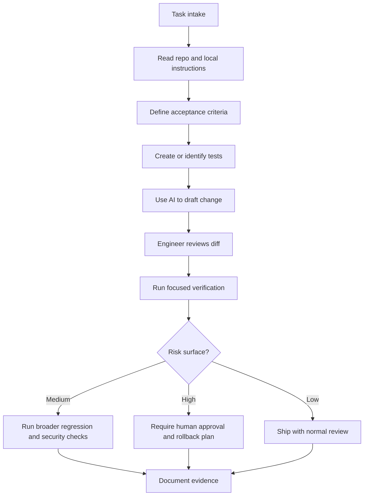
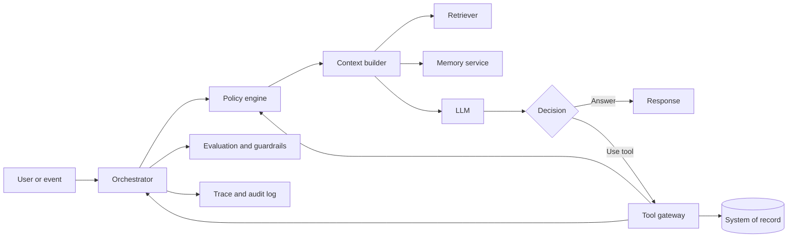
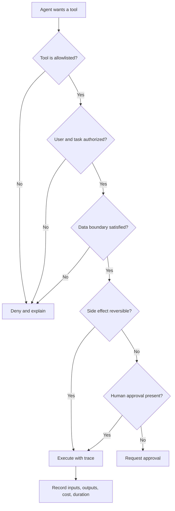
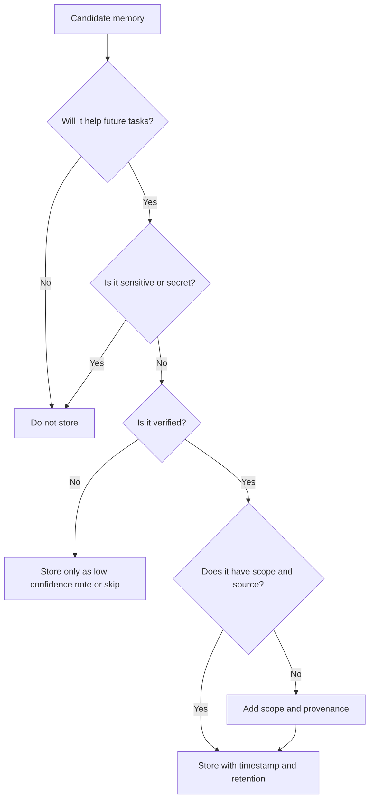
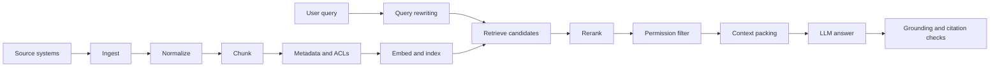
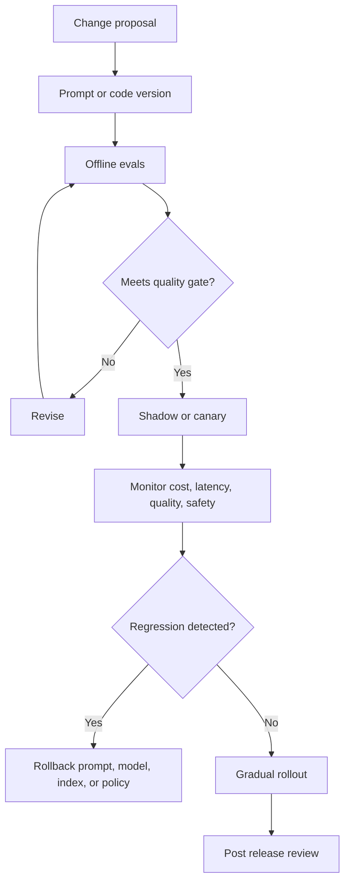
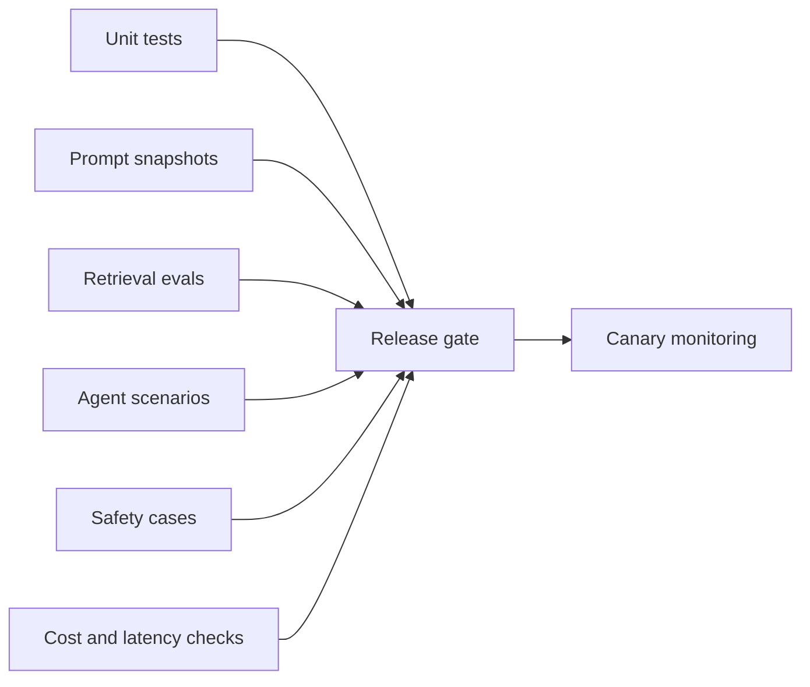
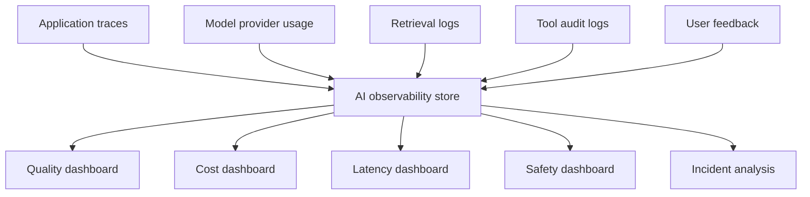
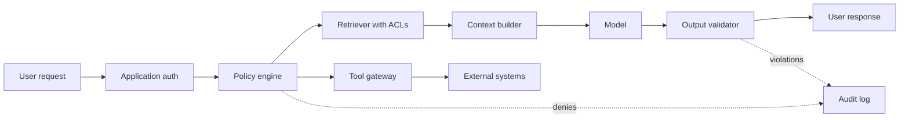

# AI Native Software Engineering

AI native software engineering applies normal engineering rigor to systems where language models assist, decide, retrieve, generate, test, review, operate, or act through tools. The phrase should not mean "trust the model more." It should mean "build a tighter control system around probabilistic work."

The quality bar is higher than ordinary automation because the system can be plausible while wrong, cheap in a demo while expensive in production, and helpful in isolation while unsafe when connected to tools, memory, private data, or deployment paths.

## Existing anchors

- AI Development
- AI-Enhanced Software Development
- Indexing Large Codebases for AI-Assisted Development
- Context-Aware Systems and MCP Protocols
- ReAct Agent Architecture &amp; Flow
- LLMOps and Model Deployment
- Programming Languages for AI-Native Agents

## Core claim

AI native engineering is a discipline of evidence. The model may propose, summarize, classify, plan, and execute, but the engineering system must provide:

- Ground truth from repositories, logs, tests, specifications, and production telemetry.
- Explicit permission boundaries for data access and tool use.
- Repeatable evaluations for behavior that cannot be proven by type checks alone.
- Regression tests for prompt, retrieval, model, and workflow changes.
- Observability that explains model behavior, cost, latency, tool use, and failure modes.
- Human review gates for irreversible, sensitive, high cost, or externally visible actions.
- Rollback paths for prompts, indexes, tools, model versions, and agent policies.

## Operating model

| Area | Old assumption | AI native assumption | Required evidence |
|---|---|---|---|
| Code generation | Generated code is a draft | Generated code is untrusted acceleration | Tests, diff review, static analysis, security review |
| Search | Keyword search is enough | Retrieval is part of runtime correctness | Retrieval evals, citation checks, freshness metrics |
| Prompting | Prompt text is informal | Prompts are production artifacts | Versioning, changelog, approvals, regression suite |
| Agents | Agent autonomy is a feature | Autonomy is a bounded risk budget | Permission matrix, audit logs, kill switch |
| Memory | More memory is better | Memory changes system behavior | Retention policy, provenance, deletion path, consent |
| Models | Latest model is best | Model choice is a tradeoff | Cost, latency, eval score, context needs, safety profile |
| Observability | Logs cover application behavior | Traces must include model reasoning surfaces | Prompt ids, retrieval ids, tool calls, token costs |
| Quality | Manual spot checks are enough | AI behavior needs continuous tests | Golden sets, adversarial cases, drift monitoring |

## AI assisted development quality bar

AI output must be treated as untrusted acceleration. A strong workflow lets AI reduce toil without lowering standards.

Required controls:

- Repo reading before edits.
- Tests before confidence.
- Diff review by a human or a high precision review agent with human escalation.
- Security review for authentication, authorization, secrets, payment, data export, infrastructure, and deployment paths.
- No fabricated APIs, flags, files, migrations, benchmarks, or release claims.
- No silent broad refactors.
- No secrets in prompts, generated files, logs, screenshots, or eval fixtures.
- Traceable rationale for architecture changes.
- Clear separation between generated suggestions and accepted engineering decisions.
- Verification against the same commands that CI or production gates will run.

### Development workflow

### Quality gates for AI generated code

| Gate | What it catches | Minimum bar | Stronger bar |
|---|---|---|---|
| Type checking | Invented APIs, shape drift, null handling | Clean type check | Strict mode plus API contract tests |
| Unit tests | Local behavior errors | Relevant tests pass | New tests cover edge cases and failure paths |
| Integration tests | Broken boundaries | Critical path passes | External mocks validate retries and timeouts |
| Security checks | Secret leaks, injection, privilege mistakes | Static checks and manual review | Threat model plus abuse cases |
| Diff review | Broad unintended changes | Human reads changed files | Reviewer verifies claims against repo evidence |
| Runtime smoke | Miswired configuration | Service starts | Observed behavior through actual UI or API |
| Cost review | Expensive loops, long prompts | Cost estimate exists | Token budgets enforced and monitored |

### Common failure patterns

| Pattern | Symptom | Countermeasure |
|---|---|---|
| Hallucinated dependency | Code imports a package not in the lockfile | Verify package manifest and lockfile before accepting |
| Plausible API misuse | Method exists but semantics are wrong | Read official docs or local type definitions |
| Overbroad cleanup | Generated patch rewrites unrelated files | Scope diff by task and reject incidental churn |
| Test theater | Tests assert implementation details but not behavior | Add failure mode and user visible assertions |
| Hidden data leak | Prompt contains credentials or private customer data | Redact, classify, and enforce prompt data policy |
| False confidence | Summary says tests passed when none ran | Require command output and exit codes |

## Agentic systems

Agentic systems combine models, tools, state, memory, retrieval, planning, and feedback loops. They require software architecture, not just a larger prompt.

Agentic systems require:

- Clear task boundaries.
- Tool permission model.
- State management.
- Memory policy.
- Retry and timeout policy.
- Human approval gates.
- Audit logs.
- Evaluation harness.
- Rollback or kill switch.
- Rate limits and spend limits.
- Idempotent tool execution where possible.
- Failure classification.
- Recovery behavior that does not create duplicate external side effects.

### Agent architecture

### Agent roles and responsibilities

| Component | Responsibility | Must not do |
|---|---|---|
| Orchestrator | Owns workflow state, retries, cancellation, and step order | Hide side effects inside prompt text |
| Policy engine | Decides whether data and tools are allowed for this user and task | Trust model self classification as sole authority |
| Context builder | Selects minimal relevant context for the current step | Dump entire databases or repositories into prompts |
| Retriever | Finds grounded evidence with permissions and provenance | Return unauthorized or stale private content |
| Memory service | Stores durable facts, preferences, and past outcomes | Store secrets, raw sensitive data, or unverifiable claims |
| Tool gateway | Executes bounded operations with schemas and audit logs | Expose broad shell, admin, or network access by default |
| Evaluator | Scores outputs, tool choices, and policy compliance | Depend only on subjective manual review |
| Observability layer | Records traces, cost, latency, inputs, outputs, and decisions | Log secrets or sensitive payloads without controls |

### Autonomy levels

| Level | Description | Example | Required control |
|---|---|---|---|
| 0 | Suggest only | Draft a code review comment | Human decides everything |
| 1 | Execute reversible local action | Format a file, run tests | Local sandbox and diff review |
| 2 | Execute bounded external action | Create a ticket or draft PR | Tool allowlist and audit log |
| 3 | Execute customer visible action | Send an email or update a support case | Human approval or policy based approval |
| 4 | Execute irreversible or financial action | Delete data, deploy production, issue refund | Strong approval, dual control, rollback plan |

## Tool permissions

Tools turn model text into action. The safest pattern is a narrow tool gateway with explicit schemas, policy checks, rate limits, and audit logs.

| Tool class | Examples | Default permission | Review requirement |
|---|---|---|---|
| Read local repo | File reads, search, dependency inspection | Allowed for assigned scope | Confirm no unrelated file edits |
| Write local repo | Patch files, update tests | Allowed only for assigned files or task scope | Diff review and verification |
| Execute local commands | Tests, linters, build | Allowed with bounded working directory | Report failures accurately |
| Network read | Official docs, dependency metadata | Allowed when current facts are needed | Prefer primary sources |
| Network write | API mutation, ticket creation, PR creation | Deny by default | Human approval or explicit policy |
| Secrets access | Env files, credential stores | Deny by default | Need to know, never paste into prompts |
| Production operations | Deploy, scale, delete, migrate | Deny by default | Change management and rollback |
| Financial operations | Billing, refunds, purchases | Deny by default | Strong approval and audit trail |

### Permission decision flow

### Tool design rules

- Prefer structured inputs and outputs over free form instructions.
- Validate tool arguments before execution.
- Make dangerous operations explicit, separate, and hard to call accidentally.
- Require idempotency keys for external mutations when possible.
- Return machine readable errors with retry hints.
- Attach each tool call to a trace id, user id, policy decision, and prompt version.
- Avoid giving the model a raw shell, database superuser, cloud admin, or unrestricted browser unless the environment is intentionally sandboxed.

## Memory

Memory is durable context that affects future behavior. It is powerful because it reduces repeated context collection, and risky because it can preserve stale, sensitive, or incorrect assumptions.

### Memory types

| Type | Scope | Example | Risk | Control |
|---|---|---|---|---|
| Session memory | Current conversation | Current task constraints | Context pollution | Reset at task boundary |
| User preference | User or team | Preferred test commands | Stale preference | Timestamp and source |
| Project memory | Repo or product | Architecture decision | Drift from code | Verify against repo |
| Episodic memory | Prior incident | Failure and fix summary | Overfitting to past | Link evidence |
| Semantic memory | Stable domain fact | Naming convention | Low if verified | Periodic refresh |
| Operational memory | Live system state | Current cluster config | High drift | Treat as stale quickly |

### Memory quality bar

- Store the smallest useful fact.
- Record source, time, scope, confidence, and deletion path.
- Separate user preferences from repo facts and production facts.
- Never store secrets, private keys, access tokens, raw customer records, or regulated data without explicit policy.
- Prefer memory as a routing hint, not a substitute for current verification.
- Expire or refresh facts that can drift.
- Expose memory use when it materially affects a decision.

### Memory write decision

## Retrieval and context

RAG quality depends on:

- Chunking.
- Metadata.
- Freshness.
- Ranking.
- Deduplication.
- Citation and provenance.
- Permission filtering.
- Context window budgeting.
- Query rewriting.
- Evaluation dataset.
- Negative retrieval tests.
- Index rebuild strategy.
- Staleness detection.

### RAG pipeline

### Retrieval design choices

| Choice | Good default | When to change |
|---|---|---|
| Chunk size | 300 to 800 tokens with overlap | Use smaller chunks for API docs, larger chunks for narrative docs |
| Metadata | Source, owner, timestamp, ACL, type, version | Add domain fields needed for filtering and ranking |
| Search | Hybrid lexical plus vector | Pure vector can miss exact identifiers and error strings |
| Reranking | Cross encoder or model based rerank for top candidates | Skip only for very low latency or low value paths |
| Citations | Required for factual answers | Internal workflows may use trace links instead |
| Freshness | Incremental updates plus rebuild checks | Use full rebuild after parser, chunker, or ACL changes |
| ACLs | Filter before final context packing | Enforce at source and retrieval layers for defense in depth |

### Context engineering

Context engineering is the practice of selecting, ordering, compressing, and labeling the information a model receives. It is more than prompt writing.

High quality context has:

- A clear task objective.
- Current user constraints.
- Relevant source excerpts with provenance.
- Explicit exclusions.
- Known assumptions.
- Tool results that are distinguishable from model claims.
- Output schema or acceptance criteria.
- Token budget allocation.
- Freshness notes for time sensitive facts.
- Safety and data handling instructions.

### Context packing template

| Section | Purpose | Example contents |
|---|---|---|
| System policy | Non negotiable constraints | Data boundaries, tool restrictions, role |
| Task | Current objective | "Review this diff for auth regressions" |
| User constraints | User specific requirements | "Do not push, keep changes local" |
| Ground truth | Evidence | File excerpts, logs, test output, API responses |
| Working memory | Relevant prior facts | Architecture decision, naming convention |
| Tools | Available actions | Read only search, test command, patch tool |
| Output contract | Required response shape | Findings first, file line references |

### Context anti-patterns

| Anti-pattern | Why it fails | Replacement |
|---|---|---|
| Context dump | Wastes tokens and hides relevant facts | Selective retrieval and structured summaries |
| Prompt folklore | Behavior depends on unversioned phrasing | Versioned prompt with eval coverage |
| Hidden tool output | Model cannot distinguish observation from guess | Label tool outputs and provenance |
| Stale memory | Past facts override current repo state | Verify drift prone facts before using |
| Missing negatives | Retriever only tested for happy paths | Include queries that should return no answer |

## LLMOps

LLMOps is the operational discipline for model powered software. It covers prompts, models, retrieval, tools, evaluations, deployment, observability, safety, cost, and incident response.

Core concerns:

- Model selection.
- Prompt versioning.
- Evaluation gates.
- Regression tests.
- Cost controls.
- Latency budgets.
- Safety filters.
- Data retention.
- Feedback loop.
- Observability.
- Incident response.
- Dataset governance.
- Rollback strategy.

### Release lifecycle

### LLMOps artifact inventory

| Artifact | Versioned? | Reviewed? | Testable? | Notes |
|---|---|---|---|---|
| Prompt templates | Yes | Yes | Yes | Treat like source code |
| Tool schemas | Yes | Yes | Yes | Schema changes can break agents |
| Retrieval indexes | Yes, by build id | Yes | Yes | Record corpus snapshot and parser version |
| Eval datasets | Yes | Yes | Yes | Prevent silent benchmark drift |
| Model configuration | Yes | Yes | Yes | Include temperature, max tokens, safety settings |
| Memory policy | Yes | Yes | Partly | Test retention, deletion, and scope rules |
| Cost budgets | Yes | Yes | Yes | Enforce per route, tenant, workflow, and user |
| Safety policy | Yes | Yes | Yes | Include abuse cases and escalation rules |

## Evaluations

Evaluations measure whether an AI system behaves well enough for its job. They are not a single benchmark score.

### Evaluation taxonomy

| Eval type | Measures | Example |
|---|---|---|
| Golden answer | Correctness against expected output | Support answer includes required steps |
| Rubric based | Quality dimensions | Accuracy, completeness, tone, grounding |
| Pairwise | Relative quality | New prompt beats old prompt on 70 percent of cases |
| Tool use | Correct action selection | Agent calls read tool before write tool |
| Retrieval | Source selection | Relevant document appears in top 5 |
| Grounding | Faithfulness to sources | No unsupported factual claims |
| Safety | Policy compliance | Refuses credential exfiltration request |
| Regression | Stability across releases | Prior failures stay fixed |
| Cost and latency | Operational fitness | P95 latency under target and cost per task under budget |
| Human review | Expert judgment | Reviewer approves high risk answers |

### Evaluation dataset design

Strong eval sets include:

- Common happy paths.
- Known historical failures.
- Boundary cases.
- Ambiguous requests.
- Permission denied cases.
- Stale data cases.
- Tool failure cases.
- Retrieval misses.
- Adversarial prompt injection attempts.
- Cost intensive tasks.
- Cases where the correct answer is "I do not know."

### Evaluation metrics

| Metric | Good for | Watch out for |
|---|---|---|
| Exact match | Structured outputs | Too brittle for natural language |
| Semantic similarity | Paraphrases | Can approve unsupported claims |
| Precision | Avoiding bad answers | May make system overly cautious |
| Recall | Finding all relevant information | Can flood context with noise |
| Faithfulness | Source grounded answers | Requires reliable source annotations |
| Tool success rate | Agent reliability | Does not prove tool should have been used |
| Human preference | Product quality | Expensive and subjective |
| Cost per successful task | Efficiency | Can hide low quality shortcuts |

## Regression tests

Regression tests for AI systems should cover deterministic code and probabilistic behavior.

| Layer | Test | Example assertion |
|---|---|---|
| Prompt rendering | Snapshot or schema test | Required policy section is present |
| Tool schema | Contract test | Invalid arguments are rejected |
| Retriever | Golden query test | Correct source is in top results |
| Reranker | Ranking test | More authoritative source outranks duplicate |
| Generator | Rubric eval | Answer cites source and avoids unsupported claim |
| Agent loop | Scenario test | Agent stops after approval denial |
| Memory | Scope test | User A memory is not visible to user B |
| Safety | Abuse test | Prompt injection cannot override tool policy |
| Cost | Budget test | Workflow stops before token budget breach |
| Observability | Trace test | Each model call has prompt id and cost fields |

### Regression suite shape

## Prompt and version management

Prompts are production code when they affect user visible behavior, data access, tool use, cost, or safety.

### Prompt artifact fields

| Field | Purpose |
|---|---|
| Prompt id | Stable identity for logs and rollbacks |
| Version | Immutable release marker |
| Owner | Accountable maintainer |
| Change reason | Why the prompt changed |
| Model compatibility | Supported model family and settings |
| Input contract | Required variables and schemas |
| Output contract | Required format and validation |
| Safety policy | Data and behavior limits |
| Eval coverage | Tests that protect behavior |
| Rollback plan | Known previous safe version |

### Prompt review checklist

- The prompt describes the task without smuggling hidden product requirements.
- The prompt separates facts, instructions, examples, and tool output.
- The prompt does not rely on fragile phrasing where a schema would work better.
- The prompt states uncertainty behavior.
- The prompt states citation or provenance requirements for factual answers.
- The prompt does not ask for chain of thought disclosure.
- The prompt includes data handling constraints.
- The prompt version is visible in traces.
- The change has regression coverage for the behavior it intends to alter.

## AI observability

AI observability connects model behavior to product behavior. Normal application logs are insufficient because failures may come from retrieval, memory, prompt assembly, model selection, tool policy, or cost throttling.

### Trace fields

| Field | Why it matters |
|---|---|
| Trace id | Correlates user request, model calls, retrieval, and tools |
| User and tenant scope | Supports permission debugging and cost allocation |
| Prompt id and version | Enables rollback and regression analysis |
| Model and parameters | Explains behavior and cost changes |
| Input and output token counts | Tracks cost and context pressure |
| Retrieval query and result ids | Debugs missing or wrong context |
| Source citations | Supports grounding checks |
| Tool calls and arguments | Audits side effects |
| Policy decisions | Shows why access or tools were allowed or denied |
| Latency by stage | Identifies slow retrieval, model, or tool calls |
| Safety filter results | Explains refusals and escalations |
| Eval score or online quality signal | Detects quality drift |

### Observability dashboard

### Useful alerts

| Alert | Signal | Likely cause |
|---|---|---|
| Cost spike | Tokens or spend exceed budget | Loop, prompt bloat, model change, abuse |
| Retrieval miss spike | Low citation or low top k relevance | Index drift, parser failure, ACL bug |
| Tool failure spike | Increased tool error rate | API outage, schema mismatch, permission change |
| Refusal spike | More safety blocks | Policy change, adversarial traffic, bad classifier |
| Latency spike | P95 route latency rises | Model slowdown, reranker cost, slow tool |
| Low grounding | Unsupported claim rate rises | Prompt change, poor retrieval, stale memory |

## Cost controls

Cost is an architecture concern. AI systems can scale cost faster than ordinary software because token use compounds through retrieval, agent loops, retries, summarization, and parallel tool calls.

### Cost levers

| Lever | Technique | Tradeoff |
|---|---|---|
| Model routing | Use smaller model for easy cases | Needs confidence classifier |
| Context limits | Pack only relevant evidence | Can omit useful background |
| Caching | Cache embeddings, retrieval, and stable answers | Must respect permissions and freshness |
| Batch processing | Group offline jobs | Increases delay |
| Early stopping | Stop low value loops | May reduce completion rate |
| Tool first design | Query database directly instead of asking model | Requires deterministic integration |
| Eval sampling | Evaluate representative subset in CI | May miss rare regressions |
| Budget enforcement | Per user, tenant, route, and workflow limits | Needs clear user experience on denial |

### Budget policy example

| Workflow | Budget dimension | Example policy |
|---|---|---|
| Chat answer | Tokens per request | Hard stop after context and output budget |
| Code review | Files per run | Review only changed files unless expanded |
| Agent task | Tool calls per task | Stop after N failed attempts |
| RAG ingestion | Documents per job | Backpressure and retry queue |
| Eval run | Cases per commit | Full suite nightly, focused suite per PR |
| Production tenant | Monthly spend | Alert at 70 percent, throttle at 90 percent |

## Safety and data boundaries

Safety is not just content moderation. It includes data access, data retention, tool authority, customer impact, legal constraints, and operational blast radius.

### Data classification

| Data class | Examples | Prompt policy | Storage policy |
|---|---|---|---|
| Public | Docs, public marketing pages | Allowed | Normal retention |
| Internal | Private architecture notes | Allowed only for authorized users | Access controlled traces |
| Confidential | Contracts, private business plans | Minimize and redact | Short retention and audit |
| Customer private | Support tickets, user records | Use only for permitted task | Strict access and deletion |
| Regulated | Health, payment, government identifiers | Avoid unless approved architecture | Specialized compliance controls |
| Secrets | Tokens, private keys, passwords | Never include | Never store in AI logs |

### Prompt injection defenses

- Treat retrieved content as data, not instructions.
- Keep system and policy instructions outside retrievable documents.
- Strip or quarantine instructions found inside untrusted documents.
- Require tool calls to pass policy checks independent of model text.
- Use allowlisted tools with narrow schemas.
- Prefer citations and structured outputs for factual workflows.
- Add tests where documents attempt to override policies.

### Boundary diagram

## Practical scenarios

### Scenario 1: AI code assistant changes authentication middleware

Risk:

- Auth middleware is high impact and easy to break with plausible looking code.
- The assistant may simplify checks that appear redundant but encode security policy.

Expected controls:

- Read current middleware, route tests, security notes, and authorization helpers.
- Add or update tests for allowed, denied, expired, missing, and cross tenant cases.
- Run type checks, auth tests, and focused integration tests.
- Review diff for permission broadening.
- Require human review before merge.

Review questions:

- Did any condition become less restrictive?
- Are deny by default paths preserved?
- Are errors safe and non revealing?
- Are logs free of tokens and private identifiers?
- Is the behavior covered by regression tests?

### Scenario 2: Support agent drafts a refund response

Risk:

- The agent can produce customer visible commitments.
- Refund policy may depend on account status and jurisdiction.

Expected controls:

- Retrieve only authorized customer and policy data.
- Draft response without issuing refund unless approved.
- Show cited policy and account facts to reviewer.
- Require explicit approval for financial action.
- Log prompt version, retrieved records, and approval identity.

Review questions:

- Did the agent distinguish policy from customer facts?
- Did it avoid promising an action before approval?
- Was private data minimized in the response?
- Is the financial tool behind a separate approval gate?

### Scenario 3: RAG answer over engineering docs

Risk:

- The answer can be authoritative but based on stale or wrong documents.
- Search may retrieve old docs over current code.

Expected controls:

- Hybrid retrieval over docs and code.
- Freshness metadata and source priority.
- Citation requirement.
- "I do not know" behavior when sources conflict.
- Eval cases for renamed APIs, deleted flags, and deprecated commands.

Review questions:

- Are citations current and authoritative?
- Does answer quality drop when a relevant document is missing?
- Does the system identify conflicting sources?
- Are private documents filtered by user permission?

### Scenario 4: Agent opens a pull request

Risk:

- The agent may bundle unrelated changes or claim unverified success.

Expected controls:

- Scope file edits to task.
- Run documented verification.
- Include test evidence in PR description.
- Leave unrelated dirty files untouched.
- Avoid pushing unless explicitly authorized.

Review questions:

- Does the PR match the requested scope?
- Are generated claims backed by command output?
- Are secrets, logs, and generated artifacts excluded?
- Can the change be reverted cleanly?

### Scenario 5: Production summarization job cost spike

Risk:

- Summarization can create nested prompts, retries, and long context windows.

Expected controls:

- Per job token budget.
- Batch size limit.
- Prompt length monitoring.
- Retry cap with exponential backoff.
- Alert on spend and output volume.
- Degraded mode using smaller model or shorter summary.

Review questions:

- Which route, tenant, prompt version, or model caused the spike?
- Did retries multiply cost?
- Was context packing too permissive?
- Did caching fail or become invalidated?

## Review checklists

### AI assisted code review checklist

- The assistant read relevant files before editing.
- The diff is limited to the requested scope.
- No unrelated formatting churn is included.
- Tests cover intended behavior and failure cases.
- Verification commands and results are recorded.
- Security sensitive code has explicit review.
- Generated code uses existing project patterns.
- No secret, token, customer data, or private log was added.
- Documentation changes match shipped behavior.
- Any uncertainty is stated rather than hidden.

### Agent system review checklist

- Agent goal is narrow and measurable.
- Autonomy level is documented.
- Tool permissions are allowlisted and scoped.
- Tool calls are validated independently of model text.
- Human approval is required for high impact side effects.
- Retries have caps and do not duplicate external actions.
- Timeouts and cancellation are defined.
- Memory reads and writes have policy controls.
- Audit logs include user, tool, policy, and trace ids.
- Kill switch and rollback path exist.

### RAG review checklist

- Corpus source list is known.
- Ingestion preserves source, timestamp, owner, and ACL metadata.
- Chunking strategy matches document type.
- Hybrid search or exact identifier handling exists where needed.
- Reranking is evaluated against realistic queries.
- Retrieval evals include negative and stale cases.
- Answers cite sources or expose trace links.
- Permission filtering happens before context packing.
- Index rebuilds are reproducible.
- Freshness drift is monitored.

### LLMOps release checklist

- Prompt, model, tool schema, and retrieval index versions are recorded.
- Offline evals pass against golden and adversarial cases.
- Cost and latency are within budget.
- Safety evals include injection, data leak, and unauthorized tool use.
- Canary or shadow deployment exists for risky changes.
- Rollback target is known.
- Observability dashboards include trace, quality, cost, and safety fields.
- Incident owner and escalation path are defined.

### Prompt change checklist

- Prompt has a stable id and version.
- Change reason is documented.
- Input and output contracts are explicit.
- The prompt distinguishes instructions from context and examples.
- The prompt avoids hidden policy changes.
- The prompt does not reveal chain of thought.
- Tests cover the intended behavior change.
- Online traces can separate old and new versions.

### Data boundary checklist

- Data classes are identified.
- User authorization is checked before retrieval.
- Sensitive data is minimized before model calls.
- Secrets are excluded from prompts, memory, logs, and evals.
- Retention period is defined.
- Deletion path is tested.
- Cross tenant access is tested.
- Third party model provider terms match data policy.

## Design heuristics

- Use deterministic code for rules, calculations, permissions, and irreversible actions.
- Use models for language, ambiguity, ranking, synthesis, and fuzzy classification.
- Keep tool policy outside the prompt.
- Keep prompts small enough to review.
- Prefer structured outputs when downstream code depends on the answer.
- Prefer retrieval over memory for factual or drift prone data.
- Prefer memory over retrieval for stable user preferences and repeated context.
- Prefer evals over vibes.
- Prefer canaries over big bang model changes.
- Prefer explicit uncertainty over plausible invention.
- Prefer source citations over unsupported fluency.

## Failure mode index

| Failure | Detection | Prevention |
|---|---|---|
| Hallucinated fact | Grounding eval, citation check | Require source evidence |
| Wrong tool call | Tool trace review | Policy engine and tool allowlist |
| Unauthorized retrieval | ACL test | Filter before context packing |
| Prompt injection | Safety scenario | Treat retrieved text as data |
| Memory contamination | Memory scope test | Source, confidence, expiry, deletion |
| Cost runaway | Spend alert | Budgets, loop caps, caching |
| Latency regression | P95 dashboard | Model routing and timeout budgets |
| Stale answer | Freshness metric | Reindexing and source priority |
| Regression after prompt edit | Eval suite | Versioned prompts and release gates |
| Silent data leak | Log audit | Redaction and retention policy |

## Related notes

- [00 Staff Principal Software Engineering](/compendium/software-engineering/staff-principal-software-engineering)
- [10 Testing Verification and Quality Bars](/compendium/software-engineering/testing-verification-and-quality-bars)
- [11 Performance Capacity and Cost](/compendium/software-engineering/performance-capacity-and-cost)
