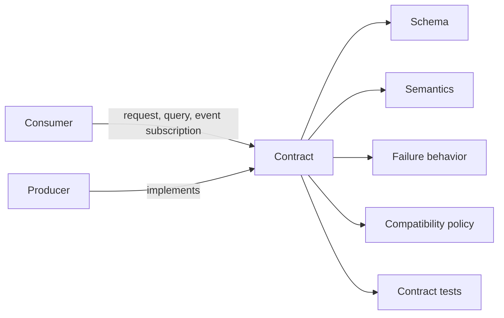
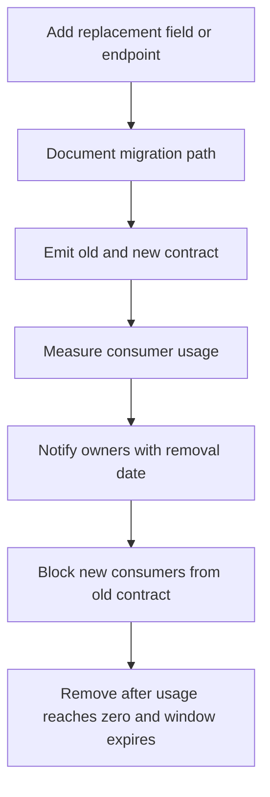
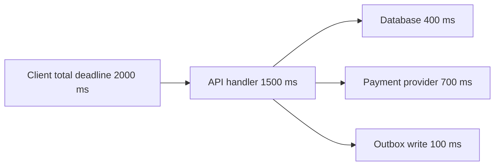
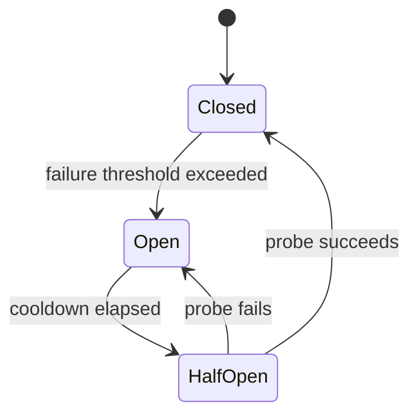
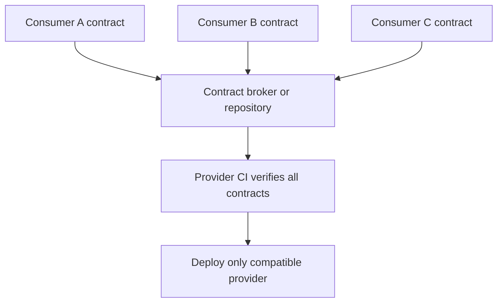
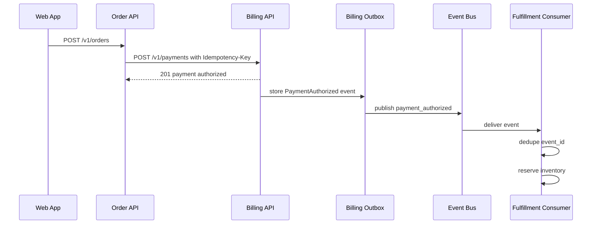

# APIs Contracts and Integration

APIs are long-lived contracts. Integration quality determines how safely systems can evolve, how quickly teams can ship, and how much production risk appears at service boundaries. A good contract makes behavior explicit enough that producers can change internals without surprising consumers.

An API contract is more than a payload schema. It includes identity, authorization expectations, consistency, error behavior, rate limits, retry safety, versioning policy, observability, and operational ownership.

## Core mental model

Every integration answers six questions:

| Question | Contract concern | Failure if ignored |
|---|---|---|
| What is being exchanged? | Resource, command, query, event, file, stream | Consumers infer meaning from implementation details |
| Who owns the truth? | Source of record, derived view, cache | Split brain, stale writes, impossible reconciliation |
| What can change? | Compatibility rules, versioning policy | Accidental breaking changes |
| What happens when it fails? | Timeouts, retries, idempotency, compensation | Duplicate work, data loss, cascading failure |
| How is misuse reported? | Error model, validation, problem details | Ad hoc parsing, brittle client logic |
| How is it verified? | Contract tests, schema checks, examples | Integration drift discovered in production |



## Contract types

| Contract type | Typical technologies | Best for | Main risks |
|---|---|---|---|
| Synchronous API | REST, GraphQL, gRPC, internal RPC | Immediate request response workflows | Tight availability coupling, timeout chains |
| Asynchronous event | Kafka, RabbitMQ, SQS, SNS, NATS, webhooks | Facts, notifications, workflows, projections | Duplicate delivery, ordering assumptions, schema drift |
| File contract | CSV, JSON, Parquet, XML, fixed width | Batch exchange, analytics, partner integrations | Ambiguous format rules, partial loads, encoding problems |
| Database contract | Shared tables, views, CDC streams | Legacy integration, reporting, change capture | Leaked internals, lock contention, unsafe schema changes |
| UI contract | Backend for frontend response shapes, component props | Product surfaces, frontend backend boundaries | Accidental coupling to backend domain model |
| Operational contract | Health checks, metrics, alerts, runbooks, SLOs | Safe operation and incident response | False health, missing ownership, alert fatigue |

Shared databases should be treated as integration debt unless explicitly designed as a stable contract. A read-only view, CDC topic, or API facade is usually safer than letting another service depend on private tables.

## API design principles

- Design around stable domain concepts, not current database tables.
- Make identity explicit and immutable wherever possible.
- Separate commands from queries when their behavior, consistency, or authorization differs.
- Make idempotency explicit for every mutating operation that clients may retry.
- Prefer additive changes and deprecation windows over flag day migrations.
- Use stable error models that machines can parse and humans can diagnose.
- Document consistency guarantees, including read after write behavior.
- Document timeout and retry expectations for both client and server.
- Avoid exposing private lifecycle states unless they are part of the product contract.
- Prefer small, cohesive contracts over broad "god" endpoints.
- Include examples for success, validation failure, authorization failure, conflict, and retry.
- Treat observability fields such as request ID and correlation ID as contract elements.

## Choosing REST, GraphQL, gRPC, or events

| Style | Strengths | Weaknesses | Choose when |
|---|---|---|---|
| REST | Simple resource model, broad tooling, cache friendly, easy debugging | Can become chatty, weak typing unless OpenAPI is maintained, hard for graph shaped reads | Public APIs, CRUD resources, partner integrations, web clients |
| GraphQL | Client selected fields, schema introspection, good for aggregate views | Resolver complexity, authorization per field, caching complexity, N+1 risks | Product clients need flexible reads across related entities |
| gRPC | Strong contracts, efficient binary transport, streaming, code generation | Browser support needs bridges, harder ad hoc debugging, versioning discipline required | Internal service to service calls, low latency systems, typed platforms |
| Async events | Loose temporal coupling, scalable fanout, replayable history | Eventual consistency, duplicates, ordering gaps, harder debugging | State changes, workflows, audit trails, projections, integrations that should survive receiver downtime |

Useful rule: use synchronous APIs for questions and commands that need immediate acceptance, and events for facts that already happened or workflows that can proceed asynchronously.

## REST contracts

REST works best when resources, representations, and status codes are consistent. A REST contract should define resource identity, allowed methods, representation shape, filtering, pagination, error bodies, and concurrency behavior.

### Resource modeling

| Pattern | Good | Bad |
|---|---|---|
| Stable nouns | `/v1/customers/{customer_id}/invoices` | `/v1/getCustomerInvoices` |
| Explicit commands | `POST /v1/invoices/{id}/void` | `PATCH /v1/invoices/{id}` with `{ "status": "voided" }` when voiding has business rules |
| Collection creation | `POST /v1/invoices` | `GET /v1/createInvoice?...` |
| Full replacement | `PUT /v1/customer-profiles/{id}` | `POST /v1/updateEverything` |
| Partial update | `PATCH /v1/customer-profiles/{id}` | `PUT` that silently merges omitted fields |

### HTTP method semantics

| Method | Expected semantics | Idempotent | Notes |
|---|---|---:|---|
| `GET` | Retrieve a representation | Yes | Must not mutate business state |
| `HEAD` | Retrieve metadata | Yes | Useful for cache and existence checks |
| `POST` | Create subordinate resource or run command | Not by default | Can be made idempotent with a key |
| `PUT` | Replace or create at known URI | Yes | Client knows the resource ID |
| `PATCH` | Apply partial change | Usually no | Can be idempotent if patch format is designed that way |
| `DELETE` | Remove or tombstone | Yes | Repeated delete should not recreate failure ambiguity |

### REST good example

```http
POST /v1/payments HTTP/1.1
Content-Type: application/json
Idempotency-Key: pay_2026_06_11_0001
X-Request-ID: req_01hx

{
  "account_id": "acct_123",
  "invoice_id": "inv_456",
  "amount": {
    "currency": "USD",
    "value": "129.00"
  },
  "payment_method_id": "pm_789"
}
```

```http
HTTP/1.1 201 Created
Content-Type: application/json
Location: /v1/payments/pay_abc
X-Request-ID: req_01hx

{
  "id": "pay_abc",
  "status": "authorized",
  "created_at": "2026-06-11T12:30:00Z"
}
```

Why it is good:

- The operation has an explicit idempotency key.
- Money is represented as decimal string plus currency, not a float.
- The response includes a stable resource identifier.
- The server returns `201 Created` and a `Location` header.
- Request tracing is part of the contract.

### REST bad example

```http
GET /createPayment?account=123&invoice=456&amount=129 HTTP/1.1
```

Why it is bad:

- `GET` mutates state.
- No idempotency key exists.
- Amount has no currency and may be parsed imprecisely.
- The endpoint name describes implementation action rather than resource semantics.
- Sensitive or important values may leak through logs and caches.

## GraphQL contracts

GraphQL is a contract centered on a typed schema. The schema is not only documentation. It is executable, introspectable, and consumed by code generation. The hard part is preserving semantics as fields and resolvers evolve.

### GraphQL design guidelines

| Topic | Recommended practice | Avoid |
|---|---|---|
| Field names | Domain language with stable meaning | Names copied from database columns |
| Nullability | Use non-null only when the value is always present | Overusing `!` before reality is proven |
| Pagination | Cursor based connections for lists | Unbounded arrays |
| Mutations | Payload object with result and user facing errors | Boolean success flags |
| Errors | Typed domain errors in mutation payloads plus GraphQL errors for infrastructure failures | Putting every failure in top level `errors` |
| Authorization | Enforce at resolver and field level | Returning forbidden fields as null without explanation |
| Deprecation | Use `@deprecated(reason: "...")` with a migration path | Removing fields immediately |

### GraphQL good example

```graphql
type Query {
  customer(id: ID!): Customer
}

type Customer {
  id: ID!
  displayName: String!
  invoices(first: Int!, after: String): InvoiceConnection!
}

type InvoiceConnection {
  edges: [InvoiceEdge!]!
  pageInfo: PageInfo!
}

type InvoiceEdge {
  cursor: String!
  node: Invoice!
}

type Mutation {
  voidInvoice(input: VoidInvoiceInput!): VoidInvoicePayload!
}

input VoidInvoiceInput {
  invoiceId: ID!
  reason: String!
  idempotencyKey: String!
}

type VoidInvoicePayload {
  invoice: Invoice
  errors: [UserError!]!
}

type UserError {
  code: String!
  message: String!
  path: [String!]!
}
```

### GraphQL bad example

```graphql
type Mutation {
  updateInvoiceStatus(id: ID!, status: String!): Boolean!
}
```

Why it is bad:

- `status` is an unbounded string.
- Business commands are hidden behind generic updates.
- No idempotency key exists.
- The boolean result cannot explain validation, authorization, or conflict failures.
- Consumers must query again to learn the resulting state.

## gRPC contracts

gRPC contracts are usually expressed with Protocol Buffers. They are strong at typed service boundaries, but they require discipline because field numbers, enum values, and default values become compatibility constraints.

### Protobuf evolution rules

| Change | Compatibility | Notes |
|---|---|---|
| Add optional field with new number | Usually safe | Old clients ignore it |
| Remove field but reserve number and name | Safe after consumers stop using it | Prevents accidental reuse |
| Reuse field number | Breaking | Old clients may parse wrong data |
| Change field type | Usually breaking | Some wire compatible cases still change semantics |
| Add enum value | Usually wire compatible | Clients must handle unknown values |
| Rename field | Wire compatible but source disruptive | Generated clients may break |
| Change default meaning | Breaking | Even if schema compiles |

### gRPC good example

```proto
syntax = "proto3";

package billing.v1;

service PaymentService {
  rpc CreatePayment(CreatePaymentRequest) returns (CreatePaymentResponse);
  rpc GetPayment(GetPaymentRequest) returns (GetPaymentResponse);
}

message Money {
  string currency = 1;
  string value = 2;
}

message CreatePaymentRequest {
  string account_id = 1;
  string invoice_id = 2;
  Money amount = 3;
  string payment_method_id = 4;
  string idempotency_key = 5;
}

message CreatePaymentResponse {
  Payment payment = 1;
}

message GetPaymentRequest {
  string payment_id = 1;
}

message GetPaymentResponse {
  Payment payment = 1;
}

message Payment {
  string id = 1;
  PaymentStatus status = 2;
  string created_at = 3;
}

enum PaymentStatus {
  PAYMENT_STATUS_UNSPECIFIED = 0;
  PAYMENT_STATUS_AUTHORIZED = 1;
  PAYMENT_STATUS_CAPTURED = 2;
  PAYMENT_STATUS_FAILED = 3;
}
```

### gRPC operational contract

- Set deadlines on every client call.
- Propagate cancellation to downstream work.
- Use status codes consistently: `INVALID_ARGUMENT`, `NOT_FOUND`, `ALREADY_EXISTS`, `FAILED_PRECONDITION`, `UNAVAILABLE`, `DEADLINE_EXCEEDED`.
- Put machine readable details in error metadata or rich error details.
- Do not treat transport success as business success if the response can contain domain failures.
- Version packages intentionally, such as `billing.v1` and `billing.v2`.

## Async event contracts

Events should describe facts that already happened. They are not remote procedure calls with a queue in the middle. A good event contract states what the event means, what invariants hold, how it is keyed, what ordering is promised, how duplicates are handled, and how schemas evolve.

### Event categories

| Event type | Meaning | Example | Consumer expectation |
|---|---|---|---|
| Domain event | Business fact inside a bounded context | `InvoiceVoided` | Stable domain semantics |
| Integration event | Published fact for external consumers | `BillingInvoiceVoidedV1` | Backward compatible external contract |
| Notification event | Signal that something may need attention | `CustomerEmailChanged` | Consumer may call API for details |
| CDC event | Database row change | `invoices.row.updated` | Low level replication semantics |
| Command message | Request for another component to do work | `SendReceiptEmail` | Single owner should process or reject |

Domain events and integration events are related but not always identical. Internal domain events can be rich and change with the model. Integration events should be stable, documented, and intentionally versioned.

### Event envelope

```json
{
  "event_id": "evt_01j0",
  "event_type": "billing.invoice_voided",
  "schema_version": 1,
  "occurred_at": "2026-06-11T12:31:00Z",
  "producer": "billing-service",
  "correlation_id": "req_01hx",
  "causation_id": "cmd_778",
  "subject": "invoice:inv_456",
  "data": {
    "invoice_id": "inv_456",
    "account_id": "acct_123",
    "voided_by": "user_999",
    "reason": "duplicate_invoice"
  }
}
```

### Event design checklist

- Name events in past tense, such as `InvoiceVoided`, not `VoidInvoice`.
- Include a globally unique `event_id`.
- Include stable subject identifiers.
- Include `occurred_at` from the producer, not only broker ingestion time.
- Include schema version or subject version.
- Include correlation and causation IDs.
- Define partition key and ordering scope.
- Define duplicate handling expectations.
- Define replay safety and consumer side effects.
- Avoid leaking private database columns.
- Avoid "updated" events unless the changed meaning is clear.

### Good event

```json
{
  "event_type": "catalog.product_price_changed",
  "schema_version": 2,
  "event_id": "evt_123",
  "occurred_at": "2026-06-11T10:15:00Z",
  "subject": "product:prod_123",
  "data": {
    "product_id": "prod_123",
    "previous_price": { "currency": "USD", "value": "19.00" },
    "new_price": { "currency": "USD", "value": "21.00" },
    "effective_at": "2026-06-12T00:00:00Z"
  }
}
```

Why it is good:

- The event names the business fact.
- The old and new values are explicit.
- The effective time is part of the contract.
- Consumers can deduplicate by `event_id`.

### Bad event

```json
{
  "event_type": "product_updated",
  "data": {
    "id": 123,
    "p": 21,
    "u": "2026-06-11"
  }
}
```

Why it is bad:

- The business meaning is unclear.
- Field names are not self describing.
- There is no event ID, schema version, or correlation ID.
- It is not obvious whether `p` is price, points, priority, or something else.
- Consumers must infer what changed.

## Schema evolution

Compatibility is a product decision, not a serialization feature. A change is compatible only if existing consumers continue to behave correctly without coordinated deployment.

### Change compatibility matrix

| Change | REST JSON | GraphQL | Protobuf | Event payload |
|---|---|---|---|---|
| Add optional field | Usually safe | Safe if nullable | Safe with new field number | Usually safe |
| Add required field to request | Breaking | Breaking input change | Breaking behavior | Breaking for producers |
| Remove response field | Breaking if consumed | Breaking | Breaking unless reserved and unused | Breaking |
| Rename field | Breaking | Breaking | Wire compatible but source disruptive | Breaking |
| Change field meaning | Breaking | Breaking | Breaking | Breaking |
| Add enum value | Risky | Risky | Wire compatible but client risky | Risky |
| Narrow validation | Breaking for existing clients | Breaking | Breaking | Breaking |
| Widen validation | Usually safe | Usually safe | Usually safe | Usually safe |
| Change ordering guarantees | Breaking if documented or relied on | Breaking | Breaking | Breaking |

### Evolution rules

- Add fields before requiring them.
- Keep old fields during a deprecation window.
- Emit both old and new fields when migrating names.
- Version when semantics change, not only when syntax changes.
- Reserve removed Protobuf field numbers and names.
- Treat enum expansion as potentially breaking until clients prove they handle unknown values.
- Run consumer driven contract tests before releasing provider changes.
- Keep examples current with schemas.
- Record ownership and compatibility windows in the contract repository.

### Deprecation sequence



## Versioning

Versioning is a tool for compatibility, not a substitute for it. The best versioning strategy depends on who consumes the API, how much coordination exists, and how expensive duplicate versions are to operate.

| Versioning style | Example | Best for | Tradeoffs |
|---|---|---|---|
| URL path | `/v1/invoices` | Public REST APIs | Simple routing, but versions can spread through URLs |
| Header | `Accept: application/vnd.company.billing.v1+json` | Clients that can control headers | Cleaner URLs, harder browser debugging |
| Schema subject | `billing.invoice_voided.v1` | Event streams | Clear per event compatibility |
| Package namespace | `billing.v1.PaymentService` | gRPC | Strong codegen separation |
| Field deprecation | GraphQL `@deprecated` | Gradual client migration | Requires usage visibility and discipline |

### Versioning guidelines

- Version public contracts more explicitly than private contracts.
- Keep compatibility inside a major version.
- Do not create `v2` for every additive field.
- Create a new major version when meaning, invariants, or required behavior changes.
- Support old versions only as long as there is an owner and a removal policy.
- Publish migration examples, not only schema diffs.
- Avoid "latest" endpoints. They make reproducibility impossible.

## Backwards and forwards compatibility

Backward compatibility means new producers work with old consumers. Forward compatibility means old producers work with new consumers or old consumers safely ignore new data.

| Rule | Why it matters |
|---|---|
| Unknown fields should be ignored by readers unless strict validation is required | Allows additive changes |
| Unknown enum values should map to `UNKNOWN` or be handled explicitly | Prevents crashes on producer expansion |
| Optional means optional in behavior, not only in syntax | Consumers must not be forced to infer missing data |
| Defaults must be stable | Silent default changes are semantic breaks |
| Consumers should not depend on response field order | JSON object order should not be meaningful |
| Producers should not reuse identifiers | Reuse breaks caches, audit trails, and idempotency |

## Idempotent APIs

Mutating APIs need a retry story. If a client times out after sending a request, it may not know whether the server committed the work. Idempotency lets the client retry safely without creating duplicate side effects.

### Idempotency patterns

| Pattern | Example | Use when | Caveats |
|---|---|---|---|
| Idempotency key | `Idempotency-Key: abc123` | `POST` commands may be retried | Server must store key, payload hash, status, and response |
| Client generated ID | `PUT /customers/cus_123` | Client can allocate stable resource IDs | Requires ID collision rules |
| Natural unique key | `order_number` unique per merchant | Business domain already has uniqueness | Natural keys can change or be reused in bad domains |
| Conditional request | `If-Match: "etag-123"` | Updates need optimistic concurrency | Requires ETag or version field |
| Outbox dedupe | Event ID tracked by consumer | Async consumers must handle duplicates | Consumer storage must be transactional with side effects |

### Idempotency key behavior

| Situation | Expected response |
|---|---|
| First request with key | Process command and store response |
| Duplicate request with same payload while complete | Replay original response |
| Duplicate request with same payload while still processing | Return `409 Conflict`, `202 Accepted`, or wait within timeout, documented explicitly |
| Duplicate key with different payload | Return `409 Conflict` with a stable error code |
| Key expired | Treat as new request or return explicit expiration error, documented explicitly |

### Idempotency storage

Minimum server record:

- Idempotency key.
- Authenticated principal or tenant.
- Request payload hash.
- Operation name.
- Processing status.
- Final status code and response body.
- Created time and expiration time.

Never scope an idempotency key globally if tenants share the API. Scope it by tenant, actor, operation, or resource as appropriate.

## Error models

Errors are part of the contract. They should be stable enough for programmatic handling and descriptive enough for humans to debug. Avoid making clients parse English messages.

### Error response shape

```json
{
  "type": "https://docs.example.com/errors/insufficient_funds",
  "title": "Insufficient funds",
  "status": 409,
  "code": "INSUFFICIENT_FUNDS",
  "detail": "The account balance is lower than the requested debit amount.",
  "request_id": "req_01hx",
  "fields": [
    {
      "path": "amount.value",
      "code": "AMOUNT_EXCEEDS_BALANCE",
      "message": "Amount exceeds available balance."
    }
  ]
}
```

### HTTP status guidance

| Status | Use for | Do not use for |
|---|---|---|
| `400 Bad Request` | Malformed syntax, invalid JSON | Business conflict |
| `401 Unauthorized` | Missing or invalid authentication | Authenticated user without permission |
| `403 Forbidden` | Authenticated but not allowed | Missing token |
| `404 Not Found` | Resource absent or intentionally hidden | Validation errors |
| `409 Conflict` | State conflict, idempotency mismatch, unique constraint conflict | Generic server errors |
| `422 Unprocessable Entity` | Well formed request with domain validation errors | Parse errors |
| `429 Too Many Requests` | Rate limit or quota exceeded | Permanent authorization failure |
| `500 Internal Server Error` | Unexpected server fault | Known client mistakes |
| `502 Bad Gateway` | Upstream returned invalid response | Client validation |
| `503 Service Unavailable` | Temporary overload or maintenance | Permanent failure |
| `504 Gateway Timeout` | Upstream deadline exceeded | Local validation |

### Good error model

```json
{
  "code": "IDEMPOTENCY_KEY_PAYLOAD_MISMATCH",
  "message": "The idempotency key was already used with a different request payload.",
  "request_id": "req_abc",
  "retryable": false
}
```

### Bad error model

```json
{
  "error": "Something went wrong"
}
```

Why it is bad:

- There is no stable code.
- Retry behavior is unclear.
- No request ID exists for support.
- The client cannot distinguish validation, conflict, authorization, or server failure.

## Pagination

Pagination is a consistency contract. It defines how clients traverse a changing collection without duplicates, gaps, or unbounded memory usage.

### Pagination strategies

| Strategy | Example | Strengths | Weaknesses |
|---|---|---|---|
| Offset | `?limit=50&offset=100` | Simple, good for small static lists | Slow at high offsets, duplicates or gaps while data changes |
| Page number | `?page=3&page_size=50` | Familiar for UI | Same consistency issues as offset |
| Cursor | `?limit=50&after=cursor_abc` | Stable for changing data, efficient with index | Cursor must be opaque and well designed |
| Keyset | `?limit=50&created_before=...&id_before=...` | Efficient and deterministic | More complex API shape |

### Pagination response example

```json
{
  "data": [
    {
      "id": "inv_123",
      "created_at": "2026-06-11T09:00:00Z"
    }
  ],
  "page": {
    "limit": 50,
    "next_cursor": "eyJjcmVhdGVkX2F0IjoiMjAyNi0wNi0xMVQwOTowMDowMFoiLCJpZCI6Imludl8xMjMifQ",
    "has_more": true
  }
}
```

### Pagination checklist

- Use deterministic ordering with a unique tiebreaker, such as `created_at desc, id desc`.
- Make cursors opaque.
- Include `has_more` or equivalent.
- Define maximum page size.
- Define behavior when items are inserted or deleted during traversal.
- Keep filters stable across pages.
- Do not let clients combine cursor from one query with different filters.

## Filtering, sorting, and field selection

Filtering and sorting are contracts because they define query semantics, index expectations, and authorization behavior.

| Feature | Good | Bad |
|---|---|---|
| Filtering | `?status=paid&created_after=2026-06-01T00:00:00Z` | `?where=status='paid'` |
| Sorting | `?sort=-created_at,id` with documented fields | Arbitrary SQL fragments |
| Search | `?query=receipt` with documented matching rules | Unspecified fuzzy behavior |
| Field selection | `?fields=id,status,total` | Returning private fields and asking clients to ignore them |
| Includes | `?include=customer,line_items` with limits | Recursive expansion without depth limits |

Filtering rules should state:

- Allowed fields and operators.
- Date and timezone semantics.
- Case sensitivity.
- Null handling.
- Authorization interaction.
- Maximum complexity.
- Index or performance limits.

## Concurrency control

Integration contracts must define what happens when two actors update the same resource.

### Optimistic concurrency with ETag

```http
GET /v1/invoices/inv_123 HTTP/1.1
```

```http
HTTP/1.1 200 OK
ETag: "invoice-version-7"

{
  "id": "inv_123",
  "memo": "Original memo"
}
```

```http
PATCH /v1/invoices/inv_123 HTTP/1.1
If-Match: "invoice-version-7"
Content-Type: application/json

{
  "memo": "Updated memo"
}
```

If the resource changed after the read, return:

```http
HTTP/1.1 412 Precondition Failed
Content-Type: application/json

{
  "code": "RESOURCE_VERSION_CONFLICT",
  "message": "The invoice was modified after the provided version.",
  "request_id": "req_123"
}
```

## Timeouts, retries, and circuit breakers

Distributed systems fail through partial failure, not only full outage. Every integration should define deadlines, retry budgets, and overload behavior. See also [05 Distributed Systems](/compendium/software-engineering/distributed-systems).

### Timeout budget



Timeouts must shrink as calls go deeper. A downstream timeout longer than the caller timeout wastes work and increases load during incidents.

### Retry guidance

| Failure | Retry? | Notes |
|---|---:|---|
| Network connection reset before response | Yes if operation is idempotent | Use idempotency key for mutations |
| `408 Request Timeout` | Usually | Respect operation safety |
| `409 Conflict` | Usually no | Client must change state or refresh |
| `429 Too Many Requests` | Yes after `Retry-After` | Apply jitter |
| `500 Internal Server Error` | Maybe | Retry only if documented safe |
| `502 Bad Gateway` | Usually | Bounded exponential backoff |
| `503 Service Unavailable` | Usually | Respect `Retry-After` |
| `504 Gateway Timeout` | Maybe | Risk of duplicate commit unless idempotent |
| Validation error | No | Fix request |
| Authorization failure | No | Fix credentials or permissions |

### Retry checklist

- Retry only idempotent operations or operations protected by idempotency keys.
- Use exponential backoff with jitter.
- Set a maximum retry count and total retry deadline.
- Respect `Retry-After`.
- Do not retry every layer independently without a shared budget.
- Avoid retrying on permanent errors.
- Record retry attempts in logs and metrics.
- Test duplicate request behavior.

### Circuit breaker states



Circuit breakers protect dependencies and callers from repeated calls to a failing service. They should be paired with timeouts, fallback behavior, and observability. A circuit breaker without clear user experience can turn a partial outage into confusing application behavior.

## Integration failure modes

| Failure mode | Example | Mitigation |
|---|---|---|
| Duplicate request | Client retries after timeout and creates two payments | Idempotency keys, unique constraints, response replay |
| Lost event | Producer commits database write but crashes before publishing | [Design Patterns/Outbox Pattern](/compendium/design-patterns/outbox-pattern) |
| Duplicate event | Broker redelivery after consumer crash | Consumer dedupe table, idempotent side effects |
| Out of order event | `InvoicePaid` arrives before `InvoiceCreated` | Partition by aggregate, version checks, buffering |
| Poison message | Consumer cannot parse one event and blocks partition | Dead letter queue, schema validation, alerting |
| Slow dependency | Payment provider latency consumes all threads | Deadlines, bulkheads, circuit breakers |
| Partial failure | Local state committed but remote call failed | Saga, compensation, reconciliation job |
| Schema drift | Producer changes field meaning silently | Contract tests, schema registry, compatibility checks |
| Rate limit | Partner API returns `429` under load | Token bucket, backoff, queueing, quota dashboard |
| Clock skew | Expiration or ordering based on local clocks | Server timestamps, monotonic versions, tolerance windows |
| Authorization drift | Consumer role loses permission unexpectedly | Synthetic checks, explicit scopes, owner alerts |

## Consumer driven contracts

Consumer driven contracts capture what each consumer actually depends on. They reduce the false confidence of provider only tests and prevent accidental breaking changes.



### Consumer driven contract workflow

1. Consumer defines expected request and response interactions.
2. Consumer tests itself against a mock generated from the contract.
3. Contract is published to a shared broker or repository.
4. Provider CI verifies the provider implementation against published contracts.
5. Deployment is blocked if a provider change breaks an active consumer contract.
6. Usage and ownership metadata identify who must migrate before removal.

### What to include

- Request method, path, headers, query parameters, and body shape.
- Required response fields and their meanings.
- Error cases the consumer handles.
- Authentication and authorization assumptions.
- Version or provider state setup.
- Matching rules that avoid overfitting to irrelevant values.

### What not to include

- Provider implementation details.
- Incidental response fields the consumer does not use.
- Exact timestamps or generated IDs unless they are semantically required.
- A single golden payload that makes additive changes look breaking.

## Contract testing

Contract testing sits between unit tests and end to end tests. It verifies boundaries without requiring the entire system to run.

| Test type | Purpose | Example |
|---|---|---|
| Schema validation | Payload conforms to OpenAPI, GraphQL, Protobuf, JSON Schema, or Avro | Validate event before publish |
| Provider contract test | Provider satisfies published consumer expectations | Pact provider verification |
| Consumer contract test | Consumer handles documented provider responses | Mock provider generated from contract |
| Compatibility test | New schema is compatible with prior schema | Schema registry compatibility gate |
| Example test | Documentation examples execute successfully | OpenAPI examples validated in CI |
| Negative contract test | Errors follow stable model | Invalid request returns `422` with field errors |
| Replay test | Consumer can process historical events | Replay topic snapshot in staging |

### Contract test checklist

- Validate both success and failure responses.
- Include at least one retry safe mutation case.
- Include authorization failures.
- Include pagination edge cases.
- Include unknown enum or unknown field behavior where relevant.
- Verify idempotency conflict behavior.
- Verify deprecated fields remain available during the compatibility window.
- Run provider verification in CI before deployment.
- Keep generated clients and schemas in sync.
- Fail builds on undocumented breaking changes.

## OpenAPI and schema repositories

For REST APIs, OpenAPI is most useful when treated as executable contract source, not hand written decoration.

Good practices:

- Store specs in version control.
- Generate server validation or client SDKs where practical.
- Validate examples during CI.
- Run breaking change detection against the previous released spec.
- Publish rendered docs from the same source.
- Include error schemas and headers, not only happy path bodies.
- Include security schemes and scope requirements.

Bad practices:

- Updating docs after implementation by memory.
- Using `object` for every response.
- Omitting error responses.
- Describing behavior in prose that contradicts the schema.
- Allowing undocumented fields to become relied upon by consumers.

## Webhooks

Webhooks are asynchronous contracts delivered over HTTP. They need the same rigor as events plus additional delivery and security rules.

### Webhook contract checklist

- Sign payloads with a documented algorithm.
- Include timestamp and protect against replay.
- Include event ID for deduplication.
- Retry with bounded backoff.
- Document retry schedule and final failure behavior.
- Treat non-2xx responses as failed delivery.
- Provide a manual replay mechanism.
- Provide endpoint verification where needed.
- Keep payload schema versioned.
- Avoid requiring immediate synchronous callback from the receiver.

### Webhook signature example

```http
POST /webhooks/billing HTTP/1.1
Content-Type: application/json
X-Webhook-ID: evt_123
X-Webhook-Timestamp: 1781179200
X-Webhook-Signature: v1=4f7a...
```

Receiver rules:

- Verify timestamp freshness.
- Compute signature over the raw body, not reparsed JSON.
- Deduplicate by webhook ID.
- Return 2xx only after durable acceptance.
- Process side effects asynchronously when possible.

## Security and authorization as contract

Security behavior must be documented because clients build workflows around it.

| Concern | Contract detail |
|---|---|
| Authentication | Token type, mTLS, API key, session, service account |
| Authorization | Required scopes, roles, resource ownership checks |
| Tenant isolation | How tenant is selected and validated |
| Sensitive fields | Redaction rules and role based visibility |
| Audit | Which actions generate audit entries |
| Rate limits | Quotas, windows, headers, and retry behavior |
| Idempotency scope | Whether keys are scoped by tenant, principal, or operation |

Avoid returning different error shapes for security failures. It is acceptable to hide existence with `404`, but the behavior must be intentional and consistent.

## Observability contract

Integration behavior is only debuggable if both sides can correlate traffic.

### Required signals

| Signal | Purpose |
|---|---|
| Request ID | Single request debugging |
| Correlation ID | Business workflow across services |
| Causation ID | Parent event or command that caused work |
| Consumer name and version | Identify affected clients |
| Contract version | Detect incompatible deployments |
| Latency histogram | Understand tail latency |
| Error code metric | Track contract level failures |
| Retry count | Detect instability hidden by retries |
| Idempotency replay count | Detect duplicate traffic patterns |
| Dead letter count | Detect consumer parse or processing failures |

## Documentation quality

A contract document should let a new consumer integrate without reading provider code.

Include:

- Overview and ownership.
- Authentication and authorization.
- Resource or event model.
- Request and response schemas.
- Error model.
- Pagination, filtering, and sorting.
- Idempotency and concurrency behavior.
- Rate limits and quotas.
- Versioning and deprecation policy.
- Retry, timeout, and delivery guarantees.
- Examples for common and edge cases.
- Change log.

## Design review checklist

Use this before publishing or changing a contract.

### Semantics

- Is the source of truth clear?
- Are resource identifiers stable and scoped correctly?
- Are commands named after business actions?
- Are events named as past tense facts?
- Are consistency guarantees explicit?
- Are state transitions documented?

### Failure behavior

- Does every mutating operation have an idempotency story?
- Are timeouts and retry policies documented?
- Are retryable and non retryable errors distinguishable?
- Is partial failure handled through compensation or reconciliation?
- Are duplicate events and duplicate requests safe?
- Is rate limiting explicit?

### Evolution

- Is the change additive?
- If not additive, is there a new version or migration plan?
- Are deprecated fields measured before removal?
- Are unknown fields and enum values handled safely?
- Are generated clients updated?
- Are examples and docs changed with the schema?

### Testing

- Do provider tests verify consumer contracts?
- Do consumer tests run against contract mocks?
- Are schema compatibility checks in CI?
- Are examples executable or validated?
- Are negative cases covered?
- Is event replay tested for consumers with side effects?

### Operations

- Are owner, on-call path, and support channel known?
- Are request IDs and correlation IDs propagated?
- Are contract errors visible in metrics?
- Is there an alert for schema validation failures?
- Is there a replay or reconciliation process?
- Is there a safe rollback plan?

## Concrete end to end example

Scenario: an order service asks billing to authorize payment. Billing publishes a payment event. Fulfillment consumes the event.



Contract decisions:

- `Orders` uses an idempotency key when calling `Billing`.
- `Billing` stores the payment and outbox event in one transaction.
- `Outbox` publishes at least once.
- `Fulfillment` deduplicates by `event_id`.
- `PaymentAuthorized` includes `order_id`, `payment_id`, `account_id`, and amount.
- `Fulfillment` does not assume global ordering across all orders.

Bad variant:

- `Orders` calls `Billing` without idempotency.
- `Billing` publishes event before database commit.
- `Fulfillment` uses event arrival order as truth.
- Failed inventory reservation is only logged.

Result: duplicate payment risk, ghost events, inconsistent fulfillment, and no reliable reconciliation path.

## Practical heuristics

- If a client might retry it, make it idempotent.
- If a consumer might branch on it, give it a stable code.
- If a field has business meaning, document the meaning, not only the type.
- If an event name contains `Updated`, ask what actually happened.
- If an endpoint returns a list, define pagination before production traffic exists.
- If an enum may grow, force clients to handle unknown values.
- If two services must update state together, design for partial failure from the start.
- If contract tests are hard to write, the contract is probably too implicit.
- If a breaking change seems harmless, find the consumers before shipping it.

## Related notes

- [Design Patterns/CQRS (Command Query Responsibility Segregation)](/compendium/design-patterns/cqrs-command-query-responsibility-segregation)
- [Design Patterns/Outbox Pattern](/compendium/design-patterns/outbox-pattern)
- <span className="compendium-external-reference" title="Vault-only reference">Event-Driven Architectures and Event Sourcing</span>
- [05 Distributed Systems](/compendium/software-engineering/distributed-systems)
- [10 Testing Verification and Quality Bars](/compendium/software-engineering/testing-verification-and-quality-bars)
