# Architecture and Design

Architecture is the set of hard-to-change decisions that shape a system's behavior, constraints, economics, and ability to evolve. It is not only diagrams, frameworks, or service counts. It is the structure of ownership, state, dependencies, data movement, runtime topology, delivery paths, and operational feedback.

A design is architectural when changing it later would require migration, coordination, retraining, downtime, contract changes, data reshaping, organizational change, or a long compatibility period.

## Core thesis

Good architecture makes important things explicit:

- Invariants: facts the system must preserve.
- Boundaries: places where knowledge, authority, and change are contained.
- Dependencies: what can know about what.
- State ownership: where truth lives and who is allowed to mutate it.
- Failure modes: what breaks, how far it spreads, and how recovery works.
- Evolution paths: how the system can change without freezing delivery.
- Organizational fit: whether teams can operate the architecture they are given.

Architecture is successful when local changes stay local, irreversible decisions are rare, hidden coupling is surfaced early, and system behavior remains understandable under stress.

## Hard-to-change decisions

Not every design decision deserves architectural weight. A decision becomes architectural when it changes the cost curve of future work.

| Decision area | Why it is hard to change | Typical consequences | Questions before deciding |
|---|---|---|---|
| Data model | Data accumulates, clients depend on shape, migrations are risky. | Long-lived schema compatibility, backfills, reporting coupling. | What facts are authoritative? What is derived? |
| Service boundaries | Boundaries create ownership, network calls, contracts, and deployment units. | Coordination cost, latency, operational surface, release coupling. | Does the boundary match a business capability? |
| Tenancy model | Tenant isolation affects storage, authorization, billing, limits, and operations. | Security posture, migration complexity, noisy-neighbor controls. | What must be isolated by policy, performance, or law? |
| Authorization model | Access rules spread through APIs, UI, data, jobs, and audit trails. | Privilege bugs, audit failures, retrofitting policy engines. | Where is policy evaluated and enforced? |
| Integration style | Synchronous APIs, events, queues, and files create different failure semantics. | Retries, ordering, idempotency, observability, user experience. | What must happen immediately and what can be eventual? |
| Consistency model | Strong consistency and eventual consistency imply different user and repair flows. | Locking, reconciliation, conflict handling, support workflows. | Which invariants need strict consistency? |
| Deployment model | Runtime topology affects releases, rollbacks, secrets, routing, and debugging. | Release coordination, blast radius, operational skill requirements. | Can teams deploy and recover independently? |
| Build and dependency model | Package structure and dependency direction shape every change. | Slow builds, accidental coupling, difficult refactors. | Which modules are stable policy and which are replaceable detail? |
| Observability model | What is measured determines what can be operated. | Unknown failures, slow incident response, weak SLOs. | What signal proves the design is healthy? |

Use deliberate friction for these decisions: ADRs, design review, prototypes, migration plans, and fitness functions.

## Architecture goals

- Make the important things explicit: invariants, boundaries, dependencies, owners, failure modes.
- Keep local changes local.
- Put volatility behind stable contracts.
- Keep state ownership clear.
- Make failure containment intentional.
- Let teams ship independently without creating accidental distributed transactions.
- Preserve a path to migrate away from wrong choices.
- Make runtime behavior observable enough to debug with evidence.
- Prefer reversible decisions for volatile areas and stable contracts for slow-changing areas.

## Architectural forces

Architecture is tradeoff management. The same choice can be correct in one context and harmful in another.

| Force | Pulls toward | Watch for |
|---|---|---|
| Delivery speed | Fewer boundaries, simpler deployment, shared process. | Hidden coupling and unclear ownership. |
| Team autonomy | Explicit module or service boundaries. | Premature distribution and duplicated platform work. |
| Reliability | Isolation, backpressure, retries, graceful degradation. | Complexity that operators cannot reason about. |
| Product discovery | Flexible domain model, reversible decisions. | Overfitting to today's workflow. |
| Compliance | Strong audit, policy enforcement, data classification. | Policy scattered across code paths. |
| Scale | Partitioning, asynchronous work, specialized storage. | Solving hypothetical scale before actual bottlenecks. |
| Cost | Consolidation, shared infrastructure, right-sized resources. | Underprovisioning critical paths or losing isolation. |
| Maintainability | Cohesion, stable APIs, small change sets. | Layering that hides domain behavior. |

## Code architecture

Core ideas:

- Cohesion: things that change together live together.
- Coupling: dependencies are explicit, minimal, and pointed in the right direction.
- Encapsulation: consumers rely on contracts, not internals.
- Composition: small parts combine without hidden global state.
- Dependency inversion: high-level policy does not depend on low-level details.
- Ports and adapters: domain logic is separated from infrastructure.
- Functional core, imperative shell: pure decisions inside, effects at the boundary.
- Explicit state transitions: lifecycle rules are first-class code, not scattered conditionals.
- Side-effect isolation: writes, network calls, queues, emails, and clocks are pushed to edges.

Existing anchors:

- [Design Patterns/Design patterns](/compendium/design-patterns/design-patterns)
- [Design Patterns/Adapter Pattern](/compendium/design-patterns/adapter-pattern)
- [Design Patterns/Facade Pattern](/compendium/design-patterns/facade-pattern)
- [Design Patterns/Repository Pattern](/compendium/design-patterns/repository-pattern)
- [Design Patterns/Dependency Injection (and Inversion of Control)](/compendium/design-patterns/dependency-injection-and-inversion-of-control)
- [Design Patterns/Strategy Pattern](/compendium/design-patterns/strategy-pattern)
- [Design Patterns/Command Pattern](/compendium/design-patterns/command-pattern)

### Dependency direction

Good dependency direction protects business rules from volatile details.

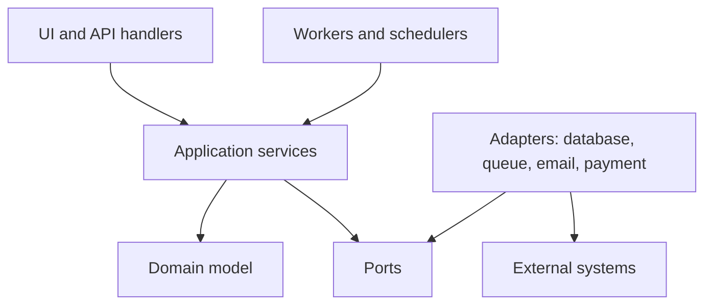

In this shape, application services orchestrate use cases, domain code owns rules, ports describe required capabilities, and adapters implement those capabilities. The domain should not import controllers, ORMs, queue clients, HTTP clients, or framework-specific request objects.

| Layer | Owns | Should depend on | Should not depend on |
|---|---|---|---|
| Domain | Entities, value objects, invariants, policies, state transitions. | Language primitives, domain types. | Database, HTTP, UI, queues, framework lifecycle. |
| Application | Use cases, transactions, orchestration, authorization calls. | Domain, ports. | Concrete infrastructure internals. |
| Interface | Controllers, resolvers, CLI commands, serializers. | Application services, DTOs. | Database tables as API contracts. |
| Infrastructure | Repositories, clients, queue publishers, telemetry, storage. | Ports, external SDKs. | UI decisions or domain shortcuts. |

### Code architecture checklist

- [ ] Domain rules can be tested without starting infrastructure.
- [ ] Public module APIs are smaller than internal implementation.
- [ ] Imports do not bypass module boundaries.
- [ ] Database schema is not the only domain model.
- [ ] Side effects are explicit and injectable.
- [ ] Time, randomness, identity generation, and external calls are controlled at boundaries.
- [ ] Use cases have clear transaction boundaries.
- [ ] Error types distinguish validation, conflict, authorization, dependency failure, and unknown failure.
- [ ] Cross-cutting concerns are centralized without hiding business decisions.

## Modularity

Modularity is the ability to change one part without understanding or redeploying everything. It is not achieved by folders alone. A module needs a purpose, a public contract, private internals, tests around behavior, and dependency rules.

| Module quality | Strong signal | Weak signal |
|---|---|---|
| Cohesion | Module contains a business capability or stable technical abstraction. | Module is a grab bag of helpers. |
| Encapsulation | Consumers import from one public entry point. | Consumers deep-import internal files. |
| Replaceability | Implementation can change behind a contract. | Every caller knows storage details. |
| Testability | Behavior is tested through public API. | Tests assert private structure. |
| Ownership | A team or maintainer can reason about the module end to end. | Ownership is split by technical layer only. |

### Modular design tactics

- Define public entry points and block private imports.
- Keep DTOs at boundaries and domain types inside modules.
- Prefer explicit events or commands over shared mutable objects.
- Separate stable policies from replaceable infrastructure.
- Make dependencies flow inward toward domain policy.
- Use package or workspace boundaries when social pressure makes folder boundaries too weak.
- Add contract tests for modules used by many consumers.

## Boundaries

A boundary is a line that restricts knowledge. Good boundaries are not only about separation. They define who owns decisions.

| Boundary | Good sign | Bad sign |
|---|---|---|
| Module | Clear public API, hidden internals. | Consumers import private internals. |
| Service | Owns data and behavior together. | Other services write its database. |
| Team | Owns a business capability. | Many teams must coordinate for simple changes. |
| API | Stable contract, versioning strategy. | Clients depend on undocumented behavior. |
| Event | Fact in domain language. | Event is a database row dump. |
| Transaction | Invariant protected in one consistency boundary. | Distributed writes are assumed to be atomic. |
| Deployment | Independent release and rollback. | One deploy requires synchronized changes everywhere. |
| Security | Policy enforced where authority exists. | Authorization is left to UI or caller discipline. |

### Boundary design questions

- What language is used on each side of the boundary?
- Which side owns the invariant?
- Which side owns persistence?
- Is the boundary synchronous, asynchronous, or both?
- Can either side evolve without a flag day?
- What is the failure behavior if the other side is unavailable?
- Is the boundary aligned with team ownership?
- Does the boundary reduce coordination or just move it to runtime?

## Domain modeling

Domain modeling turns business concepts into explicit software concepts. The goal is not to mirror every noun in the business. The goal is to capture the rules, decisions, lifecycles, and language that make the system correct.

| Concept | Use when | Example |
|---|---|---|
| Entity | Identity matters across time. | Account, subscription, order, deployment. |
| Value object | Equality is based on value and invariants. | Money, date range, email address, resource limit. |
| Aggregate | A consistency boundary protects related invariants. | Order with line items, account with quota allocation. |
| Domain service | Rule spans multiple entities but is still domain logic. | Pricing eligibility, risk scoring, scheduling policy. |
| Repository | Domain-oriented collection abstraction. | Load account by id, save subscription aggregate. |
| Policy | Named decision rule that can vary. | Upgrade eligibility, retry policy, fraud threshold. |
| Domain event | A fact that happened in domain language. | PaymentCaptured, WorkspaceProvisioned, QuotaExceeded. |

### Modeling heuristics

- Model behaviors before storage tables.
- Name concepts with the language used by domain experts.
- Capture invalid states as impossible where the language permits.
- Put invariants near the data they protect.
- Avoid anemic models when behavior is scattered across services.
- Avoid overactive entities when orchestration belongs in application services.
- Treat reporting shapes and API shapes as projections, not necessarily the core model.
- Create explicit types for money, identifiers, tenant scope, limits, permissions, and lifecycle state.

### Example aggregate boundary

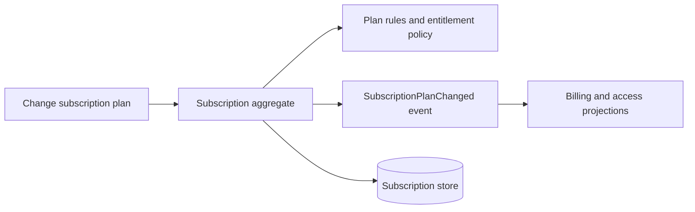

The aggregate owns rules that must be true immediately. Projections can lag if the product can tolerate eventual consistency and repair flows exist.

## State machines

State machines make lifecycle behavior explicit. They are essential for orders, payments, workflows, deployments, jobs, retries, provisioning, entitlement changes, and incident response.

Good state machine design:

- States are named business facts, not UI steps.
- Transitions are explicit and guarded.
- Illegal transitions are rejected.
- Side effects are attached to transitions through reliable mechanisms.
- Retry behavior is defined per transition.
- Terminal states are clear.
- Observability includes state age, transition count, and stuck states.
- Every state has an owner for support and operations.

Example:

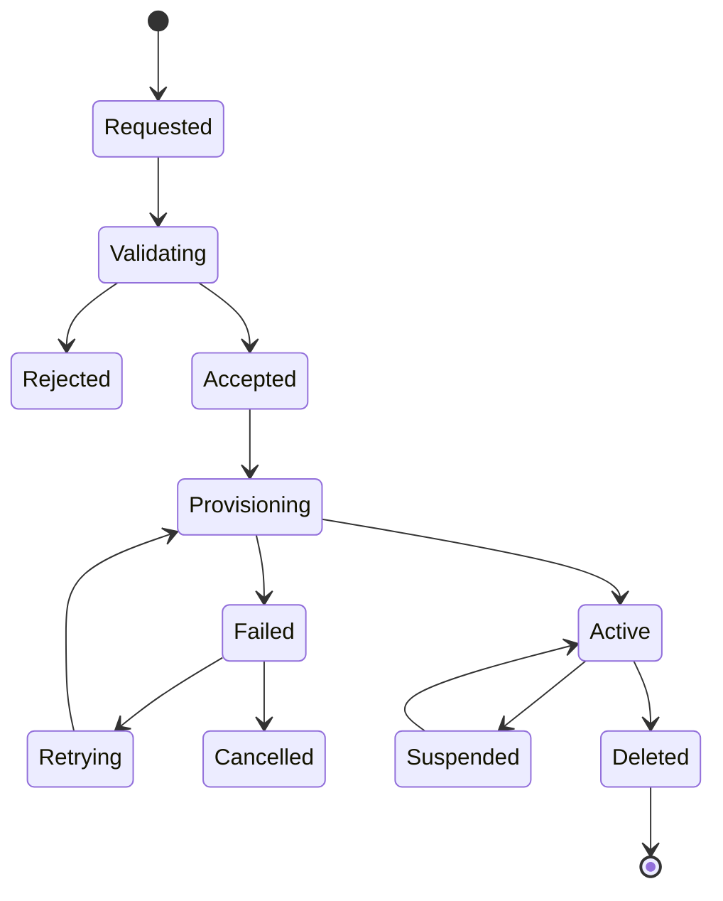

### State machine table

| Transition | Guard | Side effect | Failure handling | Signal |
|---|---|---|---|---|
| Requested to Validating | Request is well formed. | Reserve idempotency key. | Reject duplicate command or return previous result. | Validation started count. |
| Validating to Accepted | Policy passes. | Persist accepted request. | Emit validation failure reason. | Acceptance rate. |
| Accepted to Provisioning | Capacity is available. | Enqueue provisioning job. | Stay accepted and retry scheduling. | Queue age. |
| Provisioning to Active | Required resources exist. | Publish activation event. | Reconcile actual resources against desired state. | Time to active. |
| Provisioning to Failed | Retry budget exhausted or fatal error. | Record reason and notify owner. | Allow explicit retry or cancellation. | Failed by reason. |
| Active to Suspended | Suspension policy applies. | Revoke access or pause workload. | Retry access update with compensation. | Suspended count. |
| Active to Deleted | Deletion authorized. | Start cleanup workflow. | Tombstone and continue cleanup asynchronously. | Deletion lag. |

### State machine checklist

- [ ] All states are documented with meaning and ownership.
- [ ] All transitions are named and guarded.
- [ ] Repeated commands are idempotent.
- [ ] Side effects can be retried safely.
- [ ] Terminal states are not accidentally mutable.
- [ ] Reconciliation can repair drift between desired and actual state.
- [ ] Metrics expose stuck state age and transition failure rates.
- [ ] Support tooling can explain why an object is in its current state.

## Event storming

Event storming is a collaborative modeling technique for discovering domain behavior, boundaries, commands, policies, actors, external systems, and pain points. It is most useful before service boundaries are fixed.

The core object is a domain event: something meaningful that happened in the business.

| Event storming artifact | Meaning | Example |
|---|---|---|
| Domain event | A fact that happened. | InvoicePaid, DeploymentFailed, UserInvited. |
| Command | An intent to change the system. | PayInvoice, StartDeployment, InviteUser. |
| Actor | Person or system initiating a command. | Customer, support agent, scheduler. |
| Policy | Rule that reacts to events or permits commands. | If payment fails, retry after delay. |
| Aggregate | Consistency boundary that handles commands. | Invoice, deployment, workspace. |
| External system | System outside the model boundary. | Payment processor, email provider, identity provider. |
| Read model | Projection optimized for a query. | Invoice dashboard, deployment timeline. |
| Hot spot | Uncertainty, conflict, risk, or missing policy. | Refund rules differ by region. |

### Event storming flow

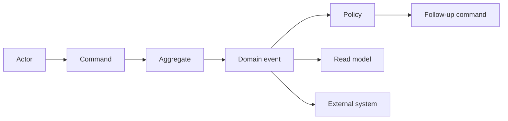

### Event storming checklist

- [ ] Events are named in past tense and domain language.
- [ ] Commands are named as intentions, not transport messages.
- [ ] Policies explain why follow-up work happens.
- [ ] Hot spots are recorded as design risks.
- [ ] Aggregates are discovered from consistency needs, not table names.
- [ ] External systems are marked where authority leaves the system.
- [ ] Read models are separated from write-side invariants.
- [ ] The resulting model informs module and service boundaries.

## C4 thinking

C4 is a way to describe architecture at different zoom levels: context, containers, components, and code. Its value is disciplined perspective, not diagram ceremony.

| Level | Purpose | Audience | Answers |
|---|---|---|---|
| Context | System in its environment. | Product, leadership, security, adjacent teams. | Who uses it? What systems does it interact with? |
| Container | Major deployable or runtime units. | Engineers, operators, platform teams. | What runs where? How do parts communicate? |
| Component | Internal structure of a container. | Engineers owning the code. | What modules collaborate inside this runtime? |
| Code | Classes, functions, packages, schemas. | Implementers and reviewers. | How is behavior represented? |

### Context diagram

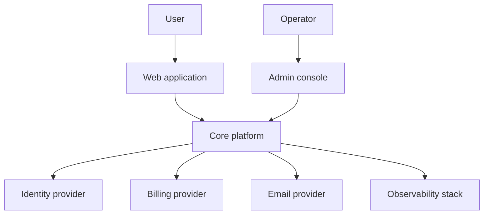

### Container diagram

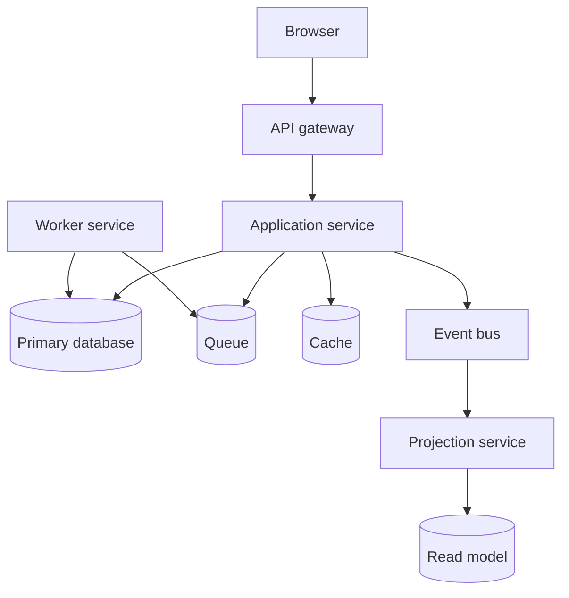

### Component diagram

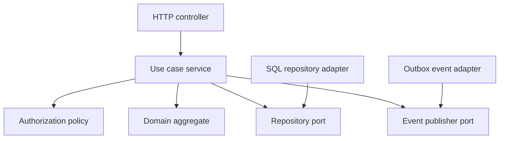

C4 diagrams should be paired with text that explains decisions, not just labels. A useful diagram states boundaries, protocols, ownership, and trust levels.

## Architecture decision records

An ADR records a decision and the reasoning that made it correct at the time. It is not a status report and not a design manifesto. It is a durable explanation for future maintainers.

An ADR should capture:

- Context.
- Decision.
- Alternatives considered.
- Consequences.
- Invariants affected.
- Rollback or migration path.
- Owners.
- Review date.

Use ADRs for choices that alter long-term system properties: database selection, messaging strategy, cache consistency, tenancy model, authorization model, deployment model, API compatibility, service extraction, event schema policy, or build system layout.

### ADR template

```text
# ADR: <decision title>

## Status
Accepted

## Context
What forces, constraints, incidents, product goals, and existing system facts matter?

## Decision
What are we choosing?

## Alternatives considered
What else was plausible, and why did we reject it?

## Consequences
What gets easier, harder, riskier, cheaper, or more expensive?

## Invariants affected
Which correctness rules depend on this decision?

## Migration or rollback
How can we reverse, replace, or phase this decision later?

## Owners and review
Who owns the decision, and when should it be revisited?
```

### ADR quality checklist

- [ ] The decision is concrete enough that reviewers can tell what changed.
- [ ] Alternatives are real options, not strawmen.
- [ ] Consequences include negative tradeoffs.
- [ ] Migration and rollback are addressed honestly.
- [ ] The decision names affected teams and operational owners.
- [ ] The ADR can be understood without private meeting context.
- [ ] The ADR links to diagrams, incidents, benchmarks, or prototypes when relevant.

## Service boundaries

Service boundaries should be drawn around business capabilities, ownership, data authority, and independent change. A service is not just a process. It is a contract, an operational responsibility, a data owner, and a source of failure modes.

### Good service boundary signals

- The service owns a coherent business capability.
- It owns its data and exposes behavior through APIs or events.
- Most changes inside the service do not require changes elsewhere.
- The owning team can deploy, observe, and recover it.
- Calls into the service use domain language.
- Cross-service workflows are explicit and resilient.

### Weak service boundary signals

- The service is a CRUD wrapper around another service's database.
- Multiple services must update in lockstep for common features.
- The service boundary follows technical layers instead of business capability.
- Clients need to know internal tables, states, or retry behavior.
- Operational ownership is unclear.
- The system relies on distributed transactions without designing for them.

### Boundary decision table

| Question | Bias toward same module | Bias toward separate service |
|---|---|---|
| Do changes usually happen together? | Yes. | No. |
| Is one consistency boundary required? | Yes. | No, eventual consistency is acceptable. |
| Does one team own the capability? | Yes. | Separate teams need autonomy. |
| Is latency critical and chatty? | Yes. | No, coarse-grained calls are enough. |
| Are scaling needs different? | No. | Yes, workload shape is independent. |
| Are data security rules different? | No. | Yes, isolation is required. |
| Can the organization operate another service? | No. | Yes, with clear ownership. |

## Monolith, modular monolith, and microservices

The architecture question is not "monolith or microservices." The real question is where to put boundaries so the system can evolve at acceptable cost.

| Style | Description | Best when | Risks |
|---|---|---|---|
| Monolith | One deployable with weak or informal internal boundaries. | Small team, early product discovery, simple operations. | Boundary erosion, slow builds, broad regression risk. |
| Modular monolith | One deployable with strong internal modules and explicit dependency rules. | Domain is still evolving but team needs maintainability. | Requires discipline and tooling to enforce boundaries. |
| Microservices | Multiple independently deployable services with owned data and contracts. | Teams need autonomy, capabilities are mature, operational maturity exists. | Distributed failure, observability burden, data consistency complexity. |

### Migration path

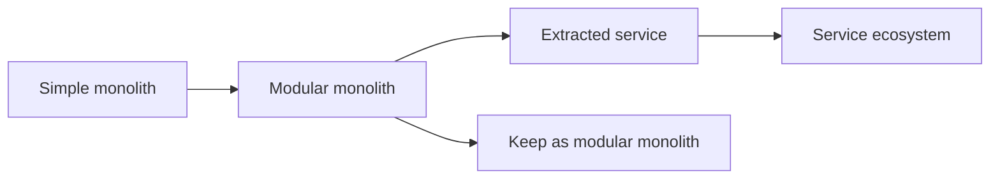

The modular monolith is often the best intermediate architecture because it builds the habits needed for services without forcing network, deployment, and data distribution costs too early.

### Extraction checklist

- [ ] The candidate module already has a clear public API.
- [ ] Its data ownership is clear.
- [ ] Cross-module calls are coarse-grained.
- [ ] The module has contract tests.
- [ ] Operational ownership is assigned.
- [ ] Observability exists before extraction.
- [ ] Failure behavior is designed for network calls.
- [ ] Migration can run old and new paths in parallel.
- [ ] Rollback does not require data loss.

## Conway's Law as architecture input

Conway's Law says system design mirrors communication structure. It is not trivia. It is an architecture constraint.

Implications:

- If one service needs five teams to change it, the architecture encodes five-team coupling.
- If a platform team owns shared infrastructure without product feedback loops, the platform can become a bottleneck.
- If domain boundaries are unclear in the organization, service boundaries become unclear in code.
- If operational ownership is split from development ownership, reliability feedback is delayed.
- If teams are organized by technical layer, the system tends to grow layer-oriented handoffs.

Use Conway's Law deliberately:

- Align service ownership with team ownership.
- Align API boundaries with communication boundaries.
- Create platform abstractions only when product teams can consume them independently.
- Avoid architectures that require coordination patterns the organization cannot execute.
- Treat team topology as a design input, not an afterthought.
- Change organization and architecture together when either one blocks the other.

### Organization and architecture mapping

| Organization shape | Architecture pressure | Common failure | Corrective move |
|---|---|---|---|
| Frontend, backend, database teams | Layered handoffs. | Simple features require many queues. | Form stream-aligned product teams. |
| One platform team for all infrastructure | Centralized platform dependency. | Product teams wait for platform changes. | Provide self-service paved roads. |
| Many autonomous teams, no shared standards | Fragmented services and tools. | High operational variance. | Create lightweight platform contracts. |
| Product teams without operational ownership | Reliability feedback delayed. | Incidents repeat. | Put build-run accountability with owners. |
| Shared service with unclear owner | Everyone depends, nobody improves. | Slow change and brittle integrations. | Assign owner or split capability. |

## Distributed design

Once work crosses process or service boundaries, local assumptions stop being safe. Networks fail, messages duplicate, clocks drift, events arrive late, and partial success becomes normal.

### Distributed systems checklist

- [ ] Every command has an idempotency key or equivalent deduplication.
- [ ] External side effects can be retried without duplicate harm.
- [ ] Timeouts are shorter than user patience and longer than normal latency.
- [ ] Retries use backoff and stop conditions.
- [ ] Queues have dead-letter or parking behavior.
- [ ] Consumers tolerate duplicate, delayed, and out-of-order events.
- [ ] Events have schema versioning and compatibility rules.
- [ ] Sagas or process managers own multi-step workflows.
- [ ] Reconciliation jobs repair drift between systems.
- [ ] Traces correlate work across services.

### Synchronous vs asynchronous communication

| Communication | Use for | Avoid when | Design concerns |
|---|---|---|---|
| Synchronous request | Immediate decisions, user-visible validation, simple reads. | Caller cannot tolerate dependency failure. | Latency, timeout, cascading failure, versioning. |
| Asynchronous command | Work can be queued and retried. | User needs immediate final result. | Idempotency, queue age, retry policy. |
| Domain event | Other components need to react to facts. | Publisher expects a specific receiver action. | Schema evolution, ordering, consumer isolation. |
| Batch or file | Large transfer, reconciliation, legacy integration. | Low-latency interaction. | Completeness, replay, audit, partial processing. |

## Event-driven architecture

Events are facts, not remote procedure calls in disguise. An event-driven design works when producers publish stable domain facts and consumers own their reactions.

Good event names:

- `PaymentCaptured`
- `InvoiceVoided`
- `WorkspaceProvisioned`
- `DeploymentFailed`
- `SubscriptionPlanChanged`

Weak event names:

- `UpdateHappened`
- `DatabaseRowChanged`
- `SendEmailNow`
- `UserServiceCallback`

### Event design checklist

- [ ] Event name is past tense.
- [ ] Payload contains enough information for consumers without leaking internals.
- [ ] Event schema has versioning rules.
- [ ] Publisher does not assume which consumers exist.
- [ ] Consumers are idempotent.
- [ ] Event publishing is tied reliably to state changes, often with [Design Patterns/Outbox Pattern](/compendium/design-patterns/outbox-pattern).
- [ ] Replay behavior is defined.
- [ ] Sensitive fields are minimized and classified.

Related patterns:

- [Design Patterns/CQRS (Command Query Responsibility Segregation)](/compendium/design-patterns/cqrs-command-query-responsibility-segregation)
- [Design Patterns/Event Sourcing](/compendium/design-patterns/event-sourcing)
- [Design Patterns/Outbox Pattern](/compendium/design-patterns/outbox-pattern)
- [Design Patterns/Saga Pattern for Distributed Transactions](/compendium/design-patterns/saga-pattern-for-distributed-transactions)

## Data architecture

Data decisions outlive code decisions. Architecture must distinguish writes, reads, projections, analytics, caches, search indexes, and integration copies.

| Data type | Meaning | Architectural concern |
|---|---|---|
| Authoritative state | Source of truth for a fact. | Ownership, consistency, backups, migrations. |
| Derived state | Recomputable from authoritative state. | Rebuild path, lag, invalidation. |
| Cache | Performance copy. | Expiration, stampede control, correctness boundaries. |
| Projection | Query-optimized view. | Rebuilds, schema drift, lag visibility. |
| Audit log | Evidence of decisions or changes. | Immutability, retention, access controls. |
| Event log | Ordered record of facts. | Replay, versioning, consumer compatibility. |
| Analytics data | Aggregated or denormalized reporting data. | Freshness, privacy, lineage. |

### Data ownership rules

- One component should own writes for a given authoritative fact.
- Other components should read through contracts, projections, or replicated views.
- Shared databases are acceptable only when module boundaries and ownership are still enforced.
- Cross-service joins should be treated as coupling and designed deliberately.
- Derived data must have a rebuild or reconciliation strategy.
- Schema migrations need compatibility windows when multiple versions run at once.

## Architecture fitness functions

A fitness function is an executable or reviewable check that tells whether the architecture still satisfies an intended property. It turns architecture from a slide into a guardrail.

| Fitness function | Protects | Example |
|---|---|---|
| Dependency rule tests | Module boundaries. | Domain cannot import infrastructure. |
| Contract tests | API compatibility. | Consumer expectations run against provider build. |
| Migration tests | Data evolution. | New schema accepts old and new app versions. |
| Latency budgets | User experience and capacity. | P95 checkout API under 300 ms. |
| Resilience tests | Failure containment. | Payment provider timeout does not break browsing. |
| Security policy tests | Authorization model. | Cross-tenant reads are rejected. |
| Cost checks | Runtime economics. | Background workers stay within budget envelope. |
| Observability checks | Operability. | Every workflow emits trace id, state, and result. |
| Ownership checks | Socio-technical fit. | Every service has runbook, owner, SLO, escalation path. |

### Example fitness function diagram

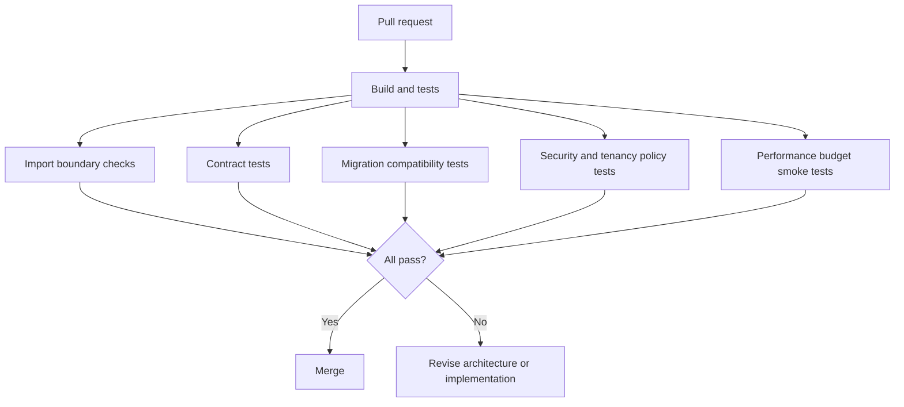

Fitness functions should be cheap enough to run often and strict enough to catch architectural drift before it becomes expensive.

## API architecture

APIs are product and architecture boundaries. They should represent stable capabilities, not expose internal storage.

### API design checklist

- [ ] Resource or command names use domain language.
- [ ] Requests carry idempotency keys for unsafe operations.
- [ ] Errors are stable and actionable.
- [ ] Authorization is enforced server-side.
- [ ] Pagination, filtering, and sorting are explicit.
- [ ] Versioning and deprecation policy are documented.
- [ ] Backward compatibility is tested.
- [ ] Internal fields are not leaked accidentally.
- [ ] Rate limits and abuse controls are part of the contract.
- [ ] Observability links API calls to domain outcomes.

### API compatibility table

| Change | Usually compatible | Usually breaking |
|---|---|---|
| Add optional response field | Yes. | If clients reject unknown fields. |
| Add required request field | No. | Breaks existing clients. |
| Rename enum value | No. | Breaks parsing and behavior. |
| Add enum value | Maybe. | Breaks exhaustive clients. |
| Change error code | No. | Breaks client handling. |
| Add endpoint | Yes. | Rarely breaking. |
| Change field meaning | No. | Worst kind of silent break. |

## Security architecture

Security architecture should be structural. It should not rely on every caller remembering every rule.

Key design points:

- Identity: who is making the request?
- Authentication: how is identity proven?
- Authorization: what is this identity allowed to do?
- Tenancy: what scope limits access?
- Auditability: what decision was made and why?
- Secrets: where credentials live and how they rotate?
- Trust boundaries: where untrusted data enters the system?
- Data classification: what data requires special handling?

### Trust boundary diagram

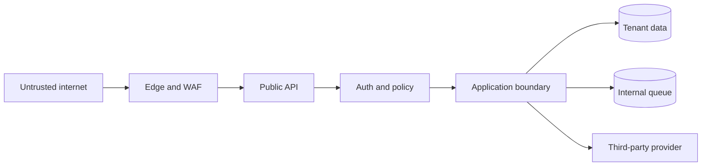

Every arrow crossing a trust boundary needs validation, authentication or authorization, logging, and failure behavior.

## Operational architecture

Architecture includes how the system runs. A design that cannot be observed, deployed, backed up, restored, or debugged is incomplete.

| Operational concern | Architecture question |
|---|---|
| Deployability | Can each part be deployed and rolled back safely? |
| Observability | Can operators see requests, jobs, events, state transitions, and dependency health? |
| Incident response | Is there a runbook for expected failures? |
| Capacity | What saturates first, and how is it detected? |
| Backpressure | What happens when downstream systems slow down? |
| Recovery | Can authoritative data be restored and derived data rebuilt? |
| Drift | Can desired and actual state be compared and reconciled? |
| Support | Can support explain a user's state without database spelunking? |

### Operability checklist

- [ ] Each critical workflow has logs, metrics, and traces.
- [ ] Dashboards show user impact, not only infrastructure health.
- [ ] Alerts map to action and ownership.
- [ ] Runbooks include diagnosis, mitigation, and rollback.
- [ ] Backups are tested with restore drills.
- [ ] Queues expose depth, age, retries, and dead-letter counts.
- [ ] Deployments include health checks and rollback criteria.
- [ ] Feature flags have owners and removal dates.
- [ ] Manual repair paths are audited.

## Architecture examples

### Example: payment flow with outbox and worker

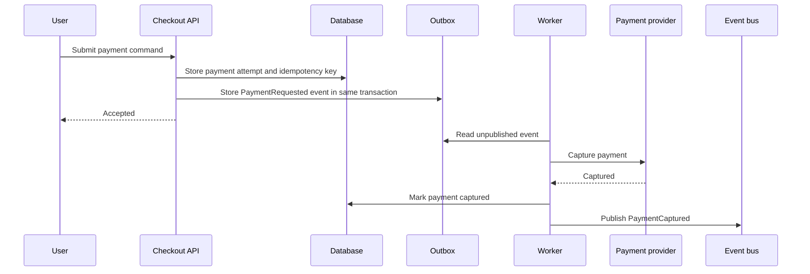

Architectural properties:

- The user request does not depend on every downstream consumer.
- The outbox ties event publication to database state.
- Idempotency protects retries.
- The worker can be monitored and replayed.
- Payment state transitions remain explicit.

### Example: modular monolith with bounded contexts

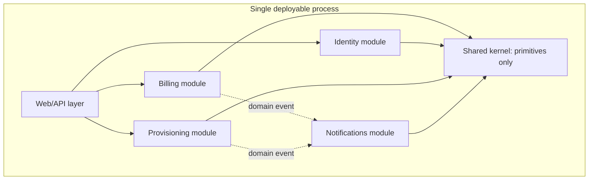

This design keeps deployment simple while still making business boundaries explicit. If a module later becomes a service, the contract and ownership already exist.

### Example: poor boundary

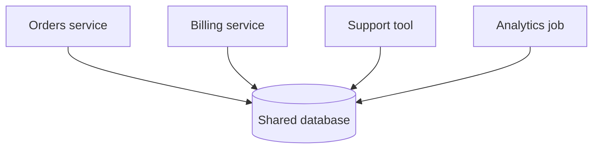

The database becomes the real integration contract. This may be acceptable inside a disciplined modular monolith, but it is dangerous when labeled as independent services because ownership and invariants become unclear.

### Example: better boundary

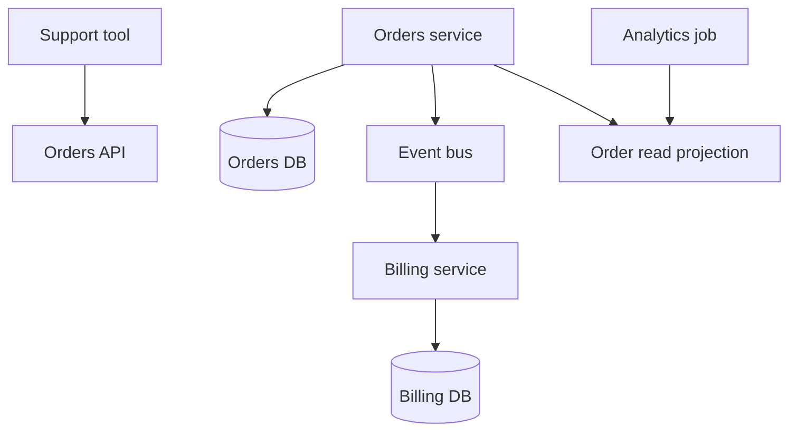

Here each service owns its writes. Other consumers use APIs, events, or projections with explicit contracts.

## Design review questions

### Invariants and domain

- What are the main invariants?
- Which component owns each invariant?
- What invalid states are currently possible?
- Which concepts are domain facts and which are UI or persistence details?
- What state is authoritative and what state is derived?
- What lifecycle needs a state machine?

### Boundaries and dependencies

- What are the boundaries and what does each boundary hide?
- What crosses each boundary: commands, queries, events, files, shared tables?
- Which dependencies point toward stable policy?
- Which dependencies point toward volatile details?
- Where are private internals being imported?
- What happens if the boundary moves later?

### Data and consistency

- Which writes must be atomic?
- Which updates can be eventual?
- How are conflicts detected and resolved?
- How are derived views rebuilt?
- What is the migration strategy for schema and event changes?
- What data must be retained, deleted, encrypted, or audited?

### Failure and operations

- What happens if the same command arrives twice?
- What happens if side effects partially complete?
- What is synchronous and what is asynchronous?
- What is the retry, timeout, and compensation strategy?
- What is the rollback strategy?
- What operational signals prove the design works?
- What manual repair path exists, and is it audited?

### Organization

- Who owns the design after launch?
- Which teams must coordinate to change it?
- Does the architecture match team communication paths?
- Can the organization operate the runtime topology?
- What new skills, runbooks, or support tools are required?

## Architecture smells

| Smell | What it suggests | Possible response |
|---|---|---|
| Every feature touches many modules. | Boundaries do not match change patterns. | Revisit domain boundaries and ownership. |
| Services share a database casually. | Data authority is unclear. | Define write ownership and access contracts. |
| Business rules live in controllers. | Domain logic is coupled to transport. | Move rules into domain or application layer. |
| Events mirror tables. | Events are leaking persistence internals. | Rename events around domain facts. |
| Many small synchronous calls for one page. | Chatty distributed design. | Add coarse APIs or read models. |
| Retries cause duplicate work. | Idempotency is missing. | Add command ids, dedupe, and safe side effects. |
| Teams need meetings for simple changes. | Architecture encodes coordination overhead. | Align modules and services to team ownership. |
| Diagrams disagree with code. | Architecture documentation is stale. | Add fitness functions and update docs in review. |
| Shared utilities contain domain rules. | Hidden coupling through convenience abstractions. | Move rules to owning domain modules. |
| Feature flags never retire. | Temporary architecture became permanent. | Track owners, expiry, and removal work. |

## Architecture review checklist

- [ ] The decision is actually architectural and deserves review.
- [ ] The problem is stated before the solution.
- [ ] Invariants and ownership are explicit.
- [ ] Boundaries map to domain and team realities.
- [ ] Data authority is clear.
- [ ] Dependency direction is intentional.
- [ ] Failure behavior is designed, not assumed.
- [ ] Security and tenancy are structural.
- [ ] Observability proves the design works.
- [ ] Migration and rollback paths are credible.
- [ ] Tradeoffs are documented in an ADR.
- [ ] Fitness functions protect the decision from drift.

## Practical architecture workflow

1. Describe the business capability and the invariant it protects.
2. Identify the current and future sources of volatility.
3. Model the domain with events, commands, policies, and aggregates.
4. Draw the C4 context and container views.
5. Choose module or service boundaries based on ownership and consistency.
6. Define dependency direction and public contracts.
7. Design state machines for lifecycle-heavy concepts.
8. Decide synchronous and asynchronous communication explicitly.
9. Define data ownership, migrations, and rebuild paths.
10. Add observability, runbooks, and fitness functions.
11. Record the decision in an ADR.
12. Review after real usage and incidents.

## Related notes

- [Design Patterns/Design patterns](/compendium/design-patterns/design-patterns)
- [Design Patterns/Microservices Architecture](/compendium/design-patterns/microservices-architecture)
- [Design Patterns/CQRS (Command Query Responsibility Segregation)](/compendium/design-patterns/cqrs-command-query-responsibility-segregation)
- [Design Patterns/Event Sourcing](/compendium/design-patterns/event-sourcing)
- [Design Patterns/Outbox Pattern](/compendium/design-patterns/outbox-pattern)
- [Design Patterns/Saga Pattern for Distributed Transactions](/compendium/design-patterns/saga-pattern-for-distributed-transactions)
- [Design Patterns/Adapter Pattern](/compendium/design-patterns/adapter-pattern)
- [Design Patterns/Facade Pattern](/compendium/design-patterns/facade-pattern)
- [Design Patterns/Repository Pattern](/compendium/design-patterns/repository-pattern)
- [Design Patterns/Dependency Injection (and Inversion of Control)](/compendium/design-patterns/dependency-injection-and-inversion-of-control)
- [Design Patterns/Strategy Pattern](/compendium/design-patterns/strategy-pattern)
- [Design Patterns/Command Pattern](/compendium/design-patterns/command-pattern)
- [13 Technical Leadership and Execution](/compendium/software-engineering/technical-leadership-and-execution)
