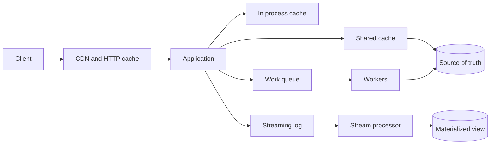
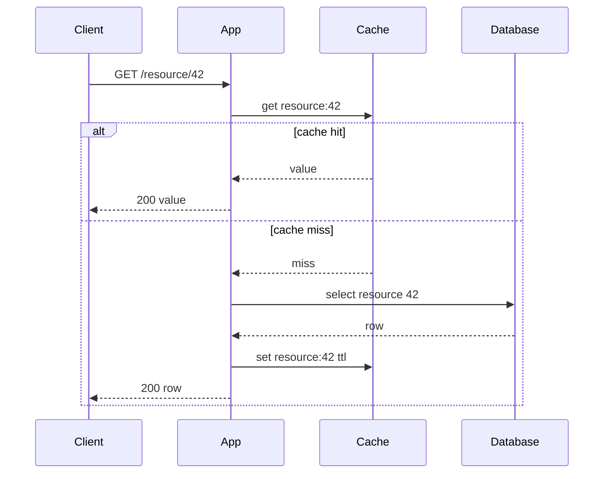
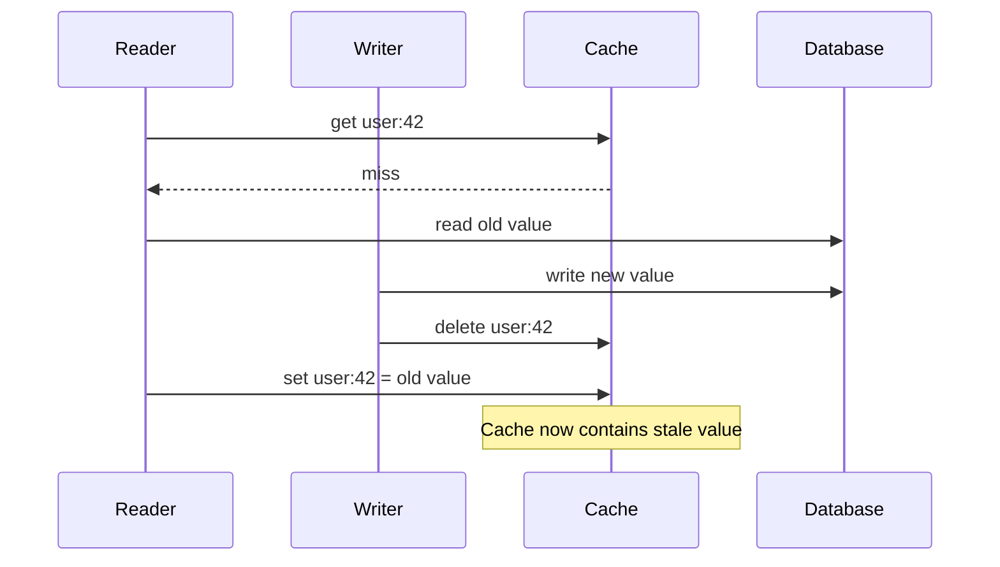
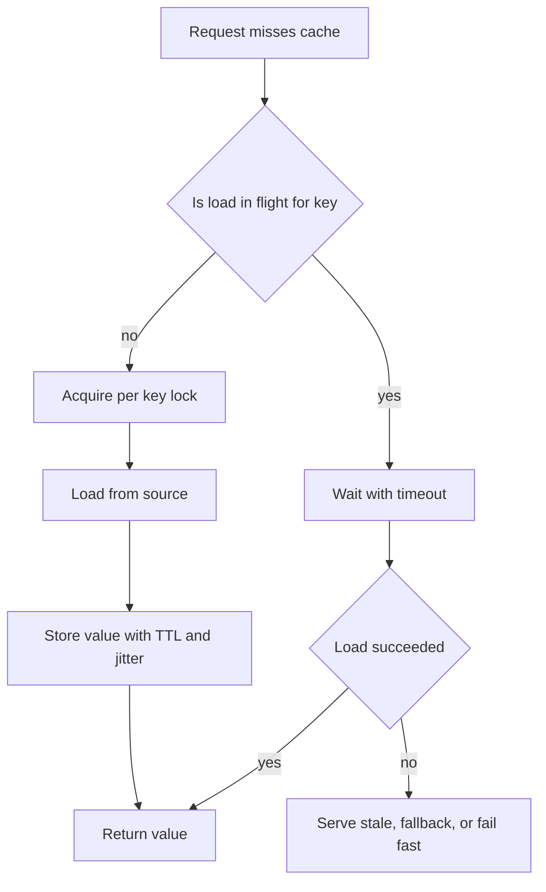
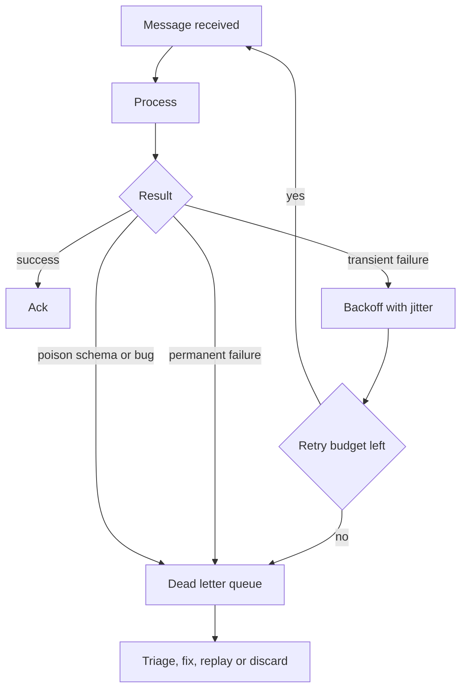
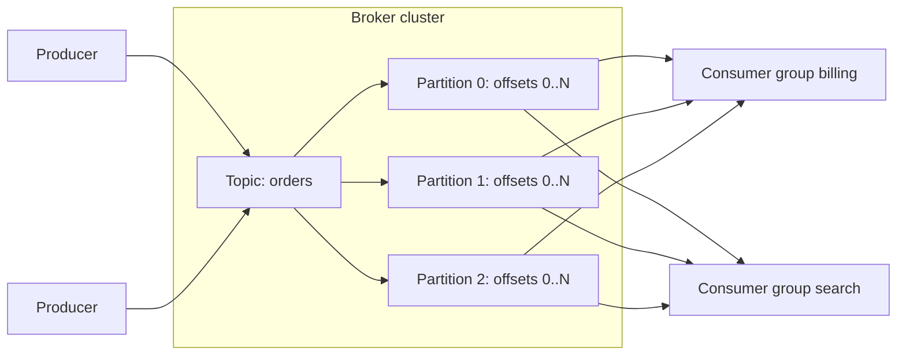
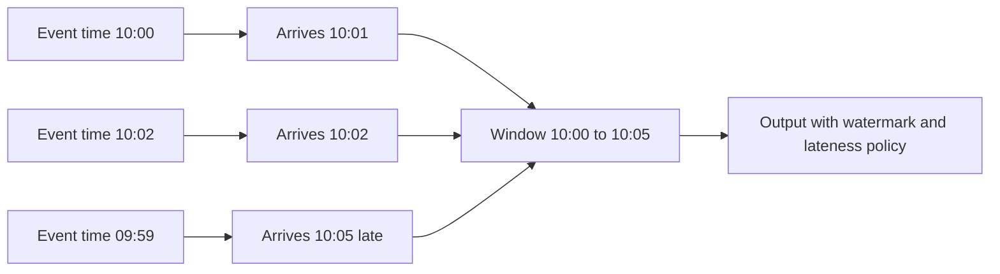

# Caching Queues and Streaming

Caches, queues, and streams are coordination tools. They move work across time, space, and process boundaries. They improve latency, cost, throughput, and resilience, but they also create new correctness questions: what data can be stale, what work can be repeated, what ordering matters, and how failures become visible.

The core engineering discipline is to name the contract explicitly:

- A cache is usually a derived, lossy, and stale copy.
- A queue is a buffer between production and completion of work.
- A stream is an ordered log that can be consumed, replayed, and transformed.
- None of them removes the need for capacity planning, idempotency, observability, or operational runbooks.

## System map



| Tool | Primary purpose | Typical source of bugs | Best default assumption |
|---|---|---|---|
| In process cache | Avoid repeated local computation or remote calls. | Per instance divergence, memory pressure, stale local state. | Disposable and bounded. |
| Shared cache | Reduce database or service load across instances. | Stampedes, hot keys, invalidation loss, accidental authority. | Derived from a durable source. |
| CDN and HTTP cache | Move read traffic near users and browsers. | Leaking personalized data, stale assets, incorrect cache keys. | Public only unless proven private. |
| Queue | Buffer asynchronous work. | Duplicates, poison messages, unbounded lag, hidden retries. | At least once delivery. |
| Streaming log | Persist ordered event history for multiple consumers. | Bad partition keys, offset mistakes, replay side effects, schema drift. | Per partition ordering only. |
| Materialized view | Serve fast reads over derived state. | Missed events, reordering, partial rebuilds, stale projections. | Rebuildable from source events. |

## Caching goals

Use a cache when it improves a measurable bottleneck or protects a constrained dependency. Avoid adding a cache only to hide a slow query or vague performance concern. A cache becomes part of the correctness model as soon as users, APIs, or downstream systems can observe stale data.

| Goal | Good fit | Warning sign |
|---|---|---|
| Lower read latency | Expensive but stable reads, reference data, computed views. | Cached data drives authorization or money movement without freshness controls. |
| Reduce database load | Hot read paths with high fanout. | Cache miss path still overloads the database during bursts. |
| Protect dependency | Rate limited APIs, slow third party calls. | Stale responses are indistinguishable from live success. |
| Absorb traffic spikes | TTL with jitter, refresh ahead, CDN. | Expiry happens at the same second for many keys. |
| Improve availability | Serve stale during outage. | Users can make irreversible decisions on stale state. |
| Reduce cost | Precomputed reports, edge caching, negative caching. | Cost drops while correctness incidents rise. |

## Caching patterns

| Pattern | Read path | Write path | Strength | Main risk | Good use |
|---|---|---|---|---|---|
| Cache aside | App reads cache, loads source on miss, then stores value. | App writes source, then deletes or updates cache. | Simple and explicit. | Stale data, stampede, duplicated load code. | Most application data. |
| Read through | App asks cache, cache loads source on miss. | Cache may delegate or app writes separately. | Centralized loading behavior. | Source coupling hidden inside cache layer. | Platform cache abstraction. |
| Write through | App writes cache, cache synchronously writes source. | Same operation updates both. | Cache and source stay close. | Higher write latency and coupled failure modes. | Small metadata, counters with strict read needs. |
| Write behind | App writes cache, async process writes source later. | Deferred. | Low write latency. | Data loss, reordering, difficult recovery. | Metrics or noncritical buffered writes. |
| Refresh ahead | Cache refreshes before expiry. | Usually unchanged. | Reduces misses for hot keys. | Background load can overload source. | Predictable hot keys. |
| Negative cache | Cache stores absence or failure class. | Delete when object is created or status changes. | Prevents repeated misses. | Hides newly created data. | 404 lookups, permission denials with short TTL. |
| Request coalescing | One miss performs load, waiters share result. | Usually unchanged. | Prevents dogpile on one key. | Waiter pileups if load hangs. | Hot keys with expensive loads. |
| Local plus remote | Process L1 over shared L2. | Invalidate both or version keys. | Very low latency. | L1 inconsistency across instances. | Feature flags, product metadata, templates. |
| Materialized view | Read precomputed table or index. | Updated by stream, trigger, job, or outbox. | Fast queries over complex data. | Projection drift and replay side effects. | Search, feeds, dashboards. |

Related structures:

- [Data Structures/LRU Cache](/compendium/data-structures/lru-cache)
- [Data Structures/Bloom Filters](/compendium/data-structures/bloom-filters)

## Cache aside flow



Cache aside works because the application owns the miss path. The cost is that every caller must respect the same loading, TTL, serialization, invalidation, and error handling rules.

## What can be cached

| Data class | Cacheability | Notes |
|---|---|---|
| Static assets | Excellent. | Use content hashed filenames and long max age. |
| Public catalog data | Good. | Use versioned keys or event invalidation. |
| User profile display data | Moderate. | Stale values may be acceptable for names and avatars. |
| Authorization decisions | Dangerous. | Use short TTL, versioned policy, or avoid caching. |
| Account balances | Dangerous. | Cache display summaries only, never settlement authority. |
| Inventory | Context dependent. | Stale reads may oversell unless reservations exist. |
| Search results | Good if indexed. | Label freshness expectations and rebuild from source. |
| Rate limit counters | Good with careful atomicity. | Must define window and failure mode. |
| Third party API responses | Good with explicit freshness. | Store status, body, expiry, and error classification. |
| Errors | Sometimes. | Negative cache only permanent or rate limited failures, not transient outages. |

## Cache key design

A cache key is part of the data model. Poor key design causes leaks, stale reads, hot keys, and impossible invalidation.

| Concern | Key component | Example |
|---|---|---|
| Entity identity | Type and stable id. | `user:42` |
| Representation | API version, locale, currency, device class. | `product:v3:en-US:USD:123` |
| Authorization scope | Tenant, role, user, policy version. | `tenant:7:policy:v12:user:42:permissions` |
| Query shape | Normalized filters and sort. | `search:v2:qhash:9f12` |
| Deployment safety | Schema version or serialization version. | `feed:v5:user:42` |
| Generation | Global or per object generation token. | `catalog:g19:product:123` |
| Freshness | TTL metadata outside key or time bucket inside key. | `ranking:2026-06-11T13` |

Key rules:

- Include every input that can change the value.
- Do not include high cardinality noise unless it changes the response.
- Avoid raw unbounded user input in keys. Hash normalized query shapes.
- Include tenant boundaries for multi tenant data.
- Include policy or permission versions when caching authorization dependent results.
- Use namespaced prefixes so bulk invalidation and metrics are possible.
- Prefer content hash filenames for immutable assets.
- Keep key length and character set compatible with the cache backend.

## TTL strategy

TTL is a safety valve, not a complete invalidation strategy. It limits maximum staleness only when clocks, writes, and cache set operations behave as expected.

| TTL style | Description | Use when | Risk |
|---|---|---|---|
| Fixed TTL | Entry expires after a constant duration. | Simple data with known freshness needs. | Synchronized expiry and stampedes. |
| Jittered TTL | Add random variation around base TTL. | Many keys created together. | Harder to predict exact expiry. |
| Sliding TTL | Reads extend expiry. | Session like data or hot computed state. | Cold but important data expires. |
| Absolute expiry | Expires at a known wall clock time. | Daily reports, market close snapshots. | Clock skew and synchronized rebuild. |
| Soft TTL plus hard TTL | Serve stale after soft expiry while refreshing in background until hard expiry. | Availability matters more than freshness. | Stale data can persist during repeated refresh failure. |
| No TTL | Entry lives until explicit invalidation. | Immutable content keyed by version. | Lost invalidation can persist forever if data is mutable. |

TTL checklist:

- Define the maximum acceptable stale duration per data class.
- Add jitter for hot or batch loaded keys.
- Keep negative cache TTL shorter than positive cache TTL unless absence is durable.
- Use soft TTL for availability and hard TTL for correctness bounds.
- Track hit rate, miss rate, stale serve count, refresh failures, and source load.
- Document whether the TTL is a business freshness guarantee or only a cache eviction policy.

## Invalidation techniques

| Technique | How it works | Strength | Failure mode |
|---|---|---|---|
| Explicit delete | Delete cache key after source write. | Simple and common. | Delete can fail after write succeeds. |
| Update cache on write | Write new value to cache after source write. | Read after write can be fast. | Race can store older value after newer write. |
| Versioned keys | Change key version when data changes. | Avoids deleting unknown old keys. | Old keys consume memory until expiry. |
| Generational cache | Prefix keys with generation token. | Bulk invalidation is cheap. | Generation lookup becomes a hot dependency. |
| Event based invalidation | Publish change event to cache invalidators. | Scales across services. | Lost, delayed, or reordered events. |
| Write through invalidation | Cache layer updates source and cache together. | Centralized. | Cache becomes availability dependency for writes. |
| Stale while revalidate | Serve stale and refresh asynchronously. | Good user latency. | Stale data can be served during dependency failure. |
| Read repair | Detect stale on read and refresh. | Corrects drift opportunistically. | First reader pays latency and may see stale. |
| Time bucketed keys | Include coarse time bucket in key. | No delete needed. | Overcaches and can return inconsistent buckets. |
| Rebuild from source | Drop cache and rebuild. | Operationally simple. | Can overload source if not throttled. |

## Invalidation race patterns

The common race in cache aside is not "cache is stale"; it is "cache is repopulated with an older value after a write deleted it."



Mitigations:

- Set cache only if the read version is still current.
- Store source version or update timestamp with the value.
- Use compare and set when the cache supports it.
- Delay delete and delete again after a short interval for high risk keys.
- Prefer versioned keys where writers advance the version before readers load.
- Keep TTL short enough that a bad race has a bounded duration.

## Versioned keys and generations

Versioned keys avoid many delete races because old cache entries become unreachable after the reader uses the new version.

```text
product_version:123 -> 17
product:123:v17 -> serialized product
```

Read algorithm:

1. Read current version token.
2. Read value key containing that version.
3. On miss, load source row and its version.
4. Store value under the versioned key only if it matches the source version.

Write algorithm:

1. Write source of truth and increment source version transactionally.
2. Publish invalidation event containing id and version.
3. Optionally warm `product:123:v18`.
4. Let old versioned keys expire naturally.

Tradeoffs:

| Benefit | Cost |
|---|---|
| Avoids stale overwrite races. | Requires reliable version source. |
| Supports concurrent deployments with different serializers. | More keys and memory usage. |
| Makes bulk invalidation easy with generation tokens. | Extra lookup can add latency. |
| Allows replayable invalidation events. | Requires version monotonicity per entity or generation. |

## Consistency models for caches

| Model | Meaning | Example | Engineering requirement |
|---|---|---|---|
| Best effort eventual | Cache may lag source. | Product description. | TTL and invalidation metrics. |
| Bounded stale | Cache is at most N seconds old under normal operation. | Search result counts. | TTL, clock discipline, refresh SLO. |
| Read your writes | A writer sees its own update immediately. | User edits display name. | Bypass cache, update cache, session version, or monotonic reads. |
| Monotonic reads | User does not go backward to older versions. | Order status page. | Track last seen version and reject older cached values. |
| Strong read | Read reflects committed source state. | Payment authorization. | Read source or use a strongly consistent derived store. |
| Authoritative cache | Cache is the source for some operation. | Rate limit token bucket in Redis. | Durability, replication, atomic operations, fallback policy. |

Questions before caching:

- Can stale data violate an invariant?
- Does the user need read your writes?
- Is the cache authoritative or derived?
- What happens if invalidation is lost?
- What is the maximum acceptable staleness?
- Can cache rebuild overload the source?
- What is the user visible behavior when cache and source disagree?
- What observability proves the cache is helping rather than hiding failure?

## Cache stampede and dogpile prevention

A cache stampede happens when many callers miss or expire the same key and all rebuild it at once. A dogpile is the same failure pattern at the application level: waiters accumulate behind a hot expensive operation.

| Technique | How it helps | Risk |
|---|---|---|
| Request coalescing | One in flight load per key; other callers await it. | All waiters fail if the single load fails. |
| Single flight lock | Distributed lock around rebuild. | Lock service can become a dependency. |
| Stale while revalidate | Serve stale value while one actor refreshes. | Users may see stale data longer. |
| Probabilistic early refresh | Some callers refresh before expiry based on age. | More background work. |
| TTL jitter | Spreads expiry across time. | Does not protect one extremely hot key. |
| Hot key replication | Shard or replicate hot cache entries. | Invalidating replicas is harder. |
| Rate limit misses | Protects source when cache fails. | Users may get degraded responses. |
| Prewarming | Load expected hot keys before traffic arrives. | Can waste work and mask missing capacity. |
| Circuit breaker | Stop hitting source when it is failing. | Requires useful stale or fallback behavior. |

Example single flight behavior:



Stampede checklist:

- Add TTL jitter to every hot key class.
- Bound concurrent cache misses per key and globally.
- Time out lock acquisition and source loading.
- Serve stale values only where stale behavior is acceptable.
- Instrument miss amplification: database queries per cache miss should not explode.
- Add an emergency switch to bypass, disable, or degrade cache behavior.
- Load test cold cache and partial cache loss, not only warm steady state.

## Cache failure scenarios

| Scenario | Symptom | Root cause | Response |
|---|---|---|---|
| Lost invalidation | One object remains stale for hours. | Delete event failed or consumer lagged. | Version keys, replay invalidations, add stale age alarms. |
| Full cache eviction | Database CPU spikes, latency rises. | Memory limit, eviction policy, hot key churn. | Throttle rebuilds, increase capacity, reduce key cardinality. |
| Hot key | One cache node saturated. | Celebrity object, global config, common query. | Replicate key, local L1, shard key, refresh ahead. |
| Negative cache hides create | New object returns 404. | Absence cached too long. | Short negative TTL, delete on create, version namespace. |
| Personalized data leak | User sees another user's data. | Missing user, tenant, or auth dimension in key. | Purge, rotate keys, fix key design, audit logs. |
| Stale authorization | Revoked user still has access. | Permission decision cached longer than revocation window. | Short TTL, policy version key, source check on sensitive action. |
| Cache dependency outage | Writes or reads fail despite healthy database. | Cache treated as required. | Define fail open or fail closed per data class. |
| Serializer rollout break | New code cannot read old cache entries. | Unversioned value format. | Version serializers, dual read, delete incompatible keys. |

## CDN and HTTP caching

HTTP caching is a protocol contract among origin, shared caches, private browser caches, and clients. It is safest when responses are either public immutable assets or carefully scoped private responses.

| Header | Meaning | Common use |
|---|---|---|
| `Cache-Control: public` | Shared caches may store the response. | Static assets, public pages. |
| `Cache-Control: private` | Browser may store, shared caches should not. | User specific pages. |
| `Cache-Control: no-store` | Do not store at all. | Secrets, account pages, sensitive API responses. |
| `Cache-Control: no-cache` | May store but must revalidate before reuse. | Data that can be stored but must be checked. |
| `max-age=N` | Browser freshness lifetime in seconds. | Public assets or private responses. |
| `s-maxage=N` | Shared cache freshness lifetime. | CDN specific public content. |
| `stale-while-revalidate=N` | Serve stale while asynchronously revalidating. | Public content where freshness can lag. |
| `stale-if-error=N` | Serve stale when origin errors. | Resilience for public or safe content. |
| `ETag` | Entity validator for conditional requests. | Dynamic pages, API responses. |
| `Last-Modified` | Timestamp validator. | Files and generated content. |
| `Vary` | Additional request headers that define cache key. | Encoding, language, authorization sensitive variants. |

Recommended defaults:

| Response type | Cache-Control | Notes |
|---|---|---|
| Fingerprinted asset | `public, max-age=31536000, immutable` | Filename changes when content changes. |
| Public HTML | `public, s-maxage=60, stale-while-revalidate=300` | Tune by freshness need. |
| Authenticated HTML | `private, no-cache` or `no-store` | Use `no-store` for sensitive content. |
| Sensitive API response | `no-store` | Avoid browser disk cache and shared caches. |
| Public API reference data | `public, max-age=60, s-maxage=300` | Include validators. |
| User specific API response | `private, max-age=0, no-cache` | Revalidate before reuse. |

CDN cache key dimensions:

- Scheme, host, path, and selected query parameters.
- `Accept-Encoding` for compressed variants.
- Locale if the response changes by language.
- Device class only if markup or image differs.
- Authorization state only when the CDN supports safe private or token aware caching.
- Never include arbitrary tracking parameters unless they change the content.

HTTP caching failure scenarios:

| Failure | Example | Prevention |
|---|---|---|
| Shared cache stores private data | `public` on account response. | Default authenticated responses to `private` or `no-store`. |
| Query parameter explosion | CDN caches every `utm_*` variant. | Normalize cache key and ignore tracking parameters. |
| Stale deploy asset | HTML references old or new asset inconsistently. | Fingerprinted assets plus conservative HTML TTL. |
| Wrong language | Missing `Vary: Accept-Language` or locale key. | Include language in route or cache key. |
| Authorization leak | CDN key ignores cookie or token. | Do not cache authenticated responses in shared caches without explicit design. |
| Origin overload on purge | Global purge causes cold cache everywhere. | Use soft purge, prewarm, and staggered rebuilds. |

CDN checklist:

- Classify every route as public, private, or no store.
- Use immutable content hashed asset URLs.
- Keep HTML TTL shorter than asset TTL.
- Normalize query parameters.
- Add `Vary` only when necessary because it multiplies cache entries.
- Test authenticated and anonymous cache behavior separately.
- Verify purge, soft purge, and rollback behavior before relying on CDN caching.

## Queueing fundamentals

Queues smooth bursts and decouple producers from consumers. They do not remove work. If producers create work faster than consumers finish it, the queue becomes an accumulating latency account.

Use <span className="compendium-external-reference" title="Vault-only reference">Littles law and efficient queue strategy</span>:

```text
L = lambda * W
```

- `L`: average work in system, such as queued plus in progress messages.
- `lambda`: average arrival rate.
- `W`: average time in system.

If `lambda` is 200 messages per second and average time in system is 5 seconds, then average work in system is 1000 messages. If consumers can only finish 150 messages per second while producers keep sending 200, backlog grows by 50 messages per second.

| Signal | Interpretation | Action |
|---|---|---|
| Queue depth rising, throughput flat | Arrival rate exceeds service rate. | Add consumers, reduce producers, optimize processing, shed load. |
| Queue depth stable, age rising | Old messages are stuck or partitioned badly. | Inspect oldest message age and partition distribution. |
| Retries rising | Dependency, code, or data quality problem. | Classify errors and stop retrying permanent failures. |
| Consumer CPU low, lag high | External dependency or lock contention. | Measure downstream latency and concurrency limits. |
| Consumer CPU high, lag high | Compute bound processing. | Scale out, optimize, batch, or reduce work. |
| DLQ rising | Permanent failures or bad deploy. | Triage samples, fix cause, replay safely. |

## Queue design questions

- What is the unit of work?
- Is the message a command to do something or an event that something happened?
- Who owns retries: producer, broker, or consumer?
- What is the maximum acceptable message age?
- Is duplicate processing acceptable if effects are idempotent?
- Which operation acknowledges completion?
- Can consumers process messages out of order?
- How is backpressure communicated to producers?
- What happens when downstream dependencies fail for 5 minutes, 1 hour, or 1 day?
- Can the queue be drained, paused, replayed, and inspected safely?

## Queue topology patterns

| Pattern | Shape | Use | Risk |
|---|---|---|---|
| Work queue | Many producers, many competing consumers. | Background jobs, email sending, image processing. | Ordering usually not guaranteed. |
| Priority queue | Separate lanes or priority field. | Urgent jobs over bulk work. | Starvation of low priority work. |
| Delay queue | Message becomes visible after delay. | Retry backoff, scheduled work. | Clock and visibility complexity. |
| Fanout | One event copied to many queues. | Independent subscribers. | Duplicate storage and inconsistent subscriber lag. |
| Request reply | Producer waits for response message. | Async RPC. | Hidden coupling and timeout ambiguity. |
| Outbox relay | Database transaction writes an outbox row, relay publishes later. | Reliable event publication. | Relay lag and duplicate publish. |
| Saga orchestration | Queue commands coordinate distributed steps. | Long running business workflow. | Compensation complexity. |

Related patterns:

- [Design Patterns/Outbox Pattern](/compendium/design-patterns/outbox-pattern)
- [Design Patterns/Saga Pattern for Distributed Transactions](/compendium/design-patterns/saga-pattern-for-distributed-transactions)
- <span className="compendium-external-reference" title="Vault-only reference">Event-Driven Architectures and Event Sourcing</span>

## Delivery semantics

| Semantics | Meaning | Reality | Required consumer behavior |
|---|---|---|---|
| At most once | Message may be lost, never duplicated. | Usually ack before processing or no retry. | Accept loss. |
| At least once | Message is retried until acknowledged or exhausted. | Duplicates are normal. | Idempotency and dedupe. |
| Exactly once | Appears once at a scoped boundary. | Usually limited to broker transactions or one sink. | Understand the exact boundary. |
| Effectively once | User visible effect occurs once. | Practical target for most systems. | Idempotent writes, unique keys, deterministic effects. |

Exactly once is not a magic property of an entire distributed workflow. It usually means a specific broker, producer, processor, and sink combination can avoid duplicate records within a defined transaction boundary. As soon as a consumer calls an external API, sends email, charges a card, or writes to a nontransactional dependency, the design must handle duplicate attempts.

## Idempotency and dedupe

Idempotency means repeating the same request has the same intended effect. Dedupe means detecting that the system has seen a message before. They are related but not identical.

| Technique | Example | Strength | Limitation |
|---|---|---|---|
| Idempotency key | `payment_attempt:abc123` | Prevents duplicate effects at sink. | Requires stable key and retention. |
| Unique constraint | `order_id` unique in shipments table. | Strong and simple. | Only protects one database boundary. |
| Processed message table | Store message id before or with effect. | Clear audit trail. | Table growth and transaction coupling. |
| Natural idempotency | `set status = shipped` | Simple. | Not all operations are naturally idempotent. |
| Compare and set | Update only from expected state. | Prevents invalid transitions. | Requires state machine discipline. |
| Commutative operation | Increment CRDT or max version. | Replay tolerant. | Harder to reason about user effects. |
| Time bounded dedupe | Keep message ids for N days. | Controls storage. | Duplicates after retention can apply. |

Consumer transaction pattern:

```text
begin transaction
  insert processed_message(message_id) values (...)
  apply business effect
commit
ack message
```

If the process crashes after commit but before ack, the broker redelivers. The next attempt hits the unique processed message id and safely acks without repeating the effect.

## Acknowledgement timing

| Ack timing | Outcome on crash | Use when |
|---|---|---|
| Ack before processing | Message can be lost. | Low value telemetry or best effort work. |
| Ack after processing | Message can duplicate. | Most important background jobs. |
| Ack after durable handoff | Original message is safe once work is persisted elsewhere. | Multi stage pipelines. |
| Transactional ack with sink | Offset or ack commits with output write. | Stream processors and brokers that support it. |

Rule of thumb: ack only after the system has durably reached a state where repeating or continuing the work is safe.

## Retries, backoff, and DLQs

Retry rules:

- Classify errors as transient, permanent, rate limited, dependency failure, schema error, or bug.
- Use exponential backoff with jitter.
- Set retry budgets by message type.
- Use dead letter queues for exhausted or permanent failures.
- Build DLQ triage dashboards and alerts.
- Keep payloads inspectable without exposing secrets.
- Make replay idempotent.
- Avoid infinite retries that hide production failures.



| Error type | Example | Retry? | Action |
|---|---|---|---|
| Transient dependency | HTTP 503 from downstream. | Yes, with backoff. | Retry and alert if sustained. |
| Rate limited | HTTP 429. | Yes, respecting retry after. | Slow producers or consumers. |
| Permanent validation | Invalid email address. | No. | DLQ or mark failed. |
| Poison payload | Cannot deserialize required field. | No until code or data fixed. | DLQ with schema diagnostics. |
| Consumer bug | Null pointer on valid message. | No blind infinite retry. | Stop rollout, DLQ or pause, fix code. |
| Timeout ambiguity | Payment provider timed out. | Maybe. | Query provider by idempotency key before retrying. |

DLQ checklist:

- Store original payload, headers, message id, trace id, error class, error text, attempt count, and first failure time.
- Redact secrets before messages enter operator tooling.
- Separate DLQs by message type or service owner.
- Alert on rate and age, not only total count.
- Provide replay tooling with dry run, sampling, rate limits, and idempotency checks.
- Define discard criteria and audit requirements.
- Track whether replay preserves original ordering or intentionally breaks it.

## Poison messages

A poison message is a message that repeatedly fails in a way that ordinary retry cannot fix. It can be bad data, an unsupported schema, an impossible state transition, or a bug triggered by a rare valid input.

Failure pattern:

1. Consumer reads poison message.
2. Processing fails.
3. Broker redelivers.
4. Consumer capacity is spent on the same message.
5. Healthy messages behind it are delayed or blocked.

Mitigations:

- Limit attempts.
- Move exhausted messages to DLQ.
- Use parking lot queues for messages that need manual resolution.
- Validate producer payloads before publish.
- Version schemas and keep backward compatible readers.
- Add circuit breakers for failure classes with high repetition.
- Avoid strict FIFO queues when one bad message can block unrelated work.

## Backpressure

Backpressure is how a system tells upstream producers to slow down before queues, memory, or downstream dependencies collapse.

| Layer | Backpressure signal | Producer response |
|---|---|---|
| API | 429, 503, retry after, lower rate limit. | Slow down, retry later, shed optional work. |
| Queue | Depth, oldest age, publish latency. | Stop accepting low priority jobs, sample, batch. |
| Consumer | Concurrency limit, worker saturation. | Scale or reduce intake. |
| Database | Connection pool exhaustion, lock wait, CPU. | Reduce consumer concurrency and batch writes. |
| Stream | Consumer lag, processing time, watermark delay. | Add partitions, scale consumers, drop optional enrichment. |
| Client | Flow control window, TCP backpressure. | Respect writes returning not ready. |

Backpressure strategies:

- Use bounded queues where possible.
- Put explicit limits on producer rate, consumer concurrency, batch size, and in flight messages.
- Return clear overload responses instead of accepting work that cannot finish within SLO.
- Prioritize critical work over bulk work with separate queues.
- Shed optional work before core work.
- Autoscale on oldest message age or lag, not only CPU.
- Protect downstream dependencies with bulkheads and circuit breakers.

## Queue failure scenarios

| Scenario | Symptom | Root cause | Response |
|---|---|---|---|
| Backlog grows without bound | Oldest message age increases. | Arrival rate exceeds service rate. | Scale, throttle, shed, optimize, or pause producers. |
| Duplicated side effects | User gets two emails or charges. | At least once delivery without idempotency. | Add idempotency key at effect boundary. |
| Messages stuck invisible | Depth low but work missing. | Consumer crashed during visibility timeout or lock. | Tune timeout, heartbeat, inspect in flight count. |
| Retry storm | Downstream outage gets worse. | Many consumers retry immediately. | Exponential backoff, jitter, circuit breaker. |
| DLQ flood | Many messages fail permanently. | Bad deploy, schema change, producer bug. | Stop producer or consumer, sample DLQ, fix, replay. |
| Priority starvation | Low priority jobs never run. | Strict priority with constant high priority load. | Reserve capacity per lane. |
| Reordering breaks workflow | Cancel processed before create. | Parallel consumers without key ordering. | Partition by entity or enforce state machine. |
| Queue hides outage | API returns success but work never completes. | Async acceptance not tied to completion SLO. | Expose job status, age alerts, and failure callbacks. |

## Streaming systems

Streaming differs from queueing because the log remains and consumers track their position. A queue usually means "work to be completed"; a stream means "facts or records appended over time."

Concepts:

- Topic: named stream of records.
- Partition: ordered shard of a topic.
- Offset: position of a record within a partition.
- Consumer group: set of consumers sharing partitions.
- Rebalance: reassignment of partitions across consumers.
- Compaction: retention by latest value per key.
- Retention: time or size window for keeping records.
- Event time: when the event happened in the domain.
- Processing time: when the processor observed the event.
- Watermark: processor estimate that event time has advanced past a point.
- Window: bounded grouping by time or count.
- Late event: event arriving after its window was considered complete.
- State store: durable local or remote state used by processing.

## Kafka mental model

Kafka is a partitioned, replicated, append only log. Producers append records to topic partitions. Brokers store records. Consumers read partitions and commit offsets. Kafka does not process messages for consumers; it stores ordered records and tracks enough metadata for consumers to resume.



Kafka rules of thumb:

- Ordering is per partition, not global.
- Keys route records to partitions.
- The same key should map to the same partition if per key ordering matters.
- Offsets identify record position inside one partition.
- Consumers commit offsets to mark progress.
- Consumer lag is the distance between produced offsets and committed or consumed offsets.
- Retention is independent of whether one consumer has read a record.
- Compaction retains the latest value per key, plus tombstones for deletes during their retention window.
- Transactions can coordinate producer writes and consumer offsets within Kafka semantics.
- More partitions increase parallelism but also increase overhead and rebalance cost.

## Partitions and ordering

| Requirement | Partition key choice | Consequence |
|---|---|---|
| Preserve order per user | `user_id` | All events for one user are sequential, hot users can create hot partitions. |
| Preserve order per order | `order_id` | Good for order state machines. |
| Maximize throughput | Random key or no key | Better distribution, weak ordering. |
| Join related streams | Same key and partitioning strategy. | Enables local joins. |
| Avoid tenant interference | Tenant plus entity key or isolated topics. | More operational complexity. |

Ordering pitfalls:

- Global ordering across partitions is not available.
- Increasing partition count can change key to partition mapping unless a stable partitioner is used.
- Rebalances can pause consumption and cause duplicate processing after restart.
- Retrying a failed record out of band can break per key order.
- DLQ and replay can break original order unless replay is partition aware.
- Producer retries can reorder records unless idempotent producer settings and sequence handling are correct.

## Offsets and commits

Offset management defines the recovery contract.

| Commit strategy | Crash after processing before commit | Crash after commit before processing | Use |
|---|---|---|---|
| Auto commit while polling | Possible duplicates or loss depending timing. | Possible loss. | Low value consumers. |
| Manual commit after processing | Duplicate processing. | Avoids loss from commit first. | Most consumers with idempotency. |
| Commit per batch | Duplicates entire uncommitted batch. | Better throughput. | Batch processors. |
| Transactional consume process produce | Offsets and output records commit together. | Scoped exactly once in Kafka. | Kafka to Kafka pipelines. |
| External offset store with sink | Sink write and offset stored together. | Strong recovery for that sink. | Databases that store source offset. |

Consumer loop checklist:

- Poll records.
- Process with bounded concurrency.
- Commit only offsets whose records and prior records in that partition are safe.
- Pause partitions that are failing rather than blocking all partitions.
- On rebalance, stop accepting new work, finish or cancel in flight work, then commit safe offsets.
- Make processing idempotent because redelivery still happens.

## Rebalances

A rebalance assigns partitions to consumers in a group. It happens when consumers join, leave, crash, exceed poll intervals, or topic partition counts change.

Rebalance risks:

- Duplicate processing when ownership changes after records were processed but not committed.
- Long pauses when consumers take too long to revoke partitions.
- State store restoration delay for stateful processors.
- Hot partitions that cannot be split across consumers in the same group.
- Offset commits from a consumer that no longer owns the partition.

Mitigations:

- Keep processing time below poll and session timeout expectations.
- Use cooperative rebalancing where supported.
- Bound per record and per batch processing time.
- Commit offsets on partition revoke only for completed records.
- Keep state stores changelogged and restore tested.
- Avoid using consumer group scale as the only answer to hot key problems.

## Stream processing correctness

Stream processing correctness is about producing the right derived state despite retries, duplicates, reordering, late events, schema changes, and processor restarts.

| Concern | Failure | Mitigation |
|---|---|---|
| Duplicates | Count or charge applied twice. | Idempotent event ids, dedupe state, transactional sinks. |
| Reordering | State moves backward. | Per key partitioning, sequence numbers, compare and set. |
| Late events | Window result misses valid event. | Watermarks, allowed lateness, correction events. |
| Lost events | Projection permanently wrong. | Durable log, offset monitoring, replay plan. |
| Schema drift | Consumer cannot decode event. | Schema registry, compatible evolution, DLQ. |
| Stateful restart | Aggregates reset or diverge. | Durable state store and changelog replay. |
| Side effects | Replay sends emails again. | Separate pure projection from effectful actions. |
| Time ambiguity | Event time and processing time disagree. | Choose time semantics per output. |

Correctness checklist:

- Define whether outputs are final, provisional, or correctable.
- Choose event time or processing time explicitly.
- Include stable event ids.
- Include entity version or sequence when order matters.
- Make stream processors replay safe from offset zero.
- Separate deterministic state updates from external side effects.
- Store source topic, partition, and offset in materialized sinks for audit and rebuild.
- Monitor lag, watermark delay, late event counts, deserialization failures, and state restore time.
- Test restart, rebalance, duplicate, late event, and replay scenarios.

## Event time, processing time, and watermarks

Event time is when the domain event happened. Processing time is when the system processed it. In distributed systems, event time can arrive out of order because clients, networks, queues, and retries add variable delay.



Watermark policy answers: "How long will we wait for older event time data before closing or emitting a window?"

| Policy | Behavior | Tradeoff |
|---|---|---|
| Strict processing time | Window closes by wall clock. | Low latency, poor event time correctness. |
| Event time with short allowed lateness | Wait briefly for late events. | Balanced latency and correctness. |
| Event time with long allowed lateness | More complete windows. | Higher latency and larger state. |
| Emit corrections | Publish updates when late data changes result. | Downstream must handle revisions. |
| Drop late events | Ignore after watermark. | Simple, but data loss must be acceptable. |

Window correctness questions:

- Is the first emitted result final or provisional?
- Can downstream systems handle corrections?
- How long can state be retained for late events?
- Are timestamps assigned by trusted servers or untrusted clients?
- What happens when a producer clock is wrong?
- Does a backfill use original event time or backfill processing time?

## Stream processing patterns

| Pattern | Description | Example | Risk |
|---|---|---|---|
| Stateless transform | Map input record to output record. | Normalize event schema. | Usually simple, but schema errors still matter. |
| Filter | Drop records that do not match criteria. | Keep paid orders only. | Dropped records may be needed later. |
| Enrichment | Add data from another source. | Add customer tier to order. | Enrichment source freshness and availability. |
| Aggregation | Maintain counts, sums, windows. | Sales per hour. | Duplicates and late events distort results. |
| Join | Combine streams or stream plus table. | Order plus payment. | Time alignment and partitioning complexity. |
| Materialized view | Persist current derived state. | Latest order status. | Replay safety and sink idempotency. |
| Compacted changelog | Latest value per key retained. | User profile updates. | Delete tombstone retention and old consumers. |
| Outbox to stream | Publish database changes reliably. | Domain events from orders table. | Duplicate publishes and relay lag. |

## Streaming log failure scenarios

| Scenario | Symptom | Root cause | Response |
|---|---|---|---|
| Consumer lag grows | Derived views stale. | Slow processing, dependency latency, hot partition. | Scale, optimize, repartition, reduce enrichment calls. |
| One partition hot | One consumer busy while others idle. | Skewed key distribution. | Change key, split hot entity, special case heavy key. |
| Replay sends duplicate emails | Backfill replays effectful processor. | Side effects tied to stream replay. | Separate projection from effects and use idempotency. |
| Offset committed too early | Missing records after crash. | Commit before durable effect. | Commit after sink write or use transaction. |
| Offset committed too late | Duplicates after restart. | Processed records not committed. | Idempotency and regular commits. |
| Schema break | Consumer crashes on new field or missing field. | Incompatible producer change. | Compatibility checks, schema registry, tolerant readers. |
| Late event changes aggregate | Dashboard total changes after window close. | Event time delay. | Corrections, allowed lateness, or documented finalization time. |
| Tombstone lost | Deleted key reappears in compacted topic restore. | Delete retention too short for offline consumer. | Size retention for maximum downtime or full snapshots. |
| Rebalance storm | Consumers constantly pause. | Poll timeout, unstable instances, long processing. | Tune timeouts, reduce processing batch, cooperative rebalance. |

## Queues versus streams

| Dimension | Queue | Stream |
|---|---|---|
| Primary model | Work items waiting for completion. | Append only history of records. |
| Retention | Often removed after ack or visibility completion. | Retained by time, size, or compaction. |
| Consumer position | Broker tracks delivery or visibility. | Consumer group commits offsets. |
| Multiple consumers | Fanout usually requires multiple queues or subscriptions. | Multiple consumer groups read independently. |
| Replay | Often limited or operationally awkward. | Core capability while records remain. |
| Ordering | Depends on queue type and group. | Guaranteed within partition. |
| Scaling | Add workers, sometimes with weaker ordering. | Add partitions and consumers up to partition count. |
| Best for | Jobs, commands, async tasks. | Events, analytics, projections, CDC. |

Use a queue when the message represents work that should be done. Use a stream when the record represents a fact that multiple consumers may need at different times.

## End to end examples

### Cached product catalog

Design:

- Database is source of truth.
- Product reads use cache aside.
- Keys include product id, serializer version, locale, currency, and product version.
- Writes increment product version transactionally.
- Invalidation event warms the new key.
- CDN caches public product pages for a short `s-maxage` and serves stale on origin error.

Failure handling:

- If invalidation is lost, versioned keys still prevent new readers from using the old product after they see the new version.
- If cache is cold after deploy, request coalescing and miss rate limits protect the database.
- If CDN serves stale content, the stale window is bounded and public only.

Checklist:

- Product key includes locale and currency.
- Negative 404 cache is short and deleted on create.
- Admin preview bypasses CDN cache.
- Product update path records version and emits invalidation.
- Cache miss load uses timeout and fallback.

### Payment job queue

Design:

- API accepts payment request with idempotency key.
- Database stores payment attempt before enqueue.
- Worker reads job and calls provider with same idempotency key.
- Worker records provider result transactionally.
- Message is acked only after durable result.
- Ambiguous timeout triggers provider lookup before retry.

Failure handling:

- Crash after provider success but before ack causes duplicate delivery, but provider idempotency key and local unique constraints prevent double charge.
- Provider 429 uses delayed retry with jitter.
- Invalid card is permanent failure and is not retried endlessly.
- DLQ replay requires operator approval and preserves idempotency key.

Checklist:

- Idempotency key is required at API boundary.
- Payment attempt has unique constraint.
- Provider call uses stable external id.
- Retry budget differs for 429, 503, and validation failure.
- DLQ payload redacts sensitive card data.

### Order event stream

Design:

- Order service writes database row and outbox event in one transaction.
- Relay publishes events to `orders` topic keyed by `order_id`.
- Billing, search, email, and analytics use separate consumer groups.
- Materialized views store source topic, partition, offset, order id, and order version.
- Stream processors are replay safe.

Failure handling:

- Duplicate publish is tolerated by event id dedupe.
- Per order ordering is preserved by keying on `order_id`.
- Search lag is visible as consumer lag and projection freshness.
- Email sender records sent notification ids so replay does not resend.

Checklist:

- Event schema has id, type, source, occurred_at, version, and idempotency key.
- Consumers tolerate unknown optional fields.
- Rebuild procedure can replay from earliest retained offset.
- Retention is long enough for recovery objectives.
- Effectful consumers have explicit dedupe.

## Operational metrics

| Area | Metric | Why it matters |
|---|---|---|
| Cache | Hit rate by key class. | A global hit rate can hide bad hot paths. |
| Cache | Miss latency and source load. | Misses define worst case behavior. |
| Cache | Evictions and memory fragmentation. | Eviction can become an incident trigger. |
| Cache | Stale serve count and age. | Shows freshness risk. |
| Cache | Lock wait and coalescing failures. | Shows dogpile pressure. |
| CDN | Edge hit ratio by route. | Reveals public cache effectiveness. |
| CDN | Origin shield traffic. | Protects origin during purge or deploy. |
| Queue | Oldest message age. | Better SLO signal than depth alone. |
| Queue | Arrival and completion rates. | Shows whether backlog will grow. |
| Queue | Retry and DLQ rates. | Identifies hidden failures. |
| Queue | In flight count and processing time. | Finds worker saturation and stuck messages. |
| Stream | Consumer lag by partition. | Finds hot partitions and stale consumers. |
| Stream | Watermark delay. | Measures event time freshness. |
| Stream | Deserialization failures. | Catches schema drift. |
| Stream | State restore time. | Determines recovery time after restart. |

## Design review checklist

Caching:

- Is the source of truth named?
- Is maximum staleness defined?
- Are cache keys complete for tenant, auth, locale, schema, and representation?
- Is TTL jittered for hot keys?
- Is stampede protection in place?
- Can invalidation be lost, delayed, duplicated, or reordered safely?
- Is personalized or sensitive data excluded from shared caches?
- Can the system survive a cold cache?
- Are hit rate, miss rate, stale age, and source load visible?

Queues:

- Is the message a command, event, or job?
- Is delivery assumed to be at least once?
- Are consumers idempotent at the side effect boundary?
- Are retries classified and budgeted?
- Is there a DLQ with replay tooling?
- Is backpressure explicit to producers?
- Is oldest message age monitored?
- Are poison messages isolated?
- Is ordering required, and if so, by which key?

Streams:

- Is the partition key aligned with ordering and scaling needs?
- Are offsets committed only after safe processing?
- Are rebalances handled without losing or duplicating unsafe effects?
- Are events versioned and schema compatible?
- Can processors replay from the beginning or from a snapshot?
- Are event time, processing time, watermarks, and lateness policy defined?
- Are materialized views auditable back to topic, partition, and offset?
- Are side effects separated from replayable projections?

## Practical heuristics

- Cache only data whose staleness contract is acceptable and observable.
- Prefer versioned keys for mutable data with important correctness needs.
- Treat cache invalidation as a distributed systems problem, not a helper function.
- Add jitter to anything that expires.
- Assume queues deliver duplicates.
- Ack after durable progress, not after receiving the message.
- Make DLQ replay boring before production needs it.
- Use Little's Law to reason about backlog instead of guessing.
- Partition streams by the key whose order matters most.
- Do not depend on global ordering in partitioned logs.
- Make stream processors deterministic and replay safe.
- Keep effectful actions behind idempotency keys.
- Measure age and lag, not only counts.
- Test cold start, dependency outage, replay, rebalance, and schema evolution.

## Related notes

- <span className="compendium-external-reference" title="Vault-only reference">Event-Driven Architectures and Event Sourcing</span>
- [Design Patterns/Outbox Pattern](/compendium/design-patterns/outbox-pattern)
- [Design Patterns/Event Sourcing](/compendium/design-patterns/event-sourcing)
- [Design Patterns/Saga Pattern for Distributed Transactions](/compendium/design-patterns/saga-pattern-for-distributed-transactions)
- [05 Distributed Systems](/compendium/software-engineering/distributed-systems)
- [11 Performance Capacity and Cost](/compendium/software-engineering/performance-capacity-and-cost)
