# Databases Storage and Transactions

Databases are correctness systems, not only persistence tools. A database is a contract between application invariants, storage media, concurrency control, recovery logic, and operational discipline. Most production failures come from a mismatch between what the application assumes and what the database actually guarantees.

## Core mental model

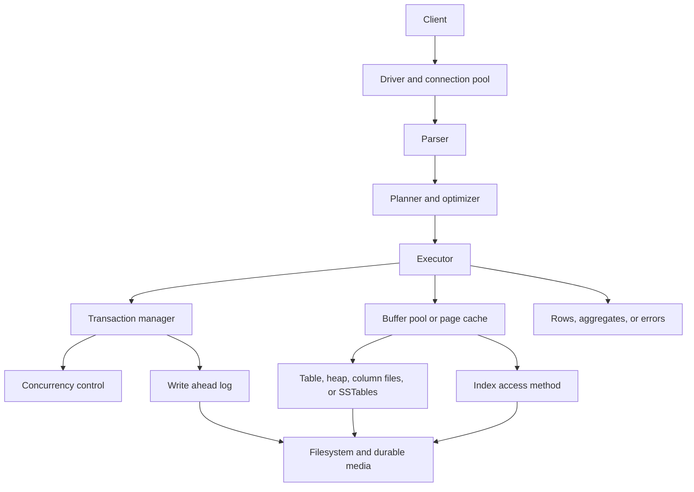

Every write path answers four questions:

| Question | Why it matters | Common implementation |
|---|---|---|
| Where is the new value first made durable? | Defines the recovery point after a crash. | WAL append, journal, consensus log, object storage manifest. |
| When is the client acknowledged? | Defines what an application may safely assume. | Local fsync, quorum commit, async replica receipt, leader memory only. |
| How are readers isolated from writers? | Defines visible anomalies under concurrency. | Locks, MVCC snapshots, timestamp ordering, serial validation. |
| How is old state reclaimed? | Defines storage growth and read amplification. | Vacuum, compaction, page pruning, tombstone garbage collection. |

## Advanced database map

| Area | Concepts | Production risk |
|---|---|---|
| Storage engines | B-Trees, LSM Trees, heaps, column stores, compression, page layout. | Latency spikes, write amplification, fragmentation, read amplification. |
| Recovery | WAL, checkpoints, redo, undo, torn pages, checksums. | Acknowledged commits lost, long restart time, silent corruption. |
| Concurrency | Locks, latches, MVCC, predicate locks, deadlock detection. | Lost updates, write skew, lock convoying, starvation. |
| Query processing | Statistics, cardinality estimation, join algorithms, indexes. | Bad plans, table scans, unstable latency after data drift. |
| Distribution | Replication, sharding, consensus, quorums, distributed transactions. | Split brain, stale reads, hot shards, partial commits. |
| Operations | Migrations, backups, CDC, rebalancing, failover drills. | Irreversible schema changes, broken restore, duplicate events. |

## Storage engine mental model

Storage engines optimize the physical representation of logical tables. The same SQL interface may sit on very different persistence structures.

| Engine style | Write behavior | Read behavior | Best fit | Watchouts |
|---|---|---|---|---|
| Heap plus secondary indexes | Append or update heap pages, update indexes. | Index lookup then heap fetch unless covering. | General OLTP. | Bloat, random I/O, vacuum pressure. |
| B-Tree clustered table | Rows stored in primary key order. | Range scans are efficient on clustering key. | Ordered OLTP, point lookups, range queries. | Random primary keys fragment pages and reduce cache locality. |
| LSM Tree | Append to WAL and memtable, flush immutable SSTables. | Search memtable plus multiple sorted runs, helped by Bloom filters. | High write throughput, time series, key-value workloads. | Compaction stalls, tombstone buildup, read amplification. |
| Columnar | Store columns separately, often compressed by segment. | Scan only needed columns, vectorized execution. | OLAP, analytics, large scans. | Single row updates are expensive. |
| Log structured heap | Append records, maintain indirection or compaction. | Reads follow latest pointer or scan logs. | Event stores, write heavy systems. | Compaction and point lookup indexing are essential. |
| In-memory with persistence | Keep data in memory, persist log or snapshots. | Very low read latency. | Caches, queues, low latency state. | Recovery time, memory pressure, persistence mode confusion. |

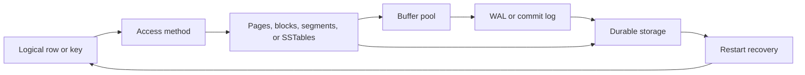

## Pages, buffer pools, and durability

Most row-oriented engines operate in fixed-size pages. A page contains records, free space, line pointers, checksums, and metadata. The buffer pool caches pages and coordinates dirty page flushing.

| Component | Responsibility | Failure scenario |
|---|---|---|
| Page | Smallest logical unit for many reads and writes. | Torn page writes half old and half new bytes after power loss. |
| Buffer pool | Caches pages, tracks dirty pages, pins pages during use. | Cache churn makes an index look slow even when the plan is correct. |
| Latch | Protects in-memory structures for very short critical sections. | Hot pages cause CPU contention without showing as transaction locks. |
| Lock | Protects logical data for transaction isolation. | Long transaction blocks writers or DDL. |
| Checksum | Detects corruption in stored pages. | Storage silently returns corrupt bytes; checksum catches the mismatch. |
| Fsync | Forces log or page bytes to durable media. | Misconfigured durability acknowledges commits that die with the host. |

### WAL and recovery

Write-ahead logging means the database must durably record enough information to redo or undo changes before the corresponding data pages are considered durable.

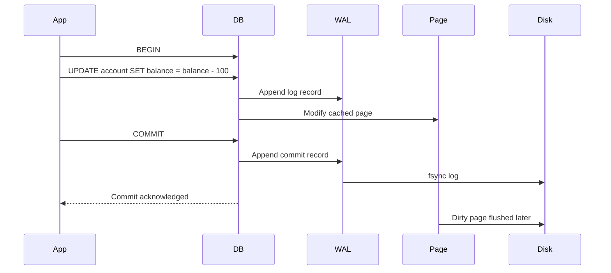

| Recovery phase | Purpose | Example |
|---|---|---|
| Analysis | Determine transaction and dirty page state at crash time. | Find committed transactions whose pages might not be flushed. |
| Redo | Reapply idempotent changes that may be missing from data files. | Rebuild a page update from WAL after the dirty page was lost. |
| Undo | Roll back uncommitted changes if the engine uses undo logging. | Remove a debit from a transaction that never committed. |
| Checkpoint | Bound how far back recovery must read. | Flush dirty pages and persist a recovery marker. |

Correct WAL reasoning:

- The WAL record must reach stable storage before the changed data page can be flushed.
- A commit is only as durable as the commit record and the policy used to flush it.
- Group commit batches many commits behind one fsync to improve throughput.
- Checkpoints reduce restart time but can create I/O bursts.
- Replicated WAL still needs a clear acknowledgement rule, such as local durable, replica received, or quorum committed.

## B-Trees

B-Trees keep sorted keys in a shallow tree. Internal pages route searches, leaf pages hold keys, row pointers, or clustered rows. Most database B-Trees are B+Trees, where full records or row references live in leaves and leaves are linked for range scans.

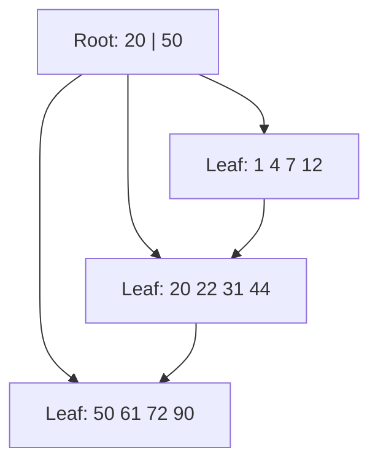

| Operation | Cost intuition | Important details |
|---|---|---|
| Point lookup | O(log n), usually 2 to 4 page reads when cached internal pages are hot. | Secondary indexes may require heap lookup. |
| Range scan | O(log n) to first key plus sequential leaf traversal. | Excellent for ordered queries and pagination by keyset. |
| Insert | Locate leaf, insert, sometimes split. | Random keys scatter writes; monotonic keys can hot spot the rightmost page. |
| Delete | Mark or remove entry, sometimes merge or rebalance. | Space may not return to the OS without vacuum or rebuild. |
| Update | In-place if same page and size allow, otherwise move or create new version. | Indexed column updates usually delete and insert index entries. |

Practical B-Tree tuning:

- Choose primary keys that balance locality and hot spot risk.
- Avoid indexing every column. Each secondary index increases write cost and migration cost.
- Prefer keyset pagination over large `OFFSET` scans.
- Use covering indexes for hot read paths only when the write cost is justified.
- Watch index bloat after heavy churn.
- Rebuild or reorganize indexes only with a measured problem and a safe maintenance window.

## LSM Trees

Log structured merge trees turn random writes into sequential writes. New writes go to a WAL and an in-memory sorted structure. When the memtable fills, it becomes an immutable sorted string table. Background compaction merges sorted runs.

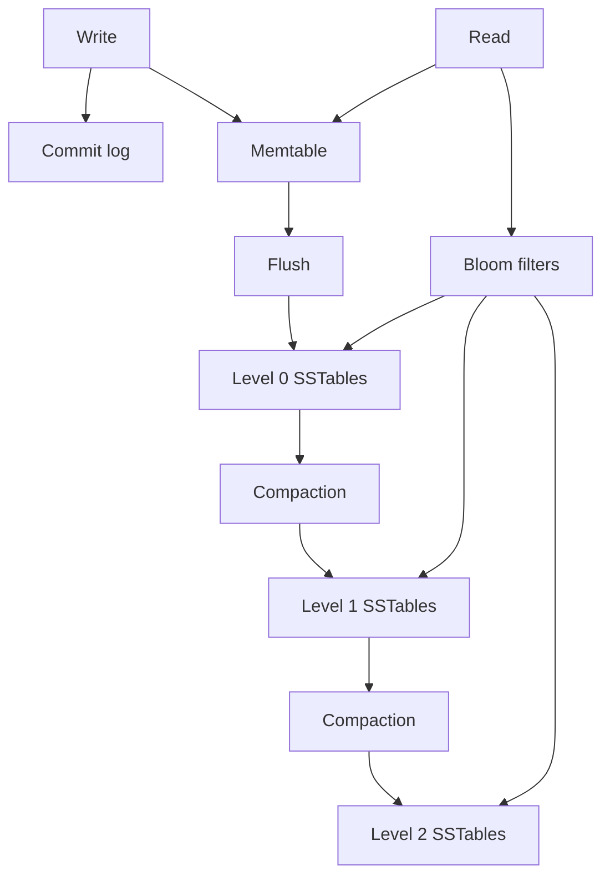

| Concept | Meaning | Failure mode |
|---|---|---|
| Memtable | Mutable in-memory sorted table. | Large memtables improve write batching but increase recovery replay time. |
| SSTable | Immutable sorted file. | Too many files increase read amplification. |
| Bloom filter | Probabilistic test that a key is absent from an SSTable. | False positives cause extra reads; false negatives indicate corruption or bug. |
| Tombstone | Delete marker written like any other value. | Range deletes or expired data can poison reads until compaction removes tombstones. |
| Compaction | Merge and discard obsolete records. | Stalls, high I/O, or disk full if compaction cannot keep up. |
| Leveled compaction | Keeps levels non-overlapping. | Lower read amplification, higher write amplification. |
| Size-tiered compaction | Merges similar sized runs. | Higher read amplification, lower write amplification for some workloads. |

LSM correctness notes:

- Deletes are not immediate physical deletes. Tombstones must survive until all older versions they cover are gone.
- Snapshots and long reads can prevent old SSTables from being reclaimed.
- Disk usage can temporarily exceed logical data size by a large factor during compaction.
- Read repair and compaction may surface latent corruption long after the original write.

## Indexes and access paths

Index design determines both read speed and write cost. An index is not only a lookup helper. It is a materialized ordering with maintenance obligations.

| Index type | Use | Risk |
|---|---|---|
| Primary index | Entity identity and clustering. | Bad key choice creates hot spots. |
| Secondary index | Lookup by alternate fields. | Write amplification. |
| Composite index | Multi-column filtering and ordering. | Column order matters. |
| Covering index | Query served from index only. | Larger index, more write cost. |
| Partial index | Index subset of rows. | Query predicate must match. |
| Full text index | Search over text. | Relevance and update complexity. |
| Bloom filter | Avoid unnecessary reads. | False positives only, never false negatives when correct. |
| Expression index | Index a computed expression. | Query must use a matching expression or planner may not use it. |
| Hash index | Equality lookup. | Poor for ranges and ordering. |
| Spatial index | Geometric and nearest-neighbor queries. | Complex selectivity and bounding box false matches. |
| Inverted index | Token or element to document mapping. | Expensive updates and large posting lists. |

Composite index order matters:

| Index | Efficient predicates | Inefficient predicates |
|---|---|---|
| `(tenant_id, created_at)` | `tenant_id = ?`, `tenant_id = ? ORDER BY created_at`, tenant-scoped time range. | Global `created_at` range without tenant filter. |
| `(status, priority, id)` | Status queue by priority with stable keyset pagination. | Lookup by `priority` alone. |
| `(user_id, lower(email))` | User-scoped normalized email lookup. | Global normalized email lookup unless user is supplied. |

Index correctness examples:

- A unique index on `(tenant_id, slug)` is stronger than an application-side "check then insert" because concurrent inserts cannot both commit.
- A partial unique index such as `(user_id) WHERE active = true` can enforce "one active subscription per user" without serializing unrelated historical rows.
- A foreign key prevents orphaned rows, but it can also create lock contention on parent rows during high write volume.
- A missing index on a foreign key can make parent deletes or updates unexpectedly expensive.

Links:

- [Data Structures/B-Trees](/compendium/data-structures/b-trees)
- [Data Structures/Bloom Filters](/compendium/data-structures/bloom-filters)
- [Data Structures/Hash Tables](/compendium/data-structures/hash-tables)
- [Data Structures/Skip Lists](/compendium/data-structures/skip-lists)

## Query planning and execution

The optimizer chooses a physical plan for a logical query. It estimates row counts, selectivity, I/O cost, CPU cost, sort cost, memory use, and join order. Bad estimates produce bad plans.

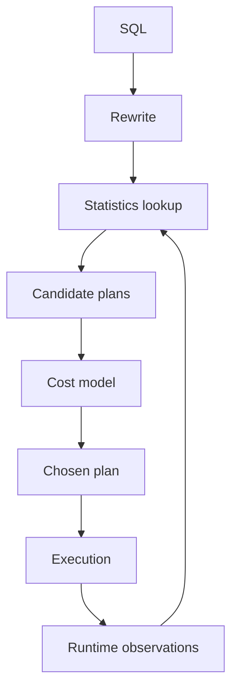

| Plan node | Good when | Pathology |
|---|---|---|
| Sequential scan | Large percentage of table needed, table small, or index not selective. | Accidentally scans huge table due to missing predicate or stale stats. |
| Index scan | Predicate is selective and row fetches are limited. | Many random heap fetches make it slower than a scan. |
| Index only scan | Index covers projected columns and visibility map allows it. | Falls back to heap checks if pages are not marked all visible. |
| Nested loop join | Outer side small, inner lookup indexed. | Catastrophic if outer side is much larger than estimated. |
| Hash join | Equi-join with enough memory. | Spills to disk if hash table exceeds memory. |
| Merge join | Inputs already sorted or sorting is cheap. | Sort cost dominates for large unsorted inputs. |
| Sort | Needed for order, grouping, merge join, distinct. | Spills to disk when work memory is too small. |

Planner failure scenarios:

| Scenario | Symptom | Fix direction |
|---|---|---|
| Stale statistics after bulk load | Good query suddenly uses nested loop or table scan. | Analyze table, improve autovacuum or stats schedule. |
| Correlated predicates | Planner multiplies independent selectivities and underestimates rows. | Extended statistics, composite index, query rewrite. |
| Parameter-sensitive plan | One cached plan is bad for some tenant sizes. | Plan hints where available, query split, custom plans, tenant-aware routing. |
| Function on indexed column | Index ignored for `lower(email)` unless expression index exists. | Add expression index or store normalized field. |
| Implicit cast | Index not used because column and parameter types differ. | Fix parameter type and schema consistency. |

## Transactions and ACID

ACID is a set of guarantees, not a performance feature.

| Property | Meaning | Common misconception |
|---|---|---|
| Atomicity | Transaction effects commit together or not at all. | It does not mean the transaction is small or indivisible internally. |
| Consistency | Declared constraints and application invariants are preserved if transactions are correct. | The database cannot enforce invariants it does not know. |
| Isolation | Concurrent transactions observe behavior allowed by the isolation level. | Default isolation is rarely fully serializable. |
| Durability | Committed state survives the promised failure class. | Durability depends on fsync, replication, storage, and configuration. |

Transaction boundaries should surround a complete invariant change:

```sql
BEGIN;

UPDATE accounts
SET balance = balance - 100
WHERE id = 'checking'
  AND balance >= 100;

UPDATE accounts
SET balance = balance + 100
WHERE id = 'savings';

COMMIT;
```

Correctness checks for transactional code:

- Does every statement in the transaction participate in the same connection and transaction context?
- Are external calls avoided inside the transaction, or bounded with timeouts and retries?
- Are retries safe after serialization failures, deadlocks, and connection drops?
- Are uniqueness, foreign key, and check constraints used instead of only application validation?
- Does the code know whether a timeout happened before or after commit?
- Is idempotency present at the API boundary?

## MVCC

Multi-version concurrency control stores multiple versions of rows so readers and writers can often proceed without blocking each other. A snapshot defines which versions are visible.

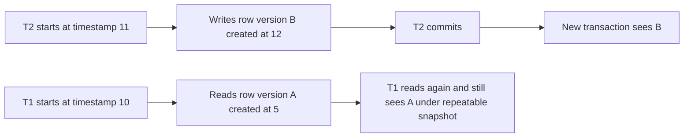

| MVCC concept | Meaning | Operational impact |
|---|---|---|
| Snapshot | Set of committed versions visible to a transaction. | Long snapshots retain old versions and delay cleanup. |
| Tuple version | Old and new physical row versions. | Updates can increase table and index bloat. |
| Vacuum or cleanup | Reclaims versions no snapshot can see. | Blocked by long transactions and idle-in-transaction sessions. |
| Visibility metadata | Tracks creator and deleter transaction information. | Extra heap checks can prevent index-only scans. |
| Serialization validation | Detects dangerous dependency cycles in stronger isolation. | Transactions may abort and must be retried. |

MVCC failure scenario:

1. A report transaction opens a repeatable snapshot and runs for 4 hours.
2. The application updates millions of rows during that window.
3. Vacuum cannot reclaim old versions because the report might still need them.
4. Table bloat grows, indexes become less efficient, and normal queries slow down.
5. The fix is not only "run vacuum"; it is to shorten snapshots, route analytics to replicas, paginate reports, and enforce idle transaction timeouts.

## Isolation levels and anomalies

| Isolation | Prevents | Still allows |
|---|---|---|
| Read uncommitted | Almost nothing. | Dirty reads, nonrepeatable reads, phantoms. |
| Read committed | Dirty reads. | Nonrepeatable reads, phantoms, write skew. |
| Repeatable read | Nonrepeatable reads. | Phantoms in some systems, write skew under snapshot isolation. |
| Snapshot isolation | Reads a consistent snapshot. | Write skew. |
| Serializable | Equivalent to serial execution. | Lower concurrency or aborts under conflict. |

Common anomalies:

| Anomaly | Example | Prevention |
|---|---|---|
| Dirty read | Transaction reads a payment row that later rolls back. | Read committed or stronger. |
| Nonrepeatable read | Same row read twice returns different values. | Repeatable read, snapshot isolation, or explicit lock. |
| Phantom read | Query for available seats returns different matching rows later. | Serializable, predicate locks, range locks, or constraint design. |
| Lost update | Two users read counter 5 and both write 6. | Atomic update, row lock, version check, serializable. |
| Write skew | Two doctors both go off call after each sees the other is on call. | Serializable or materialized constraint with locking. |
| Read skew | Transfer updates two rows; reader sees debit but not credit. | Consistent snapshot. |

### Correctness examples

Lost update with unsafe read-modify-write:

```sql
-- Both sessions read quantity = 10.
SELECT quantity FROM inventory WHERE sku = 'A';

-- Both compute 9 in application code.
UPDATE inventory SET quantity = 9 WHERE sku = 'A';
```

Safer atomic update:

```sql
UPDATE inventory
SET quantity = quantity - 1
WHERE sku = 'A'
  AND quantity > 0;
```

Optimistic version check:

```sql
UPDATE documents
SET body = $1,
    version = version + 1
WHERE id = $2
  AND version = $3;
```

Write skew under snapshot isolation:

```sql
-- Invariant: at least one doctor must remain on call.
-- T1 sees doctor B on call and turns A off.
-- T2 sees doctor A on call and turns B off.
-- Both update different rows, so row-level write conflict may not occur.
```

Stronger designs:

- Use serializable isolation and retry serialization failures.
- Represent the invariant as one row that both transactions update.
- Use an exclusion or check constraint when the database can express it.
- Lock the predicate range or parent invariant row before updating child rows.

Correctness tools:

- Unique constraints.
- Foreign keys.
- Check constraints.
- Transaction boundaries.
- Optimistic version columns.
- Pessimistic locks.
- Idempotency keys.
- Outbox and inbox tables.
- Reconciliation jobs.

## Locking, latching, and deadlocks

Locks protect logical database objects. Latches protect in-memory data structures. Confusing them hides root causes.

| Mechanism | Scope | Duration | Example |
|---|---|---|---|
| Latch | Internal memory page or structure. | Microseconds or milliseconds. | Protect B-Tree page split. |
| Row lock | Logical row. | Transaction duration. | `SELECT ... FOR UPDATE`. |
| Predicate or range lock | Set of possible rows. | Transaction duration. | Prevent insert into queried range. |
| Advisory lock | Application-defined key. | Session or transaction. | Serialize per-tenant maintenance job. |
| DDL lock | Schema object. | Statement or transaction. | `ALTER TABLE` waits for active queries. |

Deadlock example:

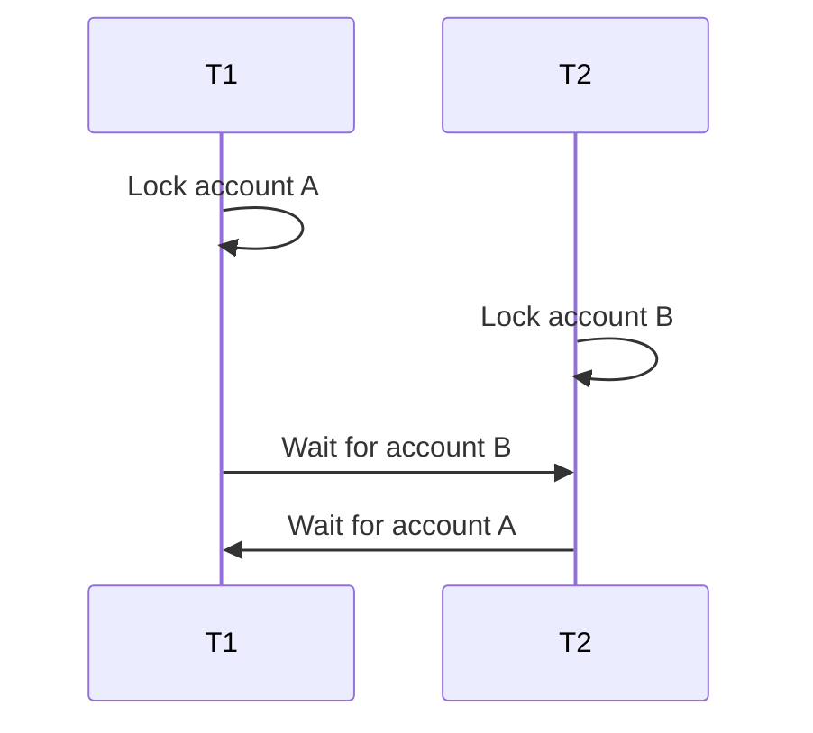

Deadlock mitigation:

- Lock rows in a stable order.
- Keep transactions short.
- Avoid user input and network calls while holding locks.
- Use lock timeouts and retry deadlock victims.
- Prefer single-statement atomic updates when possible.

## Distributed transactions

Distributed transactions coordinate state changes across failure domains. The hard part is not writing two rows. The hard part is knowing what happened when a process, network, or coordinator fails between steps.

| Pattern | Guarantee | Failure mode | Use when |
|---|---|---|---|
| Two-phase commit | Participants commit or abort as one unit if coordinator completes. | Blocking if coordinator dies after prepare. | Small set of trusted participants with operational control. |
| Consensus transaction | Commit decision replicated through Raft, Paxos, or similar. | Higher latency and quorum dependency. | Strongly consistent distributed databases. |
| Saga | Sequence of local commits with compensating actions. | Compensation may fail or be semantically incomplete. | Business processes can tolerate visible intermediate state. |
| Outbox | State change and message intent committed atomically in one database. | Relay lag or duplicate publish. | Need reliable event publication without XA. |
| Inbox | Consumer records processed message IDs atomically with side effects. | Inbox table growth and dedupe retention mistakes. | At-least-once delivery consumers. |
| Escrow | Pre-allocate bounded rights to shards. | Rebalancing rights and handling expired reservations. | Counters, inventory, quota where overuse must be bounded. |

Two-phase commit:

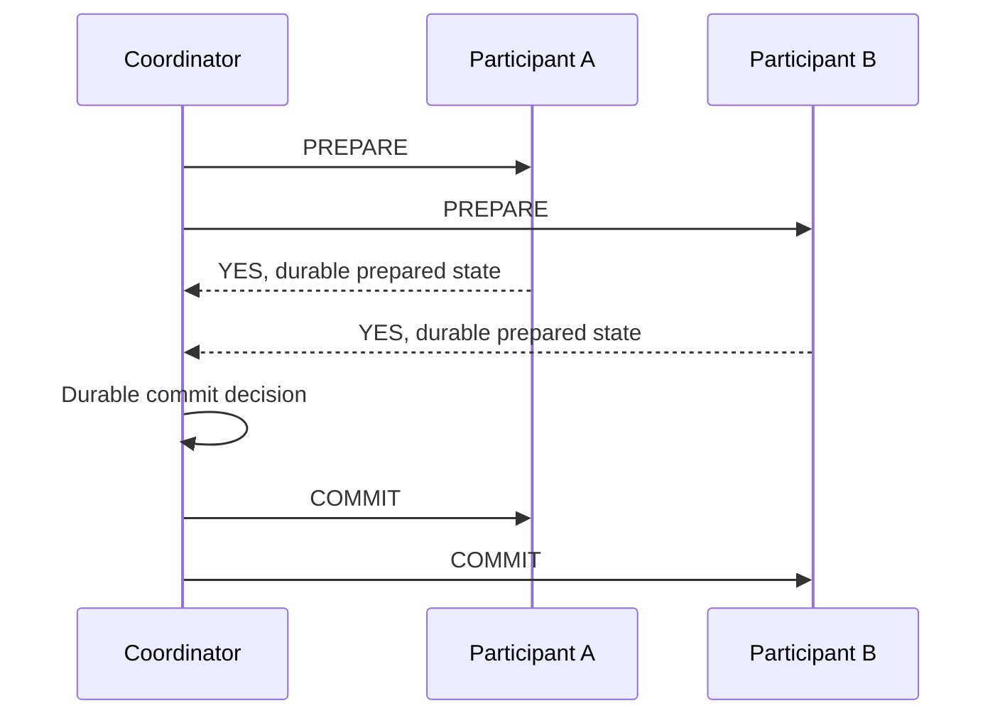

The dangerous window is after participants prepare but before they learn the final decision. Participants must retain locks and prepared state. If the coordinator is unavailable, they cannot safely decide alone.

Outbox flow:

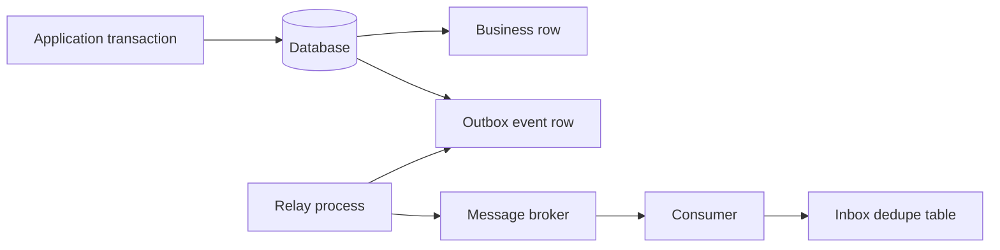

Links:

- [Design Patterns/Outbox Pattern](/compendium/design-patterns/outbox-pattern)
- [Design Patterns/Saga Pattern for Distributed Transactions](/compendium/design-patterns/saga-pattern-for-distributed-transactions)
- [Design Patterns/CQRS (Command Query Responsibility Segregation)](/compendium/design-patterns/cqrs-command-query-responsibility-segregation)

## Replication

Replication copies data to improve durability, availability, locality, or read scale. It also creates ambiguity: which copy is authoritative, how stale can reads be, and what happens during failover?

| Topology | Write path | Strength | Risk |
|---|---|---|---|
| Single leader, async followers | Leader commits locally, followers catch up later. | Simple and fast. | Acknowledged writes may be lost if leader dies before replication. |
| Single leader, sync follower | Commit waits for one or more replicas. | Better durability. | Higher latency and write unavailability if replicas fail. |
| Multi-leader | Multiple nodes accept writes. | Regional writes and availability. | Conflict detection and resolution are application-visible. |
| Leaderless quorum | Clients read and write to N replicas with R and W thresholds. | Tunable consistency and availability. | Sloppy quorum, hinted handoff, and read repair complexity. |
| Consensus replicated log | Leader orders writes through quorum agreement. | Strong consistency for committed log entries. | Requires quorum for progress. |

Replication lag scenarios:

| Scenario | Impact | Mitigation |
|---|---|---|
| Read-your-writes missing | User creates project then replica read says it does not exist. | Sticky leader reads, session tokens, or wait for replica LSN. |
| Stale authorization | Permission revoked on leader but replica still allows action. | Leader reads for security checks, bounded staleness, cache invalidation. |
| Failover data loss | Old leader accepted write that never reached promoted replica. | Synchronous replication, quorum commit, recovery reconciliation. |
| Replica overload | Analytics query delays replay. | Dedicated analytics replicas, workload isolation, query limits. |
| Clock confusion | Last-write-wins uses skewed timestamps. | Logical clocks, version vectors, server-side ordering. |

## Quorum databases

Quorum systems store each item on N replicas and require enough acknowledgements to consider operations successful. A common rule of thumb is `R + W > N`, where R is read quorum and W is write quorum. This only gives useful consistency under specific assumptions: stable replica sets, no sloppy quorum surprises, correct conflict resolution, and reads that reconcile divergent versions.

| Parameter | Meaning | Tradeoff |
|---|---|---|
| N | Replication factor. | Higher durability and availability, higher storage and repair cost. |
| W | Write acknowledgements required. | Higher W improves durability, increases write latency and failures. |
| R | Read acknowledgements required. | Higher R improves freshness, increases read latency and failures. |
| Sloppy quorum | Accept writes on substitute nodes during outages. | Improves availability, weakens intuitive quorum reasoning. |
| Hinted handoff | Later deliver substitute writes to intended replicas. | Helps repair, can resurrect old values if conflict handling is weak. |
| Read repair | Fix stale replicas during reads. | Repairs hot keys faster than cold keys. |
| Merkle repair | Compare tree summaries between replicas. | Efficient anti-entropy for large ranges. |

Quorum failure example:

1. N is 3 and W is 2.
2. Network partition isolates replica C.
3. Write X reaches A and B and is acknowledged.
4. A fails before C is repaired.
5. A read with R equals 1 from C can return the old value.
6. If clients require monotonic reads, the application needs stronger read policy, session consistency, or a different database guarantee.

## Sharding and partitioning

Partitioning splits data into smaller physical units. Sharding distributes those units across nodes.

| Strategy | Good for | Risk |
|---|---|---|
| Range partitioning | Time series, ordered archival, range scans. | Hot latest partition, manual split planning. |
| Hash partitioning | Even distribution for point lookups. | Range scans across many partitions. |
| List partitioning | Explicit tenant, region, or category placement. | Operational complexity as lists grow. |
| Composite partitioning | Time plus tenant, region plus hash. | More complex routing and indexing. |
| Consistent hashing | Dynamic node membership. | Hot keys still hot, range queries poor. |
| Directory based sharding | Flexible tenant-to-shard mapping. | Directory is critical metadata. |

Shard key selection:

| Candidate | Pros | Cons |
|---|---|---|
| `tenant_id` | Tenant isolation, easy per-tenant moves. | Large tenants become hot shards. |
| `user_id` | Good for user-local queries. | Cross-user collaboration queries scatter. |
| `created_at` | Easy retention and archival. | New writes concentrate on newest shard. |
| Random UUID hash | Balanced writes. | Poor locality and expensive range queries. |
| Composite tenant plus hash | Balances large tenants with controlled scatter. | Requires fanout for tenant-wide scans. |

Cross-shard operations:

- Local transaction: all touched data lives on one shard.
- Fanout read: query all relevant shards and merge results.
- Scatter-gather write: high risk unless idempotent and reconciled.
- Global secondary index: index entry and base row may live on different shards.
- Resharding: requires copy, dual write or change stream catch-up, validation, and cutover.

Hot partition scenario:

1. Orders are partitioned by day.
2. All current writes go to today's partition.
3. One partition receives nearly all insert, index, and autovacuum pressure.
4. Adding nodes does not help because the hot key range is still single-owned.
5. A better design may hash within current time buckets or route by tenant plus time.

## Change data capture

CDC turns database changes into a stream for search indexes, caches, warehouses, audit logs, and event-driven systems.

| CDC source | Advantages | Risks |
|---|---|---|
| WAL or binlog decoding | Captures committed database order with low application coupling. | Schema changes and decoder lag need careful handling. |
| Triggers | Flexible and close to data. | Adds write latency and can miss changes if disabled or misdeployed. |
| Polling updated timestamps | Simple. | Clock issues, missed same-timestamp updates, deletes are hard. |
| Application events | Rich semantic events. | Can diverge from database commit unless outbox is used. |

CDC correctness checklist:

- Is the stream based on committed changes only?
- Are events ordered per aggregate, table, shard, or globally?
- Can consumers handle duplicates and reordering?
- Is delete represented as a tombstone or explicit event?
- Are schema versions included?
- Is consumer offset committed atomically with side effects?
- Is lag monitored against retention so WAL or binlog is not discarded before consumption?

## Schema migrations

Online migrations must support mixed versions of application code and database schema. The safe pattern is expand, backfill, switch, contract.

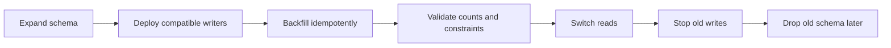

| Migration type | Safer approach | Dangerous approach |
|---|---|---|
| Add nullable column | Add column, deploy code, backfill in chunks, then constrain. | Add non-null with table rewrite during peak traffic. |
| Rename column | Add new column, dual write, backfill, switch reads, drop old later. | Rename in place while old app version still runs. |
| Change type | Add new typed column and convert gradually. | Alter type on huge table without lock and rewrite analysis. |
| Add index | Build concurrently or online where supported. | Blocking index build on high traffic table. |
| Add constraint | Add not valid, backfill or clean data, validate later. | Immediate validation that locks or fails production writes. |
| Split table | Dual write or CDC to new table, validate, then switch. | Big bang copy with no drift detection. |

Migration failure scenario:

1. Version A writes `full_name`.
2. Migration renames `full_name` to `display_name`.
3. Version A pods still run during rolling deploy and begin failing writes.
4. Some requests retry and create duplicate side effects.
5. Correct pattern is to add `display_name`, make code compatible with both, backfill, switch reads, stop old writes, then drop `full_name` after the compatibility window.

## Backups, restore, and disaster recovery

Backups are only real if restores are tested. A backup file that cannot meet recovery objectives is an artifact, not a recovery plan.

| Backup type | Captures | Strength | Risk |
|---|---|---|---|
| Logical dump | Schema and rows through database interface. | Portable, easy to inspect. | Slow for large databases, may miss roles or extensions. |
| Physical base backup | Data files at a consistent point. | Fast restore for large systems. | Version and storage layout dependent. |
| WAL archiving | Changes after base backup. | Point-in-time recovery. | Useless if WAL gaps exist. |
| Snapshot | Storage volume point in time. | Fast and cheap. | Must coordinate with database flush or recovery rules. |
| Replica backup | Offloads primary. | Reduces production impact. | Replica lag or corruption can be backed up. |

Recovery concepts:

| Term | Meaning |
|---|---|
| RPO | Maximum acceptable data loss. |
| RTO | Maximum acceptable time to restore service. |
| PITR | Restore to a specific point using base backup plus WAL. |
| Restore drill | Scheduled proof that backups can be restored and queried. |
| Integrity check | Verify checksums, row counts, constraints, and application invariants. |

Restore validation should include:

- Restore into an isolated environment.
- Confirm database starts without recovery errors.
- Run migration history checks.
- Verify row counts and critical checksums.
- Verify application can boot against the restored database.
- Exercise representative reads and writes.
- Document elapsed restore time and recovered timestamp.
- Alert if backups are stale, missing, too small, too large, or unrestorable.

Storage correctness checklist:

- What is the acknowledged durability point?
- Can acknowledged writes be lost on failover?
- Are replicas used for reads?
- What is the maximum acceptable replication lag?
- Can stale reads violate product invariants?
- How are conflicts detected and resolved?
- How is corruption detected?
- How are backups restored and verified?

## Distributed databases

Distributed databases combine storage with [05 Distributed Systems](/compendium/software-engineering/distributed-systems) problems:

- CAP Theorem constraints.
- PACELC latency and consistency tradeoffs.
- Quorum reads and writes.
- Shard placement.
- Hot partition detection.
- Cross-shard transaction limits.
- Global secondary index complexity.
- Clock assumptions.
- Consensus for metadata.
- Rebalancing and resharding.

Additional distributed concerns:

| Concern | Why it matters | Example |
|---|---|---|
| Metadata consensus | Shard ownership must be consistent. | Two nodes both believe they own writes for the same range. |
| Fencing tokens | Prevent old leaders from writing after failover. | Old primary resumes and writes stale state to shared storage. |
| Clock model | Some systems depend on bounded clock uncertainty. | External consistency requires commit wait or logical ordering. |
| Rebalancing | Moving data competes with foreground traffic. | Node add causes latency spike due to uncontrolled streaming. |
| Global indexes | Secondary index update may be cross-shard. | Index says row exists before base row commit is visible. |
| Tenant placement | Noisy neighbors and data residency. | Large tenant overloads shard, requiring live move. |

## Data migration playbook

- Define source of truth.
- Define invariant checks.
- Add backward compatible schema.
- Dual write only with outbox or repair strategy.
- Backfill idempotently.
- Validate counts and checksums.
- Shift reads gradually.
- Monitor error rate, lag, and drift.
- Keep rollback path until confidence is real.
- Remove old path after compatibility window.

Detailed migration controls:

| Control | Purpose | Example |
|---|---|---|
| Idempotent backfill | Allow safe resume after crash. | Update rows where new column is null. |
| Chunking | Bound locks, WAL growth, and replica lag. | Process 5,000 rows per transaction. |
| Throttling | Protect production latency. | Pause when replica lag exceeds threshold. |
| Checksums | Detect drift beyond row counts. | Compare hash aggregates per partition. |
| Dual read validation | Compare old and new read models before switching. | Shadow query new index or table. |
| Kill switch | Stop new path quickly. | Feature flag for read routing. |
| Rollback plan | Know which writes are reversible. | Keep old column populated until confidence window closes. |

## Practical failure scenarios

| Failure | Root cause | Better design |
|---|---|---|
| User sees 404 after creating resource | Create committed on leader, read served from lagging replica. | Read leader for session, use replica LSN wait, or sticky routing. |
| Inventory oversold | Check and decrement done in separate statements outside a transaction. | Atomic conditional update or serializable transaction. |
| Duplicate charge | Payment API retried after timeout without idempotency key. | Idempotency key with unique constraint and stored outcome. |
| Migration locks table | Blocking DDL on large table during traffic. | Online DDL, concurrent index build, expand-contract rollout. |
| WAL disk fills | Long replica slot or CDC consumer prevents WAL recycling. | Lag alerts, retention limits, consumer recovery runbook. |
| Backup restores but app fails | Backup excluded extensions, roles, secrets, or migration metadata. | Full restore drill with application boot validation. |
| Query degrades overnight | Data distribution changed and stats became stale. | Analyze, extended stats, plan regression tests for critical queries. |
| Compaction causes latency spike | LSM write amplification and background I/O saturation. | Tune compaction, provision I/O headroom, isolate workloads. |
| Split brain writes | Failover lacks fencing and old leader accepts writes. | Consensus, fencing tokens, lease discipline, client routing controls. |
| Old tombstones resurrect data | Replica missed delete and tombstone expired before repair. | Repair within tombstone retention and monitor anti-entropy. |

## Design review questions

| Question | Strong answer |
|---|---|
| What invariant must never be violated? | It is enforced by a database constraint, serializable transaction, or single-writer design. |
| What happens if the request times out after commit? | Retry path uses idempotency and can return the committed outcome. |
| What happens if failover occurs after acknowledgement? | Acknowledgement policy makes data loss impossible for that failure class, or reconciliation is explicit. |
| Can stale reads cause harm? | Read routing separates harmless stale reads from security and money decisions. |
| How do migrations run during rolling deploys? | New and old app versions are schema-compatible throughout rollout. |
| How is backup quality proven? | Automated restore drills verify data and application behavior. |
| How is CDC replay handled? | Consumers are idempotent and offsets are managed with side effects. |
| How are hot tenants handled? | Placement, throttling, split strategy, and shard movement are planned. |

## Related notes

- [05 Distributed Systems](/compendium/software-engineering/distributed-systems)
- [06 Caching Queues and Streaming](/compendium/software-engineering/caching-queues-and-streaming)
- [10 Testing Verification and Quality Bars](/compendium/software-engineering/testing-verification-and-quality-bars)
- [12 Delivery Migrations and Release Engineering](/compendium/software-engineering/delivery-migrations-and-release-engineering)
