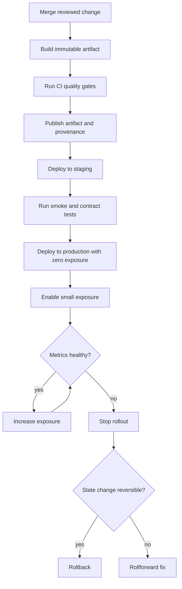
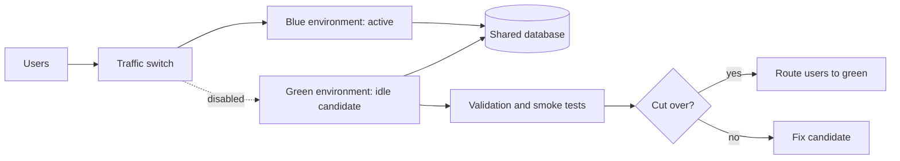
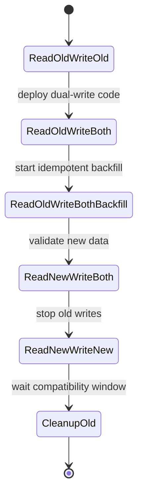
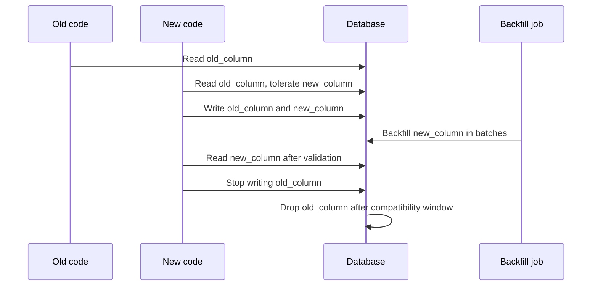
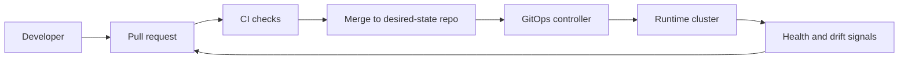
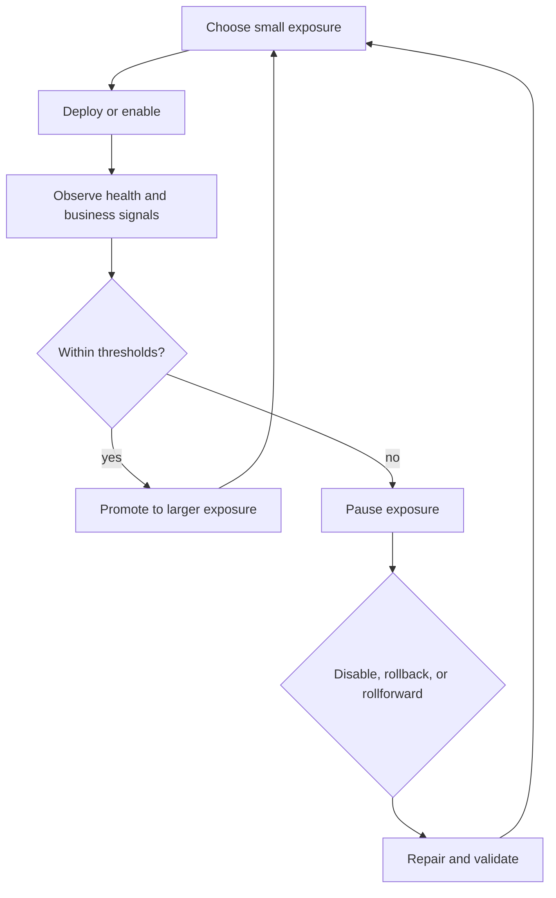

# Delivery Migrations and Release Engineering

High quality software depends on safe change, not only good design. Release engineering is the discipline of turning code, configuration, database changes, infrastructure changes, and operational evidence into controlled production outcomes.

The central idea is simple: deploy often, expose gradually, measure continuously, and keep every change reversible or repairable.

## Core concepts

| Concept | Meaning | Primary risk controlled |
|---|---|---|
| Deploy | Put a version of software or configuration into an environment. | Build, packaging, environment, and dependency defects. |
| Release | Expose deployed capability to users, tenants, traffic, jobs, or integrations. | Product behavior, scale, and user impact defects. |
| Migration | Change durable state, such as schema, data shape, indexes, topics, or file formats. | Compatibility and irreversibility defects. |
| Rollback | Return execution to a previous known-good version or state. | Ongoing incident duration. |
| Rollforward | Deploy a corrective version that preserves already changed state. | Irreversible or high-risk reversal paths. |
| Progressive delivery | Expand exposure in controlled increments using gates and telemetry. | Blast radius. |
| Compatibility window | Period when old and new code, schemas, data, and messages must coexist safely. | Mixed-version failures. |

Deployment and release are often coupled in small systems, but separating them is one of the most effective ways to reduce risk. A deployment can be technically complete while the feature remains disabled by flag, tenant allowlist, route weight, or control-plane setting.

## Release strategies

| Strategy | How it works | Best fit | Advantages | Main risks | Required safeguards |
|---|---|---|---|---|---|
| Recreate deploy | Stop old version, start new version. | Internal tools, batch jobs, single-user systems. | Simple, easy to reason about. | Downtime, failed start leaves service unavailable. | Fast health checks, tested rollback, maintenance window if user-facing. |
| Rolling deploy | Gradually replace instances with the new version. | Stateless services with backward-compatible dependencies. | No planned downtime, simple in orchestrators. | Mixed versions, long-tail bad instances, partial rollout ambiguity. | Readiness checks, max unavailable limits, compatibility tests. |
| Blue green | Run two full environments and switch traffic from blue to green. | Systems where fast cutover and rollback are valuable. | Fast traffic reversal, clean environment validation. | Expensive capacity, shared database compatibility, stale warmup. | Preflight checks, traffic switch audit, database compatibility window. |
| Canary | Send a small traffic slice to the new version, then expand. | High-traffic services with good observability. | Low initial blast radius, evidence-driven promotion. | Metrics may miss rare failures, biased traffic sample. | Representative routing, SLO gates, manual stop path. |
| Feature flag | Deploy code separately from enabling behavior. | Product features, risky branches, tenant-specific rollout. | Fast disable path, targeted release. | Flag debt, state explosion, hidden interactions. | Flag ownership, expiry date, default-safe behavior, audit log. |
| Dark launch | Run new behavior internally without visible user effect. | New read paths, ranking, search, recommendations, pipelines. | Exercises production path before exposure. | Hidden side effects, cost spikes, privacy surprises. | Side-effect isolation, shadow metrics, explicit kill switch. |
| Shadow traffic | Copy real production requests to a new path and compare outputs. | Rewrites, migrations, new engines, performance validation. | Realistic load and input diversity. | Duplicate side effects, PII leakage, mismatched timing. | Non-mutating sink, scrubbing, request sampling, result diffing. |
| Ring deployment | Release to rings such as internal, beta, small customers, large customers. | SaaS, desktop, mobile, multi-tenant platforms. | Business-aware blast radius control. | Slow learning if rings are too small or unrepresentative. | Clear ring criteria, promotion rules, support readiness. |
| A/B experiment | Split users between variants to measure product impact. | Product optimization where both variants are safe. | Measures behavior, not only health. | Confuses delivery safety with product inference. | Separate safety gates from experiment metrics. |

## Strategy selection

| Constraint | Prefer | Avoid |
|---|---|---|
| No downtime allowed | Rolling, blue green, canary. | Recreate deploy. |
| Expensive duplicated infrastructure | Rolling, canary, feature flags. | Full blue green. |
| Risky database migration | Expand and contract migration with flags. | One-step deploy plus destructive schema change. |
| Hard to observe production behavior | Blue green with manual validation, limited ring. | Fully automated canary promotion. |
| User-visible feature uncertainty | Feature flag, ring release, A/B experiment. | Irreversible global release. |
| Protocol or message format change | Compatibility window, consumer-driven contract tests. | Simultaneous producer and consumer cutover. |
| Batch or worker fleet | Queue-drain rollout, canary workers, partitioned workers. | Global worker replacement without idempotency. |

## Release flow

## Rolling deployments

Rolling deployment replaces old instances incrementally. It is usually the default for Kubernetes Deployments, service meshes, and many platform-as-a-service systems.

Key properties:

- At least two application versions may serve traffic at the same time.
- Any shared dependency must be compatible with both versions.
- Health checks must represent real readiness, not only process liveness.
- Client retries can amplify errors if bad instances enter service.
- Long-lived connections may keep old versions active after rollout completion.

Rolling deployment controls:

| Control | Purpose | Example |
|---|---|---|
| `maxUnavailable` | Prevent too much capacity from disappearing during replacement. | Keep at least 90 percent of pods available. |
| `maxSurge` | Add extra instances before removing old ones. | Start 1 extra pod in a 4-pod deployment. |
| Readiness probe | Keep unready instances out of service routing. | Probe database connectivity and required caches. |
| Startup probe | Avoid killing slow-starting applications too early. | Allow JVM warmup before liveness failures matter. |
| Pod disruption budget | Preserve capacity during voluntary disruption. | Require 3 of 4 replicas available. |
| Pre-stop hook | Drain connections before process exit. | Stop accepting traffic, sleep, then terminate. |

Failure scenario: a rolling deploy introduces code that writes a new required field, but old instances cannot read it. During mixed-version serving, old instances crash when they fetch newly written records. The fix is not "roll back faster"; the fix is an expand and contract migration where both versions tolerate both shapes during the compatibility window.

## Blue green deployments

Blue green keeps two production-capable environments. One serves users, the other receives the candidate version. The switch can be DNS, load balancer target group, service mesh route, ingress weight, or a control-plane pointer.

Blue green is attractive because traffic reversal is fast, but the database is usually not blue green. If both environments share durable state, schema and data changes still need compatibility. If each environment has its own database, cutover must handle replication lag, dual writes, or final synchronization.

Blue green checklist:

- Candidate environment uses the exact artifact intended for production.
- Configuration differences are intentional and reviewed.
- Warmup covers caches, connection pools, JIT compilation, and migrations.
- Smoke tests run through the same ingress path users will use.
- Cutover has an owner, timestamp, expected metrics, and revert command.
- Old environment remains intact until the observation window expires.
- Shared database changes are compatible with both environments.

## Canary releases

A canary release exposes a small amount of traffic to the candidate version and expands only when objective signals are healthy.

Canary expansion example:

| Stage | Exposure | Minimum duration | Gate |
|---|---:|---:|---|
| Internal | Staff accounts only | 30 minutes | No P0 or P1 errors, no support-impacting bug. |
| Initial canary | 1 percent traffic | 30 minutes | Error rate and latency within SLO budget. |
| Small canary | 5 percent traffic | 1 hour | No regression in key business events. |
| Regional canary | One region or one cell | 2 hours | Saturation stable, no dependency overload. |
| Broad canary | 25 percent traffic | 4 hours | Alert-free and no abnormal support contacts. |
| Full release | 100 percent traffic | Observation window | Version promoted and old version retained. |

Good canary metrics mix technical and product signals:

- Request error rate by route, method, tenant, status class, and dependency.
- Latency percentiles, especially p95 and p99.
- Saturation: CPU, memory, thread pools, file descriptors, queue depth.
- Business counters: checkout success, signup completion, messages sent.
- Data integrity: failed writes, duplicate records, reconciliation mismatches.
- Client behavior: retries, disconnects, crash-free sessions.
- Support signals: contact rate, incident reports, synthetic checks.

Canary anti-patterns:

- Promoting based only on average latency.
- Sampling only easy traffic, such as internal users or a quiet region.
- Running canary for less time than cache expiry, cron cadence, or batch cycle.
- Ignoring low-volume but high-value endpoints.
- Combining canary with an irreversible data migration.

## Feature flags

Feature flags decouple code deployment from behavior release. They can be evaluated by server, client, edge, worker, job scheduler, data pipeline, or policy engine.

| Flag type | Purpose | Example | Risk |
|---|---|---|---|
| Release flag | Gradually enable a new feature. | Enable new billing UI for 5 percent of users. | Forgotten flag and divergent code paths. |
| Ops flag | Disable risky or costly behavior during incidents. | Stop optional recommendation calls. | Hidden dependency on emergency state. |
| Permission flag | Gate access by plan, role, tenant, or region. | Enable admin export only for enterprise tenants. | Authorization confusion if mixed with security policy. |
| Experiment flag | Split users into variants. | Test two onboarding flows. | Inconsistent user experience or data pollution. |
| Kill switch | Quickly disable a path. | Disable background importer. | Not tested until incident. |
| Migration flag | Control reads or writes during a state transition. | Switch reads from old column to new column. | Wrong order can corrupt data. |

Flag governance:

- Each flag has an owner, creation date, expected removal date, and default.
- Flag defaults are safe for new environments and disaster recovery.
- The off path is tested after the on path exists.
- Security decisions are enforced by authorization, not only UI flags.
- Flag evaluations are observable enough to debug user reports.
- Removed features include flag cleanup, metrics cleanup, docs cleanup, and dead-code removal.

Feature-flag state machine for a migration:

## Dark launches and shadow traffic

Dark launch runs production code paths without exposing visible behavior. Shadow traffic copies real requests to a candidate implementation and compares the candidate response to the current production response.

Safe shadow design:

| Concern | Safe practice |
|---|---|
| Side effects | Candidate path must not send email, charge money, mutate production state, publish real events, or call external partners without sandboxing. |
| Privacy | Scrub, minimize, or tokenize copied data according to policy. |
| Cost | Sample traffic and cap concurrency to avoid doubling production cost. |
| Timing | Compare asynchronously so user latency is not tied to the shadow result. |
| Determinism | Account for timestamps, IDs, ordering, rounding, randomized ranking, and eventual consistency. |
| Storage | Store diffs with retention limits and access controls. |

Shadow traffic is useful for rewrites and migrations because it reveals input diversity that tests miss. It is not a substitute for migration compatibility because a shadow path may not exercise writes, retries, idempotency, or long-lived state transitions.

## Migration safety

Migrations change durable state. The safest migration is not the shortest migration; it is the one that keeps old and new software correct throughout the transition.

Safe schema pattern:

1. Add new nullable or backward-compatible field, table, index, topic, or API field.
2. Deploy code that can read old and new shapes.
3. Deploy code that writes both old and new shapes if needed.
4. Backfill idempotently in bounded batches.
5. Validate counts, checksums, constraints, samples, and application behavior.
6. Shift reads to the new shape behind a flag or controlled rollout.
7. Stop old writes only after confidence is high.
8. Keep the old shape through the compatibility window.
9. Remove old reads, old writes, old data, and old flags in a separate cleanup release.

Never combine an irreversible data migration with risky application behavior when it can be split.

## Expand and contract

The expand and contract pattern avoids mixed-version failure by making the data model wider before making it narrower.

Common database migration examples:

| Change | Safe approach | Unsafe approach |
|---|---|---|
| Add optional column | Add nullable column, deploy code, then enforce later if needed. | Add non-null column without default on a large table. |
| Add required column | Add nullable, dual write, backfill, validate, then add not-null constraint. | Add not-null and deploy code in one step. |
| Rename column | Add new column, dual write, backfill, switch reads, remove old column. | Rename column in place while old code still runs. |
| Split column | Add target columns, write both, parse existing data, validate, switch reads. | Parse old column lazily without error budget. |
| Merge tables | Create new table, dual write, backfill, validate relations, switch reads. | Move rows and drop old tables during deploy. |
| Add index | Create concurrently or online, watch locks and write amplification. | Blocking index build on hot table. |
| Drop column | Prove no readers, stop writes, wait, archive if needed, drop later. | Drop immediately after deploying new code. |
| Change enum | Add new accepted value before producers emit it. | Emit new enum before all consumers accept it. |
| Change event schema | Add optional field or new version, update consumers, then producers. | Remove field used by old consumers. |

## Schema migrations

Schema changes are safe when their lock behavior, replication impact, and application compatibility are understood.

Schema migration checklist:

- Identify database engine behavior for the operation: metadata-only, online, blocking, rewrite, or copy.
- Estimate table size, index size, write rate, replication lag, and lock timeout.
- Set explicit lock timeout and statement timeout where supported.
- Prefer online index creation and online constraint validation.
- Separate DDL from application rollout when the operation has operational risk.
- Ensure migrations are idempotent or safely retryable.
- Run migration against a production-like copy or staging database with realistic volume.
- Monitor locks, replication lag, disk usage, query latency, and error rate during execution.
- Have an abort plan for long-running DDL.

Database operations by risk:

| Operation | Typical risk | Safer variant |
|---|---|---|
| Add nullable column | Low in many engines. | Confirm metadata-only behavior. |
| Add column with volatile default | Medium to high. | Add nullable, backfill, then default. |
| Create index on hot table | Medium. | Online or concurrent index build. |
| Validate foreign key | Medium. | Add not valid, validate later if supported. |
| Change column type | High. | Add new column, convert gradually, swap reads. |
| Drop column | Medium. | Remove code references, wait, archive, drop. |
| Rewrite large table | High. | Chunked copy into new structure with dual writes. |

## Data backfills

Backfills repair or transform existing data. They should behave like production workloads, not one-off scripts with unlimited authority.

Backfill principles:

- Idempotent: rerunning a batch produces the same result.
- Bounded: each transaction and job lease has limited size and time.
- Observable: progress, error count, skip count, and lag are visible.
- Throttled: application traffic takes priority over backfill throughput.
- Resumable: state is checkpointed by primary key, cursor, partition, or timestamp.
- Auditable: input selection, code version, operator, and time window are recorded.
- Reversible or repairable: bad output can be identified and corrected.

Backfill control table example:

| Field | Purpose |
|---|---|
| `job_name` | Stable identifier for the migration. |
| `code_version` | Artifact or commit that performed the write. |
| `cursor_start` | Lower bound for the current batch. |
| `cursor_end` | Upper bound for the current batch. |
| `status` | Pending, running, succeeded, failed, paused. |
| `attempt_count` | Retry and alerting signal. |
| `rows_scanned` | Work performed. |
| `rows_changed` | Actual mutation volume. |
| `checksum_before` | Optional integrity marker. |
| `checksum_after` | Optional integrity marker. |

Backfill failure scenarios:

| Failure | Symptom | Response |
|---|---|---|
| Hot partition overload | Latency spike for a tenant or shard. | Pause, reduce batch size, randomize or partition by load. |
| Non-idempotent writes | Duplicates or repeated side effects after retry. | Stop, repair affected range, add idempotency key. |
| Bad transform logic | New data differs from expected checksum. | Freeze read switch, fix transform, rerun affected range. |
| Replication lag | Read replicas fall behind. | Throttle, route reads carefully, wait before validation. |
| Long transaction | Lock contention and vacuum pressure. | Use smaller transactions and explicit timeouts. |
| Partial external side effect | Partner system sees duplicate or inconsistent state. | Avoid external calls in backfills or use idempotent APIs. |

## Compatibility windows

A compatibility window is the period in which all active versions must safely coexist. It includes application instances, workers, clients, mobile apps, SDKs, caches, queues, read replicas, data pipelines, and external integrations.

Compatibility dimensions:

| Surface | Compatibility question |
|---|---|
| Database schema | Can old and new code read and write safely? |
| Event schema | Can old consumers ignore new fields and tolerate missing fields? |
| API requests | Can new clients talk to old servers during rollout? |
| API responses | Can old clients tolerate new response fields or changed ordering? |
| Background jobs | Can old jobs process records written by new web code? |
| Caches | Do cache keys, TTLs, and serialized values remain valid? |
| Search indexes | Can old and new index formats coexist? |
| Mobile clients | How long must server support older app versions? |
| SDKs | Are public contracts versioned and documented? |
| Analytics | Does event change preserve dashboards and billing reports? |

Compatibility window design:

- Define the minimum supported old version.
- Define the maximum rollout duration, including rollback time.
- Include asynchronous systems, not only web servers.
- Keep writes conservative until all readers are upgraded.
- Avoid deleting fields until telemetry proves no reads.
- Use versioned contracts where clients cannot upgrade synchronously.

## Rollback and rollforward

Rollback returns to a previous version. Rollforward deploys a corrective version. The right choice depends on whether state changed, whether the old version can tolerate new state, and which action restores service faster.

Rollback questions:

- Can old code read new data?
- Can new code read old data?
- Are messages compatible both ways?
- Are feature flags reversible?
- Are side effects reversible?
- Can the database schema go backward?
- Did the release trigger irreversible external effects?
- Is rollforward faster and safer?
- Does rollback require cache invalidation, queue draining, or job cancellation?

Decision table:

| Situation | Prefer | Reason |
|---|---|---|
| Pure stateless code regression | Rollback. | Previous artifact is known-good and state is unchanged. |
| Bad feature behind flag | Disable flag. | Smallest reversal with minimal deployment risk. |
| New schema added but old code compatible | Rollback application only. | Database can remain expanded. |
| Data has been transformed irreversibly | Rollforward. | Old code may not understand new data. |
| External side effects occurred | Rollforward or compensating action. | A deploy rollback cannot undo partner state. |
| Security vulnerability introduced | Rollback or hotfix, whichever is faster. | Exposure time matters most. |
| Bad migration currently running | Pause job first. | Stop new damage before choosing repair path. |

Rollback plan contents:

- Exact artifact, image digest, chart version, or Git commit to restore.
- Exact feature flags or route weights to change.
- Database state assumptions.
- Cache and queue handling.
- Expected recovery metrics.
- Owner authorized to execute.
- Communication path for incident stakeholders.

## CI/CD quality

CI/CD converts proposed change into a trusted artifact and controlled deployment. A good pipeline proves not only that tests pass, but also that the artifact is reproducible, traceable, and policy-compliant.

Pipeline stages:

| Stage | Purpose | Example checks |
|---|---|---|
| Source validation | Confirm the change is reviewable and policy-compliant. | Branch rules, signed commits, ownership, diff policy. |
| Static quality | Catch defects before execution. | Formatting, lint, type check, dead-code checks. |
| Unit tests | Validate local behavior. | Pure logic, validators, transforms, error handling. |
| Integration tests | Validate component interactions. | Database, cache, queue, object storage, auth provider. |
| Contract tests | Protect external and internal interfaces. | API schema, event schema, SDK compatibility. |
| Security checks | Reduce known exposure. | SAST, dependency scan, secret scan, container scan. |
| Build | Create immutable artifact. | Container image, binary, bundle, migration package. |
| Provenance | Make artifact trustworthy. | SBOM, signature, attestation, digest pinning. |
| Pre-deploy tests | Validate deployability. | Smoke tests, config validation, policy checks. |
| Deploy | Apply desired state. | GitOps sync, deployment workflow, release controller. |
| Post-deploy verification | Prove runtime health. | Synthetic checks, canary analysis, SLO gates. |

CI/CD anti-patterns:

- Building a different artifact for each environment.
- Deploying mutable tags such as `latest`.
- Running migrations implicitly on application startup without control.
- Treating staging success as proof when staging has tiny data and no realistic traffic.
- Allowing manual production changes that are not represented in version control.
- Promoting despite failing non-functional checks because "only tests are red."

## GitOps operating model

GitOps stores desired runtime state in Git and relies on controllers to reconcile actual state. It works best when production changes are reviewable, diffable, and reversible through commits.

GitOps properties:

- Git is desired state.
- Controller reconciles actual state.
- Drift is visible.
- Changes are reviewed.
- Rollback is versioned.
- Runtime mutation is exceptional and documented.

GitOps release considerations:

| Concern | Practice |
|---|---|
| Image identity | Pin immutable digests, not only tags. |
| Secrets | Reference sealed, external, or managed secrets without exposing plaintext. |
| Drift | Alert on manual mutation and either reconcile or document emergency change. |
| Rollback | Revert or apply a previous desired-state commit. |
| Progressive delivery | Integrate with route weights, canary controllers, or feature flags. |
| Migrations | Treat schema jobs and backfills as controlled resources with explicit status. |
| Multi-cluster | Promote between environments by commit, not by manual console edits. |

## Deployment gates

Deployment gates decide whether a release can move forward. Gates can be automatic, manual, or hybrid. A strong gate has a clear owner, input signal, threshold, and action when it fails.

| Gate | Example signal | Failure action |
|---|---|---|
| Build gate | Artifact builds from locked dependencies. | Block deploy. |
| Test gate | Required tests pass. | Block merge or promotion. |
| Policy gate | IaC, RBAC, and network policy comply. | Block desired-state merge. |
| Security gate | No critical vulnerabilities or leaked secrets. | Block release or require risk acceptance. |
| Migration gate | DDL is online-safe and backfill plan reviewed. | Split migration or schedule window. |
| Capacity gate | Headroom exists for surge, canary, or blue green. | Add capacity or reduce rollout speed. |
| Observability gate | Dashboards, alerts, and runbook exist. | Block production exposure. |
| Canary gate | Error, latency, saturation, and business metrics healthy. | Pause, rollback, or rollforward. |
| Support gate | Support and incident channels prepared. | Delay broad release. |

Gate design mistakes:

- Gate has no defined owner.
- Gate is advisory but described as mandatory.
- Gate thresholds are not tied to user impact.
- Gate uses metrics that arrive too late for safe rollback.
- Gate ignores dependency or downstream failures.
- Gate can be bypassed without audit trail.

## Progressive delivery

Progressive delivery combines release strategies, telemetry, and control loops to reduce blast radius. It is a system, not a single tool.

Progressive delivery loop:

Progressive delivery requires:

- A way to select exposure: route weight, tenant ring, region, cell, feature flag, worker partition, or queue shard.
- A way to stop exposure quickly.
- Metrics with enough cardinality to isolate the candidate version.
- A clear promotion schedule.
- A clear abort threshold.
- Compatibility across all versions active during the rollout.

## Failure scenarios

| Scenario | What happened | Detection | Safer design |
|---|---|---|---|
| Mixed-version crash | New code writes a value old code cannot parse. | Errors only on old pods after partial rollout. | Compatibility window, tolerant readers, dual writes. |
| Blocking DDL outage | Migration locks a hot table. | Request latency spikes and database lock alerts. | Online DDL, lock timeout, off-peak execution, rehearsal. |
| Bad backfill corrupts data | Transform writes incorrect derived values. | Checksum mismatch, user reports, reconciliation failure. | Idempotent batches, sample validation, dry run, repair script. |
| Flag default wrong | New environment enables unfinished feature. | Smoke tests show unexpected UI or API path. | Default-safe flags and environment boot validation. |
| Canary misses rare tenant | Canary traffic excludes large enterprise tenant. | Failure appears after broad rollout. | Ring by tenant class and endpoint criticality. |
| Shadow path sends real email | Candidate implementation performs side effects. | Duplicate emails or partner calls. | Side-effect sandbox and explicit dry-run mode. |
| Rollback fails | Old artifact cannot read new schema. | Rollback increases errors. | Backward compatibility and rollback rehearsal. |
| GitOps drift | Emergency console edit is overwritten. | Controller reverts manual fix. | Commit emergency change or suspend with documented procedure. |
| Queue poison message | New producer creates message old consumer rejects repeatedly. | Retry storm and dead-letter growth. | Versioned messages and tolerant consumers. |
| Cache format break | New version writes serialized cache old version cannot decode. | Old version error spikes after rollback. | Versioned cache keys or tolerant decoder. |

## Practical examples

### Add a required customer field

Safe sequence:

1. Add nullable `customer.external_reference`.
2. Deploy code that writes it for new customers and tolerates missing values.
3. Backfill old customers in batches.
4. Validate count of customers where `external_reference is null`.
5. Add application-level requirement for new writes.
6. Add database not-null constraint using an online-safe method.
7. Remove fallback code after the compatibility window.

Do not add a not-null column and deploy required-field code in the same release unless the table is tiny, downtime is acceptable, and rollback behavior is understood.

### Replace a search backend

Safe sequence:

1. Dual write index updates to old and new search systems.
2. Dark launch read queries to the new system.
3. Diff top results, latency, missing documents, and permission filtering.
4. Enable staff search reads from the new system.
5. Canary by tenant or traffic weight.
6. Keep old search index updated until rollback window closes.
7. Stop old writes and decommission after validation.

### Change an event schema

Safe sequence:

1. Add optional field to the schema.
2. Update consumers to tolerate the new field and old messages without it.
3. Deploy consumers before producers depend on the new field.
4. Start producing the new field.
5. Monitor consumer lag, dead letters, and parse errors.
6. Remove old field only after every consumer version and replay path is compatible.

## Readiness checklists

### Pre-release checklist

- Change has a named owner and incident contact.
- Artifact is immutable and traceable to source.
- Deployment and release are separated where useful.
- Migration plan is expand and contract where state is involved.
- Backfill is idempotent, bounded, observable, and resumable.
- Feature flags have safe defaults and documented cleanup.
- Dashboards and alerts identify candidate version separately.
- Rollback or rollforward decision tree is documented.
- Support, on-call, and stakeholder communication paths are ready.
- Expected metrics and abort thresholds are known before exposure.

### Migration checklist

- Old code works with new schema.
- New code works with old schema during rollout.
- All readers tolerate both old and new data shapes.
- All writers are ordered so readers never see unsupported data.
- DDL lock behavior is understood.
- Backfill can pause and resume.
- Validation includes counts, checksums, sampled records, and application behavior.
- Cleanup is a separate release after the compatibility window.

### Canary checklist

- Canary population is representative enough for the risk.
- Candidate version is isolated in metrics and logs.
- Technical metrics and business metrics are both included.
- Duration covers cache expiry, scheduled jobs, and traffic cycles.
- Promotion criteria are objective.
- Abort criteria are objective.
- Disable, rollback, or rollforward command is known.

### Post-release checklist

- Full exposure has completed.
- Error, latency, saturation, and business metrics remain healthy.
- No unresolved support trend is tied to the release.
- Old environment, old route, or old artifact retention window is clear.
- Temporary flags, dual writes, compatibility code, and dashboards have cleanup tasks represented as normal work.
- Migration validation artifacts are stored with the release record.

## Operating principles

- Prefer many small reversible changes over a single large release.
- Split schema, backfill, read switch, write switch, and cleanup into separate steps.
- Assume mixed versions exist even when the platform says rollout is complete.
- Treat queues, caches, clients, replicas, and analytics as part of the release surface.
- Make the first exposure small and observable.
- Keep old paths until the rollback window is over.
- Remove temporary migration code deliberately after safety is no longer needed.
- Record release evidence: artifact, config, migration status, gates, owner, and timestamps.

## Related notes

- Software Supply Chain Security
- [kubernetes/Kubernetes](/compendium/kubernetes/kubernetes)
- kubernetes/Sections/4. Pods, Deployments, and ReplicaSets
- kubernetes/Sections/9. Advanced Topics &amp; Appendix
- [04 Databases Storage and Transactions](/compendium/software-engineering/databases-storage-and-transactions)
- [08 Reliability Observability and Operations](/compendium/software-engineering/reliability-observability-and-operations)
