# Distributed Systems

Distributed systems are systems where independent components communicate over unreliable networks and fail independently. Their central difficulty is not scale by itself. It is the combination of partial failure, concurrency, uncertain ordering, independent clocks, resource limits, and human operations.

A useful definition: a distributed system is one where the failure of a component you did not directly call can still change the correctness, latency, or availability of the operation you are performing.

## First principles

- Networks are unreliable.
- Latency is variable.
- Clocks disagree.
- Processes pause.
- Messages can be lost, duplicated, reordered, corrupted, or delayed.
- Failures are partial.
- Retries can amplify outages.
- Observability is incomplete.
- Operators are part of the system.
- Backpressure must cross service boundaries.
- Correctness depends on explicit invariants, not on optimistic diagrams.

## Core vocabulary

| Term | Meaning | Design implication |
|---|---|---|
| Node | A process, machine, pod, or participant in the system. | Nodes need identity, health checks, restart behavior, and isolation boundaries. |
| Replica | A node holding a copy of state or an execution role. | Replicas require synchronization, divergence detection, and recovery. |
| Partition | A communication failure between subsets of nodes. | The system must define what continues, what blocks, and what fails closed. |
| Quorum | A subset large enough to make progress while preserving intersection. | Quorums protect safety only if membership and acknowledgements are well defined. |
| Leader | A node with authority to order writes or coordinate work. | Leader authority needs election, lease, fencing, and failover semantics. |
| Epoch or term | A monotonically increasing leadership generation. | Stale leaders can be fenced by comparing epochs. |
| Log | Ordered sequence of commands or state changes. | Durable logs allow replay, replication, recovery, and audit. |
| Commit | Point at which an operation is durable enough to be externally visible. | Commit rules define what clients may rely on after success. |
| Idempotency key | Client supplied operation identity. | Enables safe retry after timeout or ambiguous failure. |
| Backpressure | A signal that downstream capacity is exhausted. | Without it, callers convert local overload into systemic failure. |

## Partial failure

Partial failure is the defining feature of distributed systems. A local program usually fails as a unit. A distributed system can have one service running, another service down, a network path broken in one direction, a queue delayed, a DNS cache stale, and a client retrying an operation that already succeeded.

Common partial failure modes:

| Failure mode | Example | Why it is dangerous | Typical mitigation |
|---|---|---|---|
| Crash failure | A process exits or a machine dies. | In flight work may be unknown. | Durable logs, idempotency, leader election, replay. |
| Omission failure | A message is dropped. | Caller cannot distinguish loss from delay. | Timeouts, retries with budgets, acknowledgements. |
| Timing failure | A response arrives too late. | Late work can race with newer decisions. | Deadlines, fencing tokens, monotonic epochs. |
| Byzantine behavior | A node lies, corrupts data, or violates protocol. | Standard quorum assumptions may break. | Byzantine fault tolerant protocols, signatures, isolation. |
| Gray failure | A component is alive but degraded. | Health checks may pass while requests fail. | Synthetic probes, adaptive load shedding, circuit breakers. |
| Asymmetric partition | A can reach B, B cannot reach A, or only some protocols work. | Membership views diverge. | Bidirectional health checks, quorum based authority. |
| Dependency failure | A storage, DNS, auth, or queue dependency fails. | Unrelated paths can collapse through shared dependencies. | Bulkheads, dependency maps, graceful degradation. |
| Operator error | Bad config, wrong rollout, unsafe migration. | Humans create correlated failures. | Change control, staged deploys, automated rollback, runbooks. |

Design rule: treat timeout as "unknown outcome", not as failure.

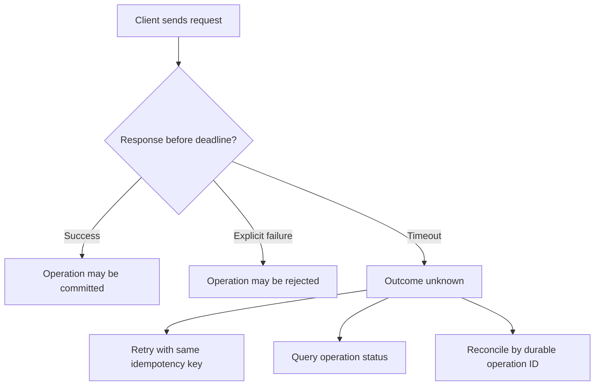

## Consistency models

Consistency defines what reads are allowed to observe after writes. Availability defines whether an operation receives a non-error response. Durability defines whether acknowledged state survives failures. These are separate properties.

| Model | Meaning | Typical use | Risk |
|---|---|---|---|
| Linearizability | Operations appear atomic in real time order. | Locks, registers, metadata, balances, ownership transfer. | Higher latency, reduced availability under partitions. |
| Sequential consistency | Operations appear in one global order, but not necessarily real time order. | Concurrent abstractions where real time visibility is not required. | Can surprise users after visible writes. |
| Causal consistency | Causally related operations are observed in order. | Collaboration, messaging, social feeds. | Concurrent writes still need conflict handling. |
| Read your writes | A client sees its own prior writes. | User profile updates, settings, dashboards. | Requires session stickiness, tokens, or replica lag tracking. |
| Monotonic reads | A client does not move backward in observed state. | Sessions reading replicas. | Needs version tracking across reads. |
| Monotonic writes | A client's writes are applied in client order. | User workflows with dependent updates. | Requires per-client sequence or single writer routing. |
| Writes follow reads | A write after a read is ordered after the read dependency. | Collaborative edits, workflows. | Requires causal metadata. |
| Eventual consistency | Replicas converge if writes stop and conflicts are resolved. | Search indexes, caches, feeds, analytics projections. | Temporary stale reads and conflict visibility. |
| Strong eventual consistency | Replicas that receive the same updates converge without coordination. | CRDT based collaboration. | Data type must encode merge semantics. |

Design rule: name the consistency promise in product language, then choose the mechanism.

Examples:

- "After the user changes billing email, they immediately see the new value" usually requires read-your-writes.
- "Inventory cannot be sold below zero" usually requires a strongly consistent reservation path or a compensating business process.
- "Search results update within one minute" can usually use eventual consistency with lag monitoring.
- "Two admins cannot both own the same exclusive role" usually requires linearizable compare-and-swap or consensus backed metadata.

## Invariants before mechanisms

Start with invariants. A distributed design is correct only relative to what must always be true.

| Invariant type | Example | Mechanisms that often fit |
|---|---|---|
| Safety | A payment is captured at most once. | Idempotency keys, unique constraints, fencing, transactional outbox. |
| Conservation | Money is neither created nor destroyed. | Double entry ledger, serializable transactions, reconciliation. |
| Ownership | A resource has one active owner. | Consensus, leases with fencing, compare-and-swap. |
| Monotonicity | Order status never moves from shipped back to pending. | State machine validation, version checks. |
| Capacity | Allocated units do not exceed available units. | Reservation service, escrow, bounded counters. |
| Privacy | A tenant cannot read another tenant's data. | Authorization at every boundary, partitioned storage, policy tests. |
| Durability | A confirmed operation survives process or node failure. | Write ahead log, replicated storage, fsync policy, backups. |

Invariant checklist:

- [ ] What must never happen, even during failover?
- [ ] What may happen temporarily but must converge?
- [ ] What can be repaired by compensation?
- [ ] What must be visible to users immediately?
- [ ] What is the source of truth for each invariant?
- [ ] Which component has authority to decide the invariant?
- [ ] Which failures were explicitly considered?

## CAP Theorem

CAP Theorem says that during a network partition, a distributed data system must choose between availability and strong consistency for affected operations.

The practical meaning is narrower and more useful than the slogan:

- Consistency in CAP means linearizability.
- Availability means every request to a non-failing node receives a non-error response.
- Partition tolerance is not optional in real networks.
- The tradeoff applies per operation and per failure domain.

| Choice during partition | Behavior | Suitable when | Example |
|---|---|---|---|
| CP | Reject or block operations that cannot be safely ordered. | Incorrect acceptance is worse than temporary unavailability. | Lock service, metadata store, payment capture. |
| AP | Accept operations and reconcile later. | Availability is more important than immediate global agreement. | Shopping cart, likes, local-first notes. |
| Mixed | Some operations block, others continue. | Invariants differ by operation. | Place order blocks on inventory, browse catalog continues. |

CAP design questions:

- Which exact operation is partitioned?
- Which nodes can still communicate?
- Which invariant would be violated by accepting writes on both sides?
- Is stale read acceptable?
- Can the system expose degraded mode explicitly?
- How will reconciliation happen after healing?

## PACELC

PACELC extends CAP by describing the normal case tradeoff:

- If partition, choose availability or consistency.
- Else, choose latency or consistency.

| System posture | Partition case | Normal case | Common result |
|---|---|---|---|
| PC/EC | Prefer consistency during partitions, prefer consistency otherwise. | Higher latency, stronger guarantees. | Consensus metadata, strongly consistent databases. |
| PC/EL | Prefer consistency during partitions, prefer latency otherwise. | Some operations are strong, read paths may be optimized. | Leader writes with follower reads under bounded staleness. |
| PA/EC | Prefer availability during partitions, prefer consistency otherwise. | Accepts partition writes but coordinates in healthy state. | Some multi-region systems with conflict repair. |
| PA/EL | Prefer availability during partitions, prefer latency otherwise. | Fast local operations, more reconciliation. | Highly available caches, local-first applications. |

Mistake to avoid: using CAP as a slogan. The useful question is which operation, which partition, which invariant, which user-visible behavior.

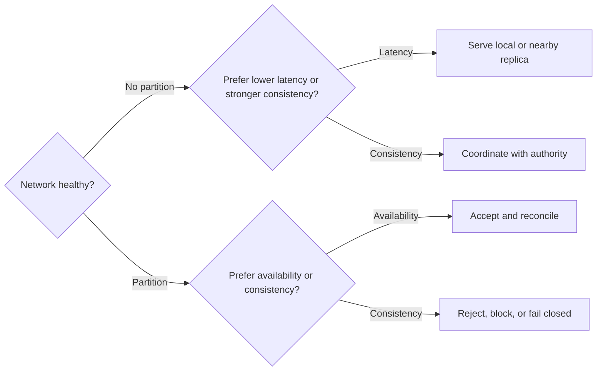

## The clock problem

Distributed systems cannot rely on one perfect global clock. Physical clocks drift. NTP can step time backward or forward. Processes can pause during garbage collection, host suspension, scheduler stalls, or overloaded runtime loops. Network delays are variable and asymmetric.

Clock concepts:

| Clock or mechanism | What it gives | What it does not give | Common use |
|---|---|---|---|
| Wall clock | Human time. | Reliable ordering. | Timestamps, logs, retention, display. |
| Monotonic clock | Non-decreasing elapsed time within one process. | Cross-node ordering. | Timeouts, durations, retry backoff. |
| Lamport clock | Happens-before ordering when one event causally precedes another. | Detection of concurrency. | Event ordering, protocol reasoning. |
| Vector clock | Causality and concurrency across actors. | Compact metadata at high cardinality. | Conflict detection, sync protocols. |
| Hybrid logical clock | Physical time plus logical counter. | Perfect physical accuracy. | Distributed databases, causally informed timestamps. |
| TrueTime style API | Bounded time uncertainty interval. | Zero uncertainty. | External consistency when clocks have bounded skew. |
| Lease | Time bounded authority. | Safety without clock assumptions and fencing. | Leader authority, cache ownership, lock service. |

Clock design rules:

- Use monotonic time for durations and timeouts.
- Treat wall clock as input data, not proof of ordering.
- Use fencing tokens when stale holders can perform writes.
- Do not use timestamps alone for correctness critical conflict resolution unless data loss is acceptable.
- Record both event time and ingestion time when debugging pipelines.
- Make clock skew visible in metrics and alerts.

## Happens-before

The happens-before relation captures causal ordering:

- Within one process, earlier events happen before later events.
- Sending a message happens before receiving that message.
- The relation is transitive.
- If neither event happens before the other, the events are concurrent.

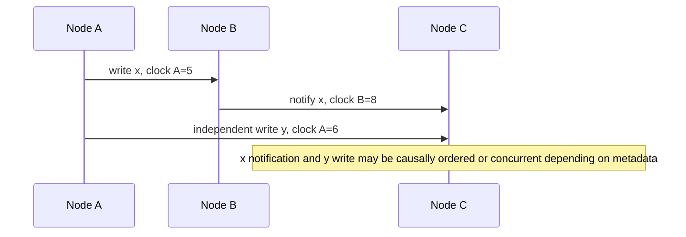

## Lamport clocks

A Lamport clock is a logical counter:

1. Each node keeps an integer counter.
2. Before each local event, increment the counter.
3. Send the counter with each message.
4. On receive, set local counter to max(local, received) + 1.

If event A happened before event B, then Lamport(A) &lt; Lamport(B). The converse is not guaranteed. If Lamport(A) &lt; Lamport(B), A may or may not have caused B.

| Benefit | Limitation |
|---|---|
| Simple and compact. | Cannot detect concurrency. |
| Good for total ordering with tie breakers. | Tie breaker order may be arbitrary, not causal. |
| Useful in protocols and logs. | Does not represent real time. |

Example tie breaker:

```text
ordered_event_id = (lamport_counter, node_id)
```

This creates a deterministic total order, but it does not mean the earlier tuple happened first in physical time.

## Vector clocks

A vector clock tracks one counter per participant. It can tell whether one event causally dominates another or whether two events are concurrent.

Comparison:

| Relationship | Condition | Meaning |
|---|---|---|
| A before B | Every component of A &lt;= B and at least one component is lower. | B has observed A causally. |
| B before A | Every component of B &lt;= A and at least one component is lower. | A has observed B causally. |
| Concurrent | Neither vector dominates the other. | Both updates must be merged or resolved. |
| Equal | All components equal. | Same causal history. |

Vector clock example:

| Version | Node A | Node B | Node C | Interpretation |
|---|---:|---:|---:|---|
| v1 | 1 | 0 | 0 | A wrote once. |
| v2 | 1 | 1 | 0 | B observed v1 and wrote. |
| v3 | 1 | 0 | 1 | C observed v1 and wrote independently of B. |

Comparison of v2 and v3:

| Version | Vector | Relationship |
|---|---|---|
| v2 | [1, 1, 0] | Concurrent with v3. |
| v3 | [1, 0, 1] | Concurrent with v2. |

Vector clocks are valuable when conflict detection matters more than compact metadata. They become expensive when the number of writers is large or unbounded.

## Hybrid logical clocks

Hybrid logical clocks combine physical time with a logical counter. They preserve causal ordering while keeping timestamps close to wall clock time.

Typical representation:

```text
hlc = (physical_millis, logical_counter, node_id)
```

Use cases:

- Distributed SQL timestamp ordering.
- Change data capture ordering.
- Multi-region replication with causality hints.
- Debugging when physical time proximity is useful.

Design cautions:

- HLC still depends on clock discipline for its physical component.
- HLC does not remove the need for conflict resolution.
- HLC does not prove a remote physical event happened before another unless the protocol supplies bounds.

## Leases

A lease is time bounded authority. A holder may act until the lease expires. Leases are attractive because they reduce coordination, but they are dangerous when used as correctness proof without fencing.

Lease risks:

| Risk | Scenario | Mitigation |
|---|---|---|
| Clock skew | Holder thinks lease is valid, coordinator thinks it expired. | Conservative expiry, bounded skew assumptions, monotonic clocks. |
| Process pause | Holder pauses longer than lease, resumes and writes stale data. | Fencing tokens checked by storage. |
| Network delay | Renew request arrives late or duplicate arrives after new lease. | Epoch based renewals and compare-and-swap. |
| Split brain | Two nodes believe they hold authority. | Quorum lease service, fencing, single writer enforcement. |

Lease checklist:

- [ ] What clock is used for local duration measurement?
- [ ] What maximum skew or pause assumption is required?
- [ ] Does the downstream resource verify fencing tokens?
- [ ] Can a stale holder still perform side effects?
- [ ] Is renewal idempotent?
- [ ] What happens when the lease service is unavailable?

## Fencing tokens

A fencing token is a monotonically increasing value issued when authority is granted. Every operation sent to a protected resource includes the token. The resource rejects operations with tokens older than the highest token it has already seen.

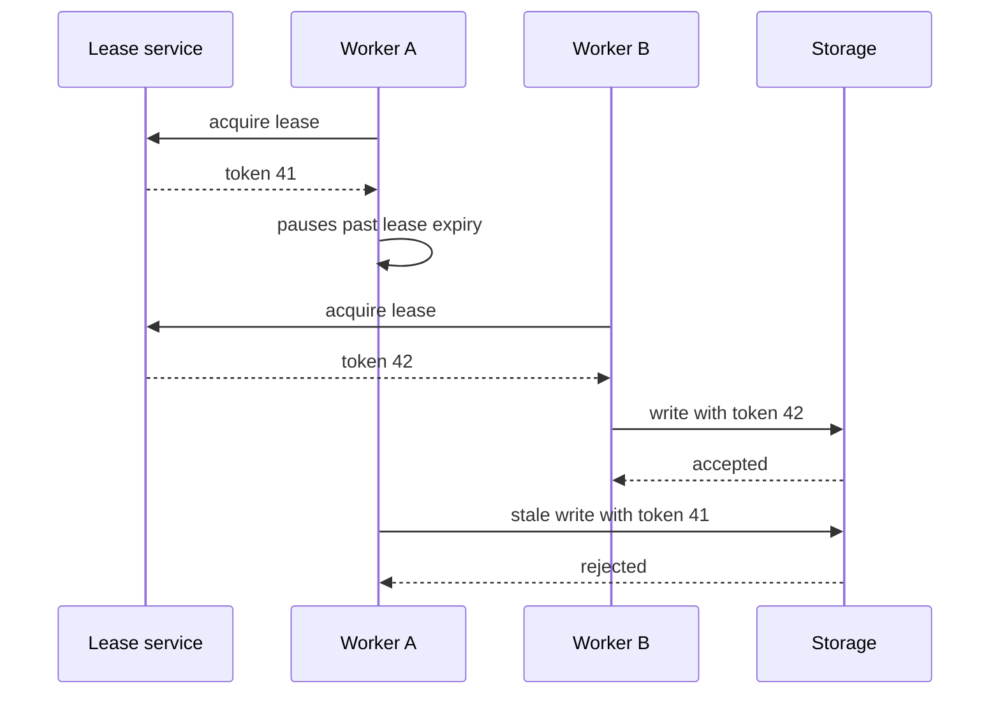

Fencing is required when stale actors can reach the resource after losing authority. A lease without fencing is often only a performance optimization, not a safety mechanism.

## Consensus algorithms

Consensus lets nodes agree on a value despite failures. Replicated state machines use consensus to agree on an ordered log of commands.

Core properties:

| Property | Meaning |
|---|---|
| Agreement | Correct nodes decide the same value. |
| Validity | Decided values were proposed according to the protocol. |
| Termination | Correct nodes eventually decide under required assumptions. |
| Integrity | A node decides at most once for a given consensus instance. |
| Quorum intersection | Any two decision quorums overlap in at least one correct participant. |

Consensus is usually needed for:

- Leader election.
- Membership changes.
- Metadata updates.
- Distributed locks.
- Exactly one active controller.
- Replicated logs.
- Configuration changes that must not diverge.

Consensus is usually not needed for:

- Best effort telemetry.
- Derived search indexes.
- Caches that can be rebuilt.
- Idempotent asynchronous side effects.
- Data where merge semantics are explicit and acceptable.

## Replicated state machines

A replicated state machine executes the same deterministic commands in the same order on multiple replicas.

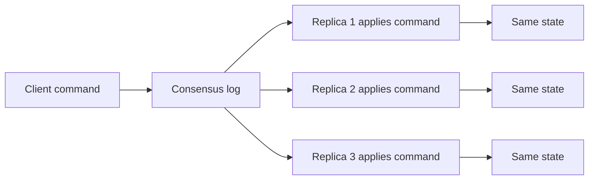

Requirements:

- Deterministic command execution.
- Same command order on all replicas.
- Durable log.
- Snapshot strategy.
- Membership change protocol.
- Idempotent client handling.
- Clear commit index.
- Replay compatibility across software versions.

Non-determinism to avoid:

| Source | Problem | Fix |
|---|---|---|
| Local wall clock | Replicas compute different values. | Put timestamp in the log entry. |
| Random numbers | Replicas diverge. | Log seed or generated value. |
| External API call | Replay changes behavior. | Execute side effects outside the state machine through an outbox. |
| Map iteration order | Different runtimes produce different order. | Sort keys or use deterministic structures. |
| Floating point differences | Different platforms round differently. | Use integer or decimal arithmetic for critical state. |

## Raft

Raft is a consensus algorithm designed for understandability. It separates leader election, log replication, and safety rules.

Raft roles:

| Role | Behavior |
|---|---|
| Follower | Responds to leader and candidate requests. |
| Candidate | Starts election after election timeout. |
| Leader | Accepts client commands, replicates log entries, advances commit index. |

Key Raft concepts:

- Term: monotonically increasing election epoch.
- Election timeout: randomized timeout that reduces split votes.
- Heartbeat: AppendEntries message without log entries.
- Log index: position in the replicated log.
- Commit index: highest log entry known to be committed.
- Leader completeness: a leader contains all committed entries from previous terms.
- Joint consensus: safe membership change by overlapping old and new quorums.

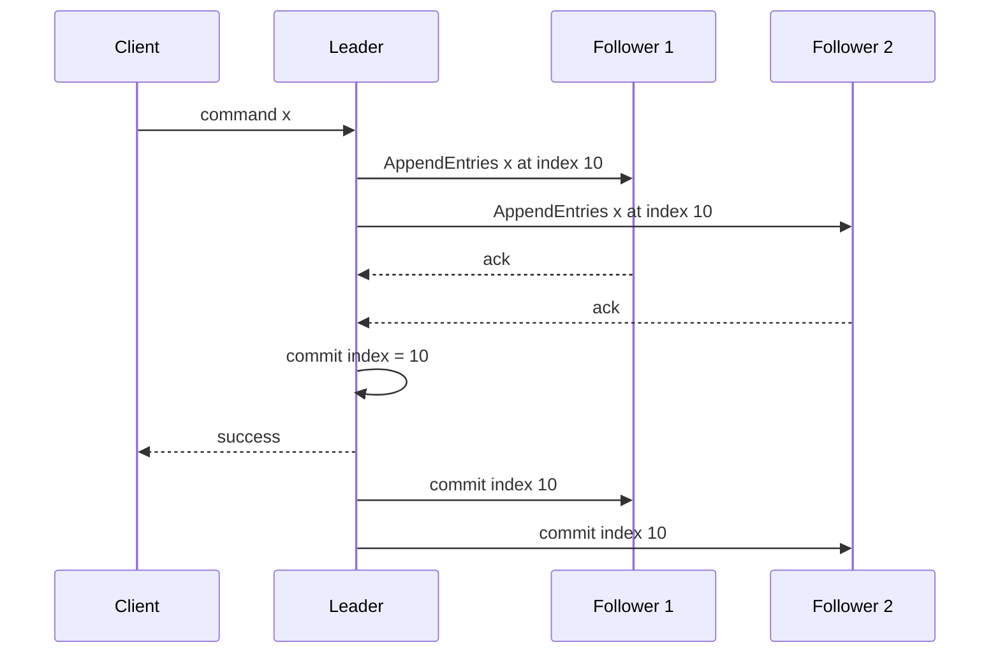

Raft failure handling:

| Failure | Expected behavior |
|---|---|
| Leader crashes before replication | Command is not committed and client must retry. |
| Leader crashes after majority replication | New leader must preserve the committed entry. |
| Follower falls behind | Leader sends missing entries or snapshot. |
| Split vote | Candidates time out and retry with higher term. |
| Stale leader receives request | It steps down after observing higher term or fails to contact quorum. |
| Membership change interrupted | Joint consensus prevents independent majorities. |

Raft implementation checklist:

- [ ] Election timeouts are randomized and larger than heartbeat interval.
- [ ] Persistent state is flushed before responses that rely on it.
- [ ] Log matching property is enforced with previous index and term.
- [ ] Client commands include deduplication identity.
- [ ] Snapshots include last included index and term.
- [ ] Membership changes use a safe transition protocol.
- [ ] Linearizable reads use leader lease only with valid assumptions or use quorum read.

## Paxos and Multi-Paxos

Paxos is a family of consensus protocols based on ballots and quorum intersection. It is harder to understand than Raft but deeply influential.

Classic Paxos roles:

| Role | Responsibility |
|---|---|
| Proposer | Suggests a value with a ballot number. |
| Acceptor | Promises and accepts values according to ballot rules. |
| Learner | Learns the chosen value after quorum acceptance. |

Classic Paxos phases:

| Phase | Action | Purpose |
|---|---|---|
| Prepare | Proposer asks acceptors to promise not to accept lower ballots. | Establish authority for a ballot. |
| Promise | Acceptors return prior accepted values, if any. | Preserve safety across retries. |
| Accept | Proposer asks acceptors to accept a value. | Drive a value toward quorum. |
| Learn | Learners observe quorum accepted value. | Publish decision. |

Safety intuition:

- Any two majorities intersect.
- A new proposer must learn accepted values from a quorum.
- If a value might already have been chosen, later ballots must preserve it.

Multi-Paxos optimizes repeated consensus by using a stable leader. After leadership is established, the leader can skip repeated prepare phases for new log slots until leadership changes.

Paxos cautions:

- The single decree protocol is not a full database.
- Production systems need log management, reconfiguration, snapshots, flow control, and operator tooling.
- Liveness can suffer under dueling proposers.
- Correctness depends on stable persistent promises and accepted values.

## Consensus family comparison

| Protocol | Strength | Complexity | Common use |
|---|---|---|---|
| Raft | Understandable replicated log. | Moderate. | etcd, Consul style metadata stores. |
| Multi-Paxos | Mature consensus foundation. | High. | Distributed databases and storage systems. |
| Zab | Atomic broadcast with primary. | Moderate to high. | ZooKeeper. |
| Viewstamped Replication | Primary backup consensus family. | Moderate. | Academic and practical consensus design. |
| EPaxos | Lower latency for non-conflicting commands. | High. | Specialized leaderless consensus workloads. |
| Byzantine fault tolerant consensus | Tolerates malicious or arbitrary faults. | Very high. | Permissioned ledgers, adversarial settings. |

## Replication

Replication copies data or commands across nodes. It improves availability, durability, locality, and read scale, but it introduces lag, conflict, failover complexity, and operational ambiguity.

Replication forms:

| Form | Description | Strength | Risk |
|---|---|---|---|
| Leader follower | One leader accepts writes, followers replicate. | Simple write ordering. | Leader bottleneck and failover window. |
| Multi-leader | Multiple leaders accept writes. | Local writes across regions. | Conflicts and complex reconciliation. |
| Leaderless | Clients coordinate reads and writes across replicas. | High availability. | Read repair, hinted handoff, conflict resolution. |
| Statement replication | Replicate SQL or commands. | Compact. | Non-determinism can diverge replicas. |
| Row replication | Replicate changed rows. | More deterministic. | Schema and ordering concerns. |
| Physical replication | Replicate storage pages or log bytes. | Close copy of source. | Less flexible across versions or formats. |
| Logical replication | Replicate semantic changes. | Flexible integrations. | Requires schema and ordering discipline. |
| Event sourced projection | Replicate events into derived views. | Replayable and auditable. | Projection lag and poison events. |

Replication topology:

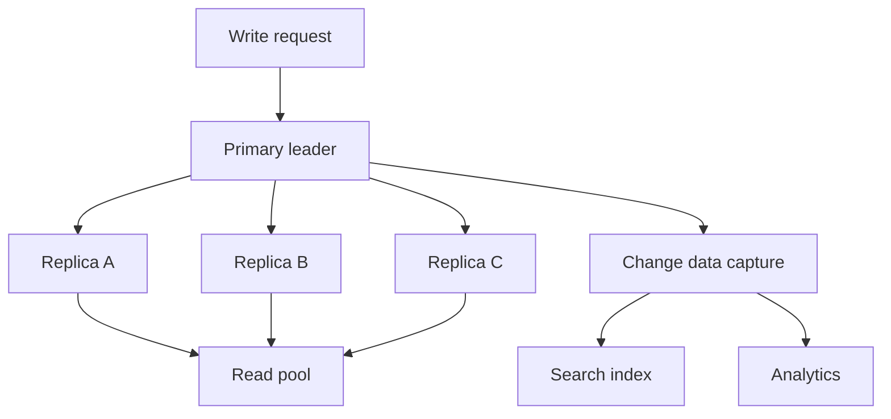

Replication questions:

- Can replicas diverge?
- Who accepts writes?
- What happens on failover?
- What reads can go to replicas?
- How is lag measured?
- How is conflict resolved?
- Is acknowledgement synchronous, asynchronous, or semi-synchronous?
- Are schema changes replicated safely?
- How is bootstrap performed for a new replica?
- How are corrupted replicas detected and rebuilt?

## Synchronous and asynchronous replication

| Mode | Commit condition | Benefit | Failure tradeoff |
|---|---|---|---|
| Synchronous | Leader waits for required replicas before success. | Stronger durability and failover safety. | Higher latency and lower availability. |
| Semi-synchronous | Leader waits for at least one replica or limited condition. | Middle ground. | Edge cases still need clear commit semantics. |
| Asynchronous | Leader acknowledges before replicas apply. | Low latency. | Acknowledged writes may be lost on failover. |

Design rule: client success must mean something precise. If success means "accepted by leader memory", "fsynced locally", "replicated to quorum", or "visible in all regions", say so explicitly.

## Quorums

Quorum systems require agreement from a subset of nodes.

Common formula:

- N: replica count.
- W: write acknowledgements.
- R: read acknowledgements.
- If R + W &gt; N, reads intersect with writes.

Examples:

| N | W | R | Behavior |
|---:|---:|---:|---|
| 3 | 2 | 2 | Majority reads and writes, tolerates one failed replica. |
| 3 | 3 | 1 | Fast reads, slow writes, no write availability if one replica fails. |
| 5 | 3 | 3 | Majority quorum, tolerates two failed replicas for reads or writes. |
| 5 | 1 | 5 | Fast writes, expensive reads, weak write durability until repair. |
| 5 | 2 | 2 | R + W &lt;= N, reads may miss recent writes. |

Quorum risks:

- Sloppy quorum can acknowledge writes outside the normal replica set.
- Read repair can hide inconsistency until reads occur.
- Clock based last-write-wins can lose causally valid writes.
- Quorum success does not guarantee application invariant correctness.
- Membership changes can break intersection if old and new quorums do not overlap.
- Correlated failures can defeat nominal replica counts.

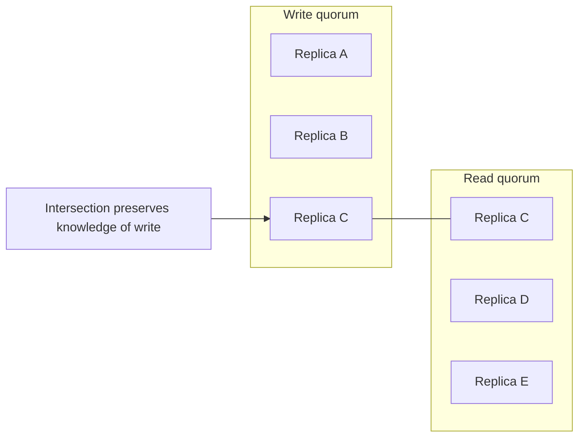

## Conflict resolution

Conflicts occur when two or more updates are accepted without a single ordering authority.

Conflict strategies:

| Strategy | How it works | Good for | Risk |
|---|---|---|---|
| Last write wins | Pick highest timestamp or version. | Caches, presence, replaceable values. | Silently loses writes. |
| Application merge | Domain code combines concurrent versions. | Documents, carts, preferences. | Requires careful UX and tests. |
| CRDT | Data type guarantees convergence under merge. | Counters, sets, collaborative structures. | More complex data modeling. |
| Operational transform | Transform concurrent edits. | Text collaboration. | Hard correctness model. |
| Manual resolution | Human chooses or edits final value. | Rare business conflicts. | Operational cost and delay. |
| Reject on conflict | Require client to reread and retry. | Admin forms, inventory, metadata. | Lower availability under contention. |

Conflict design checklist:

- [ ] Can concurrent writes happen?
- [ ] Is silent loss acceptable?
- [ ] Does the merge preserve business invariants?
- [ ] Is conflict metadata stored durably?
- [ ] Can users understand and repair conflicts?
- [ ] Are retries safe after conflict response?
- [ ] Are conflict rates measured?

## CRDTs

Conflict free replicated data types encode merge rules that are associative, commutative, and idempotent.

| CRDT | Meaning | Example use |
|---|---|---|
| G-counter | Grow only counter. | Likes or local increments where decrement is not needed. |
| PN-counter | Positive and negative counters. | Distributed counters with increments and decrements. |
| G-set | Grow only set. | Observed event IDs. |
| OR-set | Observed remove set. | Add and remove with causal tags. |
| LWW-register | Register resolved by timestamp. | Replaceable value where loss is acceptable. |
| MV-register | Multi-value register keeps concurrent values. | Conflict surfacing. |

CRDTs are not magic. They move complexity into data type design and domain semantics.

## Idempotency and retries

Distributed systems turn timeout into ambiguity. If a client times out, the operation may have failed, succeeded, or still be running.

Required tools:

- Idempotency key.
- Client generated operation ID.
- Deduplication table.
- Stable response replay.
- Outbox for side effects.
- Inbox for consumers.
- Retry budget.
- Exponential backoff with jitter.
- Deadlines propagated across calls.
- Circuit breakers for persistent dependency failure.

Idempotency states:

| State | Meaning | Response |
|---|---|---|
| Missing | No record for key. | Attempt operation and persist result. |
| In progress | Another attempt is executing. | Return 409, 202, or wait with deadline. |
| Succeeded | Operation completed. | Replay stable success response. |
| Failed retryable | Attempt failed before commit. | Allow retry with same key. |
| Failed final | Operation rejected by business rule. | Replay stable failure response. |

Retry checklist:

- [ ] Is the operation safe to retry with the same key?
- [ ] Does the server deduplicate before side effects?
- [ ] Is the response stable across duplicate attempts?
- [ ] Is there a retry budget?
- [ ] Is jitter used to avoid synchronized retries?
- [ ] Are deadlines shorter than upstream timeouts?
- [ ] Are non-retryable errors classified clearly?
- [ ] Does the caller stop retrying when cancellation is requested?

Retry storm pattern:

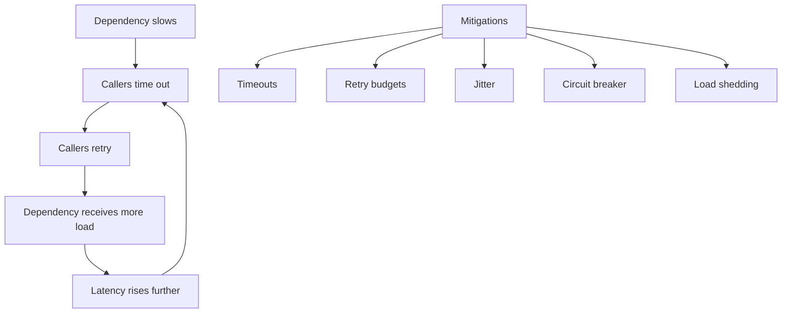

## Outbox and inbox patterns

The outbox pattern records state changes and outbound messages in the same local transaction. A relay later publishes the messages.

The inbox pattern records consumed message IDs before or while applying consumer effects, allowing duplicate delivery to be ignored.

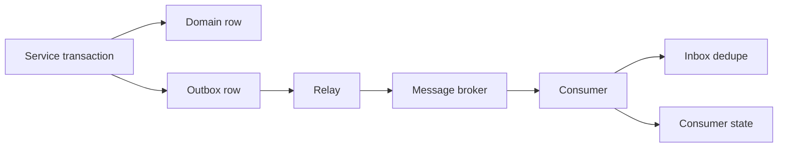

Use these patterns when exactly-once delivery is requested. Most practical systems implement at-least-once delivery plus idempotent effects.

## Split brain

Split brain occurs when two or more nodes believe they have exclusive authority. It is usually caused by partitions, stale leases, unsafe failover, or independent control planes.

Split brain examples:

| System | Split brain symptom | Consequence |
|---|---|---|
| Database primary | Two primaries accept writes. | Divergent data and hard reconciliation. |
| Job scheduler | Two schedulers run exclusive job. | Duplicate side effects. |
| Lock service | Two clients hold same lock. | Corrupted shared resource. |
| Cluster controller | Multiple controllers mutate same objects. | Flapping and lost updates. |
| Storage volume | Two nodes mount writeable volume. | Filesystem corruption. |

Prevention techniques:

- Quorum based leader election.
- Fencing tokens on all writes.
- Storage level single writer enforcement.
- STONITH or power fencing in infrastructure clusters.
- Monotonic epochs embedded in commands.
- Fail closed when quorum is lost.
- Avoid manual force promotion unless the old leader is fenced.

Split brain checklist:

- [ ] What proves the old leader cannot write?
- [ ] What rejects stale epochs?
- [ ] Can both sides reach a shared dependency?
- [ ] Can an operator accidentally force two primaries?
- [ ] Are clients pinned to stale endpoints?
- [ ] Is DNS or load balancer state slower than failover?

## Network partitions

A partition is not always a clean cut. It can be asymmetric, protocol specific, intermittent, or regional.

Partition scenarios:

| Scenario | Description | Design concern |
|---|---|---|
| Clean partition | Group A cannot talk to group B. | Which side has quorum? |
| Asymmetric reachability | A can reach B but B cannot reach A. | Heartbeats can lie. |
| Partial port failure | HTTP works, replication port fails. | Health checks miss data plane failure. |
| DNS partition | Name resolution fails while IP connectivity works. | Clients fail differently by cache state. |
| Regional isolation | A region cannot reach another region. | Local availability vs global invariants. |
| Packet loss | Messages arrive sometimes with high latency. | Retries and retransmits increase load. |
| Blackhole | Traffic is accepted but never answered. | Timeouts dominate recovery time. |

Partition response matrix:

| Operation | Partition behavior | Reason |
|---|---|---|
| Read public catalog | Serve stale local copy. | Availability matters and data is low risk. |
| Update payment method | Require authoritative region or quorum. | Incorrect update can affect billing. |
| Place inventory reservation | Coordinate with inventory authority. | Oversell violates capacity invariant. |
| Add item to cart | Accept locally and merge later. | User value is high and conflicts are manageable. |
| Acquire cluster leadership | Require quorum. | Split brain is worse than downtime. |

## Advanced networking

Advanced networking topics every Staff engineer should understand:

- TCP handshake, congestion control, retransmission, slow start.
- TLS handshake, certificates, mTLS, session resumption.
- DNS caching, TTLs, split horizon, negative caching.
- HTTP/1.1 vs HTTP/2 vs HTTP/3.
- gRPC transport, deadlines, cancellation, streaming flow control.
- Load balancing: L4, L7, client side, server side, consistent hashing.
- NAT, conntrack, ephemeral port exhaustion.
- Backpressure across network boundaries.
- Head-of-line blocking.
- Packet loss vs latency vs jitter.
- Anycast and regional routing.
- Service discovery and health checking.
- Network partitions and asymmetric reachability.
- MTU, fragmentation, path MTU discovery.
- Keepalive behavior and idle connection timeouts.
- SYN backlog, accept queue, connection pool exhaustion.
- Kernel socket buffers and application read loops.

Networking failure table:

| Symptom | Possible cause | Investigation |
|---|---|---|
| Periodic request spikes | DNS TTL expiry or synchronized refresh. | Compare latency with DNS cache events. |
| Random connection resets | Load balancer idle timeout or deploy churn. | Inspect connection age and upstream logs. |
| Slow first request | TLS handshake, cold connection pool, DNS lookup. | Break down timing by phase. |
| High tail latency | Packet loss, queueing, overloaded dependency. | Check retransmits, saturation, queue depth. |
| Works by IP not name | DNS, search suffix, split horizon, stale cache. | Query authoritative and local resolvers. |
| Some clients fail | NAT, conntrack, regional route, MTU. | Segment by source, path, and protocol. |
| gRPC stream stalls | Flow control, proxy timeout, head-of-line blocking. | Inspect stream windows and proxy config. |

## Failure patterns

| Pattern | Description | Mitigation |
|---|---|---|
| Split brain | Multiple authorities act at once. | Quorum, fencing, fail closed. |
| Retry storm | Retrying callers overload a weak dependency. | Retry budgets, jitter, circuit breakers. |
| Thundering herd | Many clients wake or refresh at once. | Jitter, request coalescing, leases. |
| Cache stampede | Hot cache key expires and all callers recompute. | Soft TTL, single flight, early refresh. |
| Hot partition | One shard or key receives disproportionate traffic. | Sharding, key salting, adaptive routing. |
| Poison message | One message repeatedly fails consumer processing. | Dead letter queue, quarantine, schema validation. |
| Slow consumer | Consumer lag grows until recovery becomes hard. | Backpressure, autoscaling, compaction, lag alerts. |
| Gray failure | Component passes health checks but fails real work. | Synthetic checks, brownout detection, load shedding. |
| Cascading failure | One failure causes dependent failures. | Bulkheads, graceful degradation, dependency budgets. |
| Coordinated omission | Measurements hide time spent waiting to send work. | External load generation, corrected latency histograms. |
| Clock skew incident | Time assumptions break ordering or expiry. | Clock monitoring, monotonic durations, fencing. |
| Control plane overload | Management path fails and blocks recovery. | Rate limits, priority queues, emergency access. |

## Failure scenario analysis

Use scenario analysis before productionizing a distributed workflow.

| Scenario | Questions to answer |
|---|---|
| Client times out after server commits | Can the client retry without duplicate side effects? |
| Leader commits then crashes before response | Will the new leader preserve and reveal the committed command? |
| Follower serves stale read | Is stale data acceptable for this endpoint? |
| Message broker redelivers | Is the consumer idempotent? |
| Outbox relay publishes twice | Can subscribers dedupe? |
| Region is isolated | Which operations continue locally? |
| Clock moves backward | Do expirations, leases, and ordering still behave? |
| Schema deploy is halfway done | Can old and new versions both process replicated data? |
| Queue backlog grows | Is there backpressure or admission control? |
| Operator force promotes a replica | What prevents the old primary from writing? |

## Practical design example: payment capture

Payment capture is a safety critical workflow. Duplicate capture is unacceptable. Delayed capture may be acceptable. Availability is less important than preventing double charge.

Recommended posture:

- Use an idempotency key per capture attempt.
- Persist payment state transition and outbox message in one transaction.
- Use a unique constraint on provider operation ID or business operation ID.
- Treat provider timeout as unknown.
- Reconcile with provider by operation ID.
- Never retry with a new key unless creating a distinct business operation.

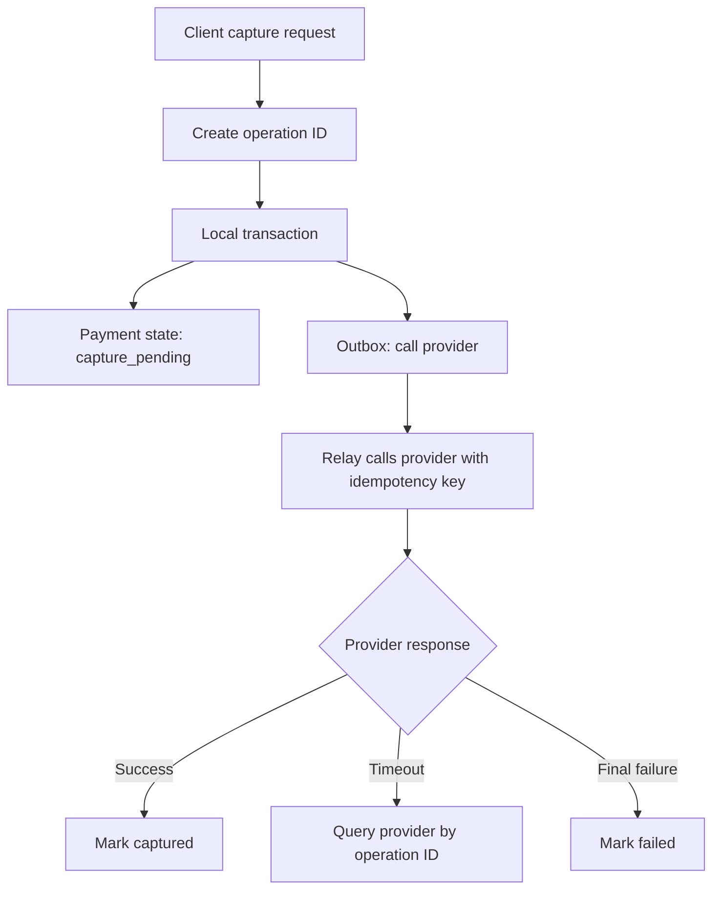

Correctness target:

| Invariant | Mechanism |
|---|---|
| Capture at most once | Idempotency key, unique operation record, provider idempotency. |
| Local state matches provider eventually | Reconciliation job. |
| User sees stable result | Operation status endpoint. |
| Side effects are not lost | Transactional outbox. |

## Practical design example: inventory reservation

Inventory reservation has a capacity invariant: confirmed reservations must not exceed available stock.

Design options:

| Option | Behavior | Tradeoff |
|---|---|---|
| Single authoritative region | All reservations go through one region. | Simple invariant, higher remote latency. |
| Consensus backed counter | Reservation requires quorum. | Stronger availability than single node, still latency sensitive. |
| Escrow per region | Allocate regional quotas. | Fast local reservations, complex rebalancing. |
| Optimistic accept and compensate | Accept orders then cancel if oversold. | High availability, poor user experience for scarce goods. |

Reservation checklist:

- [ ] Is oversell impossible or merely compensated?
- [ ] Is stock decremented at reserve, pay, or ship time?
- [ ] Do reservations expire?
- [ ] Are expirations safe under clock skew?
- [ ] Can cancellation and payment race?
- [ ] Is each state transition monotonic?

## Practical design example: distributed job scheduler

An exclusive job scheduler must avoid duplicate execution when jobs have non-idempotent side effects.

Recommended posture:

- Use consensus or database compare-and-swap for job ownership.
- Issue fencing token for each lease acquisition.
- Include token in writes to job result storage.
- Make job steps idempotent where possible.
- Store heartbeats and progress durably.
- Prefer resumable jobs over long invisible critical sections.

Scheduler state machine:

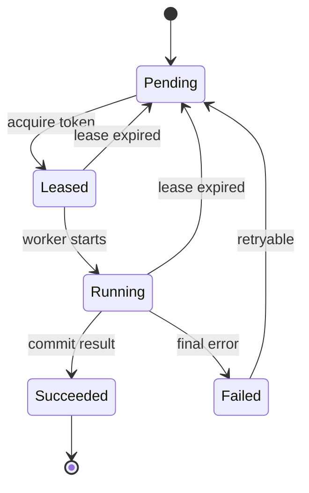

## Practical design example: multi-region user profile

User profile writes often want low latency, but different fields have different invariants.

| Field | Suggested consistency | Reason |
|---|---|---|
| Display name | Last write wins or version check. | Low safety risk. |
| Email address | Stronger validation and uniqueness check. | Identity and notifications depend on it. |
| Marketing preferences | Per-field merge. | Independent toggles can merge safely. |
| Account deletion | Strong global marker. | Must dominate later writes. |
| Security settings | Authoritative region or quorum. | Incorrect stale writes are dangerous. |

Pattern: classify fields by invariant instead of assigning one consistency model to the whole object.

## Operational checklists

### Design review checklist

- [ ] The system names its safety invariants.
- [ ] Each operation has a documented consistency model.
- [ ] Timeouts are shorter than caller deadlines.
- [ ] Retries have budgets and jitter.
- [ ] All non-idempotent operations have idempotency keys.
- [ ] Every async side effect has an outbox, inbox, or equivalent dedupe mechanism.
- [ ] Replication lag is measured and visible.
- [ ] Failover semantics are documented.
- [ ] Split brain prevention has been tested.
- [ ] Clock assumptions are explicit.
- [ ] Backpressure exists at every queue and RPC boundary.
- [ ] Reconciliation exists for every eventually consistent path.

### Production readiness checklist

- [ ] Dashboards show request rate, error rate, saturation, and tail latency.
- [ ] Dashboards show quorum health, leader changes, and replication lag.
- [ ] Alerts distinguish user impact from internal redundancy loss.
- [ ] Runbooks cover leader loss, partition, lag, replay, and bad deploy.
- [ ] Load tests include dependency latency and packet loss.
- [ ] Chaos tests include process pause and asymmetric partition where feasible.
- [ ] Backups are restored regularly.
- [ ] Schema migrations are compatible with old and new writers.
- [ ] Idempotency storage has retention and capacity planning.
- [ ] Dead letter queues have ownership and replay procedure.
- [ ] Manual override procedures include fencing checks.

### Incident debugging checklist

- [ ] Establish timeline using monotonic durations where available.
- [ ] Separate event time from ingestion time.
- [ ] Identify first failing dependency, not only loudest symptom.
- [ ] Check recent deploys, config changes, and traffic shifts.
- [ ] Check leader changes, elections, and quorum loss.
- [ ] Check DNS, load balancer, TLS, and connection pool metrics.
- [ ] Check retries, queue depth, and consumer lag.
- [ ] Check clock skew and host pauses.
- [ ] Preserve logs before replay or compaction removes evidence.
- [ ] Record which operations may have unknown outcome.

## Rules of thumb

- Prefer one writer when the invariant is strict and write volume permits it.
- Prefer explicit merge when availability matters and conflicts are acceptable.
- Prefer rejecting ambiguous writes over corrupting core invariants.
- Prefer operation IDs over trying to infer duplicate intent from payloads.
- Prefer monotonic state machines over ad hoc status updates.
- Prefer bounded queues with backpressure over unbounded memory growth.
- Prefer boring consensus implementations over custom protocols.
- Prefer durable reconciliation over assuming every message arrives once.
- Prefer testing failover paths before the incident.

## Related notes

- [Design Patterns/Microservices Architecture](/compendium/design-patterns/microservices-architecture)
- <span className="compendium-external-reference" title="Vault-only reference">Event-Driven Architectures and Event Sourcing</span>
- [Design Patterns/Outbox Pattern](/compendium/design-patterns/outbox-pattern)
- [Design Patterns/Saga Pattern for Distributed Transactions](/compendium/design-patterns/saga-pattern-for-distributed-transactions)
- <span className="compendium-external-reference" title="Vault-only reference">kubernetes/Kubernetes</span>
- [06 Caching Queues and Streaming](/compendium/software-engineering/caching-queues-and-streaming)
- [08 Reliability Observability and Operations](/compendium/software-engineering/reliability-observability-and-operations)
- [10 Testing Verification and Quality Bars](/compendium/software-engineering/testing-verification-and-quality-bars)
