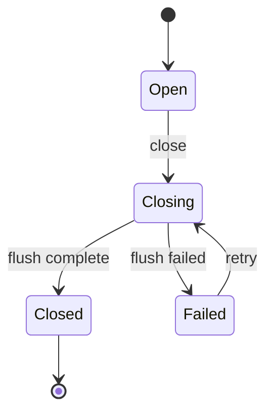
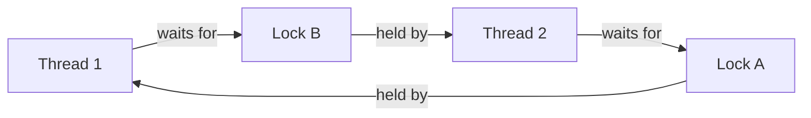
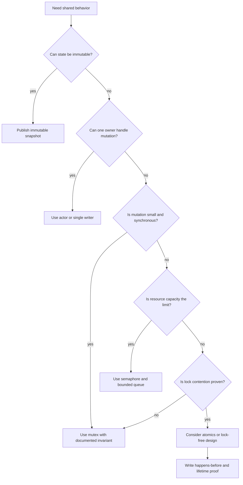

# Engineering Fundamentals

Engineering fundamentals are the ideas that let you predict system behavior below the framework level. They connect source code to runtime behavior: state ownership, memory layout, synchronization, scheduling, resource lifetime, failure handling, and performance under load.

The practical goal is not to know every primitive by name. The goal is to design systems where correctness can be explained before production traffic tests it.

## Mental model

| Layer | Main question | Common failure |
|---|---|---|
| Source code | What does this operation mean? | Ambiguous ownership, hidden side effects. |
| Compiler and runtime | What can be optimized, reordered, suspended, or collected? | Assuming source order is execution order. |
| OS scheduler | Who runs, blocks, wakes, or gets preempted? | Latency spikes, starvation, priority inversion. |
| CPU and memory | Which core sees which writes, and when? | Data races, stale reads, false sharing. |
| Distributed system | Which node owns the truth, and how is failure observed? | Split brain, duplicate effects, lost updates. |

Core invariants:

- Every mutable state cell needs exactly one ownership story.
- Every concurrent interaction needs a synchronization story.
- Every resource needs an acquisition, transfer, and release story.
- Every retryable operation needs an idempotency story.
- Every failure path needs an observability story.

## Advanced programming

Advanced programming is control over abstraction, state, effects, resource lifetime, concurrency, and failure. It is not syntax volume.

### Main concerns

| Concern | Design pressure | Useful question |
|---|---|---|
| Data representation | Layout, identity, value semantics, aliasing, mutability. | Can two references mutate the same object? |
| Control flow | Sync calls, async tasks, callbacks, continuations, cancellation. | Where can this operation pause or reenter? |
| Error handling | Typed errors, exceptions, result values, retries, compensations, panic boundaries. | Which errors are expected and which are fatal? |
| Resource management | Memory, file descriptors, sockets, transactions, locks, thread pools. | Who releases the resource on every path? |
| Type systems | Nominal types, structural types, generics, variance, algebraic data types, phantom types. | Can invalid states be represented? |
| Runtime behavior | GC, JIT, event loop, scheduler, stack, heap, CPU cache, syscalls. | What work is hidden behind this abstraction? |
| API design | Minimal surface, explicit ownership, stable contracts, impossible states. | What misuse does the API make easy? |

### Abstraction boundaries

Good abstractions hide implementation details, not important effects. A storage API can hide SQL syntax, but it should not hide transaction semantics, consistency level, timeout behavior, idempotency requirements, or whether callbacks can run while a lock is held.

Checklist for an abstraction:

- State which component owns mutation.
- State whether calls are synchronous, asynchronous, blocking, or cancellable.
- State whether callbacks can be reentrant.
- State whether operations are idempotent.
- State what ordering is guaranteed.
- State what happens after partial failure.
- State how resources are released.

### Example: explicit ownership

```text
type BufferOwner:
    buffer
    closed = false

    write(bytes):
        require not closed
        buffer.append(bytes)

    close():
        if closed:
            return
        flush(buffer)
        release(buffer)
        closed = true
```

The owner is the only code allowed to mutate `buffer` or call `release`. Other code may receive snapshots or borrowed views, but not shared mutable authority.

## State, identity, and mutability

Hard bugs often come from unclear ownership.

| Concept | Meaning | Engineering consequence |
|---|---|---|
| Value | Replaceable by equal content. | Safe to copy, compare, and persist. |
| Entity | Identity persists across state changes. | Needs versioning and conflict control. |
| Snapshot | Immutable state at a point in time. | Safe to share between threads or tasks. |
| Command | Request to change state. | Must validate intent and permissions. |
| Event | Fact that state changed. | Should be immutable and append-only. |
| Projection | Derived read model. | Can be stale and rebuilt. |
| Capability | Authority to perform an action. | Should be explicit and revocable where possible. |

Design rule: write down the owner for every mutable state cell. If no owner exists, the design is incomplete.

### Ownership patterns

| Pattern | Use when | Risk |
|---|---|---|
| Single writer | One actor owns mutation. | Bottleneck if the owner is too broad. |
| Immutable snapshot | Many readers need consistent state. | Copy cost or stale reads. |
| Borrowed reference | Temporary access without ownership transfer. | Lifetime bugs if the owner outlives assumptions. |
| Message passing | Ownership moves between tasks. | Backpressure and queue growth. |
| Shared lock protected state | Multiple threads need coordinated mutation. | Deadlock and contention. |
| Atomic state | State fits into independent machine words. | Memory ordering mistakes. |

### State transition table

| Current state | Input | Next state | Guard | Side effect |
|---|---|---|---|---|
| Open | Close | Closing | No active writers. | Flush outstanding data. |
| Closing | Flush complete | Closed | All buffers persisted. | Release descriptor. |
| Closing | Flush failed | Failed | Error is not retryable. | Publish failure event. |
| Failed | Retry | Closing | Retry budget remains. | Reopen descriptor. |
| Closed | Write | Closed | Always false. | Reject request. |

State machines make concurrency easier because illegal transitions become visible.



## Concurrency fundamentals

Concurrency is overlapping work. Parallelism is simultaneous execution. Asynchrony is a control-flow style where work may suspend and resume later. These are related but not interchangeable.

| Model | What it optimizes | Typical primitive | Main risk |
|---|---|---|---|
| Threads | CPU parallelism and blocking IO tolerance. | Mutex, condition variable, thread pool. | Data races and scheduling nondeterminism. |
| Event loop | Many mostly idle IO operations. | Future, promise, callback, task. | Blocking the loop, cancellation leaks. |
| Actor model | Local ownership with message passing. | Mailbox, channel, supervisor. | Mailbox overload, ordering assumptions. |
| Data parallelism | Same operation over many items. | Work stealing pool, SIMD, GPU kernel. | Shared accumulator contention. |
| Pipeline | Staged processing. | Bounded queue, backpressure. | Head-of-line blocking. |

### Synchronization decision table

| Need | Prefer | Avoid when |
|---|---|---|
| Protect small shared state | Mutex | Critical section performs blocking IO. |
| Limit concurrent access to a pool | Semaphore | Tasks can be cancelled without releasing permits. |
| Wait for a predicate | Condition variable | Predicate is not protected by the same lock. |
| Publish immutable data once | Atomic pointer or once primitive | Data lifetime is unclear. |
| Transfer work between owners | Bounded channel | Producers cannot handle backpressure. |
| Count events at high frequency | Sharded counters | Exact instant reads are required. |
| Coordinate phases | Barrier | Participants may fail independently. |

## Concurrency primitives

| Primitive | Purpose | Correctness invariant | Failure mode |
|---|---|---|---|
| Mutex | Exclusive access to shared state. | The protected data is accessed only while locked. | Deadlock, priority inversion, lock convoy, hidden contention. |
| Semaphore | Bound concurrent access to a finite resource. | Every acquired permit is released exactly once. | Permit leak, starvation, overload when the limit is wrong. |
| Read write lock | Allow many readers or one writer. | Readers do not mutate, writers exclude all others. | Writer starvation, upgrade deadlock, excessive reader optimism. |
| Condition variable | Wait until a predicate changes. | Waiters check the predicate while holding the lock. | Lost wakeup, spurious wakeup, predicate checked outside lock. |
| Atomic variable | Single-location synchronization. | All shared accesses follow the atomic protocol. | Incorrect memory ordering, ABA problem, false sharing. |
| Channel or queue | Transfer ownership or messages between tasks. | Sender and receiver agree on backpressure and close semantics. | Unbounded memory, blocked producers, dropped work. |
| Barrier | Coordinate phases across workers. | Every participant reaches the barrier or the barrier is broken. | Stragglers, stuck participants, cancellation complexity. |
| Latch | Allow waiters to proceed after a one-time signal. | The signal is monotonic. | Waiters block forever if the signal path fails. |
| Once | Run initialization once. | Initialization result is safely published. | Recursive initialization deadlock. |

Rule: shared mutable state needs a synchronization story. Message passing still has shared state, but it moves ownership boundaries.

## Mutexes

A mutex serializes access to a critical section. It protects an invariant, not a line of code.

```text
mutex m
state balance = 0

deposit(amount):
    lock(m)
    try:
        require amount > 0
        balance = balance + amount
    finally:
        unlock(m)
```

The lock and the protected data should have the same scope. A global mutex protecting unrelated data creates artificial contention and makes deadlocks harder to reason about.

### Mutex checklist

- Name the invariant protected by the lock.
- Keep the critical section small and nonblocking.
- Do not call unknown callbacks while holding the lock.
- Do not perform network IO while holding the lock.
- Use `try/finally`, RAII, `defer`, or scoped guards to guarantee unlock.
- Define a global order for multiple locks.
- Document whether lock acquisition is fair, timed, interruptible, or cancellable.

### Lock granularity

| Strategy | Benefit | Cost |
|---|---|---|
| Coarse lock | Simple invariants. | Lower concurrency, convoy risk. |
| Fine-grained locks | Higher concurrency. | More deadlock surfaces. |
| Lock striping | Reduces contention by partitioning state. | Cross-stripe operations are complex. |
| Immutable copy and swap | Readers avoid locking. | Copy cost and atomic publication concerns. |
| Single owner task | No shared mutable state across threads. | Queue latency and owner bottleneck. |

## Semaphores

A semaphore controls access to a finite resource. It does not protect state by itself.

```text
semaphore permits = 8

handle_request(req):
    acquire(permits)
    try:
        return call_downstream(req)
    finally:
        release(permits)
```

Use semaphores for concurrency limits: database connections, outbound requests, file handles, GPU slots, or expensive CPU work.

### Semaphore failure modes

| Failure | Cause | Prevention |
|---|---|---|
| Permit leak | Cancellation or exception skips release. | Release in finalization scope. |
| Thundering herd | Too many waiters wake at once. | Use bounded queues and fair scheduling. |
| Wrong limit | Limit ignores downstream capacity. | Size from measured bottlenecks. |
| Hidden deadlock | Task holds permit while waiting for work needing another permit. | Avoid nested semaphores or define ordering. |
| Starvation | Unfair wake policy or hot tenant. | Per-tenant limits, fair queues. |

## Condition variables

A condition variable lets threads sleep until a predicate may have changed. The predicate is the important part.

Correct pattern:

```text
mutex m
condition not_empty
queue q

take():
    lock(m)
    try:
        while q.is_empty():
            wait(not_empty, m)
        return q.pop_front()
    finally:
        unlock(m)

put(item):
    lock(m)
    try:
        q.push_back(item)
        notify_one(not_empty)
    finally:
        unlock(m)
```

The waiter uses `while`, not `if`, because wakeups can be spurious and other consumers may take the item first.

### Lost wakeup pattern

```text
bad_take():
    if q.is_empty():
        wait(not_empty)
    return q.pop_front()
```

This is wrong because the predicate is checked outside a lock and can change between the check and the wait.

## Atomics

Atomics provide indivisible operations on a memory location. Atomicity and ordering are different properties.

| Operation | Typical use | Caveat |
|---|---|---|
| Load | Read a shared flag or pointer. | Ordering determines what other data is visible. |
| Store | Publish a flag or pointer. | Must pair with a compatible read. |
| Exchange | Swap state. | Can drop ownership if old value is ignored. |
| Compare and swap | Conditional update. | ABA and retry loops. |
| Fetch add | Counters, ticket locks, sequence numbers. | Contention and overflow. |
| Fence | Ordering without data access. | Easy to misuse, prefer higher-level primitives. |

### Atomic counter

```text
atomic_int count = 0

record_event():
    count.fetch_add(1, relaxed)

read_count():
    return count.load(relaxed)
```

Relaxed ordering is acceptable for a statistical counter when no other data depends on the count. It is not acceptable for publishing object initialization.

### Publish and read initialized data

```text
data payload
atomic_bool ready = false

producer():
    payload = build_payload()
    ready.store(true, release)

consumer():
    if ready.load(acquire):
        use(payload)
```

The release store makes prior writes visible to an acquire load that observes `true`.

## Memory models and ordering

Memory ordering defines what writes become visible to which threads and in what order. Code that works on one CPU, compiler, or runtime can be wrong under a weaker memory model.

### Key concepts

| Concept | Meaning | Practical implication |
|---|---|---|
| Program order | Order written in source code before optimization. | Compilers and CPUs may reorder when allowed. |
| Visibility | Whether a write by one thread can be read by another. | Requires synchronization, not hope. |
| Happens-before | Formal relationship that makes memory effects visible. | Use this as the proof language. |
| Data race | Conflicting accesses without synchronization. | Behavior may be undefined or runtime-specific. |
| Acquire | Prevents following reads and writes from moving before the acquire. | Used by consumers. |
| Release | Prevents preceding reads and writes from moving after the release. | Used by producers. |
| Acq rel | Combines acquire and release for read-modify-write operations. | Useful for queues and state machines. |
| Sequential consistency | Operations appear in one global order. | Easiest to reason about, often more expensive. |
| Relaxed | Atomicity without cross-location ordering. | Good for independent counters and IDs. |
| Fence | Explicit ordering constraint. | Last resort when operations cannot carry ordering. |

### Memory ordering table

| Ordering | Guarantees | Common use | Common mistake |
|---|---|---|---|
| Relaxed | Atomic access to one location only. | Metrics counters, unique IDs. | Assuming it publishes other data. |
| Acquire | Later operations stay after the load. | Reading a readiness flag or pointer. | Loading the wrong flag. |
| Release | Earlier operations stay before the store. | Publishing initialized data. | Writing data after the release. |
| Acquire release | Both sides on read-modify-write. | Lock-free queue indexes. | Forgetting failed CAS ordering. |
| Sequential consistency | Single global order for seq-cst operations. | Simple correctness-first atomics. | Assuming it fixes non-atomic races. |

### Happens-before proof template

Use this checklist when reviewing atomic code:

1. Identify every shared memory location.
2. Mark each access as atomic or protected by a lock.
3. Find the write that initializes the data.
4. Find the release operation after initialization.
5. Find the acquire operation that observes the release.
6. Confirm the consumer reads data only after the acquire.
7. Confirm no non-atomic access races with atomic access.
8. Confirm object lifetime extends through all readers.

### Incorrect publication

```text
payload = build_payload()
ready.store(true, relaxed)

if ready.load(relaxed):
    use(payload)
```

The flag is atomic, but the payload is not safely published. The consumer can observe `ready` without a happens-before edge that makes `payload` visible.

## Cache coherency

Cache coherency is the hardware property that keeps multiple CPU caches consistent for the same memory location. It does not make programs automatically safe.

| Concept | Meaning | Design implication |
|---|---|---|
| Cache line | Unit moved between memory and CPU cache, often 64 bytes. | Independent hot fields can interfere. |
| MESI-style protocols | Modified, exclusive, shared, invalid cache-line states. | Shared writes cause invalidation traffic. |
| Store buffer | Writes may sit before becoming globally visible. | Source order is not enough for visibility. |
| NUMA | Memory access cost depends on CPU and memory locality. | Pinning and locality can matter. |
| Coherency traffic | Protocol work to keep caches consistent. | Hot atomics can become bottlenecks. |
| Memory barrier | Prevents specific reorderings. | Should match the language memory model. |

### False sharing

False sharing happens when independent variables share a cache line and different cores write them frequently.

```text
struct BadCounters:
    atomic_int worker0
    atomic_int worker1
    atomic_int worker2
    atomic_int worker3

struct BetterCounters:
    padded_atomic_int worker0
    padded_atomic_int worker1
    padded_atomic_int worker2
    padded_atomic_int worker3
```

The `BadCounters` fields may live on the same cache line. Each write invalidates the line for other cores even though workers are updating logically independent counters.

### Cache-aware design

- Put hot counters on separate cache lines when contention matters.
- Prefer sharded counters over one global atomic counter.
- Batch updates before touching shared state.
- Keep read-mostly state immutable and publish snapshots.
- Avoid writing to shared progress indicators in tight loops.
- Measure under realistic core counts and CPU topology.

## Lock-free and wait-free programming

Nonblocking algorithms make progress without ordinary locks, but they are not automatically faster or simpler.

| Class | Guarantee | Meaning |
|---|---|---|
| Obstruction-free | One thread makes progress if it runs alone. | Weak progress guarantee. |
| Lock-free | At least one thread makes progress system-wide. | System progresses, individual starvation possible. |
| Wait-free | Every operation finishes in a bounded number of steps. | Strongest guarantee, hardest to design. |

### Building blocks

| Building block | Use | Risk |
|---|---|---|
| Compare and swap | Conditional pointer or state update. | ABA and retry storms. |
| Fetch and add | Counters and ticket allocation. | Hot cache line contention. |
| Atomic pointer swap | Publish replacement structure. | Reclamation of old structure. |
| Version counter | Detect changed state. | Overflow and torn protocols. |
| Hazard pointer | Announce node currently being read. | Per-thread cleanup complexity. |
| Epoch reclamation | Reclaim after all readers leave old epochs. | Stalled readers delay memory reuse. |
| Read copy update | Readers run without locks over old versions. | Writer and reclamation complexity. |

### Compare and swap loop

```text
push(stack, node):
    loop:
        old_head = stack.head.load(acquire)
        node.next = old_head
        if stack.head.compare_exchange(old_head, node, release, relaxed):
            return
```

This is only a sketch. A real stack also needs safe memory reclamation. Without it, another thread can read a node that has already been freed and reused.

### ABA problem

The ABA problem occurs when a location changes from `A` to `B` and back to `A`. A compare-and-swap sees `A` and assumes nothing changed.

Mitigations:

- Pair pointers with version counters.
- Use tagged pointers where alignment leaves spare bits.
- Use hazard pointers to prevent reuse while readers exist.
- Use epoch-based reclamation.
- Prefer tested library algorithms over custom lock-free structures.

### When lock-free is appropriate

Use lock-free algorithms when:

- Profiling shows lock contention is a real bottleneck.
- Blocking inside a critical path is unacceptable.
- The data structure is small enough to reason about formally.
- Memory reclamation is solved.
- There is a stress test that runs under high contention.

Avoid lock-free algorithms when:

- A simple mutex meets latency requirements.
- The team cannot maintain the memory ordering proof.
- Object lifetime is complex.
- Fairness matters more than aggregate throughput.

## Deadlocks, livelocks, starvation, and priority inversion

| Failure | Definition | Typical cause | Detection |
|---|---|---|---|
| Deadlock | Participants wait forever for each other. | Cyclic lock acquisition, blocking while holding a lock. | Thread dumps, wait-for graph, stalled progress metrics. |
| Livelock | Participants keep acting but no useful progress occurs. | Repeated retries, conflict symmetry, polite backoff. | High activity with no throughput. |
| Starvation | One participant rarely or never gets service. | Unfair locks, priority scheduling, hot partition. | Per-tenant or per-worker latency histograms. |
| Priority inversion | Low priority work blocks high priority work. | Locks across priority classes. | Scheduler traces, blocked high priority queues. |

### Deadlock example

```text
thread_a:
    lock(accounts[1])
    lock(accounts[2])
    transfer()

thread_b:
    lock(accounts[2])
    lock(accounts[1])
    transfer()
```

Fix by acquiring locks in a stable global order:

```text
transfer(from, to, amount):
    first = min(from.id, to.id)
    second = max(from.id, to.id)

    lock(account[first])
    try:
        lock(account[second])
        try:
            move_money(from, to, amount)
        finally:
            unlock(account[second])
    finally:
        unlock(account[first])
```

### Liveness prevention checklist

- Define global lock ordering.
- Avoid blocking IO while holding locks.
- Keep critical sections small.
- Avoid nested locks unless the order is documented.
- Add timeouts to prevent permanent waits, but do not treat timeouts as correctness proof.
- Use bounded retries with jitter for optimistic concurrency.
- Use fair queues when per-request latency matters.
- Enable priority inheritance or avoid cross-priority locks in real-time systems.
- Track queue age, not only queue length.

### Wait-for graph



A cycle in a wait-for graph is a deadlock.

## Async runtimes

Async runtimes multiplex many logical tasks onto a smaller set of OS threads. They are powerful for IO-bound workloads and dangerous when blocking work sneaks into the scheduler.

| Runtime concept | Meaning | Failure mode |
|---|---|---|
| Event loop | Polls readiness and schedules tasks. | Blocked by CPU work or sync IO. |
| Task | Suspendable unit of work. | Detached tasks outlive their owner. |
| Future or promise | Represents eventual completion. | Never polled, never awaited, or silently dropped. |
| Executor | Runs tasks. | Starvation from unfair scheduling. |
| Reactor | Watches IO readiness. | Readiness event not drained. |
| Work stealing | Idle workers take tasks from others. | Poor locality or surprising execution thread. |
| Backpressure | Producers slow when consumers lag. | Unbounded memory if absent. |

### Async rules

- Do not block the event loop with CPU-heavy work.
- Move blocking calls to a dedicated blocking pool.
- Await every task or intentionally detach it with a lifecycle owner.
- Use bounded queues by default.
- Propagate cancellation through child tasks.
- Treat cancellation as a normal control path.
- Avoid holding a mutex across `await` unless the lock is async-aware and the design is deliberate.
- Prefer structured concurrency for request-scoped work.

### Async pipeline

```text
async handle_request(req):
    with cancellation_scope(req.deadline):
        user = await load_user(req.user_id)
        permit = await outbound_limit.acquire()
        try:
            quote = await call_pricing_service(user)
        finally:
            permit.release()
        return render_response(user, quote)
```

The permit release must happen even when the task is cancelled. Cancellation can arrive at almost any await point.

### Structured concurrency

Structured concurrency means child tasks cannot outlive the scope that created them unless explicitly transferred to another owner.

```text
async build_page(id):
    async with task_group() as group:
        profile_task = group.spawn(load_profile(id))
        orders_task = group.spawn(load_orders(id))
        recommendations_task = group.spawn(load_recommendations(id))

    return render(
        await profile_task,
        await orders_task,
        await recommendations_task
    )
```

If one child fails, the group can cancel siblings and join them before leaving the scope. That prevents background work from mutating state after the request is gone.

## Cancellation

Cancellation is a protocol, not a signal to randomly stop code. It must preserve invariants and release resources.

| Cancellation style | Meaning | Risk |
|---|---|---|
| Cooperative token | Code checks a token at safe points. | Long CPU loops ignore cancellation. |
| Timeout | Deadline triggers cancellation. | Work may continue if not propagated. |
| Interrupt | Runtime interrupts blocking wait. | Cleanup may be skipped in unsafe APIs. |
| Drop future | Future is abandoned. | Destructors or finalizers must release resources. |
| Context cancellation | Parent scope cancels children. | Detached children escape unless owned. |

### Cancellation-safe code

```text
async copy_stream(input, output, cancel):
    buffer = acquire_buffer()
    try:
        while not cancel.is_set():
            chunk = await input.read(buffer)
            if chunk.is_empty():
                break
            await output.write(chunk)
    finally:
        release_buffer(buffer)
        await output.flush_or_abort()
```

Checklist:

- All acquired resources are released on cancellation.
- Partial writes are either committed, rolled back, or marked incomplete.
- Child tasks are cancelled and joined.
- Permits, locks, leases, and transactions have finalization paths.
- Cancellation does not convert user-visible state into an impossible state.
- Timeout errors include enough context to debug the blocked dependency.

## Resource lifetime

Resources are anything finite: memory, descriptors, sockets, tasks, permits, locks, timers, temporary files, transactions, leases, and external reservations.

### Lifetime table

| Phase | Question | Common technique |
|---|---|---|
| Acquire | What can fail during acquisition? | Factory function, constructor, open call. |
| Validate | Is the resource usable? | Health check, handshake, version check. |
| Transfer | Who owns release after transfer? | Move semantics, unique handle, explicit owner. |
| Use | What invariants must hold? | Scoped guard, lease, transaction. |
| Release | Is release guaranteed on all paths? | RAII, defer, finally, context manager. |
| Observe | How do we know release failed? | Logs, metrics, finalizer alerts. |

### Practical resource patterns

| Pattern | Benefit | Example |
|---|---|---|
| RAII or scoped guard | Release bound to lexical scope. | Mutex guard unlocks on exit. |
| Context manager | Explicit block controls lifetime. | Open file inside `with`. |
| Reference counting | Shared ownership with automatic release. | Shared immutable buffer. |
| Lease with TTL | External resource expires if owner dies. | Distributed lock lease. |
| Pool | Reuse expensive resources. | Database connections. |
| Finalizer | Last-resort cleanup. | Warning when descriptor leaked. |

### Lifetime checklist

- Can acquisition partially succeed?
- Can release fail?
- Is release idempotent?
- Can ownership transfer after acquisition?
- Can a reference outlive the owner?
- What happens if cancellation occurs during use?
- What metric detects leaked resources?
- What limit prevents unbounded acquisition?

## Practical examples

### Bounded worker pool

```text
queue jobs capacity 1000
semaphore active = 32

submit(job):
    if not jobs.try_push(job):
        return rejected("queue full")

worker():
    loop:
        job = jobs.pop()
        active.acquire()
        try:
            process(job)
        finally:
            active.release()
```

Key properties:

- The queue provides backpressure.
- The semaphore limits expensive work.
- Release happens in a finalization path.
- Rejection is explicit instead of unbounded memory growth.

### Double-checked locking

Double-checked locking is often wrong unless the publication operation is safe.

```text
atomic_ptr instance = null
mutex init_lock

get_instance():
    p = instance.load(acquire)
    if p != null:
        return p

    lock(init_lock)
    try:
        p = instance.load(relaxed)
        if p == null:
            p = new_object()
            instance.store(p, release)
        return p
    finally:
        unlock(init_lock)
```

The release store publishes initialization. The acquire load observes it. A language-level `once` primitive is usually better.

### Read mostly configuration

```text
atomic_ptr current_config

reload_config():
    new_config = parse_and_validate_config()
    old = current_config.exchange(new_config, acq_rel)
    retire_after_readers_finish(old)

read_config():
    cfg = current_config.load(acquire)
    return cfg.snapshot_view()
```

This works only if old configurations are not freed while readers still use them.

### Avoiding hot global counters

```text
array shard_counts[num_workers]

record(worker_id):
    shard_counts[worker_id].fetch_add(1, relaxed)

read_total():
    total = 0
    for shard in shard_counts:
        total = total + shard.load(relaxed)
    return total
```

The total may be slightly stale while being read, but throughput is much better than a single hot counter.

### Backpressure with async channels

```text
async producer(ch):
    for item in input:
        await ch.send(item)       # waits when channel is full

async consumer(ch):
    async for item in ch:
        await process(item)
```

An unbounded channel converts downstream slowness into memory growth. A bounded channel converts it into producer waiting or explicit rejection.

## Engineering review checklists

### Shared state review

- What data is shared?
- Is it mutable?
- Who owns mutation?
- Which primitive protects it?
- Are all accesses protected by the same protocol?
- Is object lifetime longer than all readers?
- Is there a test that creates real contention?

### Locking review

- What invariant does each lock protect?
- Can locks be acquired in different orders?
- Can code block, await, or call callbacks while holding a lock?
- Are timeouts used as mitigation rather than correctness proof?
- Is fairness required?
- Are metrics available for wait time and hold time?

### Atomic review

- Why is a lock insufficient?
- What exact memory ordering is required?
- What is the happens-before proof?
- Are atomic and non-atomic accesses mixed?
- Is ABA possible?
- How is removed memory reclaimed?
- Does the code behave on weak memory architectures?

### Async review

- Can any operation block the event loop?
- Are all spawned tasks awaited, joined, or owned?
- Does cancellation release locks, permits, buffers, and transactions?
- Are queues bounded?
- Is backpressure visible to callers?
- Are deadlines propagated to downstream calls?
- Does the runtime have enough threads for blocking work?

### Performance review

- Is the bottleneck measured or assumed?
- Is contention visible through wait-time metrics?
- Are hot fields sharing cache lines?
- Are counters sharded or batched?
- Does optimization preserve the correctness proof?
- Has behavior been tested under realistic core counts?

## Mermaid: concurrency design flow



## Quick reference

| Problem | First tool to consider | Escalate to |
|---|---|---|
| Protecting compound state | Mutex | Actor, transaction, lock striping. |
| Limiting concurrent IO | Semaphore | Adaptive limiter, per-tenant quotas. |
| Waiting for state change | Condition variable or channel | Event stream, actor. |
| High-frequency metrics | Relaxed atomic sharded counter | Per-core buffers. |
| Read-mostly state | Immutable snapshot | RCU-style publication. |
| Cross-task ownership | Bounded channel | Durable queue. |
| Request-scoped async work | Structured task group | Supervisor with explicit ownership. |
| Low-latency shared queue | Library lock-free queue | Custom nonblocking algorithm only with proof. |

## Related notes

- [Data Structures/Data Structures](/compendium/data-structures/data-structures)
- [Design Patterns/Dependency Injection (and Inversion of Control)](/compendium/design-patterns/dependency-injection-and-inversion-of-control)
- [Design Patterns/Repository Pattern](/compendium/design-patterns/repository-pattern)
- <span className="compendium-external-reference" title="Vault-only reference">Javascript</span>
- <span className="compendium-external-reference" title="Vault-only reference">Javascript optimization tips</span>
- [03 Data Structures Algorithms and Complexity](/compendium/software-engineering/data-structures-algorithms-and-complexity)
- [10 Testing Verification and Quality Bars](/compendium/software-engineering/testing-verification-and-quality-bars)
- [11 Performance Capacity and Cost](/compendium/software-engineering/performance-capacity-and-cost)
