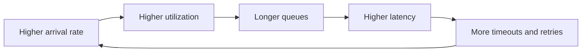
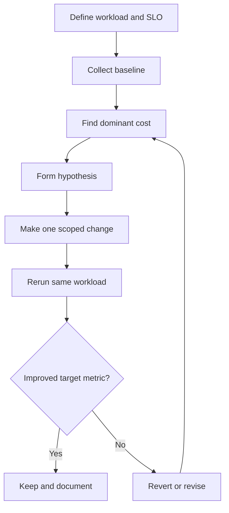

# Performance Capacity and Cost

Performance engineering is the discipline of predicting, measuring, and controlling how a system consumes scarce resources while serving real demand. Capacity engineering asks whether the system can meet its service objectives at expected and abnormal load. Cost engineering asks whether the same outcome is being delivered with acceptable economic efficiency.

Performance is not one number. A service can have excellent average latency and still be unusable for the slowest 1 percent of requests. A system can have high throughput in a benchmark and still fail under production contention. A platform can be cheap at idle and expensive under retry storms, excess observability cardinality, or poor cache behavior.

## Core Vocabulary

| Term | Meaning | Common mistake | Better practice |
|---|---|---|---|
| Latency | Time for one operation to complete | Reporting only average latency | Track percentile latency by operation, dependency, and tenant class |
| Throughput | Completed work per unit time | Treating peak throughput as sustainable capacity | Report sustained throughput at an SLO-bound latency target |
| Service time | Time a worker actively spends on a request | Confusing it with end-to-end latency | Separate processing time from queueing and network waits |
| Queueing delay | Time spent waiting before service starts | Ignoring it until saturation | Model queues explicitly and alert on growing wait time |
| Utilization | Fraction of a resource in use | Assuming 90 percent CPU is always efficient | Compare utilization with latency, run queue, throttling, and error rate |
| Saturation | Demand approaches available capacity | Treating saturation as a binary state | Detect early via queue growth, retries, pool waits, and scheduler delay |
| Headroom | Spare capacity before unacceptable behavior | Keeping fixed percent headroom without scenario analysis | Reserve headroom for spikes, failover, deployments, and noisy neighbors |
| Tail latency | High percentile behavior such as p95, p99, p999 | Optimizing median only | Budget every layer so tails do not multiply |
| Cost per unit | Cost per request, job, tenant, GB, or model call | Looking only at monthly cloud spend | Attribute cost to the unit that drives demand |

## Latency

Latency is the elapsed time observed by a caller. It includes local compute, network hops, queueing, dependency calls, serialization, retries, lock waits, garbage collection pauses, scheduler delay, and client-side connection behavior.

Useful decomposition:

```text
end_to_end_latency = client_wait
                   + network_time
                   + ingress_queue_time
                   + application_queue_time
                   + service_time
                   + dependency_time
                   + retry_time
                   + response_transfer_time
```

Latency should be measured from multiple perspectives:

| Perspective | Captures | Misses |
|---|---|---|
| Client side | DNS, TLS, network, retries, load balancer behavior, real perceived latency | Internal span detail unless propagated |
| Edge or ingress | Routing, WAF, TLS termination, upstream selection | Browser behavior and deep application detail |
| Application | Handler time, queue time, dependency time, business operation labels | Network before ingress and client retry behavior |
| Dependency | Database or cache service time | Caller-side pool waits and serialization |
| Synthetic probe | Availability and known path latency | Tenant-specific hot paths and workload variety |

### Tail Percentiles

Percentiles describe distribution shape. p50 is the median. p95 means 95 percent of observations are at or below that value. p99 means 1 in 100 observations are slower. p999 means 1 in 1000 observations are slower.

Tail latency matters because users and workflows often experience many operations, not one.

```text
probability_all_fast = fast_probability_per_call ^ number_of_calls

Example:
If each call is within target 99 percent of the time and a page requires 40 calls:
0.99 ^ 40 = 0.669

Only about 66.9 percent of page loads have all 40 calls within target.
```

Tail latency amplifiers:

- Fan-out to many dependencies.
- Queueing near saturation.
- Noisy neighbor effects.
- Stop-the-world garbage collection.
- Cold starts and autoscaler lag.
- Cache misses on hot paths.
- Lock convoys.
- Database lock waits.
- Retry storms.
- Packet loss and TCP retransmission.
- Large payloads mixed into latency-sensitive queues.

Percentile measurement pitfalls:

| Pitfall | Why it misleads | Fix |
|---|---|---|
| Averaging percentiles | p99 values are not additive or safely averageable | Aggregate raw histograms or use mergeable sketches |
| Low sample count | p999 with 1000 requests is unstable | Require minimum sample volume per window |
| Coordinated omission | Load generator waits for slow response before issuing next request | Preserve intended arrival rate and measure client-observed delay |
| Too-wide labels | One metric blends fast and slow operations | Partition by operation, dependency, status, tenant tier, and region |
| Too-many labels | Cardinality cost and query instability | Bound label values and use exemplars for deep traces |

## Throughput

Throughput is completed work per unit time. It is usually reported as requests per second, jobs per minute, bytes per second, messages per second, or transactions per second.

Throughput is only meaningful with latency and error constraints:

```text
sustainable_capacity = max_throughput where
                       latency_percentile <= target
                       and error_rate <= target
                       and resource_saturation <= target
```

Throughput ceilings often come from the narrowest resource:

| Bottleneck | Symptom | Typical corrective action |
|---|---|---|
| CPU | High run queue, high CPU time, low idle, throttling | Optimize hot code, increase cores, reduce serialization, scale out |
| Memory | Paging, OOM kills, high GC time, allocator pressure | Reduce working set, tune heap, pool carefully, fix retention |
| Disk I/O | High await, low IOPS headroom, compaction lag | Batch, change access pattern, provision IOPS, separate workloads |
| Network | Retransmits, bandwidth saturation, connection resets | Reduce payloads, compress carefully, shard traffic, colocate services |
| Database | Lock waits, slow queries, connection pool exhaustion | Index, partition, tune queries, reduce transactions, use read replicas |
| Queue | Rising age, consumer lag, uneven partitions | Add consumers, rebalance partitions, reduce per-message cost |
| External API | Rate limit errors, long dependency spans | Cache, batch, budget calls, degrade gracefully |

Throughput optimization anti-patterns:

- Increasing concurrency without measuring queueing delay.
- Adding replicas while the database is the bottleneck.
- Using async I/O to hide blocking work without bounding inflight requests.
- Treating benchmark throughput as production capacity.
- Ignoring request mix and payload size distribution.
- Measuring accepted requests instead of completed successful work.

## Little's Law

<span className="compendium-external-reference" title="Vault-only reference">Littles law and efficient queue strategy</span> is a core capacity anchor:

```text
L = lambda * W

L      = average number of items in the system
lambda = average arrival rate
W      = average time an item spends in the system
```

Equivalent forms:

```text
W = L / lambda
lambda = L / W
```

Example:

```text
arrival_rate = 200 requests/second
average_latency = 0.150 seconds

average_inflight = 200 * 0.150 = 30 requests
```

If average latency rises to 0.600 seconds at the same arrival rate:

```text
average_inflight = 200 * 0.600 = 120 requests
```

The system now needs 4 times as many concurrent request slots, database connections, memory buffers, and downstream capacity just to keep up. Little's Law also exposes why retries are dangerous: retries increase effective arrival rate, which increases queue length, which increases latency, which triggers more retries.

## Queueing and Utilization

Utilization above roughly 70 to 80 percent often causes unstable queueing latency for variable workloads. The exact threshold depends on arrival variance, service-time variance, batching behavior, and scheduling discipline.

Simplified intuition:

```text
utilization = arrival_rate / service_rate

as utilization approaches 1.0:
queueing_delay grows nonlinearly
```



Queueing controls:

| Control | Use when | Risk |
|---|---|---|
| Bounded queue | Work should wait briefly but not indefinitely | Dropped work if capacity is too low |
| Load shedding | Protecting the service is more important than accepting all requests | Requires clear caller contracts |
| Backpressure | Upstream can slow down safely | Can propagate latency across systems |
| Priority queue | Some work is more important or time-sensitive | Starvation if priorities are not aged |
| Separate pools | Slow work must not block fast work | Poor pool sizing can waste capacity |
| Rate limiting | Demand must be shaped per actor or global budget | Bad limits can punish healthy clients |
| Circuit breaker | Dependency failure should not consume all workers | Aggressive breakers can reduce availability |

## CPU Performance

CPU performance depends on instruction count, instruction-level parallelism, branch predictability, memory access, cache behavior, vectorization, scheduling, and synchronization.

### CPU Hot Path Checklist

- Identify where CPU time is spent with a profiler before changing code.
- Distinguish user CPU, system CPU, steal time, and throttled time.
- Measure both wall time and CPU time.
- Check whether the hot path is allocation-heavy.
- Check branch misprediction if tight loops are unexpectedly slow.
- Check whether data layout causes pointer chasing.
- Check whether serialization or compression dominates request time.
- Check whether TLS, JSON parsing, regex, hashing, or logging is unexpectedly expensive.
- Check whether CPU limits cause CFS throttling in containers.
- Validate that optimization improves representative workloads, not microbenchmarks only.

### Common CPU Bottlenecks

| Bottleneck | Pattern | Better approach |
|---|---|---|
| Excess serialization | Repeated JSON encode or decode across layers | Pass structured values internally, encode once at boundaries |
| Regex on hot path | Complex expressions per request | Precompile, simplify, or use parser/state machine |
| Logging cost | Formatting large logs before level check | Guard expensive fields and sample high-volume logs |
| Compression everywhere | CPU spent compressing tiny payloads | Use size thresholds and appropriate algorithms |
| Hash map churn | Allocate, hash, resize per request | Reuse structures carefully, pre-size, use arrays for dense keys |
| Virtual dispatch in loops | Branchy polymorphism in tight path | Specialize outside the loop or use data-oriented layout |
| Container throttling | High latency despite moderate average CPU | Inspect throttled periods and raise limits or reduce burst CPU |

## Memory Performance

Memory affects latency through allocation cost, cache misses, garbage collection, page faults, memory bandwidth, NUMA effects, and OOM behavior.

Memory questions to answer:

| Question | Signal |
|---|---|
| What is the working set? | Resident memory, heap live set, cache size, page faults |
| What is the allocation rate? | Allocations per request, bytes allocated per second |
| What is retained? | Heap profile, dominator tree, object graph retention |
| What is copied? | Buffer copies, serialization boundaries, compression buffers |
| Is memory locality good? | Cache miss counters, pointer chasing, CPU stalls |
| Is the allocator contended? | Allocator CPU, thread-cache misses, lock contention |
| Is GC affecting tails? | Pause time, concurrent marking CPU, promotion rate |
| Is the system paging? | Major faults, swap in, swap out, reclaim stalls |

Memory anti-patterns:

- Treating cache as free memory.
- Using unbounded maps keyed by tenant, user, request, or trace id.
- Retaining request-scoped objects in global structures.
- Returning slices or views that retain large backing buffers.
- Building huge intermediate arrays instead of streaming.
- Copying payloads across every layer.
- Pooling objects without measuring retention and contention.
- Ignoring memory overhead of observability labels and exemplars.

## Cache Locality

Cache locality is the tendency to access nearby data close together in time. CPUs are much faster when data is in L1 or L2 cache than when it must be fetched from main memory.

| Locality type | Meaning | Example |
|---|---|---|
| Temporal locality | Reuse the same data soon | Reusing a parsed routing table |
| Spatial locality | Access nearby data | Iterating over a contiguous array |
| Instruction locality | Execute nearby instructions repeatedly | Tight loop with predictable branches |
| Data ownership locality | Same core repeatedly mutates same data | Per-worker counters |

Design techniques:

- Prefer compact contiguous structures for hot loops.
- Keep hot fields together and cold fields separate.
- Avoid pointer-heavy object graphs on critical paths.
- Batch operations to amortize cache misses.
- Use per-thread or per-shard state for frequently updated counters.
- Keep lock metadata away from frequently read immutable data.
- Align heavily contended fields if false sharing is proven.

## Cache Coherency and False Sharing

Modern CPUs keep per-core caches coherent. When one core writes to a cache line, other cores may need to invalidate or reload that line. This is correct behavior, but it can become expensive when many cores mutate data that happens to share a cache line.

False sharing occurs when independent variables live on the same cache line and are written by different cores.

```text
cache_line:
[ counter_a ][ counter_b ][ counter_c ][ counter_d ]

Thread 1 writes counter_a.
Thread 2 writes counter_b.

The variables are logically independent, but the cache line bounces between cores.
```

Mitigations:

| Mitigation | Use when | Cost |
|---|---|---|
| Per-core counters | Very frequent increments | Requires aggregation |
| Sharded state | Hot key or global counter contention | More complex reads and rebalancing |
| Padding or alignment | Proven false sharing on adjacent fields | More memory usage |
| Immutable snapshots | Many readers and few writers | Snapshot freshness and copy cost |
| Ownership transfer | One worker owns mutation | Queueing and routing complexity |

Avoid padding as a superstition. Use hardware counters or profiler evidence first.

## Contention

Contention happens when many workers compete for the same resource. The resource can be a mutex, CPU core, cache line, database row, connection pool, queue partition, memory allocator, rate limiter bucket, log sink, or hot cache key.

Examples:

- Mutex hot path.
- Global atomic counter.
- Database row lock.
- Queue partition.
- Thread pool.
- Connection pool.
- Rate limiter.
- Cache key.
- Allocator arena.
- Logger append lock.
- Metrics registry lock.

### Contention Diagnosis

| Symptom | Likely cause | Evidence |
|---|---|---|
| CPU low, latency high | Waiting on locks, I/O, or pools | Thread dumps, blocked time, pool wait histograms |
| CPU high, throughput flat | Spin loops, cache-line bouncing, serialization | CPU profile, perf counters, flame graph |
| p99 spikes under concurrency | Lock convoy or queue saturation | Mutex wait histogram, queue age, scheduler delay |
| One partition lags | Hot key or uneven routing | Per-partition throughput and lag |
| Database CPU moderate, requests slow | Lock waits or pool exhaustion | DB wait events, connection pool wait time |
| More workers make it slower | Shared bottleneck or coherency storm | Scaling curve with throughput vs concurrency |

### Mutex Hot Paths

A mutex is often the right tool. The problem is not that a lock exists, but that it protects a hot path for too long or at too high a frequency.

Mutex hot path checklist:

- Is the lock acquired per request, per item, or per batch?
- What is the p50, p95, and p99 wait time for the lock?
- What is the critical section duration?
- Does the critical section perform I/O, logging, allocation, or callbacks?
- Does the lock protect multiple unrelated fields?
- Does one slow holder block all other callers?
- Is lock ordering documented for nested locks?
- Does the lock cause priority inversion?
- Does the lock interact with async runtimes or event loops incorrectly?

Mitigations:

| Mitigation | Good fit | Caution |
|---|---|---|
| Reduce critical section | Expensive work can move outside lock | Must preserve invariants |
| Shard lock | Many independent keys | Hot keys can still dominate |
| Read-write lock | Many readers, rare writers | Writer starvation or reader overhead |
| Copy-on-write | Reads dominate and snapshots are acceptable | Write amplification |
| Actor ownership | One worker owns mutable state | Mailbox can become queue bottleneck |
| Batching | High-frequency small mutations | Adds latency and failure semantics |
| Local aggregation | Metrics, counters, statistics | Reads are approximate or require merge |

## Lock-Free and Wait-Free Tradeoffs

Lock-free algorithms guarantee that at least one thread can make progress. Wait-free algorithms guarantee that every operation completes in a bounded number of steps.

| Technique | Progress guarantee | Benefit | Cost |
|---|---|---|---|
| Blocking lock | None if holder stalls | Simple invariants and maintainability | Convoys, deadlocks, priority inversion |
| Try-lock with fallback | Depends on fallback | Avoids blocking in some paths | Complex retry behavior |
| Lock-free | System-wide progress | Avoids stalled lock holder | ABA problems, memory ordering, livelock, hard testing |
| Wait-free | Per-operation bounded progress | Strong tail-latency guarantee | Very complex, often high memory or copy cost |
| RCU-style reads | Readers avoid locks | Excellent read scalability | Reclamation complexity and stale reads |

Lock-free tradeoffs:

- Correct memory ordering is hard to prove and hard to review.
- Performance may be worse under contention due to repeated compare-and-swap failures.
- Busy retry loops can burn CPU and harm neighboring workloads.
- Memory reclamation is often the hardest part.
- Debugging rare interleavings can dominate the value of the optimization.
- Lock-free code can improve p99 only if the lock was actually the bottleneck.

Wait-free tradeoffs:

- Strong bounded progress can be valuable in schedulers, real-time systems, telemetry hot paths, and safety-critical control loops.
- General-purpose application code rarely needs wait-free algorithms.
- Complexity and maintenance risk are usually higher than the performance win.
- Proof obligations matter. If the team cannot explain the bound, it should not be called wait-free.

Decision rule:

```text
Use the simplest synchronization primitive that meets the measured latency target.
Escalate from lock to sharding, batching, ownership, lock-free, and wait-free only with evidence.
```

## Profiling

Profiling turns performance work from opinion into evidence. The minimum useful loop is measure, hypothesize, change one thing, remeasure, and compare under the same workload.



Profiler types:

| Profiler | Answers | Watch for |
|---|---|---|
| CPU sampling | Where CPU time goes | Sampling bias, missing wall-clock waits |
| Wall-clock profiling | Where elapsed time goes | Needs enough labels to separate waiting from work |
| Allocation profiling | What allocates and how much | Sampling may miss short-lived bursts |
| Heap profiling | What is retained | Snapshot timing changes interpretation |
| Lock profiling | Who waits on synchronization | Instrumentation overhead |
| I/O profiling | Disk, network, and dependency waits | Correlate with caller-level latency |
| eBPF or kernel profiling | Scheduler, TCP, filesystem, syscalls | Requires careful symbolization and permissions |
| Database profiling | Queries, locks, plans, buffer usage | Production plans differ by parameters and data shape |

Profiling checklist:

- Capture request rate, request mix, data size, and feature flags with the profile.
- Record hardware, container limits, runtime version, and deployment shape.
- Use production-like data distributions.
- Compare p50, p95, p99, throughput, errors, and resource usage.
- Preserve profiles and flame graphs for later regression comparison.
- Look for missing time: if spans show 100 ms but client sees 500 ms, instrumentation is incomplete.
- Recheck after compiler, runtime, kernel, or dependency upgrades.

## Load Testing

Load testing validates behavior under controlled demand. It should be tied to service objectives, not just a maximum requests-per-second number.

Test types:

| Test | Purpose | Pass signal |
|---|---|---|
| Baseline load | Establish normal operating behavior | Meets SLO with expected headroom |
| Peak load | Validate known high-demand period | Meets SLO at forecast peak |
| Stress to failure | Find breaking point and failure mode | Fails predictably and recovers cleanly |
| Soak test | Find leaks, compaction issues, and slow degradation | Stable latency, memory, and error rate over time |
| Spike test | Validate sudden demand changes | Autoscaling and queues stabilize before SLO breach budget is consumed |
| Failover load | Validate loss of zone, region, node, or dependency | Remaining capacity handles redirected load |
| Dependency degradation | Validate partial failure behavior | Backpressure, timeouts, and fallbacks protect the system |

Avoid coordinated omission by measuring from the client perspective and preserving intended arrival rate. A load generator that waits for each response before scheduling the next request hides the exact latency growth that matters.

Load test design checklist:

- Use realistic arrival patterns, not only closed-loop workers.
- Model read/write mix, payload sizes, tenant skew, cache warmness, and burstiness.
- Include authentication, authorization, serialization, and observability overhead.
- Include slow and failing dependency responses.
- Measure queue wait, pool wait, retry count, timeout count, and dropped work.
- Run long enough to observe GC, compaction, rotation, autoscaling, and storage effects.
- Verify that generated load is not bottlenecked by the test client.
- Define stop conditions to protect shared environments.
- Compare results to a previous baseline, not only to the absolute target.

## Capacity Planning

Capacity planning connects demand, resources, SLOs, and failure scenarios.

Inputs:

- Demand forecast.
- Peak to average ratio.
- Growth rate.
- SLO target.
- Dependency limits.
- Backpressure behavior.
- Failover headroom.
- Regional loss scenario.
- Deployment surge capacity.
- Batch and cron overlap.
- Cost ceiling.

Capacity worksheet:

| Item | Example question | Output |
|---|---|---|
| Demand unit | What drives load? | Requests, jobs, tenants, GB, active sessions |
| Current baseline | What do we serve today? | p50, p95, p99, throughput, CPU, memory, cost |
| Peak multiplier | How high is peak vs average? | Peak factor by hour, day, season, event |
| Growth | How fast is demand changing? | Monthly or quarterly multiplier |
| SLO | What must remain true at peak? | Latency, availability, correctness, freshness |
| Bottleneck | Which resource saturates first? | CPU, DB, queue, memory, network, external API |
| Scaling unit | What is added when scaling? | Pod, VM, shard, partition, queue consumer |
| Failover | What if one zone or region is lost? | N+1, N+2, or active-active capacity target |
| Cost | What is the acceptable unit cost? | Cost per request, tenant, GB, job |

Common formulas:

```text
peak_demand = average_demand * peak_to_average_ratio

future_peak = current_peak * (1 + growth_rate) ^ periods

required_capacity = future_peak * safety_factor

headroom_percent = (capacity - load) / capacity * 100

unit_cost = total_cost / business_units_served

effective_arrival_rate = original_arrival_rate + retry_arrival_rate
```

Example:

```text
current_peak = 8,000 requests/second
growth_rate = 0.12 per quarter
periods = 4
safety_factor = 1.35

future_peak = 8,000 * (1 + 0.12) ^ 4 = 12,588 requests/second
required_capacity = 12,588 * 1.35 = 16,994 requests/second
```

## Autoscaling

Autoscaling changes capacity in response to demand or saturation signals. It reduces idle cost but introduces control-loop risk.

Autoscaling signal comparison:

| Signal | Good for | Weakness |
|---|---|---|
| CPU utilization | CPU-bound stateless services | Slow for bursty traffic, misleading under I/O waits |
| Memory utilization | Memory-bound workers and caches | Scaling out may not reduce per-process memory |
| Request rate | Predictable per-request cost | Ignores heavy requests and dependency delays |
| Queue depth | Background workers | Needs arrival rate and processing time context |
| Queue age | User-visible backlog freshness | May react after backlog is already harmful |
| p95 latency | User experience | Can be noisy and late |
| Inflight requests | Concurrency-bound services | Needs per-instance limit discipline |
| Custom saturation metric | Known bottleneck | Requires maintenance and validation |

Autoscaling failure modes:

- Scaling on average CPU while p99 latency is driven by queueing.
- Scaling pods while the database, queue partition, or external API is saturated.
- Cold starts consume the entire spike budget.
- Long stabilization windows react too late.
- Short windows cause oscillation.
- New replicas receive traffic before caches, JIT, or connection pools are warm.
- Downscaling removes capacity during slow drains.
- Per-pod connection pools multiply database connections beyond safe limits.

Autoscaling checklist:

- Define minimum capacity for baseline and failover.
- Define maximum capacity to protect dependencies and cost.
- Use readiness checks that represent real ability to serve.
- Pre-warm expensive caches or accept a warmup budget.
- Keep per-instance concurrency limits explicit.
- Coordinate autoscaling with rate limits and connection pool limits.
- Test scale-up and scale-down behavior during load tests.
- Alert on desired replicas hitting max replicas.
- Alert when queue age grows while replicas are already scaling.

## Cost Engineering

Cost is a system property. It is shaped by architecture, data retention, request mix, tenant behavior, deployment topology, observability, development workflow, and failure handling.

Cost dimensions:

| Dimension | Examples | Optimization lever |
|---|---|---|
| Compute | VMs, containers, serverless, CI runners | Right-size, bin-pack, optimize CPU hot paths |
| Memory | Large nodes, cache fleets, heap overhead | Reduce working set, tune caches, fix leaks |
| Storage | Databases, object storage, logs, backups | Lifecycle policies, compression, retention classes |
| Network | Egress, cross-zone traffic, CDN misses | Colocate services, cache at edge, reduce payloads |
| Observability | Metrics, traces, logs, profiles | Cardinality budgets, sampling, retention tiers |
| Database | Reads, writes, indexes, replicas, IOPS | Query tuning, partitioning, connection discipline |
| AI inference | Tokens, model calls, embeddings, reranking | Prompt budgets, caching, batching, smaller models |
| Developer workflow | Builds, tests, preview environments | Cache builds, prune stale envs, parallelize selectively |

Unit economics examples:

```text
cost_per_request = monthly_service_cost / monthly_successful_requests

cost_per_tenant = monthly_allocated_cost / active_tenants

cost_per_gb_processed = monthly_pipeline_cost / gb_processed

cost_per_model_answer = (input_tokens_cost + output_tokens_cost + retrieval_cost + orchestration_cost)
```

Cost anti-patterns:

- Scaling every tier together when only one tier is saturated.
- Keeping full-fidelity logs forever.
- High-cardinality metrics for unbounded user, request, or trace identifiers.
- Cross-zone or cross-region chatter inside tight request paths.
- Oversized database instances compensating for missing indexes.
- Running large caches with poor hit rates.
- Using premium storage for cold data.
- Keeping preview environments alive indefinitely.
- Retrying expensive external calls without budgets.
- Optimizing cloud bill totals without tracking unit cost and user value.

## Performance Budgets

A performance budget turns performance into an explicit design constraint. It should be assigned before implementation and enforced during review and release.

Budget examples:

| Budget | Example |
|---|---|
| API latency | p95 below 200 ms and p99 below 800 ms for read path |
| Page load | LCP below 2.5 seconds on target device and network |
| CPU | Handler uses less than 20 ms CPU at p95 |
| Memory | Worker live heap below 512 MB after 6 hour soak |
| Database | No request path performs more than 3 queries |
| Payload | Response body below 100 KB for common case |
| Cache | Hit ratio above 90 percent for hot catalog reads |
| Cost | Cost per 1000 successful requests below target |
| Observability | New metric labels must use bounded cardinality |

Budget review checklist:

- What user or business outcome owns the budget?
- Which percentile is the budget based on?
- Which device, region, tenant tier, or workload is in scope?
- Is the budget enforced in CI, canary, load test, or production alerting?
- What happens when the budget is exceeded?
- Which dependency consumes the largest portion?
- What is the regression threshold?
- Is the budget still realistic after product changes?

## System Design Patterns

| Pattern | Performance value | Capacity or cost risk |
|---|---|---|
| Caching | Reduces latency and backend load | Staleness, invalidation complexity, memory cost |
| Read replicas | Increases read capacity | Replica lag and inconsistent reads |
| Partitioning | Spreads load and data | Hot partitions and operational complexity |
| Batching | Improves throughput and amortizes overhead | Adds latency and larger failure units |
| Async processing | Moves slow work out of request path | Backlog freshness and retry semantics |
| Backpressure | Prevents collapse under overload | Requires caller cooperation |
| Load shedding | Preserves critical capacity | Visible errors and product tradeoffs |
| CDN or edge cache | Reduces origin and network cost | Cache invalidation and personalization limits |
| Connection pooling | Reduces setup cost | Pool exhaustion and multiplied downstream load |
| Compression | Reduces bandwidth | CPU cost and latency for small payloads |

## Examples

### Example 1: API p99 Regression

Observed:

- p50 latency remains 45 ms.
- p95 rises from 180 ms to 420 ms.
- p99 rises from 600 ms to 2.4 seconds.
- CPU is 55 percent.
- Database CPU is 40 percent.
- Connection pool wait p99 is 1.8 seconds.

Interpretation:

The bottleneck is not average CPU. The application is waiting for database connections. Adding application replicas may make the database connection problem worse if each replica opens its own pool.

Better response:

- Inspect pool size, query count, and transaction duration.
- Add pool wait histograms and query traces.
- Remove long work from transactions.
- Fix slow queries or missing indexes.
- Cap per-instance concurrency so requests queue before consuming all downstream resources.

### Example 2: Throughput Drops After Adding Threads

Observed:

- 8 workers: 40,000 operations/second.
- 16 workers: 42,000 operations/second.
- 32 workers: 31,000 operations/second.
- CPU is high.
- Lock profiling shows a global metrics lock.

Interpretation:

More workers increased contention. The global lock became a serialization point.

Better response:

- Replace global counter updates with per-worker counters.
- Aggregate periodically.
- Keep metric label sets bounded.
- Re-run the scaling curve.

### Example 3: Cache Saves Latency but Raises Cost

Observed:

- Cache hit ratio is 35 percent.
- Cache memory fleet is expensive.
- Origin database still handles most traffic.
- p99 improves only for a narrow path.

Interpretation:

The cache may be storing low-value or poorly reusable entries. More memory is not automatically better.

Better response:

- Segment hit ratio by route, tenant, and key class.
- Apply TTL and admission policy by value.
- Consider [Data Structures/LRU Cache](/compendium/data-structures/lru-cache) behavior under scan-heavy workloads.
- Use [Data Structures/Bloom Filters](/compendium/data-structures/bloom-filters) to avoid expensive negative lookups where appropriate.

## Anti-Patterns

| Anti-pattern | Why it fails | Prefer |
|---|---|---|
| Optimizing without a profile | Time is spent where the team guesses, not where the system hurts | Baseline profile and target metric |
| Average-only dashboards | Hide tail behavior and overload | Percentiles, histograms, and saturation signals |
| Unbounded concurrency | Turns overload into queue explosion | Explicit limits, backpressure, and shedding |
| Infinite retries | Amplifies incidents | Retry budgets, jitter, deadlines, and circuit breakers |
| One shared worker pool | Slow work blocks fast work | Separate pools by class and priority |
| Global mutable state | Forces serialization and coherency traffic | Sharding, ownership, or local aggregation |
| Huge critical sections | One slow operation blocks all callers | Minimize protected state |
| Lock-free by default | Complexity without measured need | Simple locks plus evidence-driven escalation |
| Autoscaling as a fix for all bottlenecks | Scales the wrong layer | Identify the saturated resource |
| Cache everything | Memory cost, staleness, low hit ratio | Cache by measured reuse and value |
| No capacity failover model | Normal load passes but failure load collapses | Plan for zone, node, and dependency loss |
| Observability without budgets | Telemetry becomes the cost driver | Sampling, retention tiers, and cardinality controls |
| Ignoring deployment effects | Rollouts consume capacity and warmup time | Surge capacity, warmup, and canary budgets |

## Operational Checklists

### Performance Investigation

- State the user-visible symptom and affected operation.
- Capture p50, p95, p99, throughput, error rate, and saturation for the same time window.
- Compare against a known good baseline.
- Check deploys, traffic mix, data size, and dependency changes.
- Break latency into queue time, service time, dependency time, and retry time.
- Inspect CPU, memory, disk, network, database, queue, and external API signals.
- Generate a profile under representative load.
- Make one change at a time and remeasure.
- Document the result, including negative findings.

### Release Readiness

- Load test covers baseline, peak, spike, soak, and failover scenarios.
- SLOs are defined for latency, errors, freshness, and availability.
- Capacity model includes growth, peak multiplier, and failover.
- Autoscaling limits protect dependencies and cost.
- Backpressure and load shedding behavior is explicit.
- Retry budgets and deadlines are configured.
- Dashboards include percentiles, saturation, queue age, pool wait, and unit cost.
- Alerts fire before user-visible exhaustion when possible.
- Rollback path is tested.
- Performance budgets are reviewed with product and operations owners.

### Cost Review

- Identify the business unit of demand.
- Attribute costs by service, tenant class, route, job type, or data volume.
- Separate fixed, variable, idle, and failure-mode cost.
- Check top cost drivers over the last 30 to 90 days.
- Review storage retention and lifecycle policies.
- Review log, metric, trace, and profile cardinality.
- Check cross-region and cross-zone transfer.
- Check caches for hit ratio, eviction rate, and memory waste.
- Check database indexes, query plans, replicas, and IOPS.
- Check CI, build cache, preview environment, and artifact retention cost.
- Track cost per unit alongside latency and throughput.

## Related Notes

- <span className="compendium-external-reference" title="Vault-only reference">Javascript optimization tips</span>
- [Data Structures/LRU Cache](/compendium/data-structures/lru-cache)
- [Data Structures/Bloom Filters](/compendium/data-structures/bloom-filters)
- [06 Caching Queues and Streaming](/compendium/software-engineering/caching-queues-and-streaming)
- [08 Reliability Observability and Operations](/compendium/software-engineering/reliability-observability-and-operations)
