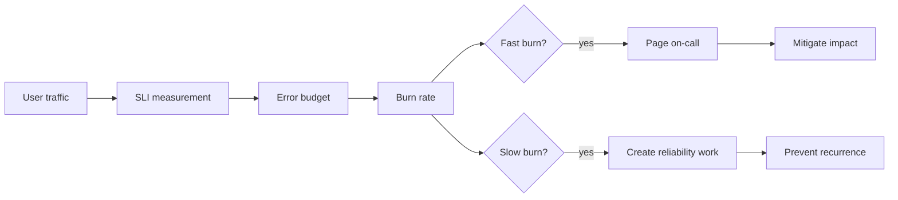
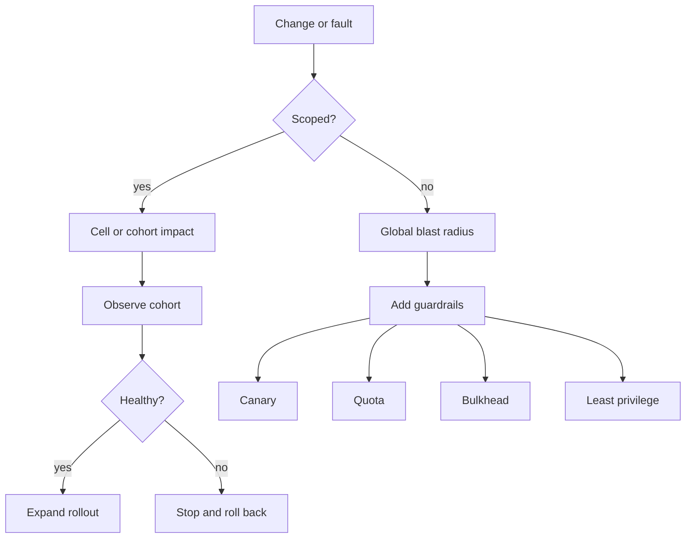
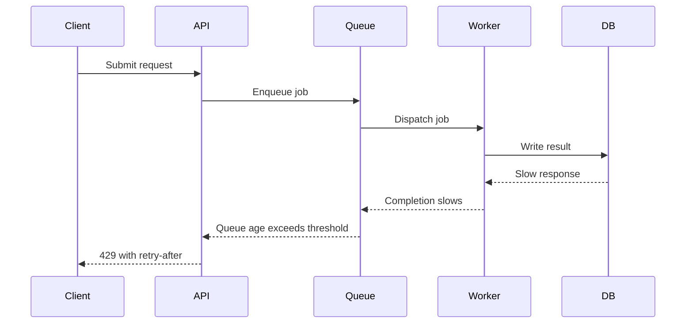
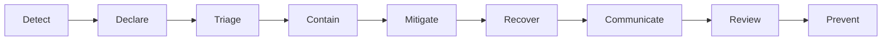
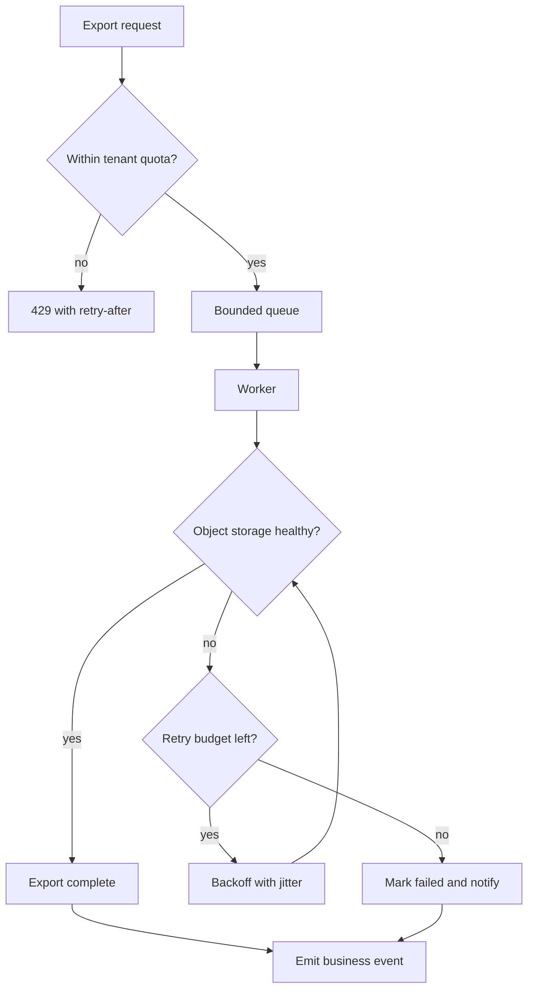

# Reliability Observability and Operations

Reliability is a product property. Operations are the feedback loop that keeps reliability real. A system is reliable when users can complete the work they came to do, within a tolerable time, with acceptable correctness, even while individual components fail.

Reliability work is not the same as eliminating every fault. It is the practice of defining acceptable service behavior, detecting departures from it, limiting blast radius, restoring service quickly, and using incidents to improve the system.

## Core concepts

| Concept | Meaning | Typical owner | Common mistake |
|---|---|---|---|
| SLI | Service level indicator. A measured signal of user-facing service behavior. | Service team | Measuring what is easy instead of what users experience. |
| SLO | Service level objective. A target for an SLI over a window. | Product and engineering | Setting every target to 100 percent. |
| SLA | Service level agreement. An external promise, often contractual. | Business, legal, engineering | Treating an internal SLO as a contractual promise. |
| Error budget | Allowed unreliability before the SLO is missed. | Service team | Spending it without changing release or risk posture. |
| Burn rate | Speed at which the error budget is being consumed. | On-call and service team | Alerting only after the budget is already gone. |
| Toil | Manual, repetitive, automatable operational work. | Operations and service team | Normalizing toil instead of paying it down. |
| MTTR | Mean time to recovery or repair. | Operations and service team | Optimizing restoration without fixing detection. |
| MTTD | Mean time to detect. | Observability and service team | Depending on customer reports as the primary detector. |

Good reliability language is precise:

- Availability asks: can users reach the service and get a valid response?
- Latency asks: can users complete the operation within a useful time?
- Durability asks: will accepted data still exist later?
- Correctness asks: is the response or state semantically valid?
- Freshness asks: is the returned data recent enough?
- Coverage asks: is the service available to all expected users, regions, tenants, and device classes?

## Reliability model

Reliability models connect user journeys to technical signals. The best model starts with critical user actions, not infrastructure components.

| User journey | Example SLI | Example SLO | Failure consequence |
|---|---|---|---|
| Sign in | Successful login requests divided by valid login attempts | 99.9 percent over 30 days | Users cannot access the product. |
| Checkout | Paid orders accepted without duplicate charge or lost order | 99.95 percent over 30 days | Revenue loss and support escalations. |
| Search | Queries returning a usable result page under 800 ms | 99 percent over 7 days | Users abandon discovery. |
| File upload | Uploads durably stored and visible within 60 seconds | 99.9 percent over 30 days | Data loss perception. |
| Notification delivery | Notifications delivered within policy window | 99 percent over 24 hours | Users miss time-sensitive events. |
| Control plane update | Accepted configuration changes reconciled correctly | 99.9 percent over 30 days | Operators lose trust or cause fleet impact. |

### SLI design

An SLI should be:

- User-facing: tied to a user-visible outcome.
- Measurable: derived from telemetry the system actually emits.
- Bounded: scoped by service, operation, tenant class, region, and time window.
- Resistant to gaming: not improved by dropping traffic, suppressing errors, or excluding hard cases.
- Actionable: a bad value should point toward a response path.

Common SLI forms:

| SLI type | Formula | Notes |
|---|---|---|
| Request success | good requests / valid requests | Exclude invalid client input only when it is truly outside service responsibility. |
| Latency | requests faster than threshold / valid requests | Prefer threshold SLIs over average latency. Averages hide tail pain. |
| Availability | successful probes or requests / expected probes or requests | Synthetic probes are useful but should not replace real traffic SLIs. |
| Durability | records retrievable after accepted write / accepted writes | Requires audit sampling or reconciliation. |
| Freshness | reads with data age under threshold / reads | Important for caches, streams, analytics, search, and replication. |
| Correctness | correct outcomes / sampled outcomes | Often needs domain-specific validation, shadow checks, or reconciliation jobs. |
| Queue timeliness | jobs completed within deadline / accepted jobs | Better than queue depth alone. |

### SLO selection

SLOs are product decisions expressed as engineering targets. A strong SLO has:

- A clearly named service and operation.
- An SLI definition with numerator and denominator.
- A time window.
- An objective.
- Exclusions that are explicit and rare.
- An alerting policy.
- A consequence policy when the budget is low.

Example:

| Field | Example |
|---|---|
| Service | Payments API |
| Operation | Authorize payment |
| SLI | Successful authorization responses under 1500 ms divided by valid authorization requests |
| Window | Rolling 30 days |
| Objective | 99.95 percent |
| Exclusions | Synthetic test cards, invalid merchant credentials, explicit provider maintenance windows |
| Alert | Page on fast burn, ticket on slow burn |
| Budget policy | Freeze risky changes below 25 percent budget remaining |

Do not set all services to the same objective. A public checkout path and an internal report export job need different reliability levels because their user impact and cost profile differ.

### SLA design

SLAs are external commitments. They should be looser than internal SLOs so the organization has time to respond before a contractual breach.

| Layer | Example target | Purpose |
|---|---|---|
| Internal SLO | 99.95 percent monthly API availability | Engineering target and alerting basis. |
| Public status target | 99.9 percent monthly availability | Customer-facing reliability expectation. |
| Contractual SLA | 99.5 percent monthly availability with credits | Legal and commercial commitment. |

SLA language should define:

- Covered services and regions.
- Measurement source.
- Maintenance windows.
- Exclusions.
- Customer credit process.
- Support response obligations.
- Security and data-loss obligations if applicable.

## Error budgets

An error budget is the amount of unreliability available within the SLO window.

For a 99.9 percent availability SLO over 30 days:

```text
30 days = 43,200 minutes
Allowed bad time = 0.1 percent * 43,200 = 43.2 minutes
```

For request-based SLOs:

```text
Error budget = valid events * (1 - SLO target)
Budget consumed = bad events / error budget
```

| SLO | 30 day allowed bad time | 7 day allowed bad time | Notes |
|---|---:|---:|---|
| 99 percent | 432 minutes | 100.8 minutes | Suitable for non-critical or batch surfaces. |
| 99.5 percent | 216 minutes | 50.4 minutes | Common for lower-tier user-facing systems. |
| 99.9 percent | 43.2 minutes | 10.08 minutes | Common for important interactive services. |
| 99.95 percent | 21.6 minutes | 5.04 minutes | Requires strong automation and incident maturity. |
| 99.99 percent | 4.32 minutes | 1.008 minutes | Expensive and operationally demanding. |

Error budget policy converts reliability into day-to-day decisions:

| Budget remaining | Engineering posture | Operational posture |
|---|---|---|
| Above 75 percent | Normal delivery. | Watch trends. Improve observability opportunistically. |
| 50 to 75 percent | Normal delivery with careful rollout. | Review recurring causes. Tighten canaries. |
| 25 to 50 percent | Limit risky changes. | Prioritize reliability fixes and capacity checks. |
| 0 to 25 percent | Freeze non-essential risky changes. | Incident review, executive visibility, active mitigation. |
| Exhausted | Stop change that could worsen the SLO unless required for recovery. | Restore budget by reducing error rate and closing systemic gaps. |

Budgets should be spent intentionally. Releasing faster is reasonable when the service is healthy. Slowing delivery is reasonable when users are paying reliability debt.

## Burn rates

Burn rate measures how fast a service is consuming its error budget.

```text
Burn rate = observed error rate / allowed error rate
```

For a 99.9 percent SLO, the allowed error rate is 0.1 percent. If the observed bad event rate is 2 percent:

```text
Burn rate = 2 / 0.1 = 20
```

At a burn rate of 20, a 30 day budget is consumed in:

```text
30 days / 20 = 1.5 days
```

Multi-window burn alerts reduce noise and catch both fast outages and slow leaks.

| Alert type | Short window | Long window | Example burn rate | Action |
|---|---:|---:|---:|---|
| Fast page | 5 minutes | 1 hour | 14x or higher | Wake a human. User impact is severe or imminent. |
| Medium page | 30 minutes | 6 hours | 6x or higher | Page during service hours or when impact is material. |
| Slow ticket | 2 hours | 1 day | 3x or higher | Create owned work. Budget is leaking. |
| Trend review | 1 day | 3 days | 1x or higher | Investigate recurring degradation before it pages. |

Alert when both the short and long window breach. The short window confirms immediacy. The long window confirms persistence.



## Failure modes

Failures are easier to handle when they are named. A precise failure mode makes detection, mitigation, and testing more concrete.

| Failure mode | Description | Detection signal | Common mitigation |
|---|---|---|---|
| Crash failure | Process stops or container exits. | Restart count, missing heartbeat, 5xx spike. | Supervisor restart, redundancy, graceful shutdown. |
| Omission failure | Expected response never arrives. | Timeout rate, missing events, queue age. | Timeouts, retries with budget, dead letter queue. |
| Slow failure | Component responds but too slowly. | Tail latency, saturation, queue delay. | Load shedding, scaling, timeout tuning, dependency bypass. |
| Gray failure | Component is partially unhealthy but not obviously down. | Regional skew, subset errors, odd percentile shifts. | Synthetic checks, quorum, adaptive routing, health scoring. |
| Byzantine failure | Component returns arbitrary or inconsistent results. | Invariant violations, checksum mismatch, divergent replicas. | Validation, quorum reads, circuit isolation. |
| Correlated dependency failure | Shared dependency affects many services at once. | Cross-service error spike, dependency latency. | Bulkheads, caching, fallback, dependency SLOs. |
| Overload | Demand exceeds capacity. | CPU, memory, queue, concurrency, saturation. | Backpressure, rate limits, load shedding, autoscaling. |
| Data corruption | Stored or transmitted data becomes wrong. | Reconciliation drift, checksum failure, audit failure. | Backups, write validation, repair jobs, restore tests. |
| Deadlock | Work stops because resources wait on each other. | No progress with active locks or threads. | Lock ordering, timeouts, watchdogs. |
| Livelock | System is busy but no useful progress occurs. | High activity with flat completion rate. | Retry jitter, circuit breakers, admission control. |
| Split brain | Multiple controllers believe they are primary. | Conflicting writes, dual leaders, fencing errors. | Leader election, fencing tokens, quorum. |
| Operator error | Human action degrades service. | Change correlation, audit log, sudden config drift. | Guardrails, reviews, dry run, rollback, least privilege. |
| Clock failure | Time assumptions become invalid. | Token expiry anomalies, ordering errors. | NTP monitoring, monotonic clocks, bounded skew handling. |
| Partial deploy failure | Mixed versions conflict. | Error rate by version, schema mismatch. | Compatible migrations, canaries, feature flags. |
| Resource leak | Capacity degrades over time. | Memory growth, file descriptor count, connection count. | Limits, restart policy, profiling, leak tests. |

### Failure scenario matrix

| Scenario | Symptom | First question | Immediate action | Long-term prevention |
|---|---|---|---|---|
| Database primary is slow | API p99 latency spikes and request queues grow. | Is the database saturated, locked, or network delayed? | Shed non-critical traffic, reduce concurrency, fail over only if confidence is high. | Query limits, index review, connection pooling, load testing. |
| Cache cluster fails | Read latency increases and database QPS spikes. | Can the origin absorb direct traffic? | Enable cache bypass only for critical paths, rate limit expensive endpoints. | Stale cache fallback, request coalescing, cache dependency SLO. |
| Message queue stalls | Jobs miss deadlines while API looks healthy. | Are producers still accepting work that cannot finish on time? | Stop or throttle producers, scale consumers, dead letter poison messages. | Queue timeliness SLO, backpressure from consumers to producers. |
| DNS misconfiguration | Users in some regions cannot connect. | Which resolvers and records are affected? | Revert zone change, lower impact with alternate endpoint if available. | DNS change review, staged rollout, synthetic DNS probes. |
| Certificate expiry | TLS failures begin at clients or load balancers. | Which certificates and paths are expired? | Renew and reload, bypass broken termination only if safe. | Expiry alerts, automated renewal, inventory. |
| Bad release | Errors correlate with one version. | Can the release be rolled back safely? | Roll back, disable feature flag, or route away from version. | Canary gates, automated rollback, schema compatibility. |
| Region outage | One region loses dependencies or networking. | Is failover automatic, safe, and capacity-backed? | Drain or route traffic to healthy region if data and capacity allow. | Regular failover drills, regional isolation, capacity reserve. |
| Control plane bug | Deployments or config changes mutate too much. | Is the data plane still serving? | Freeze writes, disable controllers, restore last known good state. | Dry run, staged reconciliation, audit guards, narrow privileges. |

## Blast radius

Blast radius is the maximum damage a failure can cause before containment works. It is shaped by topology, permissions, rollout design, dependency coupling, and operational process.

| Blast radius control | What it limits | Example |
|---|---|---|
| Cell architecture | Number of tenants affected by a cell failure | Shard tenants across independent stacks. |
| Regional isolation | Geography affected by a regional failure | Keep regional control loops independent. |
| Bulkheads | Failure propagation across pools | Separate worker pools for free and paid tiers. |
| Rate limits | Load a caller can impose | Per-tenant and per-token limits. |
| Feature flags | Scope of behavior changes | Enable feature by tenant cohort. |
| Canary releases | Scope of release defects | Start with 1 percent traffic or one cell. |
| Least privilege | Scope of human or service account mistakes | Restrict controllers to owned namespaces. |
| Quotas | Scope of resource exhaustion | Per-tenant storage and job quotas. |
| Circuit breakers | Scope of dependency failure | Stop calling a failing provider temporarily. |
| Data partitioning | Scope of corruption or hot keys | Partition writes and add tenant-aware limits. |

Blast radius questions:

- Can one tenant exhaust shared capacity for all tenants?
- Can one bad deploy affect all regions at once?
- Can one operator command mutate all production resources?
- Can one dependency outage stop every user journey?
- Can one queue poison message block an entire worker group?
- Can one schema migration lock a high-traffic table?
- Can one control plane reconciliation bug delete healthy data plane resources?



## Graceful degradation

Graceful degradation preserves the most important user outcomes when some capability is impaired. It is a product and engineering design choice.

| Degradation pattern | Use when | Example |
|---|---|---|
| Read-only mode | Writes are unsafe but reads are possible. | Allow users to view documents during database failover. |
| Stale data | Freshness is less important than availability. | Serve cached catalog data with a freshness label. |
| Reduced fidelity | Approximate output is acceptable. | Return simpler search ranking when personalization is down. |
| Optional feature disable | Core path must survive optional dependency failure. | Hide recommendations when recommendation service fails. |
| Async acceptance | Work can complete later. | Accept upload and process thumbnails after recovery. |
| Manual queue | Human workflow can bridge automation outage. | Queue refunds for support review when provider API is down. |
| Tiered service | Some users or paths are higher priority. | Preserve paid checkout before background exports. |

Degradation must be explicit. Silent degradation can become correctness failure.

Checklist:

- Define the core user outcome to preserve.
- Decide which features can be disabled first.
- Show clear user-facing state when behavior changes.
- Keep degraded mode observable with its own metric and event.
- Test entry and exit from degraded mode.
- Document data consistency implications.
- Define who can enable and disable the mode.
- Make degraded mode reversible.

## Backpressure

Backpressure tells upstream callers to slow down before the system collapses. Without backpressure, overload moves downstream until it becomes an outage.

Backpressure can be:

- Synchronous: return 429, 503, retry-after, or explicit quota error.
- Asynchronous: reject new jobs, pause consumers, reduce producer rate.
- Resource-based: limit concurrency, queue length, memory, file descriptors, or connections.
- Priority-based: preserve critical traffic while throttling lower-priority work.

| Signal | Meaning | Backpressure response |
|---|---|---|
| Queue age rising | Accepted work is missing freshness or deadline targets. | Stop accepting low-priority jobs and scale consumers. |
| Queue length rising | Arrival rate exceeds completion rate. | Limit producers and add admission control. |
| Thread or connection pool full | Concurrency is saturated. | Return fast failure instead of waiting indefinitely. |
| Memory pressure | Process is near OOM or garbage collection pressure. | Reduce batch size, reject expensive requests, shed caches carefully. |
| Database lock wait | Transactions are blocking useful work. | Reduce write concurrency, pause migrations, kill unsafe long queries. |
| Provider throttling | Dependency is enforcing limits. | Slow callers, use fallback, respect retry-after. |

Backpressure design rules:

- Bound every queue.
- Bound every retry loop.
- Bound every concurrency pool.
- Prefer fast, clear rejection over unbounded waiting.
- Propagate retry guidance to callers.
- Add jitter to retries.
- Preserve priority classes.
- Make overload visible in metrics and logs.



## Load shedding

Load shedding intentionally drops or rejects work to preserve the system. It should be designed before overload happens.

| Load shedding method | Preserves | Risk |
|---|---|---|
| Reject low-priority requests | Critical user journeys | Poor prioritization can harm important users. |
| Drop duplicate work | Capacity | Requires idempotency and request identity. |
| Disable expensive features | Core availability | Product experience degrades. |
| Serve stale cache | Availability | Freshness or correctness may suffer. |
| Reduce sampling or enrichment | Core path latency | Observability or analytics may lose detail. |
| Enforce per-tenant quotas | Fairness | Noisy users may see explicit errors. |
| Admission control | System stability | Requires accurate capacity signals. |

Good load shedding is:

- Early: starts before saturation becomes collapse.
- Fair: prevents one caller from consuming all capacity.
- Transparent: returns explicit status and retry guidance.
- Observable: emits shed count, reason, priority, tenant, and path.
- Reversible: stops automatically or through a documented control.

Avoid shedding:

- Security checks.
- Authorization checks.
- Data integrity validation.
- Audit-critical events.
- Required billing or compliance records.

## Timeouts, retries, and circuit breakers

Timeouts, retries, and circuit breakers are reliability tools only when they are bounded and coordinated.

| Mechanism | Purpose | Failure risk | Good default |
|---|---|---|---|
| Timeout | Stop waiting for work that no longer has value. | Timeout too high causes thread exhaustion. Timeout too low causes false failure. | Set from downstream latency distribution and caller deadline. |
| Retry | Recover from transient failure. | Retry storms amplify outages. | Retry only idempotent work with exponential backoff and jitter. |
| Circuit breaker | Stop calling a failing dependency. | Opens too aggressively and causes avoidable degradation. | Open on sustained failure, half-open with limited probes. |
| Hedging | Send duplicate request to reduce tail latency. | Doubles load under stress. | Use only for idempotent reads with strict budget. |
| Deadline propagation | Share remaining time across service calls. | Missing propagation causes useless downstream work. | Pass a request deadline through all internal calls. |

Retry checklist:

- Is the operation idempotent?
- Is there an idempotency key?
- Is the total retry duration below the caller deadline?
- Is there jitter?
- Is the retry budget shared across layers?
- Does the system stop retrying on permanent errors?
- Does the retry path emit metrics?

## Observability

Observability is the ability to ask new questions about system behavior without shipping new code for every question. It requires high-quality telemetry, context propagation, consistent naming, and an operational workflow that turns signals into decisions.

### Telemetry signals

| Signal | Best for | Weak at | Required fields |
|---|---|---|---|
| Metrics | Aggregates, alerts, trends, SLOs, capacity. | Explaining one specific request. | service, operation, status, region, version, tenant class. |
| Logs | Discrete facts, errors, local context. | Reliable alerting at high scale. | timestamp, severity, service, trace id, request id, user or tenant where safe. |
| Traces | Request path and dependency latency. | Background aggregate behavior without sampling care. | trace id, span id, parent id, operation, status, duration. |
| Profiles | CPU, memory, allocation, lock, IO cost. | User-level correctness. | service, version, host or pod, sample type, time range. |
| Events | Business and operational state changes. | High-cardinality time series math. | actor, subject, action, result, reason, timestamp. |

Signals work best together:

- Metrics tell you that something is wrong.
- Traces show where time or errors accumulate.
- Logs explain local decisions and exceptions.
- Profiles show resource cost and contention.
- Events explain what changed.

### Metrics

Metric design rules:

- Use counters for events that only increase.
- Use gauges for current state.
- Use histograms for latency, size, and duration.
- Avoid high-cardinality labels such as raw user id, request id, or full URL.
- Keep units explicit in names or metadata.
- Prefer service-level metrics over host-only metrics for alerting.
- Record both accepted work and completed work.
- Split by outcome, dependency, region, version, and priority where useful.

Important metric groups:

| Group | Examples | Operational use |
|---|---|---|
| User journey | request count, success count, latency bucket | SLOs and paging. |
| Dependency | downstream errors, downstream latency, circuit state | Triage and containment. |
| Saturation | CPU, memory, queue age, pool usage, disk IO | Capacity and overload detection. |
| Change | deploy version, feature flag state, config generation | Correlate incidents with changes. |
| Data | replication lag, reconciliation drift, failed writes | Correctness and durability. |
| Control plane | reconcile count, reconcile errors, desired vs actual drift | Safe automation. |

### Logs

Logs should be structured, searchable, and safe.

Good log properties:

- One event per log record.
- Stable field names.
- Machine-readable severity.
- Correlation identifiers.
- Clear message and reason code.
- No secrets, tokens, passwords, or raw sensitive payloads.
- Sampling for noisy success paths.
- Retention matched to debugging, compliance, and cost.

Log levels:

| Level | Use |
|---|---|
| debug | Detailed diagnostics, usually sampled or disabled in production. |
| info | Important state transition or operational fact. |
| warn | Unexpected condition that did not break the request but may need attention. |
| error | Request or job failed and the service could not complete expected work. |
| fatal | Process cannot continue safely. |

Log antipatterns:

- Logging the same error at every layer.
- Logging huge payloads.
- Logging secrets or customer data.
- Using free-form messages where fields are needed.
- Missing trace id or request id.
- Treating logs as the only alert source.

### Traces

Traces make distributed execution visible. They are most valuable when span names and attributes are consistent.

Trace design:

- Propagate context across HTTP, RPC, queues, and background jobs.
- Name spans by operation, not raw URL or user input.
- Mark errors with reason and status.
- Attach dependency, region, version, and retry attempt where useful.
- Sample intelligently. Keep error traces and slow traces at higher rates.
- Link asynchronous work back to the originating request where possible.

Trace questions:

- Which dependency owns the latency?
- Did retries improve or worsen the request?
- Did a queue wait dominate execution?
- Did one tenant, region, or version cause the tail?
- Did a feature flag change the path?

### Profiles

Profiles show where resources go. They are essential when latency or cost cannot be explained by request metrics alone.

Profile types:

| Profile | Shows | Example use |
|---|---|---|
| CPU | Hot functions and expensive loops. | Identify expensive serialization or compression. |
| Allocation | Memory allocation rate. | Find allocation churn causing garbage collection. |
| Heap | Retained memory. | Find leaks and unbounded caches. |
| Lock or mutex | Contention points. | Diagnose thread stalls. |
| IO | Disk or network wait. | Separate CPU saturation from IO wait. |
| Goroutine or thread | Blocked concurrency. | Find deadlock-like states or runaway workers. |

Continuous profiling is most useful when profiles include version, region, and workload labels.

### Events

Events capture meaning, not just resource behavior.

Operational events:

- Deployment started, promoted, failed, rolled back.
- Feature flag changed.
- Certificate renewed.
- DNS record changed.
- Autoscaler decision made.
- Controller reconciliation applied.
- Manual override enabled.
- Degraded mode entered or exited.

Business events:

- Order accepted.
- Payment authorized.
- File uploaded.
- Notification sent.
- Workspace created.
- Subscription changed.

Events are critical during incidents because they answer: what changed?

## Golden signals, RED, and USE

Golden signals:

| Signal | Meaning | Example |
|---|---|---|
| Latency | Time to serve a request. | p50, p95, p99 by endpoint. |
| Traffic | Demand placed on the system. | Requests per second, jobs per minute. |
| Errors | Rate of failed work. | 5xx, failed jobs, rejected writes. |
| Saturation | How full the system is. | CPU, memory, queue age, pool utilization. |

RED for request-driven services:

| Signal | Meaning |
|---|---|
| Rate | How many requests are arriving. |
| Errors | How many requests fail. |
| Duration | How long requests take. |

USE for resources:

| Signal | Meaning |
|---|---|
| Utilization | Percent of time or capacity used. |
| Saturation | Amount of queued or delayed work. |
| Errors | Resource-level failures. |

Use RED for service behavior and USE for resource debugging. A CPU graph alone is rarely a user-facing alert.

## Alert quality

An alert is a request for human attention. It must be worth interrupting someone.

An alert should mean:

- User impact exists or is imminent.
- A human action is needed now.
- The owner is clear.
- The runbook is linked.
- The alert is specific enough to triage.
- The alert has a known severity.
- The alert includes service, region, environment, and affected operation.
- The alert includes recent change context when possible.

| Alert quality dimension | Good | Bad |
|---|---|---|
| Impact | Tied to SLO or critical symptom. | Tied only to an internal metric. |
| Actionability | On-call can mitigate or escalate. | No known response. |
| Specificity | Names service, operation, region, dependency. | "High errors" with no scope. |
| Noise | Pages rarely and meaningfully. | Pages for every transient spike. |
| Ownership | Routes to the team that can act. | Goes to a generic channel. |
| Runbook | Current, tested, and linked. | Missing or stale. |

Severity guide:

| Severity | Impact | Response |
|---|---|---|
| SEV1 | Critical user journey down, data loss risk, security-critical operational impact. | Page immediately, incident commander, active comms. |
| SEV2 | Major degradation or partial outage for important users. | Page owner, incident channel, updates on schedule. |
| SEV3 | Limited impact, workaround exists, or slow budget burn. | Ticket or business-hours response. |
| SEV4 | Minor issue, cleanup, or informational. | Backlog or routine maintenance. |

Alert review checklist:

- Did this alert catch real user impact?
- Did it fire early enough?
- Did it fire too often?
- Was the runbook correct?
- Was the owning team correct?
- Was the severity correct?
- Were labels sufficient for routing and triage?
- Should it be converted to a ticket, dashboard, or SLO burn alert?

## Incident response

Incident response is a structured way to reduce impact under uncertainty. The objective is restoration first, then learning.



### Incident roles

| Role | Responsibility | Not responsible for |
|---|---|---|
| Incident commander | Owns coordination, priorities, status, and decisions. | Debugging every technical detail. |
| Operations lead | Executes operational mitigations. | External communication. |
| Communications lead | Sends internal and external updates. | Choosing technical fix without input. |
| Subject matter expert | Provides system-specific diagnosis and options. | Overall incident command. |
| Scribe | Captures timeline, decisions, commands, and links. | Driving mitigation. |
| Customer support liaison | Brings customer impact and support context. | Technical recovery. |

Small incidents can combine roles, but command and execution should remain conceptually separate.

### Incident timeline

A useful timeline records:

- First bad signal.
- First alert.
- First human acknowledgement.
- Incident declaration time.
- Customer impact start.
- Mitigation attempts and results.
- Rollback or failover decisions.
- Recovery time.
- Customer impact end.
- Follow-up creation.

### Response priorities

1. Protect users and data.
2. Stop the bleeding.
3. Restore critical paths.
4. Communicate status and expectations.
5. Preserve evidence.
6. Identify root and contributing causes.
7. Prevent recurrence.

During an incident:

- Prefer reversible mitigations.
- Avoid speculative broad changes.
- Keep a written command log.
- Assign one person per action.
- Set update cadence.
- Escalate when stuck.
- Separate facts from hypotheses.
- Do not run destructive commands without explicit review unless data safety demands immediate action.

### Incident communication

Status updates should include:

- What is impacted.
- Who is impacted.
- Since when.
- Current mitigation.
- Next update time.
- Known workaround if any.

Example internal update:

```text
SEV2: Checkout authorization latency is above SLO for us-east users since 14:05 UTC.
Payment provider calls are timing out. We have disabled optional fraud enrichment and are monitoring recovery.
Next update at 14:30 UTC.
```

## Postmortems

A postmortem is a learning document, not a blame document. It should explain how the system allowed the incident and what will change.

Postmortem sections:

| Section | Purpose |
|---|---|
| Summary | One paragraph explaining impact and recovery. |
| Impact | User, business, data, compliance, and internal impact. |
| Timeline | Objective sequence of signals, actions, and decisions. |
| Detection | How the incident was found and how detection could improve. |
| Root cause | Proximate technical cause. |
| Contributing factors | Conditions that made the incident possible or worse. |
| What went well | Practices that reduced impact. |
| What went poorly | Gaps in design, operations, tooling, or communication. |
| Corrective actions | Owned, dated, specific changes. |
| Lessons | Standards or patterns to apply elsewhere. |

Strong corrective actions:

- Change a guardrail, test, alert, runbook, default, or architecture.
- Have one owner.
- Have a due date.
- Are small enough to finish.
- Are linked to the incident cause.
- Can be verified.

Weak corrective actions:

- "Be more careful."
- "Improve monitoring" without naming the signal.
- "Document process" without an owner or exercise.
- "Rewrite service" without an incremental path.
- "Add alert" without defining impact and action.

Postmortem review questions:

- Why did the system permit this fault?
- Why did detection take as long as it did?
- Why was mitigation slower than expected?
- What assumption was wrong?
- What automated guardrail would have stopped or limited this?
- What similar systems have the same weakness?
- Did the incident consume error budget?
- Should release posture change until fixes land?

## Runbooks

A runbook is operational code in prose. It should be clear enough for a tired on-call engineer to use under pressure.

Runbook structure:

| Section | Content |
|---|---|
| Purpose | What alert or failure this runbook covers. |
| Severity | When to declare an incident and what severity to choose. |
| Preconditions | Required access, tools, dashboards, and permissions. |
| Safety notes | Actions that are risky, irreversible, or data-affecting. |
| Triage | Steps to confirm scope, impact, and likely cause. |
| Mitigation | Reversible actions to reduce impact. |
| Recovery | Steps to return to normal operation. |
| Verification | Signals that prove recovery. |
| Escalation | Who to call and when. |
| Post-incident | Follow-up checks, tickets, and cleanup. |

Runbook quality checklist:

- Linked from alerts.
- Tested in a drill or real incident.
- Uses current commands and dashboard names.
- Names required permissions.
- Shows expected output or decision criteria.
- Separates diagnosis from mitigation.
- Calls out irreversible operations.
- Includes rollback instructions.
- Includes verification steps.
- Has an owner and review date.

Runbook antipatterns:

- A list of commands with no context.
- Tribal knowledge hidden in chat history.
- A dashboard link with no interpretation guidance.
- Mitigation steps that can cause data loss without warning.
- No escalation path.
- No recovery verification.

## Control planes

Control planes manage desired state. They need stronger correctness than ordinary data paths because their errors can damage many workloads.

Examples:

- Kubernetes API server and controllers.
- Deployment orchestrator.
- Feature flag control plane.
- Service discovery.
- Certificate automation.
- Database failover manager.
- Billing entitlement manager.
- Policy engine.
- Infrastructure provisioning system.

Control plane properties:

| Property | Why it matters |
|---|---|
| Authorization | Prevents broad or cross-tenant mutation. |
| Auditability | Explains who changed desired state and when. |
| Idempotency | Allows safe retries and reconciliation. |
| Dry run | Shows intended mutation before applying. |
| Drift detection | Finds desired state and actual state mismatch. |
| Staged rollout | Limits blast radius of bad desired state. |
| Rate limiting | Prevents controllers from overwhelming dependencies. |
| Backpressure | Slows reconciliation when dependencies are unhealthy. |
| Safe defaults | Prevents missing config from becoming dangerous config. |
| Break glass | Allows emergency action with extra audit and expiry. |

Control plane failure modes:

| Failure | Example | Mitigation |
|---|---|---|
| Bad reconciliation | Controller deletes healthy resources. | Finalizers, dry run, canary reconciliation, delete budgets. |
| Stale desired state | Old config overwrites emergency fix. | Pause reconciliation, conflict detection, audit. |
| Privilege excess | Controller can mutate unrelated resources. | Least privilege and namespace scoping. |
| Write storm | Controller retries rapidly on dependency error. | Exponential backoff and work queue limits. |
| Split brain | Two controllers own the same resource. | Leader election, ownership labels, fencing. |
| Unsafe default | Missing policy means allow all. | Default deny and explicit enablement. |
| Control plane dependency outage | Operators cannot deploy or roll back. | Emergency data plane controls and cached config. |

Control plane readiness checklist:

- Every mutation is authenticated and authorized.
- Every mutation is audit logged.
- Reconciliation is idempotent.
- Retries are bounded and jittered.
- Destructive actions have safeguards.
- Deletes have budgets or confirmation rules.
- Operators can pause reconciliation.
- Drift is visible.
- Last known good state is recoverable.
- Controller metrics include reconcile count, error count, latency, queue depth, and drift.

## Network operations

Networks fail partially, asymmetrically, and sometimes silently. Network operations need visibility from clients, edges, services, and dependencies.

Operational networking concerns:

- DNS propagation and cache behavior.
- Load balancer health checks.
- Connection draining.
- TLS expiry and rotation.
- Firewall and network policy drift.
- Packet loss and jitter.
- Conntrack exhaustion.
- Ephemeral port exhaustion.
- Cross-region latency.
- Private connectivity failure.
- MTU mismatch.
- BGP or route instability.
- NAT gateway saturation.
- IPv4 and IPv6 behavior differences.
- Proxy and service mesh misconfiguration.

| Network issue | Symptom | Signal | Mitigation |
|---|---|---|---|
| DNS failure | Some clients cannot resolve service. | Resolver errors, synthetic DNS probes. | Revert records, reduce TTL before risky changes, use secondary path. |
| TLS expiry | Clients fail handshake. | Certificate expiry metric, handshake errors. | Renew certificate, reload termination, automate renewal. |
| Load balancer bad health check | Healthy nodes removed or bad nodes retained. | Backend health mismatch, 5xx by backend. | Fix health check path, drain bad backend. |
| Conntrack exhaustion | Random connection failures under load. | Conntrack table usage, SYN retry, reset spikes. | Increase limits, reduce connection churn, tune keepalive. |
| Ephemeral port exhaustion | Outbound calls fail from specific nodes. | Port usage, connect errors. | Connection reuse, NAT scaling, local port range tuning. |
| Packet loss | Latency and retries rise. | retransmits, packet loss probes. | Route around, reduce load, fix physical or provider issue. |
| MTU mismatch | Large requests fail while small requests work. | Fragmentation needed, timeout on large payloads. | Set MTU, enable path MTU discovery, clamp MSS. |
| Network policy drift | Service cannot reach dependency. | Denied connection logs, policy diffs. | Reconcile policy, add tests for required flows. |

Network change checklist:

- Identify client, edge, service, and dependency paths.
- Check DNS TTL and cache behavior.
- Verify health check behavior before rollout.
- Confirm rollback path and propagation time.
- Monitor errors by region, ASN, client type, and edge.
- Validate TLS chain and certificate expiry.
- Confirm connection draining before removing backends.
- Test both IPv4 and IPv6 where supported.
- Record the change as an operational event.

## Production readiness

Production readiness is the evidence that a service can be operated safely. It should be reviewed before launch and after major architectural changes.

| Area | Readiness questions |
|---|---|
| Ownership | Who owns the service, on-call, runbooks, and backlog? |
| SLOs | What user journey is protected and what is the error budget? |
| Observability | Can operators detect impact, localize cause, and verify recovery? |
| Capacity | What is expected load, peak load, and headroom? |
| Dependencies | What happens when each dependency is slow, down, or incorrect? |
| Rollout | Can changes be canaried, rolled back, and paused? |
| Data | Are backups, restores, migrations, and retention tested? |
| Security | Are auth, secrets, audit, and least privilege in place? |
| Operations | Are alerts, runbooks, dashboards, and escalation paths ready? |
| Cost | Can runaway usage or telemetry cost be detected and limited? |
| Compliance | Are audit, retention, privacy, and data residency requirements met? |

Production readiness checklist:

- Service has named owners and escalation path.
- Critical user journeys have SLOs.
- Alerts are tied to SLOs or actionable symptoms.
- Runbooks are linked from alerts.
- Dashboards show traffic, errors, latency, saturation, dependencies, and deploy state.
- Logs and traces include correlation IDs.
- Secrets are managed through approved storage.
- Dependencies have timeouts, retries, and circuit behavior.
- Queues are bounded and monitored by age.
- Load shedding and degraded modes are documented.
- Capacity test covers expected peak and failure scenarios.
- Rollback has been tested.
- Database migrations are backward and forward compatible.
- Backups and restores have been tested.
- On-call has access to required tools.
- Cost and quota limits are visible.
- Security and audit logs are retained.
- Incident process is documented.

## Operational dashboards

Dashboards should support decisions, not decoration. A good dashboard starts with impact, then narrows to causes.

Dashboard layout:

| Section | Panels |
|---|---|
| User impact | SLO compliance, burn rate, request success, latency thresholds. |
| Traffic | Requests, jobs, tenant distribution, regional distribution. |
| Errors | Error rate by operation, status, dependency, version. |
| Latency | p50, p95, p99, threshold compliance, queue time. |
| Saturation | CPU, memory, disk, queue age, pool utilization, connection count. |
| Dependencies | Downstream success, latency, throttling, circuit state. |
| Change | Deploy versions, feature flags, config generations, operational events. |
| Data | Replication lag, failed writes, reconciliation drift, backup status. |

Dashboard review checklist:

- Can a new on-call identify user impact in 60 seconds?
- Can the dashboard distinguish regional and global failures?
- Can it show whether a deploy or config change correlated with the issue?
- Can it distinguish dependency failure from internal overload?
- Can it show if mitigation worked?
- Are labels and units consistent?
- Are panels still used during incidents?

## Capacity and overload operations

Capacity work connects reliability, performance, and cost. Headroom without control wastes money. Efficiency without headroom causes incidents.

Capacity signals:

- Requests per second.
- Concurrent requests.
- Queue age and queue length.
- CPU utilization and throttling.
- Memory working set and allocation rate.
- Disk IOPS and latency.
- Network throughput and retransmits.
- Database connection pool usage.
- Lock wait time.
- Cache hit ratio.
- Provider quota usage.

Overload response checklist:

- Confirm whether user impact exists.
- Identify the saturated resource.
- Check whether the saturation is global, regional, tenant-specific, or version-specific.
- Stop non-critical work.
- Enable load shedding or degraded mode.
- Reduce concurrency if downstream is saturated.
- Increase capacity only if the bottleneck is understood.
- Watch tail latency and queue age after mitigation.
- Capture profiles if CPU, memory, or lock contention is unclear.
- Create follow-up for permanent admission control.

## Change management

Most incidents are related to change. Change management should reduce blast radius without freezing delivery.

Safe change patterns:

- Small batches.
- Peer review for risky changes.
- Automated tests.
- Canary release.
- Progressive delivery by region, cell, tenant, or percentage.
- Feature flags with kill switches.
- Backward-compatible schema migrations.
- Automated rollback on SLO regression.
- Change events emitted to observability systems.
- Clear ownership and rollback instructions.

Risky changes:

- Global configuration edits.
- Database migrations on hot tables.
- Certificate, DNS, and load balancer changes.
- IAM and policy changes.
- Control plane controller changes.
- Retry and timeout changes.
- Queue consumer concurrency changes.
- Shared library upgrades used by many services.

Change checklist:

- What user journey can this affect?
- What is the blast radius of the first rollout step?
- What metric proves it is healthy?
- What metric proves it is unsafe?
- How long before the impact appears?
- How do we roll back?
- Is rollback safe after data changes?
- Who is watching the rollout?
- Is the change recorded as an event?

## Data reliability

Data incidents often last longer than availability incidents because recovery may require repair, replay, or customer communication.

Data reliability concerns:

- Accepted writes must be durable.
- Reads must return correct data for the consistency model.
- Backups must restore.
- Replication lag must stay within product tolerance.
- Migrations must preserve meaning.
- Deletions must respect retention and legal requirements.
- Reconciliation must detect drift.
- Idempotency must prevent duplicate side effects.

Data failure scenarios:

| Scenario | Risk | Prevention |
|---|---|---|
| Duplicate payment | Customer charged twice. | Idempotency keys, provider reconciliation. |
| Lost write | User action disappears. | Durable commit before success response. |
| Stale read | User sees old state as current. | Freshness SLI, cache invalidation, clear labels. |
| Bad migration | Data meaning changes incorrectly. | Backfill validation, shadow reads, rollback plan. |
| Broken restore | Backups exist but cannot recover service. | Regular restore drills and checksum checks. |
| Poison event | Bad message repeatedly fails a worker. | Dead letter queue, retry cap, message quarantine. |

## Security and reliability overlap

Security controls must remain reliable, and reliability controls must not bypass security.

Examples:

- Load shedding must not skip authorization.
- Degraded mode must not expose private data.
- Emergency access must be audited and time-bound.
- Rate limits must distinguish abuse from legitimate surge when possible.
- Incident communication must avoid leaking sensitive details.
- Logs and traces must not include secrets.
- Backups must be protected and restorable.
- Control plane privileges must be scoped.

Security-related operational checklist:

- Secrets rotation has an operational runbook.
- Certificate renewal is monitored.
- Audit logs are retained and searchable.
- Break-glass access expires automatically.
- On-call can identify whether an incident has security implications.
- Sensitive data is redacted from telemetry.
- Disaster recovery procedures include access recovery.

## Example reliability design

Example service: user-facing document export.

| Requirement | Design choice |
|---|---|
| Users need exports eventually, not instantly. | Accept request synchronously, process asynchronously. |
| Large exports can overload workers. | Per-tenant queue limits and max export size. |
| Users need status. | Export status event and polling endpoint. |
| Workers depend on object storage. | Timeout, retry with jitter, circuit breaker, degraded message. |
| Duplicate requests are common. | Idempotency key by user, document, format, and version. |
| Export freshness matters. | SLI: exports completed within 5 minutes divided by accepted exports. |
| Failures need support visibility. | Structured event for accepted, started, completed, failed, expired. |

Failure path:



Operational behavior:

- If queue age breaches the SLO threshold, alert the service owner.
- If object storage latency spikes, open the circuit for optional thumbnail generation.
- If tenant quota is exhausted, reject new exports for that tenant without affecting others.
- If workers are CPU saturated, scale workers only after checking storage and queue health.
- If the queue contains poison jobs, quarantine them rather than blocking the queue.

## Incident examples

### Scenario: retry storm

Symptoms:

- Downstream dependency latency rises.
- API timeout rate rises.
- Request volume to the dependency increases even though user traffic is flat.
- CPU and connection pools saturate.

Likely cause:

- Multiple service layers retry the same failing operation without shared retry budget.

Immediate response:

- Disable or reduce retries at the highest safe layer.
- Increase timeout only if the dependency is healthy but slow and caller deadlines allow it.
- Enable circuit breaker or degraded mode.
- Shed low-priority traffic.

Prevention:

- Add retry budgets.
- Propagate deadlines.
- Use exponential backoff with jitter.
- Alert on dependency call amplification.

### Scenario: slow database migration

Symptoms:

- API p99 latency spikes.
- Database lock wait increases.
- Error rate rises for write endpoints.
- Migration process appears healthy but user paths degrade.

Immediate response:

- Pause or cancel migration if safe.
- Reduce write concurrency.
- Route non-critical jobs away from database.
- Verify no data corruption occurred.

Prevention:

- Test migration against production-like data volume.
- Use small batches.
- Avoid long locks.
- Add migration progress and lock metrics.
- Require rollback or roll-forward plan.

### Scenario: control plane deletes healthy resources

Symptoms:

- Data plane workloads disappear or restart.
- Audit logs show controller-issued deletes.
- Desired state changed recently or controller version changed.

Immediate response:

- Pause controller reconciliation.
- Stop further destructive actions.
- Restore last known good desired state.
- Recreate affected resources from source of truth.
- Keep audit logs and controller logs for analysis.

Prevention:

- Add delete budgets.
- Add dry run and diff review for destructive changes.
- Scope controller permissions.
- Canary controller changes.
- Alert on unusual delete volume.

### Scenario: observability outage during production incident

Symptoms:

- Dashboards are blank or delayed.
- Alerts stop firing or flood.
- Service health is uncertain.

Immediate response:

- Use independent probes, load balancer metrics, cloud provider health, and customer reports.
- Preserve core service capacity over telemetry enrichment if necessary.
- Avoid making broad changes without evidence.
- Assign a separate owner to observability recovery.

Prevention:

- Keep observability isolated from production critical paths.
- Monitor telemetry pipeline health.
- Retain local fallback logs.
- Use synthetic probes from independent locations.

## Operational checklists

### New service checklist

- Define owner, on-call rotation, and escalation path.
- Identify critical user journeys.
- Define SLIs, SLOs, and error budget policy.
- Add metrics for traffic, errors, latency, and saturation.
- Add structured logs with trace and request IDs.
- Add distributed tracing across dependencies.
- Add profiling for production workloads where feasible.
- Add deployment, config, and feature flag events.
- Create dashboards for impact and triage.
- Create alerts tied to SLOs or actionable symptoms.
- Write runbooks and link them from alerts.
- Define degraded modes and load shedding policy.
- Bound queues, retries, timeouts, and concurrency.
- Verify rollback and feature flag kill switch.
- Test backup and restore if the service stores data.
- Run a capacity test.
- Run a game day or failure drill for the highest-risk dependency.

### On-call triage checklist

- What user journey is impacted?
- When did impact start?
- How many users, tenants, regions, or requests are affected?
- Is the issue ongoing or recovered?
- Did a deploy, config change, feature flag, DNS change, certificate change, or dependency event happen nearby?
- Are errors, latency, traffic, or saturation abnormal?
- Is the issue isolated to one version, region, tenant, or dependency?
- Is data safety at risk?
- Is a reversible mitigation available?
- Does this require incident declaration?
- Who needs to be notified?

### Mitigation checklist

- Prefer the smallest reversible action that reduces user impact.
- Roll back a correlated bad change when rollback is safe.
- Disable optional features before critical features.
- Shed low-priority traffic before high-priority traffic.
- Pause background jobs if they compete with interactive traffic.
- Reduce concurrency when downstream is overloaded.
- Scale only after identifying the bottleneck.
- Verify mitigation with user-facing SLIs.
- Communicate current status and next update time.
- Record actions in the incident timeline.

### Recovery checklist

- Confirm SLO-relevant metrics returned to normal.
- Confirm queues are draining within deadlines.
- Confirm error rate and tail latency are stable.
- Confirm dependency health is stable.
- Confirm data reconciliation if data may have been affected.
- Disable emergency overrides when no longer needed.
- Restore paused jobs carefully.
- Watch for relapse over at least one long alert window.
- Close incident only after user impact is over.
- Create postmortem and corrective actions.

### Quarterly reliability review

- Review SLO performance and error budget consumption.
- Review incidents and recurring contributing factors.
- Review alert noise and missed detections.
- Review runbook freshness.
- Review capacity headroom and cost.
- Review dependency risks and SLAs.
- Review backup restore evidence.
- Review disaster recovery test evidence.
- Review access, secrets, certificate, and audit controls.
- Review top operational toil sources.
- Retire unused dashboards and alerts.

## Reliability tradeoffs

Reliability has costs. The goal is not maximum reliability everywhere, but appropriate reliability for the user and business need.

| Tradeoff | Risk of too little | Risk of too much |
|---|---|---|
| Availability target | Users cannot rely on the service. | Excessive cost and slower delivery. |
| Alert sensitivity | Missed incidents. | Alert fatigue and ignored pages. |
| Retention | Insufficient debugging and audit evidence. | High cost and privacy risk. |
| Retry aggressiveness | Transient failures surface to users. | Retry storms and dependency collapse. |
| Caching | Slow or unavailable reads. | Stale or incorrect data. |
| Automation | Manual toil and slow response. | Automated broad damage if guardrails are weak. |
| Change velocity | Slow product learning. | More incidents from uncontrolled change. |

## Related notes

- <span className="compendium-external-reference" title="Vault-only reference">kubernetes/Sections/8. Observability and Health Checks</span>
- <span className="compendium-external-reference" title="Vault-only reference">kubernetes/Kubernetes</span>
- <span className="compendium-external-reference" title="Vault-only reference">Software Supply Chain Security</span>
- [05 Distributed Systems](/compendium/software-engineering/distributed-systems)
- [11 Performance Capacity and Cost](/compendium/software-engineering/performance-capacity-and-cost)
