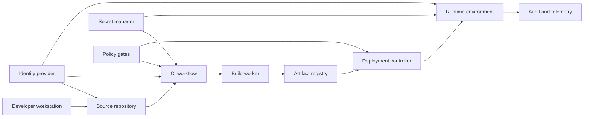
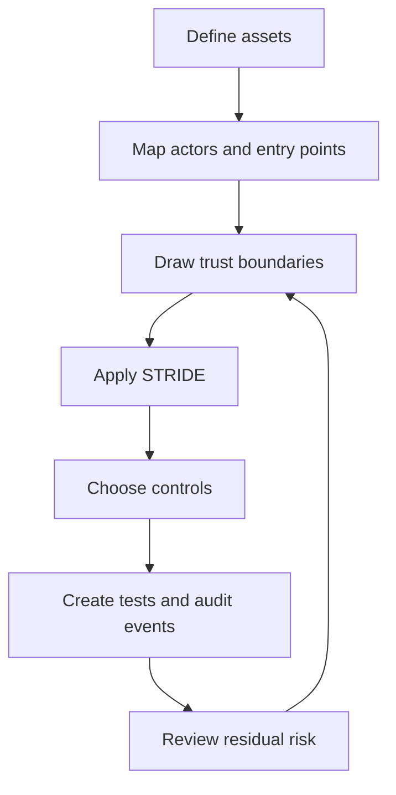
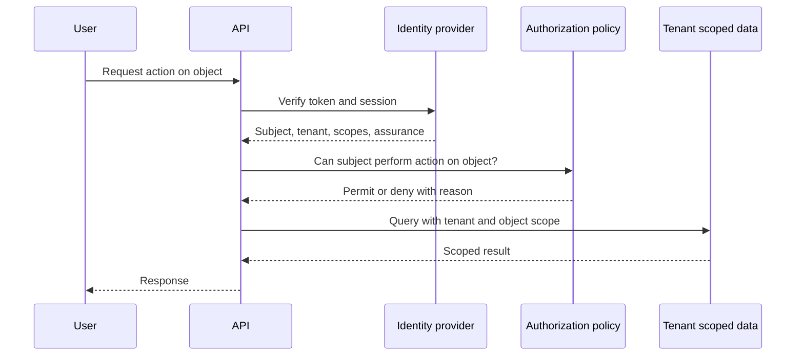
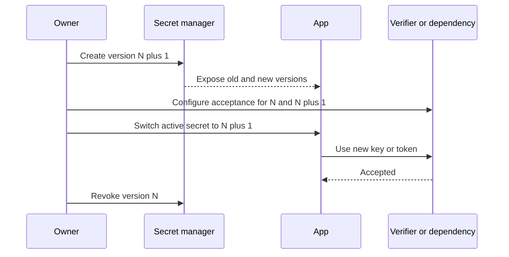
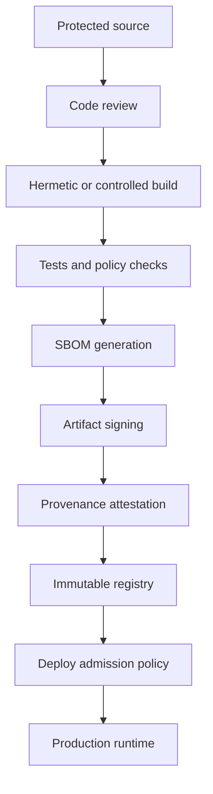

# Security and Supply Chain

Security engineering is the disciplined reduction of exploitable risk under adversarial conditions. Supply chain security extends that discipline across the path from source code to running production systems: developer laptops, repositories, dependencies, CI, build workers, artifacts, registries, deployment controllers, runtime identity, and operational access.

Security is not a single feature. It is a system property produced by clear trust boundaries, secure defaults, least privilege, reviewable change paths, verifiable artifacts, monitored production behavior, and fast recovery when controls fail.

## Existing anchor

- Software Supply Chain Security

## Security model

| Layer | Primary question | Main failure mode | Typical controls |
|---|---|---|---|
| Product behavior | What can a user or attacker do? | Abuse case is not modeled | Abuse cases, rate limits, fraud controls, safe defaults |
| Application code | Can input cross a trust boundary safely? | Injection, auth bypass, confused deputy | Validation, encoding, authorization checks, tests |
| Identity | Who or what is acting? | Spoofed actor or stale privilege | MFA, SSO, short-lived tokens, workload identity |
| Data | What must remain private, correct, and available? | Data leak, corruption, cross-tenant access | Encryption, tenant scoping, backups, access review |
| Network | Which flows are allowed? | Excessive reachability | Default deny, segmentation, egress control, mTLS |
| Runtime | Can a compromised component spread? | Container or process escape, lateral movement | Sandboxing, non-root, seccomp, network policies |
| Build system | Can code be transformed into artifacts safely? | CI secret theft, artifact substitution | Isolated runners, provenance, signing, protected refs |
| Dependencies | Can external code introduce risk? | Malware, vulnerable package, maintainer takeover | Lockfiles, review, SBOM, scanning, pinning |
| Operations | Can response be proven and recovered? | No audit trail or delayed containment | Audit logs, alerts, break glass, incident runbooks |

## Threat modeling

A threat model names assets, actors, entry points, trust boundaries, assumptions, abuse cases, and required controls. The output should be concrete enough to drive design changes, tests, monitoring, and review checklists.

| Element | What to capture | Example |
|---|---|---|
| Asset | Data, capability, system, key, or reputation value | Customer PII, signing key, production deploy rights |
| Actor | Human, service, dependency, internal admin, external attacker | Tenant admin, CI runner, compromised package |
| Entry point | Where input, commands, or artifacts enter | API endpoint, webhook, pull request, package install |
| Trust boundary | Where identity, privilege, network, or ownership changes | Browser to API, CI to cloud account, tenant A to tenant B |
| Assumption | Security claim that must remain true | Only deployment controller can write production namespace |
| Abuse case | Misuse path that harms confidentiality, integrity, or availability | User exports another tenant's data by guessing an ID |
| Control | Preventive, detective, or corrective mechanism | Tenant scoped query, audit log, rate limit, alert |
| Residual risk | Remaining risk accepted after controls | Admins can read limited support metadata |

### Threat model process

1. Draw the data flow and mark trust boundaries.
2. List assets and rank them by confidentiality, integrity, availability, and business impact.
3. Identify actors, including non-human actors such as services, CI jobs, dependencies, and deployment controllers.
4. Apply STRIDE to each boundary and high-value asset.
5. Convert threats into controls, tests, logs, and operational playbooks.
6. Record assumptions and review them when architecture, hosting, identity, or dependencies change.

### STRIDE

| STRIDE category | Security property at risk | Design question | Example | Common controls |
|---|---|---|---|---|
| Spoofing | Authenticity | Can an attacker pretend to be another user, service, or build system? | Forged webhook calls admin endpoint | MFA, signed webhooks, mTLS, workload identity, token audience checks |
| Tampering | Integrity | Can data, config, code, or artifacts be modified without detection? | Container image replaced after build | Immutable artifacts, signing, protected branches, checksums, append-only logs |
| Repudiation | Non-repudiation | Can an actor deny a sensitive action because evidence is missing? | Admin changes billing plan without trace | Structured audit logs, request IDs, signed events, clock sync |
| Information disclosure | Confidentiality | Can sensitive data be read by unauthorized parties? | Tenant IDOR returns another tenant invoice | Authorization checks, encryption, redaction, tenant scoping, least privilege |
| Denial of service | Availability | Can the system be exhausted, blocked, or made costly to run? | Expensive search endpoint hammered | Rate limits, quotas, backpressure, circuit breakers, autoscaling limits |
| Elevation of privilege | Authorization | Can a lower privilege actor gain higher privilege? | Read-only token calls write endpoint | RBAC, capability checks, privilege separation, scoped tokens, policy tests |

### Boundary focused questions

| Boundary | Questions |
|---|---|
| Browser to application | What input is untrusted? Which cookies are sent? Are CSRF and CORS rules explicit? |
| Application to database | Are queries tenant scoped? Are migrations controlled? Can app credentials mutate schema? |
| Service to service | How is caller identity proven? Is authorization based on identity, network location, or both? |
| CI to cloud | Which jobs can mint credentials? Are credentials bound to protected branches and environments? |
| Repository to package registry | Can a malicious dependency run install scripts? Are lockfile changes reviewed? |
| Registry to runtime | Can the deployer verify provenance and signature before rollout? |
| Operator to production | Are admin actions approved, logged, scoped, and reviewable? |

## Identity and access boundaries

Security decisions should distinguish authentication, authorization, delegation, tenancy, and operational access. Mixing them creates confused deputy problems and privilege leaks.

| Concept | Definition | Common mistake | Better pattern |
|---|---|---|---|
| Authentication | Proves who the actor is | Treating login as permission | Authenticate, then evaluate authorization per action |
| Authorization | Decides what the actor can do | Checking role only in the UI | Enforce server-side with object and tenant context |
| Delegation | Lets one actor act through another system | Reusing broad user tokens in backend jobs | Use scoped grants with explicit audience and expiry |
| Impersonation | Admin acts as a user for support or debugging | No visible marker or audit event | Require reason, approval for sensitive scope, and audit trail |
| Workload identity | Non-human identity for services and jobs | Static cloud keys in CI | OIDC federation, short-lived credentials, audience restrictions |
| Tenant boundary | Ownership boundary between customers or environments | Global IDs without tenant filters | Tenant scoped storage, policy tests, isolation checks |

### Authentication

Authentication should make account takeover expensive, token theft less useful, and session abuse detectable.

| Area | Recommended practice | Review prompt |
|---|---|---|
| Passwords | Use a modern password hashing function with unique salts | Is the hash algorithm current and cost tuned? |
| MFA | Require MFA for admins, deployers, billing owners, and support access | Can high-risk actions bypass MFA? |
| SSO | Prefer centralized identity for employees and enterprise tenants | Are groups and claims mapped explicitly? |
| Sessions | Use secure, HttpOnly cookies for browser sessions where practical | Are session lifetimes, rotation, and revocation defined? |
| Tokens | Bind issuer, audience, subject, expiry, and scopes | Does every verifier check issuer and audience? |
| Recovery | Treat recovery paths as authentication paths | Can email takeover or support workflow bypass MFA? |

### Authorization

Authorization should answer four questions every time: who is acting, on whose behalf, against which object, and for which action.

| Model | Good fit | Risk |
|---|---|---|
| RBAC | Coarse organizational roles | Role names become too broad over time |
| ABAC | Context-sensitive decisions using attributes | Policy can become hard to reason about |
| ReBAC | Relationship based sharing and collaboration | Requires careful graph consistency |
| Capability tokens | Narrow delegated access to a resource or action | Tokens must be short-lived and unforgeable |
| Policy as code | Centralized and testable authorization rules | Policy and app context can drift |

Authorization checks belong at the server-side enforcement point that owns the state change or read. UI checks improve usability but are not security controls.

### Tenant isolation

Tenant isolation is an authorization and data modeling problem, not just a UI filter.

| Isolation model | Description | Strengths | Risks |
|---|---|---|---|
| Shared database, shared schema | Tenant ID column on shared tables | Cost efficient and simple operations | Easy to miss tenant predicates |
| Shared database, separate schemas | Schema per tenant | Stronger logical separation | Migration and pooling complexity |
| Separate databases | Database per tenant | Stronger blast radius control | Higher operational cost |
| Separate runtime | Dedicated deployment or namespace per tenant | Strong isolation for regulated customers | More infrastructure and release complexity |

Required tenant controls:

- All tenant-owned rows carry an immutable tenant identifier.
- Server-side queries include tenant predicates by default.
- Object IDs are not treated as authorization.
- Background jobs preserve tenant context.
- Caches include tenant in the cache key.
- Search indexes, analytics exports, and logs are tenant scoped or redacted.
- Admin access has explicit tenant selection, reason capture, and audit events.
- Tests include cross-tenant negative cases.

## Secrets management

Secrets are credentials, private keys, tokens, passwords, signing keys, API keys, database URLs, webhook secrets, and anything that grants access when copied.

| Requirement | Practice | Failure signal |
|---|---|---|
| No secrets in git | Use secret scanning in pre-commit, CI, and hosted repository controls | A token appears in code, tests, fixtures, docs, or screenshots |
| Central storage | Store secrets in a managed secret manager or encrypted sealed secret workflow | Secrets live in chat, local notes, or CI variables without ownership |
| Runtime injection | Inject secrets at runtime through platform identity | Secrets are baked into images or frontend bundles |
| Least privilege | Scope each secret to one system, action set, and environment | One API key can read and write across prod and staging |
| Expiry | Prefer short-lived credentials and automatic renewal | Static keys live longer than the service that uses them |
| Auditability | Log secret reads, rotations, and policy changes | No one can answer who accessed a key |
| Rotation | Document trigger, owner, interval, and rollback | Rotation requires a risky manual deploy |

### Key rotation pattern

Rotating keys without outages requires overlap.

1. Generate a new key or credential.
2. Publish the new public key or store the new secret version.
3. Configure verifiers or consumers to accept both old and new versions.
4. Move signers or clients to the new version.
5. Confirm reads, writes, and signatures use the new version.
6. Revoke the old version.
7. Record audit evidence and remove stale references.

### Secret review checklist

- Is the secret needed, or can workload identity replace it?
- Is the secret scoped to one environment?
- Is the secret available only to the jobs, pods, or services that need it?
- Is the value excluded from logs, traces, crash reports, and metrics labels?
- Does rotation have an owner, a runbook, and a tested rollback?
- Are exposed secrets invalidated, not merely removed from git history?

## Network security

Network controls reduce reachability, lateral movement, and data exfiltration. They should complement identity and authorization, not replace them.

| Control | Purpose | Review prompt |
|---|---|---|
| Default deny ingress | Prevent unexpected callers | Which source identities or networks may call this service? |
| Default deny egress | Limit exfiltration and callback channels | Which external destinations are required? |
| Segmentation | Separate workloads by sensitivity and ownership | Can a low-trust service reach a high-trust data store? |
| TLS | Protect data in transit | Is certificate validation enforced, including internal calls? |
| mTLS | Authenticate service identity at transport layer | Are identities mapped to authorization policy? |
| Private endpoints | Avoid public exposure for internal services | Does any admin or database endpoint need the internet? |
| WAF and edge policy | Filter commodity attacks and enforce coarse rules | Are app-specific controls still present behind the edge? |
| DNS controls | Reduce spoofing and unmanaged destinations | Are critical names monitored and protected? |

Network posture should be reviewed as an allowlist. If a flow is not documented, monitored, and owned, it should not exist.

## Application security

Application security controls should be built into normal design and review. The right control depends on the trust boundary and data flow.

| Risk | Example | Primary controls |
|---|---|---|
| Injection | User input reaches SQL, shell, LDAP, template, or query language | Parameterized APIs, allowlists, escaping, sandboxing |
| XSS | Untrusted HTML or script reaches browser | Output encoding, CSP, safe rendering APIs, sanitization |
| CSRF | Browser sends authenticated state-changing request | SameSite cookies, CSRF tokens, origin checks |
| SSRF | Server fetches attacker-controlled URL | URL allowlists, metadata IP blocks, egress controls |
| IDOR | User guesses object ID from another tenant | Object-level authorization and tenant predicates |
| Deserialization | Untrusted data creates executable objects | Safe formats, schema validation, no polymorphic decode |
| File upload abuse | Malicious file executed, served, or parsed unsafely | Type validation, storage isolation, scanning, no execute permissions |
| Business logic abuse | Valid requests produce harmful outcome | Abuse cases, quotas, review workflows, anomaly detection |
| Race condition | Concurrent requests bypass limits or state transitions | Transactions, locks, idempotency keys, invariant tests |
| Sensitive logging | Secrets or PII stored in logs | Redaction, structured fields, retention limits |

### Secure defaults

Secure defaults reduce the number of correct choices an engineer must remember.

| Area | Default |
|---|---|
| APIs | Deny by default, require explicit authentication and authorization metadata |
| Data access | Tenant scoped repository methods instead of raw global queries |
| Cookies | Secure, HttpOnly, SameSite set intentionally |
| CORS | No wildcard origins on credentialed endpoints |
| Errors | Generic external messages, detailed internal correlation IDs |
| Logs | Structured logs with redaction and retention policy |
| Dependencies | Lockfile required, no unreviewed install scripts for sensitive builds |
| CI permissions | Read-only by default, write permissions only per job |
| Runtime | Non-root, read-only filesystem where practical, minimal capabilities |
| Network | Default deny, explicit ingress and egress |

### Appsec review checklist

- Does every endpoint define authentication and authorization expectations?
- Are authorization checks made on the object being read or mutated?
- Are tenant ID, user ID, and role derived from trusted context, not request body?
- Are validation rules close to the boundary where data enters?
- Are output encoding and rendering APIs safe for untrusted content?
- Can the endpoint be abused with replay, high volume, or expensive inputs?
- Does error handling avoid leaking secrets, internal IDs, stack traces, and policy details?
- Are logs useful for investigation without storing credentials or excessive personal data?
- Are tests present for negative authorization, cross-tenant access, and malformed input?

## Audit logs

Audit logs are security evidence. They should answer who did what, to which resource, from where, when, under which authority, and with what result.

| Field | Purpose |
|---|---|
| event_id | Stable identifier for deduplication and correlation |
| occurred_at | Timestamp from synchronized clock |
| actor_type | User, service, CI job, admin, support, dependency |
| actor_id | Stable actor identifier |
| tenant_id | Tenant or environment context |
| action | Normalized action name |
| resource_type | Type of object affected |
| resource_id | Object identifier, redacted if sensitive |
| decision | Permit, deny, fail, or partial |
| reason | Policy reason or business justification |
| source | IP, device, workload identity, repository, workflow |
| request_id | Link to application logs and traces |
| before_after_hash | Integrity evidence without storing full sensitive payload |

Audit logs should be append-only, access controlled, retained according to risk and regulation, and monitored for high-risk events such as failed admin access, privilege grants, secret reads, policy changes, deploy approvals, and signature verification failures.

## Supply chain security

Supply chain security protects the integrity and provenance of software before it reaches production.

### SBOM

An SBOM, or software bill of materials, inventories components in an artifact or repository. It supports vulnerability response, license review, dependency ownership, and incident scoping.

| SBOM property | Why it matters |
|---|---|
| Component name and version | Identifies vulnerable or risky packages |
| Package URL or unique ID | Reduces ambiguity across ecosystems |
| Direct versus transitive | Shows whether the project chose the dependency directly |
| License | Supports legal and compliance review |
| Hashes | Helps detect substitution |
| Build metadata | Links the SBOM to a specific artifact |
| Format | SPDX and CycloneDX are common interoperable formats |

SBOMs are most useful when generated in CI for the exact artifact being released, stored with the artifact, and connected to vulnerability management. A source-level SBOM is helpful, but an artifact-level SBOM is stronger because it reflects what was actually built.

### SLSA and provenance

SLSA, or Supply-chain Levels for Software Artifacts, describes increasing confidence that an artifact was built from the expected source by a trustworthy process. The practical goal is to make artifact origin verifiable and tampering harder.

| SLSA concern | Practical meaning |
|---|---|
| Source integrity | Protected branches, reviewed changes, signed tags where needed |
| Build integrity | Controlled runners, isolated jobs, pinned actions, minimal permissions |
| Provenance | Machine-readable statement of source, builder, inputs, commands, and output |
| Non-forgeability | Provenance is generated by the build platform, not by arbitrary script |
| Verification | Deployment policy checks provenance before accepting artifact |

Provenance should answer:

- Which repository, ref, and commit produced this artifact?
- Which workflow and builder produced it?
- Which inputs, dependencies, and parameters were used?
- Was the build triggered from a protected context?
- Is the attestation signed by a trusted identity?

### Artifact signing

Signing verifies artifact integrity and origin. It does not prove the code is secure, but it reduces substitution and tampering risk.

| Signing target | Example purpose |
|---|---|
| Git tags | Identify release source |
| Container images | Verify deployable image origin |
| Packages | Protect package registry consumers |
| SBOMs | Bind inventory to artifact |
| Provenance attestations | Bind build metadata to artifact |
| Policy bundles | Ensure security policy itself is trusted |

Signing keys are high-value assets. Prefer keyless signing backed by workload identity where supported, or store signing keys in hardware-backed or managed key systems. Deployment should verify signatures and identity claims, not only the presence of a signature.

## Dependency risk

Dependencies are executable trust relationships. A package can run during install, build, test, application startup, or runtime.

| Risk | Signal | Control |
|---|---|---|
| Known vulnerability | CVE or advisory affects used version | Upgrade, patch, mitigate, or remove |
| Malware | Obfuscated code, unexpected network calls, credential access | Review, sandbox installs, block package |
| Typosquatting | Name resembles popular package | Package allowlist, review new dependencies |
| Maintainer takeover | Sudden ownership or release behavior change | Monitor publisher changes and release diffs |
| Dependency confusion | Internal package name resolved from public registry | Private registry configuration and namespace controls |
| License risk | Incompatible license in transitive dependency | SBOM license review |
| Abandonment | No maintenance, old issues, unsupported runtime | Replace or vendor with ownership |
| Excessive privilege | Build tool needs broad filesystem or network access | Sandboxed builds, disable scripts where possible |

### Dependency review checklist

- Is the dependency necessary, or can existing platform capability cover the need?
- Is it direct or transitive?
- Who maintains it, and is release activity healthy?
- Does it run install scripts, code generation, native binaries, or postinstall hooks?
- Does it request network, filesystem, credentials, or shell access?
- Is the package pinned through a lockfile?
- Are lockfile changes reviewed like code changes?
- Is there a known vulnerability, malicious package advisory, or license concern?
- What is the removal plan if the dependency becomes unsafe?

## CI threat model

CI is a privileged automation environment. It reads source, runs untrusted code, accesses secrets, produces artifacts, and may deploy to production.

| Threat | Scenario | Control |
|---|---|---|
| Pull request secret theft | Untrusted PR modifies test script to exfiltrate secrets | Do not expose secrets to untrusted PRs, use restricted events |
| Token overpermission | Test job has repository write or cloud deploy rights | Set job-level permissions to least privilege |
| Runner persistence | Malicious build leaves state for later jobs | Ephemeral runners, workspace cleanup, isolation |
| Action compromise | Third-party action update runs malicious code | Pin actions to immutable SHAs and review updates |
| Artifact substitution | Attacker replaces build output before deployment | Immutable registry, signatures, provenance verification |
| Cache poisoning | Malicious dependency or build cache reused by trusted branch | Scope caches by branch, lockfile, and trust level |
| Environment bypass | Deployment runs without approval or protected ref | Protected environments, reviewers, branch rules |
| Log leakage | Secret printed in command output | Masking, redaction, secret minimization, no debug echo |
| OIDC abuse | Job mints cloud token from unintended branch | OIDC subject conditions, audience checks, environment gates |

### CI hardening checklist

- Declare job permissions explicitly.
- Separate untrusted pull request validation from trusted release workflows.
- Avoid running privileged workflows on mutable pull request code.
- Pin third-party actions and base images.
- Use ephemeral runners for sensitive jobs.
- Scope caches by trust boundary.
- Generate SBOM and provenance during release builds.
- Sign artifacts before publishing.
- Verify signatures and provenance before deployment.
- Protect release branches, tags, and environments.
- Store deployment credentials outside repository variables where possible.
- Review workflow changes with the same rigor as application code.

## Practical scenarios

### Scenario: cross-tenant invoice download

An endpoint accepts `invoice_id` and returns a PDF. Authentication confirms the user is logged in, but authorization only checks that the invoice exists.

| Step | Analysis |
|---|---|
| Asset | Customer invoice data |
| Threat | Information disclosure through IDOR |
| Boundary | User request to tenant-owned object |
| Control | Query invoice by `tenant_id` from trusted session and `invoice_id` together |
| Test | Tenant A receives 404 or 403 for Tenant B invoice ID |
| Audit | Log denied cross-tenant access attempts with actor, tenant, invoice ID hash, and request ID |

### Scenario: CI job deploys from a fork

A workflow runs on pull requests and has access to deployment credentials. A fork changes the test command to print secrets and call an attacker-controlled endpoint.

| Step | Analysis |
|---|---|
| Asset | Cloud credentials and production deploy permission |
| Threat | Spoofing, elevation of privilege, information disclosure |
| Boundary | Untrusted fork code to trusted CI environment |
| Control | No secrets for fork PRs, read-only token, separate trusted release workflow |
| Test | Verify fork PR event cannot access secret or deploy environment |
| Audit | Log credential minting with repository, workflow, ref, subject, and environment |

### Scenario: compromised package update

A direct dependency releases a minor version that includes a malicious postinstall script. The lockfile update is treated as routine and merged without review.

| Step | Analysis |
|---|---|
| Asset | Developer and CI credentials |
| Threat | Tampering and information disclosure |
| Boundary | Public package registry to local and CI execution |
| Control | Review dependency diffs, pin versions, restrict install scripts for sensitive builds |
| Test | CI policy flags new dependencies and install-script changes |
| Audit | Record dependency changes, reviewer, package metadata, and SBOM diff |

### Scenario: signing key exposed in logs

A release job prints environment variables while debugging. The artifact signing key is masked in the CI UI but still appears in a downloaded raw log from a subprocess.

| Step | Analysis |
|---|---|
| Asset | Artifact signing authority |
| Threat | Tampering and repudiation |
| Boundary | Secret manager to build logs |
| Control | Replace static key with keyless signing or managed key, disable env dumps, rotate exposed key |
| Test | Secret scanner covers logs and artifacts, not just source |
| Audit | Record exposure time, artifacts signed during exposure window, revocation, and replacement |

## Review checklists

### Threat model review

- Are assets, actors, entry points, and trust boundaries documented?
- Are STRIDE categories considered for each boundary?
- Are controls linked to tests, logs, and operational response?
- Are assumptions explicit and still true?
- Is residual risk accepted by the right owner?

### Identity and access review

- Is every sensitive action authenticated?
- Is authorization enforced server-side for the exact object and action?
- Are service accounts separate from human accounts?
- Are privileges scoped by environment, tenant, and operation?
- Are admin and support actions justified, time-bound, and audited?
- Are break glass credentials stored, tested, and reviewed?

### Network review

- Is ingress default deny?
- Is egress restricted to required destinations?
- Are databases, admin panels, and metadata services shielded from general workloads?
- Is TLS enforced for external and internal sensitive traffic?
- Are service identities verified beyond source IP?

### Supply chain review

- Are branch protections and required reviews active for release sources?
- Are dependency and lockfile changes reviewed?
- Are CI workflows least privilege by default?
- Are third-party actions pinned and owned?
- Is an SBOM generated for release artifacts?
- Is provenance generated by the trusted builder?
- Are artifacts signed and verified before deployment?
- Can the team rapidly answer whether a vulnerable dependency is present in production?

### Logging and detection review

- Are high-risk actions represented as structured audit events?
- Are denied authorization checks logged without leaking sensitive data?
- Are secret reads, rotations, policy changes, and deploys monitored?
- Are logs protected from tampering and excessive access?
- Are alerts tied to a response owner and runbook?

## Related notes

- Software testing
- kubernetes/Sections/6. Configuration and Secrets
- kubernetes/Sections/9. Advanced Topics &amp; Appendix
- [08 Reliability Observability and Operations](/compendium/software-engineering/reliability-observability-and-operations)
