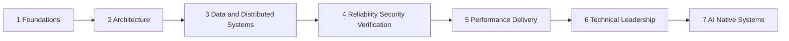

# Software Engineering

This is the canonical entry point for the Software Engineering knowledge base. Use it to move from broad system judgment to focused topic notes without losing the whole-system context. The goal is Staff and Principal engineering depth: concept mastery, design judgment, operational correctness, verification discipline, and the ability to change complex systems without creating hidden risk.

This note is a map, not a textbook. Leaf notes own depth, proofs, examples, checklists, code, and operational playbooks. This index owns routing, coverage, study order, and the relationships between domains.

## How to use this index

Use this page in four modes:

| Mode               | Use when                                                                                                | Start here                                                           | What good output looks like                                                                      |
| ------------------ | ------------------------------------------------------------------------------------------------------- | -------------------------------------------------------------------- | ------------------------------------------------------------------------------------------------ |
| Orientation        | You need the shape of the field before diving deeper.                                                   | [00 Staff Principal Software Engineering](/compendium/software-engineering/staff-principal-software-engineering) and the [#Domain map](#domain-map). | You can explain how correctness, reliability, security, performance, and execution fit together. |
| Design review      | You are evaluating an architecture, RFC, migration, incident fix, or platform change.                   | [#Staff and Principal standard](#staff-and-principal-standard) and [#System review lens](#system-review-lens).       | You identify invariants, failure modes, tradeoffs, verification gates, and owner boundaries.     |
| Topic study        | You need to master a specific area such as consensus, memory ordering, TLA+, queues, or release safety. | [#Required topic coverage matrix](#required-topic-coverage-matrix).                                 | You know the primary note, adjacent notes, and the question the topic helps answer.              |
| Execution planning | You need to sequence learning or project work at senior depth.                                          | [#Staff and Principal study path](#staff-and-principal-study-path).                                 | You have a staged path from fundamentals to cross-org technical leadership.                      |

Navigation rules:

- Start with the numbered notes when you need breadth. They are dense MOCs for each domain.
- Jump to existing vault anchors when they already own a topic, especially [Data Structures/Data Structures](/compendium/data-structures/data-structures), [Design Patterns/Design patterns](/compendium/design-patterns/design-patterns), Event-Driven Architectures and Event Sourcing, Software testing, Software Supply Chain Security, kubernetes/Kubernetes, AI-Enhanced Software Development, Indexing Large Codebases for AI-Assisted Development, Context-Aware Systems and MCP Protocols, and LLMOps and Model Deployment.
- Prefer the domain note before creating a new leaf note. If a topic only needs a routing sentence, keep it in the MOC. If it needs examples, proofs, diagrams, incident stories, or implementation detail, split it into an atomic note.
- Read laterally. Most important software engineering problems cross boundaries: a queueing issue can be a product SLO issue, a database isolation issue can be a security issue, and a deployment strategy can be an organizational design issue.
- Treat every note as a tool for decisions. Ask: what decision does this help me make, what invariant does it protect, and what evidence would show it is working?

## Core map

1. [00 Staff Principal Software Engineering](/compendium/software-engineering/staff-principal-software-engineering): Staff and Principal mental model, execution loop, system-property thinking, and review prompts.
2. [01 Engineering Fundamentals](/compendium/software-engineering/engineering-fundamentals): programming models, concurrency, memory ordering, cache coherency, nonblocking algorithms, liveness, and mutability.
3. [02 Architecture and Design](/compendium/software-engineering/architecture-and-design): code architecture, boundaries, state machines, architecture governance, ADRs, and design review.
4. [03 Data Structures Algorithms and Complexity](/compendium/software-engineering/data-structures-algorithms-and-complexity): complexity analysis, storage-oriented structures, concurrent data structures, and algorithmic patterns.
5. [04 Databases Storage and Transactions](/compendium/software-engineering/databases-storage-and-transactions): storage engines, indexes, isolation, transactions, replication, distributed databases, and migrations.
6. [05 Distributed Systems](/compendium/software-engineering/distributed-systems): consistency, time, CAP, PACELC, consensus, replicated state machines, quorums, retries, networking, and failure patterns.
7. [06 Caching Queues and Streaming](/compendium/software-engineering/caching-queues-and-streaming): caching, invalidation, queueing theory, delivery semantics, retry design, streaming, and Kafka.
8. [07 APIs Contracts and Integration](/compendium/software-engineering/apis-contracts-and-integration): API contracts, idempotency, event contracts, schema evolution, and integration risk.
9. [08 Reliability Observability and Operations](/compendium/software-engineering/reliability-observability-and-operations): failure modes, observability, alerts, incidents, control planes, and network operations.
10. [09 Security and Supply Chain](/compendium/software-engineering/security-and-supply-chain): threat modeling, access boundaries, secrets, supply chain controls, application security, and security review.
11. [10 Testing Verification and Quality Bars](/compendium/software-engineering/testing-verification-and-quality-bars): test layers, formal methods, TLA+, concurrency testing, quality bars, and review checklists.
12. [11 Performance Capacity and Cost](/compendium/software-engineering/performance-capacity-and-cost): latency, throughput, CPU, memory, contention, capacity planning, load testing, and cost engineering.
13. [12 Delivery Migrations and Release Engineering](/compendium/software-engineering/delivery-migrations-and-release-engineering): release strategies, migration safety, rollback, CI/CD, and GitOps.
14. [13 Technical Leadership and Execution](/compendium/software-engineering/technical-leadership-and-execution): Conway's Law, strategy, leverage, review systems, decisions, and operating rhythm.
15. [14 AI Native Software Engineering](/compendium/software-engineering/ai-native-software-engineering): AI-assisted development, agentic systems, retrieval, context engineering, LLMOps, and model deployment.

## Domain map

| Domain | Primary note | Core question | Typical artifacts |
|---|---|---|---|
| Engineering judgment | [00 Staff Principal Software Engineering](/compendium/software-engineering/staff-principal-software-engineering) | What system property are we changing, and who owns the risk? | Review prompts, decision frames, escalation criteria, learning plans. |
| Programming foundations | [01 Engineering Fundamentals](/compendium/software-engineering/engineering-fundamentals) | What behavior does the code have under concurrency, memory effects, mutation, and failure? | Invariants, concurrency contracts, liveness analysis, correctness notes. |
| Architecture | [02 Architecture and Design](/compendium/software-engineering/architecture-and-design) | What boundaries, states, and dependencies make change safer or more expensive? | ADRs, context diagrams, state machines, interface contracts. |
| Algorithms and structures | [03 Data Structures Algorithms and Complexity](/compendium/software-engineering/data-structures-algorithms-and-complexity) | What complexity, access pattern, and data shape does the system rely on? | Complexity budgets, data-structure choices, proof sketches, benchmark plans. |
| Data systems | [04 Databases Storage and Transactions](/compendium/software-engineering/databases-storage-and-transactions) | What guarantees does persistent state actually provide? | Isolation analysis, migration plans, schema evolution rules, backup and restore criteria. |
| Distributed systems | [05 Distributed Systems](/compendium/software-engineering/distributed-systems) | What happens when time, networks, membership, and partial failure become unreliable? | Consistency choices, quorum design, consensus notes, retry policies. |
| Flow control | [06 Caching Queues and Streaming](/compendium/software-engineering/caching-queues-and-streaming) | How do we absorb load, hide latency, and move work without violating correctness? | Cache policy, invalidation model, queue topology, stream processing contract. |
| Integration | [07 APIs Contracts and Integration](/compendium/software-engineering/apis-contracts-and-integration) | What do producers and consumers depend on, and how does that contract evolve? | API specs, event schemas, compatibility rules, idempotency keys. |
| Reliability | [08 Reliability Observability and Operations](/compendium/software-engineering/reliability-observability-and-operations) | How does the system fail, and how do humans detect and recover it? | SLOs, dashboards, alerts, runbooks, incident reviews. |
| Security | [09 Security and Supply Chain](/compendium/software-engineering/security-and-supply-chain) | What trust boundary can be crossed, and what prevents abuse or compromise? | Threat models, permission matrices, secret handling rules, supply chain attestations. |
| Verification | [10 Testing Verification and Quality Bars](/compendium/software-engineering/testing-verification-and-quality-bars) | What evidence is strong enough to trust this behavior? | Test strategy, model checks, fuzz tests, quality gates, review checklists. |
| Performance and cost | [11 Performance Capacity and Cost](/compendium/software-engineering/performance-capacity-and-cost) | Where are the bottlenecks, limits, and economic tradeoffs? | Capacity models, latency budgets, load tests, cost envelopes. |
| Delivery | [12 Delivery Migrations and Release Engineering](/compendium/software-engineering/delivery-migrations-and-release-engineering) | How do we ship, migrate, and recover without depending on luck? | Release plans, rollback plans, migration scripts, progressive delivery controls. |
| Leadership | [13 Technical Leadership and Execution](/compendium/software-engineering/technical-leadership-and-execution) | How do people, ownership, and incentives shape the technical system? | Strategy docs, decision logs, team topology, operating rhythms. |
| AI-native engineering | [14 AI Native Software Engineering](/compendium/software-engineering/ai-native-software-engineering) | How do AI tools and systems change build, test, operate, and govern loops? | Prompt protocols, evals, retrieval design, agent boundaries, LLMOps controls. |

## Knowledge graph

```mermaid
flowchart TD
    SE[Software Engineering MOC] --> SP[Staff and Principal Judgment]
    SE --> F[Engineering Fundamentals]
    SE --> ARCH[Architecture and Design]
    SE --> DATA[Data and Storage]
    SE --> DIST[Distributed Systems]
    SE --> FLOW[Caching Queues Streaming]
    SE --> API[APIs and Integration]
    SE --> REL[Reliability Operations]
    SE --> SEC[Security Supply Chain]
    SE --> VER[Testing Verification]
    SE --> PERF[Performance Capacity Cost]
    SE --> DEL[Delivery Migrations]
    SE --> LEAD[Technical Leadership]
    SE --> AI[AI Native Engineering]

    F --> CONC[Concurrency and Memory]
    F --> LIVE[Liveness and Mutability]
    ARCH --> BOUND[Boundaries]
    ARCH --> STATE[State Machines]
    DATA --> TX[Transactions and Isolation]
    DATA --> REPL[Storage Replication]
    DIST --> CONS[Consistency Consensus Quorum]
    DIST --> TIME[Time and Ordering]
    FLOW --> BACKPRESSURE[Backpressure and Queueing]
    FLOW --> INVALIDATION[Cache Invalidation]
    API --> CONTRACTS[Contracts and Schema Evolution]
    REL --> OBS[Observability]
    REL --> INCIDENTS[Incident Response]
    SEC --> THREAT[Threat Modeling]
    SEC --> SUPPLY[Supply Chain]
    VER --> FORMAL[TLA+ and Model Checking]
    VER --> TESTS[Test Strategy]
    PERF --> CAPACITY[Capacity Models]
    PERF --> CONTENTION[Contention]
    DEL --> MIGRATIONS[Migration Safety]
    DEL --> RELEASES[Release Strategy]
    LEAD --> CONWAY[Conway's Law]
    LEAD --> STRATEGY[Technical Strategy]
    AI --> RETRIEVAL[Retrieval and Context]
    AI --> EVALS[Evals and LLMOps]

    CONC --> CONTENTION
    TX --> CONS
    REPL --> CONS
    CONTRACTS --> MIGRATIONS
    OBS --> INCIDENTS
    THREAT --> CONTRACTS
    FORMAL --> CONS
    CAPACITY --> BACKPRESSURE
    CONWAY --> BOUND
    EVALS --> VER
```

## System review lens

Use this lens for architecture reviews, incident follow-ups, migration plans, and production readiness checks.

| Lens | Question | Evidence to look for | Related notes |
|---|---|---|---|
| Correctness | What invariant must remain true under retries, concurrency, partial failure, deploys, and repair jobs? | Explicit invariants, idempotency keys, transaction boundaries, model checks, race tests. | [01 Engineering Fundamentals](/compendium/software-engineering/engineering-fundamentals), [04 Databases Storage and Transactions](/compendium/software-engineering/databases-storage-and-transactions), [10 Testing Verification and Quality Bars](/compendium/software-engineering/testing-verification-and-quality-bars) |
| Reliability | What does the user observe when dependencies fail, slow down, split brain, or return stale data? | SLOs, graceful degradation, retry budgets, circuit breakers, alert quality, runbooks. | [05 Distributed Systems](/compendium/software-engineering/distributed-systems), [08 Reliability Observability and Operations](/compendium/software-engineering/reliability-observability-and-operations), [11 Performance Capacity and Cost](/compendium/software-engineering/performance-capacity-and-cost) |
| Operability | Can humans detect, understand, mitigate, and repair bad behavior quickly? | Dashboards, structured logs, traces, safe admin actions, incident playbooks, rollback commands. | [08 Reliability Observability and Operations](/compendium/software-engineering/reliability-observability-and-operations), [12 Delivery Migrations and Release Engineering](/compendium/software-engineering/delivery-migrations-and-release-engineering) |
| Evolvability | Can the design absorb new requirements without hidden coupling or data breakage? | Stable contracts, compatibility tests, bounded contexts, ADRs, schema evolution policy. | [02 Architecture and Design](/compendium/software-engineering/architecture-and-design), [07 APIs Contracts and Integration](/compendium/software-engineering/apis-contracts-and-integration), [13 Technical Leadership and Execution](/compendium/software-engineering/technical-leadership-and-execution) |
| Security | What trust boundary exists, and what prevents privilege escalation, data exposure, or supply chain compromise? | Threat model, least privilege, secret controls, dependency provenance, abuse cases. | [09 Security and Supply Chain](/compendium/software-engineering/security-and-supply-chain), Software Supply Chain Security |
| Performance | What happens at peak, during contention, and when the hot path shifts? | Latency budgets, throughput targets, load tests, profiles, queue depth, capacity model. | [06 Caching Queues and Streaming](/compendium/software-engineering/caching-queues-and-streaming), [11 Performance Capacity and Cost](/compendium/software-engineering/performance-capacity-and-cost), Littles law and efficient queue strategy |
| Delivery safety | How is the change deployed, observed, rolled back, and cleaned up? | Progressive rollout, migration phases, rollback plan, release gates, ownership. | [12 Delivery Migrations and Release Engineering](/compendium/software-engineering/delivery-migrations-and-release-engineering), [10 Testing Verification and Quality Bars](/compendium/software-engineering/testing-verification-and-quality-bars) |

Example review prompt:

> If this change is retried, deployed halfway, processed out of order, observed through stale caches, or rolled back after partial writes, what invariant still holds?

## Required topic coverage matrix

This matrix is the minimum advanced-topic routing table for this knowledge base. "Mastery signal" names the behavior that shows the topic is not just memorized.

| Topic | Primary location | Related locations | Mastery signal |
|---|---|---|---|
| Consistency | [05 Distributed Systems#Consistency models](/compendium/software-engineering/distributed-systems#consistency-models) | [04 Databases Storage and Transactions#Isolation and correctness](/compendium/software-engineering/databases-storage-and-transactions#isolation-and-correctness), [07 APIs Contracts and Integration#Event contracts](/compendium/software-engineering/apis-contracts-and-integration#event-contracts) | You can choose and defend a consistency model for a user-visible workflow. |
| Linearizability | [05 Distributed Systems#Consistency models](/compendium/software-engineering/distributed-systems#consistency-models) | [10 Testing Verification and Quality Bars#Formal methods and model checking](/compendium/software-engineering/testing-verification-and-quality-bars#formal-methods-and-model-checking) | You can distinguish real-time ordering from serializability and test the claim. |
| Serializability | [04 Databases Storage and Transactions#Isolation and correctness](/compendium/software-engineering/databases-storage-and-transactions#isolation-and-correctness) | [04 Databases Storage and Transactions#Transactions](/compendium/software-engineering/databases-storage-and-transactions#transactions) | You can explain anomalies and pick isolation levels based on invariants. |
| Eventual consistency | [05 Distributed Systems#Consistency models](/compendium/software-engineering/distributed-systems#consistency-models) | [06 Caching Queues and Streaming#Message delivery semantics](/compendium/software-engineering/caching-queues-and-streaming#message-delivery-semantics), [07 APIs Contracts and Integration#Event contracts](/compendium/software-engineering/apis-contracts-and-integration#event-contracts) | You can design reconciliation, read-your-writes expectations, and conflict handling. |
| Mutex | [01 Engineering Fundamentals#Concurrency primitives](/compendium/software-engineering/engineering-fundamentals#concurrency-primitives) | [11 Performance Capacity and Cost#Contention](/compendium/software-engineering/performance-capacity-and-cost#contention) | You can explain mutual exclusion, convoying, priority inversion, and lock scope. |
| Semaphores | [01 Engineering Fundamentals#Concurrency primitives](/compendium/software-engineering/engineering-fundamentals#concurrency-primitives) | [06 Caching Queues and Streaming#Queueing fundamentals](/compendium/software-engineering/caching-queues-and-streaming#queueing-fundamentals), [11 Performance Capacity and Cost#Contention](/compendium/software-engineering/performance-capacity-and-cost#contention) | You can use permits to bound concurrency without hiding overload. |
| Condition variables | [01 Engineering Fundamentals#Concurrency primitives](/compendium/software-engineering/engineering-fundamentals#concurrency-primitives) | [10 Testing Verification and Quality Bars#Concurrency testing](/compendium/software-engineering/testing-verification-and-quality-bars#concurrency-testing) | You can reason about wait predicates, missed wakeups, and spurious wakeups. |
| Memory ordering | [01 Engineering Fundamentals#Memory models and ordering](/compendium/software-engineering/engineering-fundamentals#memory-models-and-ordering) | [11 Performance Capacity and Cost#CPU and memory performance](/compendium/software-engineering/performance-capacity-and-cost#cpu-and-memory-performance) | You can explain acquire, release, fences, and why data races invalidate reasoning. |
| Atomic operations | [01 Engineering Fundamentals#Memory models and ordering](/compendium/software-engineering/engineering-fundamentals#memory-models-and-ordering) | [01 Engineering Fundamentals#Nonblocking algorithms](/compendium/software-engineering/engineering-fundamentals#nonblocking-algorithms) | You can use CAS or fetch-add while preserving a clear invariant. |
| Lock free programming, also written lock-free programming | [01 Engineering Fundamentals#Lock-free and wait-free programming](/compendium/software-engineering/engineering-fundamentals#lock-free-and-wait-free-programming) | [11 Performance Capacity and Cost#Lock-free and wait-free tradeoffs](/compendium/software-engineering/performance-capacity-and-cost#lock-free-and-wait-free-tradeoffs) | You can separate progress guarantees from raw speed and identify ABA risks. |
| Wait-free algorithms | [01 Engineering Fundamentals#Nonblocking algorithms](/compendium/software-engineering/engineering-fundamentals#nonblocking-algorithms) | [03 Data Structures Algorithms and Complexity#Concurrent data structures](/compendium/software-engineering/data-structures-algorithms-and-complexity#concurrent-data-structures) | You can explain bounded per-thread progress and when the complexity is justified. |
| Deadlocks | [01 Engineering Fundamentals#Liveness failures](/compendium/software-engineering/engineering-fundamentals#liveness-failures) | [10 Testing Verification and Quality Bars#Concurrency testing](/compendium/software-engineering/testing-verification-and-quality-bars#concurrency-testing) | You can identify circular wait and remove it through ordering, timeouts, or ownership changes. |
| Livelocks | [01 Engineering Fundamentals#Liveness failures](/compendium/software-engineering/engineering-fundamentals#liveness-failures) | [08 Reliability Observability and Operations#Failure modes](/compendium/software-engineering/reliability-observability-and-operations#failure-modes) | You can detect systems doing work without progress and add backoff or coordination. |
| Starvation | [01 Engineering Fundamentals#Liveness failures](/compendium/software-engineering/engineering-fundamentals#liveness-failures) | [11 Performance Capacity and Cost#Contention](/compendium/software-engineering/performance-capacity-and-cost#contention) | You can identify unfair scheduling and design bounded waiting. |
| Cache coherency | [01 Engineering Fundamentals#Cache coherency](/compendium/software-engineering/engineering-fundamentals#cache-coherency) | [11 Performance Capacity and Cost#CPU and memory performance](/compendium/software-engineering/performance-capacity-and-cost#cpu-and-memory-performance) | You can connect false sharing, cache lines, and memory visibility to latency. |
| Algorithmic complexity | [03 Data Structures Algorithms and Complexity#Complexity as an engineering tool](/compendium/software-engineering/data-structures-algorithms-and-complexity#complexity-as-an-engineering-tool) | [11 Performance Capacity and Cost#Capacity planning](/compendium/software-engineering/performance-capacity-and-cost#capacity-planning) | You can turn asymptotic complexity into an operational capacity limit. |
| Storage structures | [03 Data Structures Algorithms and Complexity#Storage oriented structures](/compendium/software-engineering/data-structures-algorithms-and-complexity#storage-oriented-structures) | [04 Databases Storage and Transactions#Storage engine mental model](/compendium/software-engineering/databases-storage-and-transactions#storage-engine-mental-model) | You can choose between B-trees, LSM trees, hash indexes, and log structures by workload. |
| Advanced databases | [04 Databases Storage and Transactions#Advanced databases](/compendium/software-engineering/databases-storage-and-transactions#advanced-databases) | [03 Data Structures Algorithms and Complexity#Storage oriented structures](/compendium/software-engineering/data-structures-algorithms-and-complexity#storage-oriented-structures) | You can explain storage, indexing, transactions, replication, and recovery as one system. |
| MVCC | [04 Databases Storage and Transactions#Isolation and correctness](/compendium/software-engineering/databases-storage-and-transactions#isolation-and-correctness) | [04 Databases Storage and Transactions#Transactions](/compendium/software-engineering/databases-storage-and-transactions#transactions) | You can explain snapshot visibility, write skew, vacuum pressure, and anomaly boundaries. |
| Replication | [05 Distributed Systems#Replication](/compendium/software-engineering/distributed-systems#replication) | [04 Databases Storage and Transactions#Replication and storage correctness](/compendium/software-engineering/databases-storage-and-transactions#replication-and-storage-correctness) | You can choose sync, async, leader, follower, and conflict models based on loss tolerance. |
| Quorum | [05 Distributed Systems#Quorums](/compendium/software-engineering/distributed-systems#quorums) | [04 Databases Storage and Transactions#Distributed databases](/compendium/software-engineering/databases-storage-and-transactions#distributed-databases) | You can reason about read and write quorums, failure tolerance, and stale reads. |
| CAP theorem | [05 Distributed Systems#CAP PACELC and failure tradeoffs](/compendium/software-engineering/distributed-systems#cap-pacelc-and-failure-tradeoffs) | [04 Databases Storage and Transactions#Distributed databases](/compendium/software-engineering/databases-storage-and-transactions#distributed-databases) | You can apply CAP only under partition and avoid using it as a vague slogan. |
| PACELC | [05 Distributed Systems#CAP PACELC and failure tradeoffs](/compendium/software-engineering/distributed-systems#cap-pacelc-and-failure-tradeoffs) | [11 Performance Capacity and Cost#Latency and throughput](/compendium/software-engineering/performance-capacity-and-cost#latency-and-throughput) | You can connect normal-case latency choices to failure-case consistency choices. |
| Consensus algorithms | [05 Distributed Systems#Consensus algorithms](/compendium/software-engineering/distributed-systems#consensus-algorithms) | [08 Reliability Observability and Operations#Control planes](/compendium/software-engineering/reliability-observability-and-operations#control-planes) | You can explain leader election, log replication, commit, membership, and split brain. |
| Replicated state machines | [05 Distributed Systems#Replicated state machines](/compendium/software-engineering/distributed-systems#replicated-state-machines) | [02 Architecture and Design#State machines](/compendium/software-engineering/architecture-and-design#state-machines) | You can model commands, deterministic application, replay, and recovery. |
| The clock problem | [05 Distributed Systems#Time clocks and ordering](/compendium/software-engineering/distributed-systems#time-clocks-and-ordering) | [10 Testing Verification and Quality Bars#Formal methods and model checking](/compendium/software-engineering/testing-verification-and-quality-bars#formal-methods-and-model-checking) | You can explain wall clocks, monotonic clocks, logical clocks, and clock skew failure modes. |
| Idempotency | [07 APIs Contracts and Integration#Idempotent APIs](/compendium/software-engineering/apis-contracts-and-integration#idempotent-apis) | [05 Distributed Systems#Idempotency and retries](/compendium/software-engineering/distributed-systems#idempotency-and-retries), [12 Delivery Migrations and Release Engineering#Migration safety](/compendium/software-engineering/delivery-migrations-and-release-engineering#migration-safety) | You can design duplicate-safe side effects across APIs, jobs, queues, and deploys. |
| Advanced networking | [05 Distributed Systems#Advanced networking](/compendium/software-engineering/distributed-systems#advanced-networking) | [08 Reliability Observability and Operations#Network operations](/compendium/software-engineering/reliability-observability-and-operations#network-operations), kubernetes/Kubernetes | You can debug latency, loss, DNS, load balancing, connection pools, and service discovery. |
| Caching | [06 Caching Queues and Streaming#Caching patterns](/compendium/software-engineering/caching-queues-and-streaming#caching-patterns) | [06 Caching Queues and Streaming#Cache invalidation](/compendium/software-engineering/caching-queues-and-streaming#cache-invalidation), [11 Performance Capacity and Cost#Latency and throughput](/compendium/software-engineering/performance-capacity-and-cost#latency-and-throughput) | You can state what is cached, why it is safe, how it expires, and how it is invalidated. |
| Queueing theory | [06 Caching Queues and Streaming#Queueing fundamentals](/compendium/software-engineering/caching-queues-and-streaming#queueing-fundamentals) | Littles law and efficient queue strategy, [11 Performance Capacity and Cost#Capacity planning](/compendium/software-engineering/performance-capacity-and-cost#capacity-planning) | You can use Little's Law to connect arrival rate, service time, queue depth, and latency. |
| Streaming | [06 Caching Queues and Streaming#Streaming systems](/compendium/software-engineering/caching-queues-and-streaming#streaming-systems) | Event-Driven Architectures and Event Sourcing, [07 APIs Contracts and Integration#Event contracts](/compendium/software-engineering/apis-contracts-and-integration#event-contracts) | You can reason about ordering, replay, partitions, offsets, schema evolution, and poison records. |
| API contracts | [07 APIs Contracts and Integration#Contract types](/compendium/software-engineering/apis-contracts-and-integration#contract-types) | [07 APIs Contracts and Integration#Schema evolution](/compendium/software-engineering/apis-contracts-and-integration#schema-evolution) | You can evolve producers and consumers independently without breaking compatibility. |
| Observability | [08 Reliability Observability and Operations#Observability pillars](/compendium/software-engineering/reliability-observability-and-operations#observability-pillars) | [08 Reliability Observability and Operations#Alert quality](/compendium/software-engineering/reliability-observability-and-operations#alert-quality) | You can design telemetry around user-visible symptoms and debuggable causes. |
| Incident response | [08 Reliability Observability and Operations#Incident response](/compendium/software-engineering/reliability-observability-and-operations#incident-response) | [13 Technical Leadership and Execution#Leadership operating rhythm](/compendium/software-engineering/technical-leadership-and-execution#leadership-operating-rhythm) | You can coordinate mitigation, communicate clearly, and produce useful learning. |
| Threat modeling | [09 Security and Supply Chain#Threat modeling](/compendium/software-engineering/security-and-supply-chain#threat-modeling) | [09 Security and Supply Chain#Access boundaries](/compendium/software-engineering/security-and-supply-chain#access-boundaries) | You can name assets, actors, trust boundaries, abuse cases, and mitigations. |
| Supply chain security | [09 Security and Supply Chain#Supply chain controls](/compendium/software-engineering/security-and-supply-chain#supply-chain-controls) | Software Supply Chain Security | You can defend dependency provenance, builds, artifacts, secrets, and CI/CD boundaries. |
| TLA+ | [10 Testing Verification and Quality Bars#Formal methods and model checking](/compendium/software-engineering/testing-verification-and-quality-bars#formal-methods-and-model-checking) | [05 Distributed Systems#Consensus algorithms](/compendium/software-engineering/distributed-systems#consensus-algorithms), [02 Architecture and Design#State machines](/compendium/software-engineering/architecture-and-design#state-machines) | You can model a small state machine and find a counterexample before code exists. |
| Concurrency testing | [10 Testing Verification and Quality Bars#Concurrency testing](/compendium/software-engineering/testing-verification-and-quality-bars#concurrency-testing) | [01 Engineering Fundamentals#Liveness failures](/compendium/software-engineering/engineering-fundamentals#liveness-failures) | You can combine stress, schedule control, race detection, and invariant checks. |
| Performance profiling | [11 Performance Capacity and Cost#CPU and memory performance](/compendium/software-engineering/performance-capacity-and-cost#cpu-and-memory-performance) | [11 Performance Capacity and Cost#Load testing](/compendium/software-engineering/performance-capacity-and-cost#load-testing) | You can distinguish CPU, IO, allocation, lock contention, and queueing bottlenecks. |
| Capacity planning | [11 Performance Capacity and Cost#Capacity planning](/compendium/software-engineering/performance-capacity-and-cost#capacity-planning) | [06 Caching Queues and Streaming#Queueing fundamentals](/compendium/software-engineering/caching-queues-and-streaming#queueing-fundamentals) | You can forecast load, saturation, headroom, and degradation behavior. |
| Migration safety | [12 Delivery Migrations and Release Engineering#Migration safety](/compendium/software-engineering/delivery-migrations-and-release-engineering#migration-safety) | [04 Databases Storage and Transactions#Data migration playbook](/compendium/software-engineering/databases-storage-and-transactions#data-migration-playbook) | You can split schema, code, and data changes into reversible phases. |
| Rollback and rollforward | [12 Delivery Migrations and Release Engineering#Rollback and rollforward](/compendium/software-engineering/delivery-migrations-and-release-engineering#rollback-and-rollforward) | [08 Reliability Observability and Operations#Incident response](/compendium/software-engineering/reliability-observability-and-operations#incident-response) | You can choose when to revert, when to roll forward, and what data cleanup is needed. |
| GitOps | [12 Delivery Migrations and Release Engineering#GitOps operating model](/compendium/software-engineering/delivery-migrations-and-release-engineering#gitops-operating-model) | kubernetes/Kubernetes, [08 Reliability Observability and Operations#Control planes](/compendium/software-engineering/reliability-observability-and-operations#control-planes) | You can keep desired state, live state, drift, and reconciliation clear. |
| Conway's Law | [13 Technical Leadership and Execution#Conways Law](/compendium/software-engineering/technical-leadership-and-execution#conways-law) | [02 Architecture and Design#Architecture and organization](/compendium/software-engineering/architecture-and-design#architecture-and-organization) | You can connect team topology to module boundaries, ownership, and communication cost. |
| Technical strategy | [13 Technical Leadership and Execution#Technical strategy](/compendium/software-engineering/technical-leadership-and-execution#technical-strategy) | [00 Staff Principal Software Engineering#The execution loop](/compendium/software-engineering/staff-principal-software-engineering#the-execution-loop) | You can turn ambiguous technical direction into sequenced bets and decision points. |
| AI-assisted development | [14 AI Native Software Engineering#AI assisted development quality bar](/compendium/software-engineering/ai-native-software-engineering#ai-assisted-development-quality-bar) | AI-Enhanced Software Development, [10 Testing Verification and Quality Bars#Quality bars](/compendium/software-engineering/testing-verification-and-quality-bars#quality-bars) | You can raise throughput without lowering review, evidence, or ownership standards. |
| Retrieval and context | [14 AI Native Software Engineering#Retrieval and context](/compendium/software-engineering/ai-native-software-engineering#retrieval-and-context) | Indexing Large Codebases for AI-Assisted Development, Context-Aware Systems and MCP Protocols | You can design context systems with freshness, relevance, permissions, and auditability. |
| LLMOps | [14 AI Native Software Engineering#LLMOps](/compendium/software-engineering/ai-native-software-engineering#llmops) | LLMOps and Model Deployment, [08 Reliability Observability and Operations#Observability pillars](/compendium/software-engineering/reliability-observability-and-operations#observability-pillars) | You can evaluate, deploy, monitor, and roll back model behavior with production discipline. |

## Cross-domain trails

Use these trails when the question is broader than one note.

| Question | Trail |
|---|---|
| How do I design a reliable stateful service? | [02 Architecture and Design#State machines](/compendium/software-engineering/architecture-and-design#state-machines) -> [04 Databases Storage and Transactions#Transactions](/compendium/software-engineering/databases-storage-and-transactions#transactions) -> [05 Distributed Systems#Replication](/compendium/software-engineering/distributed-systems#replication) -> [08 Reliability Observability and Operations#Observability pillars](/compendium/software-engineering/reliability-observability-and-operations#observability-pillars) -> [12 Delivery Migrations and Release Engineering#Migration safety](/compendium/software-engineering/delivery-migrations-and-release-engineering#migration-safety) |
| How do I make retries safe? | [07 APIs Contracts and Integration#Idempotent APIs](/compendium/software-engineering/apis-contracts-and-integration#idempotent-apis) -> [05 Distributed Systems#Idempotency and retries](/compendium/software-engineering/distributed-systems#idempotency-and-retries) -> [06 Caching Queues and Streaming#Poison messages and retries](/compendium/software-engineering/caching-queues-and-streaming#poison-messages-and-retries) -> [10 Testing Verification and Quality Bars#Quality bars](/compendium/software-engineering/testing-verification-and-quality-bars#quality-bars) |
| How do I debug production latency? | [11 Performance Capacity and Cost#Latency and throughput](/compendium/software-engineering/performance-capacity-and-cost#latency-and-throughput) -> [06 Caching Queues and Streaming#Queueing fundamentals](/compendium/software-engineering/caching-queues-and-streaming#queueing-fundamentals) -> [08 Reliability Observability and Operations#Observability pillars](/compendium/software-engineering/reliability-observability-and-operations#observability-pillars) -> [05 Distributed Systems#Advanced networking](/compendium/software-engineering/distributed-systems#advanced-networking) |
| How do I ship a risky data change? | [04 Databases Storage and Transactions#Data migration playbook](/compendium/software-engineering/databases-storage-and-transactions#data-migration-playbook) -> [12 Delivery Migrations and Release Engineering#Migration safety](/compendium/software-engineering/delivery-migrations-and-release-engineering#migration-safety) -> [10 Testing Verification and Quality Bars#Quality bars](/compendium/software-engineering/testing-verification-and-quality-bars#quality-bars) -> [08 Reliability Observability and Operations#Incident response](/compendium/software-engineering/reliability-observability-and-operations#incident-response) |
| How do I evaluate a platform architecture? | [00 Staff Principal Software Engineering#System property checklist](/compendium/software-engineering/staff-principal-software-engineering#system-property-checklist) -> [02 Architecture and Design#Boundaries](/compendium/software-engineering/architecture-and-design#boundaries) -> [13 Technical Leadership and Execution#Conways Law](/compendium/software-engineering/technical-leadership-and-execution#conways-law) -> [09 Security and Supply Chain#Threat modeling](/compendium/software-engineering/security-and-supply-chain#threat-modeling) |
| How do I design event-driven systems? | Event-Driven Architectures and Event Sourcing -> [06 Caching Queues and Streaming#Streaming systems](/compendium/software-engineering/caching-queues-and-streaming#streaming-systems) -> [07 APIs Contracts and Integration#Event contracts](/compendium/software-engineering/apis-contracts-and-integration#event-contracts) -> [05 Distributed Systems#Time clocks and ordering](/compendium/software-engineering/distributed-systems#time-clocks-and-ordering) |
| How do I review AI-native engineering work? | [14 AI Native Software Engineering#AI assisted development quality bar](/compendium/software-engineering/ai-native-software-engineering#ai-assisted-development-quality-bar) -> Indexing Large Codebases for AI-Assisted Development -> Context-Aware Systems and MCP Protocols -> [10 Testing Verification and Quality Bars#Quality bars](/compendium/software-engineering/testing-verification-and-quality-bars#quality-bars) |

## Staff and Principal standard

A senior engineer can implement a feature. A Staff or Principal engineer can reason about the system property the feature changes.

- Correctness: the invariant remains true under retries, concurrency, partial failure, deploys, backfills, and repair jobs.
- Reliability: users get predictable behavior when dependencies fail, slow down, split brain, or return stale data.
- Operability: humans can detect, understand, mitigate, and repair production behavior with bounded confusion.
- Evolvability: future product changes do not require unplanned rewrites or unsafe coupling across ownership lines.
- Simplicity: the design minimizes concepts, states, owners, and failure modes while still meeting the real requirement.
- Verification: tests, simulations, model checks, reviews, and runtime signals are strong enough for the blast radius.
- Leadership: the decision improves the technical system and the human system that owns it.

Staff and Principal depth is visible in the questions asked before implementation:

- What is the smallest durable invariant?
- What is the largest plausible blast radius?
- What state can become inconsistent, orphaned, duplicated, stale, or unowned?
- What happens if the operation runs twice, runs halfway, runs out of order, or runs during deploy?
- Which dependencies are trusted, which are only best effort, and which must fail closed?
- What must be observable before rollout, during rollout, after rollback, and after cleanup?
- What future change would this design make easier, and what future change would it make harder?

## Staff and Principal study path

This path is ordered by dependency, not by difficulty. Move forward when you can use the topic in a real design review.

### 1. Foundations: reason about local correctness

Read:

- [01 Engineering Fundamentals](/compendium/software-engineering/engineering-fundamentals)
- [03 Data Structures Algorithms and Complexity](/compendium/software-engineering/data-structures-algorithms-and-complexity)
- [Data Structures/Data Structures](/compendium/data-structures/data-structures)
- [Design Patterns/Design patterns](/compendium/design-patterns/design-patterns)

Practice:

- Explain mutexes, semaphores, atomics, memory ordering, and liveness failures without relying on framework behavior.
- Turn a complex function into explicit invariants, state transitions, and failure cases.
- Estimate the operational impact of an algorithmic choice under realistic load.

Exit standard:

- You can identify when a bug is caused by mutation, concurrency, aliasing, hidden state, or complexity growth.

### 2. Architecture: design boundaries that survive change

Read:

- [02 Architecture and Design](/compendium/software-engineering/architecture-and-design)
- [07 APIs Contracts and Integration](/compendium/software-engineering/apis-contracts-and-integration)
- Event-Driven Architectures and Event Sourcing

Practice:

- Draw module boundaries and name the contracts between them.
- Model a workflow as a state machine before choosing tables, queues, or APIs.
- Write an ADR that states the rejected alternatives and the operating consequences.

Exit standard:

- You can explain how a design changes failure modes, team ownership, migration paths, and future options.

### 3. Data and distributed systems: handle partial failure honestly

Read:

- [04 Databases Storage and Transactions](/compendium/software-engineering/databases-storage-and-transactions)
- [05 Distributed Systems](/compendium/software-engineering/distributed-systems)
- [06 Caching Queues and Streaming](/compendium/software-engineering/caching-queues-and-streaming)
- Littles law and efficient queue strategy

Practice:

- Compare isolation levels through concrete anomaly examples.
- Design idempotent APIs and queue consumers that tolerate duplicate delivery.
- Explain when to use cache invalidation, leases, quorums, logical clocks, or consensus.

Exit standard:

- You can make correctness claims under stale reads, retries, partitions, clock skew, replica lag, and reprocessing.

### 4. Reliability, security, and verification: prove enough before trust

Read:

- [08 Reliability Observability and Operations](/compendium/software-engineering/reliability-observability-and-operations)
- [09 Security and Supply Chain](/compendium/software-engineering/security-and-supply-chain)
- [10 Testing Verification and Quality Bars](/compendium/software-engineering/testing-verification-and-quality-bars)
- Software testing
- Software Supply Chain Security

Practice:

- Build a test strategy that matches blast radius rather than code volume.
- Write a small TLA+ model or state-machine model for a workflow with concurrency or retries.
- Create a threat model that covers assets, actors, trust boundaries, abuse paths, and controls.
- Design alerts around user-visible symptoms and actionable causes.

Exit standard:

- You can say what evidence is sufficient, what evidence is missing, and what residual risk remains.

### 5. Performance, capacity, and delivery: ship under real constraints

Read:

- [11 Performance Capacity and Cost](/compendium/software-engineering/performance-capacity-and-cost)
- [12 Delivery Migrations and Release Engineering](/compendium/software-engineering/delivery-migrations-and-release-engineering)
- kubernetes/Kubernetes
- kubernetes/One-Day Kubernetes Crash Course

Practice:

- Build a capacity model using arrival rate, service time, utilization, and queue depth.
- Profile before optimizing and separate CPU, IO, allocation, lock, and network bottlenecks.
- Plan a reversible database migration with expand, migrate, contract phases.
- Define rollout, rollback, observability, and cleanup gates for a production change.

Exit standard:

- You can ship changes with measurable safety rather than optimism.

### 6. Technical leadership: scale judgment through people and systems

Read:

- [13 Technical Leadership and Execution](/compendium/software-engineering/technical-leadership-and-execution)
- [00 Staff Principal Software Engineering](/compendium/software-engineering/staff-principal-software-engineering)
- SWE Review topics

Practice:

- Translate ambiguous business pressure into technical strategy and decision points.
- Use Conway's Law to reason about ownership, interfaces, and review boundaries.
- Run reviews that improve the system without turning every concern into a blocker.

Exit standard:

- You can make high-leverage technical decisions legible to engineers, managers, security, operations, and product leaders.

### 7. AI-native engineering: use AI with production discipline

Read:

- [14 AI Native Software Engineering](/compendium/software-engineering/ai-native-software-engineering)
- AI-Enhanced Software Development
- Indexing Large Codebases for AI-Assisted Development
- Context-Aware Systems and MCP Protocols
- LLMOps and Model Deployment

Practice:

- Define evals before using an AI behavior in a critical workflow.
- Treat retrieval and context as governed systems with freshness, relevance, permissions, and auditability.
- Review generated code by invariants, tests, threat model, and operational behavior, not by surface plausibility.

Exit standard:

- You can use AI to improve throughput while preserving evidence, ownership, and production accountability.

## Existing vault anchors

Use these notes as established source nodes instead of duplicating depth in this MOC:

- [Data Structures/Data Structures](/compendium/data-structures/data-structures)
- [Design Patterns/Design patterns](/compendium/design-patterns/design-patterns)
- Event-Driven Architectures and Event Sourcing
- Software Engineering glossary
- Software testing
- Software Supply Chain Security
- SWE Review topics
- Littles law and efficient queue strategy
- kubernetes/Kubernetes
- kubernetes/One-Day Kubernetes Crash Course
- AI-Enhanced Software Development
- Indexing Large Codebases for AI-Assisted Development
- Context-Aware Systems and MCP Protocols
- LLMOps and Model Deployment

## Maintenance rules

- Keep this note canonical: every major Software Engineering domain should be reachable from here in one hop.
- Keep leaf depth out of this file unless the example improves routing or decision quality.
- Preserve wikilinks when renaming or splitting notes.
- Add new topics to the coverage matrix only when they are required for Staff or Principal judgment.
- Prefer domain notes for intermediate routing and atomic notes for deep worked examples.
