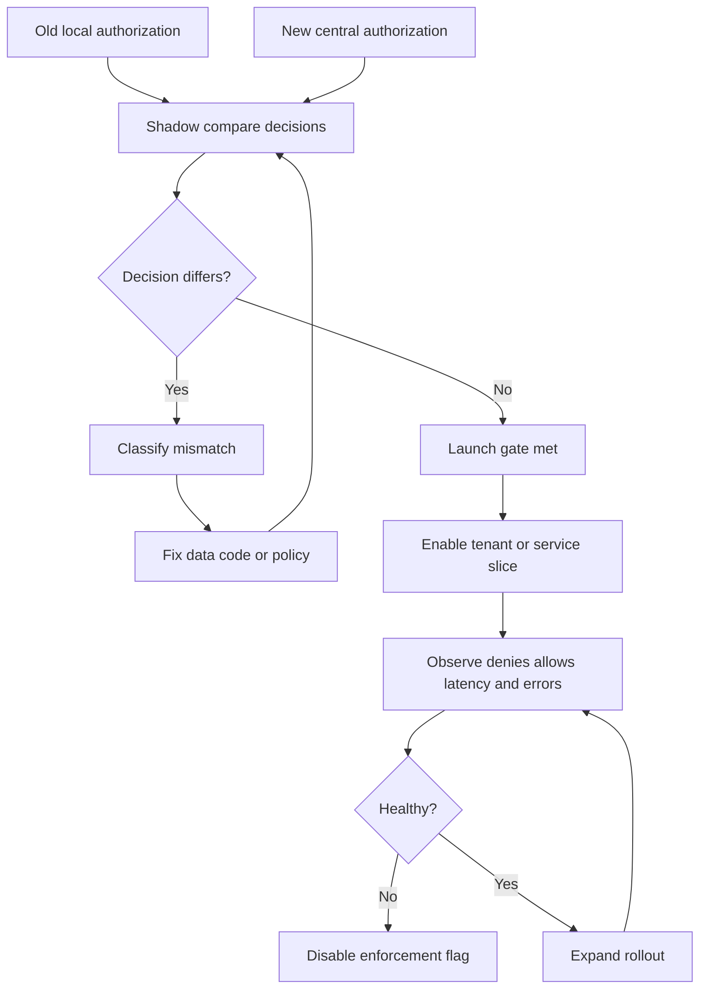

# Staff Principal Software Engineering

This note defines the operating model for senior individual contributor engineering at Staff and Principal scope. The rest of the folder breaks this model into specific disciplines.

The core shift is from "I can solve hard problems" to "I can make the system, the organization, and the delivery path reliably produce good technical outcomes."

## The principal question

For every meaningful system change, ask:

&gt; What system property changes, who owns that property, how can it fail, and how do we know?

That question connects code, architecture, reliability, security, cost, delivery, and organizational design. It also prevents the common failure mode where a team debates implementation details while nobody names the property being protected.

## Staff vs Principal scope

| Dimension | Staff engineer | Principal engineer |
|---|---|---|
| Primary surface | One team, one platform area, or a bounded cross-team program. | Multiple teams, product lines, platforms, or company-level technical direction. |
| Default time horizon | Quarters. | Multiple quarters to years. |
| Main leverage | Makes hard systems legible and executable. | Sets durable technical direction and changes how the organization makes decisions. |
| Ambiguity level | Turns ambiguous work into plans, designs, interfaces, and rollout paths. | Turns ambiguous strategy into technical bets, sequencing, ownership models, and portfolio tradeoffs. |
| Decision mode | Recommends and drives high-quality decisions in a domain. | Creates decision systems that help many teams make aligned decisions without central approval. |
| Quality role | Raises bars for design, testing, operability, and review in active work. | Defines the bar, explains why it matters, and installs mechanisms that keep it true under schedule pressure. |
| Failure mode | Becomes a bottleneck for reviews, incidents, or designs. | Becomes a shadow architecture board or disconnected strategist. |
| Success signal | Other engineers ship better systems because of their framing, designs, and coaching. | The organization avoids classes of failure and compounds technical advantage because of their direction. |

Staff scope is usually about making a specific technical domain reliable, understandable, and easier to change. Principal scope is about changing the trajectory of several domains at once while keeping the reasoning crisp enough that teams can execute locally.

## Core competence areas

| Area | Staff and Principal depth | Related notes |
|---|---|---|
| Fundamentals | Understand data structures, algorithms, concurrency, memory, networking, operating systems, and runtime behavior. | [01 Engineering Fundamentals](/compendium/software-engineering/engineering-fundamentals), [03 Data Structures Algorithms and Complexity](/compendium/software-engineering/data-structures-algorithms-and-complexity) |
| Architecture | Design boundaries, contracts, state ownership, dependency direction, evolvability, and failure containment. | [02 Architecture and Design](/compendium/software-engineering/architecture-and-design) |
| Distributed systems | Reason about partial failure, consistency, consensus, replication, quorums, clocks, queues, caches, and retries. | [05 Distributed Systems](/compendium/software-engineering/distributed-systems), [06 Caching Queues and Streaming](/compendium/software-engineering/caching-queues-and-streaming) |
| Databases | Understand indexes, transactions, isolation, WAL, storage engines, sharding, replication, backup, and recovery. | [04 Databases Storage and Transactions](/compendium/software-engineering/databases-storage-and-transactions) |
| APIs | Design stable contracts, versioning, compatibility, idempotency, pagination, rate limits, and integration failure behavior. | [07 APIs Contracts and Integration](/compendium/software-engineering/apis-contracts-and-integration) |
| Reliability | Define SLOs, error budgets, blast radius, runbooks, incident response, observability, and recovery strategy. | [08 Reliability Observability and Operations](/compendium/software-engineering/reliability-observability-and-operations) |
| Quality | Create test strategies, quality bars, review systems, static checks, property tests, model checks, and production gates. | [10 Testing Verification and Quality Bars](/compendium/software-engineering/testing-verification-and-quality-bars) |
| Security | Threat model systems, protect supply chains, govern secrets, design least privilege, and reduce exploitability. | [09 Security and Supply Chain](/compendium/software-engineering/security-and-supply-chain) |
| Performance and cost | Model capacity, tail latency, resource contention, scaling limits, unit economics, and cost control loops. | [11 Performance Capacity and Cost](/compendium/software-engineering/performance-capacity-and-cost) |
| Delivery | Plan migrations, releases, compatibility windows, feature flags, rollback, GitOps, and safe change management. | [12 Delivery Migrations and Release Engineering](/compendium/software-engineering/delivery-migrations-and-release-engineering) |
| Leadership | Shape technical strategy, align teams, teach judgment, make tradeoffs explicit, and reduce organizational drag. | [13 Technical Leadership and Execution](/compendium/software-engineering/technical-leadership-and-execution) |
| AI native work | Use AI tools to accelerate exploration, review, testing, documentation, and implementation without delegating judgment. | [14 AI Native Software Engineering](/compendium/software-engineering/ai-native-software-engineering) |

## Operating principles

| Principle | Practical meaning | Failure signal |
|---|---|---|
| Name the property | Say exactly whether the work changes correctness, availability, durability, latency, security, cost, operability, or evolvability. | People debate code style while the real risk is data loss, overload, or broken ownership. |
| State the invariant | Define what must always be true before choosing implementation details. | Tests assert examples but not the rule that matters. |
| Preserve optionality deliberately | Know which choices must remain reversible and which choices are intentionally permanent. | The team buys flexibility everywhere and gets complexity everywhere. |
| Bound blast radius | Assume partial failure and design the failed state. | A local bug becomes a global incident. |
| Make ownership explicit | Assign the runtime owner, the data owner, the API owner, and the incident owner. | Everyone can approve a change but nobody owns the failure. |
| Prefer proof over confidence | Use tests, models, metrics, staged rollout, and rollback drills. | The argument is "this should be fine" instead of "this is the evidence." |
| Optimize the constraint | Identify whether the limiting factor is correctness, time, money, latency, team capacity, regulatory risk, or user trust. | The team improves an irrelevant metric while the real constraint tightens. |
| Teach the frame | Leave behind language and review prompts others can reuse. | The same debate repeats in every design review. |

## The execution loop

```mermaid
flowchart LR
    Intent[Product or platform intent] --> Properties[Name system properties]
    Properties --> Invariants[Define invariants]
    Invariants --> Boundaries[Set ownership and boundaries]
    Boundaries --> Design[Design state and contracts]
    Design --> Verify[Verify with tests reviews and models]
    Verify --> Ship[Ship behind safe rollout controls]
    Ship --> Observe[Observe real behavior]
    Observe --> Learn[Learn from metrics incidents and users]
    Learn --> Intent
```



The loop is not a waterfall. A Principal engineer moves back and forth through it quickly. If verification reveals that the invariant is untestable, the design is not done. If observation reveals that the metric is not diagnostic, the rollout is not done. If ownership is unclear, the architecture is not done.

## System property checklist

| Property | Questions to answer | Evidence to require |
|---|---|---|
| Correctness | What must always be true? What invalid state must be unrepresentable or repairable? What is the source of truth? | Invariants, property tests, transaction boundaries, reconciliation checks, data audits. |
| Availability | What can fail independently? What degrades gracefully? What dependency can take us down? | SLOs, timeout budgets, load shedding behavior, failover test, dependency map. |
| Durability | What data must survive process, node, region, operator, or deploy failure? | Backup tests, restore tests, WAL or event log reasoning, corruption detection, retention policy. |
| Consistency | What read-after-write guarantee exists? Where can stale reads appear? How are conflicts resolved? | Isolation model, cache invalidation plan, quorum choice, conflict tests, read model contract. |
| Latency | What is on the critical path? What affects p95 and p99? What contention grows with load? | Traces, load tests, queue depth, flame graphs, capacity model, timeout hierarchy. |
| Security | Who can do what? What data crosses trust boundaries? What supply chain risk exists? | Threat model, least privilege proof, secret handling, audit logs, dependency policy. |
| Operability | How does the system tell us it is unhealthy? Who responds? How is repair performed? | Dashboards, alerts, runbooks, logs, traces, profiles, ownership matrix. |
| Evolvability | What will be hard to change later? Which contracts are public? Which data shapes are sticky? | ADR, migration plan, compatibility test, dependency direction, deprecation path. |
| Cost | What scales with users, tenants, traffic, storage, or background work? | Unit cost model, budget alarms, quota policy, rightsizing review, load forecast. |

## Invariant thinking

An invariant is a rule that must hold across implementation choices, deployments, retries, failures, and human operations.

Examples:

| Domain | Weak requirement | Better invariant |
|---|---|---|
| Billing | "Do not double charge users." | For a given account, invoice period, and billable event id, at most one settled charge can exist. |
| Permissions | "Users can only access their projects." | Every data read is authorized against the subject, resource, action, and tenant boundary before data leaves the service. |
| Migration | "No records should be lost." | Every source record is either represented in the target schema with an equivalent semantic state or is listed in an auditable exclusion set. |
| Queues | "Messages should be processed once." | Processing is idempotent for a stable operation key, and duplicate delivery cannot create an externally visible duplicate effect. |
| Caching | "Cache should be fresh." | A user-visible read either reflects the latest committed write or is explicitly allowed to be stale for no more than the documented window. |
| Availability | "The service should stay up." | A failure of any single noncritical dependency cannot prevent authenticated users from reading their existing committed data. |

### Invariant checklist

- The invariant has an owner.
- The invariant names the entity, boundary, and allowed state.
- The invariant is testable without relying only on manual inspection.
- The invariant survives retry, replay, rollback, deploy overlap, and backfill.
- The invariant identifies the source of truth.
- The invariant says what repair means when it is violated.
- The invariant is visible in code, tests, metrics, or documentation.

### Invariant review prompts

- What is the one sentence rule this change must not violate?
- Which code path enforces it?
- Which test would fail if the rule were broken?
- Which dashboard would show it being broken in production?
- Which human owns repair?
- What happens if the enforcement path is bypassed by an admin job, migration, or replay?

## Technical judgment

Technical judgment is the ability to choose the right level of rigor for the risk. Staff and Principal engineers do not apply maximum ceremony to every change. They apply appropriate proof to consequential change.

| Situation | Bias | Reason |
|---|---|---|
| User-visible correctness risk | Slow down and prove the invariant. | Trust loss compounds faster than delivery gains. |
| Security boundary change | Threat model before implementation. | Exploitability depends on composition, not just local code. |
| One-way data migration | Prefer dual write, shadow read, audit, and rollback design. | Reversibility is expensive after corruption. |
| Low-risk internal UI | Ship small, observe, and iterate. | Heavy review can cost more than the defect class. |
| Performance change under load | Measure before and after. | Intuition is weak around contention and tail latency. |
| New platform abstraction | Demand a real second use case. | Premature platform work creates long-lived drag. |
| Temporary workaround | Add expiration and owner. | Temporary code becomes architecture when nobody owns removal. |

### Judgment ladder

| Level | Behavior |
|---|---|
| Novice | Asks "does the code work?" |
| Senior | Asks "does this work for the known cases and failure modes?" |
| Staff | Asks "what property is this preserving, and how does the system enforce it?" |
| Principal | Asks "what decision system makes this class of change safe across teams?" |

## Execution loops by risk

### Low-risk reversible change

Use when the change is easy to observe and easy to roll back.

1. Name the user or operator impact.
2. Identify the owning team and reviewer.
3. Add focused tests if the behavior is nontrivial.
4. Ship behind standard release controls.
5. Watch normal dashboards and issue channels.

### Medium-risk change

Use when the change touches shared code, public contracts, schema shape, or production operations.

1. Name changed system properties.
2. Write or update an ADR if the decision has durable consequences.
3. Define invariants and rollback conditions.
4. Add compatibility tests and representative integration tests.
5. Add observability before rollout.
6. Roll out in stages.
7. Review metrics and incidents after adoption.

### High-risk change

Use when the change can corrupt data, break authorization, cause broad outage, increase cost sharply, or remove a recovery path.

1. Define the nonnegotiable invariants.
2. Draw the current and target state machines.
3. Identify every irreversible operation.
4. Separate migration from behavior change.
5. Add shadow mode, dual read, dual write, or comparison jobs where possible.
6. Prove idempotency and replay behavior.
7. Define abort, rollback, and repair procedures.
8. Run a game day or migration rehearsal.
9. Stage by tenant, region, cohort, or traffic slice.
10. Require named owners during launch and after launch.

## Production ownership

Production ownership means the engineer cares about the system after merge. It includes runtime behavior, cost behavior, incident behavior, and maintenance behavior.

| Ownership area | Staff behavior | Principal behavior |
|---|---|---|
| SLOs | Defines service-level objectives for a domain and connects alerts to user impact. | Aligns SLOs across services so product, platform, and executive tradeoffs are coherent. |
| Incidents | Improves runbooks, closes follow-ups, and removes recurring causes. | Identifies incident classes, funding gaps, and organizational patterns that keep recreating risk. |
| Observability | Ensures metrics, logs, traces, and profiles explain the system. | Defines cross-system observability strategy and avoids dashboard sprawl without diagnosis. |
| On-call | Makes pages actionable and reduces toil. | Makes ownership boundaries and escalation paths match the architecture. |
| Capacity | Models saturation points and plans scaling work. | Connects capacity, roadmap, cloud cost, reliability, and product commitments. |
| Data recovery | Tests backup and restore paths. | Requires recovery posture for critical business capabilities, not just services. |

### Production readiness checklist

- There is a named runtime owner.
- Alerts map to user impact or clear operator action.
- Dashboards show golden signals and domain-specific invariants.
- Logs contain correlation ids and omit sensitive data.
- Traces cover cross-service critical paths.
- Runbooks include diagnosis, mitigation, rollback, and escalation.
- Capacity limits are known.
- Error budgets or launch criteria are explicit.
- Backups, restore, and reconciliation are tested where data matters.
- Cost growth is modeled for the expected adoption path.

## Quality bars

The quality bar is not "more tests." It is the minimum evidence required to trust the change class.

| Change class | Required bar |
|---|---|
| Pure refactor | Same behavior proof through tests, type checks, and diff review focused on semantic equivalence. |
| API contract change | Compatibility tests, versioning plan, client impact review, deprecation strategy, docs update. |
| Schema migration | Forward and backward compatibility, migration rehearsal, rollback plan, data validation query. |
| Permission change | Authorization matrix, negative tests, auditability, threat model review. |
| Queue or worker change | Idempotency proof, retry behavior, poison message handling, backpressure policy. |
| Cache change | Staleness contract, invalidation strategy, cold-start behavior, stampede protection. |
| Reliability control | Failure injection, alert test, runbook update, owner confirmation. |
| Cost-sensitive change | Load or volume estimate, unit cost calculation, budget alarm, kill switch where useful. |

### Review quality checklist

- The reviewer can state the changed system property.
- The reviewer can identify the source of truth.
- The reviewer can explain the failure mode the tests cover.
- The reviewer can explain the failure mode the tests do not cover.
- The reviewer can find the rollback or mitigation path.
- The reviewer can tell who owns the system in production.
- The reviewer can distinguish a deliberate tradeoff from an accidental gap.

## Strategy

Technical strategy is a sequence of choices that improves the organization's ability to achieve its product and operational goals. A strategy is not a list of preferred technologies.

### Strategy ingredients

| Ingredient | Question |
|---|---|
| Diagnosis | What technical condition is limiting the organization now? |
| Constraint | Which bottleneck matters most: reliability, speed, cost, hiring, security, integration, or complexity? |
| Bet | What change of direction would compound if correct? |
| Sequence | What must happen first because later steps depend on it? |
| Stop doing | What work, pattern, or platform should lose investment? |
| Mechanism | What review, metric, platform, or ownership change keeps the strategy alive? |
| Feedback | How will we know whether the strategy is working? |

### Strategy anti-patterns

| Anti-pattern | Why it fails |
|---|---|
| Technology shopping | Starts with tools before diagnosis. |
| Architecture by preference | Confuses taste with constraints. |
| Unfunded mandates | Demands reliability, security, or platform adoption without capacity or ownership. |
| Centralized approval bottleneck | Raises quality briefly, then slows the organization and encourages bypasses. |
| Infinite flexibility | Preserves options nobody will use while making every change harder. |
| Local optimization | Improves one team by pushing complexity into another team or into operations. |

## Decision records

Staff and Principal engineers should leave durable reasoning behind. A useful decision record captures context, decision, consequences, and review triggers.

### ADR template

```text
# Decision: short name

## Context
- What changed?
- What system property matters?
- What constraints are real?

## Decision
- What are we choosing?
- What are we explicitly not choosing?

## Consequences
- What becomes easier?
- What becomes harder?
- What risk remains?

## Verification
- What tests, metrics, rollout gates, or audits prove this is working?

## Revisit when
- What condition should cause us to reopen the decision?
```

## Review prompts

Use these prompts in design review, code review, incident review, and strategy review.

### Correctness and data

- What invariant can this change violate?
- What is the source of truth?
- What happens if this operation runs twice?
- What happens if it runs halfway?
- What happens if the database commits but the message publish fails?
- What happens during deploy, rollback, replay, and backfill?
- What repair job would safely fix bad state?

### Distributed systems

- What happens if a cache returns old data?
- What happens if clocks move backward or disagree?
- What happens if a worker is paused for ten minutes and resumes?
- What happens if events arrive out of order?
- What happens if retries amplify load?
- What is the timeout hierarchy?
- Where is backpressure applied?

### Security

- What trust boundary changed?
- Which identity performs this action?
- Which authorization check protects each data access?
- What secrets are created, stored, logged, or transmitted?
- What would an attacker do with partial access?
- What audit trail exists for sensitive actions?

### Operability

- Who wakes up when this fails?
- What metric proves the system is healthy?
- What alert proves users are harmed or about to be harmed?
- What does the operator do first?
- What can be safely disabled?
- How do we verify recovery?

### Organization

- What organizational boundary does the architecture encode?
- Which team owns the contract?
- Which team pays the operational cost?
- Which decision must be local?
- Which decision must be standardized?
- What repeated debate should become a policy, platform feature, or review checklist?

## Concrete example: risky schema and behavior migration

### Scenario

A team wants to move entitlement checks from per-service local tables to a central authorization service. The goal is faster product iteration and consistent access control. The risk is that a migration bug could grant access to the wrong tenant, deny access to paying users, or make every request dependent on a new central service.

### How a Principal engineer frames it

| Question | Principal reasoning |
|---|---|
| What property changes? | Authorization correctness, availability, latency, operability, and team ownership all change. This is not only a refactor. |
| What invariant matters? | A subject can perform an action on a resource only when an entitlement source of truth grants that action inside the same tenant boundary. |
| What is the current source of truth? | Local service tables are currently authoritative, even if inconsistent across services. |
| What is the future source of truth? | The central authorization service will become authoritative after migration and reconciliation prove equivalence. |
| What is the failure mode? | Wrong allow is a security incident. Wrong deny is an availability and revenue incident. Central service outage can become global outage. |
| What must be reversible? | Request path behavior must be reversible. Data migration should be auditable and repairable. |
| What cannot be hand-waved? | Cache staleness, tenant isolation, admin overrides, deploy overlap, and rollback after partial adoption. |

### Safer plan

1. Define the authorization matrix by subject, action, resource, tenant, and override.
2. Add a comparison mode where services call the new authorizer but still enforce the old local decision.
3. Log decision differences without logging sensitive data.
4. Build a reconciliation job that explains every mismatch.
5. Fix mismatches until the difference rate is below the launch threshold for a defined window.
6. Add a per-service and per-tenant feature flag for enforcement.
7. Roll out deny-only shadow checks first if possible, then allow checks, then full enforcement.
8. Add cache TTLs and invalidation rules that match the entitlement freshness requirement.
9. Define fallback behavior for central authorizer outage.
10. Remove old local tables only after read paths, write paths, backups, audits, and support tooling have moved.

### Mermaid: migration control loop



### Review conclusion

A weak review says, "The new service is cleaner." A Principal review says:

&gt; This change is acceptable only if we treat it as an authorization migration, not a code cleanup. The invariant is tenant-scoped entitlement correctness. The rollout must prove old and new decisions match before enforcement, and fallback behavior must prevent a central outage from becoming a global denial event.

## Concrete example: high-throughput queue change

### Scenario

A team wants to increase worker concurrency from 20 to 200 to reduce backlog. The queue processes customer-visible billing adjustments.

### Principal reasoning

| Risk | Reasoning | Required control |
|---|---|---|
| Duplicate effects | More concurrency increases retry overlap and race windows. | Stable idempotency key and unique constraint around externally visible effect. |
| Database contention | Faster dequeue can saturate locks, indexes, or connection pools. | Load test with production-like cardinality and lock metrics. |
| Downstream overload | Billing provider, email, analytics, or cache invalidation may receive burst traffic. | Rate limits, backpressure, and circuit breakers per dependency. |
| Bad message amplification | A poison message can cycle faster and consume capacity. | Dead letter policy, retry budget, alert, and replay tool. |
| Cost spike | Background jobs can scale compute and downstream paid APIs. | Unit cost model and budget alarm. |
| Hard rollback | Lowering concurrency does not undo already emitted external effects. | Rollout by queue partition and customer cohort, plus external effect audit. |

### Safer path

- Prove the handler is idempotent before increasing concurrency.
- Separate dequeue concurrency from downstream write concurrency.
- Add queue age, attempt count, dead letter, dependency error, and cost metrics.
- Increase concurrency in small steps with saturation checks.
- Keep a fast kill switch that pauses only this worker class.
- Run a reconciliation report after each rollout step.

## Principal review of a proposal

When reviewing a risky proposal, produce a short structured response.

| Section | Content |
|---|---|
| Summary | One sentence on what property changes. |
| Nonnegotiable invariant | The rule that cannot be violated. |
| Main risk | The failure mode with the highest severity or probability. |
| Missing evidence | Tests, metrics, models, rollout gates, or ownership gaps. |
| Required changes | Concrete changes needed before approval. |
| Acceptable tradeoffs | Risks the team may consciously accept. |
| Decision | Approve, approve with conditions, reject, or request redesign. |

Example:

```text
Summary: This changes authorization correctness and availability, not just service structure.
Invariant: No subject may access a resource across tenant boundaries, regardless of cache state or deploy version.
Main risk: Shadow and enforced decisions can diverge during migration, creating either wrong allows or broad wrong denies.
Missing evidence: No comparison window, no mismatch classification, no fallback behavior for authorizer outage.
Required changes: Add shadow mode, mismatch audit, per-tenant rollout flag, and documented fallback semantics.
Acceptable tradeoff: A small added p95 latency is acceptable during migration if the team publishes the temporary budget.
Decision: Approve with conditions after the evidence exists.
```

## Staff and Principal habits

### Weekly habits

- Read production dashboards for systems you influence.
- Review one incident or near miss for structural learning.
- Inspect one important dependency, queue, schema, or boundary for drift.
- Coach one engineer on a decision frame, not just an answer.
- Remove or reduce one recurring source of operational or review friction.

### Design habits

- Start with properties and invariants.
- Draw ownership before drawing components.
- Identify irreversible choices.
- Separate user-facing behavior from migration mechanics.
- Prefer simple state machines over implicit lifecycle rules.
- Make failure behavior explicit.
- Treat observability as part of the design.

### Review habits

- Ask fewer but sharper questions.
- Distinguish blocking issues from teachable preferences.
- State the risk behind each requested change.
- Point to reusable principles and sibling examples.
- Approve decisively when evidence is sufficient.
- Escalate ambiguity when guessing would be irresponsible.

## Signals of high Staff and Principal impact

| Signal | Meaning |
|---|---|
| Repeated incidents stop recurring. | The engineer fixed the system, not only the symptom. |
| Review quality improves across teams. | Judgment was transferred. |
| Teams can explain tradeoffs using shared language. | Strategy became operational. |
| Risky migrations become boring. | The organization has learned safe change patterns. |
| Production dashboards match user and business reality. | Observability is diagnostic, not decorative. |
| Architectural debates get shorter and better. | Constraints, ownership, and invariants are clear. |
| Platform adoption happens without coercion. | The platform solves real constraints and has credible ownership. |

## Common failure modes

| Failure mode | Correction |
|---|---|
| Hero reviewer | Convert repeated review comments into checklists, tests, linters, examples, or platform defaults. |
| Architecture astronaut | Tie every architecture recommendation to a system property, constraint, and delivery sequence. |
| Local optimizer | Track which team pays the operational and cognitive cost. |
| Unowned strategy | Assign mechanisms, owners, and review dates. |
| Excessive purity | State which tradeoff is acceptable for this stage of the product. |
| Silent risk acceptance | Write the accepted risk and make sure the real owner agrees. |
| Incident amnesia | Convert incident learning into design constraints, runbooks, alerts, and tests. |

## Personal operating system

A Staff or Principal engineer should maintain a lightweight portfolio of active concerns:

| Portfolio item | Example |
|---|---|
| Active risks | "Entitlement migration lacks mismatch audit." |
| Strategic bets | "Move from service-local policy to centralized policy with local enforcement cache." |
| Quality mechanisms | "Schema migrations require forward and backward compatibility tests." |
| Teaching frames | "Name the property, then name the invariant." |
| Production signals | "Queue age and retry rate predict customer-visible delay better than worker CPU." |
| Review triggers | "Reopen this decision if p99 latency exceeds budget for two consecutive weeks." |

## Related notes

- [Software Engineering](/compendium/software-engineering/software-engineering)
- [01 Engineering Fundamentals](/compendium/software-engineering/engineering-fundamentals)
- [02 Architecture and Design](/compendium/software-engineering/architecture-and-design)
- [03 Data Structures Algorithms and Complexity](/compendium/software-engineering/data-structures-algorithms-and-complexity)
- [04 Databases Storage and Transactions](/compendium/software-engineering/databases-storage-and-transactions)
- [05 Distributed Systems](/compendium/software-engineering/distributed-systems)
- [06 Caching Queues and Streaming](/compendium/software-engineering/caching-queues-and-streaming)
- [07 APIs Contracts and Integration](/compendium/software-engineering/apis-contracts-and-integration)
- [08 Reliability Observability and Operations](/compendium/software-engineering/reliability-observability-and-operations)
- [09 Security and Supply Chain](/compendium/software-engineering/security-and-supply-chain)
- [10 Testing Verification and Quality Bars](/compendium/software-engineering/testing-verification-and-quality-bars)
- [11 Performance Capacity and Cost](/compendium/software-engineering/performance-capacity-and-cost)
- [12 Delivery Migrations and Release Engineering](/compendium/software-engineering/delivery-migrations-and-release-engineering)
- [13 Technical Leadership and Execution](/compendium/software-engineering/technical-leadership-and-execution)
- [14 AI Native Software Engineering](/compendium/software-engineering/ai-native-software-engineering)
