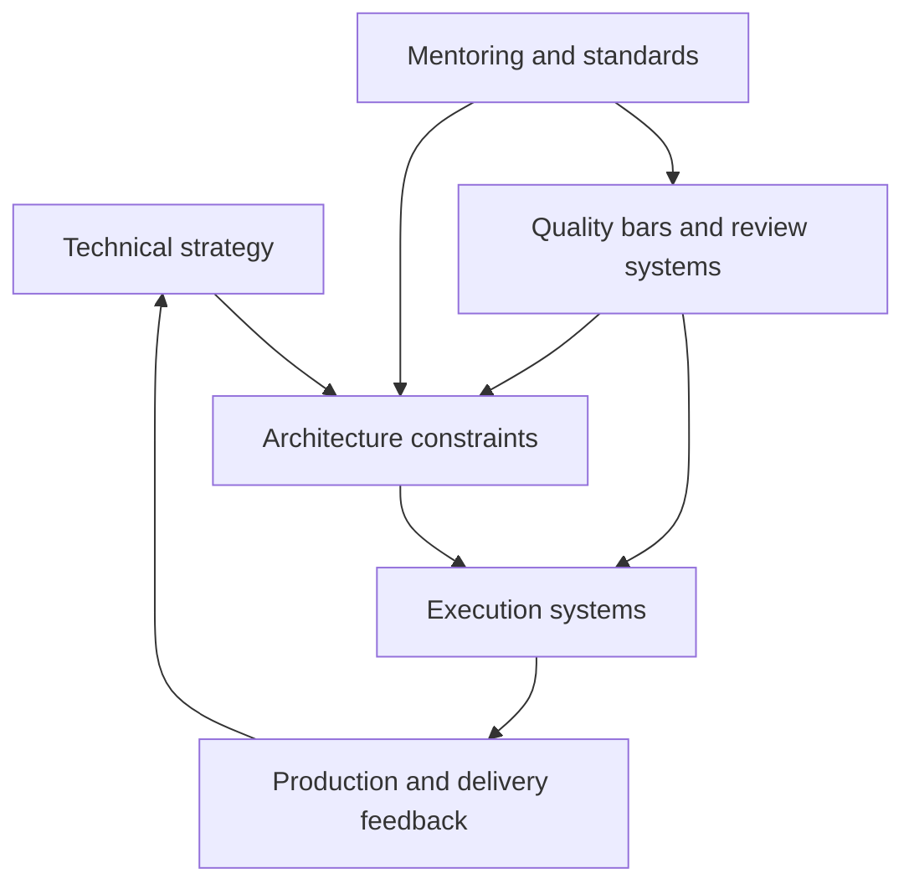
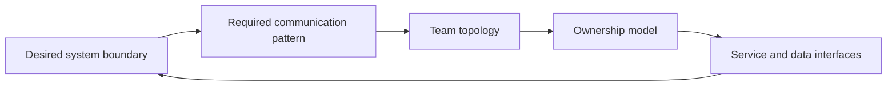
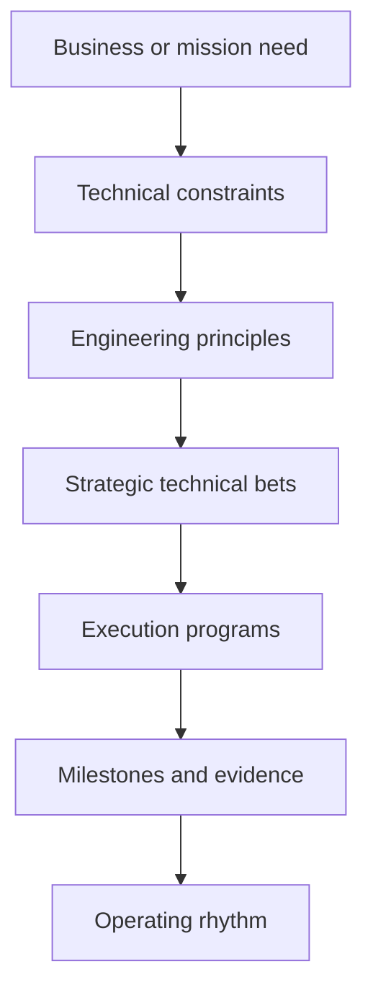
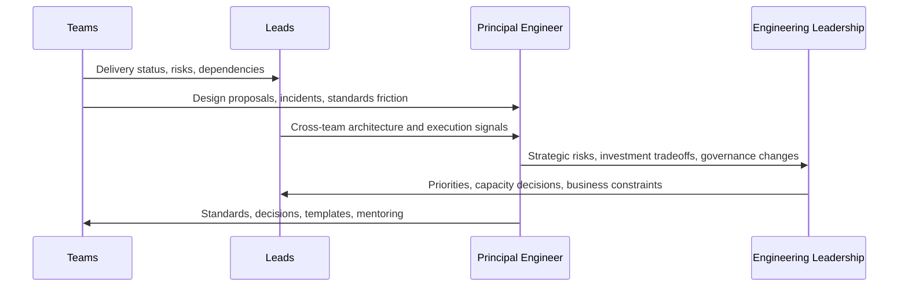
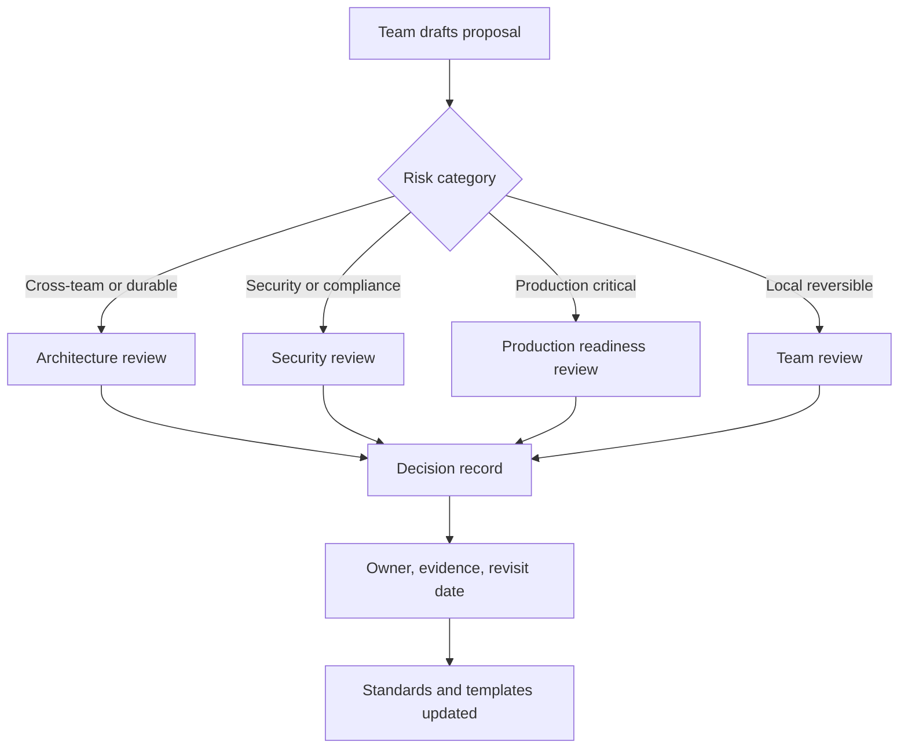
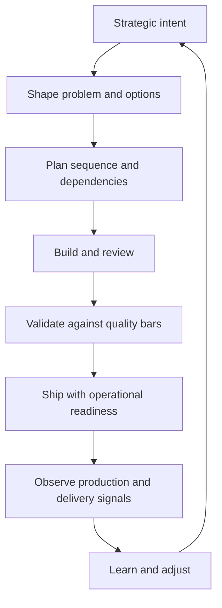

# Technical Leadership and Execution

Technical leadership converts judgment into repeatable organizational capability. It is not the act of making every hard decision personally. It is the work of shaping strategy, standards, architecture, execution systems, and communication so that many engineers can make better decisions without waiting for permission.

The test of technical leadership is whether the organization becomes more capable after the leader leaves the room.

## Executive model

Technical leadership operates across five connected systems:

| System | Leadership question | Primary outputs | Failure mode |
| --- | --- | --- | --- |
| Strategy | What technical direction makes the business more likely to win? | Technical strategy, bets, sequencing, investment themes | Local optimization and disconnected initiatives |
| Architecture | What constraints make good outcomes easier and bad outcomes harder? | Boundaries, standards, platform contracts, governance | Diagrams with no enforcement or adoption |
| Execution | How does work move from intent to reliable production change? | Operating rhythm, planning cadence, dependency management, readiness checks | Busy teams with weak delivery truth |
| Quality | What level of evidence is required before we trust a change? | Review systems, test strategy, quality bars, incident learning | Review theater or hero-based quality |
| People | How do engineers learn judgment and increase ownership? | Mentoring, standards, delegation, staff-plus leverage | Principal bottlenecks and fragile expertise |



## Conway's Law

Conway's Law: organizations design systems that mirror their communication structures.

Use Conway's Law as a design input, not as a complaint after the architecture becomes painful.

| Organizational reality | Architectural implication | Leadership response |
| --- | --- | --- |
| Two teams have weak coordination | Avoid a hot path that requires frequent cross-team changes | Create clearer ownership, an API contract, or a platform boundary |
| One domain has one accountable team | Give that team service, data, and runtime ownership | Align roadmap, support model, and incident accountability |
| A shared component has many consumers | Treat it as a product, not a library someone happens to own | Define SLOs, versioning, docs, adoption path, and deprecation rules |
| Product teams need speed but share infrastructure | Build paved roads with escape hatches | Make the default easy and the exception explicit |
| Many teams touch the same schema | Data ownership is unclear | Assign domain ownership, migration rules, and compatibility guarantees |
| Operations and product ownership are separated | Incidents become handoffs | Reconnect on-call, readiness, and service ownership |

### Reverse Conway maneuver

The reverse Conway maneuver intentionally changes team boundaries so the desired architecture becomes easier to build.



Use a reverse Conway maneuver when:

- The target architecture requires a stronger boundary than the current org structure supports.
- A platform capability needs product management, documentation, and support, not only code ownership.
- A domain is split across too many teams for coherent data and behavior decisions.
- A shared service has become a coordination sink.

Avoid it when:

- The problem is only missing documentation or an unclear API.
- Teams are already overloaded and the reorg would reduce delivery capacity.
- The architecture is not yet understood well enough to justify moving people.
- The proposed team boundary optimizes leadership charts instead of operational ownership.

### Conway diagnostic checklist

- [ ] Does every critical runtime path have one accountable owning team?
- [ ] Does every shared service have an explicit consumer contract?
- [ ] Can a team change its owned service without negotiating with unrelated teams?
- [ ] Are data ownership, schema migration authority, and backfill responsibility clear?
- [ ] Do incident responders have authority to change the systems they operate?
- [ ] Are platform teams measured by adoption, reliability, and developer experience?
- [ ] Are cross-team dependencies visible before planning commitments are made?
- [ ] Are escalation paths explicit for boundary disputes?

## Technical strategy

A technical strategy is a set of choices that concentrates engineering effort on the constraints that matter most. It is not a list of all desirable improvements.

Strategy should explain:

- The current technical reality.
- The desired future state.
- The constraints that shape the path.
- The explicit bets being made.
- The choices intentionally not being made.
- Which decisions are reversible and which are expensive to reverse.
- The sequence of investments.
- The risks and kill criteria.
- The metrics used to learn.
- The owners and decision checkpoints.

### Strategy contents

| Section | Purpose | Good signal | Weak signal |
| --- | --- | --- | --- |
| Context | Establish why strategy is needed now | Links engineering work to business, reliability, cost, security, or speed constraints | Generic modernization language |
| Current state | Make reality inspectable | Names known bottlenecks, incidents, costs, and friction | Lists preferences without evidence |
| Desired state | Define the target operating model | Describes capabilities and constraints, not only technologies | Vendor or framework shopping |
| Bets | Concentrate investment | States what must be true for the bet to pay off | Many safe statements nobody can argue with |
| Non-goals | Protect focus | Names tempting work that is out of scope | Everything remains implicitly possible |
| Sequence | Make execution plausible | Orders work by dependency, risk, and learning | Parallel initiatives without capacity reasoning |
| Metrics | Create feedback | Measures adoption, reliability, cycle time, cost, and quality | Vanity metrics or only completion percentage |
| Governance | Keep decisions alive | Defines review cadence and reversal triggers | Strategy published once and forgotten |

### Strategy pyramid



### Technical strategy example

| Field | Example |
| --- | --- |
| Current state | Product teams share a large deployment unit. Release coordination is slow, incident blast radius is high, and schema ownership is unclear. |
| Desired state | Teams own independently deployable services around stable domains, with shared platform capabilities for auth, observability, deployment, and data migration safety. |
| Strategic bet | Domain ownership plus platform paved roads will reduce coordination cost without creating infrastructure chaos. |
| Non-goals | We will not split every module, replace the entire stack, or create one-off service templates per team. |
| First sequence | Map domains, assign owners, define service readiness bar, extract one low-risk service, validate deployment and observability path, then repeat. |
| Metrics | Lead time, failed deployment rate, incident blast radius, number of cross-team release blockers, service readiness compliance. |
| Reversal trigger | If service count increases operational load faster than platform support reduces coordination load, pause extraction and invest in platform maturity. |

### Strategy review checklist

- [ ] Does the strategy identify the constraint that matters most?
- [ ] Does it explain why now?
- [ ] Does it state what the organization will stop doing?
- [ ] Does it connect architecture choices to delivery or reliability outcomes?
- [ ] Does it separate principles from decisions?
- [ ] Does it identify irreversible or expensive choices?
- [ ] Does it include a sequence that can survive limited capacity?
- [ ] Does it define evidence that would change the plan?
- [ ] Does every program have an accountable owner?
- [ ] Can team leads explain the strategy without repeating slogans?

## Principal engineer leverage

Principal engineer leverage comes from increasing the quality and speed of decisions across many teams. The role is measured less by personal output and more by the decision environment it creates.

High leverage activities:

- Create a shared technical narrative.
- Define quality bars that teams can apply without escalation.
- Mentor through reviews and standards.
- Remove architectural bottlenecks.
- Standardize recurring decisions.
- Build tools that shorten feedback loops.
- Intervene in high-risk designs early.
- Turn incidents into systemic improvements.
- Translate business ambiguity into technical options.
- Make invisible constraints visible before planning locks.

Low leverage traps:

- Becoming the only reviewer.
- Owning every hard decision personally.
- Replacing team accountability with heroics.
- Writing strategy without adoption mechanisms.
- Treating architecture as diagrams instead of constraints.
- Saying yes to every escalation.
- Using influence to preserve personal taste instead of organizational capability.
- Measuring impact only by code volume.

### Leverage ladder

| Level | Activity | Scope of impact | Sustainability |
| --- | --- | --- | --- |
| Do | Personally solve a hard problem | One system or team | Low if repeated too often |
| Pair | Help another engineer solve it | One engineer and one system | Medium |
| Review | Improve a decision before it ships | Team or program | Medium |
| Standardize | Turn a recurring decision into a pattern | Many teams | High |
| Automate | Put the standard into tooling | Whole organization | High |
| Govern | Create a feedback loop around the standard | Whole organization over time | Highest |

### Principal engineer allocation model

| Time horizon | Focus | Typical artifacts |
| --- | --- | --- |
| Daily | Unblock high-risk work, review critical decisions, protect quality bars | Review comments, risk notes, escalation decisions |
| Weekly | Align execution with strategy, resolve dependencies, improve standards | Architecture review agenda, decision records, planning feedback |
| Monthly | Reassess technical bets, audit ownership, update platform roadmap | Strategy update, risk register, capability map |
| Quarterly | Shape investment themes and organizational capability | Technical roadmap, org design input, governance changes |

### When a principal should intervene

Intervene early when:

- A decision is hard to reverse.
- The blast radius crosses team or customer boundaries.
- The architecture changes ownership or operational responsibility.
- The team lacks prior experience with the risk class.
- The decision sets a precedent for many future decisions.
- The plan optimizes local delivery while increasing global complexity.

Avoid intervention when:

- The decision is reversible and within team ownership.
- The team has a clear quality bar and feedback loop.
- The risk is contained.
- The main issue is style preference.
- The intervention would remove learning ownership from the team.

## Engineering operating rhythm

Operating rhythm is the cadence by which engineering turns signals into decisions. Good rhythm prevents drift. Bad rhythm creates meetings that do not change behavior.

### Weekly rhythm

| Cadence item | Purpose | Inputs | Outputs |
| --- | --- | --- | --- |
| Reliability review | Detect production risk early | Incidents, SLOs, alerts, error budgets | Remediation owners, risk acceptance, follow-up dates |
| Delivery review | Understand execution truth | Roadmap status, blockers, dependency graph | Replanned commitments, escalation paths |
| Architecture office hours | Pull risk forward | Design sketches, ADR drafts, migration plans | Feedback, review routing, decision criteria |
| Dependency triage | Prevent hidden blockers | Cross-team requests, vendor constraints, platform queues | Dependency owner, date, fallback plan |
| Standards review | Keep quality bars current | Review findings, incidents, repeated defects | Updated templates, checks, examples |

### Monthly rhythm

| Cadence item | Purpose | Outputs |
| --- | --- | --- |
| Strategy refresh | Reconcile strategy with new evidence | Updated bets, changed priorities, stopped work |
| Ownership audit | Find orphaned systems and ambiguous boundaries | Ownership map changes, service catalog updates |
| Tech debt review | Rank debt by risk and opportunity cost | Funded remediation, accepted debt, retired complaints |
| Platform review | Evaluate developer experience and platform adoption | Paved road improvements, support model changes |
| Architecture governance review | Check whether governance is helping flow | Review threshold changes, template updates |

### Operating rhythm diagram



### Operating rhythm health checklist

- [ ] Meetings produce decisions, owners, and dates.
- [ ] Production signals influence planning.
- [ ] Planning commitments include dependency risk.
- [ ] Architecture reviews happen before implementation is locked.
- [ ] Decisions are recorded where future teams can find them.
- [ ] Follow-ups are closed or explicitly accepted as risk.
- [ ] Standards are updated when incidents expose gaps.
- [ ] Review load is measured and reduced when it becomes a bottleneck.

## Architecture governance

Architecture governance is the system that helps teams make coherent technical decisions without centralizing every choice. Good governance is lightweight, risk-based, and educational.

It should answer:

- Which decisions need review?
- Who reviews them?
- What evidence is required?
- What standards apply?
- How are exceptions approved?
- How are decisions revisited?
- How do teams learn from prior decisions?

### Governance by decision risk

| Decision type | Review level | Evidence required | Example |
| --- | --- | --- | --- |
| Local reversible implementation detail | Team review | Code review and tests | Internal refactor |
| Local durable design choice | Team design review | Design note, migration plan, test plan | New module boundary |
| Cross-team interface | Architecture review | API contract, ownership, versioning, support model | Shared platform API |
| Data ownership or migration | Architecture plus data review | Backward compatibility, rollback, audit, backfill plan | Customer data schema split |
| Security or compliance boundary | Security review | Threat model, controls, logging, access model | New auth flow |
| Production critical system | Readiness review | SLOs, runbooks, observability, capacity, incident owner | Payments pipeline |
| Irreversible platform bet | Leadership review | Strategy alignment, cost model, exit plan, adoption plan | Cloud provider or database migration |

### Governance workflow



### Governance anti-patterns

| Anti-pattern | Symptom | Correction |
| --- | --- | --- |
| Review board as permission gate | Teams wait weeks for approval | Define risk thresholds and delegate low-risk decisions |
| Architecture by taste | Feedback is opinion-heavy and inconsistent | Publish decision criteria and examples |
| Exceptions without expiry | Temporary choices become permanent | Require owner, date, and reversal condition |
| Governance after implementation | Review can only approve or block | Require early design review for high-risk work |
| No adoption path | Standards exist but teams do not use them | Provide templates, tooling, migration help, and examples |

### Architecture review checklist

- [ ] Is the problem statement clear and evidence-based?
- [ ] Are the options real alternatives, not one proposal plus strawmen?
- [ ] Are ownership and operational responsibilities explicit?
- [ ] Are interfaces, data contracts, and compatibility rules specified?
- [ ] Are failure modes and rollback paths credible?
- [ ] Are security, privacy, cost, and reliability risks addressed?
- [ ] Are dependencies and sequencing visible?
- [ ] Is the decision reversible? If not, is the evidence strong enough?
- [ ] Are metrics defined for adoption and outcome?
- [ ] Is there a revisit trigger?

## Review systems

Review systems convert expertise into shared judgment. A good review system is explicit enough to be teachable and lightweight enough to preserve flow.

Good review systems:

- Have explicit criteria.
- Focus on risk.
- Teach judgment.
- Preserve flow.
- Escalate only meaningful ambiguity.
- Link decisions to future evidence.
- Reduce repeated feedback by updating standards and tools.

Review types:

- Code review.
- Design review.
- Production readiness review.
- Security review.
- Data migration review.
- Incident review.
- Architecture review.
- Operational readiness review.
- Dependency review.

### Review routing matrix

| Change characteristic | Review needed | Reviewer profile |
| --- | --- | --- |
| Small local change with tests | Code review | Team peer |
| New public API | Design and code review | Team peer plus API owner |
| Shared library change | Code review plus consumer impact review | Maintainer and representative consumer |
| User data migration | Data migration review | Data owner, service owner, operations |
| New external dependency | Dependency review | Owning team, security, platform if needed |
| New production service | Readiness review | Service owner, SRE or platform, security if exposed |
| Cross-domain architecture | Architecture review | Domain owners and principal or staff reviewer |
| Incident remediation | Incident review | Service owner, affected teams, quality owner |

### Review quality rubric

| Dimension | Weak review | Strong review |
| --- | --- | --- |
| Correctness | Spots syntax or obvious bugs | Tests assumptions, invariants, and edge cases |
| Design | Comments on personal style | Evaluates boundaries, coupling, ownership, and reversibility |
| Risk | Treats all issues equally | Prioritizes blast radius and failure modes |
| Evidence | Says "seems fine" | Asks for or verifies meaningful evidence |
| Teaching | Gives commands | Explains the principle behind the request |
| Flow | Blocks on minor preferences | Separates required changes from suggestions |

### Review comment template

Use this shape for high-signal review comments:

```text
Concern: <what could go wrong>
Reason: <why this matters, including risk or invariant>
Evidence: <line, test, incident, metric, or standard>
Request: <specific required change or question>
Severity: <blocking, should fix, suggestion>
```

Example:

```text
Concern: The migration assumes all rows have a valid workspace_id.
Reason: Historical imports created rows before workspace assignment was enforced, so this can fail during backfill.
Evidence: Import path before 2025-03 did not require workspace_id.
Request: Add a preflight query and a remediation path before the migration runs.
Severity: blocking
```

### Review system checklist

- [ ] Review criteria are documented.
- [ ] Review routing is based on risk, not title.
- [ ] Reviewers label blocking feedback clearly.
- [ ] Repeated feedback becomes a standard, lint rule, template, or example.
- [ ] Teams can make low-risk decisions without central approval.
- [ ] High-risk decisions are reviewed before implementation locks in.
- [ ] Review latency is measured.
- [ ] Reviewers are rotated and mentored.
- [ ] Review outcomes are connected to later production evidence.

## Decision quality

Decision quality is the quality of the reasoning process given the information available at the time. It is not the same as outcome quality. A good decision can have a bad outcome if reality changes. A bad decision can get lucky.

### Decision record

Every significant decision should answer:

- What are we deciding?
- Why does this decision matter now?
- What constraints matter?
- What options exist?
- What evidence supports each option?
- What are the consequences?
- What would make us reverse this?
- Who owns follow-up?
- When will we revisit the decision?

### Decision classification

| Decision class | Reversibility | Recommended process |
| --- | --- | --- |
| Type 1 | Expensive or impossible to reverse | Slow down, gather evidence, review broadly, document carefully |
| Type 2 | Reversible with moderate cost | Decide with accountable owner, instrument outcome, revisit |
| Type 3 | Local and easily reversible | Let the team decide, review through normal code or design review |

### Decision quality checklist

- [ ] The decision is phrased as a choice, not as an implementation task.
- [ ] Constraints are separated from preferences.
- [ ] At least two real options are considered.
- [ ] The recommended option has explicit tradeoffs.
- [ ] The decision names who benefits and who pays the cost.
- [ ] Unknowns are stated.
- [ ] Reversal criteria are explicit.
- [ ] The follow-up owner has authority to act.
- [ ] The decision record is discoverable.

### ADR template

```text
# ADR: <decision title>

Date: <YYYY-MM-DD>
Status: Proposed | Accepted | Superseded
Owner: <team or role>
Reviewers: <teams or roles>

## Context

<What is happening, why now, and what constraints matter.>

## Decision

<The choice being made.>

## Options considered

| Option | Benefits | Costs | Risks | Reversibility |
| --- | --- | --- | --- | --- |
| <option> | <benefits> | <costs> | <risks> | <high, medium, low> |

## Consequences

<Expected operational, delivery, cost, security, and ownership effects.>

## Evidence and validation

<Tests, metrics, incidents, prototypes, benchmarks, or user evidence.>

## Reversal or revisit criteria

<What would cause us to change this decision.>

## Follow-up

| Action | Owner | Due date | Evidence |
| --- | --- | --- | --- |
| <action> | <owner> | <date> | <evidence> |
```

## Execution systems

Execution systems make delivery truth visible. They connect strategy to shipped, operated, and learned-from changes.

Strong execution is not the same as aggressive commitment. Strong execution means the organization can see work clearly, sequence it honestly, manage dependencies, preserve quality, and adapt when evidence changes.

### Execution loop



### Execution control points

| Control point | Question | Evidence |
| --- | --- | --- |
| Intake | Should this work exist? | Strategy link, user impact, risk reduction, opportunity cost |
| Shaping | Is the problem understood enough to plan? | Problem statement, options, constraints, success criteria |
| Planning | Can the sequence survive reality? | Dependencies, capacity, milestones, fallback plan |
| Readiness | Is the change safe to expose? | Tests, observability, rollback, runbook, support owner |
| Launch | Are we learning safely? | Rollout plan, metrics, alerting, incident owner |
| Follow-up | Did the work produce the intended outcome? | Outcome metrics, incident review, adoption data |

### Planning artifact checklist

- [ ] Problem statement includes user, business, or operational impact.
- [ ] Success criteria are observable.
- [ ] Scope and non-scope are explicit.
- [ ] Dependencies have owners and dates.
- [ ] Risks have mitigations or acceptance.
- [ ] Rollout and rollback are described.
- [ ] Quality bars are named before implementation starts.
- [ ] Milestones prove learning, not only activity.
- [ ] Work is sliced so partial delivery creates value or reduces risk.

### Execution risk register template

```text
| Risk | Impact | Likelihood | Owner | Mitigation | Trigger | Status |
| --- | --- | --- | --- | --- | --- | --- |
| <risk> | <customer, delivery, cost, security, reliability impact> | <low, medium, high> | <owner> | <action> | <signal that risk is materializing> | <open, accepted, mitigated> |
```

## Dependency management

Dependencies are commitments between teams. They need ownership, dates, fallback paths, and escalation rules.

Poor dependency management creates hidden queues. Technical leaders make those queues visible before teams commit to plans.

### Dependency types

| Dependency type | Example | Management tactic |
| --- | --- | --- |
| Technical dependency | Platform API required before product work can ship | Contract-first design, early integration test, fallback path |
| Data dependency | Migration must finish before feature rollout | Preflight checks, phased backfill, compatibility window |
| Organizational dependency | Another team owns a required service | Named owner, planning commitment, escalation path |
| Vendor dependency | External provider must approve or deliver capability | Deadline buffer, alternative provider, degraded mode |
| Compliance dependency | Legal or security approval required | Early review, evidence packet, clear risk acceptance |
| Operational dependency | On-call or support model not ready | Readiness checklist, runbook, training, launch gate |

### Dependency board template

```text
| Dependency | Needed by | Providing team | Owning person | Required date | Current status | Fallback | Escalation date |
| --- | --- | --- | --- | --- | --- | --- | --- |
| <dependency> | <consumer> | <provider> | <owner> | <date> | <status> | <fallback> | <date> |
```

### Dependency management checklist

- [ ] Each dependency has one named accountable owner.
- [ ] The provider and consumer agree on the contract.
- [ ] The required date is tied to a milestone, not a vague quarter.
- [ ] The fallback plan is credible.
- [ ] Integration risk is tested early.
- [ ] Escalation happens before the plan is already broken.
- [ ] Dependencies are reviewed in the operating rhythm.
- [ ] Completed dependencies are validated by the consuming team.

## Org design and ownership

Org design is an architecture decision. Team boundaries determine communication paths, incentives, operational responsibility, and the cost of change.

### Ownership model

| Ownership area | Definition | Required clarity |
| --- | --- | --- |
| Product ownership | Who decides what user outcome matters | Product goals, roadmap priority, success metrics |
| Technical ownership | Who decides implementation and architecture | Service boundaries, standards, technology choices |
| Operational ownership | Who responds when it breaks | On-call, runbooks, SLOs, incident authority |
| Data ownership | Who defines meaning, schema, access, and lifecycle | Data contracts, privacy, retention, migration authority |
| Platform ownership | Who provides reusable capabilities | API contracts, support model, adoption path, deprecation policy |

### Team topology patterns

| Team type | Purpose | Leadership concern |
| --- | --- | --- |
| Stream-aligned team | Owns a user or business flow end to end | Give it enough autonomy and platform support |
| Platform team | Provides internal capabilities that reduce cognitive load | Treat platform as a product with adoption metrics |
| Enabling team | Helps other teams learn a capability | Avoid permanent dependency and measure skill transfer |
| Complicated subsystem team | Owns specialized technical domain | Protect expertise while preventing an ivory tower |

### Ownership smell catalog

| Smell | Consequence | Fix |
| --- | --- | --- |
| Many teams can change a service but none operate it | Incidents become blame and delay | Assign operational owner and change authority |
| Platform team builds without product feedback | Low adoption and shadow tooling | Add product management, support intake, and adoption metrics |
| Domain data is owned by infrastructure | Business rules drift into technical layers | Move semantic ownership to domain team |
| Team owns code but not roadmap | Technical debt accumulates without funding | Align roadmap capacity with ownership responsibilities |
| Service has no deprecation owner | Dead paths remain forever | Add lifecycle owner and retirement process |

### Org and architecture review questions

- [ ] Does the proposed team structure reduce coordination on high-frequency work?
- [ ] Does each team have the authority required for its accountability?
- [ ] Are shared capabilities owned as products?
- [ ] Are support and on-call responsibilities aligned with change authority?
- [ ] Are domain boundaries reflected in data ownership?
- [ ] Are experts enabling others or becoming permanent gatekeepers?
- [ ] Does the org design make the desired architecture easier to evolve?

## Communicating tradeoffs

Technical leaders communicate tradeoffs so stakeholders can make informed decisions. The goal is not to win a technical argument. The goal is to expose cost, risk, timing, reversibility, and uncertainty in language the audience can act on.

### Tradeoff framing

| Technical concern | Stakeholder translation |
| --- | --- |
| Coupling | Future changes will require coordination across more teams |
| Latency | Users will wait longer or workflows will feel slower |
| Operational complexity | Incidents will be harder to diagnose and resolve |
| Migration risk | Existing customers or data may be affected during transition |
| Vendor lock-in | Future negotiation and exit options become weaker |
| Test coverage gap | We have less evidence that the change behaves correctly |
| Inconsistent patterns | Engineers will spend more time rediscovering local rules |
| Missing observability | We may not know quickly when the system is failing |

### Tradeoff memo template

```text
# Tradeoff memo: <topic>

## Decision needed

<The decision stakeholders must make.>

## Recommendation

<The recommended option and why.>

## Options

| Option | Benefit | Cost | Risk | Reversibility | Time impact |
| --- | --- | --- | --- | --- | --- |
| <option> | <benefit> | <cost> | <risk> | <high, medium, low> | <impact> |

## What we know

<Evidence and constraints.>

## What is uncertain

<Important unknowns and how we will reduce them.>

## Decision deadline

<Date or event that creates urgency.>

## Consequences of waiting

<What gets worse, better, or remains optional if no decision is made.>
```

### Executive communication checklist

- [ ] Start with the decision needed.
- [ ] State the recommendation before the details.
- [ ] Translate technical risk into business or operational impact.
- [ ] Separate facts, assumptions, and opinions.
- [ ] Name cost, timing, and reversibility.
- [ ] Identify the decision deadline.
- [ ] Explain what happens if no decision is made.
- [ ] Avoid jargon unless the audience already uses it.
- [ ] End with a clear ask.

## Mentoring through standards

Mentoring scales when expectations are visible and reusable. A standard is a teaching tool when it explains the reason behind the rule and includes examples.

Good standards:

- Encode lessons from incidents and reviews.
- Explain the principle, not only the rule.
- Include examples of acceptable and unacceptable patterns.
- Are easy to apply during planning and review.
- Are enforced by tooling where possible.
- Have an exception process.
- Are periodically retired or simplified.

### Mentoring modes

| Mode | Use when | Output |
| --- | --- | --- |
| Pairing | The engineer needs live judgment transfer | Shared implementation and reasoning |
| Review | The work is mostly ready but needs quality feedback | Specific corrections and general principle |
| Design critique | The problem framing or boundary is unclear | Better options and decision criteria |
| Written standard | The same issue appears repeatedly | Durable guidance and examples |
| Office hours | Many teams need access to expertise | Faster routing and shared learning |
| Post-incident teaching | Production exposed a systemic gap | Updated standard, training, and checks |

### Standard template

```text
# Standard: <name>

## Purpose

<What risk this standard reduces or what capability it enables.>

## Applies to

<Systems, teams, change types, or contexts.>

## Rule

<The expected practice.>

## Rationale

<Why the rule exists.>

## Examples

### Good

<Concrete acceptable pattern.>

### Avoid

<Concrete pattern that creates risk.>

## Exceptions

<Who can approve exceptions, what evidence is required, and when to revisit.>

## Enforcement

<Review checklist, lint rule, CI check, template, or readiness gate.>
```

### Mentoring checklist for staff-plus engineers

- [ ] Give the principle behind feedback.
- [ ] Distinguish blocker, recommendation, and preference.
- [ ] Ask the engineer to explain the tradeoff back.
- [ ] Turn repeated comments into a standard or tool.
- [ ] Delegate decisions when risk is contained.
- [ ] Preserve team ownership after giving advice.
- [ ] Follow up on outcomes, not only implementation.
- [ ] Publicly document patterns so access to judgment is not relationship-based.

## Examples

### Example: service extraction decision

| Dimension | Assessment |
| --- | --- |
| Problem | A domain inside a monolith changes frequently and blocks unrelated releases. |
| Constraint | The team does not yet have mature service observability or on-call experience. |
| Option A | Keep module in monolith and improve internal boundaries. |
| Option B | Extract service immediately. |
| Option C | Create an internal module boundary, add ownership and metrics, then extract after readiness criteria are met. |
| Recommendation | Option C, because it reduces coordination cost while avoiding premature distributed-system complexity. |
| Quality bar | Clear domain API, migration plan, telemetry, rollback, service readiness checklist. |
| Revisit trigger | If the module boundary still blocks release flow after two planning cycles, restart extraction review. |

### Example: platform adoption problem

| Symptom | Diagnosis | Leadership action |
| --- | --- | --- |
| Teams bypass the deployment platform | The platform optimizes central control more than team flow | Interview consumers, measure friction, simplify paved road, publish escape hatch |
| Platform team says teams are noncompliant | Standards may be unclear or costly to follow | Turn requirements into templates, automation, and migration support |
| Executives see inconsistent delivery | Platform value is not tied to business outcomes | Report lead time, failed deployment rate, adoption, and support load |

### Example: incident to standard

| Incident finding | Systemic standard |
| --- | --- |
| Alert fired without actionable context | Every page must include service, symptom, likely causes, dashboard, and runbook link |
| Rollback required manual database repair | High-risk migrations require preflight, compatibility window, rollback decision point, and owner |
| Customer impact was discovered through support | Critical user journeys require synthetic checks or direct product telemetry |

## Templates

### Architecture review agenda

```text
# Architecture review: <topic>

## Desired decision

<Approve, reject, request changes, or identify missing evidence.>

## Context

<Problem, constraints, user impact, business impact.>

## Options

<Options and tradeoffs.>

## Risk areas

- Ownership:
- Data:
- Security:
- Reliability:
- Cost:
- Migration:
- Operations:

## Decision

<Decision and rationale.>

## Follow-up

| Action | Owner | Date | Evidence |
| --- | --- | --- | --- |
| <action> | <owner> | <date> | <evidence> |
```

### Production readiness checklist

- [ ] Owning team is named.
- [ ] On-call or support path is defined.
- [ ] SLO or service objective is documented.
- [ ] Dashboards show user impact and system health.
- [ ] Alerts are actionable and routed.
- [ ] Runbook covers common failure modes.
- [ ] Rollback or mitigation path is tested.
- [ ] Capacity assumptions are documented.
- [ ] Security and access controls are reviewed.
- [ ] Data backup, retention, and deletion requirements are satisfied.
- [ ] Launch plan includes staged rollout and stop criteria.
- [ ] Post-launch review date is scheduled.

### Technical initiative one-pager

```text
# Initiative: <name>

## Why now

<The constraint, opportunity, or risk.>

## Outcome

<Observable result.>

## Scope

<Included work.>

## Non-scope

<Explicit exclusions.>

## Owners

Business owner:
Technical owner:
Operational owner:

## Dependencies

| Dependency | Owner | Needed by | Fallback |
| --- | --- | --- | --- |
| <dependency> | <owner> | <date> | <fallback> |

## Risks

| Risk | Mitigation | Trigger |
| --- | --- | --- |
| <risk> | <mitigation> | <trigger> |

## Evidence of success

<Metrics, adoption, reliability, cost, or delivery signal.>
```

### Weekly technical leadership review

```text
# Weekly technical leadership review

Date: <YYYY-MM-DD>

## Reliability

- Incidents:
- Error budget or SLO concerns:
- Follow-ups at risk:

## Delivery

- Commitments at risk:
- Dependency blockers:
- Scope changes:

## Architecture

- Decisions needed:
- Reviews scheduled:
- Boundary or ownership concerns:

## Quality

- Repeated review findings:
- Standards needing updates:
- Tooling gaps:

## People and leverage

- Mentoring opportunities:
- Decisions to delegate:
- Bottlenecks to remove:
```

## Leadership failure modes

| Failure mode | How it appears | Countermeasure |
| --- | --- | --- |
| Hero architecture | One senior person must approve everything | Publish criteria, delegate low-risk decisions, mentor reviewers |
| Strategy theater | Strategy exists but does not affect planning | Tie roadmap intake and review gates to strategic bets |
| Local optimization | Teams improve their area while system complexity rises | Use cross-team architecture and dependency reviews |
| Quality drift | Standards are known but not enforced | Add automation, templates, readiness checks, and review calibration |
| Meeting gravity | Cadence grows without decisions | Require owner, decision, date, or remove the meeting |
| Debt laundry list | Every annoyance competes for attention | Rank debt by risk, cost of delay, and strategic constraint |
| Governance drag | Review slows teams without improving outcomes | Measure review latency and narrow required review thresholds |
| Mentoring by proximity | Only favored engineers receive context | Write standards, run office hours, rotate review exposure |

## Related notes

- <span className="compendium-external-reference" title="Vault-only reference">SWE Review topics</span>
- [02 Architecture and Design](/compendium/software-engineering/architecture-and-design)
- [08 Reliability Observability and Operations](/compendium/software-engineering/reliability-observability-and-operations)
- [10 Testing Verification and Quality Bars](/compendium/software-engineering/testing-verification-and-quality-bars)
- <span className="compendium-external-reference" title="Vault-only reference">AI-Enhanced Software Development</span>
