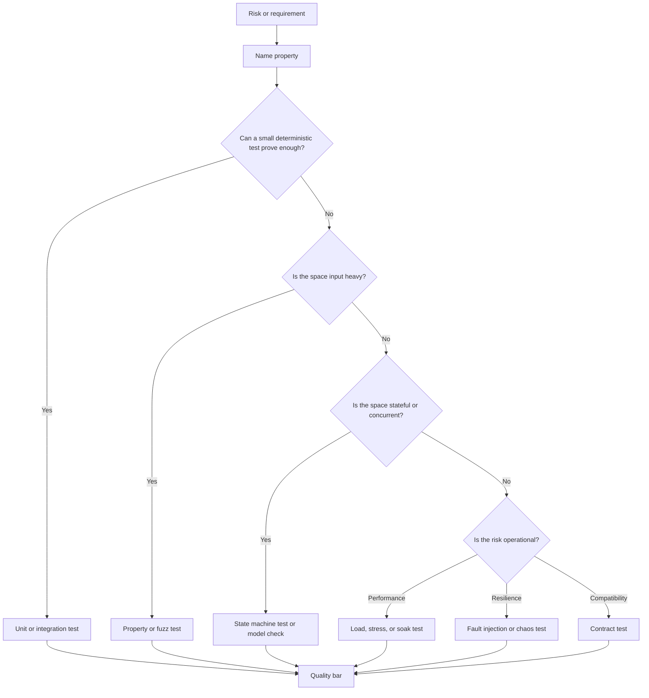
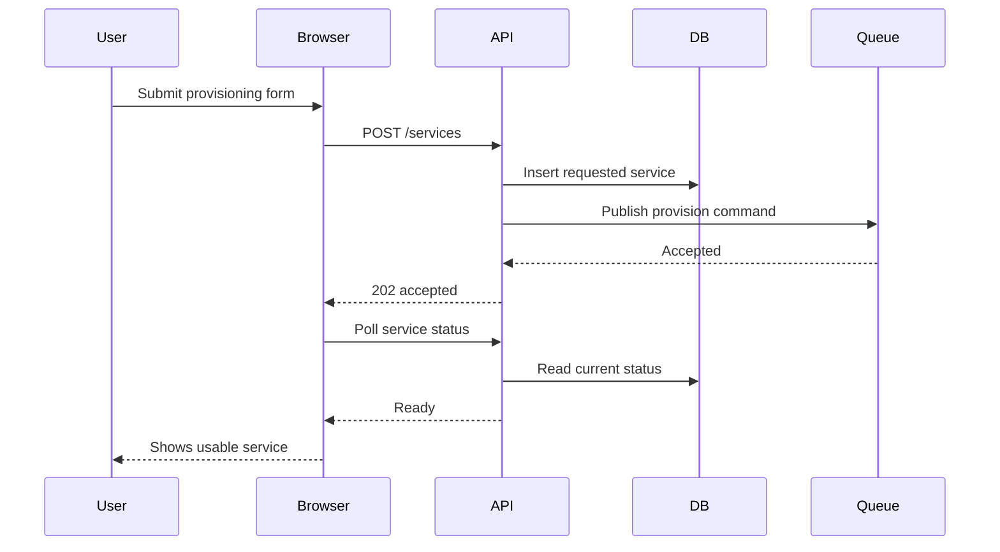
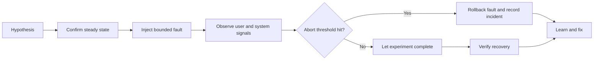
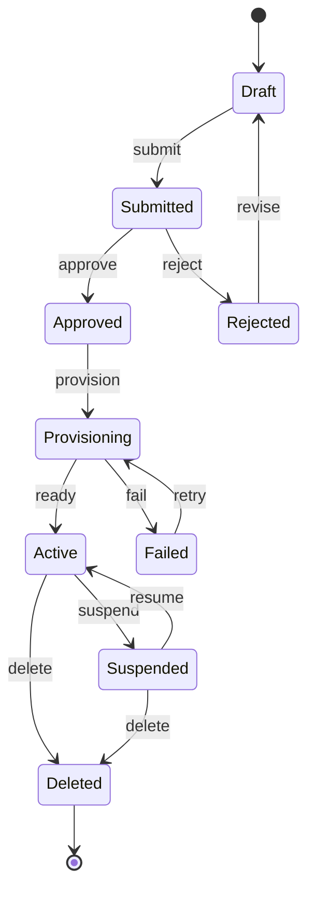

# Testing Verification and Quality Bars

Testing is not only bug detection. It is evidence for system properties: correctness, compatibility, resilience, performance, security, operability, and maintainability. A good test strategy makes claims explicit, chooses the cheapest credible evidence for each claim, and keeps the evidence trustworthy over time.

## Existing anchors

- <span className="compendium-external-reference" title="Vault-only reference">Software testing</span>
- <span className="compendium-external-reference" title="Vault-only reference">SWE Review topics</span>

## Core mental model

Tests answer questions. They do not exist because a framework supports them.

| Question | Evidence style | Common failure when missing |
|---|---|---|
| Does this local rule behave correctly? | Unit tests, property tests | Edge cases become production bugs. |
| Do our components integrate correctly? | Integration tests | Serialization, transactions, and infrastructure assumptions break. |
| Can independent teams change safely? | Contract tests | Consumer or producer changes silently break callers. |
| Does the user critical path still work? | End to end tests | Real workflows fail despite green lower level tests. |
| Does this invariant hold over many inputs? | Property based tests, fuzz tests | Hand picked examples miss input classes. |
| Does the system survive expected traffic? | Load tests | Latency, throughput, and capacity regressions ship unnoticed. |
| How does it fail beyond capacity? | Stress tests | Saturation creates cascading failure instead of graceful degradation. |
| Does it remain healthy over time? | Soak tests | Leaks, fragmentation, drift, and slow queues accumulate. |
| Does it tolerate partial failure? | Chaos tests, fault injection | Retry storms, split brain, and hidden single points of failure appear. |
| Are all important state transitions safe? | Model checking, state machine testing | Rare interleavings violate safety properties. |
| Are concurrent paths race free? | Race detection, deterministic scheduling, stress loops | Data races and deadlocks appear only under load. |

Testing strategy is a portfolio problem. Prefer many cheap, precise tests close to the code, plus a smaller number of expensive tests that cover cross boundary confidence.



## Test pyramid and risk model

The test pyramid is useful only when it is tied to risk. A low risk formatting function should not need a browser test. A distributed payment workflow should not rely only on mocked unit tests.

| Layer | Purpose | Strength | Weakness | Best use |
|---|---|---|---|---|
| Static checks | Catch type, lint, policy, dependency, and formatting issues before runtime. | Fast and broad. | Cannot prove behavior that depends on runtime state. | Type checking, forbidden APIs, dependency policy, secure defaults. |
| Unit tests | Verify one module or function with controlled collaborators. | Fast, precise failures. | Can overfit implementation and mock away reality. | Pure logic, edge cases, validation, formatting, local error handling. |
| Component tests | Test a cohesive component with real internal wiring and fake external services. | Good behavior coverage with manageable cost. | Boundary fakes can drift. | UI components, service classes, handlers, domain services. |
| Integration tests | Verify real boundaries such as database, cache, queue, object store, filesystem, network service. | Finds real configuration and protocol bugs. | Slower, more environment dependent. | Persistence, migrations, transactions, outbox, message consumers. |
| Contract tests | Verify producer and consumer expectations independently. | Enables independent deployment. | Requires disciplined versioning and schema ownership. | APIs, events, SDKs, webhooks, shared libraries. |
| End to end tests | Exercise a full user or business path. | Highest product confidence. | Expensive, flaky if overused. | Login, checkout, provisioning, restore, account deletion, critical smoke paths. |
| Exploratory tests | Human investigation guided by risk and curiosity. | Finds surprises automated tests miss. | Not repeatable unless captured. | New UX, complex workflows, operational consoles, incident reproduction. |

### Risk based selection

| Risk factor | Testing implication |
|---|---|
| Money movement | Add idempotency tests, ledger invariants, reconciliation tests, audit trail checks, replay tests. |
| Authorization | Add deny by default tests, role matrix tests, confused deputy tests, tenant isolation checks. |
| Data loss | Add backup restore tests, migration rollback tests, destructive action confirmation tests. |
| Concurrency | Add race detection, interleaving tests, lock order tests, idempotent retry tests. |
| Public API | Add contract tests, compatibility snapshots, error schema tests, version negotiation tests. |
| Distributed workflow | Add state machine tests, model checking, fault injection, retry budget tests. |
| Performance sensitive path | Add microbenchmarks, load tests, latency budget checks, capacity regression gates. |
| Security sensitive parser | Add fuzzing, malicious corpus tests, size limit tests, canonicalization tests. |

## Unit tests

Unit tests should make local behavior boring. They are most valuable when the unit has a clear contract and the test names explain the business rule being protected.

Good unit tests:

- Assert behavior, not private implementation.
- Cover nominal path, boundary values, invalid inputs, and representative failure modes.
- Use deterministic clocks, random generators, and identifiers.
- Use small fixtures that state only relevant data.
- Prefer real value objects and pure functions over broad mocks.
- Name the property being tested.

Example shape:

```typescript
describe("retry policy", () => {
  it("does not retry validation errors", () => {
    const decision = decideRetry({
      errorKind: "validation",
      attempts: 0,
      maxAttempts: 3,
    });

    expect(decision).toEqual({ retry: false, reason: "non_retryable_error" });
  });

  it("stops after the configured attempt budget", () => {
    const decision = decideRetry({
      errorKind: "timeout",
      attempts: 3,
      maxAttempts: 3,
    });

    expect(decision.retry).toBe(false);
  });
});
```

Unit test anti-patterns:

| Anti-pattern | Why it hurts | Better approach |
|---|---|---|
| One assertion per implementation line | Locks in refactors. | Assert externally visible behavior. |
| Mocking every dependency by default | Tests the mock graph, not the system. | Use real collaborators when cheap and stable. |
| Golden snapshots for dynamic output | Hides meaning in large diffs. | Assert semantic fields and use focused snapshots sparingly. |
| Random values without seeds | Creates non-reproducible failures. | Use deterministic generators or print the seed. |
| Test names like "works" | Does not document the property. | Name condition, action, and expected result. |

## Integration tests

Integration tests verify that the code works with real infrastructure semantics. They should cover the assumptions that mocks usually hide.

Common integration targets:

- Database constraints, transactions, migrations, isolation levels, and query plans.
- Queue delivery, redelivery, dead letter behavior, ordering, and idempotency.
- Object storage consistency, permissions, and multipart behavior.
- Cache expiry, stampede protection, serialization, and invalidation.
- HTTP clients, retries, timeouts, status handling, and backoff.
- Filesystem permissions, atomic rename behavior, and cleanup.

Integration test checklist:

| Area | Questions |
|---|---|
| Data setup | Is the fixture minimal, isolated, and cleaned up? |
| Transactions | Are rollback, duplicate, and partial commit cases covered? |
| Time | Are clocks controlled enough to avoid sleeps? |
| External behavior | Are timeouts, retries, rate limits, and authentication tested? |
| Observability | Does the failure path emit useful logs, metrics, and traces? |
| Cleanup | Does the test leave no durable resources behind? |

Example:

```typescript
it("deduplicates redelivered webhook events", async () => {
  const event = makeWebhookEvent({ id: "evt_123", type: "invoice.paid" });

  await handleWebhook(event);
  await handleWebhook(event);

  const invoices = await db.invoiceEvents.findMany({
    where: { providerEventId: "evt_123" },
  });

  expect(invoices).toHaveLength(1);
});
```

## Contract tests

Contract tests protect compatibility across independently deployed systems. They are stronger than mocks because they encode shared expectations and run against real producer or consumer implementations.

| Contract type | Protects | Example |
|---|---|---|
| Request response API contract | HTTP method, path, headers, auth, request shape, response shape, error shape. | Consumer expects `409 conflict` for duplicate resource creation. |
| Event contract | Topic, schema, required fields, enum compatibility, versioning rules. | Producer never removes `tenantId` from `user.created`. |
| SDK contract | Public methods, exceptions, return types, retry semantics. | SDK maps `429` to a retryable error. |
| Webhook contract | Signature, timestamp tolerance, event schema, replay behavior. | Receiver rejects stale signed payloads. |
| Database contract | Stable view, stored procedure, migration compatibility. | Old app version can read rows written by new app version. |

Compatibility rules:

- Adding optional fields is usually safe.
- Removing fields is breaking.
- Renaming fields is breaking unless both names are accepted during migration.
- Tightening validation can be breaking.
- Changing error codes can be breaking when clients branch on them.
- Changing retry semantics can be breaking even when schema stays the same.

Practical contract test:

```typescript
it("keeps the duplicate-create error contract stable", async () => {
  await api.post("/projects").send({ slug: "alpha" }).expect(201);

  const response = await api.post("/projects").send({ slug: "alpha" }).expect(409);

  expect(response.body).toMatchObject({
    code: "project_slug_conflict",
    retryable: false,
  });
});
```

## End to end tests

End to end tests should be few, stable, and mapped to critical paths. Their job is not to exhaustively test every branch. Their job is to prove the system can perform valuable work across real boundaries.

High value end to end paths:

- Sign up, verify identity, create first useful resource.
- Log in, recover session, log out.
- Checkout, invoice, refund, and reconciliation.
- Provision, update, rollback, and delete a resource.
- Import, transform, export, and verify output.
- Backup, restore, and prove restored data is usable.
- Permission denied path for cross tenant or wrong role access.

Design rules:

- Test through public interfaces.
- Keep data creation explicit and isolated.
- Avoid arbitrary sleeps. Wait for observable conditions.
- Make selectors stable and user meaningful.
- Capture artifacts on failure: screenshot, trace, console logs, server logs, network logs.
- Run a minimal smoke subset on every merge and a broader subset on schedule.



## Property based tests

Property based tests generate many examples and assert invariants that should always hold. They are ideal when the input space is large and example based tests are too narrow.

Good properties:

- Round trip: `decode(encode(x)) == x`.
- Idempotency: applying the same operation twice has the same result as once.
- Commutativity: operation order does not matter when the domain says it should not.
- Monotonicity: a value only increases or only decreases.
- Conservation: total balance, quota, inventory, or count remains consistent.
- Normalization: canonical forms compare equal.
- Authorization invariant: no generated role can access another tenant unless explicitly allowed.

Example:

```typescript
import fc from "fast-check";

it("normalization is idempotent", () => {
  fc.assert(
    fc.property(fc.string(), (input) => {
      const once = normalizeSlug(input);
      const twice = normalizeSlug(once);

      expect(twice).toBe(once);
      expect(once).toMatch(/^[a-z0-9-]*$/);
    }),
    { numRuns: 1000 }
  );
});
```

Property testing quality bar:

| Concern | Bar |
|---|---|
| Generator validity | Generators produce meaningful domain inputs, not only arbitrary noise. |
| Shrinking | Failing cases shrink to a small reproducible example. |
| Seed capture | Failures print enough seed data to reproduce. |
| Invariant strength | Properties would fail for plausible broken implementations. |
| Example complement | Important named examples still exist for readability. |

## Fuzz tests

Fuzzing searches for crashes, hangs, memory corruption, parser bugs, and unexpected behavior across huge input spaces. It is especially valuable for parsers, decoders, file formats, protocol handlers, compression, cryptography boundaries, and untrusted input.

Fuzzing targets:

- JSON, YAML, XML, CSV, Markdown, and custom parsers.
- Auth token parsing and canonicalization.
- URL, path, email, and header handling.
- Image, archive, and binary formats.
- Regular expressions exposed to user input.
- Deserialization and schema coercion.
- API request bodies and multipart uploads.

Fuzz harness principles:

- Treat crash, panic, timeout, memory leak, and sanitizer failure as bugs.
- Bound input size unless the target is size handling.
- Keep the harness deterministic.
- Seed with real examples and known regression cases.
- Save every minimized failing input as a regression corpus item.

Example harness shape:

```go
func FuzzParsePolicy(f *testing.F) {
    f.Add([]byte(`{"allow":["read"],"deny":[]}`))
    f.Add([]byte(`{}`))

    f.Fuzz(func(t *testing.T, data []byte) {
        policy, err := ParsePolicy(data)
        if err != nil {
            return
        }
        if policy == nil {
            t.Fatalf("successful parse returned nil policy")
        }
        if policy.Allows("") {
            t.Fatalf("empty permission must never be allowed")
        }
    })
}
```

## Load, stress, soak, and performance tests

Performance tests should be tied to user visible budgets and operational limits. A graph without a threshold is a demo, not a quality gate.

| Test type | Purpose | Typical duration | Main output |
|---|---|---|---|
| Microbenchmark | Measure local algorithm or hot function cost. | Seconds. | Allocation count, CPU time, regression signal. |
| Load test | Validate expected traffic and headroom. | Minutes to hours. | Throughput, latency percentiles, error rate, resource use. |
| Stress test | Find behavior beyond expected traffic. | Minutes to hours. | Saturation point, failure mode, recovery behavior. |
| Spike test | Validate abrupt traffic changes. | Minutes. | Autoscaling, queue behavior, rate limiter behavior. |
| Soak test | Reveal long running degradation. | Hours to days. | Leaks, drift, queue buildup, fragmentation, token refresh failures. |
| Capacity test | Determine maximum sustainable demand under SLO. | Hours. | Capacity model and scaling threshold. |

Example quality budget:

| Metric | Bar |
|---|---|
| Availability | 99.9 percent monthly for critical path. |
| p50 latency | Less than 100 ms for cached reads. |
| p95 latency | Less than 300 ms for standard reads. |
| p99 latency | Less than 1000 ms for critical writes. |
| Error rate | Less than 0.1 percent under expected load. |
| CPU | Less than 70 percent steady state at target load. |
| Memory | Stable after warmup, no unbounded growth over soak window. |
| Queue lag | Drains to normal after spike within defined recovery time. |

Load test example:

```javascript
import http from "k6/http";
import { check, sleep } from "k6";

export const options = {
  thresholds: {
    http_req_failed: ["rate<0.001"],
    http_req_duration: ["p(95)<300", "p(99)<1000"],
  },
  scenarios: {
    steady: {
      executor: "constant-vus",
      vus: 200,
      duration: "15m",
    },
  },
};

export default function () {
  const response = http.get(`${__ENV.BASE_URL}/api/projects`);
  check(response, {
    "status is 200": (r) => r.status === 200,
  });
  sleep(1);
}
```

Performance anti-patterns:

| Anti-pattern | Consequence | Better approach |
|---|---|---|
| Testing from a laptop over the public internet only | Network noise hides regressions. | Use controlled runners and compare against baseline. |
| Reporting only average latency | Tail latency regressions disappear. | Track p50, p95, p99, max, and error rate. |
| No warmup period | Cold start dominates results. | Separate warmup from measurement. |
| No success criteria | Results cannot gate releases. | Define thresholds before running. |
| Ignoring recovery | Systems pass steady load but fail after saturation. | Test ramp down and recovery time. |

## Chaos tests and fault injection

Chaos testing is disciplined fault injection against a system with explicit hypotheses. It is not random breakage. Start in controlled environments, prove observability, and gradually increase blast radius.

Faults worth testing:

- Dependency timeout.
- Dependency returns malformed response.
- Partial network partition.
- Slow database query.
- Read only replica lag.
- Disk full.
- Pod or process crash.
- Clock skew.
- Queue redelivery storm.
- Secret rotation.
- Certificate expiration.
- Rate limit or quota exhaustion.

Chaos experiment template:

| Field | Example |
|---|---|
| Hypothesis | If the email provider times out, checkout still completes and queues receipt delivery for retry. |
| Steady state | Checkout success rate above 99.9 percent, queue lag below 30 seconds. |
| Fault | Inject 5 second timeout for email API for 10 minutes. |
| Blast radius | Staging only, one service, one provider endpoint. |
| Abort condition | Checkout errors exceed 0.5 percent for 2 minutes. |
| Expected signal | Retry metric increases, user path succeeds, receipt queue drains after recovery. |
| Evidence | Dashboard, logs, traces, queue depth, incident notes. |



## Formal methods and model checking

Formal methods specify behavior mathematically enough that tools can explore cases humans would miss. They are most valuable when the risk is stateful, concurrent, distributed, or financially critical.

TLA+ is useful when ordinary tests cannot cover enough interleavings. It helps describe a system as state variables and actions, then checks invariants and temporal properties over possible executions.

Good targets for TLA+:

- Distributed locks.
- Consensus algorithms.
- Leader election.
- Replication protocols.
- Queue delivery protocols.
- Retry and idempotency flows.
- Payment, credit, quota, or entitlement state machines.
- Provisioning workflows.
- Authorization invariants.
- Cache invalidation protocols.
- Migration protocols with old and new versions running together.

TLA+ mental model:

- Define state variables.
- Define initial state.
- Define actions.
- Define the next state relation.
- Define safety invariants.
- Define liveness properties.
- Bound the model to a useful but finite state space.
- Let the model checker explore interleavings.
- Translate discovered counterexamples into tests and design changes.

Minimal sketch:

```text
VARIABLES state, processed

Init == state = "new" /\ processed = {}

ProcessRequest ==
  /\ state = "new"
  /\ state' = "processing"
  /\ processed' = processed

RetryRequest ==
  /\ state \in {"new", "processing"}
  /\ state' = "processing"
  /\ processed' = processed

CompleteRequest ==
  /\ state = "processing"
  /\ state' = "done"
  /\ processed' = processed \cup {"request"}

Next ==
  \/ ProcessRequest
  \/ RetryRequest
  \/ CompleteRequest

AtMostOnce == Cardinality(processed) <= 1
NoCompleteFromNew == state = "done" => "request" \in processed
```

Formal methods selection:

| Technique | Best for | Output |
|---|---|---|
| TLA+ model checking | Distributed protocols, workflows, interleavings. | Counterexamples, invariant confidence. |
| Alloy | Relational models, permissions, graph constraints. | Small counterexamples over relations. |
| SMT solvers | Constraint systems, scheduling, type level invariants. | Satisfiability or proof of unsatisfiability. |
| Type systems | Illegal states, protocol phases, data validation. | Compile time guarantees. |
| Runtime assertions | Invariants that must never be violated in production. | Fast failure and forensic signal. |
| Design by contract | Preconditions, postconditions, and class invariants. | Executable local specifications. |

Formal method anti-patterns:

- Modeling the implementation rather than the requirement.
- Using bounds so small that important states cannot appear.
- Writing invariants that are tautologies.
- Ignoring liveness and checking only safety.
- Leaving counterexamples as academic artifacts instead of converting them into engineering fixes.
- Treating a model as proof that the code implements the model.

## State machine testing

State machine testing is useful when behavior depends on history. It tests legal transitions, illegal transitions, and invariants after each transition.

Example state machine:



State machine testing checklist:

| Area | Bar |
|---|---|
| States | All states are named and observable. |
| Transitions | Legal transitions are tested from each source state. |
| Rejections | Illegal transitions fail safely with clear errors. |
| Invariants | Global invariants are checked after every action. |
| Persistence | State survives reload, retry, and process restart. |
| Idempotency | Repeating safe actions does not duplicate effects. |
| Audit | Important transitions write an audit trail. |

Example model based test idea:

```typescript
const commands = [
  submitCommand(),
  approveCommand(),
  rejectCommand(),
  reviseCommand(),
  provisionCommand(),
  failCommand(),
  retryCommand(),
  suspendCommand(),
  resumeCommand(),
  deleteCommand(),
];

fc.assert(
  fc.property(fc.commands(commands, { maxCommands: 50 }), (generated) => {
    const model = new ServiceModel();
    const real = new ServiceSystem();

    fc.modelRun(() => ({ model, real }), generated);

    expect(real.visibleTenantId()).toBe(model.tenantId);
    expect(real.hasDuplicateProvisioningJobs()).toBe(false);
  })
);
```

## Concurrency testing

Concurrency needs specialized tests because many defects require rare interleavings. The goal is to make those interleavings deliberate and reproducible.

Concurrency hazards:

| Hazard | Example | Detection |
|---|---|---|
| Data race | Two threads update shared memory without synchronization. | Race detector, thread sanitizer. |
| Lost update | Two writers read old value and overwrite each other. | Concurrent integration test, serializable transaction test. |
| Deadlock | Lock A then B in one path, B then A in another. | Lock order checks, timeout with stack capture. |
| Livelock | Workers keep retrying and no one progresses. | Progress assertions, retry budget metrics. |
| Starvation | One class of work never gets CPU, lock, or queue time. | Fairness tests, scheduler instrumentation. |
| ABA problem | Value changes away and back, compare succeeds incorrectly. | Versioned references, model checking. |
| Double execution | Redelivery and retry both perform side effects. | Idempotency tests, uniqueness constraints. |
| Visibility bug | Write is not visible across threads or processes. | Memory model tests, integration tests. |

Assertions should include both safety and liveness:

- Safety: bad thing never happens.
- Liveness: good thing eventually happens.

Testing approaches:

| Approach | Use |
|---|---|
| Race detector | Find unsynchronized shared memory access. |
| Thread sanitizer | Find data races, lock order issues, and memory synchronization problems. |
| Deterministic scheduler | Explore repeatable thread or task interleavings. |
| Stress loop | Increase probability of rare races while capturing seed and schedule. |
| Randomized interleavings | Shake out ordering assumptions. |
| Fault injection | Combine concurrency with retries, timeouts, restarts, and partial failure. |
| Timeout tests | Detect deadlock but pair with diagnostics to avoid vague failures. |
| Linearizability checking | Verify concurrent operation history behaves like some valid sequential order. |

Example lost update test:

```typescript
it("does not overspend quota under concurrent reservations", async () => {
  await quota.setLimit({ accountId: "acct_1", units: 10 });

  const attempts = Array.from({ length: 20 }, () =>
    quota.reserve({ accountId: "acct_1", units: 1, idempotencyKey: crypto.randomUUID() })
  );

  const results = await Promise.allSettled(attempts);
  const accepted = results.filter((result) => result.status === "fulfilled");
  const remaining = await quota.getRemaining("acct_1");

  expect(accepted).toHaveLength(10);
  expect(remaining).toBe(0);
});
```

## Race detection and deterministic schedulers

Race detectors find concrete memory safety and synchronization violations. They should run in CI for languages and runtimes that support them, and in scheduled jobs when they are too expensive for every merge.

Deterministic schedulers make concurrency reproducible by controlling when tasks yield. They are common in actor systems, async runtimes, simulations, databases, and distributed systems tests.

Deterministic scheduler strategy:

1. Replace real time with virtual time.
2. Replace real sleeps with scheduler yields.
3. Make task creation visible to the scheduler.
4. Explore schedules systematically or with a seeded random policy.
5. Record the seed and schedule on failure.
6. Minimize the failing schedule.
7. Promote the minimized schedule to a regression test.

Example pseudocode:

```text
seed = 917235
scheduler = DeterministicScheduler(seed)

scheduler.spawn("writer-a", () => reserveQuota("acct-1", 1))
scheduler.spawn("writer-b", () => reserveQuota("acct-1", 1))
scheduler.spawn("reader", () => assertQuotaNeverNegative("acct-1"))

scheduler.runUntilIdle()

assertNoInvariantViolations()
```

Concurrency quality bars:

| Bar | Rationale |
|---|---|
| Shared mutable state is minimized or isolated. | Reduces interleaving count. |
| Locks have documented order. | Prevents deadlocks. |
| Idempotency keys guard external side effects. | Prevents duplicate work under retry. |
| Timeouts are explicit and bounded. | Prevents infinite waiting. |
| Cancellation is tested. | Prevents leaked tasks and half open resources. |
| Race detector runs on relevant packages. | Catches low level hazards. |
| Failing schedules are reproducible. | Makes rare bugs fixable. |

## Test data and fixtures

Test data should make the important fact obvious and everything else quiet.

| Fixture style | Use when | Risk |
|---|---|---|
| Inline literal | Small input where every field matters. | Can clutter tests if repeated. |
| Builder | Many tests need valid defaults with small overrides. | Can hide important defaults. |
| Factory | Persistence or object graph setup is repeated. | Can create broad, slow fixtures. |
| Golden file | Output is large but semantically stable. | Can become an unread blob. |
| Corpus | Fuzzing or parser regression inputs. | Needs naming and minimization discipline. |
| Production sample | Reproducing real bugs with sanitized data. | Privacy and drift risk. |

Fixture rules:

- Keep one reason for failure per fixture.
- Do not share mutable fixtures between tests.
- Avoid global state unless reset is guaranteed.
- Put sensitive production data through explicit sanitization.
- Prefer domain builders that enforce valid defaults.
- Name regression fixtures after the bug or invariant they protect.

Example builder:

```typescript
const request = serviceRequestBuilder()
  .forTenant("tenant_a")
  .withPlan("business")
  .withRequestedCpu("2")
  .build();
```

## Test doubles

Test doubles are tools, not goals.

| Double | Meaning | Good use | Bad use |
|---|---|---|---|
| Dummy | Passed but never used. | Required constructor argument. | Hiding an unnecessary dependency. |
| Stub | Returns canned data. | Force rare branch. | Replacing a real cheap calculation. |
| Fake | Working simplified implementation. | In memory repository for domain tests. | Fake whose behavior drifts from production. |
| Spy | Records calls for later assertion. | Verify emitted event or audit call. | Asserting every private call. |
| Mock | Preprogrammed expectations. | Protocol or interaction test. | Mirroring implementation details. |
| Simulator | Models external service behavior. | Failure injection and complex protocols. | Becoming an unmaintained shadow service. |

Mock only what has a boundary cost or nondeterminism: network, time, randomness, process execution, external payments, email, object storage. Do not mock pure functions just because they are in another file.

## Quality bars

A quality bar is a release gate with named evidence. It should be explicit enough that two reviewers reach the same decision.

Definition of done for critical software:

- Invariants named.
- Failure modes listed.
- Tests match risk.
- Observability added.
- Rollback defined.
- Security reviewed.
- Performance budget checked.
- Migration path documented.
- Ownership clear.
- Runbook or operational notes included.
- Evidence is linked to the change.

Example quality bar matrix:

| Change class | Required evidence |
|---|---|
| Pure UI copy | Snapshot or visual check when layout can change, accessibility check for labels. |
| Local business rule | Unit tests for accepted, rejected, boundary, and regression cases. |
| Database migration | Forward migration test, backward compatibility check, rollback or roll forward plan, data volume estimate. |
| Public API | Contract tests, compatibility notes, versioning decision, error schema tests. |
| Auth or permissions | Role matrix tests, deny by default tests, tenant isolation tests, audit event check. |
| Async workflow | Integration tests for success, retry, duplicate delivery, poison message, and cancellation. |
| Distributed protocol | Model check or state machine tests, fault injection, idempotency evidence. |
| Performance sensitive path | Benchmark or load test with threshold, baseline comparison, capacity note. |
| Security sensitive parser | Fuzz test, size limit test, malicious corpus, sanitizer or static analysis when applicable. |
| Operational change | Rollout plan, rollback plan, alerting, dashboard, runbook, ownership. |

## Review checklist

### Design and correctness

- Are the key invariants named in code, tests, or documentation?
- Does this make impossible states impossible, or at least unrepresentable at the boundary?
- Are invalid transitions rejected safely?
- Are retries idempotent?
- Are duplicate messages, duplicate requests, and replayed webhooks safe?
- Does the test suite cover retries, concurrency, and partial failure where relevant?
- Are clocks, randomness, and identifiers deterministic in tests?
- Are timeouts explicit?
- Are cancellation and cleanup tested?
- Are errors actionable?

### Contracts and compatibility

- Is the public contract stable?
- Are request, response, event, and webhook schemas versioned?
- Are migrations backward compatible with old application versions?
- Can old readers handle new writers during deploy?
- Are errors and status codes part of the contract?
- Are feature flags tested in both states?
- Is there a rollback or roll forward path?

### Security and privacy

- Are permissions least privilege?
- Are deny paths tested?
- Are tenant and account boundaries tested?
- Are logs structured and safe for secrets and personal data?
- Are parser limits explicit for size, depth, and time?
- Are dependency and supply chain checks relevant to the change?
- Are audit events written for sensitive actions?

### Operations and performance

- Is there a clear operational signal for success?
- Are metrics tied to SLOs or budgets?
- Are alerts actionable and owned?
- Does the system degrade gracefully under load?
- Is recovery from saturation tested?
- Does the runbook describe rollback, verification, and escalation?
- Are capacity assumptions documented?

## Practical testing plan template

Use this template when reviewing a nontrivial change:

| Step | Question | Output |
|---|---|---|
| 1 | What can go wrong? | Failure mode list. |
| 2 | What property should always hold? | Invariant list. |
| 3 | What evidence is cheapest and credible? | Test layer choices. |
| 4 | What must be true before release? | Quality bar. |
| 5 | What signal proves it is healthy after release? | Dashboard, alert, log, trace, audit event. |
| 6 | What is the escape hatch? | Rollback, disable flag, data repair, runbook. |

Example:

| Risk | Invariant | Evidence |
|---|---|---|
| Duplicate payment webhook. | Ledger entry is created at most once per provider event id. | Unit test for idempotency decision, integration test with duplicate event, unique database constraint. |
| Provider timeout. | User visible checkout result is not ambiguous. | Integration test with timeout, retry policy test, error contract test. |
| Concurrent refund requests. | Refunded amount never exceeds captured amount. | Concurrency test, transaction isolation test, property test over refund sequences. |
| Deploy with old workers. | Old and new workers can process events during rollout. | Contract test for event schema, migration compatibility test. |

## Testing anti-patterns

| Anti-pattern | Damage | Better bar |
|---|---|---|
| Coverage percentage as the main goal | Encourages shallow tests that execute code without proving behavior. | Track risk coverage and mutation resistant assertions. |
| Only happy path tests | Failure paths become design guesses. | Test invalid input, partial failure, retry, cancellation, and recovery. |
| Excessive end to end suite | Slow, flaky suite blocks delivery and loses trust. | Move checks down the pyramid and keep E2E critical. |
| Tests depend on order | Failures are nonlocal and hard to reproduce. | Isolate state and randomize order in CI. |
| Arbitrary sleeps | Flaky and slow. | Wait for observable condition with timeout. |
| Broad snapshots | Reviewers approve noise. | Use focused semantic assertions. |
| Mocking the database for persistence logic | Misses constraints and transactions. | Use real database integration tests. |
| No negative tests for authorization | Access control can fail open. | Maintain role and tenant denial matrix. |
| Ignoring flaky tests | Normalizes red builds. | Quarantine with owner and deadline, or fix immediately. |
| Performance tests without thresholds | Cannot block regressions. | Define p95, p99, error rate, and resource budgets. |
| Model checking without implementation tests | Proves only the model. | Use counterexamples and invariants to drive real tests. |
| Chaos testing without abort criteria | Creates unmanaged risk. | Define steady state, blast radius, and abort condition. |

## Mapping defects to better tests

| Defect found in production | Missing evidence |
|---|---|
| Null value crashes a handler. | Boundary unit test or property test. |
| Migration fails on large table. | Migration rehearsal with production scale estimate. |
| Duplicate webhook charges customer twice. | Idempotency integration test and unique constraint. |
| Client breaks after optional field becomes required. | Contract compatibility test. |
| Checkout slow during traffic spike. | Load and spike test with latency budget. |
| Service crashes after two days. | Soak test and leak detection. |
| Parser hangs on crafted input. | Fuzz test with timeout and size limit. |
| Deadlock under concurrent writes. | Deterministic scheduler or stress concurrency test. |
| Split brain creates two leaders. | TLA+ model check and fault injection. |
| Alert fires but no one knows what to do. | Runbook review and operational game day. |

## Related notes

- <span className="compendium-external-reference" title="Vault-only reference">Software testing</span>
- <span className="compendium-external-reference" title="Vault-only reference">Software Supply Chain Security</span>
- [01 Engineering Fundamentals](/compendium/software-engineering/engineering-fundamentals)
- [05 Distributed Systems](/compendium/software-engineering/distributed-systems)
- [12 Delivery Migrations and Release Engineering](/compendium/software-engineering/delivery-migrations-and-release-engineering)
